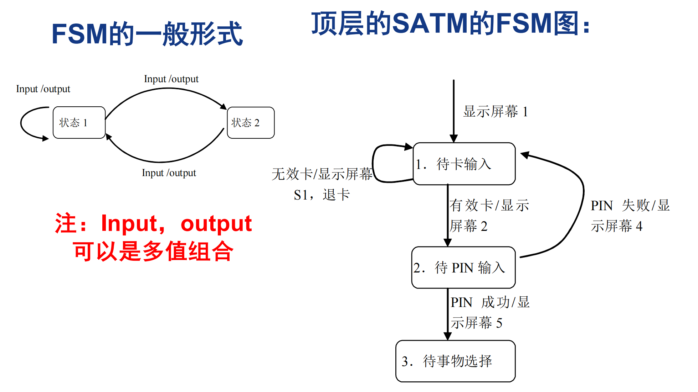
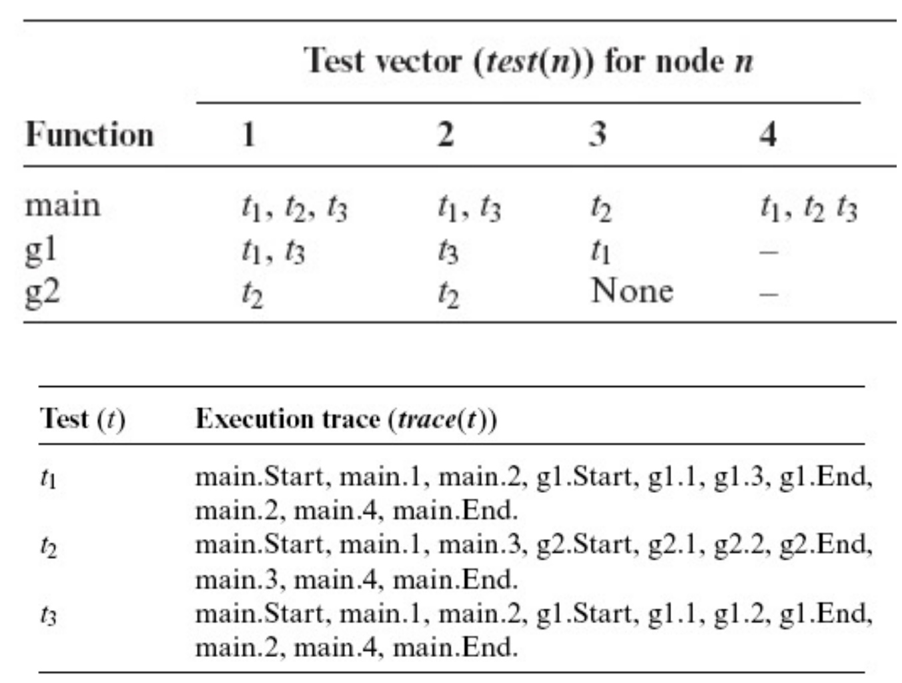
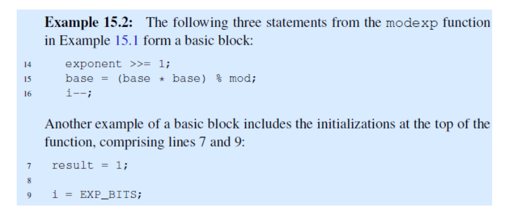
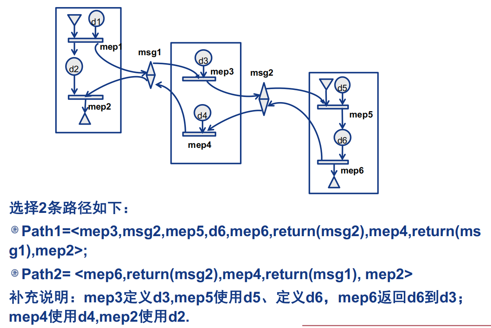

# PPT知识点

[TOC]

## 0. 考试重点

- 五道大题
- 白盒测试，数据流测试，变异测试，回归测试，集成测试

## 1. Introduction

### 1.1 Goals of testing


### 1.2  Facts About Testing

Question “does program P obey specification S” is undecidable!

- Every testing technique embodies some compromise between accuracy and computational cost
- Facts
  -  Inaccuracy is not a limitation of the technique. It is theoretically impossible to devise a completely accurate technique
  - Every practical technique must sacrifice accuracy in some way

> 每种测试技术都体现了准确性和计算成本之间的一些妥协
>
> 不准确不是技术的局限性。理论上不可能设计出完全准确的技术
>
> 每种实用技术都必须牺牲在某种程度上的准确性
>

### 1.3 Cost/benefit

- Testing takes more than 50% of the total cost of software development
  - More for critical software

- Software quality will become the dominant success criterion

### 1.4 The understanding of software test

> **软件测试：巨大的效益和艰苦的工作并存**

- Exhausted test is impossible to realized.
- Software test can not ensure to uncover all errors of a software.
- Software test can not instead of other quality insurance methods

### 1.5 一些关于error等的术语

见课本P2

### 1.6 **RIPR Model**

未能被观察到的四个必要条件

- 可访问性

  - —已达到故障
- 传染

  - —执行故障会导致错误的程序状态（错误）
- 传播

  - —受感染的状态必须导致程序输出或最终状态不正确（失败）
- 可揭示性

  - —测试人员必须观察程序状态错误部分的一部分

Four conditions necessary for a failure to be observed

- Reachability
  —The fault is reached
- Infection
  —Execution of the fault leads to an incorrect program state (error)
- Propagation
  —The infected state must cause the program output or final state to be incorrect (failure)
- Revealability
  —The tester must observe part of the incorrect portion of the program state


### 1.7 Basic principle of software test

#### Myers principle

- Early test and continual test
- Avoid test software by programmer him/her self
- Test case = input data + expected result
- Test case should include expected（valid）input data and unexpected（invalid）input data
- Test program = what it should to do + what it should not do
- The probability of existing errors is direct proportion to the errors have being uncovered.
- Check each test result roundly
- Software test is an most innovational work

#### Independent principle

**Software test should be execute by the** **group which is independent from** **development group.** 

#### Completive principle

> - Complete all test cases according to the test plan 
> - Use stated test case generate methods.
> - Reach expected object (such as coverage criteria） 
> - Draw a curve for analyze, which shows the errors for different time period. 
> - Should uncover an expected number of errors
>

- 根据测试计划完成所有测试用例

- 使用所述测试用例生成方法。

- 达到预期对象（如覆盖标准）

- 绘制一条用于分析的曲线，该曲线显示不同时间段的误差。

- 应该发现预期的错误数量

### 1.8 Steps of software test

- **Design test plan**
- **Generate test case**
- **Establish test environment** 
-  **Execute test case**
-  **Evaluate test result** 
- **Complete test documentation : test plan,** **test explain and test report** 


### 1.9 Testing and SW Development Lifecycle


### 1.10 Fault Taxonomies（故障分类）


## 3. Fundamental Theory and Methods

### 3.0 测试方法概览


### 3.1  Non-execution based Verification

- Not execute the program, tester could use some tools to review and analyze the specification and program code.
  - Walk through
  - Inspection

#### 3.1.1 Walk through

- Consist a walk through test group
- Check program code logic
- Generate test case, include input data and expect result.

- Put the data into program code, if the 
- calculate result unequal the expect result, find an error.
- Check the code line by line

##### notice

- The goal of the walkthrough team is to detect faults,  not to correct them. 
- The person leading the walkthrough guides the other members of the team through the code. 
- The walkthrough can be driven by the lists of issues compiled by team members or by the code itself,  with team members raising their concerns at the appropriate time. 
- In both cases, each issue will be discussed as it comes up and resolved into either a fault that needs to be addressed or a point of confusion that will be cleared up in the discussion

> 演练团队的目标是检测故障，而不是纠正它们。
>
> 领导演练的人指导团队的其他成员完成代码。
>
> 演练可以由团队成员编制的问题列表或代码本身驱动，团队成员在适当的时候提出他们的担忧。
>
> 在这两种情况下，每个问题都将在出现时进行讨论，并解决为需要解决的故障或将在讨论中澄清的混乱点

#### 3.1.2 Inspection

- An inspection is a far more formal activity than a code walkthrough. 
- It is conducted by a team of four to six people.

##### The review process

The review process consists of five formal steps:


##### notice

> 检查的一个重要产品是按严重程度评级的故障数量和种类。
>
> 如果一个模块通过检查，发现故障数量明显多于系统中的其他模块，那么它是重写的良好候选对象。
>
> 如果检查两个或三个模块发现大量特定类型的错误，这可能需要（重新）检查其他模块是否有类似错误。
>
> 如果必须重新加工超过5%的检查材料，团队必须重新召开会议进行全面重新检查。

- An important product of an inspection is the number and kinds of faults found rated by severity.
- If a module comes through an inspection exhibiting a significantly larger number of faults than other modules in the system, it is a good candidate for rewriting. 
- If the inspection of two or three modules reveals a large number of errors of specific types, this may warrant (re)checking other modules for similar errors.
- If more than 5 percent of the material inspected must be reworked, the team must reconvene for a full reinspection.

### 3.2  Execution-based Verification

- Use test cases to execute the program, get all results from the execution. 
- There are two basic approaches to testing modules, each with its own weaknesses. 
  - Testing to Specifications, also known as  black-box test. 
  - Testing to Code, also called glass-box, white-box test.

#### 3.2.1 Black-box test

> 试图验证模块是否符合指定的输入和输出，同时忽略实际代码
>
> 很少可能为所有可能的输入情况测试所有模块，这可能是大量的模块
>
> 等效性测试是一种基于以下想法的技术，即输入规范给出了软件产品应以相同方式工作的值范围。
>
> 边界值分析旨在用位于等价类之间边界一侧的输入值来测试产品。

- Seeks to verify that the module conforms to the specified input and output while ignoring the actual code
- It is rarely possible to test all modules for all possible input cases, which may be a huge number of modules

- Equivalence testing is a technique based on the idea that the input specifications give ranges of values for which the software product should work the same way.
- Boundary value analysis seeks to test the product with input values that lie on and just to the side of boundaries between equivalence classes.

#### 3.2.2 White-box test

> 也称为逻辑驱动或面向路径的测试。
>
> 通过代码测试每个路径通常是不可行的，即使对于简单的流程图也是如此。
>
> 此外，可以在不发现现有故障的情况下测试每条路径，因为，例如，故障在于在路径之间选择的决策标准
>
> 语句覆盖范围和相当于运行测试，其中代码中的每个语句至少执行一次。
>
> 分支覆盖率，确保每个分支点至少测试一次。
>
> 路径覆盖范围，确保每个不同的路径至少测试一次

- Also called logic-driven, or path-oriented testing.
- Testing each path through the code is generally not feasible, even for simple flowcharts.
- Moreover, it is possible to test every path without finding existing faults, because, for example, the fault lies in the decision criterion for selecting between paths

- Statement coverage and amounts to running tests in which every statement in the code is executed at least once. 
- Branch coverage, makes sure that each branching point is tested at least once.
- Path coverage, make sure that every different path is tested at least once

##### example


### 3.3 Formal verification

> 在软件测试中，"Formal verification"（形式验证）是一种高度自动化的验证方法，用于验证软件系统或算法的正确性。它基于数学和逻辑推理，通过形式化的方法来验证软件是否满足特定的规范、属性或约束。
>
> Formal verification 与传统的测试方法不同，传统测试方法主要基于样例输入和预期输出的比对，而形式验证则通过数学推理和证明来确定软件是否正确地实现了其规范。
>
> 形式验证通常涉及以下步骤：
>
> 1. 规范定义：明确定义软件的规范、属性或约束。这些规范可以是数学公式、逻辑表达式或形式化规约，描述了软件的预期行为和限制条件。
>
> 2. 模型构建：将软件系统或算法建模为数学模型，例如有限状态机、Petri 网或形式化规范语言。模型用于表示软件的状态、操作和转换规则。
>
> 3. 属性定义：基于规范，定义要验证的属性，例如安全性、一致性、死锁等。这些属性用于描述软件应满足的特定性质。
>
> 4. 形式验证工具：使用形式验证工具，例如模型检测器（model checker）或定理证明器（theorem prover），对模型和属性进行验证。这些工具利用数学和逻辑推理技术，自动或半自动地检查模型是否满足给定的属性。
>
> 5. 结果分析：分析形式验证工具的输出结果。如果工具能够证明模型满足所有属性，那么软件系统或算法在给定规范下被认为是正确的。如果发现模型不满足某些属性，就可以指导开发人员进行修复或改进。
>
> Formal verification 的优势在于它提供了严格的证明和保证，可以发现设计和实现中的逻辑错误，而不仅仅是测试中的缺陷。它特别适用于对安全关键系统、密码学算法、航空航天系统等进行验证，以确保其正确性和可靠性。然而，形式验证通常需要专业知识和大量计算资源，并且对于大型和复杂系统可能具有挑战性。因此，在实际应用中，形式验证通常与其他测试方法结合使用，以获得更全面和可靠的验证结果。

- Correctness proofs
  It is a mathematical technique for show that a product is correct, in other word, that it satisfies its specifications.
-  To see how correctness is proven, consider the fragment (next slide)
-  We now show that the code fragment is correct- after execute, the variable s will contain the sum of the n elements of array y.


### 3.4 Other methods

#### 3.4.1 Def-Use test

- Data-flow based adequacy criteria
- All definitions criterion
  -  Each definition to some reachable use
- All uses criterion
  -  Definition to each reachable use
- All def-use criterion
  -  Each definition to each reachable use

#### **3.4.2 Mutation test** (突变测试)

- Error seeding
- Introducing artificial faults to estimate the actual number of faults
- Program mutation testing
  - Distinguishing between original and mutants
- Competent programmer assumption
  - Mutants are close to the program
- Coupling effect assumption
  - Simple and complex errors are coupled

#### 3.4.3 Regression Testing

> 回归测试是指修改了旧代码后，重新进行测试以确认修改没有引入新的错误或导致其他代码产生错误。自动回归测试将大幅降低系统测试、维护升级等阶段的成本。
> 回归测试作为软件生命周期的一个组成部分，在整个软件测试过程中占有很大的工作量比重，软件开发的各个阶段都会进行多次回归测试。在渐进和快速迭代开发中，新版本的连续发布使回归测试进行的更加频繁，而在极端编程方法中，更是要求每天都进行若干次回归测试。因此，通过选择正确的回归测试策略来改进回归测试的效率和有效性是很有意义的。

- Developed first version of software

- Adequately tested the first version

- Modified the software; Version 2 now needs to be tested

  Approaches：

  - Only test the changed parts, ignoring unchanged parts since they have already been tested（只测试软件有所修改的部分）
  - Retest entire software from scratch

#### 3.4.4 Fault Statistics

- Fault statistics provide a useful metric for determining whether to continue testing a module of product or whether to recode it.
- The number of faults detected via execution- and nonexecution-based techniques must be recorded. 
- Data on different types of faults found via code inspections (faults such as misunderstanding the design, initializing improperly, and using variables inconsistently) can be incorporated into checklists for use during later reviews of the same product and future products.（通过代码检查发现的不同类型故障的数据（如误解设计、初始化不正确、使用变量不一致）可以合并到checklist中 在同一产品和未来产品的后期评审中使用的列表。）

#### 3.4.5 Reliability Analysis

> 可靠性分析使用基于统计的技术来估计剩余的故障数量以及希望继续测试多长时间。它也可以应用于实施和集成阶段。

- Reliability analysis uses statistical-based techniques to provide estimates of how many faults are remaining and how much longer it is desirable to keep testing. 
- It can also be applied in both implementation and integration phases.

#### 3.4.6 Clean-room

在软件测试中，"clean room" 是一种测试方法或策略，旨在确保软件开发和测试过程的严格性和准确性。它与软件开发中的"clean room设计"概念有所关联。

在传统的软件开发过程中，开发人员和测试人员通常在同一个环境中工作，共享相同的资源和知识。这可能导致开发人员对软件中的缺陷和错误具有先入为主的认识，从而影响他们的测试方法和结果。

Clean room测试方法的目标是在测试环境中创建一个与开发环境完全隔离的"干净"环境，以避免开发人员的先入为主认知。这种方法通常涉及以下步骤：

1. 规范定义：准备一个详细的软件规范，描述软件的功能、设计和实现细节，以便测试人员可以理解软件的预期行为。
2. 功能验证：测试人员仅基于规范进行测试，而不参考实际的软件实现。他们验证软件是否按照规范进行工作，而不受开发人员的代码和设计影响。
3. 逻辑验证：在测试过程中，测试人员使用一些技术手段（例如等价类分析和边界值分析）来验证软件的逻辑正确性。他们关注软件的输入和输出之间的关系，而不涉及具体的实现细节。
4. 测试记录：测试人员详细记录测试过程和结果，以便开发人员可以了解测试的覆盖范围和发现的问题。
5. 过程监控：测试过程应受到监控，以确保测试人员按照规范和测试计划进行操作，从而避免测试过程中的不当行为。

通过使用clean room测试方法，可以减少对开发人员认知的依赖，并提高测试的客观性和准确性。这种方法特别适用于验证软件规范的一致性和逻辑正确性，但它并不涉及对具体实现的测试。


## 5. Functional Test

### 5.1 边界值测试

#### 5.1.1 一般情况


#### 5.1.2 健壮性测试


#### 5.1.3 最坏情况测试


#### 5.1.4 随机测试


### 5.2 等价类测试


或者是：


总结：

z

### 5.3 基于决策表的测试


### 5.4 测试的效率


#### 功能测试的指导方针


## 7. **Structure Test** 结构性测试

### 7.1 overview

- 结构性测试的方法：
  —路径测试
  —数据流测试
- 结构性测试力求提高测试覆盖率。
- 结构性测试主要用于软件验证。
  — “我们在正确地构造一个系统吗？”
  功能性测试是一种确认技术。
  —“我们在构造一个正确的系统吗？”

#### 7.1.1 黑盒测试与白盒测试的比较

- 黑盒测试：从用户观点出发，按规格说明书要求的输入数据与输出数据的对应关系设计测试用例。因此它是根据程序外部特征进行测试
- 白盒测试：根据程序内部逻辑结构进行测试。
- 这两类测试方法是从完全不同的起点出发，并且是两个完全对立的出发点。
- 这两类方法各有侧重，在测试的实践中都是有效和实用的。
- 在进行单元测试时大都采用白盒测试，而在系统测试中采用黑盒测试。

#### 7.1.2 有了“黑盒”测试，为什么还要“白盒”测试？

- 黑盒测试是从用户的观点出发，根据程序外部特性进行的测试。如果外部特性本身有问题或规格说明的规定有误，用黑盒测试方法是发现不了的。
- 黑盒测试只能观察软件的外部表现，即使软件的输入输出都是正确的，却并不能说明软件就是正确的。因为程序有可能用错误的运算方式得出正确的结果，这种情况只有白盒测试才能发现真正的原因。白盒测试能发现程序里的隐患，像内存泄漏、误差累计问题。在这方面，黑盒测试存在严重的不足。


## 7.2 **路径测试**

#### 7.2.1 程序图

- 程序图是一种有向图，图中的节点表示语句片段，边表示控制流。
- 如果 i 和 j 是程序图中的节点，从节点 i 到节点 j 存在一条边，当且仅当对应节点j 的语句片段可以在对应节点 i 的语句片段之后立即执行。

#### 7.2.2 DD-路径图（决策到决策）

对于给定的程序，可以使用多种不同的程序流图，所有这些程序流图，都可以简化为唯一的DD-路径图。

##### DD-路径定义

DD-路径是程序图中的最小独立路径，不能被包括在其它DD-路径之中。

DD-路径是程序图中的一条链，使得：

- 情况1：由一个节点组成，入度=0。 
- 情况2：由一个节点组成，出度=0。 
- 情况3：由一个节点组成，入度>= 2或出度>= 2。 
- 情况4：由一个节点组成，入度=1并且出度=1。 
- 情况5：长度>=2的最大链(单入单出的最大序列)。

**DD路径定义**:对给定用命令语言编写的一段程序, 其DD路径是有向图，其中节点表示程序图的DD路径，边表示连续DD路径之间的控制流。换言之，DD路径是一种压缩图，其中的一个节点（DD路径），对应程序中的语句片段。


#### 7.2.3 测试覆盖指标

- 测试的主要评测方法包括覆盖和质量。
- 测试覆盖是对测试完全程度的评测。测试覆盖是由测试需求和测试用例的覆盖或已执行代码的覆盖表示的。
- 覆盖指标提供了“测试的完全程度如何？”这一问题的答案。最常用的覆盖评测是基于 需求的测试覆盖和基于代码的测试覆盖。


##### 7.2.3.1 语句覆盖(C0)


##### 7.2.3.2 分支覆盖(C1)


##### 7.2.3.3 条件覆盖（ C1p)


> ##### 分支覆盖和条件覆盖的区别
>
> 条件覆盖和分支覆盖是软件测试中的两种覆盖准则，用于衡量测试用例是否充分覆盖了程序的条件和分支。
>
> 条件覆盖（Condition Coverage）：
> 条件覆盖要求每个条件语句的真假取值至少被测试一次。一个条件语句通常包含一个布尔表达式或关系表达式，例如if语句中的条件。为了满足条件覆盖准则，测试用例必须能够覆盖每个条件的两个可能取值，即测试用例要覆盖条件为真和条件为假的情况。
>
> 分支覆盖（Branch Coverage）：
> 分支覆盖要求每个分支语句都至少被执行一次。一个分支语句通常是在程序中的控制流中，例如if语句或循环结构。为了满足分支覆盖准则，测试用例必须能够触发每个分支的执行路径，即测试用例要覆盖分支的两个可能选择，如if语句中的条件为真和条件为假的情况。
>
> 判定覆盖（Decision Coverage）：
> 
>判定覆盖要求测试用例覆盖每个判定点（Decision Point），即程序中的条件语句或分支语句。在判定覆盖下，至少需要两个测试用例：一个使条件为真（True）的情况下执行判定的路径，另一个使条件为假（False）的情况下执行判定的路径。通过判定覆盖，可以确保每个判定点的两种可能结果都被测试到。
> 
>区别：

> 1. 覆盖对象：条件覆盖关注的是测试用例是否覆盖了每个条件语句的真假取值，而分支覆盖关注的是测试用例是否覆盖了每个分支语句的执行路径。
>
> 2. 覆盖要求：条件覆盖要求每个条件的两个取值都被测试，即条件为真和条件为假。分支覆盖要求每个分支都至少被执行一次，即测试用例要覆盖分支的两个可能选择。
>
> 3. 测试粒度：条件覆盖更关注细粒度的条件语句，而分支覆盖关注更宏观的分支语句。
> 
>4. 覆盖率度量：条件覆盖可以使用覆盖率指标来度量，如条件覆盖率表示覆盖的条件比例。分支覆盖也可以使用类似的覆盖率指标，如分支覆盖率表示覆盖的分支比例。
> 
> 5. 
>
>    - 判定覆盖关注的是判定点（Decision Point），要求测试用例覆盖每个判定点的两个结果（True 和 False）。
>    - 条件覆盖关注的是条件，要求测试用例覆盖每个条件的所有可能取值组合（True 和 False）。
>
>    条件覆盖是判定覆盖的一个更严格的形式，因为它要求覆盖每个条件的所有可能组合，而不仅仅是判定点的两个结果。条件覆盖通常比判定覆盖更具体和更严格，可以提供更全面的测试覆盖度。
>
>    选择使用判定覆盖还是条件覆盖，取决于具体的测试目标和测试需求。在实践中，测试人员通常根据软件的复杂性和风险因素来选择适当的覆盖准则。
>
> 


##### 7.2.3.4 多条件覆盖（C_mcc）

使得每个判断表达式中条件的各种可能组合都至少出现一次；(条件组合覆盖)


##### 7.2.3.5 分支/条件覆盖

- 针对上面的问题引出了另一种覆盖标准—“分支／条件覆盖”，它的含义是：执行足够的测试用例，使得分支中每个条件取到各种可能的值，并使每个分支取到各种可能的结果。

- 对例1的程序，前面的两个例子
  ① A=2，B=0，X=4 (沿ace路径) 
  ② A=1，B=1，X=1 (沿abd路径)
  是满足这一标准的。


##### 7.2.3.6 路径测试(C∞)


##### 7.2.3.7 循环测试


##### 小结

- 无论哪种测试覆盖，即使其覆盖率达到百分之百，都不能保证把所有隐藏的程序欠缺都揭露出来。
- 提高结构的测试覆盖率只能增强我们对被测软件的信心，但它绝不是万无一失的。

#### 7.2.4 McCabe圈数

##### 7.2.4.1 基路径的概念与方法
基：向量空间的概念，向量空间的基是相互独立的一组向量，基“覆盖”整个向量空间。使得该空间中的任何其它向量都可以用基向量表示。
基路径：程序图中相互独立的一组路径，使得该程序中的所有路径都可以用基路径表示。

##### 7.2.4.2 圈复杂度

圈复杂度（Cyclomatic Complexity）是由Thomas J. McCabe提出的一种软件度量指标，用于衡量程序的复杂性。圈复杂度通过计算程序中独立路径的数量来量化程序的复杂性。

圈复杂度可以通过以下方式计算：

1. 统计程序流图中的节点数（N）：节点表示程序中的语句或操作。

2. 统计程序流图中的边数（E）：边表示控制流的转换。

3. 统计程序流图中的连接区域数（C）：连接区域数等于边数减去节点数，即C = E - N。

4. 计算圈复杂度（V）：圈复杂度等于连接区域数加1，即V = C + 1。

圈复杂度的含义是程序中的独立执行路径数量。圈复杂度越高，表示程序中的控制流程越复杂，可能需要更多的测试用例来覆盖不同的执行路径。

圈复杂度还有以下几个常用的判断标准：

- 圈复杂度小于等于10：表示程序相对简单，易于理解和测试。

- 圈复杂度在10到20之间：表示程序的复杂性一般，需要更多的测试用例来确保充分覆盖。

- 圈复杂度大于20：表示程序非常复杂，可能存在较高的风险和错误潜在性，需要进行重构和简化。

通过计算圈复杂度，可以帮助开发人员评估程序的复杂性，发现潜在的问题，并优化代码结构，提高代码的可读性、可维护性和可测试性。


> 其实公式中不带p


##### 如何寻找McCabe路径？
图的搜索与遍历算法：

-  深度优先算法
-  广度优先算法

##### 意义

McCabe在圈复杂度上的工作,在一定意义上,对程序设计的改进要大于对测试的改进。

- 对于结构化程序设计的程序，可以将if-thenelse构造压缩为一个节点。
- 则三角形程序最终可以压缩为只有一条路径的图！ 
- 而对于非结构化程序，必然增加McCabe圈的数量。
- 一般的，一个单元模块的最大复杂度V（G）<10。

#### 7.2.5 基于路径的测试讨论


### 7.3 **数据流测试**

>  数据流测试是从关注程序中数据及其使用的角度，来设计测试用例的。类似一种路径测试覆盖，但关心的是数据变量而不是程序结构。

#### 7.3.1 定义-使用（def-use）测试


> **什么是谓词使用**
>
> 谓词使用（Predicate Use）是一种在程序中使用布尔谓词（Predicate）的概念。谓词是一个返回布尔值的表达式，用于描述某个条件的真假。
>
> 在编程中，谓词使用通常涉及以下几个方面：
>
> 1. 条件判断：谓词用于条件判断，根据谓词的返回值（true或false）来决定程序的执行路径。例如，在if语句或循环中使用谓词来进行条件判断。
>
> 2. 过滤和筛选：谓词用于过滤和筛选数据，根据谓词的条件来选择满足条件的元素或数据。例如，在集合操作中使用谓词来过滤出符合特定条件的元素。
>
> 3. 断言和验证：谓词用于断言和验证，根据谓词的返回值来判断某个条件是否满足。例如，在单元测试中使用谓词来验证代码的行为和结果。
>
> 4. 回调和委托：谓词可以作为回调函数或委托传递给其他函数或方法，以定义特定的行为或条件。例如，在事件处理中使用谓词来定义事件触发的条件和相应的操作。
>
> 谓词使用能够增强代码的灵活性和可读性，使得程序可以根据不同的条件和需求进行动态的判断和处理。通过合理地使用谓词，可以实现更加简洁、可维护和可扩展的代码。
>
> 举例：
>
> 当谈到谓词使用时，以下是一些示例：
>
> 1. 条件判断：
>
> ```python
> # 使用谓词进行条件判断
> if x > 0:
>     print("x is positive")
> else:
>     print("x is non-positive")
> ```
>
> 2. 过滤和筛选：
>
> ```python
> # 使用谓词过滤出满足条件的元素
> numbers = [1, 2, 3, 4, 5, 6, 7, 8, 9, 10]
> even_numbers = list(filter(lambda x: x % 2 == 0, numbers))
> print(even_numbers)  # 输出: [2, 4, 6, 8, 10]
> ```
>
> 3. 断言和验证：
>
> ```python
> # 使用谓词进行断言和验证
> def divide(a, b):
>     assert b != 0, "Divisor cannot be zero"
>     return a / b
> 
> result = divide(10, 2)  # 正常情况，通过断言验证
> print(result)  # 输出: 5.0
> 
> result = divide(10, 0)  # 错误情况，触发断言
> # 输出: AssertionError: Divisor cannot be zero
> ```
>
> 4. 回调和委托：
>
> ```python
> # 使用谓词作为回调函数进行排序
> students = [("John", 21), ("Alice", 19), ("Bob", 20)]
> 
> # 按年龄升序排序
> students.sort(key=lambda x: x[1])
> print(students)
> # 输出: [("Alice", 19), ("Bob", 20), ("John", 21)]
> 
> # 按姓名长度降序排序
> students.sort(key=lambda x: len(x[0]), reverse=True)
> print(students)
> # 输出: [("Alice", 19), ("John", 21), ("Bob", 20)]
> ```
>
> 以上示例展示了谓词在不同情况下的使用。无论是进行条件判断、过滤数据、断言验证还是作为回调函数，谓词都能提供灵活性和可读性，使程序更加可扩展和可维护。


#### 7.3.2 定义-使用路径测试覆盖指标

全定义准则：每个定义节点到一个使用的定义清除路径。
• 全使用准则：每个定义节点到所有使用节点以及后续节点的定义清除路径。
• 全谓词使用/部分计算使用准则：每个定义节点到所有谓词使用的定义清除路径，若无谓词使用，至少有一个计算使用的定义清除路径。
• 全计算使用/部分谓词使用准则：每个定义节点到所有计算使用的定义清除路径，若无计算使用，至少有一个谓词使用的定义清除路径。
• 全定义-使用路径准则：每个定义节点到所有使用节点以及后续节点的定义清除路径。包括有一次环路和或无环路的路径。

#### 7.3.3 **基于程序片的测试**

- 定义：给定一个程序P和P中的一个变量集合V，变量集合V在语句n上的一个片，记做S(V，n），是P中对V中的变量值作出贡献的所有语句（编号）的集合。 
- USE（使用）的形式有：谓词使用、计算使用、输出使用、定位使用、迭代使用
  DEF（定义）的形式有：输入定义、赋值定义

- 具体例子看课本

> 优点：
>
> 1. 集中测试精力：基于程序片的测试允许开发人员将测试精力集中在具体的代码片段上，特别是对于复杂或关键的代码段。这有助于更好地覆盖和验证这些代码的正确性。
> 2. 快速反馈：测试代码片段可以更快地执行，因为它们通常比整个程序的执行时间要短。这样可以获得更快的测试反馈，有助于快速发现和解决问题。
> 3. 简化调试：当程序中的某个代码片段出现问题时，基于程序片的测试可以帮助开发人员更容易地定位和调试错误，因为测试重点仅限于该代码片段，减少了调试的复杂性。
> 4. 高效测试覆盖：通过选择关键的代码片段进行测试，可以确保对程序中最重要、最脆弱的部分进行充分覆盖。这样可以提高测试效率，同时降低测试工作量。
>
> 缺点：
>
> 1. 上下文依赖：代码片段可能依赖于程序的其他部分或特定的运行环境。在进行代码片段测试时，可能无法完全模拟或复现所需的上下文环境，导致测试结果不准确或不全面。
> 2. 隔离问题：代码片段测试无法测试不同部分之间的交互和依赖关系。这可能导致未能发现某些集成或系统级的问题。
> 3. 缺乏全局视角：基于程序片的测试可能无法捕捉到整个程序的行为和性能特征。某些问题可能只在代码片段之间的交互中才会出现，而无法通过单独测试代码片段来发现。
> 4. 额外工作量：基于程序片的测试需要开发人员选择、编写和维护测试代码片段。这可能增加额外的工作量，并要求开发人员具备选择适当代码片段和构建有效测试的技能。


### 7.4 测试的效率

#### 7.4.1 什么时候测试可以停止?多少是足够的测试?

1. 当时间用完时——缺少标准
2. 当继续测试没有产生新失效时（基于经验的有效方法）
3. 当继续测试没有发现新缺陷时（基于经验的有效方法）
4. 当无法考虑新测试用例时—原因？
5. 当回报很小时—基于分析的方法
6. 当达到所要求的覆盖时—结构化测试的指标
7. 当所有缺陷都已经清除时—难以实现

#### 7.4.2 用于方法评估的指标

- 假设功能性测试技术M生成m个测试用例,并且根据标识被测单元中的s个元素的结构性测试指标S来跟踪这些测试用例.当执行m个测试用例时,会经过 n个结构性测试单元。

  > 我理解的结构性测试单元就像是一个定义使用路径一样？

- 定义:方法M关于指标S的覆盖是:n与s的比值,记做C(M,S)。

- 定义：方法M关于指标S的冗余是m与s的比值，记 做R(M,S)

- 定义:方法M关于指标S的净冗余是m与n的比值，记做NR(M,S)。


## 8. 基于生命周期的测试

### 8.1 测试层次

#### 8.1.1 传统的观点：瀑布模型


从传统瀑布模型的观点: 

- 单元测试: 面向详细设计,完成对软件独立模块的测试。
- 集成测试：面向概要设计，完成软件模块之间的组合测试。
- 系统测试：面向需求分析，完成系统的功能测试。

**优缺点**：

优点： 

- 瀑布模型框架非常适合层次管理结构
- 每个阶段都有明确的产物，便于进行项目管理
- 详细设计中分工明确，可以并行工作，缩短周期

缺点： 

- 需求规格说明与系统测试之间周期很长，无法加入客户反馈
- 模型几乎排除了综合可能，最先发生在集成测试
- 单元级别大规模并行开发可能会受到人员数量限制
- 开发人员需要对系统“完美”理解

##### **瀑布模型的变体**

增量开发模型：是将一个软件产品分成若干次产品进行提交，每一次新的软件产品的提交，都是在上次软件产品的基础上，增加新的软件功能，直到全部满足客户的需求为止。

演化开发模型：演化开发模型是在需求分析之前，首先提供给客户或用户一个最终产品的原型（部分主要功能的软件）

螺旋模型：它与瀑布模型和快速原型模型十分相似。但重要的是，它在每个阶段都增加了风险分析和验证这两个重要的步骤。

- 这三种派生模型的好处，是增加了迭代开发的方法，而不是将成功的风险全部放在了最后阶段！在这样的开发模型中，回归测试就成为一种重要的测试方法。

#### 8.1.2 敏捷开发与测试

**敏捷开发的核心思想是：** **以人为本，适应变化** **。**


1. 个体和交互 胜过 过程和工具
   • 人是软件项目获得成功最为重要的因素
   • 合作、沟通能力以及交互能力比单纯的软件编程能力和工具更为重要
   • 方法和工具是“死”的，人是“活”的，人要是协作不好，再强大的方法和工具都是“无用”；

2. 可用的软件 胜过 完备的文档
   • 过多的面面俱到的文档往往比过少的文档更糟
   • 软件开发的主要和中心活动是创建可以工作的软件
   • 直到迫切需要并且意义重大时，才进行文档编制
   • 编制的内部文档应尽量短小并且主题突出

3. 客户协作 胜过 合同谈判
   • 客户不可能做到一次性地将他们的需求完整清晰地表述在合同中
   • 为开发团队和客户的协同工作方式提供指导的合同才是最好的合同

4. 响应变化 胜过 遵循计划

   • 变化是软件开发中存在的现实

   • 计划必须有足够的灵活性与可塑性

   • 短期迭代的计划比中长期计划更有效

5. 优点

   • 完整地开发，每少数几周或是少数几个月里可以测试功能。
   • 强调在获得最简短的可执行功能的部分，能够及早给予企业价值。
   • 在整个项目的生命周期里，可以持续的改善、增加未来的功能。

##### **Scrum敏捷开发流程**


#### 8.1.3 极限编程流程


#### 8.1.4 XP的一些典型实践活动：共12项

##### （1） 现场客户

始终在开发团队中有一位客户。现场客户的工作：

• 回答问题

• 编写验收测试

• 运行验收测试

• 指导迭代 

• 接受版本

##### （2）计划游戏

• 计划是持续的、循序渐进的。每2周，开发人员就为下2周估算候选特性的成本。
• 以业务优先级和技术估计为基础，决定下一版本发布的范围。

##### （3）系统隐喻

在XP中，隐喻是一种概念框架并提供名称的描述系统，类似于其他方法中的体系结构（或体系结构基准）。
• 共识：共享的术语空间例子，Windows风格的界面、网上购物站点的购物车

##### （4） 简单设计

系统应设计得尽可能简单。

##### （5）代码集体所有

整个团队拥有所有代码。任何人都可以更改他们需要更改的部分。没有唯一对代码有所有权的人。

##### （6）结对编程

结对编程是让两个人共同设计和开发代码的实践。结对者是全职合作者，轮流执行键入和监视；这提供了持续的设计和代码评审。

##### （7）测试驱动


##### （8）小型发布

XP推荐小而频繁的有意义发布。

##### （9）重构

- 重构是XP的一个重要组成部分。所谓重构是指在不改变代码外在行为的前提下对代码做出的修改，以改进代码的内部结构。
- 重构是一种有纪律的、经过训练的、有条不紊的代码整理方法，可以将整理过程中不小心引入错误的可能性降到最低。从本质上说，重构就是在代码写好之后改进它的设计。
- 重构的节奏：重新推理、小的更改、重新推理、小的更改、重新推理…

##### （10）持续集成

- 持续集成的思想是任何时候只有一项任务完成，就集成新代码，构造系统并测试。持续集成是每日构建\每晚构建的一种极限形式， 是XP的重要基础。
- 每日构建\每晚构建是将一个软件项目的所有最新代码取出，从头开始编译、链接，用安 装软件包将链接好的程序安装好，运行安装
  后的软件，使用测试工具对主要功能进行测试，发现错误并报告错误的完整过程。

- 让开发人员在第一时间了解到软件的错误，并迅速排除错误，是每日构建\每晚构建最重要的目标之一。

- 每日构建\每晚构建必须出日志和报告，并发布构建结果的有关信息，最好能够使用自动化工具发出电子邮件通知。

- **作用**
  - 降低集成风险
  - 加强错误诊断
  - 降低不确定性
  - 加快开发速度
  - 增强团队合作
  - 对项目参与者是重要激励

##### （11）每周四十小时工作制

• 如果能够努力地工作8小时，超过这个时间后就不适于有效地工作了——8小时燃烧
• 再学习
• 你无法改变时间，但是可以改变你的任务。

##### （12）代码规范

系统中所有的代码看起来就好像是被单独一人编写的。

#### 8.1.5 XP的核⼼活动

- 简单设计：系统应设计得尽可能简单，并易于重构；
- 测试先⾏：测试驱动，先有测试用例，后编码；
- 重构：在不改变代码外在⾏为的前提下对代码做出的修改，以改进代码的内部结构。
- 持续集成：持续集成的思想是任何时候只有⼀项任务完成，就集成新代码，构造系统并测试。持续集成是每日构建\每晚构建的⼀种极限形式，是XP的重要基础。

### 8.2 自动测试


**自动回归测试系统功能结构**：自动回归测试系统在通用测试⼯具上构建了⼀个自动回归测试框架，框架里包含⼀个公用函数库和5个主要功能模块。通过自动回归测试框架，自动测试⼯程师可以完成测试用例设计和自动脚本⽣成功能，业务⼈员可以完成业务流定义和数据配置功能，测试执⾏⼈员可以完成测试调度和测试管理功能。

1. **测试用例设计**

- 测试用例是最小的业务分支，它规定了需要操作的对象、步骤、动作和需要使用的数据。测试用例是可复用的，因此在测试用例中的数据应是参数化的，由此测试用例产⽣的测试脚本也是可复用的。
- 测试用例应由业务⼈员和技术⼈员设计。业务⼈员使用Excel或其它⼯具来设计，技术⼈员使用自动回归测试框架来设计。

2. 脚本⽣成器

- 脚本的维护是自动测试系统中维护⼯作量最⼤的部分。在自动回归测试框架中，自动脚本⽣成器可以自动产⽣健壮的、结构化的、易于维护的脚本。

3. 业务流管理器（可选项): 自动测试执⾏的实际上是⼀个⼀个的业务流，业务流是由测试用例串联起来的，自动回归测试框架提供以下特性：
   • 业务流管理器可以选择测试用例来组成业务流
   • 在业务流中可支持条件分支，形成树状的业务流
   • 提供业务流管理功能，可以新增、删除、修改业务流
   • 支持在⼀个业务流中对同⼀个测试用例的多次引用

4. 数据管理器（可选项）:  数据管理器提供为测试用例指定数据的功能。满⾜以下要求：

   • 可以在数据管理器上选择需要配置的业务流
   • 选择业务流后，可以选择指定的测试用例
   • 可以显示测试用例所有参数的列表，并提供赋值功能

   • 提供业务流中测试用例间数据映射功能
   • 支持同⼀个业务流中多次使用同⼀个测试用例的数据配置

5. 测试调度器 ：测试调度器设计，往往包括测试框架和测试环 境的设计与实现。

   • 配置业务流的执⾏时间，支持预约测试
   • 可选择业务流执⾏
   • 执⾏测试
   • 判断并记录测试结果

#### 8.2.2 自动化测试还涉及的技术：

• 缺陷管理
• 脚本管理
• 测试框架与环境设计
• 在嵌⼊式软件中，还涉及驱动信号⽣成、系统性能测试（响应时间、资源占用）等技术和⽅法


## 8-2 集成测试与系统测试

> 集成测试是白盒测试

#### 集成测试和系统测试的区别

- 集成测试针对的是模块之间的关系;而系统测试针对的是整个系统的功能。
- 集成测试需要了解程序的结构，是一种结构化的测试方法，有路径覆盖的含义。
- 系统测试不需要了解程序的结构，是一种黑盒的测试方法，是功能覆盖的意义。
- 集成测试是由软件开发人员完成的；而系统测试往往是需要用户的参与的。

### 8.2 集成测试

#### **8.2.1** **集成测试的方法**

1）自顶向下集成 从主程序(顶层)开始,所有下层程序都以“桩程序”出现。完成顶层测试后，以真实程序代替“桩程序”，向下进行下一层测试。（“桩程序”(stub)：模拟被调用程序的代码。一般以表格形式存在。）
2）自底向上集成 从程序的最下层节点（叶子）开始，通过编写“驱动器”完成测试，然后以真实程序代替“驱动器”，向上进行上一层测试。
（“驱动器”：模拟对测试节点的调用驱动。）

3）三明治集成 是自顶向下和自底向上测试的组合，即可以同时从顶和底向中间层集成，可以减少桩程序和驱动的数量。
4）大爆炸测试 不分层次，将所有单元放在一起编译，并进行一次性测试。

对于SATM系统，我们知道需要开发（节点-1）个桩程序；需要开发（非叶子节点）个驱动器

#### 8.2.2 基于调用图的集成


1) 成对集成：为减少桩程序和驱动器的开发,可采用调用对的测试方法。SATM的成对测试集，就是调用图中边的数量。
2) 相邻集成：为减少测试的数量，以相邻节点为集合，进行测试。
  - 相邻节点：包括所有直接前驱和所有直接后继节点。
  - 对于SATM，显然就是除去叶子节点的所有节点的相邻集合

#### 8.2.3 基于路径的集成

#### MM路径相关定义

- 定义：程序中的源节点是程序开始或重新开始处的语句片段。汇节点是程序执行结束处的语句片断。
- 模块执行路径：是以源节点开始，以汇节点结束的一系列语句，中间没有插入汇节点。
- 消息：是一种程序设计语言机制，通过它，一个单元将控制转移给另一个单元。
- MM-路径：是穿插出现模块执行路径和消息的序列。给定一组单元,其MM-路径是一种有向图,其中的节点表示模块执行路径,边表示消息和单元之间的返回

#### example:


##### MM路径和DD路径的区别：

DD-路径：模块内的程序执行路径；
MM-路径：模块间的模块执行路径序列。

##### MM路径复杂度（P168）：

V（G）= e - n + 2

#### 8.2.4 **集成测试策略比较**


### 8.3 系统测试

如何描述系统的功能，其实是通过系统的输入输出来分析。换言之，我们可以通过系统从输入到输出的行为线索来描述系统

#### 8.3.1 线索(thread)

线索有不同的层次,单元级线索被理解为指令执行路径,或DD-路径;集成测试线索是MM-路径,即模块执行和消息交替序列。那么系统级线索，就是原子系统功能序列。

换个角度，单元测试的线索是模块内的路径执行序列（有意义的最小单元）；集成测试的线索是模块间的路径执行序列（是小于系统级的意义单元）；系统级的线索，是系统输入到输出的路径（是功能的最小单元）。

#### 8.3.2 原子系统功能（ASF）

定义：原子系统功能（ASF）：是一种在系统层可以观察得到的端口输入和输出事件的行动。

• ASF具有事件静止特性，ASF开始于一个端口输 入事件，遍历一个或多个MM路径，以一个端口输出事件结束。 

• ASF具有事件序列原子化（不愿再细分）特性。

##### 描述系统功能的图

定义：给定通过原子系统功能描述的系统，**系统的ASF图**是一种有向图，其中的节点表示ASF，边表示串行流。

定义：**源ASF**是一种原子系统功能，在系统ASF图中作为源节点出现。**汇ASF**也是一种原子系统功能，在系统ASF图中作为汇节点出现。

定义：**系统线索**在系统的ASF图中，是从源ASF到 汇ASF的路径。因此，要测试线索，就必须画出系统ASF图。

#### 8.3.3 需求规格说明的基本概念

数据：整数、浮点数、字符串、数组、结构体等； 操作：输入、输出、转换、处理、活动、任务、方法、服务；
设备：端口设备、系统I/O接口；
事件：发生在端口设备上的系统级输入（或输出），是操作+数据。


#### 8.3.4 建立系统ASF图

有限状态机恰是我们前面定义的ASF图。FSM：节点=ASF；边=事件和行动



**在获得系统状态图之后,如何确定测试用例呢?** 

既然已经有系统的有限状态图,当然测试用例的选择就是考虑对路径的覆盖了。

##### example: 对pin输入细化的状态机


#### 8.3.5 基于规格说明系统测试的覆盖率

1. 基于事件的线索测试，

  - 从端口的输入事件考虑，有5个覆盖标准： 

    • PI1：每个端口输入事件发生。 

    • PI2：端口输入事件的常见序列发生。 

    • PI3：每个端口输入事件在所有“相关”数据语境中发生。 

    • PI4：对于给定语境，所有“不合适”的输入事件发生。

    • PI5：对于给定语境，所有可能的输入事件发生。

    - 评价：PI1是易于达到的，PI2是基本可行的。而PI3就有可能形成测试爆炸，而PI4和PI5往往是供参考的选项。

  - 从端口的输出事件考虑，可以有两种覆盖指标：

    • PO1：每个端口输出事件发生。 

    • PO2：每个端口输出事件在每种情况下发生。 

    • PO1是基本的要求，PO2不仅要求所有的输出事件，而且要考虑导致这种输出的所有可能原因，这个要求往往也是难以完全满足的

2. 基于端口的线索测试
   • 基于端口的线索测试是基于事件的测试的有用补充。 

   • 基于事件的测试以事件为中心，考虑的是事件到端口的一对多测试；

   • 基于端口的测试以端口设备为中心，考虑的是端口到事件的一对多测试。

3) 基于数据的线索测试
• 基于端口和事件的测试适合主要以事件驱动的系统，但并不是所有的系统都是事件驱动系统，例如以数据库为基础的系统，主要是数据的操作，此时就可以采用基于数据的测试

4. 覆盖指标：
   • DM1：检查每个关系的基数。
   • DM2：检查每个关系的参与。
   • DM3：检查关系之间的函数依赖关系。
   基数指：关系间的一对一、一对多、多对一、多对多关系。

#### 8.3.6 系统测试指导方针

**伪结构系统测试**

• 伪结构是系统的行为模型，是系统实际情况的 近似模型。 

• 决策表、状态图、Petri网是系统功能性测试的常见选择。 

**运行剖面** 

• 齐夫定理（Zipf’s Law）在大多数情况下都成立。 即80%的活动发生在20%的空间里（二八定 理）。

• 因此，确定各种线索的执行频率，对事件发生频率高的线索执行测试，可以大大提高测试的效率。

**example：**


**基于风险的测试**

运行剖面提供了系统的使用情况，对优化系统测试有意义。

• 更进一步的，对客户使用情况的了解，是改进系统设计的重要依据。对于发生概率极小甚至为零的线索，也许恰恰占用了系统的极大资源！

风险=代价*发生概率

• 失效代价通过四种风险类别给定：如1代表失效代价低、3为中间值、10为代价高


## 9. 回归测试

### 9.1 回归测试的概念

在软件⽣命周期中的任何⼀个阶段，只要软件发⽣了修改和改变，就可能给该软件带来问题。因此，每当软件发⽣变化时，**我们就必须重新测试现有的功能，以便确定软件修改是否达到了预期的目的，检查修改是否损害了原有的正常功能**。同时，还需要**补充新的测试用例来测试新的或被修改了的功能**。为了验证修改的正确性及其影响，就需要进⾏回归测试。

#### 9.1.1 软件测试策略 

##### 9.1.1.1 **TEST-ALL approach**

**All valid tests from the previous version and new** tests created to test any added functionality. 

优点：

当您想要确定新版本适用于为先前版本开发的所有测试和任何新测试时，最好采用全测试方法。

> The test-all approach is best when you want to be certain that the new version works on all tests developed for the previous version and any new tests.

##### 9.1.1.2 **TEST- selection**

选择原始测试集 T 的子集 Tr，这样修改后的代码 P' 对 Tr 的成功执行意味着从原始代码 P 到 P' 的所有功能都完好无损。

> Select a subset Tr of the original test set T such that successful execution of the modified code P’ against Tr implies that all the functionality carried over from the original code P to P’ is intact.

Finding Tr can be done using several methods. We will discuss three of these：

**Regression Test Selection problem**

Note that some tests might become obsolete（过时） when P is modified to P’. Such tests are not included in the regression subset Tr.


### 9.2 测试用例库与回归测试包的选择

#### 9.2.1 测试用例库

**测试用例库**： 对于⼀个软件开发项目来说，项目的测试组在实施测试的过程中，会将所开发的测试用例保存到“测试用例库”中，并对其进⾏维护和管理 。

**基线测试用例库** ：当得到⼀个软件的基线版本时，用于基线版本测试的所有测试用例就形成了基线测试用例库

**测试用例库的维护**：随着软件的升级，软件的功能和应用接⼝以及软件的实现都可能发⽣了演变，测试用例库中的⼀些测试用例就可能会失去针对性和有效性，⽽另⼀些测试用例可能会变得过时，甚⾄完全不能运⾏。为了保证测试用例库中测试用例的有效性，必须对测试用例库进⾏维护。

​	• 删除过时的测试用例

​	• 改进不受控制的测试用例

​	• 删除冗余的测试用例

​	• 增添新的测试用例

#### 9.2.2 回归测试的方式

• 再测试全部用例：再测试全部用例具有最低的遗漏回归错误的风险，但是测试成本最⾼。

• 基于风险选择测试：首先运⾏最重要的、关键的和可疑的测试，逐步降低风险值,直⾄满⾜回归测试要求。

• 基于操作剖面选择测试：测试用例是基于软件操作剖面开发的，优先选择那些针对最重要或最频繁使用功能的测试用例。

• 再测试修改的部分：当测试者对修改的局部有⾜够的信⼼时，可以通过等价性分析，识别软件的修改情况并分析修改的影响，将回归测
试局限于被改变的模块和它的接⼝上。


### 9.3 回归测试步骤

回归测试可遵循下述基本过程进⾏：
1. 识别出软件中被修改的部分。
2. 从原基线测试用例库T中，排除所有不再适用的测试用例，确定那些对新的软件版本依然有效的测试用例，其结果是建立⼀个新的基线测试用例库T0。
3. 依据⼀定的策略从T0中选择测试用例测试被修改的软件。
4. 如果必要，⽣成新的测试用例集T1，用于测试T0⽆法充分测试的软件部分。
5. 用T1执⾏修改后的软件。
6. 第(2)和第(3)步测试，验证修改是否破坏了现有的功能，第(4)和第(5)步测试验证修改⼯作本身。

#### 9.3.2 回归测试

We want Cx < Cy，Key is the **test selection algorithm/technique**. We want to maintain the same “quality of testing”


### 9.4 回归测试用例选择方法

#### 9.4.1 Test selection using execution trace and execution slice
**Overview of a test selection method**

步骤 1：给定 P 和测试集 T，找出 T 中每个测试 P 的执行轨迹。
步骤 2：从 P 的 CFG(程序流图) 中每个节点的执行轨迹中提取测试向量
步骤 3：为 P 和 P' 的 CFG 中的每个节点构建句法树。 这一步可以在构建 P 和 P’ 的 CFG 时执行。
步骤 4：遍历 CFG 并确定适合 P' 回归测试的 T 子集

> Step 1: Given P and test set T, find the execution trace of P for each test in T.
> Step 2: Extract test vectors from the execution traces for each node in the CFG of P 
> Step 3: Construct syntax trees for each node in the CFGs of P and P’. This step can be executed while constructing the CFGs of P and P’.
> Step 4: Traverse the CFGs and determine the a subset of T appropriate for regression testing of P’

**example**


A **test vector** for node n, denoted by test(n), is the set of tests that traverse node n in the CFG. For program P we obtain the following test vectors.



A **syntax tree** is constructed for each node of CFG(P) and CFG(P’). Recall that each node represents a basic block. Here sample syntax trees for the example program.


##### **Test selection**

给定 P 和 P' 的执行轨迹和 CFG，执行以下三个步骤以获得 T 的子集 T'，用于 P' 的回归测试。

> Given the execution traces and the CFGs for P and P’, the following three steps are executed to obtain a subset T’ of T for regression testing of P’.


**SelectTests 的基本思想** 是使用递归下降程序, 从它们各自的 START 节点遍历两个 CFG。下降并行进行，并比较相应的节点。 **如果发现CFG(P)中的两个节点N和CFG(P')中的N'在语法上不同，则将test(N)中的所有测试添加到T**'中。

> **The basic idea underlying the SelectTests procedure** is to traverse the two CFGs from their respective START nodes using a recursive descent procedure（递归下降程序）.
>
> The descent proceeds in parallel and the corresponding nodes are compared. **If two nodes N in CFG(P) and N’ in CFG( P’) are found to be syntactically different, all tests in test (N) are added to T**’.
>

##### **Test selection** example

Suppose that function g1 in P is modified as follows.


> 只选择修改影响到的

#### 9.4.2 **Test selection using test minimization**

##### example

为了说明测试最小化，假设 P 包含两个函数，main 和 f。 现在假设使用测试用例 t1 和 t2 测试 P。 在测试期间，观察到 t1 导致 main 的执行而不是 f 的执行，而 t2 确实导致 main 和 f 的执行。

现在假设 P' 是通过对 f 进行一些修改从 P 中获得的。

这两个测试用例中的哪一个应该包含在回归测试套件中？

显然没有必要对 t1 执行 P'，因为它不会导致 f 的执行。 因此，回归测试套件仅包含 t2。 在这个例子中，我们使用函数覆盖率来最小化测试套件 {t1, t2} 以获得回归测试套件 {t2}。

> To illustrate test minimization, suppose that P contains two functions, main and f. Now suppose that P is tested using test cases t1 and t2. During testing it was observed that t1 causes the execution of main but not of f and t2 does cause the execution of both main and f.
>
> Now suppose that P’ is obtained from P by making some modification to f.
>
> Which of the two test cases should be included in the regression test suite?
>
> Obviously there is no need to execute P’ against t1 as it does not cause the execution of f. Thus the regression test suite consists of only t2. In this example we have used function coverage to minimize a test suite {t1, t2} to a obtain the regression test suite {t2}.
>

##### Test minimization

Test minimization is based on the coverage of testable entities in P.

Testable entities include, for example, program statements, decisions, def-use chains, etc.

One uses the following procedure to minimize a test set based on a selected testable entity.

> 测试最小化基于 P 中可测试实体的覆盖范围。
>
> 可测试实体包括，例如，程序语句、决策、def-use 链等。
>
> 一个人使用以下过程来最小化基于选定的可测试实体的测试集。

##### A procedure for test minimization

Step 1: Identify the type of testable entity to be used  for test minimization. Let e1, e2, ..ek be the k testable entities of type TE present in P. In our previous example TE is function.

Step 2: Execute P against all elements of test set T and for each test t in T determine which of the k testable entities is covered.

Step 3: Find a minimal subset T’ of T such that each testable entity is covered by at least one test in T’.

> 第 1 步：确定用于测试最小化的可测试实体的类型。 设 e1、e2、..ek 是 P 中存在的 k 个类型为 TE 的可测试实体。在我们之前的示例中，TE 是函数。
>
> 第 2 步：针对测试集 T 的所有元素执行 P，并针对 T 中的每个测试 t 确定覆盖了 k 个可测试实体中的哪一个。
>
> 第 3 步：找到 T 的最小子集 T'，使得每个可测试实体都被 T' 中的至少一个测试覆盖。

##### **Test minimization: Example**


#### 9.4.3 Test selection using test prioritization

- 请注意，测试最小化可能会丢弃测试用例。 如果 P' 是针对丢弃的测试用例执行的，则有很小的机会它会揭示所做的修改中的错误
- 当需要非常高质量的软件时，像测试最小化那样丢弃测试用例可能并不明智。 在这种情况下，可以使用测试优先级排序。
- 根据某些标准对测试进行优先排序。 例如，覆盖选定可测试实体的最大数量的测试可以被赋予最高优先级，具有下一个最高覆盖率的测试下一个更高的优先级等等

##### A procedure for test prioritization

- 第 1 步：确定用于测试最小化的可测试实体的类型。 设 e1、e2、..ek 是 P 中存在的 k 个类型为 TE 的可测试实体。在我们之前的示例中，TE 是函数。
- 第 2 步：针对测试集 T 的所有元素和 T 中的每个测试 t 执行 P。对于 T 中的每个 t，计算覆盖的不同可测试实体的数量。
- 第 3 步：按照各自覆盖范围的顺序排列 T 中的测试。 具有最大覆盖率的测试获得最高优先级，依此类推。

##### Using test prioritization

- 一旦确定了测试的优先级，就可以选择使用所有测试进行回归测试或使用一个子集。
- 选择取决于几个因素，例如可用于回归测试的资源和所需的产品质量。
- 在任何情况下，只有在仔细考虑后才丢弃测试，而不仅仅取决于所使用的覆盖标准。

##### Tools for regression testing

- 此处描述的测试选择方法需要对除微不足道的程序之外的所有程序使用自动化工具。
- 来自 Telcordia Technologies 的 xSuds 可用于 C 程序以最小化测试并确定测试的优先级。
- 许多用于回归测试的商业工具只是自动运行测试； 他们不使用此处描述的任何算法来进行测试选择。 相反，他们依靠测试人员进行测试选择。 当要重新运行所有测试时，此类工具特别有用。

- TestingWhiz是一款无需编码即可使用的回归测试自动化工具，专门面向Web、移动及云应用，且提供超过290种预定义测试命令以实现测试用例的编写与编辑。
- Sahi是一款开源工具，但Sahi Pro则属于面向Web应用的商用测试自动化工具。Sahi Pro能够管理大型测试套件的回归测试自动化事务。
- TestComplete是一套来自Smartbear公司的平台，适用于桌面、Web以及移动测试工具。它能够实现功能与回归测试自动化，并支持由JavaScript、C++ Script、C# Script、VB Script、Python、Jscript以及DelphiScript等编写而成的测试。
- Silk Test是一款由Borland推出的自动化测试工具，旨在执行功能与回归测试。它基于类似于C++的面向对象编程(简称OOP)语言，其中包含对象、类与继承等概念。


### 9.5 overview

- 回归测试是软件产品开发的重要阶段。

- 在测试资源有限且要按时完成的情况下，可能无法执行所有测试。
- 在这种情况下，可以利用复杂的技术来选择所有测试的子集，从而减少回归测试的时间。


## 10. Web测试

### 10.1  WEB网站的特点

#### 10.1.2 WEB网站的特点

网络集约性

内容驱动性

持续演化性

即时性

安全性

美观性

### 10.2 网页测试

#### 10.2.1 功能测试

- 链接测试
- 表单测试
- 数据校验
- Cookies 测试

> 1. 浏览器的兼容性：表单应该能够使用任何浏览器都能显示和提交
> 2.  表单应该具有在提交前的数据有效性判断（在客户端需要使用JS来判断）
> 3. 数据到了服务器要做两方面的测试：
>    1. A. 常规数据测试：输入一些在设计时正常的数据，看结果是否正确。
>    2. B. 特殊数据测试：输入一些非常规数据，如果姓名框里输入一些乱七八糟的字符，或超长的字符 ，看能够正确插入数据库（这一步检查程序有无作超长数据的判断和截取）
> 4. 其它的可能引起不能正常输入数据和影响插入数据库的测试

##### 10.2.1.1 Cookies 测试

测试内容：

- Cookies是否能正常工作；
- Cookies是否按预定的时间进行保存；

- 刷新对Cookies 有什么影响等。

举例：

- 如果在cookies 中保存了注册信息，应确认该cookie 能够正常工作而且已对这些信息进行加密。
- 如果使用cookie 来统计次数，需要验证次数累计正确。

> Cookies 造成的负面作用是什么？
>
> 如cookies信息被收集，将造成个人信息的丢失！          还可以收集个人的上网记录与喜好信息！

#### 10.2.2 可用性测试

可用性测试包括：

1. 导航测试:  导航描述了用户在一个页面内操作的方式
2. 图形测试：一个Web 网站的图形可以包括图片、动画、边框、颜色、字体、背景、按钮等。
3. 内容测试：内容测试用来检验Web 网站提供信息的正确性、准确性和相关性。
4. 整体界面测试：对整个Web 系统的页面结构设计的测试，是用户对系统的一个整体感受。

##### 10.2.2.1 导航测试的内容

- 导航是否直观？
- Web 系统的主要部分是否可以通过主页访问？
- Web系统是否需要站点地图、搜索引擎或其他的导航器帮助？ 
- 测试Web 系统的页面结构；导航条、菜单、连接的风格是否一致？
- 各种提示是否准确，确保用户凭直觉就知道是否还有内容，内容在什么地方。
- 最好让最终用户参与导航测试，效果将更加明显。

##### 10.2.2.2 图形测试

- 要确保图形有明确的用途，图片或动画不要胡乱地堆在一起，以免浪费传输时间。
- 图片尺寸要尽量地小，并且要能清楚地说明某件事情。
- 验证所有页面字体的风格是否一致。
- 景颜色应该与字体颜色和前景颜色相搭配。
- 图片的大小和质量也是一个很重要的因素，一般采用JPG 或GIF 压缩


### 10.3 网站测试

#### 10.3.1 功能测试

功能测试包括以下内容：

1） 数据库测试: 在Web 应用中，最常用的数据库类型是关系型数据库，可以使用SQL 对信息进行处理。

2） WEB网站特定的功能需求测试    依据需求规格说明书对WEB网站特定的功能需求进行验证。

3） 设计语言测试 :不同的Web 设计语言版本的差异可以引起客户端或服务器端严重的问题；      例如使用Java、JavaScript、ActiveX、VBScript或Perl 等开发的应用程序也要在不同的版本上进行验证。

#### 10.3.2 性能测试

包括以下内容： 

1. 连接速度测试 
2. 负载测试 
3. 压力测试

##### 负载测试

负载测试的目的：负载测试是为了测量Web 系统在某一负载级别上的性能，以保证Web 系统在需求范围内能正常工作。

负载测试内容：某个时刻同时访问Web 系统的用户数量；在线数据处理的数量。例如：系统最多能允许多少个用户同时在线？如果超过了这个数量，会出现什么现象？系统能否处理大量用户同时对同一个页面的请求？

##### 压力测试

压力测试的目的：压力测试目的是要弄清楚被测试的 Web 服务是不是不仅能做我们认为它能做的事，而且在被施加了某些高强度压力的情况下仍然继续正常运行。

压力测试的内容：压力测试必须对 Web 服务应用以下四个基本条件进行有效的压力测试。

- 重复（Repetition）：测试的重复就是一遍又一遍地执行某个操作或功能。比如重复调用一个 Web 服务，确定一个操作能否正常执行，并且能否继续在每次执行时都正常。

  > 什么错误会导致重复执行的错误？
  >
  > 内存泄露、地址越界

- 并发（Concurrency）:并发是同时执行多个操作的行为。换句话说，就是在同一时间执行多个测试，例如在同一个服务器上同时调用许多 Web 服务。

  > 严格并发如何产生？
  >
  > 多用户操作不同操作;多用户同时调用同一操作

- 量级（Magnitude）： 压力测试系统应该应用于产品的另一个条件，需要考虑每个操作中的负载量，即也要尽量给产品增加负担, 例如，改变数据的大小、改变时间延迟的长度、资金数量的转移、输入速度以及输入的变化等。

  > 由于时间延迟，是否会产生错误？
  >
  > 由于时间延迟而产生的错误可能会有：显示出错、数据库计算出错、系统崩溃 → CPS

- 随机变化:任何压力系统都多多少少具有一些随机性。随机使用前面的压力原则中介绍的无数变化形式，就能够在每次测试运行时应用许多不同的代码路径。

#### 10.3.3 安全性测试

- **登录验证**: 一般的网站都会使用登录或者注册后使用的方式，因此，必须对用户名和匹配的密码进行校验，以阻止非法用户登录。在进行登陆测试的时候，需要考虑输入的 密码是否对大小写敏感、是否有长度和条件限制，最多可以尝试多少次登录，哪些页面或者文件 需要登录后才能访问/下载等。
- **数据加密**: 某些数据需要进行信息加密和过滤后才能进行数据传输，例如用户信用卡信息、用户登陆密码信息等。（包括加密算法、解密算法）
- **超时限制**: WEB应用系统需要有是否超时的限制，当用户长时间不作任何操作的时候，需要重新登录才能使用其功能。
- **SSL套接字测试**: 越来越多的站点使用SSL安全协议进行传送。SSL是Security Socket Lauer(安全套接字协议层)的缩写，是由Netscape首先发表的网络数据安全传输协议。SSL是利用公开密钥/私有密钥的加密技术。（RSA），在位于HTTP层和TCP层之间，建立用户与服务器之间的加密通信，确保所传递信息的安全性。SSL是工作在公共密钥和私人密钥基础上的，任何用户都可以获得公共密钥来加密数据，但解密数据必须要通过相应的私人密钥。
- **目录测试**: WEB的目录安全是不容忽视的一个因素。如果WEB程序或WEB服务器的处理不适当，通过简单的URL替换和推测，会将整个WEB目录完全暴露给用户，这样会造成很大的风险和安全性隐患。我们可以使用一定的解决方式，如在每个目录访问时有index.htm,或者严格设定WEB服务器的目录访问权限，将这种隐患降低到最小程度
- **脚本语言**：脚本语言是最常见的安全隐患，如有些脚本语言允许访问根目录，经验丰富的黑客可以通过这些缺陷来攻击和使用服务器系统，因此，脚本语言安全性在测试过程中也必须被考虑到。
- **日志文件**：在服务器上，要验证服务器的日志是否正常工作，例如CPU的占用率是否很高，是否有例外的进程占用，所以的事务处理是否被记录等

> 一个完整的Web安全体系测试可以从部署与基础结构，输入验证，身份验证，授权，配置管理，敏感数据，会话管理，加密，参数操作，异常管理，审核和日志记录等几个方面入手

#### 10.3.4 兼容性测试

- 平台测试：操作系统类型，最常见的有Windows、Unix、Macintosh、Linux 、symbian、ios、windows phone等；
- 浏览器测试：不同厂商的浏览器对Java，、JavaScript、ActiveX、plug-ins 或不同的HTML 有不同的支持；
- 常见的有IE、Firfox、Opera、Chrome、360、天天、腾讯TT、傲游、百度等；

- 分辨率测试：页面版式在不同(640x400、600x800 或1024x768) 分辨率模式下是否显示正常?      
- 连接速率测试:不同接入介质的速率测试；
- 组合测试：前四项的组合。

#### 10.3.5 整体界面测试

- 例如，当用户浏览Web 网站时，应考虑是否感到舒适？
- 是否凭直觉就知道要找的信息在什么地方？
- 整个Web 应用系统的设计风格是否一致？ 

#### 10.3.6 数据库测试

两种主要数据库错误：

1. 数据一致性错误：主要是由于用户提交的表单信息不正确而造成的。
2. 输出错误：主要是由于网络传输速度或程序设计问题等引起的。       

数据库测试就要针对这两种情况，分别进行测试。  

> 数据库测试是一个专题，一般包括:数据一致性,备份与恢复,数据库响应测试（查询时间）,数据库压力测试（数据量）,并发测试,权限管理


## 11. Mutation test

### 11.1 **What is adequacy?**(什么是适度)

- 考虑为满足一组 R 功能需求而编写的程序 P。 我们将这样的 P 和 R 标记为 ( P, R)。 设 R 包含 n 个标记为 R1, R2,…, Rn 的需求。
- 假设现在已经构造了一个包含 k 个测试的集合 T 来测试 P 以确定它是否满足 R 中的所有要求。 此外，P 已针对 T 中的每个测试执行并产生了正确的行为。
- 我们现在问：T 够好吗？ 这个问题可以用不同的方式表述为：P 是否经过彻底测试？或者表述为：T 是否充分？

### 11.2 **What is program mutation（程序突变）?**


- P'被称为P的突变体（mutant）。
- 可能存在 T 中的测试 t，使得 P(t)≠P'(t)。 在这种情况下，我们说 t 将 P' 与 P 区分开来。或者说 t 杀死了 P'。
- 在 T 中可能没有任何测试 t 使得 P(t)≠P'(t)。 在这种情况下，我们说 T 无法区分 P 和 P'。 因此 P' 在测试过程中被认为是活（live）的。

- 如果在 P 的输入域中不存在任何区分 P 和 P' 的测试用例 t，则称 P' 等价于 P。
- 如果 P' 不等同于 P，但 T 中没有测试能够将它与 P 区分开来，则 T 被认为是不充分的。
- 一个不等价的活突变体（non-equivalent and live mutant）为测试人员提供了一个机会来生成一个新的测试用例，从而增强 T。

### 11.3 Test adequacy using mutation

#### 11.3.1 测试充分性评估
给定必须满足要求 R 的程序 P 的测试集 T，测试充分性评估过程如下进行。

第 1 步：创建一组 M 的 P 突变体。令 M={M1…Mk}。 请注意，我们有 k 个突变体。
第 2 步：对于每个突变体 Mi，找出 T 中是否存在满足 Mi(t) ≠ P(t) 的 t。 如果这样的 t 存在，则 Mi 被认为已被杀死并从进一步考虑中移除。

第 3 步：在第 2 步结束时，假设 $k_1$ ≤ k 个突变体已被杀死并且 (k-$k_1$) 个突变体存活。

- 情况 1：(k-$k_1$)=0：T 就突变而言是足够的。
- 情况 2：(k-$k_1$)>0 那么我们计算突变分数 (MS) 如下：$MS=k_1/(k-e)$
  其中 e 是等效突变体的数量。 注：e≤(k-$k_1$)

#### 11.3.2 增强测试集

在评估其充分性之后，人们有机会增强测试集 T。
第 1 步：如果突变得分 (MS) 为 1，则需要使用其他一些技术或一组不同的突变体来帮助增强 T
步骤2：如果突变得分（MS）小于1，则存在不等同于P的活突变体。需要将每个活突变体与P区分开来。
第 3 步：因此设计了一个新的测试 t，目的是区分至少一个活的突变体； 让我们说这是突变体m。
步骤 4：如果 t 不能区分 m，则需要设计另一个测试 t 来区分 m。 假设 t 确实区分了 m。
第五步：也有可能t也能区分其他活的突变体

第 6 步：现在将 t 添加到 T 并重新计算突变分数 (MS)。

从步骤 1 开始重复增强过程。

### 11.4 **Error detection using mutation**

与任何测试增强技术一样，不能保证用于区分活突变体的测试会揭示 P 中尚未发现的错误。然而，实证研究发现这是所有正式测试增强技术中最强大的。

下一个简单示例说明了如何使用突变来增强测试来检测错误。

Consider the following function foo that is required to return the sum of two integers x and y. Clearly foo is incorrect.


Now suppose that foo has been tested using a test set T that contains two tests:


First note that foo behaves perfectly fine on each test in, i.e. foo returns the expected value for each test case in T. Also, T is adequate with respect to all control and data flow based test adequacy criteria.

Let us evaluate the adequacy of T using mutation. Suppose that the following three mutants are generated from foo.


接下来我们针对 T 中的测试执行每个突变体，直到突变体被区分或者我们已经用尽所有测试。 这是我们得到的


在执行所有三个突变体后，我们发现两个是活的，一个是可区分的。 突变得分的计算要求我们确定是否有任何活的突变体是等价的。

Let us examine the following two live mutants.


让我们关注 M1。 区分 M1 和 foo 的测试必须满足以下条件：x-y≠x+y 意味着 y ≠ 0。Hence we get t3: <x=1, y=1>

在 t3 上执行 foo 得到 foo(t3)=0。 但是，根据要求我们必须得到foo(t3)=2。 因此 t3 将 M1 与 foo 区分开来，并揭示了错误。

### 11.5 **Guaranteed error detection**

有时存在程序 P 的突变体 P'，这样任何区分 P' 和 P 的测试 t 也会导致 P 失败。
更正式地说：
设 P' 是 P 的一个突变体，t 是 P 的输入域中的一个测试。如果以下条件对任何 t 都成立，我们就说 P' 是一个错误揭示突变体：
P’(t) ≠ P(t) 且 P(t) ≠ R(t)，其中 R(t) 是 P 基于其要求的预期响应。

### 11.6 **Distinguishing a mutant**（区分突变体）

一个区分突变体m和它的父程序P的测试用例t必须满足以下三个条件：

- Condition 1:可达性：测试用例t 执行时需要覆盖到变异语句s 。因为变异体m 内其他语句与P 相同，如果测试用例t 不能执行m 中 的s 语句，则t 在P 和m上的运行结果必然一致，即t 不能检测到变异体 。 
- Condition 2: .传染性：测试用例t 在执行完P 和m 的语句s 后程序状态不一致。
- Condition 3:传播性：执行完语句*s* 后的不一致的程序状态将导致程序*P* 和*m* 的输出不一致。

### 11.7 **Equivalent mutants （等价突变体）**

- 决定一个突变体是否等同于它的父程序是不可判定的。 因此，没有办法完全自动检测等效突变体。
- 等效突变体的数量可能因一个程序而异。 然而，实证研究表明，可以预期大约 5% 的生成突变体相当于父程序。
- 识别等效突变体通常是一个手动过程，而且通常很耗时，而且令人沮丧。

### 11.8 **Mutant operators**

突变算子 O 是一个将被测程序映射到 P 的一组 k（零个或多个）突变体的函数。


Mutant operators 通过对被测程序进行简单的更改来创建突变体。

例如，“variable replacement” Mutant operators 用程序中声明的另一个变量替换一个变量名。“relational operator replacement” 突变运算符用另一个关系运算符替换关系运算符

#### Examples


#### basis

- 突变运算符模拟程序员可能犯的一个简单错误
- 几项错误研究表明，程序员——新手和专家——都会犯简单的错误。 例如，可以不使用 x<y+1 而使用 x<y。
- 虽然程序员也会犯“复杂错误”，但Mutant operators会模拟简单错误。 正如我们稍后将看到的，“耦合效应”解释了为什么只对简单的错误进行建模。

#### Goodness

mutation operator的设计基于指南和经验。 因此很明显，两个小组可能会针对相同的编程语言得出不同的mutation operator集。 我们应该如何判断一组mutation operator是否“足够好”？
非正式定义：

- 让 S1 和 S2 表示语言 L 的两组mutation operator。根据有效性标准，如果使用 S1 生成的突变体保证在一组错误程序中检测到更多错误，我们说 S1 优于 S2

通常，人们使用一小组高效的mutation operator而不是完整的算子集。

实验已经揭示了 C 和 Fortran 的相对较小的mutation operator集。 当一个人使用这一小组变异算子时，我们说一个人正在使用“约束”或“选择性”（“constrained” or “selective）变异。

#### Language dependence

- 对于每种编程语言，人们开发了一组mutation operator符。
- 语言的句法不同， offering opportunities for making mistakes that duffer between two languages， 这导致两种语言的mutation operator符集不同。
- 已经为 Fortran、C、Ada、Lisp 和 Java 等语言开发了mutation operator符。 [请参阅文本以比较跨多种语言的突变运算符。]

### 11.9 **Mutants: First order and higher order**

- 通过恰好进行“一次更改”获得的突变体被认为是一阶的。
- 通过两次改变获得的突变体是二阶突变体。 类似地，可以定义更高阶的突变体。 例如，z=x+y的二阶突变体； 是 x=z+y； 其中变量替换运算符已应用两次。
- 实际上，出于两个原因仅生成一阶突变体：(a) 降低测试成本和(b) 大多数高阶突变体被针对一阶突变体的充分测试杀死。 [稍后见耦合效应。]

### 11.10 Competent programmer hypothesis (CPH)（程序员可胜任）

"能力程序员假设"（Competent Programmer Hypothesis）是计算机科学中的一个假设，它认为在软件开发中，程序员通常是有能力的，并且在适当的条件下能够编写正确的程序。

根据这个假设，程序员被认为具有足够的技术能力、知识和专业素养，能够根据给定的规范和需求开发出正确的软件系统。这个假设假定程序员具备理解和应用编程语言、算法、数据结构等基本概念的能力，能够正确地理解和转化问题，并通过编写代码来实现解决方案。

然而，这个假设并不意味着程序员永远不会出错或不会犯错误。相反，它认识到程序员也是人，可能会犯错或在某些情况下做出不正确的决策。但是，这个假设的关键是，合格的程序员具备发现和纠正错误的能力，他们能够通过测试、调试和代码审查等方法来找到和修复问题。

"能力程序员假设"在软件开发过程中起着重要的作用，它为项目团队提供了一个基本的假设，即程序员有能力开发高质量的软件系统。这个假设对于建立信任、分配任务、合理评估工作量和时间等方面都具有重要意义。然而，项目团队也应该意识到，为了最大程度地发挥程序员的能力，提供良好的开发环境、培训机会和合作支持也是至关重要的。

### 11.11 **Coupling effect**

- DeMillo、Lipton 和 Sayward 对耦合效应的解释如下：
  “仅通过简单错误区分所有程序与正确程序不同的测试数据是如此敏感，以至于它也隐含地区分了更复杂的错误”
- 换句话说，还是用 DeMillo、Lipton 和 Sayward 的话来说：“..看似简单的测试通过耦合效应可能非常敏感。” 对于某些输入，非等效突变体会在被测程序的状态空间中产生轻微的扰动。
- 这种扰动发生在突变点，并有可能感染程序的整个状态。
- 正是在分析突变体相对于其父代行为的过程中，人们发现了复杂的错误。

- 对于某些输入，非等效突变体会在被测程序的状态空间中产生轻微的扰动。 这种扰动发生在突变点，并有可能感染程序的整个状态。
- 在分析突变体相对于其父体的行为时，人们会发现复杂的错误

### 11.12 Tools for mutation testing

与任何其他类型的测试充分性评估一样，基于突变的评估必须借助工具来完成。

- 免费提供的突变测试工具很少。 两个这样的工具是 Maldonado 教授的 Proteum for C 和 Jeff Offutt 教授的 muJava for Java。 我们不知道有任何商业上可用的突变测试工具。 有关突变工具的更完整列表，请参阅教科书。

#### 11.12.1 feature

用于突变测试的典型工具提供以下内容特征:
- 可选择的突变运算符调色板。
- 测试集 T 的管理。
- 针对 T 执行被测程序并保存输出以与突变体的输出进行比较。
- 突变体的产生。

- 使用用户识别的等效突变体执行突变体和计算突变体分数。

- 增量突变测试：即允许将突变运算符的子集应用于被测程序的一部分。
- Mothra 是 Fortran 的高级变异工具，它还使用 DeMillo 和 Offutt 的方法提供了自动测试生成。

#### 11.12.2 Mutation and system testing

- 使用突变的充分性评估通常只推荐用于相对较小的单位，例如 Java 中的一个类或 C 中的一小部分函数。

- 然而，如果有一个好的工具，可以使用突变来评估系统测试的充分性。

- 建议采用以下程序来评估系统测试的充分性。

  - 第 1 步：确定一组 U 对应用程序的安全和可靠运行至关重要的应用程序单元。 对 U 中的每个单元重复以下步骤。

  - 步骤 2：选择一小组变异算子。 此选择最好由 Eric Wong 或 Jeff Offutt 定义的运算符指导。

  - 第 3 步：将运算符应用于选定的单元。

  - 第 4 步：使用如此生成的突变体评估 T 的充分性。 如有必要，增强 T。

  - 第 5 步：对下一个单元重复第 3 步和第 4 步，直到考虑了所有单元。

我们现在已经评估了 T，并可能增强了它。 注意增量测试和约束变异的使用（即使用一组有限的高效变异算子）

对于必须满足严格的可用性、安全性、安全性要求的应用程序，建议应用变异和其他高级测试评估和增强技术

### 11.13 summary

- 突变测试是评估和增强测试的最强大技术。
- 与任何其他测试评估技术一样，突变必须在良好工具的帮助下逐步应用。
- 等效突变体的识别是一个不可判定的问题——类似于控制或基于数据流的测试评估中不可行路径的识别。
- 虽然突变测试通常被推荐用于单元测试，但如果仔细和渐进地进行，它可以用于评估系统和应用于整个应用程序的其他类型的测试。测试。
- 突变是一种强烈推荐的技术，用于保证高可用性、安全和安全系统的质量。

## 12. 嵌入式软件测试

### 12.1 理解嵌入式系统-实时特性

#### 12.1.1 **Time is Central to Embedded Systems**

> 嵌入式系统是**Hard real-time system**：**where “something very bad”** **happens if the deadline is not met**

#### 12.1.1.1 最坏情况执行时间 (WCET) 估计

 **Worst-Case Execution Time (WCET) of a Task**:

- 软件任务执行所花费的最长时间->输入数据和环境条件的函数
- BCET = Best-Case Execution Time（任务执行所花费的最短时间）

##### **The WCET Problem**:

给定软件任务代码及其运行平台（OS + 硬件），确定任务的 WCET。

> 为什么这个问题很重要？
> WCET 是 RT 系统设计的核心：需要正确性（任务是否及时完成？）和性能（找到任务的最佳时间表）

阈值属性：你能不能出一个测试用例导致程序违反其最后期限？
软件在环仿真(**Software-in-the-loop simulation**)：特定程序路径的预测执行时间

#### 12.1.1.2 一些基本概念

##### **Basic Blocks**

基本块是一系列连续的程序语句，其中控制流仅在该序列的开头进入，仅在结尾离开，没有停止或除了结尾之外的分支可能性。



##### **Control-Flow Graphs**

程序 P 的控制流图 (CFG) 是有向图 G = (V;E)，其中顶点集 V 包含 P 的基本块，边集 E 表示基本块之间的控制流 .


##### **Function Calls**


##### Factors Determining Execution Time（决定程序运行时间的因素）

- **Exponential Path Space** （多个循环）

- **Infeasible Paths** （不可行路径）

- Cache Effect

  

#### 12.1.1.3 一些WCET 统计工具


### 12.2 嵌入式系统测试方法介绍

#### 12.2.1 黑盒测试补充

**黑盒测试的一个常用技巧——打桩（Stub）**

- 用在隔离测试中，用以消除其他程序对被测程序的影响
- 当被测程序调用其子模块时，可以使用模拟法，此时被测程序并没有真正调用其他模块，而是从桩模块处得到一个所需的值。这种技术叫做打桩。

**常用黑盒测试方法——等价分割（测试）**

- 等价分割是一种典型的黑盒测试方法
- 等价分割将输入输出范围分割成多个等价的区域，然后从每个等价区中选取少数有代表性的数据做为测试用例。所谓等价，是指：
  - 在同一分割区内程序的行为是等价的
  -  等价区之间的依赖性可以忽略
- 输入和输出并非只是程序参数：
  • 外部数据
  • 时间
  • 执行顺序/记录
  • 状态

#### 12.2.2 白盒测试补充

**插桩（Instrumentation）**

- 插桩又称软件探针，由测试工具自动加入，用于反馈软件的执行信息。
- 插桩不影被测程序的运行

#### 12.2.3 嵌入式软件测式的基本方法

- 拿来主义——充分借用PC软件的测试方法
  • 静态/动态
  • 白盒/黑盒
  • 单元测试/集成测试/系统测试
  • ……
- 全数字模拟测试
- 交叉测试（Host/Target测试）
- 真实环境验证

##### **全数字模拟测试**

采用数学平台的方法，将嵌入式软件从系统中剥离出来，通过开
发CPU指令、常用芯片、I/O、中断、时钟等模拟器在HOST上实现嵌入式软件的测试

主要特点： 

- 嵌入式硬件平台脱钩
- 操作简单，可以借鉴常规的软件测试方法
- 适用于功能测试
- 有局限性

全数字模拟测试的局限性：

- 通用性差，使用不同语言编写的嵌入式软件，需要不同的仿真程序来执行
- 实时性与准确性难以反映出嵌入式软件的真实情况，测试出与时序有关的故障价值不大
- 维护统一、精确的系统时钟，理顺时序关系相当困难，特别是当并发的事件要求一定的同步关系时。
- 开发成本高。设计出一个能进行系统测试的的环境代价太大 
- 只能作为嵌入式软件测试的辅助手段

##### 交叉测试（Host/Target测试）

与目标环境无关的部分在PC机上完成：

- 充分利用高级语言的可移植性
- 借鉴常规的软件测试方法
-  与模拟测试不同

与硬件密切相关的部分在Target上完成： 

- 需要调试环境支持
- 测试工具需要支持目标环境
- 最后在目标环境中确认

**交叉测试的特点**：

- 将大部分工作转移到PC平台上，在硬件环境未建好或调试工具缺 乏时就可以开展
  • 可以充分地“拿来主义”
- 适用于高级语言，如C，C++
- 操作方便，测试成本较低。 —实时性受调试环境的制约
- 目标环境中测试时要占用一定的目标资源
- 注意目标环境和主机环境的差异：目标编译器的bug
- 目标码的验证

**如何开展交叉测试（Host/Target测试）**:

- 选用带有目标支持包(Target Package)的软件测试工具
- 确定哪些模块与硬件无关，哪些与硬件相关
- 配置相应的调试环境和目标环境
- 分别进行Host和Target测试
  - Host：源代码+测试用例->编译连接->执行->测试结果
  - Target：源代码+测试用例+目标包->编译连接->下载- >执行->反馈测试结果

**交叉测试的嵌入式调试环境**:

- Simulator:Emulator/BDM/JTAG Emulator

##### 静态分析：**代码规则检查**

- 实施简单、方便：无需执行程序，与嵌入式环境无关
- 早期介入，代价小，见效快
- 有利于降低动态测试的难度
- 有利于养成良好的编程习惯
- 可以执行自定的规范

##### 白盒测试

**动态测试是验证软件功能最直接、最有效的手段**

- 通过运行被测程序验证其功能、性能，检查代码的执行情况
- 与静态分析相辅相成
- 需要事先设计详细、完备的测试用例
- 可用白盒、黑盒等方法
- 工作量较大、较枯燥

动态测试的主要内容

- 功能、性能验证，是否符合需求定义
- 代码覆盖。哪些代码执行了，哪些没有执行，其比例如何

##### 白盒黑盒相辅成

##### 单元集成两步走

**单元测试**
• 将被测软件分解为单元，逐个测试
• 单元测试需要从程序的内部结构和功能出发设计测试用例。
• 多个模块可以平行地独立进行单元测试
• 可用白盒、黑盒等方法

**集成测试**
• 在单元测试的基础上，将所有模块按照设计要求组装起来测试
• 主要测试内容
	– 接口间参数传递
	– 集成的功能实现
	– 模块间的影响

#### 12.2.4 软件测试策略

##### 1. 先静后动，从小到大，由黑到白

- 先静态，后动态
  • 从代码规则检查做起
  • 测试开展得越早，付出的代价就越小
  • 静态分析简单、方便，成本低、见效快
  • 静态分析为动态测试打下良好基础
  • 大大降低了测试的成本

- 先单元，后集成

  - 单元测试是集成测试的基础

  - 单元测试得越好，集成测试的工作量就越小

- 先黑盒后白盒

  - 先验证软件功能是否满足需求
  - 后验证程序覆盖率，补充测试

##### 2. 质量分析，事半功倍

通过改善代码的结构来分析、改进软件的质量——充分应用结构化测试技术

- 软件模块的圈复杂度和逻辑结构能客观地反映软件的质量
  - 逻辑越“复杂”，就越容易出错。  
  - 结构越“良好”，代码就越可靠
- 代码质量分析的好方法——结构化测试
  - 从结构入手分析代码的复杂程度
    - 逻辑复杂度定量化
    - 客观
    - 有理论基础
  - 复杂度与代码出错的关联性非常强
  -  指导测试的执行
  -  指出代码质量改进的方向

##### 3. **交叉测试，因地制宜**

##### 4. **选好工具，抓好管理**

- 通常工具是必需的，但不是万能的
- 根据测试需要和工具的特长进行选择
- 使用测试工具带来的好处
  • 客观，准确，无感情色彩
  • 可长时间工作，不会疲劳
  • 高效、权威
  • 减轻人的工作量，但不能完全代替人
- 测试需要管理
  • 测试要长期化、常态化、系统化
  • 测试需要维护、更新
  • 回归测试
  • 过程管理
  • 缺陷追踪

#### 12.2.5 **嵌入式常用软件测试工具介绍**

- **CasePlayer**
- PRQA——代码规则检查
- QA C/C++/Java——代码规则检查
- Tessy——自动单元测试
- McCabe IQ——结构化测试/质量分析
- Cantata++——单元测试/集成测试
- Klocwork——软件缺陷检查


## 13. **O-O TEST**

### 13.1 面向对象测试的特点

#### 13.1.1 **面向对象测试的单元**

单元的定义: 可以编译和执行的最小软件组件。是不会指派给多个设计人员开发的软件组件。

在结构化程序设计中，单元就是程序的一个函数或过程；在面向对象程序设计中，类具有封装性，是单元的一种选择；但有时类会很大，具有许多的变量和方法，此时，类中的方法似乎更接近单元的特性。

#### 13.1.2 合成与封装的涵义

- 合成是面向对象软件开发的核心策略。将具有高耦合度的数据和操作封装在一起，就是类的概念，而对外是松散耦合的关系（类与类之间）。
- 如果在类的设计中，将高耦合度的关联设计到了类与类之间，那么即使通过了非常好的单元（类）测试，集成测试的复杂度会大大增高！
- 挡风玻璃雨刷是一个多次出现的事例

#### 13.1.3 继承的涵义

类作为测试的单元时，如果存在类的继承性问题，就变成为类间测试问题，解决的方法是：“扁平类”，即对有继承性的类进行扩充，以包含全部所继承的属性和操作。

存在的问题，经过扁平化的测试类不是交付程序，可能导致测试的不真实性。

##### 13.1.3.1 example

每个银行客户都可以通过支票和储蓄卡两种方式进行帐户操作，但计算方式不同。因此，支票帐户类和储蓄卡帐户类都继承了银行帐户类的属性和操作。下图所示。


显然，如果不扁平化，单独的支票帐户类和储蓄卡帐户类都不能访问或修改余额。对单元测试而言，这显然是不合理的。下图给出了扁平化后的支票帐户类和储蓄卡帐户类。


#### 13.1.4 **面向对象测试的层次**

一般有四层:
操作/方法测试 					   单元测试(方法相同)
类测试 									单元/交互测试
集成测试 								集成测试
系统测试 								系统测试(方法相同)

#### 13.1.5 **例子的说明**


日、月和年的类，都继承抽象类calendarUnit的属性和方法。date对象由日、月、年的实例组成。

### 13.2 **类测试**

#### 13.2.1 以方法为单元

以方法为单元的测试，等价于结构化程序设计中的单元（函数/过程）测试，可以使用所有传统黑盒测试和白盒测试技术。

#### 13.2.2 以类为单元

以类为单元进行测试，重点在于类的消息序列（或事件组合），而对于类中方法的单独测试，前面已经做过说明，不再重复。

##### example

为了以实例进行说明，对挡风玻璃雨刷的例子进行改造，将控制杆、刻度盘和雨刷类放在一个类中，进行类单元测试的说明。
这样，方法（getxxxx）感知控制杆、刻度盘，并在leverPosition和dialPosition变量中记录（setxxxx）控制杆和刻度盘的位置。sensexxxx方法会向setWiperSpeed方法发送一个消息，由setWiperSpeed方法设置相应的wiperSpeed


- 从上例我们可以看到,对SenseLeverUp方法的测试,已 经包含了对其它方法的调用,而不是桩函数或驱动函数。因为它们在一个单元中，不会再设计新的桩函数或驱动 函数。
- 此时，我们对测试的关心是状态的变化，我们知道，控制杆有4个状态，有6个状态变化过程。
-  如果再加上刻度盘的状态，还有4个状态变化。书上的表15-1给出了控制杆的6个状态变化。
-  而对于刻度盘的考虑，则采用场景的方法进行用例设计

### 13.3 面向对象的集成测试

#### 13.3.1 集成测试的UML支持
在后面的介绍和讲解中,将使用UML进行说明，UML是面向对象设计中十分重要和有效的技术，用例图、类图、对象图、包图、状态图、顺序图、协作图、活动图是UML设计的主要模型图。而其中的序列图、协作图、状态图是我们进行软件测试的有利工具。 

- 协作图：主要建模对象之间的交互和链接关系（一条链接就是类图中一个关联的实例化），图15-9。
- 顺序图：描述了对象之间动态的交互关系，着重体现对象之间消 息传递的时间顺序，图15-10。
- 状态图：可被用来描述一个类或整个应用系统的外部可见行为

- 从上面的定义可以知道，状态图是系统的外部可见行为，因此从状态图可以生成系统的事件测试用例。
- 顺序图更适合生成消息序列，描述类之间的联系。
- 顺序图是事件发生的时序，几乎就是一个完整的MM-路径。

#### 13.3.2 面向对象软件的MM-路径（课本P225）

定义: 面向对象的MM-路径是由消息连接起来的方法执行序列。
要注意不同类之间的消息调用

#### 13.3.3 面向对象数据流集成测试


