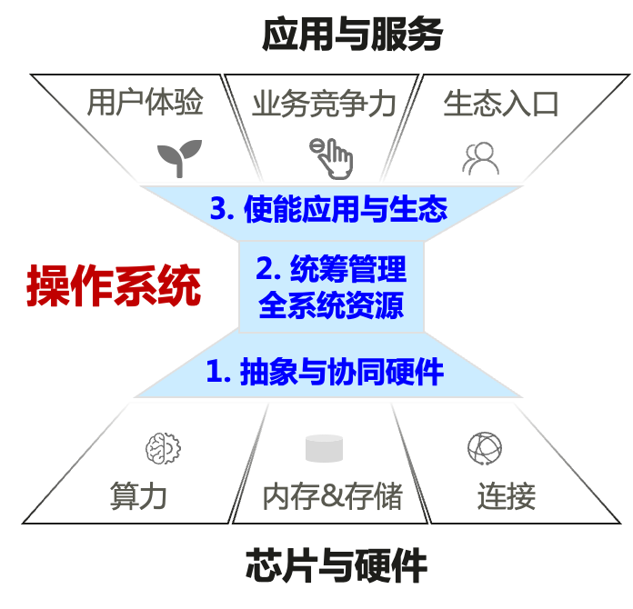
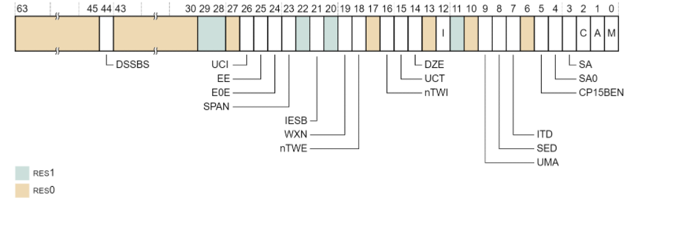

# 01. 操作系统简介

[toc]

## 1.1 操作系统定义：

#### 1.1.1 overview：**在硬件和应用之间的软件层**


#### 1.1.2 操作系统为应用提供的服务

- 为应用提供计算资源的抽象
  - CPU：进程/线程，数量不受物理CPU的限制
  - 内存：虚拟内存，大小、连续性和隔离性等不受物理内存的限制
  - I/O设备：将各种设备统一抽象为文件，提供统一接口
- 为应用提供线程间的同步
  - 应用可以实现自己的同步原语（lock）
  - 操作系统提供了更高效的同步原语（与线程切换配合, 如futex）
- 为应用提供进程间的通信
  - 应用可以利用网络进行进程间通信（如loopback设备）
  - 操作系统提供了更高效的本地通信机制（具有更丰富的语义，如pipe）

- 应用生命周期的管理
  - 应用的加载、迁移、销毁等操作
- 计算资源的分配
  - CPU：调度机制
  - 内存：内存分配机制
  - I/O设备：设备的复用与分配机制
- 安全与隔离
  - 应用程序内部：访问控制机制
  - 应用程序之间：隔离机制，包括错误隔离和性能隔离

#### 1.1.3 操作系统的功能：管理

1. 问：如何避免一个流氓应用独占CPU资源？

​		方法-1：每10ms发生一个时钟中断（时间片）
​		调度器决定下一个要运行的任务
​		方法-2：可通过信号等打断当前任务执行 
​		如：kill -9 1951

2. 问：如何通过3行代码卡死一个OS?
   例：rogue-1.c 可以fork出无数的进程

   如何解决这个问题？
   方法一：万能方法——重启
   方法二：将代码运行在虚拟机中，虚拟机外的应用不受影响
   方法三：Linux cgroup，预先设置某个应用允许占用的资源

#### 1.1.4 操作系统在计算系统中发挥的关键作用

- 操作系统是提升用户体验、业务竞争力与控制生态入口的关键

- 操作系统统筹管理全系统资源，是全局能效的关键

- 操作系统是使能硬件生态、高效抽象与管理硬件的关键



## 2.2 **为什么要有操作系统？**

#### 2.2.1 操作系统的分化


#### 2.2.2 对硬件（CPU）的要求

- CPU对软件提供的接口称为ISA
  - ISA: Instruction Set Architecture
  - 包含指令、寄存器等软件可见、可操作的接口
- CPU相应分化出两个模式：非特权模式和特权模式
  - 非特权模式ISA：应用可使用的指令和寄存器
    - 包括各种运算指令、通用寄存器等
  - 特权模式ISA：只有操作系统才可使用的指令和寄存器
    - 包括各种特权指令、系统寄存器等
  - 从上到下的切换过程通常称为陷入（trap）

#### 2.2.3 非特权部分与特权部分的交互

- 系统调用（System Call）
  - 应用调用操作系统的机制，实现应用不能实现的功能
  - 应用通过CPU的陷入机制进行模式切换（非特权→特权）
    - 有多种陷入方式，包括特定指令、异常、硬件中断等
  - 操作系统内核通过特定的硬件指令返回应用（特权→非特权）
    - 通常只有一种返回方式：如ARM的eret
- 应用调用操作系统的功能，就像调用普通函数一样
  - 例如：库函数 printf() → 系统调用 write() → 内核实现 sys_write()
    - write(1, "Hello World!\n", 13)

#### 问题: 在特定的场景下，操作系统还是否必要

> 问题一：如果一台机器有且只有一个应用程序，开机后自动运行且不会退出，是否还需要操作系统？

即使一台机器只有一个应用程序，并且该应用程序在开机后自动运行且不会退出，仍然需要操作系统的存在。以下是一些原因：

1. 资源管理：操作系统负责管理计算机的资源，包括处理器、内存、存储和外部设备等。即使只有一个应用程序运行，操作系统仍需确保资源的分配和管理，以使应用程序能够正常运行并访问所需的资源。

2. 抽象层：操作系统提供了对底层硬件的抽象，使开发人员能够以更高级别的接口编写应用程序，而无需直接处理底层硬件细节。这简化了应用程序的开发和维护过程。

3. 安全性和隔离：操作系统提供了安全性和隔离机制，确保不同应用程序之间的互相干扰和冲突最小化。这有助于保护应用程序免受恶意软件或其他应用程序的影响。

4. 设备驱动程序：操作系统提供了设备驱动程序，使应用程序能够与硬件设备进行交互。即使只有一个应用程序，它可能仍需要通过操作系统访问和控制硬件设备。

5. 更新和维护：操作系统经常接收更新和修补程序，以提供更好的性能、安全性和功能。即使只有一个应用程序，操作系统的更新和维护仍然是必要的，以确保系统的稳定性和安全性。

综上所述，即使只有一个应用程序，并且它在开机后自动运行且不会退出，操作系统仍然是必要的，因为它提供了资源管理、抽象层、安全性、设备驱动程序以及系统更新和维护等关键功能。

> 如果一个应用希望自己完全控制硬件而不是使用操作系统提供的抽象，是否还需要操作系统？

如果一个应用程序希望完全控制硬件，而不使用操作系统提供的抽象层，那么是否需要操作系统取决于具体的硬件和应用程序的需求。

在一些特殊情况下，可能会有应用程序需要直接访问硬件资源，绕过操作系统的抽象层。这通常出现在一些嵌入式系统或实时系统的场景中，其中应用程序对硬件的细致控制和实时性要求较高。

在这种情况下，应用程序通常会被编写为裸机程序（Bare-Metal Program），直接运行在硬件上，而无需操作系统的介入。这样的应用程序需要自行处理硬件的初始化、资源管理、中断处理等底层操作。

然而，即使应用程序希望完全控制硬件，操作系统仍然可能提供一些必要的功能和服务，例如硬件驱动程序、启动引导、时钟管理、内存管理等。此外，操作系统通常提供了一些便利的工具和库，可简化应用程序的开发和调试过程。

因此，是否需要操作系统取决于具体的硬件要求、应用程序的需求和设计目标。如果应用程序需要完全控制硬件并具备足够的开发资源和能力，可以选择绕过操作系统。然而，对于大多数应用程序而言，使用操作系统的抽象层可以提供更高的开发效率、可移植性和可维护性，同时充分利用操作系统提供的各种功能和服务。

#### 2.2.4 操作系统的两种演化

- 外部演化
  - 接口的演化：更好的应对新场景
    - POSIX接口：定义了一组系统调用的接口，以为应用提供兼容性
    - Linux：系统调用不断有新的加入、旧的退出
    - 鸿蒙：分布式软总线等
- 内部演化
  - 架构的演化：更好地应对复杂性
    - 如：宏内核架构、微内核架构、外核架构、多内核架构等
    - 更好的扩展性、容错性、安全性、兼容性、灵活性、性能等


## 1.3 为什么学习操作系统

- **操作系统是一个成熟的领域**
- “新的”操作系统依然不断出现
- **操作系统是系统领域的基石**
- **系统领域有大量的公司**
- 学好操作系统，for fun and profit


# 02. 操作系统结构

## 2.1 结构的重要性

1. 复杂系统的构建必须考虑其内部结构： 不同目标之间往往存在冲突；不同需求之间需要进行权衡

2. 操作系统的目标并不一致

   

3. **降低操作系统复杂性**：重要设计原则：**策略与机制的分离**

- 策略（Policy）：要做什么 —— 相对动态
- 机制（Mechanism）：该怎么做 —— 相对静态
- 操作系统可仅通过调整策略来适应不同应用的需求

| **例子** | **策略**                                              | **机制**                                              |
| -------- | ----------------------------------------------------- | ----------------------------------------------------- |
| 登录     | 什么用户、以什么权限登录                              | 输入处理、策略文件管理、桌面启动加载  ...             |
| 调度     | 调度算法：Round-robin、Earliest  Deadline  First  ... | 调度队列、调度实体（如线程）的表示、调度中断处理  ... |


## 2.2 宏内核（Monolithic-KerneL）

#### 2.2.1 overview

整个系统分为内核与应用两层：

- 内核：运行在特权级，集中控制所有计算资源
- 应用：运行在非特权级，受内核管理，使用内核服务


#### 2.2.2 宏内核的优缺点分析

- 宏内核拥有丰富的沉淀和积累
  - 拥有巨大的统一的社区和生态
  - 针对不同场景优化了30年
- 宏内核的结构性缺陷
  - 安全性与可靠性问题：模块之间没有很强的隔离机制
  - 实时性支持：系统太复杂导致无法做最坏情况时延分析
  - 系统过于庞大而阻碍了创新：Linux代码行数已经过2千万

#### 2.2.3 宏内核难以满足的场景

- 向上向下的扩展
  - 很难去剪裁/扩展一个宏内核系统支持从KB级别到TB级别的场景
- 硬件异构性
  - 很难长期支持一些定制化的方式去解决一些特定问题
- 功能安全
  - 一个广泛共识：Linux无法通过汽车安全完整性认证（ASIL-D）
- 信息安全
  - 单点错误会导致整个系统出错，而现在有数百个安全问题（CVE）
- 确定性时延
  - Linux花费10+年合并实时补丁，目前依然不确定是否能支持确定性时延


## 2.3 微内核（Micro-Kernel）

#### 2.3.1 微内核架构

- 设计原则：最小化内核功能
  - 将操作系统功能移到用户态，称为"服务"（Server）
  - 在用户模块之间，使用消息传递机制通信


#### 例：文件的创建


#### 2.3.2 微内核的优缺点分析

**优点**

- 易于扩展：直接添加一个用户进程即可为操作系统增加服务
- 易于移植：大部分模块与底层硬件无关
- 更加可靠：在内核模式运行的代码量大大减少
- 更加安全：即使存在漏洞，服务与服务之间存在进程粒度隔离
- 更加健壮：单个模块出现问题不会影响到系统整体

**缺点**

- 性能较差：内核中的模块交互由函数调用变成了进程间通信
- 生态欠缺：尚未形成像Linux一样具有广泛开发者的社区
- 重用问题：重用宏内核操作系统提供兼容性，带来新问题

#### 2.3.3 **混合内核架构**: **宏内核与微内核的结合**

- 将需要性能的模块重新放回内核态
- macOS / iOS：Mach微内核 + BSD 4.3 + 系统框架
- Windows NT：微内核 + 内核态的系统服务 + 系统框架


## 2.3 外核+库OS（Exokernel + LibOS）

#### 2.3.1 外核架构（Exokernel）

- Exokernel 不提供硬件抽象
  - "只要内核提供抽象，就不能实现性能最大化"
  - 只有应用才知道最适合的抽象（end-to-end原则）
- Exokernel 不管理资源，只管理应用
  - 负责将计算资源与应用的绑定，以及资源的回收
  - 保证多个应用之间的隔离


#### 2.3.2 库OS（LibOS）

- 策略与机制分离：将对硬件的抽象以库的形式提供
- 高度定制化：不同应用可使用不同的LibOS，或完全自定义
- 更高性能：LibOS与应用其他代码之间通过函数调用直接交互


#### 2.3.3 Exokernel架构的设计

==设计原则："将管理与保护分离"==


#### 2.3.4 安全绑定

- 将LibOS与计算资源绑定
  - 可用性：允许某个LibOS访问某些计算资源（如物理内存）
  - 隔离性：防止这些计算资源被其他LibOS访问
- 例：利用software TLB保证LibOS只使用了自己的物理内存
  - LibOS可直接修改页表，因此可能会将自己的页表指向其他LibOS物理页
  - Software TLB是软件可控的TLB，MIPS等处理器支持
  - 每次发生TLB miss时，由Exokernel负责遍历页表并填写对应的TLB项
  - Exokernel可在填写TLB项时检查LibOS对内存的使用是否合法

#### 2.3.5 **显式资源回收与中止协议**

- Exokernel与应用之间的协议
  - Exokernel显式告知应用资源的分配情况
  - 应用在租期结束之前主动归还资源
- 若应用不归还资源，则强制中止
  - Exokernel拥有对资源的控制权
  - 主动解除资源与应用间的绑定关系

#### 例：Exokernel对磁盘的管理

- 应用程序（和LibOS）：管理磁盘块设备的page cache
- Exokernel：允许应用之间安全的共享page cache

#### 2.3.6 Unikernel（单内核）

- 可以看做虚拟化环境下的LibOS
  - 每个虚拟机只使用内核态
  - 内核态中只运行一个应用+LibOS
  - 通过虚拟化层实现不同实例间的隔离
- 适合容器应用场景
  - 每个容器就是一个虚拟机
  - 每个容器运行定制的LibOS以提高性能

#### 2.3.7 Exokernel架构的优缺点分析

- 优点
  - OS无抽象，能在理论上提供最优性能
  - 应用对计算有更精确的实时等控制
  - LibOS在用户态更易调试，调试周期更短
- 缺点
  - 对计算资源的利用效率主要由应用决定
  - 定制化过多，导致维护难度增加


## 2.4 多内核/复内核（Multi-Kernel）

#### 2.4.1 背景：多核与异构

- OS内部维护很多共享状态
  - Cache一致性的保证越来越难
  - 可扩展性非常差，核数增多，性能不升反降
- GPU等设备越来越多
  - 设备本身越来越智能——设备有自己的CPU
  - 通过PCIe连接，主CPU与设备CPU之间通信非常慢
  - 通过系统总线连接，异构SoC（System on Chip)


### 2.4.6 不同操作系统架构的对比


# 3. 中断、异常与系统调用

## 3.1 ARM简介

#### 3.1.1 ARM发展

- ARMv4及之前：ARM 32位指令集
- ARMv4T、ARMv5TE：加入Thumb 16位指令集
- ARMv6：多核、SIMD、TrustZone、Thumb 32等
- ARMv7：全面支持通用操作系统，如Linux
- ARMv8：扩大物理寻址至4GB+，64位虚拟地址等
- ARMv9：新增机密计算特性CCA等

#### 3.1.2 AArch64：是指令集架构（ISA）

AArch64是一种指令集架构（ISA），也被称为ARMv8-A。它是ARM Holdings开发的64位指令集架构，用于现代ARM处理器，包括智能手机、平板电脑和其他嵌入式设备。

AArch64架构是32位ARM架构（ARMv7）的演进，提供了几项改进和增强。AArch64的一些关键特性包括：

1. 64位寻址：AArch64将地址空间从32位扩展到64位，允许更大的内存寻址，并支持更大量级的物理和虚拟内存。

2. 增加的寄存器集：AArch64提供更多的通用寄存器，从ARMv7的16个增加到AArch64的31个。这样可以实现更好的代码优化和性能提升。

3. 改进的指令集：AArch64引入了一种新的指令集架构，与之前的ARMv7架构相比更加简洁高效。它包括对新指令的支持，以及改进的浮点和SIMD（单指令多数据）操作。

4. 增强的安全性：AArch64架构包括地址空间布局随机化（ASLR）和指针认证等功能，提高系统的安全性，并帮助防护各种类型的攻击。

5. 兼容性：AArch64架构向后兼容ARMv7，这意味着它可以运行为旧的32位ARM架构编译的软件。然而，要充分发挥64位能力，软件需要专门针对AArch64进行编译。

6. PC(64-bit)指向当前执行的指令 

7. 指令长度相同 (RISC, 32-bit)

8. PC 会被跳转指令修改：B, BL, BX, BLX


AArch64广泛应用于各种计算设备，特别是移动设备，如智能手机和平板电脑。它提供了改进的性能、能源效率和对现代操作系统和应用程序所需的先进功能的支持。此外，在服务器和数据中心市场，基于ARM的服务器在某些工作负载上也越来越受欢迎。

#### 3.1.3 CPU寄存器 ARM

- 31个64位通用寄存器：X0-X30
- 1个PC寄存器
- 4个栈寄存器（切换时保存SP）：SP_EL0, SP_EL1, SP_EL2, SP_EL3
- 3个异常链接寄存器（保存异常的返回地址）：ELR_EL1, ELR_EL2, ELR_EL3
- 3个程序状态寄存器（切换时保存PSTATE）：SPSR_EL1, SPSR_EL2, SPSR_EL3

#### 3.1.4 **ISA**

##### RISC特点

- 固定长度指令格式
- 更多的通用寄存器
- Load/store 结构
- 简化寻址方式


> 多处理器亲和性寄存器(Multi-Processor Affinity Register,*MPIDR_EL1*)使软件能够确定它在哪个核上执行,在一个簇中或在一个有多个簇的系统中,该寄存器可以确定它在在哪个簇中的哪个核

##### RISC vs CISC

|            | **RISC** **(AArch64)** | **CISC** **(x86-64)** |
| ---------- | ---------------------- | --------------------- |
| 指令长度   | 定长                   | 变长                  |
| 寻址模式   | 寻址方式单一           | 多种寻址方式          |
| 内存操作   | load/store             | mov                   |
| 实现       | 增加通用寄存器数量     | 微码                  |
| 指令复杂度 | 简单                   | 复杂                  |
| 汇编复杂度 | 复杂                   | 简单                  |
| 中断响应   | 快                     | 慢                    |
| 功耗       | 低                     | 高                    |
| 处理器结构 | 简单                   | 复杂                  |

#### 3.1.5 基地址加偏移量模式

- 引用M[rb，Offset]处的数据
- 基地址寄存器rb：64位通用寄存器

- 而偏移量`Offset`可以采用以下选项之一：

1. 立即数 `#imm`：使用一个立即数作为偏移量。例如，`M[rb, #10]`表示从`rb`寄存器的值开始，向后偏移10个字节的内存位置。

2. 64位通用寄存器 `ri`：使用另一个64位通用寄存器作为偏移量。例如，`M[rb, ri]`表示从`rb`寄存器的值开始，向后偏移`ri`寄存器的值所表示的字节数。

3. 修改过的寄存器 `rm, op`：使用一个修改过的寄存器和一个操作（`op`）作为偏移量。其中，`op`可以是移位运算（如`lsl #3`）或位扩展（如`sxtw`）。

- 对于移位运算，常见的操作是逻辑左移（logical left shift），用来将寄存器值左移指定的位数。例如，`M[rb, rm, lsl #3]`表示从`rb`寄存器的值开始，向后偏移`rm`寄存器的值左移3位所表示的字节数。

- 位扩展操作常用于将低位数值的有符号扩展到更高位数。例如，`M[rb, rm, sxtw]`表示从`rb`寄存器的值开始，向后偏移`rm`寄存器的值，并将该值进行符号扩展到64位。

  > `sxtw`是ARM汇编语言中的指令，用于对寄存器中的低位有符号数进行符号扩展至64位。具体而言，它将32位寄存器中的有符号数值（低32位）进行符号扩展，填充到64位寄存器中的高32位。

这些方式的组合可以用于根据实际需求计算内存地址并访问数据。例如，可以使用`LDR`指令来加载从计算后的内存地址处的数据。

以下是一些示例：

1. 使用立即数偏移量：
   ```
   LDR R0, [R1, #10]
   ```

2. 使用通用寄存器作为偏移量：
   ```
   LDR R0, [R1, R2]
   ```

3. 使用移位运算作为偏移量：
   ```
   LDR R0, [R1, R2, LSL #3]   (R0 = R1 + (R2 << 3))
   ```

4. 使用位扩展作为偏移量：
   ```
   LDR R0, [R1, R2, SXTW]
   ```

#### 3.1.6 ARM寻址模式小结


#### 3.1.7 函数调用指令（caller调用callee）

- 指令
  bl   label (直接调用，调用函数)
  blr  Rn    (间接调用，调用函数指针)

- 功能
  - 将返回地址存储在链接寄存器LR (x30寄存器的别名) （LR: Link Register）
  - 跳转到被调用者的入口地址

#### 3.1.8 特权级：与X86-64对比

- Non-root : 
  - Ring 3：Guest app
  - Ring 0：Guest OS
- Root：
  - Ring 3：App
  - Ring 0：Hypervisor


#### 3.1.9 系统状态寄存器

##### X86-64

**System Flags in the EFLAGS**


The Condition flags： N Negative Condition flag. Z Zero Condition flag. C Carry Condition flag. V Overflow Condition flag

The Execution state control： Illegal Execution state bit， Current Execution state， Current Exception level， Stack pointer register selection bi

The exception mask bits ：Debug exception mask bit， Asynchronous exception mask bits（IRQ, FIQ）

##### **ARM**

**抽象进程状态信息（PSTATE）**：

- 条件标记 (Condition flags)
- 执行状态 (Execution state controls)
- 异常掩码 (Exception mask bits)
- 访问，时钟控制 (Access control bits)


#### 3.1.10 **系统控制寄存器**

##### 3.1.11 **X86-64**


1. CR0 (Control Register 0)：CR0寄存器是一个32位控制寄存器，它包含了一些重要的系统控制标志位，用于控制处理器的运行模式和行为。其中包括保护模式使能、分页机制使能、系统浮点处理器（FPU）的使能等。
2. CR2 (Control Register 2)：CR2寄存器是一个64位寄存器，它用于存储页错误（Page Fault）异常的线性地址。当处理器检测到页错误时，它会将引发异常的线性地址保存在CR2寄存器中，供操作系统进行处理。
3. CR3 (Control Register 3)：CR3寄存器是一个64位寄存器，用于存储页表的物理基地址。操作系统通过修改CR3寄存器来切换页表，以实现虚拟内存的管理和地址转换。
4. CR4 (Control Register 4)：CR4寄存器是一个32位控制寄存器，它包含了一些扩展的系统控制标志位，用于控制处理器的一些高级功能。其中包括物理地址扩展（PAE）使能、机器检查使能、操作系统支持等。
5. EFER (Extended Feature Enable Register)：EFER寄存器是一个64位寄存器，它包含了一些扩展特性的使能位。其中最常见的是Long Mode（长模式）的使能位，用于启用x86-64的64位操作模式。

##### ARM

**对于系统的顶层控制**：大小端、使用MMU、检查Tag、内存系统



以下是一些例子：

1. SCTLR (System Control Register)：SCTLR是一个32位寄存器，包含了控制处理器的一些基本设置，如异常使能、缓存使能、对齐检查等。

2. ACTLR (Auxiliary Control Register)：ACTLR是一个32位寄存器，用于控制处理器的一些辅助功能，如缓存和分支预测器的配置选项。

3. CPACR (Coprocessor Access Control Register)：CPACR是一个32位寄存器，用于控制协处理器的访问权限。它允许操作系统或特权级别的软件控制协处理器的使用和访问。

4. ==TTBR (Translation Table Base Register)：TTBR是一个32位或64位寄存器，用于存储页表的基地址。它用于地址转换和虚拟内存管理==。
5. TCR (Translation Control Register) 是ARM架构中的一个重要系统寄存器，用于配置虚拟地址转换和页表的相关设置

#### 3.1.11 一些地址翻译的例子


#### 3.1.12 内存空间


#### 3.1.13 ARM 输入/输出


MMIO: 复用ldr和str指令，映射到物理内存的特殊地址段

##### MMIO与PIO

- **MMIO (Memory-mapped IO)**
  - 将设备映射到连续的物理内存中，使用相同的指令
  - 如，Raspi3映射到0x3F200000
  - 行为与内存不完全一样，读写会有副作用（回忆volatile）
- **PIO (Port IO)** 
  - IO设备具有独立的地址空间
  - 使用特殊的指令（如x86中的in/out指令）


## 3.2 中断与异常处理—ARM

#### 3.2.1 CPU的执行逻辑

- CPU的执行逻辑很简单
  - 以PC的值为地址从内存中获取一条指令并执行
  - PC+=4，goto 1
- 执行过程中可能发生两种情况
  - 指令执行出现错误，比如除零或缺页（同步异常）
  - 外部设备触发中断（异步异常）
- 这两种情况在ARM平台均称为「异常」
  - 均会导致CPU陷入内核态，并根据异常向量表找到对应的处理函数执行
  - 处理函数执行完后，执行流需要恢复到之前被打断的地方继续运行
    - 注意与x86相关概念的区别

#### 3.2.2 操作系统的执行流可对应地分为两部分

一、实现对异常向量表的设置

- CPU上电后立即执行，是系统初始化的主要工作之一
- 在开启中断和启动第一个应用之前

二、实现对不同异常（中断）的处理函数

- 处理应用程序出错的情况：如除零、缺页
  - Q：内核如果自己运行出错怎么办？
- 一类特殊的同步异常：系统调用，由应用主动触发
- 处理来自外部设备的中断：如收取网络包、获取键盘输入等

#### 3.2.3 异常向量表

- 操作系统预先在一张表中准备好不同类型异常的处理函数
  - 基地址存储在VBAR_EL1寄存器中
  - 处理器在异常发生时自动跳转到对应位置
  - ARM一共16项，其中4项最为常用


#### 3.2.4 异常处理函数

- 异常处理函数运行在内核态，可以不受限制地访问所有资源
- 处理器将异常类型存储在指定寄存器中 (ESR_EL1)，表明发生的是哪一种异常，异常处理函数根据异常类型执行不同逻辑
- 当异常处理函数完成异常处理后，将通过下述操作之一转移控制权：
  - 回到发生异常时正在执行的指令
  - 回到发生异常时的下一条指令
  - 结束当前进程

## 3.3 内核态与用户态的切换

#### 3.3.1 处理器在切换过程中的任务

1. 将发生异常事件的指令地址保存在ELR_EL1中
2. 将异常事件的原因保存在ESR_EL1，例如，是执行svc指令导致的，还是访存缺页导致的
3. 将处理器的当前状态（即PSTATE）保存在SPSR_EL1
4. 将引发缺页异常的内存地址保存在FAR_EL1
5. 栈寄存器不再使用SP_EL0（用户态栈寄存器），开始使用SP_EL1，内核态栈寄存器，需要由操作系统提前设置
6. 修改PSTATE寄存器中的特权级标志位，设置为内核态
7. 找到异常处理函数的入口地址，并将该地址写入PC，开始运行操作系统，根据VBAR_EL1寄存器中保存的异常向量表基地址，以及发生异常事件的类型确定

> 为什么在异常处理的时候操作系统不能直接使用应用程序在用户态的栈呢？
>
> 在异常处理的时候，操作系统不能直接使用应用程序在用户态的栈，主要有以下几个原因：
>
> 1. 安全性：应用程序的用户态栈包含了应用程序的私有数据和敏感信息。直接在异常处理期间使用用户态栈可能会导致对应用程序的私密数据的非授权访问。为了确保数据的机密性和完整性，操作系统必须避免直接访问用户态栈。
>
> 2. 权限：用户态栈的访问权限受到应用程序的限制。操作系统通常在内核态下执行，拥有更高的特权级别。直接访问用户态栈可能会导致权限问题，操作系统无法保证在用户态栈上进行安全和可靠的操作。
>
> 3. 异常处理环境：异常处理期间，操作系统需要进行一系列的处理，包括保存现场、异常处理程序的执行以及恢复现场等。为了确保这些操作的可靠性，操作系统需要使用自己的堆栈来保存相关的上下文信息，而不是依赖于应用程序的用户态栈。
>
> 4. 中断和多任务处理：在多任务操作系统中，多个应用程序可能同时运行在不同的用户态栈上。如果操作系统直接使用用户态栈来处理异常，可能会导致多个应用程序之间的混乱和冲突。为了确保系统的稳定性和可靠性，操作系统需要使用自己的堆栈来管理和处理异常。
>
> 综上所述，为了确保系统的安全性、可靠性和稳定性，操作系统在异常处理期间需要使用自己的堆栈，而不是直接使用应用程序在用户态的栈。这样可以确保对应用程序的私密数据的保护，并且保证异常处理的正确执行和多任务环境的稳定性。

- **PC寄存器的值必须由处理器保存**: 否则当操作系统开始执行时，PC将被覆盖
- **栈的切换也必须由硬件完成**: 否则操作系统有可能使用用户态的栈，导致安全问题

#### 3.3.2 eret：从内核态返回到用户态

1. 将SPSR_EL1中的处理器状态写入PSTATE中，处理器状态也从 EL1 切换到 EL0
2. 栈寄存器不再使用SP_EL1，开始使用SP_EL0，**注意**：SP_EL1的值并没有改变，下一次下陷时，操作系统依然会使用这个内核栈
3. 将ELR_EL1中的地址写入PC，并执行应用程序代码

#### 3.3.3 操作系统在切换过程中的任务

- **主要任务：将属于应用程序的 CPU 状态保存到内存中**，用于之后恢复应用程序继续运行
- 应用程序需要保存的运行状态称为**处理器上下文**
  - 处理器上下文（Processor Context）：应用程序在完成切换后恢复执行所需的最小处理器状态集合，处理器上下文中的寄存器具体包括：
    - 通用寄存器 X0-X30
    - 特殊寄存器，主要包括PC、SP和PSTATE
    - 系统寄存器，包括页表基地址寄存器等

## 3.4 系统调用

#### 3.4.1 常见的Linux的系统调用

| **编号** | **名称** | **描述**                       | **编号** | **名称** | **名称**                   |
| -------- | -------- | ------------------------------ | -------- | -------- | -------------------------- |
| 17       | getcwd   | Get  current working directory | 129      | kill     | Send  signal to  a process |
| 23       | dup      | Duplicate  a file  descriptor  | 172      | getpid   | Get process ID             |
| 56       | openat   | Open  a  file                  | 214      | brk      | Set  the top of heap       |
| 57       | close    | Close  a file                  | 215      | munmap   | Unmap  a file from memory  |
| 63       | read     | Read  a file                   | 220      | clone    | Create  a process          |
| 64       | write    | Write  a file                  | 221      | execve   | Execute  a program         |
| 80       | fstat    | Get file status                | 222      | mmap     | Map  a file into memory    |
| 93       | _exit    | Terminate the process          | 260      | wait4    | Wait  for process to stop  |
|          |          |                                |          |          |                            |
|          |          |                                |          |          |                            |

#### 3.4.2 程序员角度看系统调用


#### 3.4.3 svc指令：从用户态进入内核态

##### CPU的行为

- 将处理器状态PSTATE保存到寄存器SPSR_EL1中
- 将用户程序中svc后的第一条指令所在地址保存到寄存器ELR_EL1
- 将处理器正在使用的栈指针寄存器由SP_EL0切换为SP_EL1
- 将 PSTATE 中的特权级别切换到内核态（EL1）
- 根据异常向量表中的配置，执行对应异常向量条目所配置的代码

#### 3.4.4 eret指令：从内核态返回用户态

##### CPU的行为

- 将SPSR_EL1中所存储的处理器状态重设到处理器状态PSTATE中
- 将处理器正在使用的栈指针寄存器由SP_EL1切换为SP_EL0
- 将ELR_EL1寄存器中所保存的返回地址重设到程序计数器PC中，执行应用程序中的代码

> 内核自己是否可以调用syscall？如果可以，是否需要换栈？
>
> 可以，这个时候不需要栈的切换

#### 3.4.5 系统调用的参数与返回值

- 参数传递
  - 最多允许8个参数：x0-x7寄存器
  - x8用于存放系统调用编号
  - 调用者保存的寄存器必须在用户态保存
- 返回值存放于x0寄存器中


##### 系统调用返回值与errno

- 一般库函数：出错时返回-1，并设置全局变量errno为具体的错误值
- **系统调用通过寄存器向应用传递返回值**： 一般设置为 -errno，库对系统调用的 wrapper code 会将系统调用的返回值转换为库函数形式的返回值

> **Q:** **如果寄存器放不下参数怎么办？**
>
> **寄存器放不下，只能通过内存传参**: 将参数放在内存中，将指针放在寄存器中传给内核,内核通过指针访问相关参数
>
> **可能会引起问题**：
>
> - 情况-1：指针指向了内核区域（攻击！）
> - 情况-2：指针指向的区域被swap-out了，导致内核访问时出现了page fault，怎么处理？（内核处理page fault）
> - 情况-3：指针指向了未映射区域，导致segmentation fault，会怎么处理？（这个时候大概率程序会因为signal异常退出）
>
> **Q: 如何验证用户态的指针合法性？**
>
> 如果仔细检查的话太费时, 需要检查指针是否来自所有的合法内存区域（VMA）
> Linux的方案: **仅仅做一个简单的检查，判断是否在最大的VMA**
> 即使检查过了，指针依然有可能不合法, 在内核态发生非法内存访问，一般会被认为是内核bug而触发Oops，并kill掉相关进程

#### 3.4.6 处理由用户指针而带来的fault

- 内核代码通过一组特定的routine来访问用户内存, 例如：copy_from_user
- 当发生page fault的时候，内核会检查PC的值: 如果PC的值在这组routine中，则不会Oops，而是会尝试运行fixup代码，去解决page fault
- 在内核中，这是一个常常会出现漏洞的地方(回顾下x86的 SMAP 特性：防止内核访问用户态内存)

#### 3.4.7 访问用户态内存的一组routine


==并非所有的syscall都会下陷，以下是两个例子==

## 3.5 vDSO (Virtual Dynamic Shared Object)

#### 3.5.1 Motivation

- 系统调用的时延不可忽略, 尤其是调用非常频繁的那些, 如 gettimeofday()
- 如何降低系统调用的时延？大部分时延都是由于U->K的模式切换带来的, **如果没有模式切换，那么就不需要保存回复状态**

#### 具体做法：以The Code of gettimeofday()为例

- 内核定义：在编译时作为内核的一部分
- 用户态运行：将gettimeofday的代码加载到一块与应用共享的内存页， 这个页称为：vDSO（Virtual Dynamic Shared Object）
  - Time 的值同样映射到用户态空间（只读）
  - 只有在内核态才能更新这个值

Q：和以前的gettimeofday相比有什么区别？

读的时候不需要模式切换

## 3.6 Flex-SC （**Flexible System Call Scheduling with Exception-Less System Calls**）

#### 3.6.1 Flexible System Call

- 一种新的syscall机制

  - 引入 system call page ，由 user & kernel 共享

  - User threads 可以将系统调用的请求 push 到 system call page

  - kernel threads 会从system call page poll system call 请求

- Exception-less syscall
  - 将系统调用的调用和执行解耦，可分布到不同的CPU核


> 在multiple thread上进行flexible systemcall的时候，一个user thread push 其system call到syscall page以后，并不一定会立即switch to kernel，有可能会switch to another user thread


# 4. 系统初始化

## 4.1 计算机启动

#### 4.1.1 启动流程：从上电到等待用户输入


#### 4.1.2 内核启动的2个主要任务

- 任务-1：**配置页表并开启虚拟内存机制，允许使用虚拟地址**
  页表究竟改如何具体配置？
  难点：开启地址翻译的前一行指令使用物理地址，开启后立即使用虚拟地址，前后如何衔接？
- 任务-2：**配置异常向量表并打开中断，允许"双循环"**
  异常向量表如何配置？
  打开后，异常处理的指令流如何流动？


## 4.2 内核代码加载与运行

#### 4.2.1 第一行代码

- 树莓派：上电后真正运行的第一行代码
  - 板子上电后固定从0x0地址运行firmware（也称 bootloader）（firmware可以放在NORFLASH（一种存储介质）中）
  - 然后再由这段代码去初始化CPU、SDRAM等
  - 最后再加载内核、根文件系统到内存，实现系统启动
- 不同主板厂商的实现可以不同
  - 这部分代码由主板厂商提供，使用人员通常不用关心
  - 树莓派的启动比较特殊：第一行代码由GPU运行
  - 不同版本的树莓派也可能不一样

#### 4.2.2 树莓派特殊的启动3阶段（by GPU）

- Step-1：GPU：运行0x0地址的firmware，将将SD卡根目录下的bootcode.bin加载到内存中
- Step-2：GPU：运行bootcode.bin，将SD卡根目录下的start.elf加载到内存中
- Step-3：GPU：运行start.elf，将SD卡根目录下的kernel.img加载到内存中
- 然后，CPU 跳转到kernel.img，开始真正运行内核代码

#### 4.2.3 入口函数位置

- CPU从预定义的RAM地址（**物理地址**）读取第一行代码，由硬件厂商决定
  - 树莓派：32位为0x8000，64位为0x80000（如何查？）
  - x86：0x7C00


#### 4.2.4 ChCore启动代码

```shell
➜  chcore-lab $  cd boot
➜  boot $ ls
boot.h       config.cmake image.h      init_c.c     mmu.c        start.S      tools.S      uart.c       uart.h

➜  boot $ cd ../kernel
➜  kernel $ ls
CMakeLists.txt exception      ipc            mm             process        syscall
common         head.S         main.c         monitor.c      sched          tests
```

两个涉及到的目录：boot 和 kernel

- boot目录：编译后放在 .init 段，低地址范围（有时也叫bootloader，再次注意不要混淆）（init段的特点：在代码运行到text段后，可以删掉，只运行一次）
- kernel目录：编译后放在 .text 段，高地址范围

#### 内核启动的具体过程看PPT

## 4.3 **异常向量表初始化**

 #### **异常向量表初始化**的具体过程看PPT


## 4.4 内核启动前：BIOS的作用

#### 4.4.1 从计算机上电到内核开始运行

- 上电后，开始执行BIOS ROM中的代码
  - 自检（POST: Power-On Self Test）
  - 找到第一个可启动设备（如第一块磁盘）
  - 将可启动设备的第一个块（512字节，即MBR）加载到内存0x7c00中
  - 跳转到bootloader的内存地址（物理地址0x7c00）并继续执行
- bootloader开始执行
  - 将内核的二进制文件从启动设备加载到内存中
  - 若内核文件是压缩包，则对其进行解压
  - 跳转到（解压后的）内核加载地址（物理地址）并继续执行
- 内核代码开始执行

#### 4.4.2 BIOS (Basic Input/Output System)

- 什么是BIOS？
  - 1981年8月，IBM生产了第一台个人电脑PC 5150，引入BIOS
  - BIOS通常保存在主板的只读内存（ROM）中
  - ROM仅仅是存储，没有执行能力
- **CPU负责执行BIOS**
  - x86 CPU在reset后，PC固定指向0xFFFF0
  - 0xFFFF0这个地址，就是BIOS的物理地址
- **在许多嵌入式设备中并没有BIOS**
- 如：许多嵌入式ARM设备（但ARM服务器有BIOS）
- 原因：设备简单 & 减少成本

#### 4.4.3 上电自检（POST）

- BIOS程序首先检查，计算机硬件能否满足运行的基本条件，这叫做"硬件自检"（Power-On Self-Test），缩写为POST。
- 如果硬件出现问题，主板会发出不同含义的蜂鸣，启动中止。如果没有问题，屏幕就会显示出CPU、内存、硬盘等信息。

#### 4.4.4 MBR（Master Boot Record）

- MBR：主引导记录，磁盘的0柱面0磁头0扇区称为主引导扇区
- 三部分组成
  - 主引导程序（boot loader）
  - 硬盘分区表DPT（disk partition table） 
  - 硬盘有效标志（0x55AA）


#### 4.4.5 Linux Grub

> GRUB（GRand Unified Bootloader）是一种常用的引导加载程序，广泛应用于Linux操作系统和其他多操作系统的引导过程中。它位于计算机系统的引导扇区（通常是硬盘的第一个扇区），负责加载操作系统内核并引导系统启动。
>
> GRUB提供了一个菜单界面，允许用户选择要启动的操作系统或内核。它支持多种文件系统和引导选项，可以通过配置文件进行自定义和扩展。
>
> 在Linux系统中，通常使用GRUB作为默认的引导加载程序。GRUB的配置文件位于/boot/grub目录下的grub.cfg文件中。通过编辑grub.cfg文件，可以设置默认启动项、内核参数、引导菜单等。
>
> GRUB具有强大的功能，包括自动探测操作系统和内核、引导菜单的编辑、内存映像加载、引导脚本的执行等。它提供了灵活和可定制的引导过程，使得系统管理员和用户可以轻松管理和控制系统的引导过程。
>
> 总之，GRUB是Linux系统中常用的引导加载程序，它负责加载操作系统内核并引导系统启动。通过配置文件，用户可以自定义引导菜单和引导选项，以满足系统需求。

1、Grub引导分为三个阶段

stage1：stage1阶段是直接被写入MBR中的（也就是大家说的bootloader）
stage1.5：存放在磁盘mbr之后的扇区中，让stage1中bootloader能识别stage2所在的分区的文件系统；
stage2：磁盘分区（/boot/grub/stage2）删除时候系统无法启动。
注意：根据stage2阶段文件定义内容找grub.conf文件然后根据这个文件里定义的内容找boot下的内核vmlinuz..与驱动模块initamfs..，至此有bootloader到grub加载内核文件与模块系统引导启动

#### 4.4.6 BIOS与生态

- IBM为了兼容PC而设计了BIOS, 主板必须兼容不同配件（CPU、内存、网卡、硬盘等）
- 大部分嵌入式设备并没有BIOS
  - 设备生产商负责所有的适配工作，不用过多考虑兼容性
  - 如：手机屏幕坏了，用户很难自己买一个屏幕更换
  - 可以节约更多成本（省去了额外的ROM）
- 有没有BIOS，与是x86还是ARM没有直接关系
  - ARM服务器也有BIOS

#### 4.4.7 EFI / UEFI

- Intel提出来EFI取代BIOS interface
  - EFI（Extensible Firmware Interface）
- 2005年，Intel再次提出UEFI取代EFI
  - UEFI（Unified Extensible Firmware Interface）


#### 4.4.8 两种启动的对比

- 定制化的主板（常见的ARM开发板，通常不再扩展其他设备）
  - 需要初始化具体主板相关硬件如GPIO和内存等
  - 初始化的时候就预先知道有哪些设备
  - 一般由厂商提供的BSP完成
- 通用的主板（常见如PC，通常需要再插入其他设备）
  - 系统配置情况在开机时候是不知道的
  - 需要探测（Probe）、Training(内存和PCIe)和枚举（PCIe等等即插即用设备）
  - BIOS/EFI提供了整个主板、包括主板上外插的设备的软件抽象
    - 通过定义的接口把这些信息传递给OS，使OS不改而能够适配到所有机型和硬件

> Q：是不是所有的笔记本都需要BIOS？
> Chrome Book就没有用，用了core boot
> 但core boot原名为LinuxBIOS，所以也算BIOS？
>
> 
>
> Q：如果一台计算机安装了2个操作系统，如何选择？
> Windows会在MBR安装NTLDR, Linux会在MBR安装grub，可以选择Windows或Linux
> 如果先安装Linux，再安装Windows，会出什么问题？
>
> Windows会把Linux的grub替换成NTLDR，linux无法启动
>
> 如何解决这个问题？
>
> 用USB启动Linux重新安装grub

#### 4.4.9 ARM嵌入式设备启动的特点

- 通常与设备强相关
  - 厂商提供私有固件（firmware）用于初始化
    - 一般称为BSP： Board Support Package
  - 不同厂商的方案往往相差很大
- 缺点：对可插拔外设的兼容性
  - ARM嵌入式设备一般不支持PCIe等外设

#### 4.4.10 总结

- x86平台常见组合
  - BIOS（在ROM）：传统BIOS、EFI/UEFI、coreboot
  - Bootloader（在磁盘的MBR）：NTLDR、Grub
  - Linux kernel（在磁盘其他位置）
- ARM嵌入式平台常见组合
  - ROM code（在ROM）：主板厂商私有
  - Bootloader（在SD卡）：如uboot（非必须）
  - Linux kernel（在SD卡）
