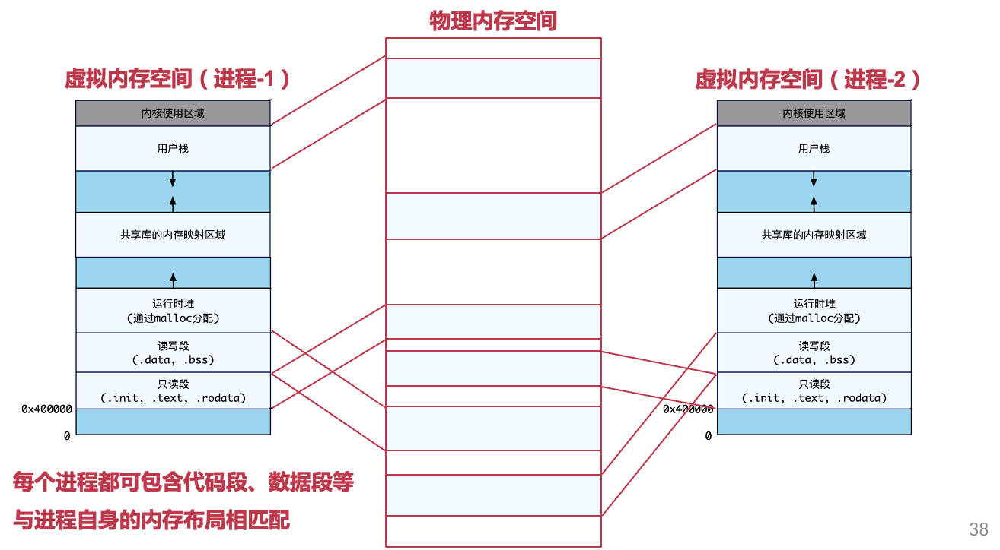
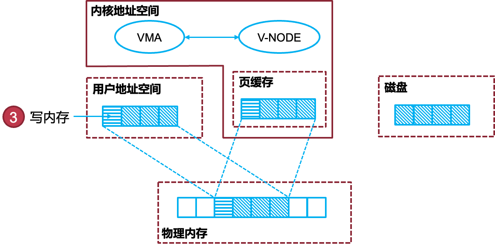
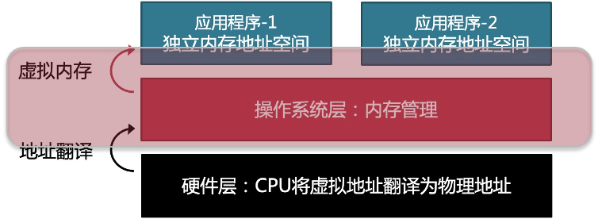
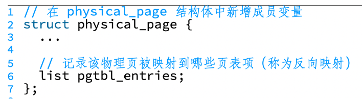

# 5.**虚拟内存管理**

[toc]

## 5.1 History

#### 5.1.1 IBM 360的内存隔离：Protection Key

- Protection key机制（无需虚拟内存也可实现隔离）

  - 内存被划分为一个个大小为2KB的内存块（Block） – 每个内存块有一个4-bit的key，保存在寄存器中

  - 1MB内存需要256个保存key的寄存器，占256-Byte(内存变大需要改CPU以增加key寄存器) 

  - 每个进程对应一个key: CPU用另一个专门的寄存器，保存当前运行进程的key, 不同进程的key不同

  - 当一个进程访问一块内存时: CPU检查进程的key与内存的key是否匹配, 不匹配则拒绝内存访问

    

* **Protection Key**机制的挑战

  - **应用加载与隔离**

    – 不同应用被加载到不同的物理地址段

    – 不同应用的key不同，以保证隔离

  - **问题**

    – 同一个二进制文件，程序-1加载到0000-1000地址段，程序-2加载到5000-6000地址段

    – "JMP 42"，程序-1能执行，程序-2会出错

  - **可能的解决方法**

    – 代码中所有地址在加载过程中都需要增加一个偏移量，如改为："JMP 5042" 

    – 新的问题：每次访存都要为地址增加偏移量，加载过程变得更慢

#### RISC-V的物理内存隔离：PMP机制

- PMP（Physical Memory Protection）：一种硬件级别的内存隔离与权限控制机制
- PMP的新寄存器
  - pmpcfg0/pmpcfg1: 每个物理内存区域的保护规则
  - pmpaddr0-pmpaddr15: 每个物理内存区域的地址范围
  - pmpcnt: PMP内存保护条目的数量

#### **使用物理地址的缺点**

- 干扰性：一个应用会因其他应用的加载而受到影响
- 扩展性：一旦物理地址范围确定，则很难使用更大范围的内存
- 安全性：一个应用可通过自身的内存地址，猜测其他应用的位置

#### **虚拟地址** **VS.** 物理地址

- 虚拟内存抽象下，程序使用虚拟地址访问主存
  – 虚拟地址会被硬件"自动地"翻译成物理地址
-  每个应用程序拥有独立的虚拟地址空间
  – 应用程序认为自己独占整个内存
  – 应用程序不再看到物理地址
  – 应用加载时不用再为地址增加一个偏移量
- 同时也可天然地支持隔离：不同的地址空间彼此隔离

### **地址翻译过程**

>  **翻译规则取决于虚拟内存采用的组织机制，包括：分段机制和分页机制**

#### **方法**-1：分段机制

- **虚拟地址分为：段号** **+** **段内地址**
   - 段号：由操作系统决定
   - 段内地址：由编译器生成
 - 段表：由操作系统配置
 - 翻译：由CPU负责查表并转换

* 更细粒度的分段：

  

* **分段机制的问题**

  * **对物理内存连续性的要求**

    ​	–物理内存也必须以段为单位进行分配

  * **存在问题：内存利用率**

    –外部碎片：段与段之间留下碎片空间

    –内部碎片：段内部预留未使用的碎片空间

  * **分段机制常见于x86平台**

    – 现代操作系统通常不再依赖分段

#### 方法-2：分页机制

- 地址空间划分成连续的、等长的虚拟页

- 物理内存也被划分成连续的、等长的物理页

- 虚拟页和物理页的页长相等

- 虚拟地址分为：虚拟页号 + 页内偏移

- **使用**页表**记录虚拟页号到物理页号的映射**

- **分页机制的特点**

  - **物理内存离散分配**

    - 任意虚拟页可以映射到任意物理页

    - 大大降低对物理内存连续性的要求

  - **主存资源易于管理，利用率更高**

    - 按照固定页大小分配物理内存

    - 能大大降低外部碎片和内部碎片

  - **被现代处理器和操作系统广泛采用**

#### **页表：分页机制的核心数据结构**

> **页表包含多个页表项，存储物理页的页号（虚拟页号为索引）**

## 5.2. **ARM64**的页表格式

#### 5.2.1 **多级页表**：**多级页表能有效压缩页表的大小**

**原因：允许页表中出现空洞**

- 若某级页表中的某条目为空，那么该条目对应的下一级页表便无需存在

- 应用程序的虚拟地址空间大部分都未分配

#### 5.2.2 AARCH64体系结构下4级页表

虚拟地址解析：

- 「63：48」16-bit：必须全是0或者全是1（一般应用程序地址选0，内核地址选1）也意味着虚拟地址空间大小最大是248 Byte，即256TB
- 「47：39」9-bit：0级页表索引
- 「38：30」9-bit：1级页表索引
- 「29：21」9-bit：2级页表索引
- 「20：12」9-bit：3级页表索引
- 「11：0」12-bit：页内偏移

#### 5.2.3 **页表基地址寄存器**

- AARCH64：两个寄存器：TTBR0_EL1 & TTBR1_EL1，根据虚拟地址第63位选择
  - 应用程序（地址首位为0）：使用TTBR0_EL1
  - 操作系统（地址首位为1）：使用TTBR1_EL1
- X86_64：一个寄存器：CR3（Control Register 3）

#### 5.2.4 Level 3 页表项

- 第3级页表页中的页表项

  - 第0位（valid位）表示该项是否有效

  - 第1位必须是1

  - Upper attributes包括：

    - 第54位（XN位）为1表示EL0不能执行（execution never）
    - 第53位（PXN位）为1表示EL1不能执行
    - 第51位（DBM位）为1表示该页被修改了（dirty bit）

  - Lower attributes包括：

    - 第7位-第6位表示读写权限位AP[2:1]

    

    - 第10位（AF位）是Access Flag，若为0访问时发生异常（可供软件追踪内存访问情况）
    - 第9位-第8位是Shareability field
    - 第4位-第2位是AttrIndx[2:0]，表示内存类型
      Normal （其cacheable属性由TCR_EL1指定）
      Device （再细分四种）

#### 5.2.5 Level 0，Level 1，Level 2 页表项

- bit[0] 是valid位 （1代表有效页表项）
- bit[1] 是表示页表项类型：
  - 0表示指向1GB、2MB大页（Super Page）
  - 1表示指向下一级页表

## 5.3 TLB：页表的cache

#### 5.3.1 TLB：地址翻译的加速器

- TLB 位于CPU内部，是页表的缓存
  - Translation Lookaside Buffer
  - 缓存了虚拟页号到物理页号的映射关系
  - 有限数目的TLB缓存项
- 在地址翻译过程中，MMU首先查询TLB
  - TLB命中，则不再查询页表 （fast path）
  - TLB未命中，再查询页表

#### 5.3.2 TLB清空：TLB Flush

- TLB 使用虚拟地址索引，当OS切换页表时需要全部刷掉
- AARCH64上内核和应用程序使用不同的页表
  - 分别存在TTBR0_EL1和TTBR1_EL1
  - 系统调用过程不用切换
- x86_64上只有唯一的基地址寄存器
  - 内核映射到应用页表的高地址
  - 避免系统调用时TLB清空的开销

- 用户态切换到内核态，不用TLB flush，因为用户态和内核态在同一个地址空间；但是切换进程的时候，需要切换页表，所以需要flush

- 清空TLB的相关指令
  清空全部：TLBI VMALLEL1IS
  清空指定ASID相关：TLBI ASIDE1IS
  清空指定虚拟地址：TLBI VAE1IS

#### 5.3.3 如何降低TLB清空导致的开销

- 新的硬件特性ASID（AARCH64）： Address Space ID
  - OS为不同进程分配8位或16位 ASID （如果8位，只有256个进程可以用）
    - ASID的位数由TCR_EL1的第36位（AS位）决定
    - OS会将ASID填写在TTBR0_EL1的高8位或高16位 (本身这里是全0或1）
  - TLB的每一项也会缓存ASID
    - 地址翻译时，硬件会将TLB项的ASID与TTB R0_EL1的ASID对比
    - 若不匹配，则TLB miss
- 使用了ASID之后
  - 切换页表（即切换进程）后，不再需要刷掉TLB，提高性能
  - 修改页表映射后，仍需刷掉TLB（因为这个时候TLB的映射会失效）

#### 5.3.4 TLB与多核

**在多核场景下**

- OS修改页表后，需要刷掉其它核的TLB吗？
  - –=需要，因为一个进程可能在多个核上运行
- OS如何知道需要刷掉哪些核的TLB？
  - 跑被切换进程的，操作系统知道进程调度信息

- OS如何刷掉其它核的TLB？
  - CPU向其他CPU发中断
  - x86_64: 发送IPI中断某个核，通知它主动清空
    AARCH64: 可在local CPU上清空其它核TLB
    调用的ARM指令：TLBI ASIDE1IS

## 5.4 虚拟内存：段和VMA

#### 5.4.1 应用是否有权访问整个虚拟地址空间

**不是的**：

- OS采用段来管理虚拟地址
  - 段内连续，段与段之间非连续
  - 合法虚拟地址段：代码、数据、堆、栈
  - 非法虚拟地址段：未映射，一旦访问，则触发segfault
- 用段进行管理的原因：因为段的数量比页要少很多，通常每一段都有相同的属性，比如只读、可执行等等，可简化管理

#### 5.4.2 合法虚拟地址信息的记录方式

**记录应用程序已分配的虚拟内存区域**， 在Linux中对应 **vm_area_struct（VMA）结构体**

#### 5.4.3 VMA是如何添加的

- **途径-1: OS在创建应用程序时分配**
  - 数据（对应ELF段）
  - 代码（对应ELF段）
  - 栈（初始无内容）

- 途径2: 应用程序主动向OS发出请求

  - brk()（扩大、缩小堆区域），可选策略： OS也可以在创建应用时分配初始的堆VMA
  - mmap()
    - 申请空的虚拟内存区域
    - 申请映射文件数据的虚拟内存区域

  - 用户态的malloc会改变VMA，通常是调用brk，在堆中分配新的内存，部分实现也可以调用mmap，由应用管理多个VMA

#### 5.4.4 mmap：分配一段虚拟内存区域

- 通常用于把一个文件（或一部分）映射到内存

- 也可以不映射任何文件，仅仅新建虚拟内存区域（匿名映射）
  注意：匿名映射并非POSIX标准，但主流OS都会支持

##### 执行mmap后，VMA的变化：

> 注意，这个时候并没有进行物理内存的分配

#### 5.4.5 VMA和页表是否冗余？

OS通过VMA记录应用程序能够访问的虚拟地址，未映射的区域没有对应的VMA结构；
OS通过配置页表控制应用程序能够访问的虚拟地址，未分配的虚拟地址没有对应的页表；那么，VMA是否冗余？

ans：并不冗余，VMA对应的区域并不一定分配了物理内存，因此不一定有对应的页表

可以不用VMA，因为页表记录了完整的映射，没有页表则表示没有映射。但VMA还是可以提高速度，比遍历页表更快。

> VMA和页表的区别：
>
> VMA（Virtual Memory Area，虚拟内存区域）和页表（Page Table）是操作系统中与虚拟内存管理相关的两个概念，它们有以下区别：
>
> 1. 定义和功能：
>    - VMA：VMA是在进程地址空间中定义的一块连续的虚拟内存区域，用于管理不同类型的内存映射，如代码段、数据段、堆、栈等。每个VMA都具有特定的属性，例如访问权限、文件映射信息等。VMA是操作系统用来管理虚拟内存的基本单位。
>    - 页表：页表是用于管理虚拟内存和物理内存之间的映射关系的数据结构。它将虚拟地址空间划分为一系列固定大小的页面，并记录每个页面与物理内存中的对应关系。页表的主要功能是实现虚拟地址到物理地址的转换，以实现虚拟内存的分页机制。
>
> 2. 使用范围：
>    - VMA：VMA是进程级别的概念，每个进程都有自己的VMA。操作系统根据进程的需求和行为来管理和分配VMA，以满足进程的内存需求。
>    - 页表：页表是针对每个进程的虚拟地址空间进行管理的。每个进程都有自己的页表，用于将进程的虚拟地址映射到物理内存的页面。
>
> 3. 数据结构：
>    - VMA：VMA通常由操作系统维护为一个链表或红黑树等数据结构，每个节点表示一个VMA，包含了该VMA的起始地址、大小、权限等属性信息。
>    - 页表：页表通常由硬件的内存管理单元（MMU）或操作系统的内存管理模块维护为一个树状结构，每个节点表示一个虚拟页或物理页的映射关系，包含了虚拟地址和物理地址的对应关系。
>
> 4. 职责：
>    - VMA：VMA主要负责管理虚拟内存的分配和释放，以及管理不同类型的内存映射，如文件映射、共享内存等。
>    - 页表：页表主要负责实现虚拟内存到物理内存的地址转换，即将虚拟地址转换为对应的物理地址，以实现虚拟内存的分页机制。
>
> 综上所述，VMA和页表在虚拟内存管理中扮演着不同的角色。VMA是进程级别的管理单位，负责管理不同类型的虚拟内存区域。而页表则是用于虚拟地址到物
>
> 理地址的转换，实现虚拟内存的分页机制。它们在功能、使用范围和数据结构等方面有所不同。

#### 5.4.6 操作系统何时为应用程序填写页表

- 立即映射：每个虚拟页都对应了一个物理内存页
- 延迟映射：有些虚拟页不对应任何物理内存页
  - 对应的数据在磁盘上
  - 没有对应的数据（初始化为0）

## 5.5 延迟映射/按需调页（Demand Paging）

#### 5.5.1 缺页异常（Page Fault）

- CPU的控制流转移
  - CPU陷入内核，找到并运行相应的异常处理函数（handler）
  - OS提前注册缺页异常处理函数
- x86_64：异常号 #PF （13），错误地址存放在CR2寄存器
- AARCH64
  - 触发（通用的）同步异常（8）
  - 根据ESR信息判断是否缺页，错误地址存放在FAR_EL1

##### 如何判断缺页异常的合法性？

OS记录应用程序已分配的虚拟内存端（VMA），不落在VMA区域，则为非法

#### 5.5.2 按需分配考虑的权衡

- 优势：节约内存资源

- 劣势：缺页异常导致访问延迟增加

- 如何取得平衡？

  - 应用程序访存具有时空局部性（Locality）

  - 在缺页异常处理函数中采用预取（Prefetching）机制

  - 即节约内存又能减少缺页异常次数

> **Question**: 导致缺页异常的三种可能
>
> 1. 访问非法虚拟地址
> 2. 按需分配（尚未分配真正的物理页）
> 3. 内存页数据被换出到磁盘上
>
> 问：后两种都是合法的缺页异常，如何区分？
>
> **ans**: 用VMA来区分。第一种，不在VMA区域；第二种和第三种，在VMA区域
>
> 区分后两种的思路是：
>
> 1、记住有哪些页被换出，比如hash表可以解决。
>
> 2、更简单的方法：通过页表项某些位是否为NULL进行区分。（OS自己定义规则：NULL代表非法，非NULL代表swap）

#### 5.5.3 MMAP: 按需分配图解

调用mmap映射文件时，内核中会为mmap的区域创建一个vma，并且将对应标识文件的内核对象V-NODE与这个vma绑定。此时这块区域的页表中并没有对应任何物理页

当访问这块内存时，会触发 page fault，内核会检查 fault 地址，发现其对应的 vma 绑定了一个 v-node，就会从磁盘读取对应的页内容到页缓存，并将页缓存与用户地址空间的内容映射到同一个物理页。

对于mmap内存区域的写会直接修改页缓存中的内容

当文件被关闭或调用msync时，页缓存中修改的数据会被刷会磁盘

> 什么是page cache?
>
> Page cache（页面缓存）是操作系统中用于缓存磁盘数据的一种机制。它是在虚拟内存管理中的一部分，用于提高文件系统性能和访问速度。
>
> 当应用程序读取文件时，数据通常会被缓存在页缓存中。Page cache将最近读取的文件块（页）保存在内存中，以便快速响应后续的读取请求。这样，当应用程序再次请求相同的数据块时，操作系统可以直接从内存中返回数据，而不需要再次访问磁盘。
>
> Page cache的工作方式如下：
> 1. 当应用程序读取文件时，操作系统会将相应的文件块加载到内存中，并将其保存在Page cache中。
> 2. 如果应用程序再次读取相同的文件块，操作系统可以直接从Page cache中返回数据，而无需访问磁盘。
> 3. 如果应用程序对文件进行写入操作，操作系统会先将数据写入Page cache，并在适当的时机将数据刷新到磁盘上的对应位置。
>
> Page cache的存在使得读取文件的速度大大提高，因为内存的访问速度远远快于磁盘。此外，Page cache还可以减少对磁盘的频繁访问，从而减轻了磁盘I/O的负担。
>
> 需要注意的是，Page cache中的数据是易失性的，即它们可能会在系统重启或内存压力较大时丢失。因此，对于需要持久性存储的数据，仍然需要进行适当的同步操作，以确保数据的持久化。
>
> 总结起来，Page cache是操作系统中的一种机制，用于缓存磁盘数据，提高文件系统性能和访问速度。它将最近读取的文件块保存在内存中，以便快速响应后续的读取请求。通过使用Page cache，可以显著减少对磁盘的访问次数，提高系统的整体性能。

##### MMAP 的优化

- **Prefault**: 每次 page fault 载入连续的多个页，减少 fault 次数
- **MAP_POPULATE**: 通过一个包含 MAP_POPULATE 的 flags 参数，可以在调用 mmap 时就预取所有的页，此后访问不会 fault

> **问**：mmap匿名映射与文件映射的区别是什么？没有backup file，内存的初始值从哪里来？
>
> **答**：初始值为0
>
> **问**：如果OS仅采用立即映射，还需要VMA么？VMA记录的信息和页表记录的信息有何不同？
>
> **答**：可以不需要，但性能会变差，VMA查找更方便
>
> **问**：demand-paging是否可通过网络来实现？如果都通过网络，本地是否还需要磁盘？
>
> **答**：可以通过网络，不需要磁盘，实现无盘工作站

#### 5.5.4 OS可向应用提供灵活的内存管理API

- **madvise：int madvise(void *addr, size_t length, int advice)**
  - 将用户态的一些语义信息发给内核以便于优化
    例如：将madvise和mmap搭配，在使用数据前告诉内核这一段数据需要使用，建议OS提前分配物理页，减少缺页异常开销
- **mprotect：int mprotect(void *addr, size_t len, int prot);**
  - 改变一段内存的权限
    例如：JIT动态生成的二进制代码，需将内存由"可写"改"为可执行"

## 5.6 虚拟内存的扩展功能

#### 5.6.1 共享内存

- 基本功能
  - 节约内存，如共享库
  - 进程通信，传递数据

#### 5.6.2 写时拷贝（copy-on-write）

- 实现
  - 修改页表项权限
  - 在缺页时拷贝、恢复
- 典型场景fork
  - 节约物理内存
  - 性能加速

#### 5.6.3 内存去重

- memory deduplication
  - 基于写时拷贝机制
  - 在内存中扫描发现具有相同内容的物理页面
  - 执行去重
  - 操作系统发起，对用户态透明
- 典型案例：Linux KSM (kernel same-page merging)

#### 5.6.4 内存压缩

- **基本思想**: 当内存资源不充足的时候， 选择将一些“最近不太会使用”的内存页进行数据压缩，从而释放出空闲内存

##### 内存压缩案例

- **Windows 10**
  - 压缩后的数据仍然存放在内存中
  - 当访问被压缩的数据时，操作系统将其解压即可
  - 对比交换内存页到磁盘，压缩的优点和缺点有哪些？
    - 压缩可以更快，但释放的内存会更少

- **Linux**
  - zswap：换页过程中磁盘的缓存
  - 将准备换出的数据压缩并先写入 zswap 区域 （内存）
  - 好处：减少甚至避免磁盘I/O；增加设备寿命

#### 5.6.5 大页的利弊

- 好处
  - 减少TLB缓存项的使用，提高 TLB 命中率
  - 减少页表的级数，提升遍历页表的效率
- 案例
  - 提供API允许应用程序进行显示的大页分配
  - Linux的透明大页（Transparent Huge Pages) 机制
- 缺点
  - 未使用整个大页而造成物理内存资源浪费
  - 增加管理内存的复杂度

#### 5.6.7 AARCH64支持多种最小页面大小

- TCR_EL1可以选择不同的最小页面大小,3种配置：4K、16K、64K
- 4K   + 大页：2M/1G
- 16K + 大页：32M
  - 32M = 16K/8 * 16K
  - 只有L2页表项支持大页
- 64K + 大页：512M
  - 只有L2页表项支持大页 （ARMv8.2之前）

### 5.7 虚拟内存小结

- 填写页表的策略
  - 立即映射
  - 延迟映射
- 延迟映射实现原理
  - 硬件基础：缺页异常
  - 软件设计：VMA数据结构
- 虚拟内存的扩展功能

### 5.8 虚拟内存机制的优势

- **高效使用物理内存**：使用 DRAM 作为虚拟地址空间的缓存
- **简化内存管理**：每个进程看到的是统一的线性地址空间
- **更强的隔离与更细粒度的权限控制**
  - 一个进程不能访问属于其他进程的内存	
  - 用户程序不能够访问特权更高的内核信息
  - 不同内存页的读、写、执行权限可以不同

### 5.9 Questions

1. **什么情况适合使用大页？**

   大数据的场景，更少的TLB miss

2. **在物理内存足够大的今天，虚拟内存是否还有存在的必要？如果不使用虚拟内存抽象，恢复到只用物理内存寻址，会带来哪些改变？哪些场景适合？**

   如果只用物理内存，不适合多用户，适合单用户

3. **如果不依靠 MMU，是否有可以替换虚拟内存的方法？**

   		- 基于高级语言实现多个同一个地址空间内运行实例的隔离

     - 基于编译器插桩实现多个运行实例的隔离
       更多可参考 Software Fault Isolation

# 6. 物理内存管理

## 6.1 **物理内存管理**

#### 6.1.1 引入虚拟内存后，物理内存分配主要在以下四个场景出现：

1. **用户态应用程序触发on-demand paging（延迟映射）时**：此时内核需要分配物理内存页，映射到对应的虚拟页
2. **内核自己申请内存并使用时：如用于内核自身的数据结构**，通常通过kmalloc()完成
3. **内核申请用于设备的DMA缓存时**：DMA缓存通常需要连续的物理页
4. **发生换页（swapping）时**：通过磁盘来扩展物理内存的容量

#### 6.1.2 场景-1：应用触发on-demand paging

- 问：当应用调用malloc时，与物理内存是否有关？
  - 应用调用malloc后，返回的虚拟地址属于某个VMA
  - 但虚拟地址对应的页表项的valid bit可能为0
  - 当第一次访问新分配的虚拟地址时，CPU会触发page fault
- 操作系统需要做（即page-fault handler）：
  - 找到一块空闲的物理内存页 ← 物理内存管理（页粒度）
  - 修改页表，将该物理页映射到触发page-fault的虚地址所在虚拟页
  - 回到应用，重复执行触发page-fault的那行代码

> **回顾：分配物理页的简单实现**
>
> **操作系统用位图记录物理页是否空闲** (alloc_page()接口的实现)
>
> - 分配时，通过bitmap查找空闲物理页，并在bitmap中标记非空闲
> - 回收时，在bitmap中，把对应的物理页标记成空闲

#### 6.1.3 物理内存分配器的指标

1. 资源利用率  
2. 分配性能

### 6.1.4 伙伴系统（buddy system）

- 目的：**尽量避免外部碎片**

#### 6.1.4.1 伙伴系统例子：分配15K内存

当一个请求需要分配 m 个物理页时，伙伴系统将寻找一个大小合适的块， 该块包含 2n个物理页，且满足 $2^{n−1}< m ⩽ 2^n$

把空 闲块按照大小放在相应的链表中:

> 合适的大小是 16K，因此首先查找第2条（$2^2$）空闲链表，如果链表不为空， 则可以直接从链表头取出空闲块进行分配。但是，在这个例子中，该链表为空， 分配器就会依次向存储更大块的链表去查找。由于第 3 条链表不为空，分配器就从该链表头取出空闲块（32K）进行分裂操作，从而获得两个 16K 大小的 块，将其中一个用于服务请求（这里不再需要继续向下分裂），另一个依然作 为空闲块插入到第 2 条链表中。若再接收到一个大小为 8K 的分配请求，分配 器则会直接从第 1 条链表中取出空闲块服务请求。之后，继续接收到一个大小 为 4K 的分配请求，分配器则会取出第 2 条链表中大小为 16K 的空闲块进行 连续分裂，从而服务请求。读者可以思考并画出此时空闲链表数组的内容。释 放块的过程与分配块的过程相反，分配器首先找到被释放的块的伙伴块，如果 伙伴块处于非空闲状态，则将被释放的块直接插入对应大小的空闲链表中，即 完成释放；如果伙伴块处于空闲状态，则将它们两个块进行合并，当成一个完整的块释放，并重复该过程。

#### 6.1.4.2 合并过程如何定位伙伴块

- 高效地找到伙伴块:互为伙伴的两个块的物理地址仅有一位不同, 而且块的大小决定是哪一位
- 例如：块A（0-8K）和块B（8-16K）互为伙伴块, 块A和B的物理地址分别是 0x0 和 0x2000,仅有第13位不同，块大小是8K（$2^{13}$）

#### 6.1.4.3 伙伴系统避免外部碎片的示例

#### 6.1.4.4 伙伴系统：以页为粒度的物理内存管理

- 分配物理页/连续物理页（$2^n$）：直接映射物理页的物理地址与虚拟地址
- 资源利用率: 外部碎片程度降低
  - 但是这时候并不是不会出现外部碎片，比如：依然是之前的4个页例子，分配4个4K后，隔页释放Memory compact

- 内部碎片依然存在：如请求9KB，分配16KB（4个页）
- 分配性能
  - 分配的时间复杂度：最好O(1) ，最坏 O(list-num)
  - 合并的时间复杂度：最好O(1) ，最坏 O(list-num)
    - 最坏也可以写做O（logN），N是块的大小

#### 6.1.4.5 具体实现

看课本

## 6.2 SLAB/SLUB/SLOB：细粒度内存管理

#### 6.2.1 场景-2：内核运行中需要进行动态内存分配

- 内核自身用到的数据结构：为每个进程创建的process，VMA等数据结构
- 特点：
  - 动态性：用时分配，用完释放，类似用户态的malloc
  - 数据结构大小往往小于页粒度

> 为什么不使用与malloc类似的机制？
> 即先分配虚拟地址，然后通过on-demand paging分配物理页
> 1. 没必要（内核最高权限，访问所有物理地址)
> 2. 复杂度：内核为应用处理缺页，若内核自己缺页，则处理过程中不能再次触发缺页, 若要不触发page fault，则必须已经映射完成

#### 6.2.2 SLAB：建立在伙伴系统之上的分配器

- **目标：快速分配小内存对象**, 内核中的数据结构大小远小于4K（例如VMA）
- 观察: 操作系统频繁分配的对象大小相对比较固定

#### 6.2.3 SLUB分配器的思路

1. 从伙伴系统获得大块内存（名为slab）（**物理内存块**）
2. 对每份大块内存进一步细分成固定大小的小块内存进行管理
3. 块的大小通常是 2n 个字节（一般来说，3 ⩽ n < 12）
4. 也可为特定数据结构增加特殊大小的块，从而减小内部碎片

#### 6.2.4 SLUB设计

- 只分配固定大小块
- 对于每个固定块大小，SLUB 分配器都会使用独立的内存资源池进行分配
- 采用best fit定位资源池

##### 初始化

把从伙伴系统得到的连续物理页划分成若干等份（slot）

##### 空闲链表: 用来区分是否空闲，当分配时直接分配一个空闲slot

##### 分配：分配N字节时，首先找到大小最合适的SLAB，取走Next_Free指向的第一个；释放时直接放回Next_Free后

##### 释放

释放时如何找到Next_Free?

提示：SLAB的大小是固定的

思路：根据object地址计算SLAB起始地址，ADDR & ~(SLAB_SIZE-1)

思考：上述方法在kfree(addr)接口下可行吗？

问题：没有size信息，无法判断addr是被slab分配的，还是伙伴系统分配的
解决方法：在物理页结构体中记录所属slab信息

##### 新增SLAB

当64字节slot的SLAB已经分配完：再从伙伴系统分配一个SLAB

##### 组织SLAB

组织多个64字节slot的SLAB：引入两个指针

1. Current指针（或current对象）：它指向一个内存块链表，该链表包含已分配但当前未被使用的内存块。当应用程序请求内存分配时，分配器将从该链表中查找可用的内存块，并将其分配给应用程序。这个指针通常指向链表的头部或者某个可用内存块。current仅指向一个 slab，分配时使用、按需更新
2. Partial指针（或partial对象）：它指向另一个内存块链表，该链表包含部分被分配但尚未完全使用的内存块。当应用程序释放内存时，分配器将这些内存块添加到partial链表中，以备后续分配给其他应用程序使用。这个指针通常指向链表的尾部或者某个可用内存块。partial指向未满slab链表，释放时若全free，则还给伙伴系统

#### 6.2.5 slab的优势

- 减少内部碎片（可根据开发需求）
- 分配效率高（常数时间）

## 6.3 突破物理内存容量限制

#### 6.3.1 换页机制（Swapping）

- 换页的基本思想
  - 用磁盘作为物理内存的补充，且对上层应用透明
  - 应用对虚拟内存的使用，不受物理内存大小限制
- 如何实现
  - 磁盘上划分专门的Swap分区，或专门的Swap文件
  - 在处理缺页异常时，触发物理内存页的换入换出

在步骤2时，需要把原先的PTE的valid bit改为0， swap bit改为1，并把对应的磁盘地址写到PTE中

#### 6.3.2 问题1. 如何判断缺页异常是由于换页引起的

- 导致缺页异常的三种可能：
  - 访问非法虚拟地址
  - 按需分配（尚未分配真正的物理页）
  - 内存页数据被换出到磁盘上
- OS如何区分？（前面有这个问题）
  - 利用VMA区分是否为合法虚拟地址（合法缺页异常）
  - 利用页表项内容区分是按需分配还是需要换入（swap bit = 1）

##### question

应用进程地址空间中的虚拟页可能存在四种状态，请问当应用进程访问某虚拟页时，在上述四种状态下，操作系统会分别做什么？

四种状态，分别是：

1. 未分配：segmentation fault
2. 已分配但尚未为其分配物理页：page fault，buddy system分配内存
3. 已分配且映射到物理页：直接使用
4. 已分配但对应物理页被换出：page fault， swap in

#### 6.3.3 问题2：何时进行换出操作

- 策略A
  - 当用完所有物理页后，再按需换出
  - 回顾：alloc_page，通过伙伴系统进行内存分配
  - 问题：当内存资源紧张时，大部分物理页分配操作都需要触发换出，造成分配时延高
- 策略B
  - 设立阈值，在空闲的物理页数量低于阈值时，操作系统择机（如系统空闲时） 换出部分页，直到空闲页数量超过阈值
  - Linux Watermark：高水位线、低水位线、 最小水位线

#### 6.3.4 问题3：换页机制的代价

- 优势：突破物理内存容量限制
- 劣势：缺页异常+磁盘操作导致访问延迟增加
- 如何取得平衡？
  - 预取机制 （Prefetching）：预测接卸来进程要使用的页，提前换入
  - 在缺页异常处理函数中，根据应用程序访存具有的空间本地性进行预取

### 6.3.5 问题4：如何选择换出的页

**页替换策略**：

- 选择一些物理页换出到磁盘
- 猜测哪些页面**应该**被换出（短期内大概率不会被访问）
- 策略实现的开销

#### 6.3.5.1 理想的换页策略（OPT策略）

OPT：优先换出未来最长时间内不会再访问的页面

假设物理内存中可以存放三个物理页，初始为空，某应用程序一共需要访问物理页面 1～5：

#### 6.3.5.2 FIFO策略

操作系统维护一个队列用于记录换入内存的物理页号，每换入一个物理页就把其页号加到队尾，因此最先换进的物理页号总是处于队头位置

#### FIFO会出现的问题：Belady’s Anomaly

#### 6.3.5.3 Second Chance策略

FIFO 策略的一种改进版本：为每一个物理页号维护一个访问标志位。如果访问的页面号已经处在队列中，则置上其访问标志位。
换页时查看队头：1）无标志则换出；2）有标志则去除并放入队尾，继续寻找

#### 6.3.5.4 LRU策略

OS维护一个链表，在每次内存访问后，OS把刚刚访问的内存页调整到链表尾端；每次都选择换出位于链表头部的页面
缺点-1：对于特定的序列，效果可能非常差，如循环访问内存
缺点-2：需要排序的内存页可能非常多，导致很高的额外负载

#### 6.3.5.5 时钟算法策略

- 精准的LRU策略难以实现
- 物理页环形排列（类似时钟），为每个物理页维护一个访问位，当物理页被访问时， 把访问位设成T，OS依次（如顺时针）查看每个页的“访问位”
  - 如果是T，则置成F
  - 如果是F，则驱逐该页

##### 实现时钟算法

- **OS在描述物理页的结构体里面记录页表项位置**
- 当物理页被填写到某张页表中时，把页表项的位置记录在元数据中（在Linux中称为“反向映射”：reverse mapping）
- 根据物理页对应的页表项中的“访问位”判断是否驱逐
- 驱逐某页时应该清空其对应的所有页表项（例如共享内存）

#### 6.3.5.6 替换策略评价标准

- 缺页发生的概率 （参照理想但不能实现的OPT策略）
- 策略本身的性能开销
  - 高效地记录物理页的使用情况：页表项中Access/Dirty Bits 

#### 6.3.5.7 Thrashing Problem

> 若选择的替换策略与实际的工作负载不匹配，则有可能造成颠簸现象

- **直接原因**: 
  - 过于频繁的缺页异常（物理内存总需求过大）
    - 大部分 CPU 时间都被用来处理缺页异常: 等待缓慢的磁盘 I/O 操作
    - 仅剩小部分的时间用于执行真正有意义的工作
  - 调度器造成问题加剧
    - 等待磁盘 I/O导致CPU利用率下降
    - 调度器载入更多的进程以期提高CPU利用率
    - 触发更多的缺页异常、进一步降低CPU利用率、导致连锁反应

#### 6.3.5.8 工作集模型（有效避免Thrashing）

- 一个进程在时间t的工作集W(t, x), 是其在时间段（t - x, t)内使用的内存页集合，也被视为其在未来（下一个x时间内）会访问的页集合，如果希望进程能够顺利进展，则需要将该集合保持在内存中

- 工作集模型：All-or-nothing，进程工作集要么都在内存中，要么全都换出
  避免thrashing，提高系统整体性能表现

### 6.4 总结

