# 08. 进程线程纤程

[toc]

## **8.1 进程**

### 8.1.1 进程的诞生和概念

> **进程：运行中的程序**

- 进程是计算机程序运行时的抽象 

  -  静态部分：程序运行需要的代码和数据 

  -  动态部分：程序运行期间的状态（程序计数器、堆、栈……

- 进程具有独立的虚拟地址空间 ,每个进程都具有“独占全部内存”的假象 ,内核中同样包含内核栈和内核代码、数据

  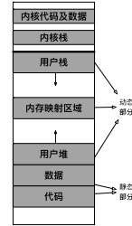


### 8.1.2 **表示进程：进程控制块（PCB）**

- 每个进程都对应一个元数据，称为“进程控制块”PCB 

- 进程控制块存储在内核态 (原因：进程控制块存储在内核态，因为它由内核管理，不应被用户态的程序访问)

- 进程控制块保存的信息 

  - 独立的虚拟地址空间 （进程的标志性特征）
  - 独立的执行上下文（进程具有独立的执行能力）

  

### **8.1.3 进程管理：即管理进程的生命周期**

- 进程自创建到终止可经历多个过程，称为**进程状态**

- 不同的系统调用和事件会影响进程的状态

  

#### 8.1.3.1 **进程创建：fork()**

- **语义：为调用进程创建一个一模一样的新进程** ： 调用进程为父进程，新进程为子进程  
  - 接口简单，无需任何参数

- f**ork后的两个进程均为独立进程** ：
  - 拥有不同的进程id 

  - 可以并行执行，互不干扰（除非使用特定的接口） 

  - 父进程和子进程会共享部分数据结构（内存、文件等）


- ##### 写时拷贝（Copy-On-Write）

  - 早期的fork实现：将父进程直接拷贝一份，缺点：
    - 1.性能差，时间随占用内存增加而增加
    - 2.无用功：fork之后如果调用exec，拷贝的内存就作废了
  - 基本思路：只拷贝内存映射，不拷贝实际内存，优点：
    - 性能较好：一条映射至少对应一个4K的页面，拷贝映射的开销远远小于拷贝内存
    - 调用exec的情况里，减少了无用的拷贝

- **fork的优缺点分析**

  - **fork的优点**

    – 接口非常简洁

    – 将进程“创建”和“执行”（exec）解耦，提高了灵活度

    – 刻画了进程之间的内在关系（进程树、进程组）

  * **fork的缺点**

    – 完全拷贝过于粗暴（不如clone） 

    – 性能差、可扩展性差（不如vfork和spawn） 

    – 不可组合性 (例如：fork() + pthread())

- **fork的替代接口**

  - vfork：类似于fork，但让父子进程共享同一地址空间
    - 优点：连映射都不需要拷贝，性能更好
    - 缺点：
      1. 只能用在”fork + exec”的场景中
      2. 共享地址空间存在安全问题
  - posix_spawn: 相当于fork + exec
    - 优点：可扩展性、性能较好
    - 缺点：不如fork灵活
  - clone: fork的“进阶版”，可以选择性地不拷贝内存
    - 优点：高度可控，可依照需求调整
    - 缺点：接口比fork复杂，选择性拷贝容易出错

#### 8.1.3.2 进程树与进程组

- fork为进程之间建立了父进程和子进程的关系，进程之间建立了树型结构（ Linux可使用ps命令查看）

- 多个进程可以属于同一个进程组 

  - 子进程默认与父进程属于同一个进程组 

  - 可以向同一进程组中的所有进程发送信号 

  - 主要用于shell程序中

    

#### 8.1.3.3 进程的执行：exec

- **为进程指定可执行文件和参数**

  

- 在fork之后调用，exec在载入可执行文件后会重置地址空间


## 8.2. **线程**

#### 8.2.1 **为什么需要线程？**

* **创建进程的开销较大**

  – 包括了数据、代码、堆、栈等

* **进程的隔离性过强**

  – 进程间交互：可以通过进程间通信（IPC），但开销较大

* **进程内部无法支持并行**

#### 8.2.2 Overview

> **更加轻量级的运行时抽象**

- **线程只包含运行时的状态**

  – 静态部分由**进程**提供

  – 包括了执行所需的**最小**状态（主要是寄存器和栈）

- **一个进程可以包含多个线程**

  – 每个线程共享同一地址空间（方便数据共享和交互）

  – 允许进程内并行

#### 8.2.3 **多线程进程的地址空间**

- **每个线程拥有自己的栈**

- **内核中也有为线程准备的内核栈**

- **其它区域共享**

  – 数据、代码、堆……

  

#### 8.2.4 **用户态线程与内核态线程**

- **内核态线程**: 内核可见，受内核管理
  - 由内核创建，线程相关信息存放在内核中

- **用户态线程（纤程）**: 内核不可见，不受内核直接管理
  - 在应用态创建，线程相关信息主要存放在应用数据中

#### 8.2.5 **线程模型**

> **线程模型表示了用户态线程与内核态线程之间的联系**

1. 多对一模型：多个用户态线程对应一个内核态线程

   - 优点：内核管理简单

   - 缺点：可扩展性差，无法适应多核机器的发展

   - **在主流操作系统中被弃用**

   - **用于各种用户态线程库中**

2. 一对一模型：一个用户态线程对应一个内核态线程

   * 优点：解决了多对一模型中的可扩展性问题

   - 缺点：内核线程数量大，开销大

   - **主流操作系统都采用一对一模型**（ Windows、Linux、OS X……）

3. 多对多模型：多个用户态线程对应多个内核态线程（**Scheduler Activation**）

   - 优点：解决了可扩展性问题（多对一）和线程过多问题（一对一）
   - 缺点：管理更为复杂
   - **在虚拟化中得到了广泛应用**


#### 8.2.6 线程的相关数据结构：TCB

一对一模型的TCB可以分为两部分：

**1.  内核态：与**PCB结构类似

​	– Linux中进程与线程使用的是同一种数据结构（task_struct） 

​	– 上下文切换中会使用

**2. 应用态：可以由线程库定义**

​	– Linux：pthread结构体

​	– Windows：TIB（Thread Information Block） 

​	– 可以认为是内核TCB的扩展

#### 8.2.7 线程本地存储（TLS）

> 每个线程都需要调用系统调用，因此它们希望errno是每个线程独有的，这样它们可以在访问同名变量的情况下获得不一样的结果

- 线程库允许定义每个线程独有的数据
  – `__thread int id`: 会为每个线程定义一个独有的id变量

- 每个线程的TLS结构相似
  – 可通过TCB索引

- TLS寻址模式：基地址＋偏移量, X86用fs保存当前线程的TLS基地址，AArch64则使用特殊寄存器tpidr_el0

#### 8.2.8 线程的基本操作：以pthreads为例

- **创建：**pthread_create

  – 内核态：创建相应的内核态线程及内核栈

  – 应用态：创建TCB、应用栈和TLS

- **合并：**pthread_join

  – 等待另一线程执行完成，并获取其执行结果

  – 可以认为是fork的“逆向操作”

- **退出：**pthread_exit

  – 可设置返回值（会被pthread_join获取）

- **暂停：pthread_yield**

  – 立即暂停执行，出让CPU资源给其它线程

  – 好处：可以帮助调度器做出更优的决策, 通过出让资源给其它线程，避免计算资源被浪费

  

## 8.3. **上下文切换**

#### 8.3.1 **进程上下文的组成（**AArch64）

- 常规寄存器：X0-X30
- 程序计数器（PC）： 保存在ELR_EL1 
- 栈指针：SP_EL0
- CPU状态（如条件码）：保存在SPSR_EL1

> 为什么进程上下文只需要保存寄存器信息，而不用保存内存？
>
> 因为内存的数据不会因为切换而消失，但寄存器只有一组

### 8.3.2 **进程的内核态执行：**

#### 8.3.2.1. **切换到内核态**

> **AArch64**提供了硬件支持，使进程切换到内核态执行

- 状态（PSTATE）写入SPSR_EL1
- PC值写入ELR_EL1

- 栈指针寄存器切换到SP_EL1
- 运行状态切换到内核态EL1

- PC移动到内核异常向量表中

>

> 实线箭头表示赋值，虚线箭头表示切换（如栈切换到SP_EL1）

##### 用户态/内核态切换时的处理器状态变化:


#### 8.3.2.2. **内核栈**

1. **为什么需要“又一个栈”（内核栈）？**

   – 进程在内核中依然执行代码，有读写临时数据的需求

   – 进程在用户态和内核态的数据应该相互隔离，增强安全性

2. **AArch64**实现：两个栈指针寄存器

   - SP_EL1，SP_EL0
   - x86只有一个栈寄存器，需要保存恢复

#### 8.3.2.3. **返回用户态**

> 进入内核态的“逆过程”，AArch64同样提供了硬件支持

- SPSR_EL1重设到CPU PSTATE
- ELR_EL1重设到PC寄存器中
- 栈指针寄存器切换到SP_EL0
- 运行状态切换到用户态EL0

> 相比于进入用户态少了一步，原因是内核态的PC不需要保存，因此PC只需要从ELR_EL1中恢复即可

**不同进程地址空间不同，使用的寄存器值也不同（如PC）**：

Sol: **保存**上下文（寄存器）到内存，用于之后恢复


#### 8.3.3 **上下文与其他内核数据结构**

- 与进程相关的三种内核数据结构：PCB、上下文、内核栈
- PCB保存指向上下文的引用
- 上下文的位置固定在内核栈底部

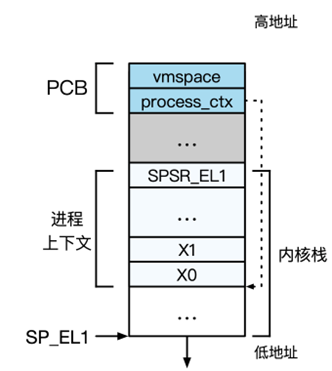

> chcore中的**上下文保存**：
>
> 进入内核后调用exception_enter完成：将各寄存器逐一放入内核栈中
>
> 上下文保存的“逆过程”：调用exception_exit完成：从内核栈读取出各寄存器，并清空内核栈，最后调用eret

### 8.3.4 上下文切换

#### **步骤**1：地址空间的切换

- 内核与用户态地址空间分开管理（使用两个寄存器）
- 用户地址空间独有，内核地址空间共享
- 因此，只需要实现用户地址空间切换即可

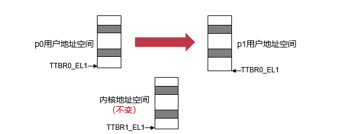

> ChCore的实现：switch_to_vmspace
>
> 获取p1的PCB，并获取其vmspace，最后设置TTBR0_EL1 （这个时候需要fresh tlb）

#### 步骤2：切换到p1的上下文

p0/p1共享内核地址空间，因此直接切换内核栈指针即可


#### 总结：上下文切换栈变化全过程

- 共涉及两次权限等级切换、三次栈切换
- 内核栈的切换是线程切换执行的“分界点”


## 8.4. **纤程**

 #### 8.4.1 为什么要有纤程（**一对一线程模型的局限**）？

- **复杂应用：对调度存在更多需求**

  –生产者消费者模型：生产者完成后，消费者最好马上被调度

  –内核调度器的信息不足，无法完成及时调度

- **“短命”线程：执行时间亚毫秒级（如处理**web**请求）**

  –内核线程初始化时间较长，造成执行开销

  –线程上下文切换频繁，开销较大

#### 8.4.2 Overview

>  比线程更加轻量级的运行时抽象

* 不单独对应内核线程
* 一个内核线程可以对应多个纤程（多对一）

#### 8.4.3 纤程的优点

- 不需要创建内核线程，开销小
- 上下文切换快（不需要进入内核）
- 允许用户态自主调度，有助于做出更优的调度决策

#### **Linux**对于纤程的支持：ucontext

- 每个ucontext可以看作一个用户态线程
  - makecontext: 创建新的ucontext
  - setcontext:纤程上下文切换
  - getcontext:保存当前的ucontext
- **纤程的例子：生产者－消费者**
  - 通过makc context生成两个纤程，分别对应生产者和消费者。当producer数据准备好以后，就可以通过setcontext直接切换到consumer。
  - 由于上下文切换不需要进入内核，因此开销较低；另外，切换也比内核调度更加及时
- **从例子看纤程的优势**:
  - 纤程切换及时:当生产者完成任务后，可直接用户态切换到消费者;对该线程来说是最优调度
  - 高效上下文切换,切换不进入内核态，开销小; 即时频繁切换也不会造成过大开销


> 虚线表示纤程的创建关系；实线表示纤程的上下文切换

##### setcontext的代码片段：

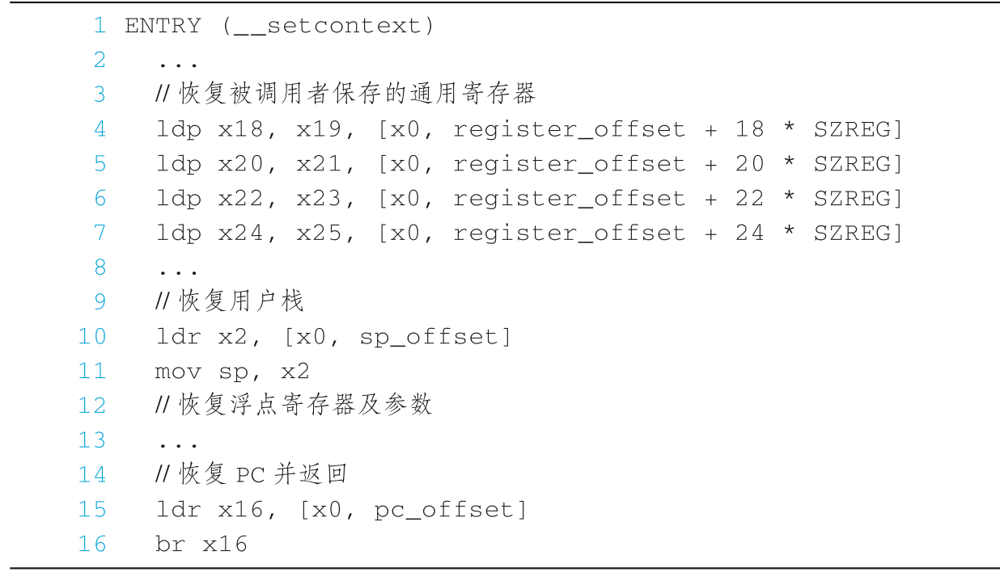

#### **Windows**对于纤程的支持：Fiber库

- 与ucontext类似的编程模型
  - createFiber: 创建新的纤程
  - SwitchToFiber: 纤程切换
- 支持纤程本地存储（FLS）Fiber Local Storage
  - 当一个内核线程对应单个纤程时，FLS与TLS结构相同
  - 当一个内核线程对应多个纤程时，TLS可分裂为多个FLS

#### **程序语言中对纤程的支持：协程**

- **许多高级程序语言都对协程提供了支持**

- **协程也拥有状态（新生／暂停／终止／执行）**

  –核心操作：yield（使协程暂停执行）、resume（继续执行）

# 9.处理器调度


## 9.1 **进程/线程调度:**

#### 9.1.1 overview


##### 调度的定义：协调对资源的使用请求

#### 9.1.2 **调度在不同场景下一些共有的目标：**

- **高资源利用率**
- **多任务公平性**
- **低调度开销**

#### 9.1.3 调度器的目标

- 降低周转时间：任务第一次进入系统到执行结束的时间
- 降低响应时间：任务第一次进入系统到第一次给用户输出的时间
- 实时性：在任务的截止时间内完成任务
- 公平性：每个任务都应该有机会执行，不能饿死
- 开销低：调度器是为了优化系统，而非制造性能BUG
- 可扩展：随着任务数量增加，仍能正常工作

#### 9.1.4 调度的挑战 

- 缺少信息（没有先知）：工作场景动态变化
- 线程/任务间的复杂交互
- 调度目标多样性：不同的系统可能关注不一样的调度指标
- 许多方面存在取舍
  - 优先级 （有些任务需要优先执行）V.S. 公平（ 所有任务都不能饿死）
  - 调度开销（制定一次决策的开销）V.S. 调度效果（决策是否考虑全面，效果足够好）
  - 能耗 V.S. 性能


## 9.2 经典调度

#### 9.2.1 First Come First Served

先到先得：简单、直观

问题：平均周转、响应时间过长

| **问题** | **到达时间** | **解答时间**  **（工作量）** |
| -------- | ------------ | ---------------------------- |
| A        | 0            | 4                            |
| B        | 1            | 7                            |
| C        | 2            | 2                            |


#### 9.2.2 Shortest Job First

短任务优先：平均周转时间短

问题：

1）不公平，任务饿死

 2）平均响应时间过长


#### 9.2.3 抢占式调度 (Preemptive Scheduling)

- 每次任务执行 一定时间后会被切换到下一任务，而非执行至终止
- 通过定时触发的时钟中断实现

#### 9.2.4 Round Robin (时间片轮转)

轮询：公平、平均响应时间短
问题：牺牲周转时间


- 什么情况下RR的周转时间问题最为明显？

  每个任务的执行时间差不多相同

- 时间片长短应该如何确定？

  - 时间片过长的话，RR会退化为FCFS
  - 时间片过短的话，在真实场景中调度开销会变大


## 9.3 优先级调度

> **优先级用于确保重要的任务被优先调度**

#### 9.3.1. **多级队列(Multi-Level Queue (MLQ))**

1）维护多个队列，每个对应静态设置好的优先级
2）高优先级的任务优先执行
3）同优先级内使用Round Robin调度（也可使用其他调度策略）

#### **9.3.2 存在的问题：**

1. 问题1：低资源利用率（P22）

   - 优先级的选取: 什么样的任务应该有高优先级?
     - I/O绑定的任务：为了更高的资源利用率
       - 用户主动设置的重要任务
       - 时延要求极高（必须在短时间内完成）的任务
       - 等待时间过长的任务：为了公平性

2. 问题2：优先级反转（P24)

   - 高、低优先级任务都需要独占共享资源,通常使用信号量、互斥锁实现独占
   - 低优先任务占用资源 -> 高优先级任务被阻塞

   **example**:

   

   **解决方法：优先级继承**

   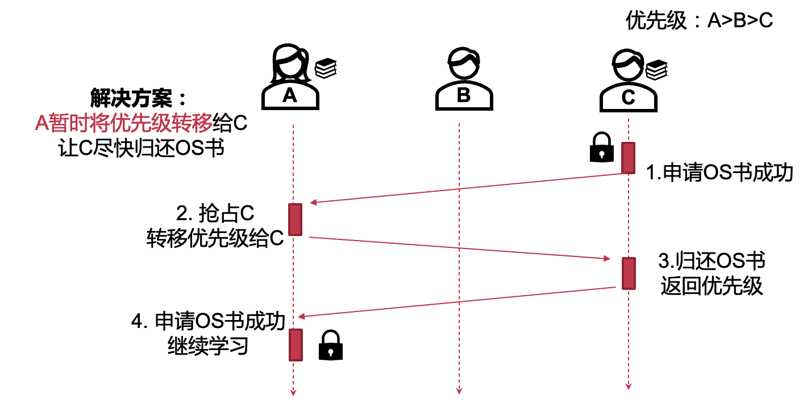

> 以下这些调度策略算不算优先级调度？
>
> - First Come First Served
> - Shortest Job First
> - Round Robin
>
> **ans**: 本质上FCFS的优先级是任务的到达顺序，SJF的优先级是任务的完成时间短
> RR则没有优先级概念（或者说所有任务优先级相同）

## 9.4 **MLFQ**

#### 9.4.1 目前介绍的调度策略的限制

- 周转时间、响应时间过长: FCFS
- 依赖对于任务的先验知识
  - 预知任务执行时间: SJF
  - 预知任务是否为I/O密集型任务: MLQ（用于设置任务优先级）

#### 9.4.2 **静态优先级的问题：低优先级任务饥饿**


#### 9.4.3 **MLFQ的主要目标与思路**

- 一个无需先验知识的通用调度策略
  - 周转时间低、响应时间低
  - 调度开销低

- 通过动态分析任务运行历史，总结任务特征
  - 类似思想的体现：页替换策略、预取
  - 需要注意：如果工作场景变化频繁，效果会很差


### 9.4.4 基本算法（基于Multi-Level Queue）

- 规则 1: 优先级高的任务会抢占优先级低的任务

- 规则 2: 每个任务会被分配时间片，优先级相同的两个任务使用时间片轮转

- 规则 3: 任务被创建时，假设该任务是短任务，为它分配最高优先级

- 规则 4a: 一个任务时间片耗尽后，它的优先级会被降低一级

- 规则 4b: 如果一个任务在时间片耗尽前放弃CPU，那么它的优先级不变, 任务重新执行时，会被分配新的时间片

- 更新的规则 4: 一个任务时间片耗尽后（无论它期间放弃了多次CPU，它的时间片不会被重置），它的优先级会被降低一级

- 规则 5:在某个时间段S后，将系统中所有任务优先级升为最高

  （为什么要提升全部的：为了避免有的任务运气不好）

#### 9.4.4.1 **针对混合工作场景**

– 执行时间短的任务

- 交互式任务
- I/O密集型任务


– 执行时间长的任务

- CPU密集型计算任务


#### 9.4.4.3 基本算法的问题（一）（1-4）

- 长任务饥饿: 过多的短任务、I/O密集型任务可能占用所有CPU时间
- 任务特征可能动态变化: CPU密集型任务→交互式任务，…

**解决方案**：**定时优先级提升 （规则5）**

- 效果1：避免长任务饿死
  – 所有任务的优先级会定时地提升最高
  – 最高级队列采用RR，长任务一定会被调度到
- 效果2：针对任务特征动态变化的场景
  – MLFQ会定时地重新审视每个任务


#### 9.4.4.4 基本算法的问题（二)

- 无法应对抢占CPU时间的攻击

  - 恶意任务在时间片用完前发起I/O请求

  - 避免MLFQ将该任务的优先级降低，并且每次重新执行时间片会被重置

  - 几乎独占CPU！

  - 攻击示例：

    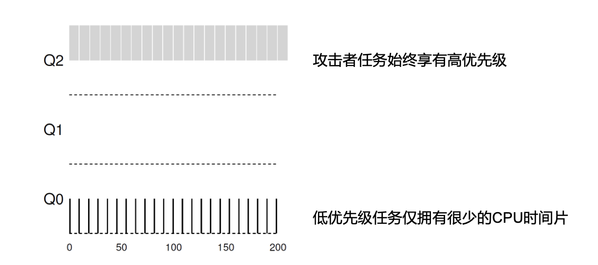


##### **解决方案**：**更准确地记录执行时间 （更新规则4）**

- 规则 4: 一个任务时间片耗尽后（无论它期间放弃了多次CPU，它的时间片不会
  被重置），它的优先级会被降低一级
- 更新策略
  – 记录每个任务在当前优先级使用的时间片
  – 当累计一个完整时间片被用完后，降低其优先级


### 9.4.5 MLFQ的参数调试

- 如何确定MLFQ的各种参数？
  - 优先级队列的数量（可以动态调整）
  - 不同队列的时间片长短（Q1长，Q3短）
  - 定时优先级提升的时间间隔（看gn）

#### 9.4.5.1 MLFQ各个队列时间片长短的选择

- 为不同队列选择不同的时间片
  - 高优先级队列时间片较短，针对短任务：提升响应时间
  - 低优先级队列时间片较长，针对长任务：降低调度开销

- 每个参数都体现了MLFQ的权衡：对于不同的工作场景，不同的参数会导致不一样的表现

#### 9.4.6 多级反馈队列总结

- 通过观察任务的历史执行，动态确定任务优先级，无需任务的先验知识
- 同时达到了周转时间和响应时间两方面的要求
  - 对于短任务，周转时间指标近似于SJF
  - 对于交互式任务，响应时间指标近似于RR
  - 可以避免长任务的饿死
- 许多著名系统的调度器是基于MLFQ实现的
  - BSD, Solaris, Windows NT 和后续Windows操作系统


## 9.5 **公平共享调度**

#### 9.5.1 **使用“ticket”表示任务的份额**

- 𝒕𝒊𝒄𝒌𝒆𝒕**：每个任务对应的份额**

- 𝑇 **：ticket的总量**

- **任务A：ticket 20**

- **任务B：ticket 30**

- **任务C：ticket 50**

- **则A:B:C占用的CPU执行时间**

  – 20:30:50

### 9.5.2 可以采用的实现方法1：**彩票调度（Lottery Scheduling）**

> 原理: 调度T次时，每个任务被调度次数的期望==该任务的份额


#### 9.5.2.1 **份额 与 优先级 的异同?**

- 份额影响任务对CPU的占用比例: 不会有任务饿死
- 优先级影响任务对CPU的使用顺序: 可能产生饿死

#### 9.5.2.2 随机的利弊

- 随机的好处: 简单
- 随机带来的问题: 
- 不精确——伪随机非真随机
- 各个任务对CPU时间的占比会有误差

### 9.5.3 方法二：**步幅调度（Stride Scheduling）**

- 可以看做**确定性版本的彩票调度**, 可以沿用tickets的概念

- Stride——步幅，任务一次执行增加的虚拟时间

  - $𝑠𝑡𝑟𝑖𝑑𝑒= \frac {MaxStride}{𝒕𝒊𝒄𝒌𝒆𝒕}$
    - MaxStride是一个足够大的整数
    - 本例中设为所有tickets的最小公倍数

  |      | **Ticket** | **Stride** |
  | ---- | ---------- | ---------- |
  | A1   | 30         | 10         |
  | A2   | 50         | 6          |
  | B1   | 60         | 5          |

- MaxStride = 300

- Pass——累计执行的虚拟时间


```c
/* select client with minimum pass value */
task = remove_queue_min(q);
/* use resource for quantum */
schedule(task);
/* compute next pass using stride */
task->pass += task->stride;
insert_queue(q, current);
```

#### 9.5.4 彩票调度和步幅调度的区别

> 预期——根据任务份额ticket计算的执行时间期望

|                              | **Lottery**  **Scheduling** | **Stride**   **Scheduling** |
| ---------------------------- | --------------------------- | --------------------------- |
| 调度决策生成                 | 随机                        | 确定性计算                  |
| 任务实际执行时间与预期的差距 | 大                          | 小                          |


## 9.6 **多核调度策略（Multicore Scheduling Policy）**

#### 9.6.1 多核调度需要考虑的额外因素

1. 一个进程的不同线程可以在不同CPU上同时运行
2. 同一个进程的线程很可能有依赖关系
3. 全局使用一个调度器的问题
   - 所有CPU竞争全局调度器, 同一个线程可能在不同CPU上切换
     - 切换开销大：Cache、TLB、…
     - 缓存局部性差

#### 9.6.2 Sol B: **群组调度：Gang Scheduling**

- **在多个CPU上同时执行一个进程的多个线程**

- example：

  

#### 9.6.3 Sol C: **Two-level Scheduling**


- ChCore & Linux同样使用Two-level Scheduling的架构
  每个CPU有各自的本地调度器和runq

- 每个CPU核心维护本地运行队列

  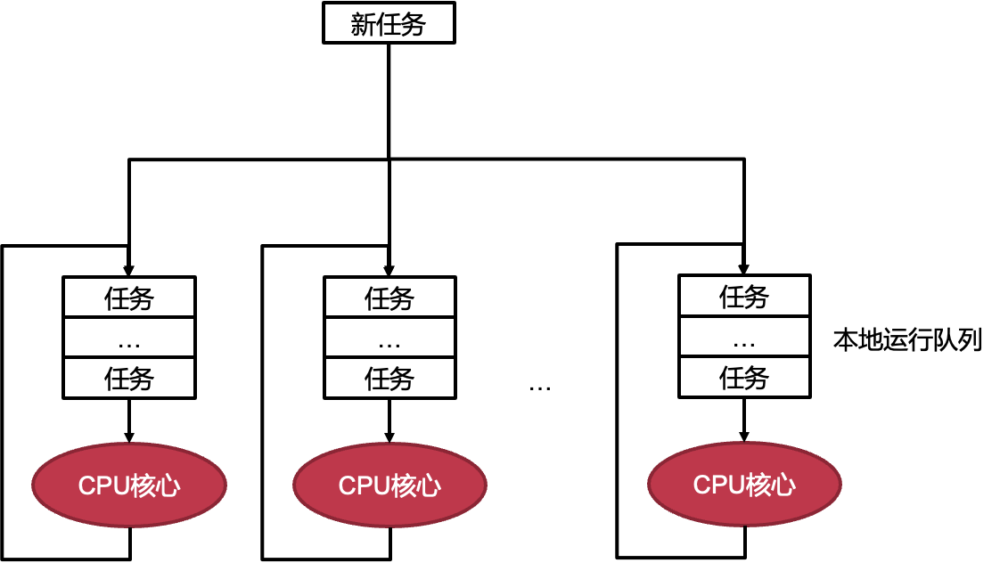

#### 9.6.4 负载均衡（Load Balance）

- 需要追踪CPU的负载情况
- 将任务从负载高的CPU迁移到负载低的CPU


##### 9.6.4.1 根据任务负载定义的不同，负载均衡的效果也不尽相同

- 每个CPU核心本地运行队列的长度
  - ​	优势：实现简单
  - ​	劣势：不能准确反应当前CPU的负载情况
- 每个任务单位时间内使用的CPU资源
  - ​	优势：直观反映当前CPU的负载情况
  - ​	劣势：引入额外负载追踪开销

**亲和性（Affinity）**

- 通过操作系统暴露的任务亲和性接口，可以指定任务能够使用的CPU核心

> 任务亲和性（Task Affinity）是指在多任务操作系统中，为了提高系统性能和资源利用率，将相关任务或进程分配到同一个处理器或处理器核心上执行的策略。通过将相关任务放置在相邻的处理器或处理器核心上执行，可以减少任务之间的通信和同步开销，提高缓存的命中率，从而改善系统的性能。
>
> 任务亲和性可以应用于多个层面，包括进程级别、线程级别和硬件级别。
>
> 1. 进程级任务亲和性：在多进程应用程序中，可以将相关的进程分配到同一个处理器上执行。这样可以减少进程之间的通信开销，并提高数据共享和同步的效率。
>
> 2. 线程级任务亲和性：在多线程应用程序中，可以将相关的线程分配到同一个处理器核心上执行。这样可以减少线程之间的切换开销，并利用处理器核心的缓存来提高数据访问效率。
>
> 3. 硬件级任务亲和性：在具有多个处理器或处理器核心的系统中，可以将特定任务或进程与特定的处理器或处理器核心绑定在一起，使其始终在同一处理器或处理器核心上执行。这种绑定可以通过操作系统提供的调度策略或者编程接口来实现，以确保任务始终在特定的处理器或处理器核心上执行。
>
> 任务亲和性的实现可以根据具体的操作系统、编程模型和应用程序需求来进行调整。通过合理利用任务亲和性，可以优化系统的性能，减少资源竞争，提高应用程序的响应速度和吞吐量。

# 10. 进程间通信

### 10.1 Overview

- 一些应用程序选择使用不同进程来运行不同模块
  - 优势-1：功能模块化，避免重复造轮子（如数据库、界面绘制）
  - 优势-2：增强模块间隔离，增强安全保障（敏感数据的隔离）
  - 优势-3：提高应用容错能力，限制故障在模块间的传播
- 然而不同进程拥有不同的内存地址空间，进程与进程之间无法直接进行通信和交互，需要一种进程间通信的方式，**IPC：Inter-Process Communication**

#### 10.1.1 常见IPC类型

| **IPC**机制 | **数据抽象** | **参与者** | **方向**  |
| ----------- | ------------ | ---------- | --------- |
| 管道        | 文件接口     | 两个进程   | 单向      |
| 共享内存    | 内存接口     | 多进程     | 单向/双向 |
| 消息队列    | 消息接口     | 多进程     | 单向/双向 |
| 信号        | 信号接口     | 多进程     | 单向      |
| 套接字      | 文件接口     | 两个进程   | 单向/双向 |

- 共享内存的情况下，TLB是有两份的
- 信号的特点是有OS定义的强烈语义

#### 10.1.2 **IPC的接口类型**

- 已有接口：内存接口：共享内存；文件接口：管道（Pipe）、套接字（Socket）
- 新的接口：消息接口、信号接口等
- 简单IPC的消息接口
  - 发送消息：Send(message)
  - 接收消息：Recv(message)
  - 远程方法调用：RPC(req_message, resp_message)
  - 回复消息：Reply(resp_message)

## 10.2 简单IPC的设计与实现

#### 10.2.1 简单实现

1. 发送

   

2. 接收 

   

3. 消息的远程方法调用（发送者）

   

4. 消息的远程方法调用（接收者）

   

#### 10.2.2 简单IPC的两个阶段

- **阶段-1：准备阶段**
  – 建立通信连接，即进程间的信道
  • 假设内核已经为两个进程映射了一段共享内存
- **阶段-2：通信阶段**
  – 数据传递
  • "消息"抽象：通常包含头部（含魔数）和数据内容（500字节）
  – 通信机制
  • 两个消息保存在共享内存中：发送者消息、接收者消息
  • 发送者和接收者通过轮询消息的状态作为通知机制


包含指针是没有意义的，因为地址空间不同

#### 10.2.3 简单IPC数据传递的两种方法

- 方法-1：基于共享内存的数据传递
  – 操作系统在通信过程中不干预数据传输
  – 操作系统仅负责准备阶段的映射

    一次复制，receiver用的时候需要复制走（zero copy也是可以的，但是可能有风险）

- 方法-2：基于操作系统辅助的数据传递
  – 操作系统提供接口（系统调用）：Send、Recv（会进内核）
  – 通过内核态内存来传递数据，无需在用户态建立共享内存

    两次复制，先从sender复制进内核，再从内核复制进receiver

#### 两种数据传递方法的对比

- 基于共享内存的优势
  – 用户态无需切换到内核态即可完成IPC（多核场景下）
  – 完全由用户态程序控制，定制能力更强
  – 可实现零内存拷贝（无需内核介入）
- 基于系统调用的优势
  – 抽象更简单，用户态直接调用接口，使用更方便
  – 安全性保证更强，发送者在消息被接收时通常无法修改消息
  – 多方（多进程）通信时更灵活、更安全

#### 10.2.4 简单IPC的通知机制

- **方法-1：基于轮询（消息头部的状态信息）**

  - 缺点：大量CPU计算资源的浪费 

    - 优点：时延更低，不需要调度
- **方法-2：基于控制流转移**

  - 由内核控制进程的运行状态
  - 优点：进程只有在条件满足的情况下才运行，避免CPU浪费

    - 存在的问题：OS调度是不受用户控制的，进程1调完之后下面不一定要调2


#### 10.2.5 IPC的方向：单向和双向

- 简单IPC的一次完整通信过程包含两个方向的通信
  – 发送者传递一个消息（即请求）给接收者
  – 接收者返回一个消息（即结果）给发送者
- 通信的三种可能方向
  – 仅支持单向通信
  – 支持双向通信（可基于单向通信实现）
  – 单向和双向通信均可（根据配置来选择）

#### 10.2.6 IPC控制流：同步和异步

- 同步IPC （比如RPC）
  – IPC操作会阻塞进程直到操作完成
  – 线性的控制流
  – 调用者继续运行时，返回结果已经ready

- 异步IPC （send ,recv)
  – 进程发起IPC操作后即可返回而不需要等待其完成
  – 通过轮询或回调函数（需内核支持）来获取返回结果

  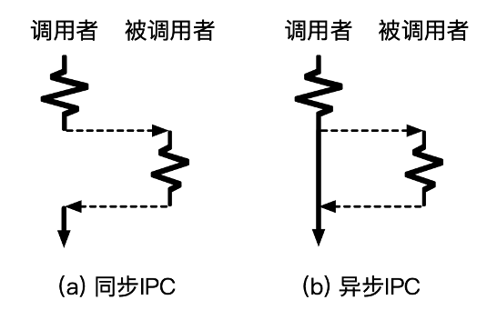

#### 10.2.7 IPC的超时机制

- 一种新的错误：超时
  – 传统的函数调用不存在超时问题
  – IPC涉及两个进程，分别有独立的控制流
- 超时可能的原因
  – 被调用者是恶意的：故意不返回
  – 被调用者不是恶意的：运行时间过长、调度时间过长、请求丢失等
- 超时机制
  – 应用可自行设置超时的阈值，但如何选择合适的阈值却很难(有trade off)
  – 特殊的超时机制：阻塞、立即返回（要求被调用者处于可立即响应的状态）

#### 10.2.8 IPC的两种通信连接抽象

- **方法1：直接通信**

  – 通信的一方需要显示地标识另一方，每一方都拥有唯一标识

  – 如：Send(P, message), Recv(Q, message)

  – 连接的建立是自动完成的（由内核完成）

- **方法2：间接通信**

  – 通信双方通过"信箱"的抽象来完成通信

  – 每个信箱有自己唯一的标识符

  – 通信双方并不直接知道在与谁通信

  – 进程间连接的建立发生在共享一个信箱时

#### 10.2.9 IPC的权限检查

- **宏内核**

  – 通常基于权限检查的机制实现

  – 如：Linux中与文件的权限检查结合在一起（比如pipe)

- **微内核**

  – 通常基于Capability安全检查机制实现(类似fd)

  > capability表示进程的权限，可以移交给其他的进程

  – 如seL4将通信连接抽象为内核对象，不同进程对于内核对象的访问权限与操作有Capability来刻画

  – Capability保存在内核中，与进程绑定

  – 进程发起IPC时，内核检查其是否拥有对应的Capability

#### 10.2.10 IPC的命名服务

- 命名服务：一个单独的进程（启动时就有的）
  – 类似一个全局的看板，协调服务端与客户端之间的信息
  – 服务端可以将自己提供的服务注册到命名服务中
  – 客户端可以通过命名服务进程获取当前可用的服务
- 命名服务的功能：分发权限
  – 例如：微内核中的文件系统进程（服务）允许命名服务将连接文件系统的权限任意分发，因此所有进程都可以访问全局的文件系统
  – 例如：数据库进程只允许拥有特定证书的客户端连接（应用机制）


## 10.3 管道：文件接口的IPC

#### 10.3.1 Unix 管道

> Shell中的管道机制并不完全等于内核中的管道机制。
> 有些shell会选择用中间文件等来实现pipe（不过比较少）

- 管道是Unix等系统中常见的进程间通信机制
- 管道(Pipe): 两个进程间的一根通信通道
  -  一端向里投递，另一端接收
  -  管道是间接消息传递方式，通过共享一个管道来建立连接

- 例子: 我们常见的命令 ls | grep

#### 10.3.2 管道的优点与问题

- 优点: 设计和实现简单
  – 针对简单通信场景十分有效

- 问题:

  – 缺少消息的类型，接收者需要对消息内容进行解析
  – 缓冲区大小预先分配且固定（可能有溢出）
  – 只能支持单向通信（为什么？）
  – 只能支持最多两个进程间通信（只能一个人读，一个人写）

- 管道只支持单向通信的原因：

  简化设计：管道的设计目标是提供一种简单而有效的进程间通信方式。为了保持设计的简洁性，管道被限制为单向通信。这样，管道的实现可以更加简单和高效，不需要处理双向通信所涉及的复杂性和开销。

  缓冲区限制：管道是基于缓冲区的通信机制。在单向通信中，发送方将数据写入管道的写端，接收方从管道的读端读取数据。这种单向流动的设计使得数据的传输和管理更加简单。如果管道支持双向通信，就需要维护两个独立的缓冲区，增加了复杂性和内存开销。

  顺序性：管道是有序的字节流传输机制，数据按照顺序写入管道的一端，并按照相同的顺序从另一端读取。如果支持双向通信，就需要处理不同方向上数据交错的情况，可能导致数据的混乱和不一致。

#### 10.3.3 匿名管道与命名管道

- **传统的管道缺乏名字，只能在有亲缘关系的进程间使用**
  – 也称为“匿名管道”
  – 通常通过fork，在父子进程间传递fd
- **命名管道：具有文件名**
  – 在Linux中也称为fifo，可通过mkfifo()来创建
  – 可以在没有亲缘关系的进程之间实现IPC
  – 允许一个写端，多个读端；或多个写端，一个读端


## 10.4 共享内存（内存接口的IPC）

#### 10.4.1 基础实现: 共享区域


#### 10.4.2 基于共享内存的生产者消费者问题实现

- 发送者

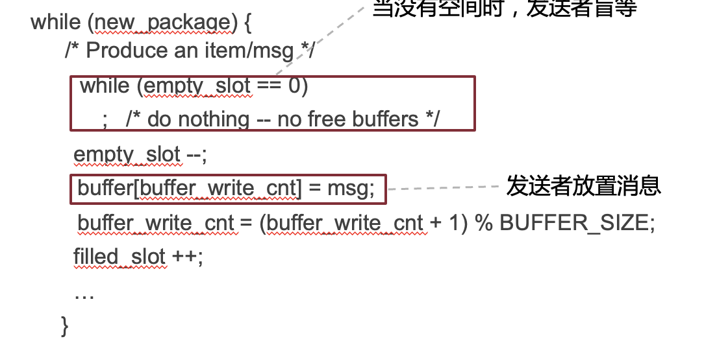

- 接收者

  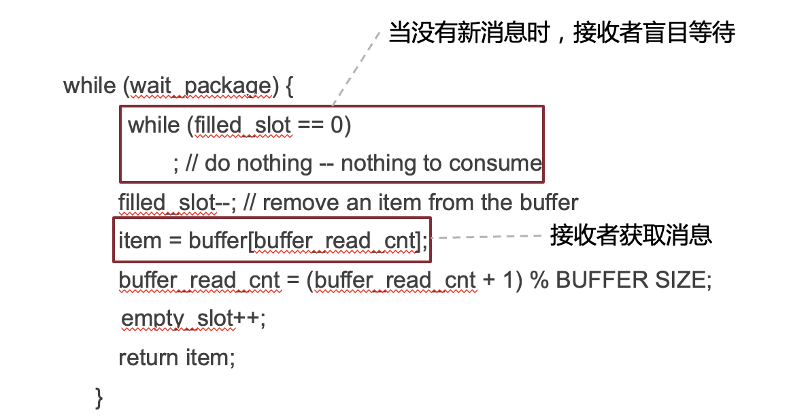

#### 10.4.3 共享内存的问题

- 缺少通知机制
  – 若轮询检查，则导致CPU资源浪费
  – 若周期性检查，则可能导致较长的等待时延
  – 根本原因：共享内存的抽象过于底层；缺少OS更多支持
- TOCTTOU （Time-of-check to Time-of-use）问题

  - 当接收者直接用共享内存上的数据时，可能存在被发送者恶意篡改的情况（发生在接收者检查完数据之后，使用数据之前），这可能导致buffer overflow等问题

    - 解决方法：只读一次，读出来以后就放在自己的内存区域


## 10.5 消息传递（MESSAGE PASSING）

#### 10.5.1 消息队列

- 一种消息传递机制
- 设计选择：
  – 间接通信方式，信箱为内核中维护的消息队列结构体
  – 有（有限的）缓存
  – 没有超时机制
  – 支持多个（大于2）的参与者进行通信
  – 通常是非阻塞的（不考虑如内核缓存区满等异常情况）

#### 10.5.2 消息队列: 带类型的消息传递

- 消息队列: 以链表的方式组织消息
  – 任何有权限的进程都可以访问队列，写入或者读取
  – 支持异步通信 (非阻塞)
- 消息的格式: 类型 + 数据
  – 类型：由一个整型表示，具体的意义由用户决定
- 消息队列是间接消息传递方式：通过共享一个队列来建立连接

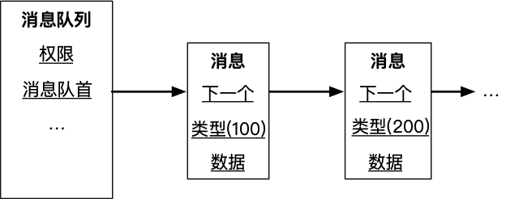

#### 10.5.3 消息队列的例子


#### 10.5.4 消息队列：带类型的消息传递

- 消息队列的组织
  – 基本遵循FIFO (First-In-First-Out)先进先出原则
  – 消息队列的写入：增加在队列尾部
  – 消息队列的读取：默认从队首获取消息
- 允许按照类型查询: Recv(A, type, message)
  – 类型为0时返回第一个消息 (FIFO)
  – 类型有值时按照类型查询消息
  • 如type为正数，则返回第一个类型为type的消息

#### 10.5.5 消息队列 VS. 管道

> 消息队列更加灵活易用，但是实现也更加复杂

- 缓存区设计:
  - 消息队列: 链表的组织方式，动态分配资源，可以设置很大的上限
  - 管道: 固定的缓冲区间，分配过大资源容易造成浪费
- 消息格式:
  - 消息队列: 带类型的数据
  - 管道: 数据 (字节流)
- 连接上的通信进程:
  - 消息队列: 可以有多个发送者和接收者
  - 管道: 两个端口，最多对应两个进程
- 消息的管理:
  - 消息队列: FIFO + 基于类型的查询
  - 管道: FIFO

## 10.6 轻量级远程方法调用 (LRPC)

#### 10.6.1 background: IPC通常会带来较大的性能损失

- **传统的进程间通信机制通常会结合以下机制：**
  – 通知：告诉目标进程事件的发生
  – 调度：修改进程的运行状态以及系统的调度队列
  – 传输：传输一个消息的数据过去
- 缺少一个轻量的远程调用机制
  – 客户端进程切换到服务端进程，执行特定的函数 (Handler)
  – 参数的传递和结果的返回

**解决两个主要问题**

- 控制流转换: Client进程快速通知Server进程

- 数据传输: 将栈和寄存器参数传递给Server进程

  

#### 10.6.2 控制流转换: 调度导致不确定时延

- 控制流转换需要下陷到内核, 内核系统为了保证公平等，会在内核中根据情况进行调度, Client和Server之间可能会执行多个不相关进程,如下所示

  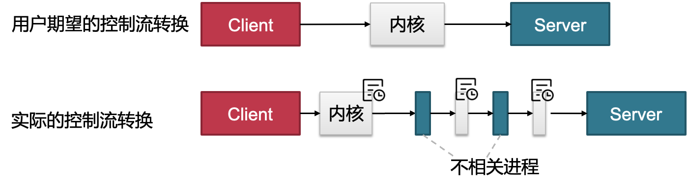

#### 10.6.2 解决**调度导致不确定时延：迁移线程—— 将Client运行在Server的上下文**

> 这里的迁移线程方案主要用作不同进程之间的线程

- 为什么需要做控制流转换?

  – 使用Server的代码和数据
  – 使用Server的权限 (如访问某些系统资源)

- 只切换地址空间、权限表等状态，不做调度和线程切换

  

#### 10.6.3 数据传输: 数据拷贝的性能损失

> 共享内存虽然可以避免拷贝，但是也存在很多其他问题：包括TOCTTOU问题，临时动态映射问题，重映射会有TLB shootdown等。
>
> 拷贝还可以通过DMA实现。不过DMA只对于大数据的拷贝有加速，而小数据会更慢。

- 大部分Unix类系统，经过内核的传输有(至少)两次拷贝: Client→内核→ Server
- 数据拷贝的缺点:
  - 慢: 拷贝本身的性能就不快 (内存指令)
  - 不可扩展: 数据量增大10x，时延增大10x

#### 10.6.3 解决数据拷贝的性能损失：共享参数栈和寄存器

- 参数栈 (Argument stack，简称A-stack）

  – 系统内核为每一对LRPC连接预先分配好一个A-stack
  – A-stack被同时映射在Client进程和Server进程地址空间
  – Client进程只需要将参数准备到A-stack即可
  • 不需要内核额外拷贝

- 执行栈（Execution stack，简称E-stack） 

  - E-stack是由被切换进程提前准备好的

- 共享寄存器
  – 普通的上下文切换: 保存当前寄存器状态 → 恢复切换到的进程寄存器状态
  – LRPC迁移进程: 直接使用当前的通用寄存器

  - 类似函数调用中用寄存器传递参数
  - 共享寄存器主要是针对于通用寄存器，用作参数传递。其他的如栈寄存器sp等，还是要变化的。


#### 10.6.4 轻量远程调用：通信连接建立的流程

- Server进程通过内核注册一个服务描述符，对应Server进程内部的一个处理函数(Handler)
- 内核为服务描述符预先分配好参数栈
- 内核为服务描述符分配好调用记录 (Linkage record)
  - Linkage record：独立于进程而存在，记录返回地址，从而能支持嵌套调用
  - 用于从Server进程处返回（类似栈）
- 内核将参数栈交给Client进程，作为一个绑定成功的标志
  - 在通信过程中，通过检查A-stack来判断Client是否正确发起通信
  - A-stack在两个进程上的映射代表了一个通信连接的建立

#### 10.6.5 基本用户接口


#### 10.6.6 一次调用过程

1. 内核验证绑定对象的正确性，并找到正确的服务描述符
2. 内核验证参数栈和连接记录
3. 检查是否有并发调用 (可能导致A-stack等异常)
4. 将Client的返回地址和栈指针放到连接记录中
5. 将连接记录放到线程控制结构体中的栈上 (支持嵌套LRPC调用)
6. 找到Server进程的E-stack (执行代码所使用的栈)
7. 将当前线程的栈指针设置为Server进程的运行栈地址
8. 将地址空间切换到Server进程中
9. 执行Server地址空间中的处理函数

#### 10.6.7 通信调用实现

参数主要放在通用寄存器上

```c
ipc_call(A-stack, arg0, .. arg7):
    verify_binding(A-stack); //验证A-stack正确性 
    service_descriptor = get_desc_from_A(A-stack);
    /*其他安全检查: 是否存在并发调用？*/
    …
    save_ctx_to_linkage_record(); //保存调用信息到连接记录上
    save_linkage_record();
     …
    /* 切换运行状态 */
    switch_PT(); //修改页表
    switch_cap_table(); //修改权限表
    switch_sp(); //修改栈地址
    ….    
    //返回到用户态(服务端进程)，不修改参数寄存器
    ctx_restore_with_args (ret);
```

#### 10.6.8 questions

##### 1. 为什么需要将栈分成参数栈和运行栈？

参数栈是为了共享传递参数，而执行栈是为了执行代码已经处理局部变量等使用的

##### 2. LRPC中控制流转换的主要开销是什么?

地址空间的切换（来自硬件限制）是最主要的性能开销

##### 3. 在不考虑多线程的情况下，共享参数栈是否安全？

安全的。因为是同步IPC，所以在被调用者上下文执行的时候，其实没有其他人可以去读写A-stack

