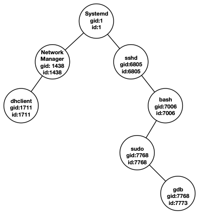

# 08. 进程线程纤程

[toc]

## **8.1 进程**

### 8.1.1 进程的诞生和概念

> **进程：运行中的程序**

- 进程是计算机程序运行时的抽象 

  -  静态部分：程序运行需要的代码和数据 

  -  动态部分：程序运行期间的状态（程序计数器、堆、栈……

- 进程具有独立的虚拟地址空间 ,每个进程都具有“独占全部内存”的假象 ,内核中同样包含内核栈和内核代码、数据

  

### 8.1.2 **表示进程：进程控制块（PCB）**

- 每个进程都对应一个元数据，称为“进程控制块”PCB 

- 进程控制块存储在内核态 (原因：进程控制块存储在内核态，因为它由内核管理，不应被用户态的程序访问)

- 进程控制块保存的信息 

  - 独立的虚拟地址空间 （进程的标志性特征）
  - 独立的执行上下文（进程具有独立的执行能力）

  

### **8.1.3 进程管理：即管理进程的生命周期**

- 进程自创建到终止可经历多个过程，称为**进程状态**

- 不同的系统调用和事件会影响进程的状态

  

#### 8.1.3.1 **进程创建：fork()**

- **语义：为调用进程创建一个一模一样的新进程** ： 调用进程为父进程，新进程为子进程  
  - 接口简单，无需任何参数

- f**ork后的两个进程均为独立进程** ：
  - 拥有不同的进程id 

  -  可以并行执行，互不干扰（除非使用特定的接口） 

  -  父进程和子进程会共享部分数据结构（内存、文件等）

- ##### 写时拷贝（Copy-On-Write）

  - 早期的fork实现：将父进程直接拷贝一份，缺点：
    - 1.性能差，时间随占用内存增加而增加
    - 2.无用功：fork之后如果调用exec，拷贝的内存就作废了
  - 基本思路：只拷贝内存映射，不拷贝实际内存，优点：
    - 性能较好：一条映射至少对应一个4K的页面，拷贝映射的开销远远小于拷贝内存
    - 调用exec的情况里，减少了无用的拷贝

- **fork的优缺点分析**

  - **fork的优点**

    – 接口非常简洁

    – 将进程“创建”和“执行”（exec）解耦，提高了灵活度

    – 刻画了进程之间的内在关系（进程树、进程组）

  * **fork的缺点**

    – 完全拷贝过于粗暴（不如clone） 

    – 性能差、可扩展性差（不如vfork和spawn） 

    – 不可组合性 (例如：fork() + pthread())

- **fork的替代接口**

  - vfork：类似于fork，但让父子进程共享同一地址空间
    - 优点：连映射都不需要拷贝，性能更好
    -  缺点：
      1. 只能用在”fork + exec”的场景中
      2. 共享地址空间存在安全问题
  - posix_spawn: 相当于fork + exec
    - 优点：可扩展性、性能较好
    - 缺点：不如fork灵活
  - clone: fork的“进阶版”，可以选择性地不拷贝内存
    - 优点：高度可控，可依照需求调整
    - 缺点：接口比fork复杂，选择性拷贝容易出错

#### 8.1.3.2 进程树与进程组

- fork为进程之间建立了父进程和子进程的关系，进程之间建立了树型结构（ Linux可使用ps命令查看）

- 多个进程可以属于同一个进程组 
  - 子进程默认与父进程属于同一个进程组 
  
  - 可以向同一进程组中的所有进程发送信号 
  
  - 主要用于shell程序中
  
    

#### 8.1.3.3 进程的执行：exec

- **为进程指定可执行文件和参数**

  

- 在fork之后调用，exec在载入可执行文件后会重置地址空间

## 8.2. **线程**

#### 8.2.1 **为什么需要线程？**

* **创建进程的开销较大**

  – 包括了数据、代码、堆、栈等

* **进程的隔离性过强**

  – 进程间交互：可以通过进程间通信（IPC），但开销较大

* **进程内部无法支持并行**

#### 8.2.2 Overview

> **更加轻量级的运行时抽象**

- **线程只包含运行时的状态**

  – 静态部分由**进程**提供

  – 包括了执行所需的**最小**状态（主要是寄存器和栈）

- **一个进程可以包含多个线程**

  – 每个线程共享同一地址空间（方便数据共享和交互）

  – 允许进程内并行

#### 8.2.3 **多线程进程的地址空间**

-  **每个线程拥有自己的栈**

- **内核中也有为线程准备的内核栈**

-  **其它区域共享**

  – 数据、代码、堆……

  

#### 8.2.4 **用户态线程与内核态线程**

- **内核态线程**: 内核可见，受内核管理
  - 由内核创建，线程相关信息存放在内核中

- **用户态线程（纤程）**: 内核不可见，不受内核直接管理
  - 在应用态创建，线程相关信息主要存放在应用数据中

#### 8.2.5 **线程模型**

> **线程模型表示了用户态线程与内核态线程之间的联系**

1.  多对一模型：多个用户态线程对应一个内核态线程

   - 优点：内核管理简单

   - 缺点：可扩展性差，无法适应多核机器的发展

   - **在主流操作系统中被弃用**

   - **用于各种用户态线程库中**

2.  一对一模型：一个用户态线程对应一个内核态线程

   * 优点：解决了多对一模型中的可扩展性问题

   - 缺点：内核线程数量大，开销大

   - **主流操作系统都采用一对一模型**（ Windows、Linux、OS X……）

3.  多对多模型：多个用户态线程对应多个内核态线程（**Scheduler Activation**）

   - 优点：解决了可扩展性问题（多对一）和线程过多问题（一对一）
   - 缺点：管理更为复杂
   - **在虚拟化中得到了广泛应用**

#### 8.2.6 线程的相关数据结构：TCB

一对一模型的TCB可以分为两部分：

**1.  内核态：与**PCB结构类似

​	– Linux中进程与线程使用的是同一种数据结构（task_struct） 

​	– 上下文切换中会使用

**2. 应用态：可以由线程库定义**

​	– Linux：pthread结构体

​	– Windows：TIB（Thread Information Block） 

​	– 可以认为是内核TCB的扩展

#### 8.2.7 线程本地存储（TLS）

> 每个线程都需要调用系统调用，因此它们希望errno是每个线程独有的，这样它们可以在访问同名变量的情况下获得不一样的结果

- 线程库允许定义每个线程独有的数据
  – `__thread int id`: 会为每个线程定义一个独有的id变量

- 每个线程的TLS结构相似
  – 可通过TCB索引

- TLS寻址模式：基地址＋偏移量, X86用fs保存当前线程的TLS基地址，AArch64则使用特殊寄存器tpidr_el0

#### 8.2.8 线程的基本操作：以pthreads为例

- **创建：**pthread_create

  – 内核态：创建相应的内核态线程及内核栈

  – 应用态：创建TCB、应用栈和TLS

- **合并：**pthread_join

  – 等待另一线程执行完成，并获取其执行结果

  – 可以认为是fork的“逆向操作”

- **退出：**pthread_exit

  – 可设置返回值（会被pthread_join获取）

- **暂停：pthread_yield**

  – 立即暂停执行，出让CPU资源给其它线程

  – 好处：可以帮助调度器做出更优的决策, 通过出让资源给其它线程，避免计算资源被浪费

  

## 8.3. **上下文切换**

#### 8.3.1 **进程上下文的组成（**AArch64）

- 常规寄存器：X0-X30
- 程序计数器（PC）： 保存在ELR_EL1 
- 栈指针：SP_EL0
- CPU状态（如条件码）：保存在SPSR_EL1

> 为什么进程上下文只需要保存寄存器信息，而不用保存内存？
>
> 因为内存的数据不会因为切换而消失，但寄存器只有一组

### 8.3.2 **进程的内核态执行：**

#### 8.3.2.1. **切换到内核态**

> **AArch64**提供了硬件支持，使进程切换到内核态执行

- 状态（PSTATE）写入SPSR_EL1
- PC值写入ELR_EL1

- 栈指针寄存器切换到SP_EL1
- 运行状态切换到内核态EL1

- PC移动到内核异常向量表中

>

> 实线箭头表示赋值，虚线箭头表示切换（如栈切换到SP_EL1）

##### 用户态/内核态切换时的处理器状态变化:

#### 8.3.2.2. **内核栈**

1. **为什么需要“又一个栈”（内核栈）？**

   – 进程在内核中依然执行代码，有读写临时数据的需求

   – 进程在用户态和内核态的数据应该相互隔离，增强安全性

2. **AArch64**实现：两个栈指针寄存器

   - SP_EL1，SP_EL0
   - x86只有一个栈寄存器，需要保存恢复

#### 8.3.2.3. **返回用户态**

> 进入内核态的“逆过程”，AArch64同样提供了硬件支持

- SPSR_EL1重设到CPU PSTATE
- ELR_EL1重设到PC寄存器中
- 栈指针寄存器切换到SP_EL0
- 运行状态切换到用户态EL0

> 相比于进入用户态少了一步，原因是内核态的PC不需要保存，因此PC只需要从ELR_EL1中恢复即可

**不同进程地址空间不同，使用的寄存器值也不同（如PC）**：

Sol: **保存**上下文（寄存器）到内存，用于之后恢复

#### 8.3.3 **上下文与其他内核数据结构**

- 与进程相关的三种内核数据结构：PCB、上下文、内核栈
- PCB保存指向上下文的引用
- 上下文的位置固定在内核栈底部

> chcore中的**上下文保存**：
>
> 进入内核后调用exception_enter完成：将各寄存器逐一放入内核栈中
>
> 上下文保存的“逆过程”：调用exception_exit完成：从内核栈读取出各寄存器，并清空内核栈，最后调用eret

### 8.3.4 上下文切换

#### **步骤**1：地址空间的切换

- 内核与用户态地址空间分开管理（使用两个寄存器）
- 用户地址空间独有，内核地址空间共享
- 因此，只需要实现用户地址空间切换即可

> ChCore的实现：switch_to_vmspace
>
> 获取p1的PCB，并获取其vmspace，最后设置TTBR0_EL1 （这个时候需要fresh tlb）

#### 步骤2：切换到p1的上下文

p0/p1共享内核地址空间，因此直接切换内核栈指针即可

#### 总结：上下文切换栈变化全过程

- 共涉及两次权限等级切换、三次栈切换
- 内核栈的切换是线程切换执行的“分界点”

## 8.4. **纤程**

 #### 8.4.1 为什么要有纤程（**一对一线程模型的局限**）？

- **复杂应用：对调度存在更多需求**

  –生产者消费者模型：生产者完成后，消费者最好马上被调度

  –内核调度器的信息不足，无法完成及时调度

- **“短命”线程：执行时间亚毫秒级（如处理**web**请求）**

  –内核线程初始化时间较长，造成执行开销

  –线程上下文切换频繁，开销较大

#### 8.4.2 Overview

>  比线程更加轻量级的运行时抽象

* 不单独对应内核线程
* 一个内核线程可以对应多个纤程（多对一）

#### 8.4.3 纤程的优点

- 不需要创建内核线程，开销小
- 上下文切换快（不需要进入内核）
- 允许用户态自主调度，有助于做出更优的调度决策

#### **Linux**对于纤程的支持：ucontext

- 每个ucontext可以看作一个用户态线程
  - makecontext: 创建新的ucontext
  - setcontext:纤程上下文切换
  - getcontext:保存当前的ucontext
- **纤程的例子：生产者－消费者**
  - 通过makc context生成两个纤程，分别对应生产者和消费者。当producer数据准备好以后，就可以通过setcontext直接切换到consumer。
  - 由于上下文切换不需要进入内核，因此开销较低；另外，切换也比内核调度更加及时
- **从例子看纤程的优势**:
  - 纤程切换及时:当生产者完成任务后，可直接用户态切换到消费者;对该线程来说是最优调度
  - 高效上下文切换,切换不进入内核态，开销小; 即时频繁切换也不会造成过大开销

> 虚线表示纤程的创建关系；实线表示纤程的上下文切换

##### setcontext的代码片段：

#### **Windows**对于纤程的支持：Fiber库

- 与ucontext类似的编程模型
  - createFiber: 创建新的纤程
  - SwitchToFiber: 纤程切换
- 支持纤程本地存储（FLS）Fiber Local Storage
  - 当一个内核线程对应单个纤程时，FLS与TLS结构相同
  - 当一个内核线程对应多个纤程时，TLS可分裂为多个FLS

#### **程序语言中对纤程的支持：协程**

- **许多高级程序语言都对协程提供了支持**

- **协程也拥有状态（新生／暂停／终止／执行）**

  –核心操作：yield（使协程暂停执行）、resume（继续执行）

