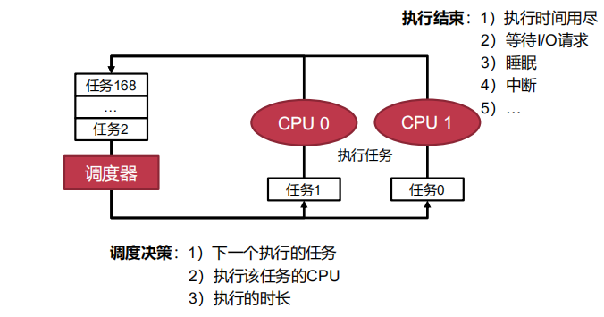
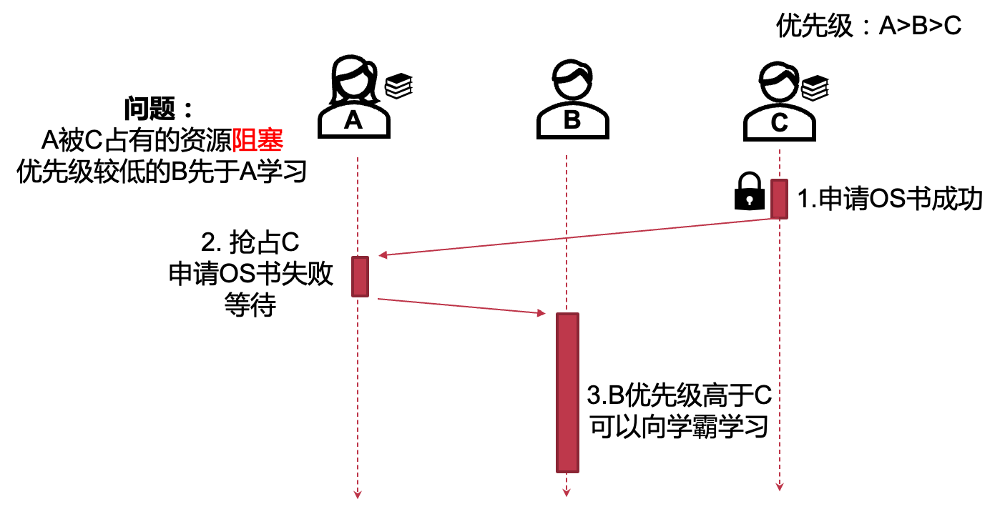
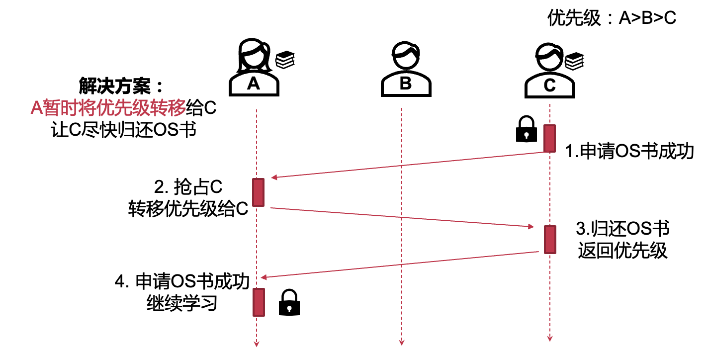
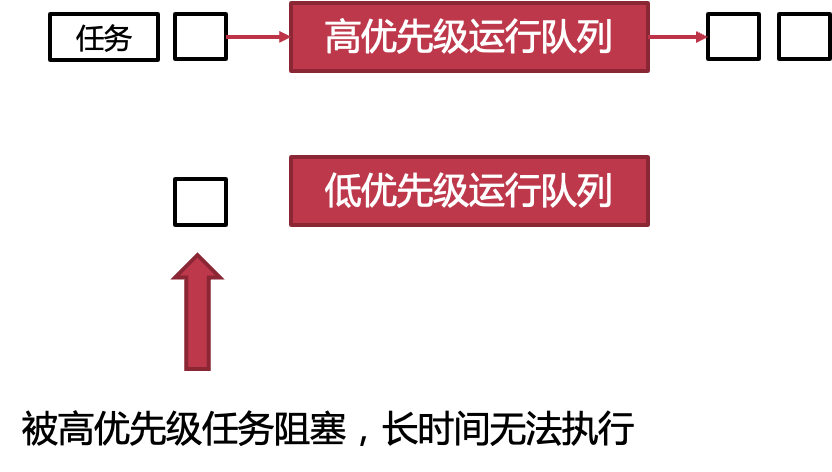
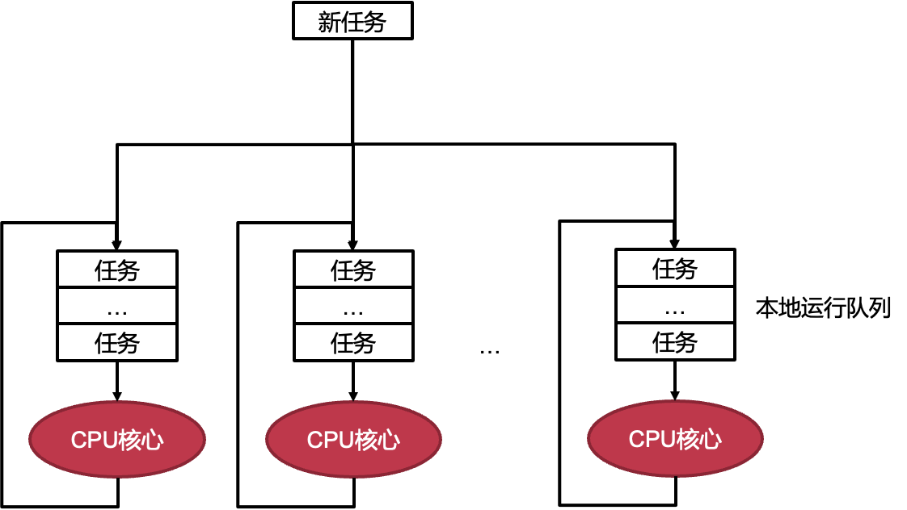

# 9.处理器调度

[toc]

## 9.1 **进程/线程调度:**

#### 9.1.1 overview



##### 调度的定义：协调对资源的使用请求

#### 9.1.2 **调度在不同场景下一些共有的目标：**

- **高资源利用率**
- **多任务公平性**
- **低调度开销**

#### 9.1.3 调度器的目标

- 降低周转时间：任务第一次进入系统到执行结束的时间
- 降低响应时间：任务第一次进入系统到第一次给用户输出的时间
- 实时性：在任务的截止时间内完成任务
- 公平性：每个任务都应该有机会执行，不能饿死
- 开销低：调度器是为了优化系统，而非制造性能BUG
- 可扩展：随着任务数量增加，仍能正常工作

#### 9.1.4 调度的挑战 

- 缺少信息（没有先知）：工作场景动态变化
- 线程/任务间的复杂交互
- 调度目标多样性：不同的系统可能关注不一样的调度指标
- 许多方面存在取舍
  - 优先级 （有些任务需要优先执行）V.S. 公平（ 所有任务都不能饿死）
  - 调度开销（制定一次决策的开销）V.S. 调度效果（决策是否考虑全面，效果足够好）
  - 能耗 V.S. 性能


## 9.2 经典调度

#### 9.2.1 First Come First Served

先到先得：简单、直观

问题：平均周转、响应时间过长

| **问题** | **到达时间** | **解答时间**  **（工作量）** |
| -------- | ------------ | ---------------------------- |
| A        | 0            | 4                            |
| B        | 1            | 7                            |
| C        | 2            | 2                            |


#### 9.2.2 Shortest Job First

短任务优先：平均周转时间短

问题：

1）不公平，任务饿死

 2）平均响应时间过长


#### 9.2.3 抢占式调度 (Preemptive Scheduling)

- 每次任务执行 一定时间后会被切换到下一任务，而非执行至终止
- 通过定时触发的时钟中断实现

#### 9.2.4 Round Robin (时间片轮转)

轮询：公平、平均响应时间短
问题：牺牲周转时间


- 什么情况下RR的周转时间问题最为明显？
  
    每个任务的执行时间差不多相同
    
- 时间片长短应该如何确定？

  - 时间片过长的话，RR会退化为FCFS
  - 时间片过短的话，在真实场景中调度开销会变大


## 9.3 优先级调度

> **优先级用于确保重要的任务被优先调度**

#### 9.3.1. **多级队列(Multi-Level Queue (MLQ))**

1）维护多个队列，每个对应静态设置好的优先级
2）高优先级的任务优先执行
3）同优先级内使用Round Robin调度（也可使用其他调度策略）

#### **9.3.2 存在的问题：**

1. 问题1：低资源利用率（P22）
   
    - 优先级的选取: 什么样的任务应该有高优先级?
      - I/O绑定的任务：为了更高的资源利用率
        - 用户主动设置的重要任务
        - 时延要求极高（必须在短时间内完成）的任务
        - 等待时间过长的任务：为了公平性
    
2. 问题2：优先级反转（P24)
    - 高、低优先级任务都需要独占共享资源,通常使用信号量、互斥锁实现独占
    - 低优先任务占用资源 -> 高优先级任务被阻塞
    
    **example**:
    
    
    
    **解决方法：优先级继承**
    
    

> 以下这些调度策略算不算优先级调度？
>
> - First Come First Served
> - Shortest Job First
> - Round Robin
>
> **ans**: 本质上FCFS的优先级是任务的到达顺序，SJF的优先级是任务的完成时间短
> RR则没有优先级概念（或者说所有任务优先级相同）

## 9.4 **MLFQ**

#### 9.4.1 目前介绍的调度策略的限制

- 周转时间、响应时间过长: FCFS
- 依赖对于任务的先验知识
  - 预知任务执行时间: SJF
  - 预知任务是否为I/O密集型任务: MLQ（用于设置任务优先级）

#### 9.4.2 **静态优先级的问题：低优先级任务饥饿**



#### 9.4.3 **MLFQ的主要目标与思路**

- 一个无需先验知识的通用调度策略
  - 周转时间低、响应时间低
  - 调度开销低

- 通过动态分析任务运行历史，总结任务特征
  - 类似思想的体现：页替换策略、预取
  - 需要注意：如果工作场景变化频繁，效果会很差


### 9.4.4 基本算法（基于Multi-Level Queue）

- 规则 1: 优先级高的任务会抢占优先级低的任务
- 规则 2: 每个任务会被分配时间片，优先级相同的两个任务使用时间片轮转
- 规则 3: 任务被创建时，假设该任务是短任务，为它分配最高优先级
- 规则 4a: 一个任务时间片耗尽后，它的优先级会被降低一级
- 规则 4b: 如果一个任务在时间片耗尽前放弃CPU，那么它的优先级不变, 任务重新执行时，会被分配新的时间片
- 更新的规则 4: 一个任务时间片耗尽后（无论它期间放弃了多次CPU，它的时间片不会被重置），它的优先级会被降低一级
- 规则 5:在某个时间段S后，将系统中所有任务优先级升为最高
  
    （为什么要提升全部的：为了避免有的任务运气不好）

#### 9.4.4.1 **针对混合工作场景**

– 执行时间短的任务

- 交互式任务
- I/O密集型任务


– 执行时间长的任务

- CPU密集型计算任务


#### 9.4.4.3 基本算法的问题（一）（1-4）

- 长任务饥饿: 过多的短任务、I/O密集型任务可能占用所有CPU时间
- 任务特征可能动态变化: CPU密集型任务→交互式任务，…

**解决方案**：**定时优先级提升 （规则5）**

- 效果1：避免长任务饿死
– 所有任务的优先级会定时地提升最高
– 最高级队列采用RR，长任务一定会被调度到
- 效果2：针对任务特征动态变化的场景
– MLFQ会定时地重新审视每个任务


#### 9.4.4.4 基本算法的问题（二)

- 无法应对抢占CPU时间的攻击

  - 恶意任务在时间片用完前发起I/O请求

  - 避免MLFQ将该任务的优先级降低，并且每次重新执行时间片会被重置

  - 几乎独占CPU！

  - 攻击示例：

    


##### **解决方案**：**更准确地记录执行时间 （更新规则4）**

- 规则 4: 一个任务时间片耗尽后（无论它期间放弃了多次CPU，它的时间片不会
被重置），它的优先级会被降低一级
- 更新策略
– 记录每个任务在当前优先级使用的时间片
– 当累计一个完整时间片被用完后，降低其优先级


### 9.4.5 MLFQ的参数调试

- 如何确定MLFQ的各种参数？
  - 优先级队列的数量（可以动态调整）
  - 不同队列的时间片长短（Q1长，Q3短）
  - 定时优先级提升的时间间隔（看gn）

#### 9.4.5.1 MLFQ各个队列时间片长短的选择

- 为不同队列选择不同的时间片
  - 高优先级队列时间片较短，针对短任务：提升响应时间
  - 低优先级队列时间片较长，针对长任务：降低调度开销

- 每个参数都体现了MLFQ的权衡：对于不同的工作场景，不同的参数会导致不一样的表现

#### 9.4.6 多级反馈队列总结

- 通过观察任务的历史执行，动态确定任务优先级，无需任务的先验知识
- 同时达到了周转时间和响应时间两方面的要求
  - 对于短任务，周转时间指标近似于SJF
  - 对于交互式任务，响应时间指标近似于RR
  - 可以避免长任务的饿死
- 许多著名系统的调度器是基于MLFQ实现的
  - BSD, Solaris, Windows NT 和后续Windows操作系统


## 9.5 **公平共享调度**

#### 9.5.1 **使用“ticket”表示任务的份额**

- 𝒕𝒊𝒄𝒌𝒆𝒕**：每个任务对应的份额**
- 𝑇 **：ticket的总量**
- **任务A：ticket 20**
- **任务B：ticket 30**
- **任务C：ticket 50**
- **则A:B:C占用的CPU执行时间**
  
    – 20:30:50
    

### 9.5.2 可以采用的实现方法1：**彩票调度（Lottery Scheduling）**

> 原理: 调度T次时，每个任务被调度次数的期望==该任务的份额


#### 9.5.2.1 **份额 与 优先级 的异同?**

- 份额影响任务对CPU的占用比例: 不会有任务饿死
- 优先级影响任务对CPU的使用顺序: 可能产生饿死

#### 9.5.2.2 随机的利弊

- 随机的好处: 简单
- 随机带来的问题: 
- 不精确——伪随机非真随机
- 各个任务对CPU时间的占比会有误差

### 9.5.3 方法二：**步幅调度（Stride Scheduling）**

- 可以看做**确定性版本的彩票调度**, 可以沿用tickets的概念

- Stride——步幅，任务一次执行增加的虚拟时间

  - $𝑠𝑡𝑟𝑖𝑑𝑒= \frac {MaxStride}{𝒕𝒊𝒄𝒌𝒆𝒕}$
    - MaxStride是一个足够大的整数
    - 本例中设为所有tickets的最小公倍数

  |      | **Ticket** | **Stride** |
  | ---- | ---------- | ---------- |
  | A1   | 30         | 10         |
  | A2   | 50         | 6          |
  | B1   | 60         | 5          |

- MaxStride = 300

- Pass——累计执行的虚拟时间


```c
/* select client with minimum pass value */
task = remove_queue_min(q);
/* use resource for quantum */
schedule(task);
/* compute next pass using stride */
task->pass += task->stride;
insert_queue(q, current);
```

#### 9.5.4 彩票调度和步幅调度的区别

> 预期——根据任务份额ticket计算的执行时间期望

|                              | **Lottery**  **Scheduling** | **Stride**   **Scheduling** |
| ---------------------------- | --------------------------- | --------------------------- |
| 调度决策生成                 | 随机                        | 确定性计算                  |
| 任务实际执行时间与预期的差距 | 大                          | 小                          |


## 9.6 **多核调度策略（Multicore Scheduling Policy）**

#### 9.6.1 多核调度需要考虑的额外因素

1. 一个进程的不同线程可以在不同CPU上同时运行
2. 同一个进程的线程很可能有依赖关系
3. 全局使用一个调度器的问题
    - 所有CPU竞争全局调度器, 同一个线程可能在不同CPU上切换
        - 切换开销大：Cache、TLB、…
        - 缓存局部性差

#### 9.6.2 Sol B: **群组调度：Gang Scheduling**

- **在多个CPU上同时执行一个进程的多个线程**
- example：
  
    

#### 9.6.3 Sol C: **Two-level Scheduling**


- ChCore & Linux同样使用Two-level Scheduling的架构
  每个CPU有各自的本地调度器和runq

- 每个CPU核心维护本地运行队列

  

#### 9.6.4 负载均衡（Load Balance）

- 需要追踪CPU的负载情况
- 将任务从负载高的CPU迁移到负载低的CPU


##### 9.6.4.1 根据任务负载定义的不同，负载均衡的效果也不尽相同

- 每个CPU核心本地运行队列的长度
  - ​	优势：实现简单
  - ​	劣势：不能准确反应当前CPU的负载情况
- 每个任务单位时间内使用的CPU资源
  - ​	优势：直观反映当前CPU的负载情况
  - ​	劣势：引入额外负载追踪开销

**亲和性（Affinity）**

- 通过操作系统暴露的任务亲和性接口，可以指定任务能够使用的CPU核心

> 任务亲和性（Task Affinity）是指在多任务操作系统中，为了提高系统性能和资源利用率，将相关任务或进程分配到同一个处理器或处理器核心上执行的策略。通过将相关任务放置在相邻的处理器或处理器核心上执行，可以减少任务之间的通信和同步开销，提高缓存的命中率，从而改善系统的性能。
>
> 任务亲和性可以应用于多个层面，包括进程级别、线程级别和硬件级别。
>
> 1. 进程级任务亲和性：在多进程应用程序中，可以将相关的进程分配到同一个处理器上执行。这样可以减少进程之间的通信开销，并提高数据共享和同步的效率。
>
> 2. 线程级任务亲和性：在多线程应用程序中，可以将相关的线程分配到同一个处理器核心上执行。这样可以减少线程之间的切换开销，并利用处理器核心的缓存来提高数据访问效率。
>
> 3. 硬件级任务亲和性：在具有多个处理器或处理器核心的系统中，可以将特定任务或进程与特定的处理器或处理器核心绑定在一起，使其始终在同一处理器或处理器核心上执行。这种绑定可以通过操作系统提供的调度策略或者编程接口来实现，以确保任务始终在特定的处理器或处理器核心上执行。
>
> 任务亲和性的实现可以根据具体的操作系统、编程模型和应用程序需求来进行调整。通过合理利用任务亲和性，可以优化系统的性能，减少资源竞争，提高应用程序的响应速度和吞吐量。