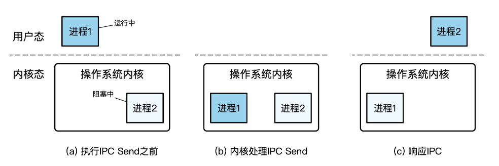

# 10. 进程间通信

[toc]

### 10.1 Overview

- 一些应用程序选择使用不同进程来运行不同模块
  - 优势-1：功能模块化，避免重复造轮子（如数据库、界面绘制）
  - 优势-2：增强模块间隔离，增强安全保障（敏感数据的隔离）
  - 优势-3：提高应用容错能力，限制故障在模块间的传播
- 然而不同进程拥有不同的内存地址空间，进程与进程之间无法直接进行通信和交互，需要一种进程间通信的方式，**IPC：Inter-Process Communication**

#### 10.1.1 常见IPC类型

| **IPC**机制 | **数据抽象** | **参与者** | **方向**  |
| ----------- | ------------ | ---------- | --------- |
| 管道        | 文件接口     | 两个进程   | 单向      |
| 共享内存    | 内存接口     | 多进程     | 单向/双向 |
| 消息队列    | 消息接口     | 多进程     | 单向/双向 |
| 信号        | 信号接口     | 多进程     | 单向      |
| 套接字      | 文件接口     | 两个进程   | 单向/双向 |

- 共享内存的情况下，TLB是有两份的
- 信号的特点是有OS定义的强烈语义

#### 10.1.2 **IPC的接口类型**

- 已有接口：内存接口：共享内存；文件接口：管道（Pipe）、套接字（Socket）
- 新的接口：消息接口、信号接口等
- 简单IPC的消息接口
  - 发送消息：Send(message)
  - 接收消息：Recv(message)
  - 远程方法调用：RPC(req_message, resp_message)
  - 回复消息：Reply(resp_message)

## 10.2 简单IPC的设计与实现

#### 10.2.1 简单实现

1. 发送
   
    
    
2. 接收 
   
    
    
3. 消息的远程方法调用（发送者）
   
    
    
4. 消息的远程方法调用（接收者）
   
    
    

#### 10.2.2 简单IPC的两个阶段

- **阶段-1：准备阶段**
– 建立通信连接，即进程间的信道
• 假设内核已经为两个进程映射了一段共享内存
- **阶段-2：通信阶段**
– 数据传递
• "消息"抽象：通常包含头部（含魔数）和数据内容（500字节）
– 通信机制
• 两个消息保存在共享内存中：发送者消息、接收者消息
• 发送者和接收者通过轮询消息的状态作为通知机制


包含指针是没有意义的，因为地址空间不同

#### 10.2.3 简单IPC数据传递的两种方法

- 方法-1：基于共享内存的数据传递
  – 操作系统在通信过程中不干预数据传输
  – 操作系统仅负责准备阶段的映射
  
    一次复制，receiver用的时候需要复制走（zero copy也是可以的，但是可能有风险）
  
- 方法-2：基于操作系统辅助的数据传递
  – 操作系统提供接口（系统调用）：Send、Recv（会进内核）
  – 通过内核态内存来传递数据，无需在用户态建立共享内存
  
    两次复制，先从sender复制进内核，再从内核复制进receiver
  

#### 两种数据传递方法的对比

- 基于共享内存的优势
– 用户态无需切换到内核态即可完成IPC（多核场景下）
– 完全由用户态程序控制，定制能力更强
– 可实现零内存拷贝（无需内核介入）
- 基于系统调用的优势
– 抽象更简单，用户态直接调用接口，使用更方便
– 安全性保证更强，发送者在消息被接收时通常无法修改消息
– 多方（多进程）通信时更灵活、更安全

#### 10.2.4 简单IPC的通知机制

- **方法-1：基于轮询（消息头部的状态信息）**
  
  - 缺点：大量CPU计算资源的浪费 
  
    - 优点：时延更低，不需要调度
- **方法-2：基于控制流转移**
  
  - 由内核控制进程的运行状态
  - 优点：进程只有在条件满足的情况下才运行，避免CPU浪费
  
    - 存在的问题：OS调度是不受用户控制的，进程1调完之后下面不一定要调2



#### 10.2.5 IPC的方向：单向和双向

- 简单IPC的一次完整通信过程包含两个方向的通信
– 发送者传递一个消息（即请求）给接收者
– 接收者返回一个消息（即结果）给发送者
- 通信的三种可能方向
– 仅支持单向通信
– 支持双向通信（可基于单向通信实现）
– 单向和双向通信均可（根据配置来选择）

#### 10.2.6 IPC控制流：同步和异步

- 同步IPC （比如RPC）
  – IPC操作会阻塞进程直到操作完成
  – 线性的控制流
  – 调用者继续运行时，返回结果已经ready

- 异步IPC （send ,recv)
  – 进程发起IPC操作后即可返回而不需要等待其完成
  – 通过轮询或回调函数（需内核支持）来获取返回结果

  

#### 10.2.7 IPC的超时机制

- 一种新的错误：超时
– 传统的函数调用不存在超时问题
– IPC涉及两个进程，分别有独立的控制流
- 超时可能的原因
– 被调用者是恶意的：故意不返回
– 被调用者不是恶意的：运行时间过长、调度时间过长、请求丢失等
- 超时机制
– 应用可自行设置超时的阈值，但如何选择合适的阈值却很难(有trade off)
– 特殊的超时机制：阻塞、立即返回（要求被调用者处于可立即响应的状态）

#### 10.2.8 IPC的两种通信连接抽象

- **方法1：直接通信**
  
    – 通信的一方需要显示地标识另一方，每一方都拥有唯一标识
    
    – 如：Send(P, message), Recv(Q, message)
    
    – 连接的建立是自动完成的（由内核完成）
    
- **方法2：间接通信**
  
    – 通信双方通过"信箱"的抽象来完成通信
    
    – 每个信箱有自己唯一的标识符
    
    – 通信双方并不直接知道在与谁通信
    
    – 进程间连接的建立发生在共享一个信箱时
    

#### 10.2.9 IPC的权限检查

- **宏内核**
  
    – 通常基于权限检查的机制实现
    
    – 如：Linux中与文件的权限检查结合在一起（比如pipe)
    
- **微内核**
  
    – 通常基于Capability安全检查机制实现(类似fd)
    
    > capability表示进程的权限，可以移交给其他的进程
    > 
    
    – 如seL4将通信连接抽象为内核对象，不同进程对于内核对象的访问权限与操作有Capability来刻画
    
    – Capability保存在内核中，与进程绑定
    
    – 进程发起IPC时，内核检查其是否拥有对应的Capability
    

#### 10.2.10 IPC的命名服务

- 命名服务：一个单独的进程（启动时就有的）
– 类似一个全局的看板，协调服务端与客户端之间的信息
– 服务端可以将自己提供的服务注册到命名服务中
– 客户端可以通过命名服务进程获取当前可用的服务
- 命名服务的功能：分发权限
– 例如：微内核中的文件系统进程（服务）允许命名服务将连接文件系统的权限任意分发，因此所有进程都可以访问全局的文件系统
– 例如：数据库进程只允许拥有特定证书的客户端连接（应用机制）


## 10.3 管道：文件接口的IPC

#### 10.3.1 Unix 管道

> Shell中的管道机制并不完全等于内核中的管道机制。
> 有些shell会选择用中间文件等来实现pipe（不过比较少）

- 管道是Unix等系统中常见的进程间通信机制
- 管道(Pipe): 两个进程间的一根通信通道
  -  一端向里投递，另一端接收
  -  管道是间接消息传递方式，通过共享一个管道来建立连接

- 例子: 我们常见的命令 ls | grep

#### 10.3.2 管道的优点与问题

- 优点: 设计和实现简单
– 针对简单通信场景十分有效
- 问题:
  
    – 缺少消息的类型，接收者需要对消息内容进行解析
    – 缓冲区大小预先分配且固定（可能有溢出）
    – 只能支持单向通信（为什么？）
    – 只能支持最多两个进程间通信（只能一个人读，一个人写）

- 管道只支持单向通信的原因：

  简化设计：管道的设计目标是提供一种简单而有效的进程间通信方式。为了保持设计的简洁性，管道被限制为单向通信。这样，管道的实现可以更加简单和高效，不需要处理双向通信所涉及的复杂性和开销。

  缓冲区限制：管道是基于缓冲区的通信机制。在单向通信中，发送方将数据写入管道的写端，接收方从管道的读端读取数据。这种单向流动的设计使得数据的传输和管理更加简单。如果管道支持双向通信，就需要维护两个独立的缓冲区，增加了复杂性和内存开销。

  顺序性：管道是有序的字节流传输机制，数据按照顺序写入管道的一端，并按照相同的顺序从另一端读取。如果支持双向通信，就需要处理不同方向上数据交错的情况，可能导致数据的混乱和不一致。

#### 10.3.3 匿名管道与命名管道

- **传统的管道缺乏名字，只能在有亲缘关系的进程间使用**
– 也称为“匿名管道”
– 通常通过fork，在父子进程间传递fd
- **命名管道：具有文件名**
– 在Linux中也称为fifo，可通过mkfifo()来创建
– 可以在没有亲缘关系的进程之间实现IPC
– 允许一个写端，多个读端；或多个写端，一个读端


## 10.4 共享内存（内存接口的IPC）

#### 10.4.1 基础实现: 共享区域


#### 10.4.2 基于共享内存的生产者消费者问题实现

- 发送者


- 接收者

  

#### 10.4.3 共享内存的问题

- 缺少通知机制
– 若轮询检查，则导致CPU资源浪费
– 若周期性检查，则可能导致较长的等待时延
– 根本原因：共享内存的抽象过于底层；缺少OS更多支持
- TOCTTOU （Time-of-check to Time-of-use）问题
  
  - 当接收者直接用共享内存上的数据时，可能存在被发送者恶意篡改的情况（发生在接收者检查完数据之后，使用数据之前），这可能导致buffer overflow等问题
  
    - 解决方法：只读一次，读出来以后就放在自己的内存区域


## 10.5 消息传递（MESSAGE PASSING）

#### 10.5.1 消息队列

- 一种消息传递机制
- 设计选择：
– 间接通信方式，信箱为内核中维护的消息队列结构体
– 有（有限的）缓存
– 没有超时机制
– 支持多个（大于2）的参与者进行通信
– 通常是非阻塞的（不考虑如内核缓存区满等异常情况）

#### 10.5.2 消息队列: 带类型的消息传递

- 消息队列: 以链表的方式组织消息
– 任何有权限的进程都可以访问队列，写入或者读取
– 支持异步通信 (非阻塞)
- 消息的格式: 类型 + 数据
– 类型：由一个整型表示，具体的意义由用户决定
- 消息队列是间接消息传递方式：通过共享一个队列来建立连接


#### 10.5.3 消息队列的例子


#### 10.5.4 消息队列：带类型的消息传递

- 消息队列的组织
– 基本遵循FIFO (First-In-First-Out)先进先出原则
– 消息队列的写入：增加在队列尾部
– 消息队列的读取：默认从队首获取消息
- 允许按照类型查询: Recv(A, type, message)
– 类型为0时返回第一个消息 (FIFO)
– 类型有值时按照类型查询消息
• 如type为正数，则返回第一个类型为type的消息

#### 10.5.5 消息队列 VS. 管道

> 消息队列更加灵活易用，但是实现也更加复杂

- 缓存区设计:
  - 消息队列: 链表的组织方式，动态分配资源，可以设置很大的上限
  - 管道: 固定的缓冲区间，分配过大资源容易造成浪费
- 消息格式:
  - 消息队列: 带类型的数据
  - 管道: 数据 (字节流)
- 连接上的通信进程:
  - 消息队列: 可以有多个发送者和接收者
  - 管道: 两个端口，最多对应两个进程
- 消息的管理:
  - 消息队列: FIFO + 基于类型的查询
  - 管道: FIFO

## 10.6 轻量级远程方法调用 (LRPC)

#### 10.6.1 background: IPC通常会带来较大的性能损失

- **传统的进程间通信机制通常会结合以下机制：**
– 通知：告诉目标进程事件的发生
– 调度：修改进程的运行状态以及系统的调度队列
– 传输：传输一个消息的数据过去
- 缺少一个轻量的远程调用机制
– 客户端进程切换到服务端进程，执行特定的函数 (Handler)
– 参数的传递和结果的返回

**解决两个主要问题**

- 控制流转换: Client进程快速通知Server进程

- 数据传输: 将栈和寄存器参数传递给Server进程

  

#### 10.6.2 控制流转换: 调度导致不确定时延

- 控制流转换需要下陷到内核, 内核系统为了保证公平等，会在内核中根据情况进行调度, Client和Server之间可能会执行多个不相关进程,如下所示

  

#### 10.6.2 解决**调度导致不确定时延：迁移线程—— 将Client运行在Server的上下文**

> 这里的迁移线程方案主要用作不同进程之间的线程

- 为什么需要做控制流转换?
  
    – 使用Server的代码和数据
    – 使用Server的权限 (如访问某些系统资源)
    
- 只切换地址空间、权限表等状态，不做调度和线程切换

    

#### 10.6.3 数据传输: 数据拷贝的性能损失

> 共享内存虽然可以避免拷贝，但是也存在很多其他问题：包括TOCTTOU问题，临时动态映射问题，重映射会有TLB shootdown等。
>
> 拷贝还可以通过DMA实现。不过DMA只对于大数据的拷贝有加速，而小数据会更慢。

- 大部分Unix类系统，经过内核的传输有(至少)两次拷贝: Client→内核→ Server
- 数据拷贝的缺点:
  - 慢: 拷贝本身的性能就不快 (内存指令)
  - 不可扩展: 数据量增大10x，时延增大10x

#### 10.6.3 解决数据拷贝的性能损失：共享参数栈和寄存器

- 参数栈 (Argument stack，简称A-stack）
  
    – 系统内核为每一对LRPC连接预先分配好一个A-stack
    – A-stack被同时映射在Client进程和Server进程地址空间
    – Client进程只需要将参数准备到A-stack即可
    • 不需要内核额外拷贝
    
- 执行栈（Execution stack，简称E-stack） 

  - E-stack是由被切换进程提前准备好的

- 共享寄存器
  – 普通的上下文切换: 保存当前寄存器状态 → 恢复切换到的进程寄存器状态
  – LRPC迁移进程: 直接使用当前的通用寄存器

  - 类似函数调用中用寄存器传递参数
  - 共享寄存器主要是针对于通用寄存器，用作参数传递。其他的如栈寄存器sp等，还是要变化的。


#### 10.6.4 轻量远程调用：通信连接建立的流程

- Server进程通过内核注册一个服务描述符，对应Server进程内部的一个处理函数(Handler)
- 内核为服务描述符预先分配好参数栈
- 内核为服务描述符分配好调用记录 (Linkage record)
  - Linkage record：独立于进程而存在，记录返回地址，从而能支持嵌套调用
  - 用于从Server进程处返回（类似栈）
- 内核将参数栈交给Client进程，作为一个绑定成功的标志
  - 在通信过程中，通过检查A-stack来判断Client是否正确发起通信
  - A-stack在两个进程上的映射代表了一个通信连接的建立

#### 10.6.5 基本用户接口


#### 10.6.6 一次调用过程

1. 内核验证绑定对象的正确性，并找到正确的服务描述符
2. 内核验证参数栈和连接记录
3. 检查是否有并发调用 (可能导致A-stack等异常)
4. 将Client的返回地址和栈指针放到连接记录中
5. 将连接记录放到线程控制结构体中的栈上 (支持嵌套LRPC调用)
6. 找到Server进程的E-stack (执行代码所使用的栈)
7. 将当前线程的栈指针设置为Server进程的运行栈地址
8. 将地址空间切换到Server进程中
9. 执行Server地址空间中的处理函数

#### 10.6.7 通信调用实现

参数主要放在通用寄存器上

```c
ipc_call(A-stack, arg0, .. arg7):
    verify_binding(A-stack); //验证A-stack正确性 
    service_descriptor = get_desc_from_A(A-stack);
    /*其他安全检查: 是否存在并发调用？*/
    …
    save_ctx_to_linkage_record(); //保存调用信息到连接记录上
    save_linkage_record();
     …
    /* 切换运行状态 */
    switch_PT(); //修改页表
    switch_cap_table(); //修改权限表
    switch_sp(); //修改栈地址
    ….    
    //返回到用户态(服务端进程)，不修改参数寄存器
    ctx_restore_with_args (ret);
```

#### 10.6.8 questions

##### 1. 为什么需要将栈分成参数栈和运行栈？

参数栈是为了共享传递参数，而执行栈是为了执行代码已经处理局部变量等使用的

##### 2. LRPC中控制流转换的主要开销是什么?

地址空间的切换（来自硬件限制）是最主要的性能开销

##### 3. 在不考虑多线程的情况下，共享参数栈是否安全？

安全的。因为是同步IPC，所以在被调用者上下文执行的时候，其实没有其他人可以去读写A-stack

