# 11. 同步原语

[toc]

### background:

**操作系统在多处理器多核环境下面临的问题**:

1. **正确性保证**

   • 对共享资源的竞争导致错误

   • 操作系统提供**同步原语**供开发者使用

   • 使用同步原语带来新的问题

2. **性能保证**

   • 多核多处理器硬件与特性

   • 可扩展性问题导致性能断崖

   • 系统软件设计如何利用硬件特性

## 1. **四个场景与对应的同步原语**

#### 场景一：共享资源互斥访问

多个线程需要同时访问同一共享数据应用程序需要保证**互斥访问**避免数据竞争

**Sol**: 使用**互斥锁**保证**互斥访问**

#### **衍生场景一：读写场景并发读取**

多个线程**只会读取**共享数据, 允许读者线程**并发执行**

**Sol**: 可使用**读写锁**提升读者并行度

#### **场景二：条件等待与唤醒**

线程等待某条件时**睡眠**，达成该条件后**唤醒**

**Sol**: 使用**条件变量**完成线程睡眠/唤醒

#### **场景三：多资源协调管理**

多个资源可以被多个线程**消耗或释放**，正确协同线程获取资源或等待

**Sol**: 使用**信号量**完成资源管理与线程协同


## 2. **同步与临界区**

#### **单生产者消费者问题方案**

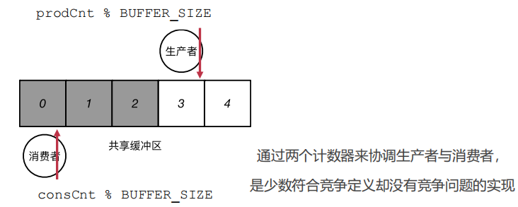

#### 多生产者消费者问题


#### **同步原语**

**同步原语**（Synchronization Primitives）是一个平台（如**操作系统**）提供的用于帮助开发者实现线程之间**同步**的**软件工具**


#### **临界区（Critical Section**)

**三个要求**:

• **互斥访问**：在同一时刻，**有且仅有一个线程**可以进入临界区

• **有限等待**：当一个线程申请进入临界区之后，必须在**有限的时间**内获得许可进入临界区而不能无限等待

• **空闲让进**：当没有线程在临界区中时，必须在申请进入临界区的线程中选择一个进入临界区，保证执行临界区的**进展**

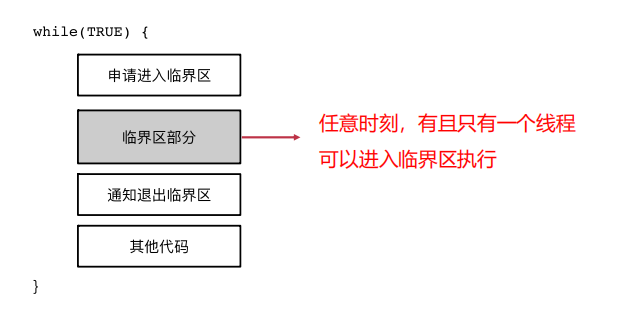

**1. 软件解决方案：皮特森算法**

Peterson算法是实现进程互斥访问临界区的一种方法，避免了单标志法必须交替访问的限制，以及双标志法后检验的“饥饿”问题。

Peterson算法实现如下：

```text
Pi进程:
flag[i] = TRUE; turn = j;
while(flag[j] && turn == j);
// 访问临界区
flag[i] = FALSE;
// 剩余区

Pj进程:
flag[j] = TRUE; turn = i;
while(flag[i] && turn == i);
// 访问临界区
flag[j] = FALSE;
// 剩余区
```

对于`Pi`进程：

`flag[i] = TRUE`将自身的访问位置为1，`turn = j` 向对方发出访问请求；
while中的循环条件即阻塞条件为，若对方需要访问且对方未应答访问请求。

对于阻塞条件我们可以这样理解，访问位置为1即自己想要访问临界区，然后向对方发出访问请求。

- 若此时对方根本不想访问，那么不会被阻塞直接访问临界区，此时不会发生异常；
- 若此时对方将访问位已经置为1，那么对方可能准备访问临界区或正在访问临界区：
  \- 若对方正在访问临界区，那么此时对方不会应答自己的请求，则被阻塞；
  \- 若对方准备访问临界区，访问前需要收到我方应答，此时先发送请求的一方必定会收到应答，即可以访问临界区，那么另一方因为请求后对方已经进入临界区，得不到应答，必须等对方退出临界区，将访问位置0才能访问。

在这样的机制下，双方实现了对临界区的互斥访问。

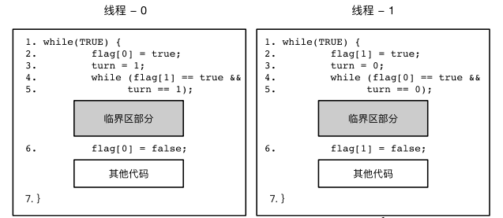

在**满足一定硬件条件**的情况下，满足解决临界区问题的三个必要条件

**2. 关闭中断**

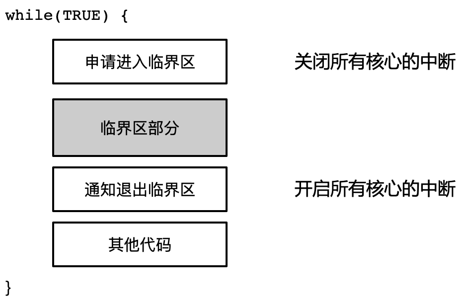

* 可以解决单个CPU核上的临界区问题如果在多个核心中，关闭中断不能阻塞其他进程执行
* 性能会很差


## 3. **互斥锁（Mutual Exclusive Lock）**

#### **接口：拿锁和放锁**

1. Lock(lock)：尝试拿到锁“lock” 

   • 若当前没有其他线程拿着lock，则拿到lock，并继续往下执行

   • 若lock被其他线程拿着，则不断循环等待放锁（busy loop） 

2. Unlock(lock)

   • 释放锁

• **保证同时只有一个线程能够拿到锁**

#### example1： **用互斥锁解决多生产者消费者问题**

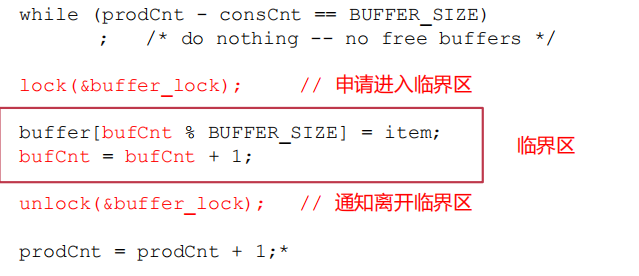

#### example2： **用互斥锁解决多线程计数问题**

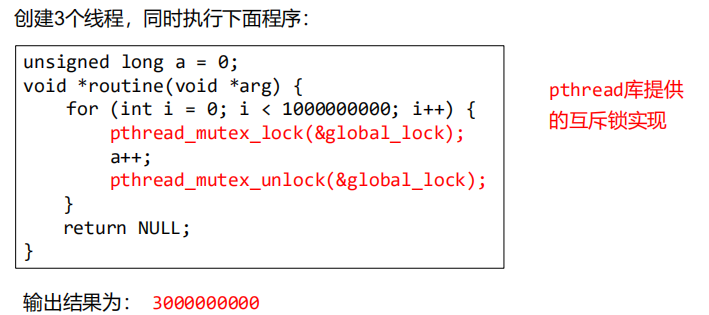

## 4. **条件变量**

利用**睡眠**/**唤醒**机制，避免无意义的等待，让操作系统的调度器调度其他进程/线程执行

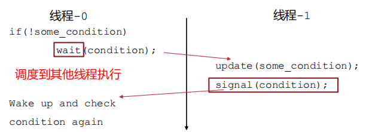

#### 接口

1. 唤醒的时候参数的`cond`指明了是哪个等待队列

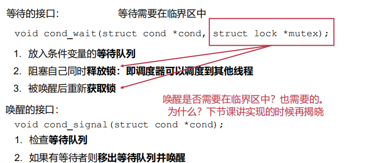

#### 使用示例

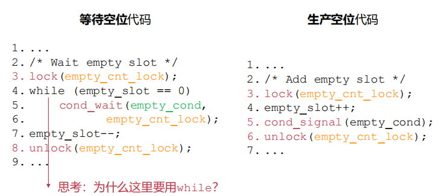

ans: 如果有多个线程在等待，可能会一次等不到`empty_slot`,比如：

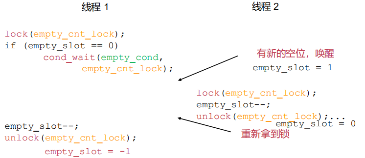

这个时候线程1会错误地执行`empty_slot--`

## 5. **信号量（**SEMAPHORE）

#### **信号量 （**PV原语）

> **信号量**：协调（阻塞/放行)多个线程共享有限数量的资源

语义上：信号量的值cnt记录了**当前可用资源的数量**

提供了两个原语 P 和 V 用于**等待**/**消耗**资源

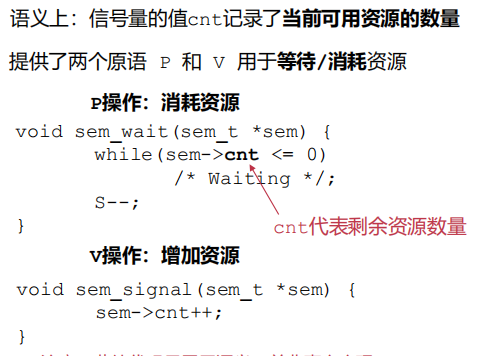

#### example: **信号量的使用**

原始代码：

```c
while(true) {
	new_msg = produce_new();
	lock(&empty_slot_lock);
	while (empty_slot == 0) 
		cond_wait(&empty_cond, &empty_slot_lock);
	empty_slot--;
	unlock(&empty_slot_lock);

	buffer_add(new_msg);
	// ...
}
```

使用信号量：

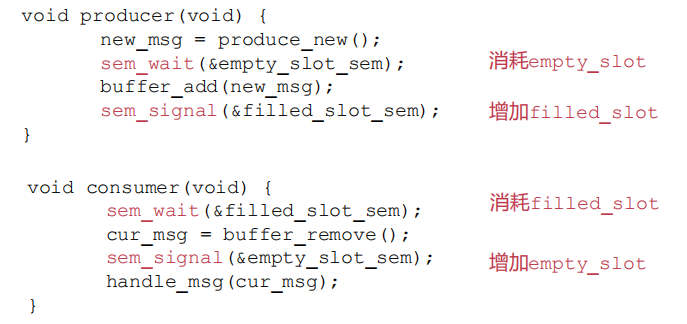

#### **二元信号量与计数信号量**

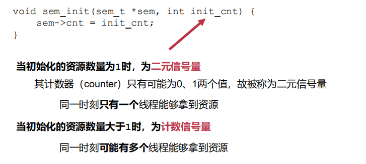

## 6.**读写锁**

1.  多个读者不互斥
2.  为了避免读者看到一半就被写者撤走了，使用互斥锁

#### **读写锁的使用示例**


#### 和互斥锁的比较

互斥锁：所有的线程均互斥，同一时刻只能有一个线程进入临界区对于部分只读取共享数据的线程过于严厉

读写锁：区分读者与写者，允许读者之间并行，读者与写者之间互斥

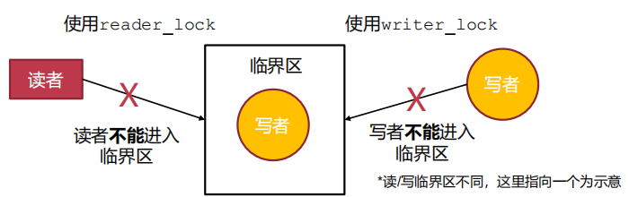


## 7. **不同同步原语之间的比较**

#### 互斥锁VS二元信号量

##### 互斥锁**与**二元信号量**功能类似，但**抽象不同： 

* 互斥锁有**拥有者**的概念，一般同一个线程拿锁/放锁

* 信号量为资源协调，一般一个线程signal，另一个线程wait

  互斥锁：代码，同线程

  信号量：数据，不同线程


**条件变量**用于解决不同问题（睡眠/唤醒），需要搭配**互斥锁**使用，搭配**互斥锁**+计数器**可以实现与信号量相同的功能**


#### **互斥锁** **vs** **读写锁**

* 接口不同：读写锁区分读者与写者

-  **针对场景不同**：获取**更多程序语义**，标明只读代码段，达到更好性能

-  读写锁在读多写少场景中可以显著**提升读者并行度**

-  即允许多个读者同时执行读临界区

-  只用写者锁，则与互斥锁的语义基本相同


## 8. **同步**带来的问题：死锁

#### **死锁产生的原因**

* **互斥访问**：同一时刻只有一个线程能够访问

- **持有并等待**：一直持有一部分资源并等待另一部分不会中途释放

- **资源非抢占**：即proc_B不会抢proc_A已经持有的锁A

- **循环等待**：A等B，B等A

### **如何解决死锁**

- #### 出问题再处理：死锁的检测与恢复

  - 找到循环等待的环：

    •直接kill所有循环中的线程

    •Kill一个，看有没有环，有的话继续kill

    •全部回滚到之前的某一状态

  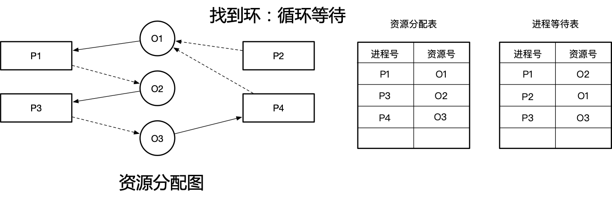

- #### **设计时避免：死锁预防**

  - 避免互斥访问：通过其他手段（如代理执行），只有代理线程能够访问共享资源：避免数据竞争

    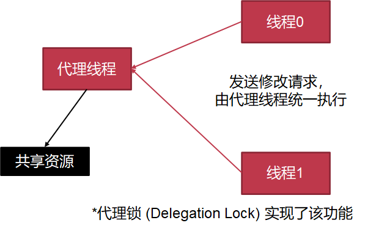

  - 不允许持有并等待：一次性申请所有资源

    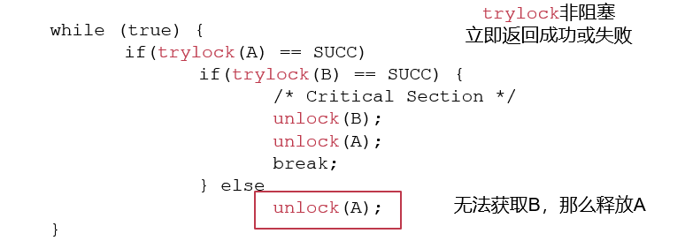

    - 避免死锁带来的活锁 Live Lock

      

  - 资源允许抢占：需要考虑如何恢复

    - **需要让线程A正确回滚到拿锁A之前的状态**

    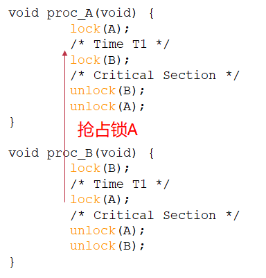

  - 打破循环等待：按照特定顺序获取资源，对所有资源进行编号， 让所有线程递增获取。任意时刻，获取最大资源号的线程可以继续执行，然后释放资源

- #### 运行时避免死锁：死锁避免

  **银行家算法**：

  * 所有线程获取资源需要通过**管理者**同意

  * 管理者**预演**会不会造成死锁

    * 如果会造成：阻塞线程，下次再给
    * 如果不会造成：给线程该资源

  * 算法流程：

    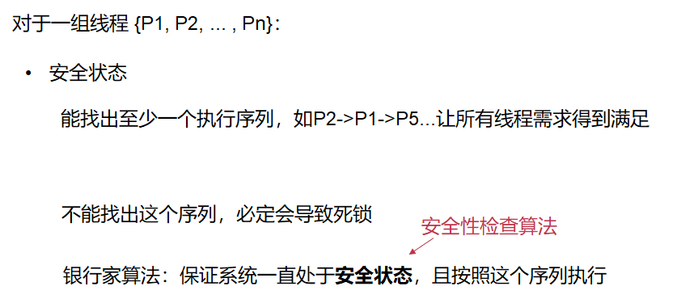


##### example：假设有M个资源 N个线程

##### 四个数据结构：

- 全局可利用资源：Available[M]， 该向量代表某一时刻系统中每一类元素的可用个数。这个向量初始化时设置为系统中拥有的第$M$类资源的总量。
- 每线程最大需求量：Max[ N ] [ M ]，该矩阵包含所有线程$N$对第$M$类资源的最大需求量。
- 已分配资源：Allocation[N] [M]，该矩阵包含已经分配给所有线程$N$的$M$种资源的数量。
- 还需要的资源：Need[N] [M]，该矩阵包含所有线程$N$对第$M$累资源还需要的资源数量。

安全序列：

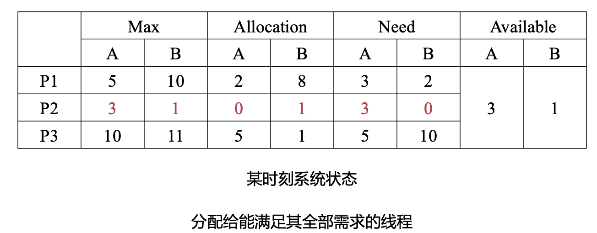

# 12. **同步原语的应用与实现**


## 0. 同步案例分析

| **同步原语** | **描述**                              | **使用场景**                       |
| ------------ | ------------------------------------- | ---------------------------------- |
| **互斥锁**   | 保证对共享资源     的**互斥访问**     | **场景一**     共享资源互斥访问    |
| **读写锁**   | 允许读者线程     **并发读取**共享资源 | **衍生场景一**    读写场景并发读取 |
| **条件变量** | 提供线程**睡眠**     与**唤醒**机制   | **场景二**     条件等待与唤醒      |
| **信号量**   | 协调**有限数量**资源     的消耗与释放 | **场景三**    多资源协调管理       |

#### 同步案例-1：多线程执行屏障

等待全部执行到屏障后再继续执行， 符合场景2: 线程等待/唤醒

```c
lock(&thread_cnt_lock);
thread_cnt--;
if (thread_cnt == 0)
  cond_broadcast(cond);
while(thread_cnt != 0)
  cond_wait(&cond, &thread_cnt_lock); 
unlock(&thread_cnt_lock);
```

#### 同步案例-2：等待队列工作窃取

每核心等待队列，在空时允许窃取其他核心的任务，符合场景1: 共享资源互斥访问，

```c
lock(ready_queue_lock[0]);
```


#### 同步案例-3：map-reduce

Word-count：大文本拆分字数统计
Mapper：统计一部分文本自述
Reducer：一旦其中任意数量的Mapper结束，就累加其结果

**符合场景2: 线程等待/唤醒**, mapper:

```c
lock(&finished_cnt_lock);
finished_cnt ++;
cond_signal(&cond); 
unlock(&finished_cnt_lock);
```

reducer,**一次性拿走所有的finished的Mapper的结果**:

```c
lock(&finished_cnt_lock);
while(finished_cnt == 0)
  cond_wait(&cond, &finished_cnt_lock);
/* collect result */
finished_cnt = 0;
unlock(&finished_cnt_lock);
```

**也符合场景** **3:** **将Mapper的结果视为资源**

Mapper:

```c
signal(&finish_sem);
```

Reducer:

```c
while(finished_cnt != mapper_cnt) {
  wait(&finish_sem);
  /* collect result */
  finished_cnt ++;
}
```

这两种解决方案的不同：

- 上一种可以多个结果一起collect，sem这种只能一次collect一个sem的语义，就是一次只能拿走一个（counter每次只能减一）

- 但cv更复杂


#### 同步案例-4：网页渲染

网页等待所有的请求均完成后再进行渲染

**sol1: ** 符合**场景2: 等待/唤醒**

**Request_cb**：

```c
lock(&glock);
finished_cnt ++；
if (finished_cnt == req_cnt)
  cond_signal(&gcond);
unlock(&glock);
```

**渲染线程**

```c
lock(&glock);
while (finished_cnt != req_cnt)
  cond_wait(&gcond, &glock);
unlock(&glock);
```

**sol2: 符合场景3: 视为所有请求结果为资源**

**Request_cb**:

```c
signal(&gsem);
```

**渲染线程**:

```c
while(remain_req != 0) {
  wait(&gsem);
  remain_req --;
}
```


两种方法的比较：

同样需要wait多次，唤醒多次；好处是代码更简单
与barrier场景的区别：barrier不适合用sem，没有什么适合抽象成等待的资源

#### 同步案例-5：线程池并发控制

控制同一时刻可以执行的线程数量
原因：有的线程阻塞时可以允许新的线程替上
例子：允许同时三个线程执行

符合**场景三：视剩余可并行执行线程数量为有限资源**

```c
thread_routine () {
  wait(&thread_cnt_sem);
  /* doing something */
  signal(&thread_cnt_sem);
}
```

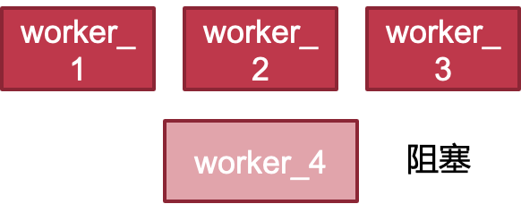

#### 同步案例-6：网页服务器

- 处理响应客户端获取静态网页需求
- 处理后端更新静态网页需求
- 不允许读取更新到一半的页面
- 符合**衍生场景** **1:** **读写场景，可以使用读写锁**，
  - client用读锁
  - 后端用写锁

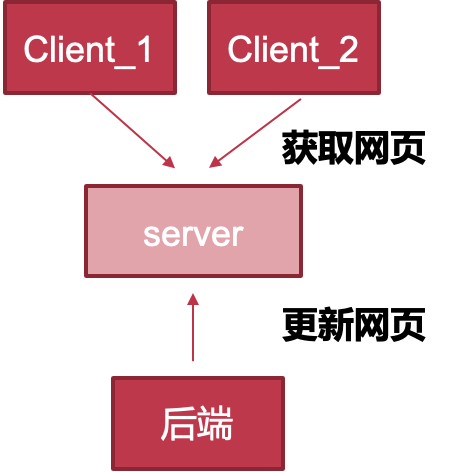

#### 同步原语选择guideline

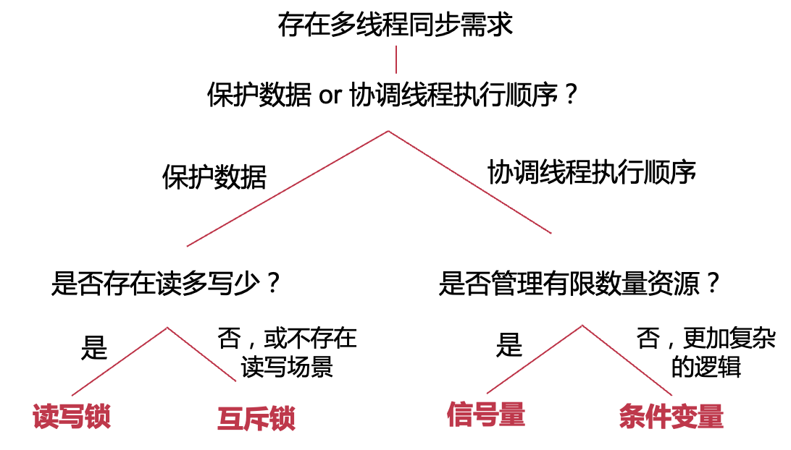


## 1. 硬件原子操作

#### 常见原子指令

- test and set
- compare ans swap
- Load-linked & store-conditional
- fetch and add

#### 硬件原子操作：ARM使用LL/SC实现

Load-linked & Store-conditional以地址为粒度，并发性更好，但是代码更复杂；

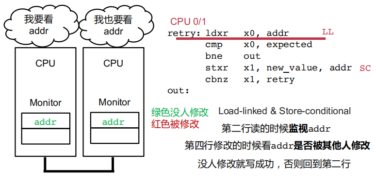


## 2. **锁的实现**

只有一个拿到锁，只有一个人可以放锁，所以放锁不需要加锁

#### 自旋锁（Spinlock）

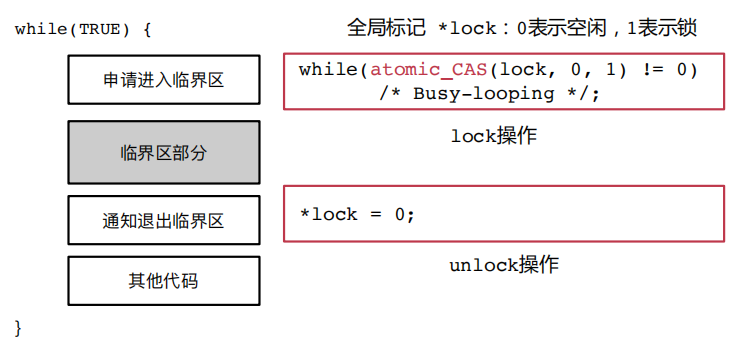

```c
void lock(int *lock) {
    while(atomic_CAS(lock, 0, 1) 
	!= 0)
	/* Busy-looping */ ;
}

void unlock(int *lock) {
    *lock = 0;
}
```

##### 评价：

- 互斥访问 ✓ 

- 有限等待 x: 有的“运气差”的进程可能永远也不能成功CAS => 出现饥饿

- 空闲让进  ✓ : 依赖于硬件 => 当多个核同时对一个地址执行原子操作时，能否保证至少有一个能够成功(基本硬件能保证)


#### 排号锁（Ticket Lock）

> 通过遵循竞争者到达的顺序来传递锁, 保证竞争者的公平性

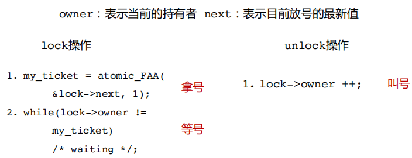

##### 代码实现

```c
void lock(int *lock) {
    volatile unsigned my_ticket =
        atomic_FAA(&lock->next, 1);
    while(lock->owner != my_ticket)
	/* busy waiting */;
}

void unlock(int *lock) {
    lock->owner ++;
}
```

##### 评价：

- 互斥访问 ✓ 

- 有限等待 ？ 按照顺序，在前序竞争者保证有限时间释放时，可以达到有限等待（假设不会有线程一直霸着资源不释放）

- 空闲让进✓

#### **读写锁**

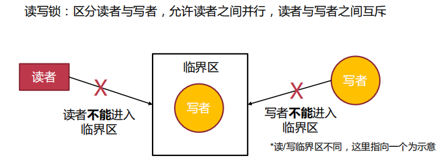

​		

* **读写锁的偏向性**

  *  **考虑这种情况：**t0：有读者在临界区； t1：有新的写者在等待；t2：另一个读者能否进入临界区？ 	
     * **不能：偏向写者的读写锁**，**更加公平**（后序读者必须等待写者进入后才进入） 
     * **能：偏向读者的读写锁**，**更好的并行性**（ 后序读者可以直接进入临界区）

* **偏向读者的读写锁**实现示例

  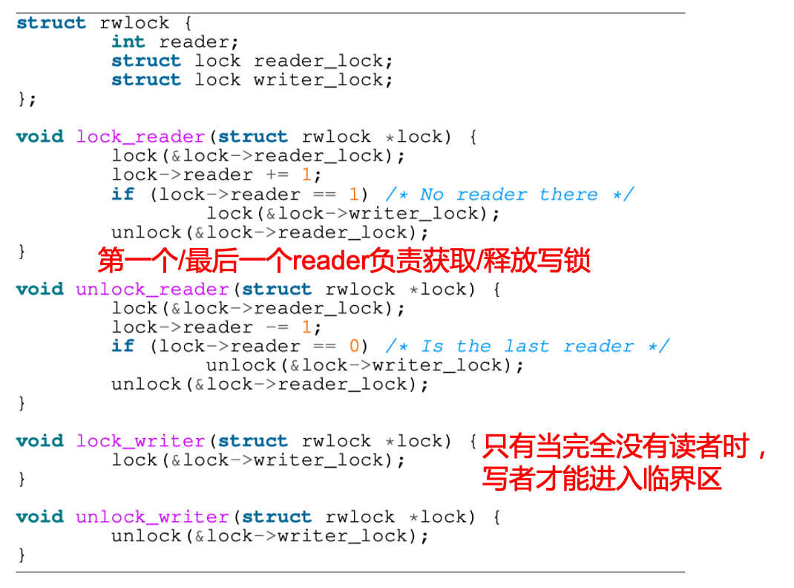

  * 另外一种实现

    ```c
    #include <stdio.h>
    #include <pthread.h>
    
    typedef struct {
        pthread_mutex_t mutex;
        pthread_cond_t read_cond;
        pthread_cond_t write_cond;
        int readers;
        int writer;
        int pending_writers;
    } ReaderWriterLock;
    
    void initialize_rwlock(ReaderWriterLock* rwlock) {
        pthread_mutex_init(&rwlock->mutex, NULL);
        pthread_cond_init(&rwlock->read_cond, NULL);
        pthread_cond_init(&rwlock->write_cond, NULL);
        rwlock->readers = 0;
        rwlock->writer = 0;
        rwlock->pending_writers = 0;
    }
    
    void acquire_read_lock(ReaderWriterLock* rwlock) {
        pthread_mutex_lock(&rwlock->mutex);
    
        // 等待写入操作完成
        while (rwlock->writer || rwlock->pending_writers > 0) {
            pthread_cond_wait(&rwlock->read_cond, &rwlock->mutex);
        }
    
        rwlock->readers++;
    
        pthread_mutex_unlock(&rwlock->mutex);
    }
    
    void release_read_lock(ReaderWriterLock* rwlock) {
        pthread_mutex_lock(&rwlock->mutex);
    
        rwlock->readers--;
    
        // 如果没有读者，则唤醒等待的写入操作
        if (rwlock->readers == 0) {
            pthread_cond_signal(&rwlock->write_cond);
        }
    
        pthread_mutex_unlock(&rwlock->mutex);
    }
    
    void acquire_write_lock(ReaderWriterLock* rwlock) {
        pthread_mutex_lock(&rwlock->mutex);
    
        rwlock->pending_writers++;
    
        // 等待读取和写入操作完成
        while (rwlock->readers > 0 || rwlock->writer) {
            pthread_cond_wait(&rwlock->write_cond, &rwlock->mutex);
        }
    
        rwlock->pending_writers--;
        rwlock->writer = 1;
    
        pthread_mutex_unlock(&rwlock->mutex);
    }
    
    void release_write_lock(ReaderWriterLock* rwlock) {
        pthread_mutex_lock(&rwlock->mutex);
    
        rwlock->writer = 0;
    
        // 优先唤醒等待的写入操作
        if (rwlock->pending_writers > 0) {
            pthread_cond_signal(&rwlock->write_cond);
        } else {
            pthread_cond_broadcast(&rwlock->read_cond);
        }
    
        pthread_mutex_unlock(&rwlock->mutex);
    }
    
    // 示例用法
    ReaderWriterLock rwlock;
    
    void* reader_thread(void* arg) {
        acquire_read_lock(&rwlock);
    
        // 读取共享资源
    
        release_read_lock(&rwlock);
    
        return NULL;
    }
    
    void* writer_thread(void* arg) {
        acquire_write_lock(&rwlock);
    
        // 写入共享资源
    
        release_write_lock(&rwlock);
    
        return NULL;
    }
    
    int main() {
        // 初始化读写锁
        initialize_rwlock(&rwlock);
    
        // 创建多个读者线程和写者线程
    
        // 等待线程完成
    
        return 0;
    }
    ```

    

* question：偏向写者的读写锁？

  ```c
  #include <stdio.h>
  #include <pthread.h>
  
  typedef struct {
      pthread_mutex_t mutex;
      pthread_cond_t read_cond;
      pthread_cond_t write_cond;
      int readers;
      int writer;
      int pending_writers;
  } ReaderWriterLock;
  
  void initialize_rwlock(ReaderWriterLock* rwlock) {
      pthread_mutex_init(&rwlock->mutex, NULL);
      pthread_cond_init(&rwlock->read_cond, NULL);
      pthread_cond_init(&rwlock->write_cond, NULL);
      rwlock->readers = 0;
      rwlock->writer = 0;
      rwlock->pending_writers = 0;
  }
  
  void acquire_read_lock(ReaderWriterLock* rwlock) {
      pthread_mutex_lock(&rwlock->mutex);
  
      // 等待写入操作完成
      while (rwlock->writer || rwlock->pending_writers > 0) {
          pthread_cond_wait(&rwlock->read_cond, &rwlock->mutex);
      }
  
      rwlock->readers++;
  
      pthread_mutex_unlock(&rwlock->mutex);
  }
  
  void release_read_lock(ReaderWriterLock* rwlock) {
      pthread_mutex_lock(&rwlock->mutex);
  
      rwlock->readers--;
  
      // 如果没有读者，则唤醒等待的写入操作
      if (rwlock->readers == 0) {
          pthread_cond_signal(&rwlock->write_cond);
      }
  
      pthread_mutex_unlock(&rwlock->mutex);
  }
  
  void acquire_write_lock(ReaderWriterLock* rwlock) {
      pthread_mutex_lock(&rwlock->mutex);
  
      rwlock->pending_writers++;
  
      // 等待读取和写入操作完成
      while (rwlock->readers > 0 || rwlock->writer) {
          pthread_cond_wait(&rwlock->write_cond, &rwlock->mutex);
      }
  
      rwlock->pending_writers--;
      rwlock->writer = 1;
  
      pthread_mutex_unlock(&rwlock->mutex);
  }
  
  void release_write_lock(ReaderWriterLock* rwlock) {
      pthread_mutex_lock(&rwlock->mutex);
  
      rwlock->writer = 0;
  
      // 优先唤醒等待的写入操作
      if (rwlock->pending_writers > 0) {
          pthread_cond_signal(&rwlock->write_cond);
      } else if (rwlock->readers > 0) {
          pthread_cond_broadcast(&rwlock->read_cond);
      }
  
      pthread_mutex_unlock(&rwlock->mutex);
  }
  
  // 示例用法
  ReaderWriterLock rwlock;
  
  void* reader_thread(void* arg) {
      acquire_read_lock(&rwlock);
  
      // 读取共享资源
  
      release_read_lock(&rwlock);
  
      return NULL;
  }
  
  void* writer_thread(void* arg) {
      acquire_write_lock(&rwlock);
  
      // 写入共享资源
  
      release_write_lock(&rwlock);
  
      return NULL;
  }
  
  int main() {
      // 初始化读写锁
      initialize_rwlock(&rwlock);
  
      // 创建多个读者线程和写者线程
  
      // 等待线程完成
  
      return 0;
  }
  ```


## 3. 条件变量的实现

#### 条件变量的实现（语义级）

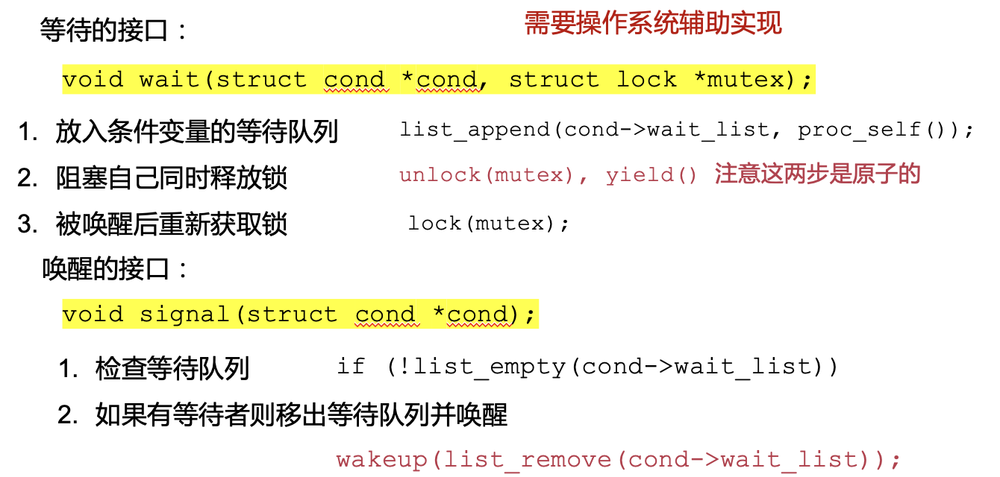

## 4. 信号量的实现

为什么信号量没有lost notification的问题：因为counter会记录下notification

#### 错误的version1

```c
void wait(int S) {
	while(S <= 0)
		/* Waiting */;
	S--; 
} 

void signal(int S) {
	S++;
}
```

这种实现的问题：可能有两个进程同时wait成功

#### 错误的version2

```c
void wait(int S) {
	while(S <= 0)
		/* Waiting */;
	atomic_add(&S, -1); 
} 

void signal(int S) {
	atomic_add(&S, 1); 
}
```

错误的情况：


#### 信号量的实现-1：忙等

```c
void wait(sem_t *S) {
	lock(S->sem_lock);
	while(S->value == 0) { // Busy looping，无意义等待
		unlock(S->sem_lock);
		lock(S->sem_lock); 	
	}
 	S->value --;  // 此时已经取得sem_lock，防止同时-1
	unlock(S->sem_lock);
} 

void signal(sem_t *S) {
	lock(S->sem_lock);
	S->value ++;
	unlock(S->sem_lock);
}
```

#### 信号量的实现-2：条件变量

```c
void wait(sem_t *S) {
	lock(S->sem_lock );
	while(S->value == 0) {
		cond_wait(S->sem_cond, S->sem_lock);   // 使用条件变量避免无意义等待
	}
 	S->value --; 
	unlock(S->sem_lock);
} 

void signal(sem_t *S) {
	lock(S->sem_lock);
	S->value ++;
	cond_signal(s->sem_cond);			// 每次都要signal，很可能无人等待
	unlock(S->sem_lock);
}
```

#### 信号量的实现-3：减少signal次数

```c
void wait(sem_t *S) {
	lock(S->sem_lock );
 	S->value --; 
	while(S->value < 0) {   // value减到负数代表有人等待
	  cond_wait(S->sem_cond, S->sem_lock);
	}
 	unlock(S->sem_lock);
} 

void signal(sem_t *S) {
	lock(S->sem_lock);
	S->value ++;
	if (S->value < 0)
	  cond_signal(s->sem_cond);
	unlock(S->sem_lock);
} 
```

- value减到负数代表有人等待, 会有什么问题？
  - 比如S->value = -3, signal 后S->value = -2, 还是不满足上面while的条件, 需要**额外的计数器**用于单独记录有多少可以唤醒的

#### 信号量的实现-4


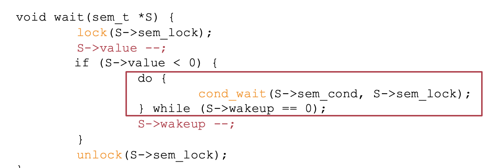

value：正数为信号量，负数为有人等待 wakeup：等待时可以唤醒的数量

为何要do while: 有限等待, 加入改为while：

```c
void wait(sem_t *S) {
  lock(S->sem_lock);
  S->value --;
  if (S->value < 0) {
    while (S->wakeup == 0){
      cond_wait(S->sem_cond, S->sem_lock);
    }
    S->wakeup --;
  }
  unlock(S->sem_lock);
}
```

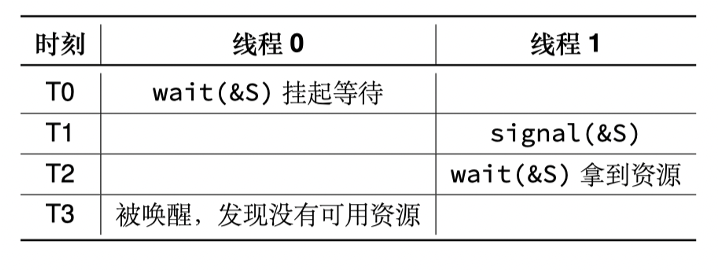

## 5.  **RCU**：更高效的读写互斥

>  需求1：需要一种能够**类似之前硬件原子操作**的方式，让读者要么看到旧的值，要么看到新的值，不会读到任何中间结果。

* 单拷贝原子性（Single-copy atomicity)：处理器任意一个操作的是否能够原子的可见，如更新一个指针

  在新旧值切换的时候，要符合单拷贝原子性

#### RCU 订阅/发布机制

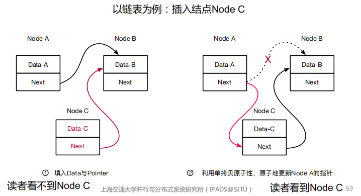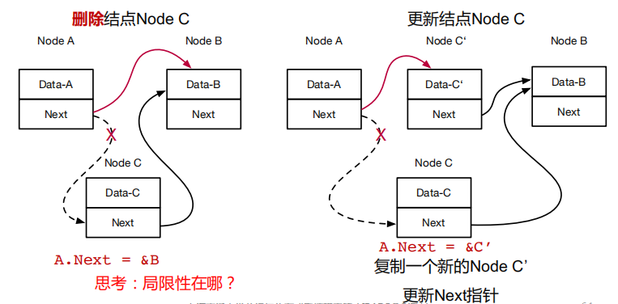


##### 局限性：我们需要回收无用的旧拷贝，无法使用在复杂场景下如双向链表

> 需求2：在**合适**的时间，**回收**无用的旧拷贝(必须等到安全的读完)

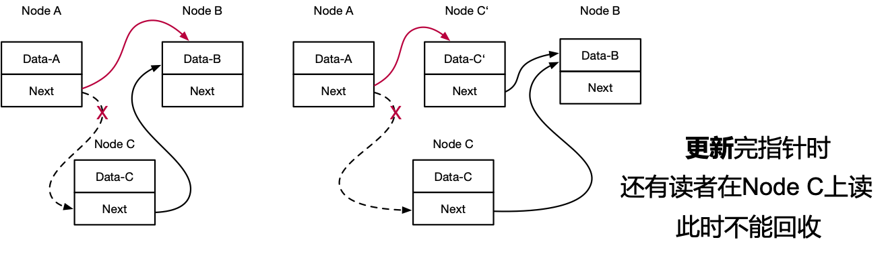

#### **RCU** **宽限期**

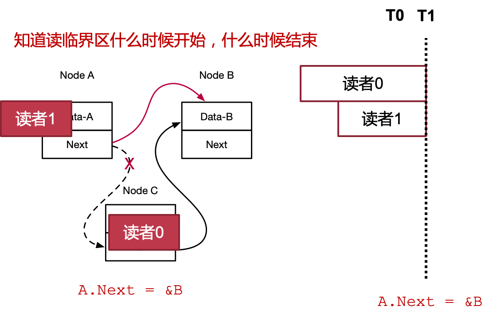


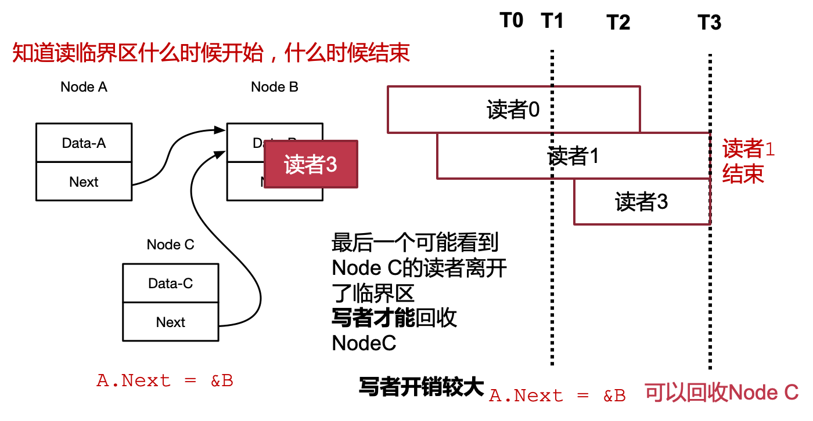

##### 如何知道读临界区什么时候开始，什么时候结束?

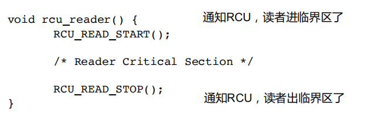

#### **同步原语对比：读写锁** **vs RCU**

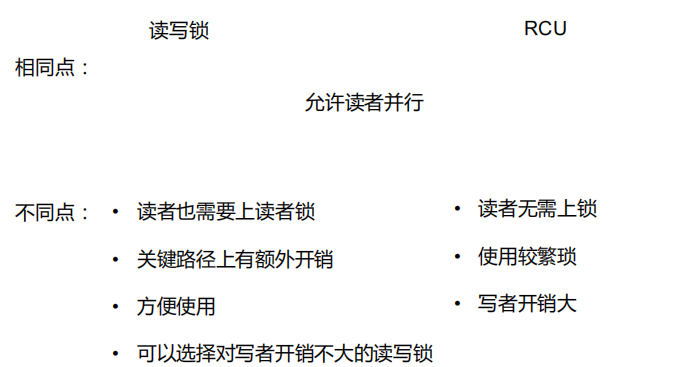

# 多核与同步原语


#### 多核性能的理想上限

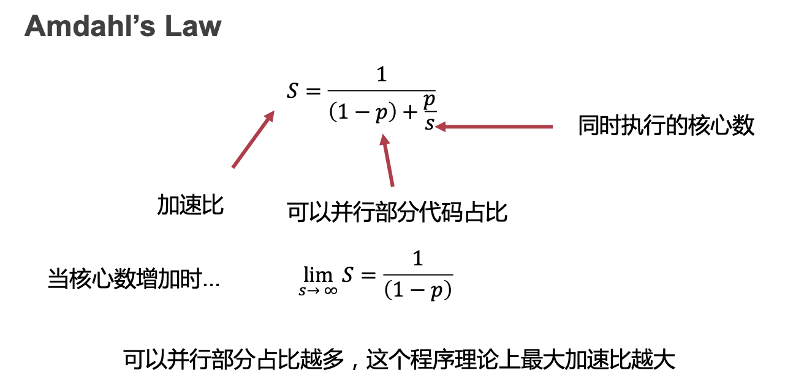

#### 实际情况：可扩展性断崖

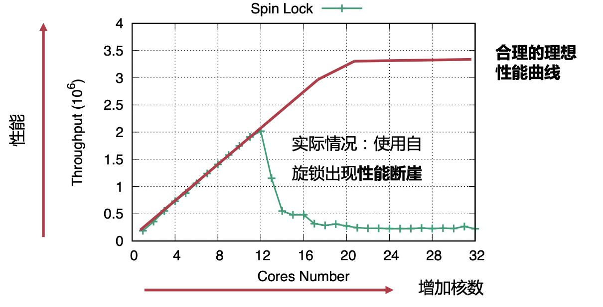

chatgpt给的解释：

> 在多核服务器上进行互斥锁微基准测试时，随着核数的增加，通过量（throughput）不再遵循Amdahl's Law，并出现性能断崖式下跌的主要原因是多核并发引起的锁竞争。
>
> Amdahl's Law描述了在并行计算中，当有一部分任务无法并行化时，整体性能的上限。它假设了并行执行和串行执行的比例不变，并且不考虑额外的开销。
>
> 然而，在互斥锁的情况下，随着核数的增加，线程之间的锁竞争也相应增加。每当一个线程想要获取锁时，它必须等待其他线程释放锁。这种竞争会导致更多的上下文切换、缓存竞争和锁争用等开销。
>
> 随着核数增加，锁竞争的激烈程度也会增加，从而导致性能的下降。当核数达到一定阈值时，锁竞争变得非常严重，而且线程之间频繁地等待锁释放，这就是性能出现断崖式下跌的原因。
>
> 此外，多核服务器上的内存子系统也可能成为性能瓶颈。随着核数的增加，对内存的访问也会增加，可能会导致缓存一致性开销和内存带宽的限制。
>
> 为了克服这些问题，可以尝试以下方法来改善多核服务器上互斥锁的性能：
>
> 1. 减少锁的使用：考虑使用其他并发数据结构或算法，如无锁数据结构、读写锁、分段锁等，以减少锁竞争的程度。
>
> 2. 减小锁的粒度：将锁的粒度细化，尽量缩小锁保护的代码块，以减少不必要的锁竞争。
>
> 3. 使用锁优化技术：使用特定的锁优化技术，如自旋锁、适应性自旋、锁粒度调整等，以减少锁竞争时的开销。
>
> 4. 并发控制：使用其他并发控制手段，如并发队列、任务划分、任务调度等，以减少线程之间的竞争。
>
> 5. 考虑硬件事务内存（Hardware Transactional Memory，HTM）：HTM是一种硬件级别的并发控制机制，可以减少锁的使用和锁竞争的开销。
>
> 请注意，优化并发性能是一个复杂的任务，需要综合考


## 1、问题分析：多核环境下的缓存

##### **对于多核性能有影响的原因：cache需要在不同的核间移动**

> 高速缓存（cache）回顾: 
>
> 多级缓存：
>
> - 靠近CPU贵，速度快，容量小
> - 远离CPU便宜，速度慢，容量大
>
> 读操作：
>
> - 逐层向下找
> - 没找到从内存中读取，放到缓存中
>
> 写操作：
>
> - 直写/写回策略
> - 写入高速缓存，替换时写回
>
> 

#### 多处理器多核环境中的缓存结构

- 简单的解决方案：
  - 将多核当成一个核心，共享缓存设计
- 面临的问题：
  - 高速缓存成为瓶颈（单点竞争）
  - 硬件物理分布：离核心远，速度减慢

- 多级缓存： 
  - 每个核心有自己的私有高 速缓存（L1 Cache） 
  - 多个核心共享一个二级高 速缓存（L2 Cache） 
  - 所有核心共享一个最末级 高速缓存（LLC） 
- 非一致缓存访问（NUCA） 
- 数据一致性问题

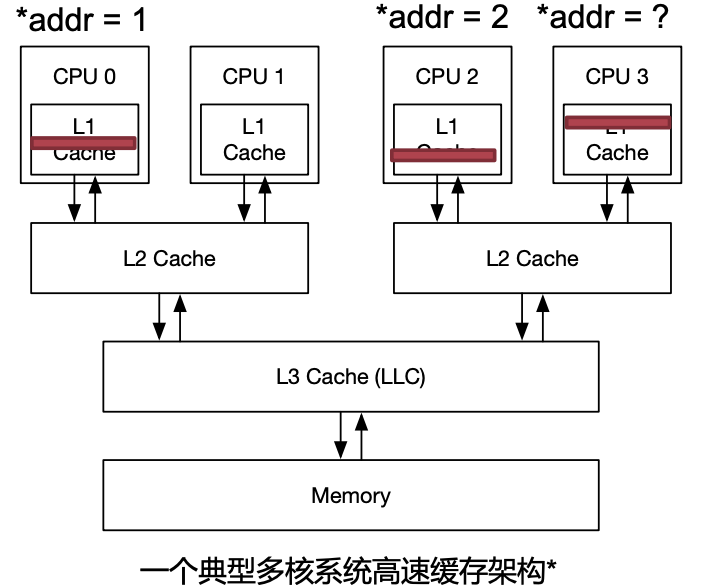

### 缓存一致性

- 保证不同核心对同一地址的值达成共识 
- 多种缓存一致性协议：窥探式（不用）/目录式缓存一致性协议 

**具体流程**

-  缓存行处于不同状态（MSI状态） 
   - MSI状态是分配给 cache line的，但是追踪的是地址
-  不同状态之间迁移 
-  所有地读/写缓存行操作遵循协议流程

#### MSI状态迁移

* 独占修改 （Modified） 
  *  该核心独占拥有缓存行 
  *  本地可读可写 
  *  其他核读需要迁移到共享
  *  其他核写需要迁移到失效

- 共享（Shared） ：是为了提升性能，为了方便只读
  - 可能多个核同时有缓存行的拷贝 
  - 本地可读 
  - 本地写需要迁移到独占修改，并使其他核该缓存行失效
  - 其他核写需要迁移到失效

- 失效（Invalid） 
  - 本地缓存行失效 
  - 本地不能读/写缓存行 
  - 本地读需要迁移到共享，并使 其他核该缓存行迁移到共享 
  - 本地写需要迁移到独占修改， 并使其他核心该缓存行失效

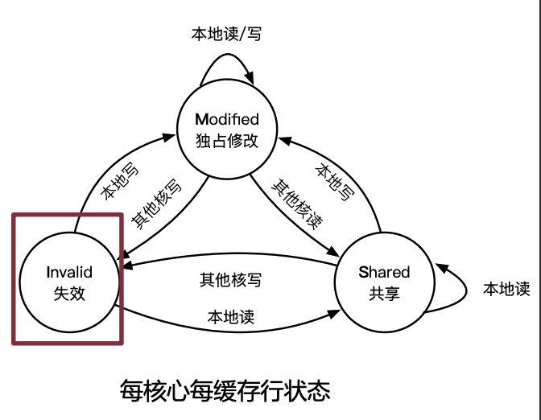

#### 缓存一致性：全局目录项

记录缓存行在不同核上的状态，通过总线通讯

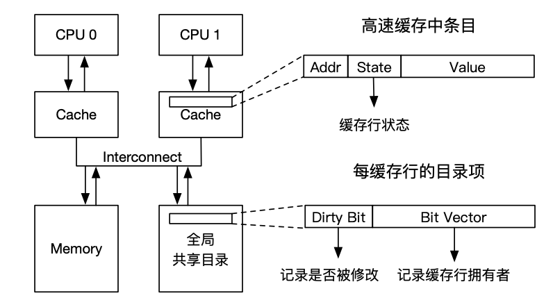

##### example：


#### 可扩展性断崖背后的原因： 对单一缓存行的竞争导致严重的性能开销

单一缓存行，代码中可并行的部分急剧下降


## 2. 如何解决可扩展性问题：MCS锁

1. Simple fix：避免对单一缓存行的高度竞争 **Back-off 策略**

* 不合理，这样实现效果是随机的

2. MCS lock

* 核心思路：在关键路径上避免对单一缓存行的高度竞争,使用等待队列，通过 **等待队列** 串起所有需要持锁竞争者节点

  每当一个CPU试图获取一个spinlock，它就会将自己的MCS lock加到这个spinlock的等待队列，成为该队列的一个节点(node)，加入的方式是由该队列末尾的MCS lock的"next"指向这个新的MCS lock。

  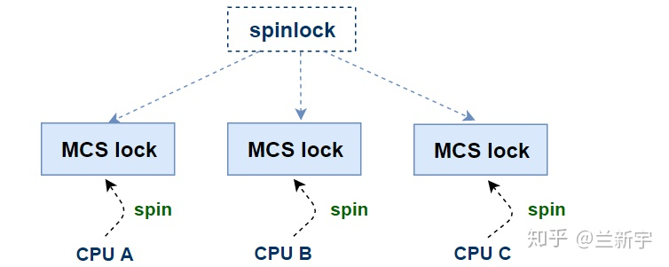

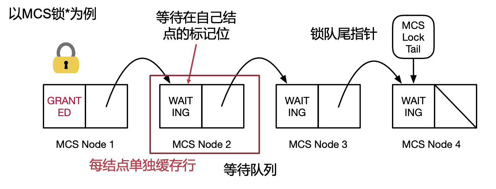

#### MCS锁：新的竞争者加入等待队列


#### MCS锁：锁持有者的传递


#### MCS锁：放锁流程


#### MCS锁：性能分析


让每个CPU不再是等待同一个spinlock变量，而是基于各自不同的per-CPU的变量进行等待，那么每个CPU平时**只需要查询自己对应的这个变量所在的本地cache line**，仅在这个变量发生变化的时候，才需要读取内存和刷新这条cache line，**不再会高频竞争全局缓存行**

#### 为什么不用MCS lock?

* 非关键路径上的开销还是比较大
* 只能FIFO
* 内存开销大

## 3. Linux Kernel中的可扩展锁：QSpinlock

#### MCS的缺点：

在竞争程度低时，锁的性能不佳，有**多次访存操作**，**开销较大**，相比起来**自旋锁** **单次访存操作**，开销较小

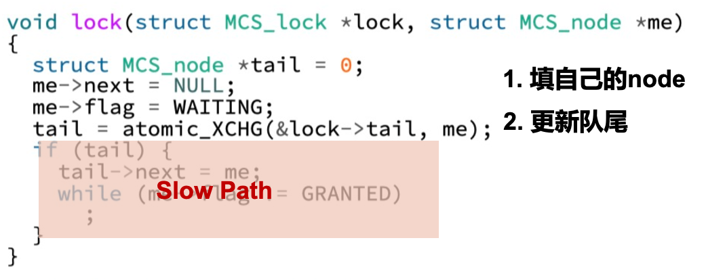

#### Linux中的同步原语: QSpinlock

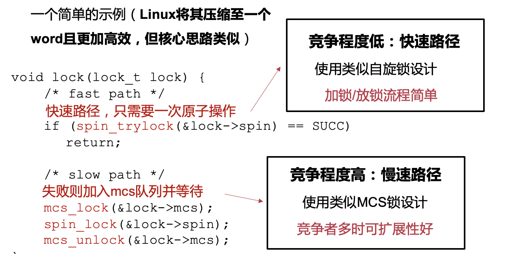


## 4、非一致内存访问（NUMA）

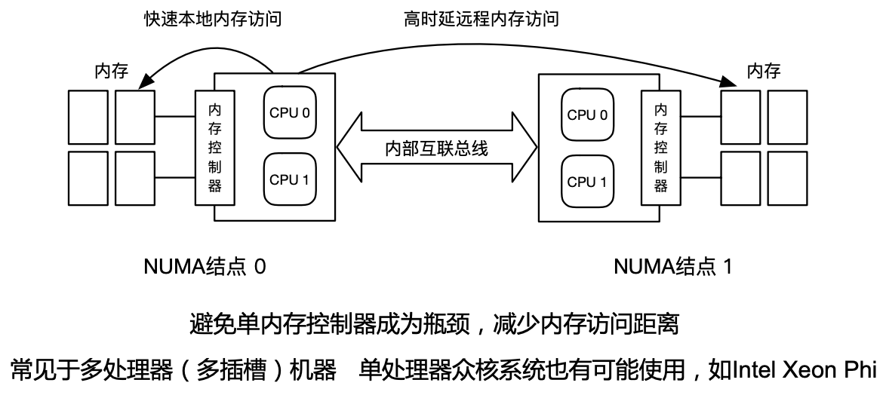

#### NUMA环境中新的挑战

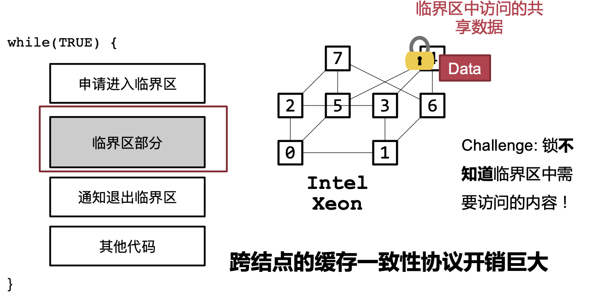

即使在cc-NUMA中没有出现缓存失效 跨结点的缓存一致性协议开销巨大

#### NUMA-aware设计：以cohort锁*为例

核心思路：在一段时间内将访存限制在本地

1. 先获取每结点本地锁 
2. 再获取全局锁 
3. 成功获取全局锁 
4. 释放时将其传递给本地等待队列的下一位
5. 全局锁在一段时间内 
6. 只在一个结点内部传递 
7. 每个节点最多传N次，为了公平


在单CPU上相比MCS性能有所下降的原因：需要两把锁，全局锁和本地锁，还是会涉及跨NUMA的内存访问

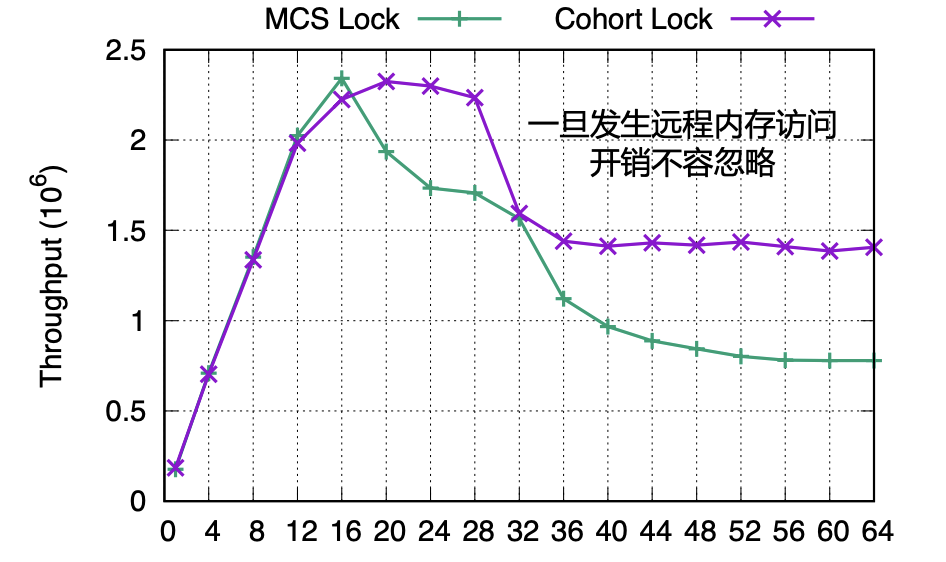

## 5. 代理锁：通过代理执行避免跨节点访问

对于锁服务器：遍历请求队列，一一执行临界区的闭包函数，并在执行完后发送执行结果。

通过这个方式，可以避免临界区内的全局缓存行在不同的NUMA节点之间迁移，
转变成本地的访问，从而提升性能。

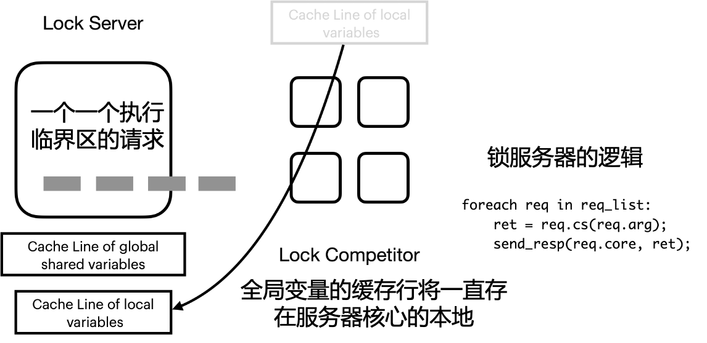

#### 代理锁性能表现


## 6. 非对称多核的可扩展性

#### 6.1 同构ISA异构多核系统

- 异构多核系统（AMP）
- 高性能处理器核心 + 高能效处理器核心
- 适应更多场景的计算需求（性能+能耗）
- 广泛地使用在移动处理器平台
- 已经运用到桌面平台（Intel Alder Lake, Apple M1）
- 调度器（如EAS）可以将线程调度到异构核心

#### 6.2 传统同步原语无法适应异构场景

而当目标缓存行竞争程度较高时，自旋锁将展现小核倾向性，即小核更容易获取锁

此时，非公平锁（TAS）吞吐率与时延均出现可扩展性断崖，公平锁（MCS）依然面临吞吐断崖

##### 6.2.1 观测1: 不同核处理性能各异，通过获取公平性不再适用


同步原语都隐式地假设了下面的处理器核心是对称的。然而这一假设在AMP下不再成立，因此出现了可扩展性问题。

首先，我们发现由于不同核心处理性能各异，获取公平性不再适用。获取公平性是指锁将按照获取顺序先后依次拿到互斥锁，也即先入先出，称为FIFO。对于这类互斥锁，他们实际上隐式地假设所有核心的算力相同，其给所有的核心相同的概率获取锁。然而，在AMP下，异构核心之间算力有差距：小核需要花费更多时间执行相同的临界区。这时如果我们保证公平性，给每个核心相同概率拿到锁，那么小核的孱弱的性能很有可能暴露在关键路径上，最终影响到吞吐率。

##### 6.2.2 不同核原子操作成功率不同，带来性能问题


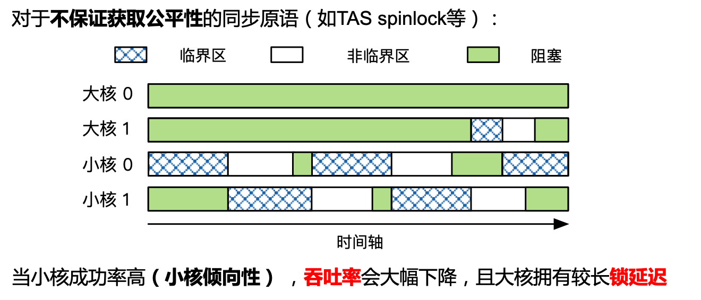

#### 6.3 如何在非对称多核中扩展

启示1：遵循获取公平性的锁传递顺序无法适用AMP，需要设计**适合AMP的锁传递顺序**。

启示2: （针对获取锁的时间顺序）允许大核乱序到小核之前拿锁可以有效提升吞吐率，但乱序程度必须可控，避免违背应用时延需求。

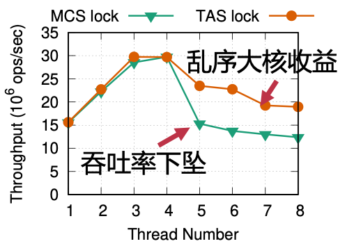


## 7. 非对称多核感知锁LibASL

#### 7.1 时延需求指导的锁传递顺序

按照获取锁的时间顺序上（FIFO），在**不违背小核时延需求的前提**下，**尽可能让大核乱序**到小核之前，达到更高的吞吐率

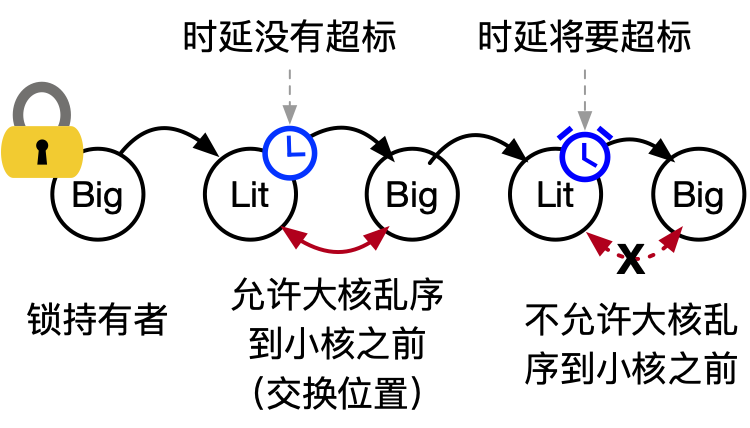

#### 7.2 Epoch的窗口大小

我们设计了一个反馈机制调节。这是由于乱序窗口实际上是在每次加锁之前固定增加了一段等待时间，因此在走相同code path的时候，增加乱序窗口的大小，与epoch的总的时延长度线性相关，因此，我们可以通过运行时动态调整来找到合适的窗口大小。然而，实际上epoch的长度变化可能比较大，需要找到合适的算法来调整，快速响应

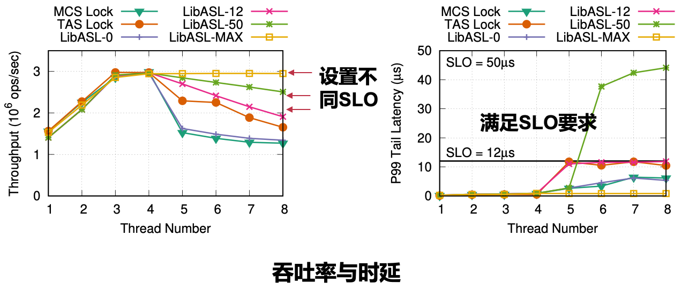


## 8. 读写锁的可扩展性

最直观实现存在**性能问题**：读者需要抢一把**全局互斥锁**，**并对一个全局计数器自增**

#### 8.1 **大读者锁**

每个读者将私有一把专属的读者锁，进读临界区：**直接获取私有的互斥锁**

写者进入临界区：**需要获取所有的私有读者锁**，**一旦失败** **，立刻重试**

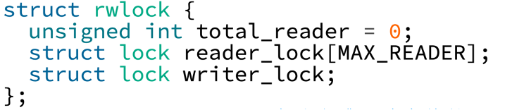


#### 8.2 大读者锁问题

- 读者关键路径上仍然有上锁操作：涉及原子操作，性能影响仍然较大
- 写者开销巨大

#### 8.3 PRWLock：进一步减少读者关键路径性能开销

核心思想：通过版本号协同**读者与写者，**读者关键路径上只有**三个本地访存操作**

