# 11. 同步原语

[toc]

### background:

**操作系统在多处理器多核环境下面临的问题**:

1. **正确性保证**

   • 对共享资源的竞争导致错误

   • 操作系统提供**同步原语**供开发者使用

   • 使用同步原语带来新的问题

2. **性能保证**

   • 多核多处理器硬件与特性

   • 可扩展性问题导致性能断崖

   • 系统软件设计如何利用硬件特性

## 1. **四个场景与对应的同步原语**

#### 场景一：共享资源互斥访问

多个线程需要同时访问同一共享数据应用程序需要保证**互斥访问**避免数据竞争

**Sol**: 使用**互斥锁**保证**互斥访问**

#### **衍生场景一：读写场景并发读取**

多个线程**只会读取**共享数据, 允许读者线程**并发执行**

**Sol**: 可使用**读写锁**提升读者并行度

#### **场景二：条件等待与唤醒**

线程等待某条件时**睡眠**，达成该条件后**唤醒**

**Sol**: 使用**条件变量**完成线程睡眠/唤醒

#### **场景三：多资源协调管理**

多个资源可以被多个线程**消耗或释放**，正确协同线程获取资源或等待

**Sol**: 使用**信号量**完成资源管理与线程协同

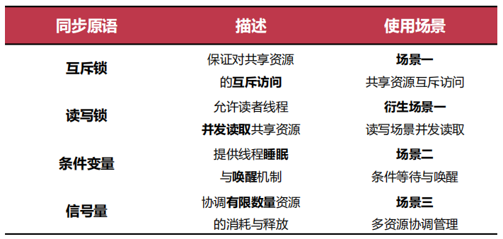

## 2. **同步与临界区**

#### **单生产者消费者问题方案**

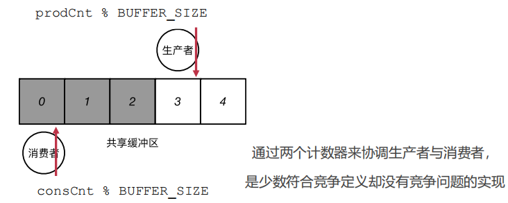

#### 多生产者消费者问题

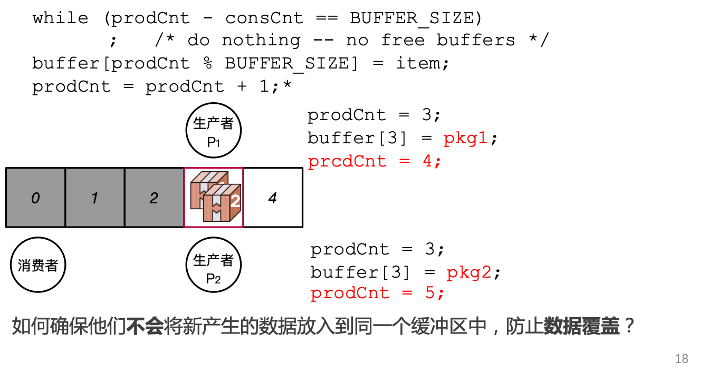

#### **同步原语**

**同步原语**（Synchronization Primitives）是一个平台（如**操作系统**）提供的用于帮助开发者实现线程之间**同步**的**软件工具**


#### **临界区（Critical Section**)

**三个要求**:

• **互斥访问**：在同一时刻，**有且仅有一个线程**可以进入临界区

• **有限等待**：当一个线程申请进入临界区之后，必须在**有限的时间**内获得许可进入临界区而不能无限等待

• **空闲让进**：当没有线程在临界区中时，必须在申请进入临界区的线程中选择一个进入临界区，保证执行临界区的**进展**

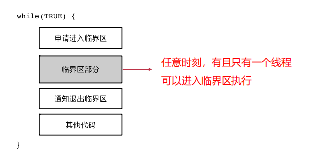

**1. 软件解决方案：皮特森算法**

Peterson算法是实现进程互斥访问临界区的一种方法，避免了单标志法必须交替访问的限制，以及双标志法后检验的“饥饿”问题。

Peterson算法实现如下：

```text
Pi进程:
flag[i] = TRUE; turn = j;
while(flag[j] && turn == j);
// 访问临界区
flag[i] = FALSE;
// 剩余区

Pj进程:
flag[j] = TRUE; turn = i;
while(flag[i] && turn == i);
// 访问临界区
flag[j] = FALSE;
// 剩余区
```

对于`Pi`进程：

`flag[i] = TRUE`将自身的访问位置为1，`turn = j` 向对方发出访问请求；
while中的循环条件即阻塞条件为，若对方需要访问且对方未应答访问请求。

对于阻塞条件我们可以这样理解，访问位置为1即自己想要访问临界区，然后向对方发出访问请求。

- 若此时对方根本不想访问，那么不会被阻塞直接访问临界区，此时不会发生异常；
- 若此时对方将访问位已经置为1，那么对方可能准备访问临界区或正在访问临界区：
  \- 若对方正在访问临界区，那么此时对方不会应答自己的请求，则被阻塞；
  \- 若对方准备访问临界区，访问前需要收到我方应答，此时先发送请求的一方必定会收到应答，即可以访问临界区，那么另一方因为请求后对方已经进入临界区，得不到应答，必须等对方退出临界区，将访问位置0才能访问。

在这样的机制下，双方实现了对临界区的互斥访问。


在**满足一定硬件条件**的情况下，满足解决临界区问题的三个必要条件

**2. 关闭中断**

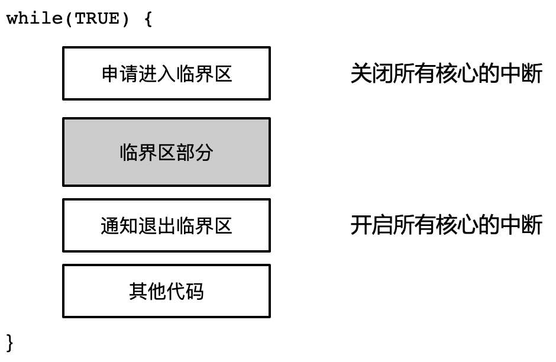

* 可以解决单个CPU核上的临界区问题如果在多个核心中，关闭中断不能阻塞其他进程执行
* 性能会很差


## 3. **互斥锁（Mutual Exclusive Lock）**

#### **接口：拿锁和放锁**

1. Lock(lock)：尝试拿到锁“lock” 

   • 若当前没有其他线程拿着lock，则拿到lock，并继续往下执行

   • 若lock被其他线程拿着，则不断循环等待放锁（busy loop） 

2.  Unlock(lock)

   • 释放锁

• **保证同时只有一个线程能够拿到锁**

#### example1： **用互斥锁解决多生产者消费者问题**

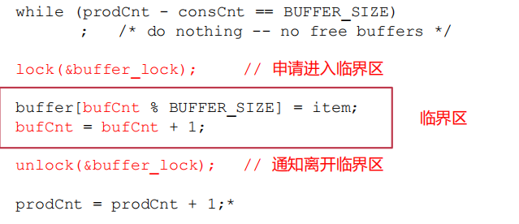

#### example2： **用互斥锁解决多线程计数问题**

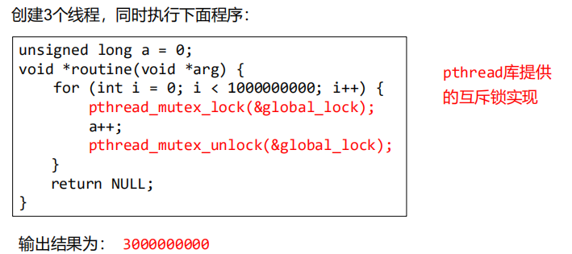

## 4. **条件变量**

利用**睡眠**/**唤醒**机制，避免无意义的等待，让操作系统的调度器调度其他进程/线程执行

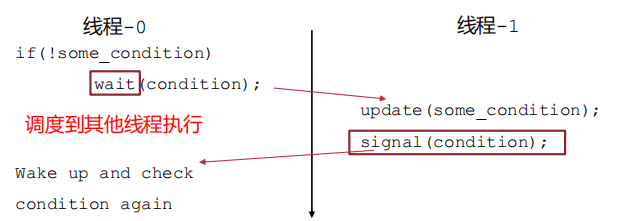

#### 接口

1. 唤醒的时候参数的`cond`指明了是哪个等待队列

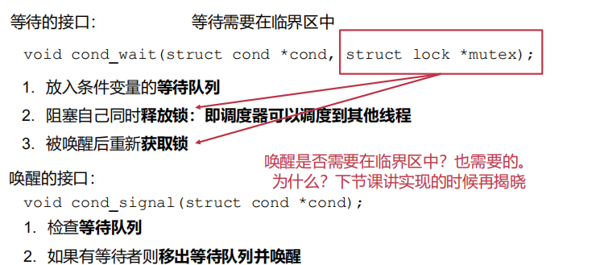

#### 使用示例

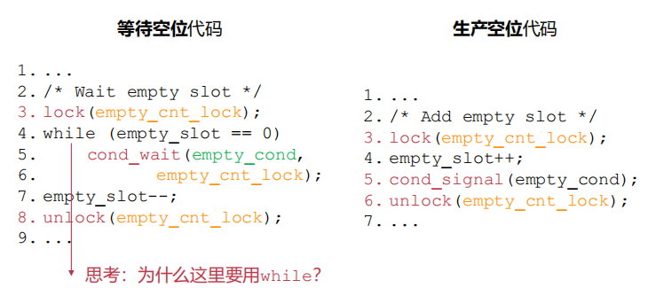

ans: 如果有多个线程在等待，可能会一次等不到`empty_slot`,比如：

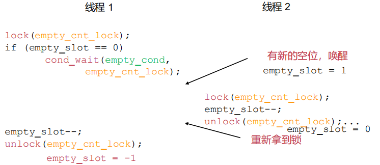

这个时候线程1会错误地执行`empty_slot--`

## 5. **信号量（**SEMAPHORE）

#### **信号量 （**PV原语）

> **信号量**：协调（阻塞/放行)多个线程共享有限数量的资源

语义上：信号量的值cnt记录了**当前可用资源的数量**

提供了两个原语 P 和 V 用于**等待**/**消耗**资源

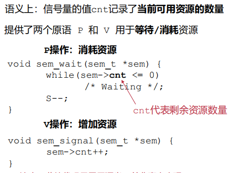

#### example: **信号量的使用**

原始代码：

```c
while(true) {
	new_msg = produce_new();
	lock(&empty_slot_lock);
	while (empty_slot == 0) 
		cond_wait(&empty_cond, &empty_slot_lock);
	empty_slot--;
	unlock(&empty_slot_lock);

	buffer_add(new_msg);
	// ...
}
```

使用信号量：

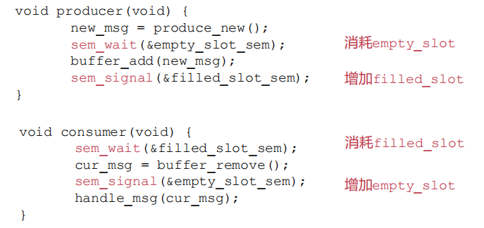

#### **二元信号量与计数信号量**

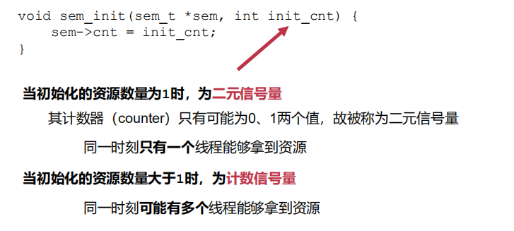

## 6.**读写锁**

1.  多个读者不互斥
2. 为了避免读者看到一半就被写者撤走了，使用互斥锁

#### **读写锁的使用示例**

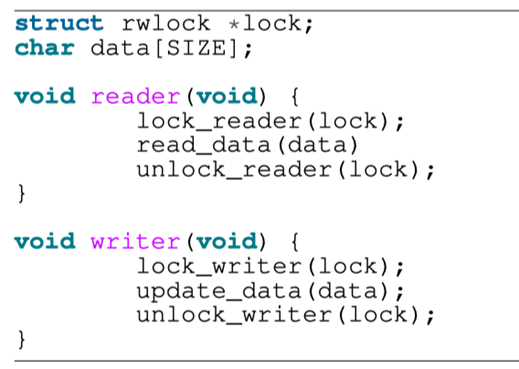

#### 和互斥锁的比较

互斥锁：所有的线程均互斥，同一时刻只能有一个线程进入临界区对于部分只读取共享数据的线程过于严厉

读写锁：区分读者与写者，允许读者之间并行，读者与写者之间互斥

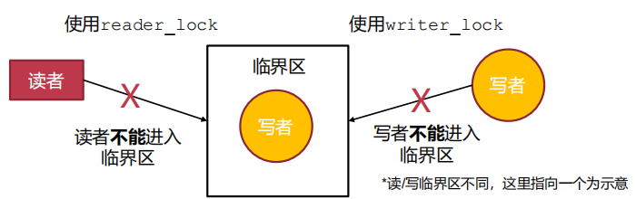


## 7. **不同同步原语之间的比较**

#### 互斥锁VS二元信号量

##### 互斥锁**与**二元信号量**功能类似，但**抽象不同： 

* 互斥锁有**拥有者**的概念，一般同一个线程拿锁/放锁

* 信号量为资源协调，一般一个线程signal，另一个线程wait

  互斥锁：代码，同线程

  信号量：数据，不同线程


**条件变量**用于解决不同问题（睡眠/唤醒），需要搭配**互斥锁**使用，搭配**互斥锁**+计数器**可以实现与信号量相同的功能**

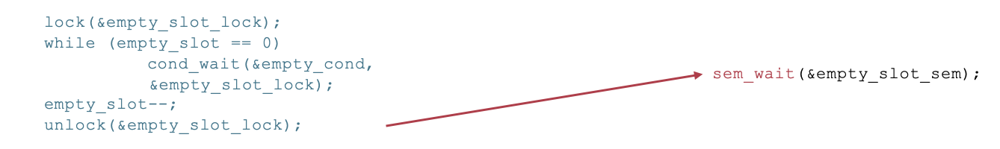

#### **互斥锁** **vs** **读写锁**

* 接口不同：读写锁区分读者与写者

-  **针对场景不同**：获取**更多程序语义**，标明只读代码段，达到更好性能

- 读写锁在读多写少场景中可以显著**提升读者并行度**

- 即允许多个读者同时执行读临界区

- 只用写者锁，则与互斥锁的语义基本相同

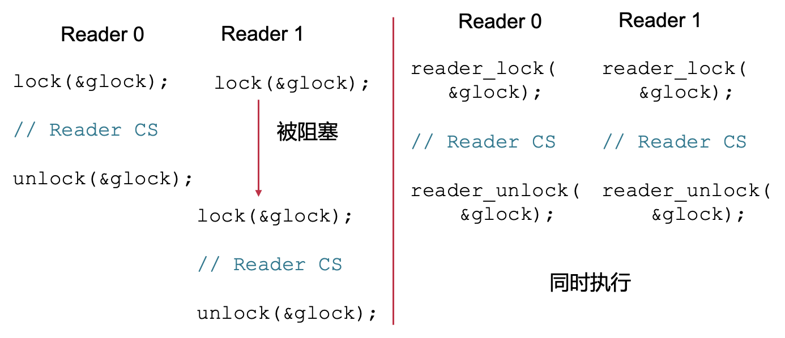

## 8. **同步**带来的问题：死锁

#### **死锁产生的原因**

* **互斥访问**：同一时刻只有一个线程能够访问

- **持有并等待**：一直持有一部分资源并等待另一部分不会中途释放

- **资源非抢占**：即proc_B不会抢proc_A已经持有的锁A

- **循环等待**：A等B，B等A

### **如何解决死锁**

- #### 出问题再处理：死锁的检测与恢复

  - 找到循环等待的环：

    •直接kill所有循环中的线程

    •Kill一个，看有没有环，有的话继续kill

    •全部回滚到之前的某一状态

  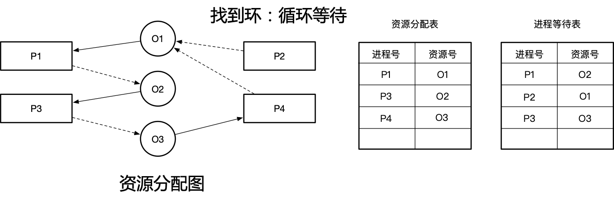

- #### **设计时避免：死锁预防**

  - 避免互斥访问：通过其他手段（如代理执行），只有代理线程能够访问共享资源：避免数据竞争

    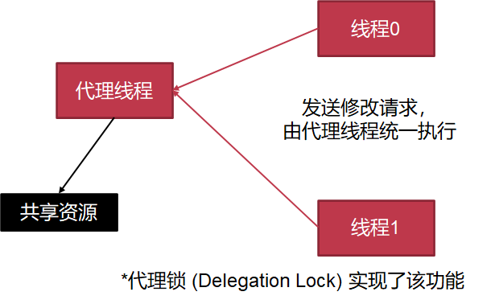

  - 不允许持有并等待：一次性申请所有资源

    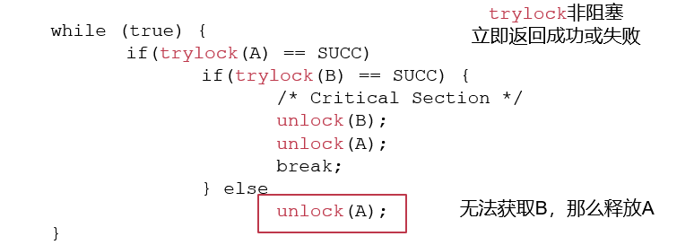

    - 避免死锁带来的活锁 Live Lock

      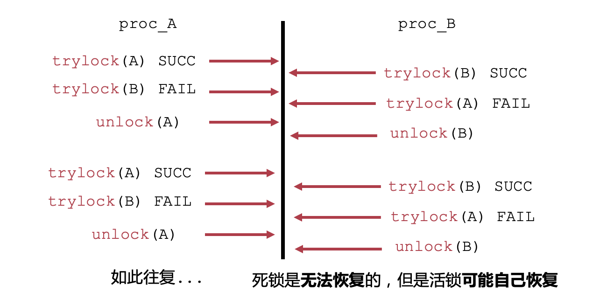

  - 资源允许抢占：需要考虑如何恢复

    - **需要让线程A正确回滚到拿锁A之前的状态**

    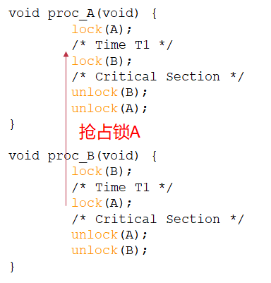

  - 打破循环等待：按照特定顺序获取资源，对所有资源进行编号， 让所有线程递增获取。任意时刻，获取最大资源号的线程可以继续执行，然后释放资源

- #### 运行时避免死锁：死锁避免

  **银行家算法**：

  * 所有线程获取资源需要通过**管理者**同意

  * 管理者**预演**会不会造成死锁
    * 如果会造成：阻塞线程，下次再给
    * 如果不会造成：给线程该资源

  * 算法流程：

    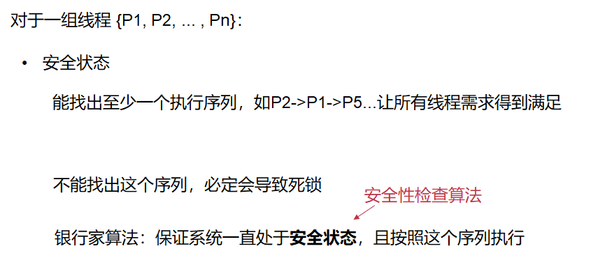


##### example：假设有M个资源 N个线程

##### 四个数据结构：

- 全局可利用资源：Available[M]， 该向量代表某一时刻系统中每一类元素的可用个数。这个向量初始化时设置为系统中拥有的第$M$类资源的总量。
- 每线程最大需求量：Max[ N ] [ M ]，该矩阵包含所有线程$N$对第$M$类资源的最大需求量。
- 已分配资源：Allocation[N] [M]，该矩阵包含已经分配给所有线程$N$的$M$种资源的数量。
- 还需要的资源：Need[N] [M]，该矩阵包含所有线程$N$对第$M$累资源还需要的资源数量。

安全序列：

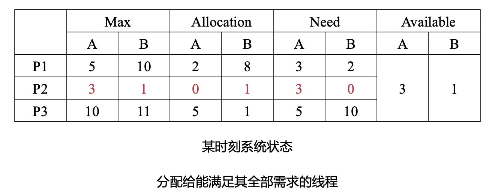
