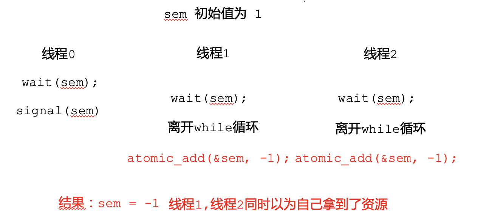

# 12. **同步原语的应用与实现**

[toc]

## 0. 同步案例分析

| **同步原语** | **描述**                              | **使用场景**                       |
| ------------ | ------------------------------------- | ---------------------------------- |
| **互斥锁**   | 保证对共享资源     的**互斥访问**     | **场景一**     共享资源互斥访问    |
| **读写锁**   | 允许读者线程     **并发读取**共享资源 | **衍生场景一**    读写场景并发读取 |
| **条件变量** | 提供线程**睡眠**     与**唤醒**机制   | **场景二**     条件等待与唤醒      |
| **信号量**   | 协调**有限数量**资源     的消耗与释放 | **场景三**    多资源协调管理       |

#### 同步案例-1：多线程执行屏障

等待全部执行到屏障后再继续执行， 符合场景2: 线程等待/唤醒

```c
lock(&thread_cnt_lock);
thread_cnt--;
if (thread_cnt == 0)
  cond_broadcast(cond);
while(thread_cnt != 0)
  cond_wait(&cond, &thread_cnt_lock); 
unlock(&thread_cnt_lock);
```

#### 同步案例-2：等待队列工作窃取

每核心等待队列，在空时允许窃取其他核心的任务，符合场景1: 共享资源互斥访问，

```c
lock(ready_queue_lock[0]);
```


#### 同步案例-3：map-reduce

Word-count：大文本拆分字数统计
Mapper：统计一部分文本自述
Reducer：一旦其中任意数量的Mapper结束，就累加其结果

**符合场景2: 线程等待/唤醒**, mapper:

```c
lock(&finished_cnt_lock);
finished_cnt ++;
cond_signal(&cond); 
unlock(&finished_cnt_lock);
```

reducer,**一次性拿走所有的finished的Mapper的结果**:

```c
lock(&finished_cnt_lock);
while(finished_cnt == 0)
  cond_wait(&cond, &finished_cnt_lock);
/* collect result */
finished_cnt = 0;
unlock(&finished_cnt_lock);
```

**也符合场景** **3:** **将Mapper的结果视为资源**

Mapper:

```c
signal(&finish_sem);
```

Reducer:

```c
while(finished_cnt != mapper_cnt) {
  wait(&finish_sem);
  /* collect result */
  finished_cnt ++;
}
```

这两种解决方案的不同：

- 上一种可以多个结果一起collect，sem这种只能一次collect一个sem的语义，就是一次只能拿走一个（counter每次只能减一）

- 但cv更复杂


#### 同步案例-4：网页渲染

网页等待所有的请求均完成后再进行渲染

**sol1: ** 符合**场景2: 等待/唤醒**

**Request_cb**：

```c
lock(&glock);
finished_cnt ++；
if (finished_cnt == req_cnt)
  cond_signal(&gcond);
unlock(&glock);
```

**渲染线程**

```c
lock(&glock);
while (finished_cnt != req_cnt)
  cond_wait(&gcond, &glock);
unlock(&glock);
```

**sol2: 符合场景3: 视为所有请求结果为资源**

**Request_cb**:

```c
signal(&gsem);
```

**渲染线程**:

```c
while(remain_req != 0) {
  wait(&gsem);
  remain_req --;
}
```


两种方法的比较：

同样需要wait多次，唤醒多次；好处是代码更简单
与barrier场景的区别：barrier不适合用sem，没有什么适合抽象成等待的资源

#### 同步案例-5：线程池并发控制

控制同一时刻可以执行的线程数量
原因：有的线程阻塞时可以允许新的线程替上
例子：允许同时三个线程执行

符合**场景三：视剩余可并行执行线程数量为有限资源**

```c
thread_routine () {
  wait(&thread_cnt_sem);
  /* doing something */
  signal(&thread_cnt_sem);
}
```


#### 同步案例-6：网页服务器

- 处理响应客户端获取静态网页需求
- 处理后端更新静态网页需求
- 不允许读取更新到一半的页面
-  符合**衍生场景** **1:** **读写场景，可以使用读写锁**，
  - client用读锁
  - 后端用写锁


#### 同步原语选择guideline


## 1. 硬件原子操作

#### 常见原子指令

- test and set
- compare ans swap
- Load-linked & store-conditional
- fetch and add

#### 硬件原子操作：ARM使用LL/SC实现

Load-linked & Store-conditional以地址为粒度，并发性更好，但是代码更复杂；


## 2. **锁的实现**

只有一个拿到锁，只有一个人可以放锁，所以放锁不需要加锁

#### 自旋锁（Spinlock）


```c
void lock(int *lock) {
    while(atomic_CAS(lock, 0, 1) 
	!= 0)
	/* Busy-looping */ ;
}

void unlock(int *lock) {
    *lock = 0;
}
```

##### 评价：

- 互斥访问 ✓ 

-  有限等待 x: 有的“运气差”的进程可能永远也不能成功CAS => 出现饥饿

- 空闲让进  ✓ : 依赖于硬件 => 当多个核同时对一个地址执行原子操作时，能否保证至少有一个能够成功(基本硬件能保证)


#### 排号锁（Ticket Lock）

> 通过遵循竞争者到达的顺序来传递锁, 保证竞争者的公平性


##### 代码实现

```c
void lock(int *lock) {
    volatile unsigned my_ticket =
        atomic_FAA(&lock->next, 1);
    while(lock->owner != my_ticket)
	/* busy waiting */;
}

void unlock(int *lock) {
    lock->owner ++;
}
```

##### 评价：

- 互斥访问 ✓ 

- 有限等待 ？ 按照顺序，在前序竞争者保证有限时间释放时，可以达到有限等待（假设不会有线程一直霸着资源不释放）

- 空闲让进✓

#### **读写锁**


​		

* **读写锁的偏向性**

  *  **考虑这种情况：**t0：有读者在临界区； t1：有新的写者在等待；t2：另一个读者能否进入临界区？ 	
    * **不能：偏向写者的读写锁**，**更加公平**（后序读者必须等待写者进入后才进入） 
    * **能：偏向读者的读写锁**，**更好的并行性**（ 后序读者可以直接进入临界区）

* **偏向读者的读写锁**实现示例

  

  * 另外一种实现

    ```c
    #include <stdio.h>
    #include <pthread.h>
    
    typedef struct {
        pthread_mutex_t mutex;
        pthread_cond_t read_cond;
        pthread_cond_t write_cond;
        int readers;
        int writer;
        int pending_writers;
    } ReaderWriterLock;
    
    void initialize_rwlock(ReaderWriterLock* rwlock) {
        pthread_mutex_init(&rwlock->mutex, NULL);
        pthread_cond_init(&rwlock->read_cond, NULL);
        pthread_cond_init(&rwlock->write_cond, NULL);
        rwlock->readers = 0;
        rwlock->writer = 0;
        rwlock->pending_writers = 0;
    }
    
    void acquire_read_lock(ReaderWriterLock* rwlock) {
        pthread_mutex_lock(&rwlock->mutex);
    
        // 等待写入操作完成
        while (rwlock->writer || rwlock->pending_writers > 0) {
            pthread_cond_wait(&rwlock->read_cond, &rwlock->mutex);
        }
    
        rwlock->readers++;
    
        pthread_mutex_unlock(&rwlock->mutex);
    }
    
    void release_read_lock(ReaderWriterLock* rwlock) {
        pthread_mutex_lock(&rwlock->mutex);
    
        rwlock->readers--;
    
        // 如果没有读者，则唤醒等待的写入操作
        if (rwlock->readers == 0) {
            pthread_cond_signal(&rwlock->write_cond);
        }
    
        pthread_mutex_unlock(&rwlock->mutex);
    }
    
    void acquire_write_lock(ReaderWriterLock* rwlock) {
        pthread_mutex_lock(&rwlock->mutex);
    
        rwlock->pending_writers++;
    
        // 等待读取和写入操作完成
        while (rwlock->readers > 0 || rwlock->writer) {
            pthread_cond_wait(&rwlock->write_cond, &rwlock->mutex);
        }
    
        rwlock->pending_writers--;
        rwlock->writer = 1;
    
        pthread_mutex_unlock(&rwlock->mutex);
    }
    
    void release_write_lock(ReaderWriterLock* rwlock) {
        pthread_mutex_lock(&rwlock->mutex);
    
        rwlock->writer = 0;
    
        // 优先唤醒等待的写入操作
        if (rwlock->pending_writers > 0) {
            pthread_cond_signal(&rwlock->write_cond);
        } else {
            pthread_cond_broadcast(&rwlock->read_cond);
        }
    
        pthread_mutex_unlock(&rwlock->mutex);
    }
    
    // 示例用法
    ReaderWriterLock rwlock;
    
    void* reader_thread(void* arg) {
        acquire_read_lock(&rwlock);
    
        // 读取共享资源
    
        release_read_lock(&rwlock);
    
        return NULL;
    }
    
    void* writer_thread(void* arg) {
        acquire_write_lock(&rwlock);
    
        // 写入共享资源
    
        release_write_lock(&rwlock);
    
        return NULL;
    }
    
    int main() {
        // 初始化读写锁
        initialize_rwlock(&rwlock);
    
        // 创建多个读者线程和写者线程
    
        // 等待线程完成
    
        return 0;
    }
    ```

    

* question：偏向写者的读写锁？

  ```c
  #include <stdio.h>
  #include <pthread.h>
  
  typedef struct {
      pthread_mutex_t mutex;
      pthread_cond_t read_cond;
      pthread_cond_t write_cond;
      int readers;
      int writer;
      int pending_writers;
  } ReaderWriterLock;
  
  void initialize_rwlock(ReaderWriterLock* rwlock) {
      pthread_mutex_init(&rwlock->mutex, NULL);
      pthread_cond_init(&rwlock->read_cond, NULL);
      pthread_cond_init(&rwlock->write_cond, NULL);
      rwlock->readers = 0;
      rwlock->writer = 0;
      rwlock->pending_writers = 0;
  }
  
  void acquire_read_lock(ReaderWriterLock* rwlock) {
      pthread_mutex_lock(&rwlock->mutex);
  
      // 等待写入操作完成
      while (rwlock->writer || rwlock->pending_writers > 0) {
          pthread_cond_wait(&rwlock->read_cond, &rwlock->mutex);
      }
  
      rwlock->readers++;
  
      pthread_mutex_unlock(&rwlock->mutex);
  }
  
  void release_read_lock(ReaderWriterLock* rwlock) {
      pthread_mutex_lock(&rwlock->mutex);
  
      rwlock->readers--;
  
      // 如果没有读者，则唤醒等待的写入操作
      if (rwlock->readers == 0) {
          pthread_cond_signal(&rwlock->write_cond);
      }
  
      pthread_mutex_unlock(&rwlock->mutex);
  }
  
  void acquire_write_lock(ReaderWriterLock* rwlock) {
      pthread_mutex_lock(&rwlock->mutex);
  
      rwlock->pending_writers++;
  
      // 等待读取和写入操作完成
      while (rwlock->readers > 0 || rwlock->writer) {
          pthread_cond_wait(&rwlock->write_cond, &rwlock->mutex);
      }
  
      rwlock->pending_writers--;
      rwlock->writer = 1;
  
      pthread_mutex_unlock(&rwlock->mutex);
  }
  
  void release_write_lock(ReaderWriterLock* rwlock) {
      pthread_mutex_lock(&rwlock->mutex);
  
      rwlock->writer = 0;
  
      // 优先唤醒等待的写入操作
      if (rwlock->pending_writers > 0) {
          pthread_cond_signal(&rwlock->write_cond);
      } else if (rwlock->readers > 0) {
          pthread_cond_broadcast(&rwlock->read_cond);
      }
  
      pthread_mutex_unlock(&rwlock->mutex);
  }
  
  // 示例用法
  ReaderWriterLock rwlock;
  
  void* reader_thread(void* arg) {
      acquire_read_lock(&rwlock);
  
      // 读取共享资源
  
      release_read_lock(&rwlock);
  
      return NULL;
  }
  
  void* writer_thread(void* arg) {
      acquire_write_lock(&rwlock);
  
      // 写入共享资源
  
      release_write_lock(&rwlock);
  
      return NULL;
  }
  
  int main() {
      // 初始化读写锁
      initialize_rwlock(&rwlock);
  
      // 创建多个读者线程和写者线程
  
      // 等待线程完成
  
      return 0;
  }
  ```


## 3. 条件变量的实现

#### 条件变量的实现（语义级）


## 4. 信号量的实现

为什么信号量没有lost notification的问题：因为counter会记录下notification

#### 错误的version1

```c
void wait(int S) {
	while(S <= 0)
		/* Waiting */;
	S--; 
} 

void signal(int S) {
	S++;
}
```

这种实现的问题：可能有两个进程同时wait成功

#### 错误的version2

```c
void wait(int S) {
	while(S <= 0)
		/* Waiting */;
	atomic_add(&S, -1); 
} 

void signal(int S) {
	atomic_add(&S, 1); 
}
```

错误的情况：



#### 信号量的实现-1：忙等

```c
void wait(sem_t *S) {
	lock(S->sem_lock);
	while(S->value == 0) { // Busy looping，无意义等待
		unlock(S->sem_lock);
		lock(S->sem_lock); 	
	}
 	S->value --;  // 此时已经取得sem_lock，防止同时-1
	unlock(S->sem_lock);
} 

void signal(sem_t *S) {
	lock(S->sem_lock);
	S->value ++;
	unlock(S->sem_lock);
}
```

#### 信号量的实现-2：条件变量

```c
void wait(sem_t *S) {
	lock(S->sem_lock );
	while(S->value == 0) {
		cond_wait(S->sem_cond, S->sem_lock);   // 使用条件变量避免无意义等待
	}
 	S->value --; 
	unlock(S->sem_lock);
} 

void signal(sem_t *S) {
	lock(S->sem_lock);
	S->value ++;
	cond_signal(s->sem_cond);			// 每次都要signal，很可能无人等待
	unlock(S->sem_lock);
}
```

#### 信号量的实现-3：减少signal次数

```c
void wait(sem_t *S) {
	lock(S->sem_lock );
 	S->value --; 
	while(S->value < 0) {   // value减到负数代表有人等待
	  cond_wait(S->sem_cond, S->sem_lock);
	}
 	unlock(S->sem_lock);
} 

void signal(sem_t *S) {
	lock(S->sem_lock);
	S->value ++;
	if (S->value < 0)
	  cond_signal(s->sem_cond);
	unlock(S->sem_lock);
} 
```

- value减到负数代表有人等待, 会有什么问题？
  - 比如S->value = -3, signal 后S->value = -2, 还是不满足上面while的条件, 需要**额外的计数器**用于单独记录有多少可以唤醒的

#### 信号量的实现-4


value：正数为信号量，负数为有人等待 wakeup：等待时可以唤醒的数量

为何要do while: 有限等待, 加入改为while：

```c
void wait(sem_t *S) {
  lock(S->sem_lock);
  S->value --;
  if (S->value < 0) {
    while (S->wakeup == 0){
      cond_wait(S->sem_cond, S->sem_lock);
    }
    S->wakeup --;
  }
  unlock(S->sem_lock);
}
```


## 5.  **RCU**：更高效的读写互斥

>  需求1：需要一种能够**类似之前硬件原子操作**的方式，让读者要么看到旧的值，要么看到新的值，不会读到任何中间结果。

* 单拷贝原子性（Single-copy atomicity)：处理器任意一个操作的是否能够原子的可见，如更新一个指针

  在新旧值切换的时候，要符合单拷贝原子性

#### RCU 订阅/发布机制


##### 局限性：我们需要回收无用的旧拷贝，无法使用在复杂场景下如双向链表

> 需求2：在**合适**的时间，**回收**无用的旧拷贝(必须等到安全的读完)


##### 如何知道读临界区什么时候开始，什么时候结束?


#### **同步原语对比：读写锁** **vs RCU**

