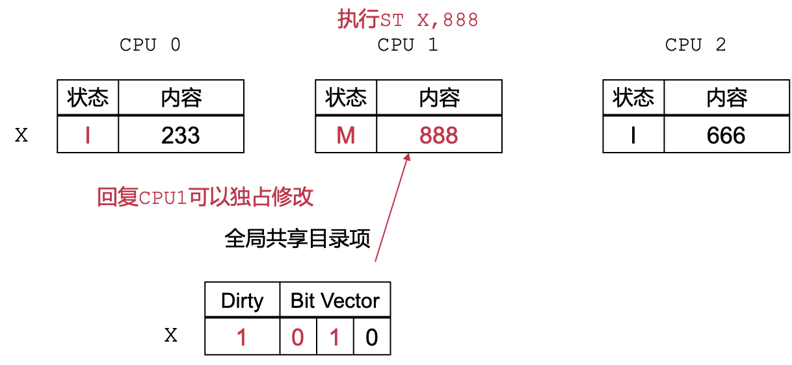

# 多核与同步原语

[toc]

#### 多核性能的理想上限

#### 实际情况：可扩展性断崖

chatgpt给的解释：

> 在多核服务器上进行互斥锁微基准测试时，随着核数的增加，通过量（throughput）不再遵循Amdahl's Law，并出现性能断崖式下跌的主要原因是多核并发引起的锁竞争。
>
> Amdahl's Law描述了在并行计算中，当有一部分任务无法并行化时，整体性能的上限。它假设了并行执行和串行执行的比例不变，并且不考虑额外的开销。
>
> 然而，在互斥锁的情况下，随着核数的增加，线程之间的锁竞争也相应增加。每当一个线程想要获取锁时，它必须等待其他线程释放锁。这种竞争会导致更多的上下文切换、缓存竞争和锁争用等开销。
>
> 随着核数增加，锁竞争的激烈程度也会增加，从而导致性能的下降。当核数达到一定阈值时，锁竞争变得非常严重，而且线程之间频繁地等待锁释放，这就是性能出现断崖式下跌的原因。
>
> 此外，多核服务器上的内存子系统也可能成为性能瓶颈。随着核数的增加，对内存的访问也会增加，可能会导致缓存一致性开销和内存带宽的限制。
>
> 为了克服这些问题，可以尝试以下方法来改善多核服务器上互斥锁的性能：
>
> 1. 减少锁的使用：考虑使用其他并发数据结构或算法，如无锁数据结构、读写锁、分段锁等，以减少锁竞争的程度。
>
> 2. 减小锁的粒度：将锁的粒度细化，尽量缩小锁保护的代码块，以减少不必要的锁竞争。
>
> 3. 使用锁优化技术：使用特定的锁优化技术，如自旋锁、适应性自旋、锁粒度调整等，以减少锁竞争时的开销。
>
> 4. 并发控制：使用其他并发控制手段，如并发队列、任务划分、任务调度等，以减少线程之间的竞争。
>
> 5. 考虑硬件事务内存（Hardware Transactional Memory，HTM）：HTM是一种硬件级别的并发控制机制，可以减少锁的使用和锁竞争的开销。
>
> 请注意，优化并发性能是一个复杂的任务，需要综合考

## 1、问题分析：多核环境下的缓存

##### **对于多核性能有影响的原因：cache需要在不同的核间移动**

> 高速缓存（cache）回顾: 
>
> 多级缓存：
>
> - 靠近CPU贵，速度快，容量小
> - 远离CPU便宜，速度慢，容量大
>
> 读操作：
>
> - 逐层向下找
> - 没找到从内存中读取，放到缓存中
>
> 写操作：
>
> - 直写/写回策略
> - 写入高速缓存，替换时写回
>
> 

#### 多处理器多核环境中的缓存结构

- 简单的解决方案：
  - 将多核当成一个核心，共享缓存设计
- 面临的问题：
  - 高速缓存成为瓶颈（单点竞争）
  - 硬件物理分布：离核心远，速度减慢

- 多级缓存： 
  - 每个核心有自己的私有高 速缓存（L1 Cache） 
  - 多个核心共享一个二级高 速缓存（L2 Cache） 
  - 所有核心共享一个最末级 高速缓存（LLC） 
- 非一致缓存访问（NUCA） 
- 数据一致性问题

### 缓存一致性

- 保证不同核心对同一地址的值达成共识 
- 多种缓存一致性协议：窥探式（不用）/目录式缓存一致性协议 

**具体流程**

-  缓存行处于不同状态（MSI状态） 
  - MSI状态是分配给 cache line的，但是追踪的是地址
- 不同状态之间迁移 
- 所有地读/写缓存行操作遵循协议流程

#### MSI状态迁移

* 独占修改 （Modified） 
  *  该核心独占拥有缓存行 
  * 本地可读可写 
  * 其他核读需要迁移到共享
  *  其他核写需要迁移到失效

- 共享（Shared） ：是为了提升性能，为了方便只读
  - 可能多个核同时有缓存行的拷贝 
  - 本地可读 
  - 本地写需要迁移到独占修改，并使其他核该缓存行失效
  -  其他核写需要迁移到失效

- 失效（Invalid） 
  - 本地缓存行失效 
  - 本地不能读/写缓存行 
  - 本地读需要迁移到共享，并使 其他核该缓存行迁移到共享 
  - 本地写需要迁移到独占修改， 并使其他核心该缓存行失效

#### 缓存一致性：全局目录项

记录缓存行在不同核上的状态，通过总线通讯

##### example：

#### 可扩展性断崖背后的原因： 对单一缓存行的竞争导致严重的性能开销

单一缓存行，代码中可并行的部分急剧下降

## 2. 如何解决可扩展性问题：MCS锁

1. Simple fix：避免对单一缓存行的高度竞争 **Back-off 策略**

* 不合理，这样实现效果是随机的

2. MCS lock

* 核心思路：在关键路径上避免对单一缓存行的高度竞争,使用等待队列，通过 **等待队列** 串起所有需要持锁竞争者节点

  每当一个CPU试图获取一个spinlock，它就会将自己的MCS lock加到这个spinlock的等待队列，成为该队列的一个节点(node)，加入的方式是由该队列末尾的MCS lock的"next"指向这个新的MCS lock。

  

#### MCS锁：新的竞争者加入等待队列

#### MCS锁：锁持有者的传递

#### MCS锁：放锁流程

#### MCS锁：性能分析

让每个CPU不再是等待同一个spinlock变量，而是基于各自不同的per-CPU的变量进行等待，那么每个CPU平时**只需要查询自己对应的这个变量所在的本地cache line**，仅在这个变量发生变化的时候，才需要读取内存和刷新这条cache line，**不再会高频竞争全局缓存行**

#### 为什么不用MCS lock?

* 非关键路径上的开销还是比较大
* 只能FIFO
* 内存开销大

## 3. Linux Kernel中的可扩展锁：QSpinlock

#### MCS的缺点：

在竞争程度低时，锁的性能不佳，有**多次访存操作**，**开销较大**，相比起来**自旋锁** **单次访存操作**，开销较小

#### Linux中的同步原语: QSpinlock

## 4、非一致内存访问（NUMA）

#### NUMA环境中新的挑战

即使在cc-NUMA中没有出现缓存失效 跨结点的缓存一致性协议开销巨大

#### NUMA-aware设计：以cohort锁*为例

核心思路：在一段时间内将访存限制在本地

1. 先获取每结点本地锁 
2. 再获取全局锁 
3. 成功获取全局锁 
4. 释放时将其传递给本地等待队列的下一位
5. 全局锁在一段时间内 
6. 只在一个结点内部传递 
7. 每个节点最多传N次，为了公平

在单CPU上相比MCS性能有所下降的原因：需要两把锁，全局锁和本地锁，还是会涉及跨NUMA的内存访问

## 5. 代理锁：通过代理执行避免跨节点访问

对于锁服务器：遍历请求队列，一一执行临界区的闭包函数，并在执行完后发送执行结果。

通过这个方式，可以避免临界区内的全局缓存行在不同的NUMA节点之间迁移，
转变成本地的访问，从而提升性能。

#### 代理锁性能表现

## 6. 非对称多核的可扩展性

#### 6.1 同构ISA异构多核系统

- 异构多核系统（AMP）
- 高性能处理器核心 + 高能效处理器核心
- 适应更多场景的计算需求（性能+能耗）
- 广泛地使用在移动处理器平台
- 已经运用到桌面平台（Intel Alder Lake, Apple M1）
- 调度器（如EAS）可以将线程调度到异构核心

#### 6.2 传统同步原语无法适应异构场景

而当目标缓存行竞争程度较高时，自旋锁将展现小核倾向性，即小核更容易获取锁

此时，非公平锁（TAS）吞吐率与时延均出现可扩展性断崖，公平锁（MCS）依然面临吞吐断崖

##### 6.2.1 观测1: 不同核处理性能各异，通过获取公平性不再适用

同步原语都隐式地假设了下面的处理器核心是对称的。然而这一假设在AMP下不再成立，因此出现了可扩展性问题。

首先，我们发现由于不同核心处理性能各异，获取公平性不再适用。获取公平性是指锁将按照获取顺序先后依次拿到互斥锁，也即先入先出，称为FIFO。对于这类互斥锁，他们实际上隐式地假设所有核心的算力相同，其给所有的核心相同的概率获取锁。然而，在AMP下，异构核心之间算力有差距：小核需要花费更多时间执行相同的临界区。这时如果我们保证公平性，给每个核心相同概率拿到锁，那么小核的孱弱的性能很有可能暴露在关键路径上，最终影响到吞吐率。

##### 6.2.2 不同核原子操作成功率不同，带来性能问题

#### 6.3 如何在非对称多核中扩展

启示1：遵循获取公平性的锁传递顺序无法适用AMP，需要设计**适合AMP的锁传递顺序**。

启示2: （针对获取锁的时间顺序）允许大核乱序到小核之前拿锁可以有效提升吞吐率，但乱序程度必须可控，避免违背应用时延需求。

## 7. 非对称多核感知锁LibASL

#### 7.1 时延需求指导的锁传递顺序

按照获取锁的时间顺序上（FIFO），在**不违背小核时延需求的前提**下，**尽可能让大核乱序**到小核之前，达到更高的吞吐率

#### 7.2 Epoch的窗口大小

我们设计了一个反馈机制调节。这是由于乱序窗口实际上是在每次加锁之前固定增加了一段等待时间，因此在走相同code path的时候，增加乱序窗口的大小，与epoch的总的时延长度线性相关，因此，我们可以通过运行时动态调整来找到合适的窗口大小。然而，实际上epoch的长度变化可能比较大，需要找到合适的算法来调整，快速响应

## 8. 读写锁的可扩展性

最直观实现存在**性能问题**：读者需要抢一把**全局互斥锁**，**并对一个全局计数器自增**

#### 8.1 **大读者锁**

每个读者将私有一把专属的读者锁，进读临界区：**直接获取私有的互斥锁**

写者进入临界区：**需要获取所有的私有读者锁**，**一旦失败** **，立刻重试**

#### 8.2 大读者锁问题

- 读者关键路径上仍然有上锁操作：涉及原子操作，性能影响仍然较大
- 写者开销巨大

#### 8.3 PRWLock：进一步减少读者关键路径性能开销

核心思想：通过版本号协同**读者与写者，**读者关键路径上只有**三个本地访存操作**

