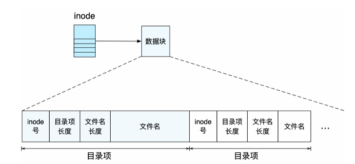
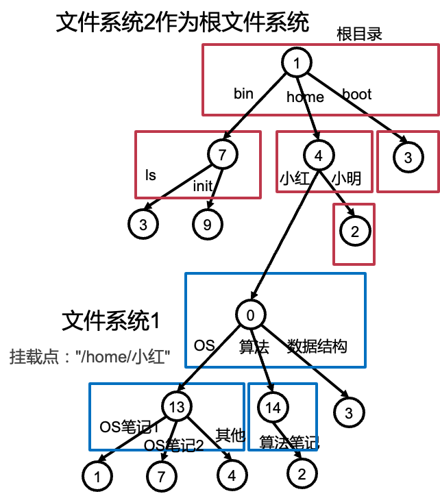
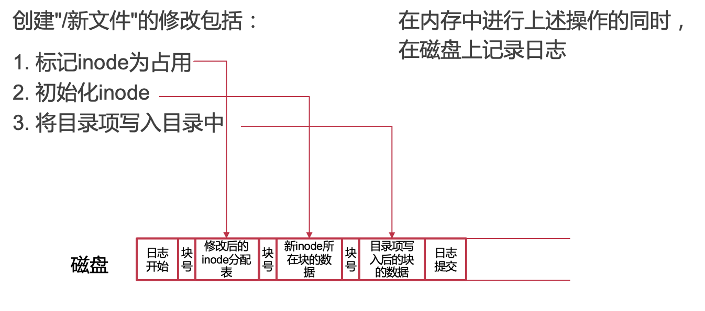
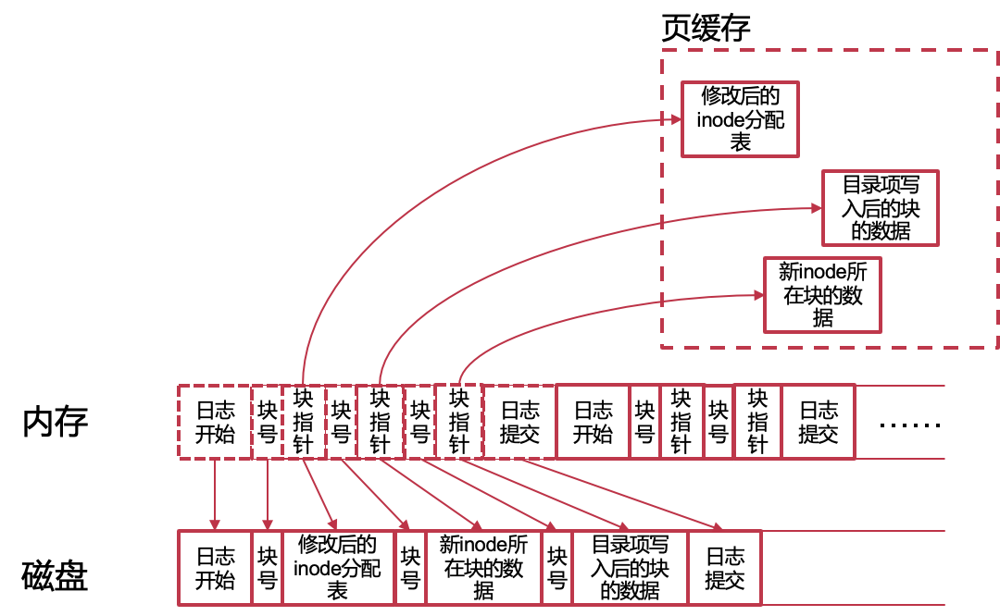
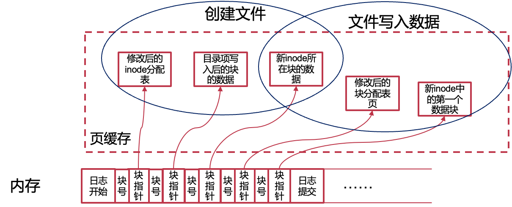
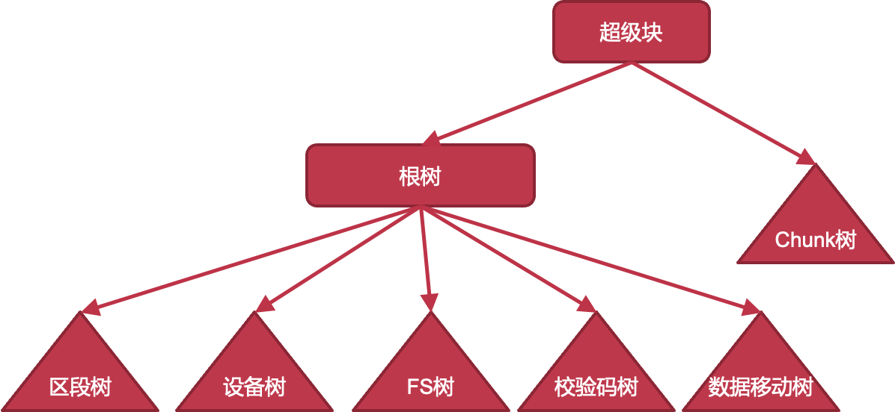
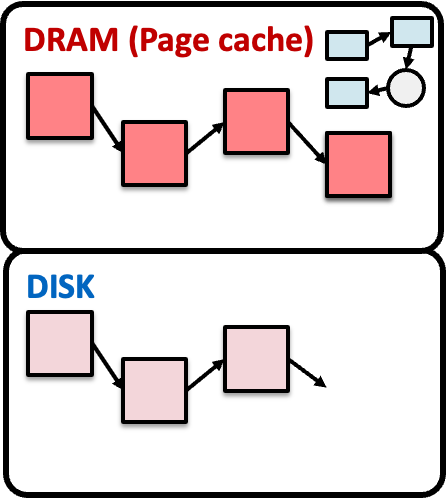
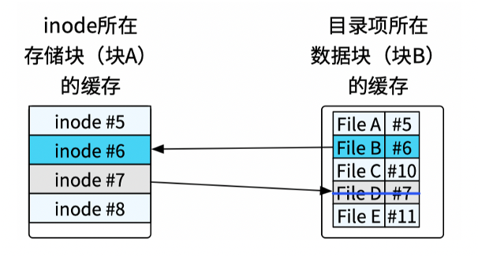
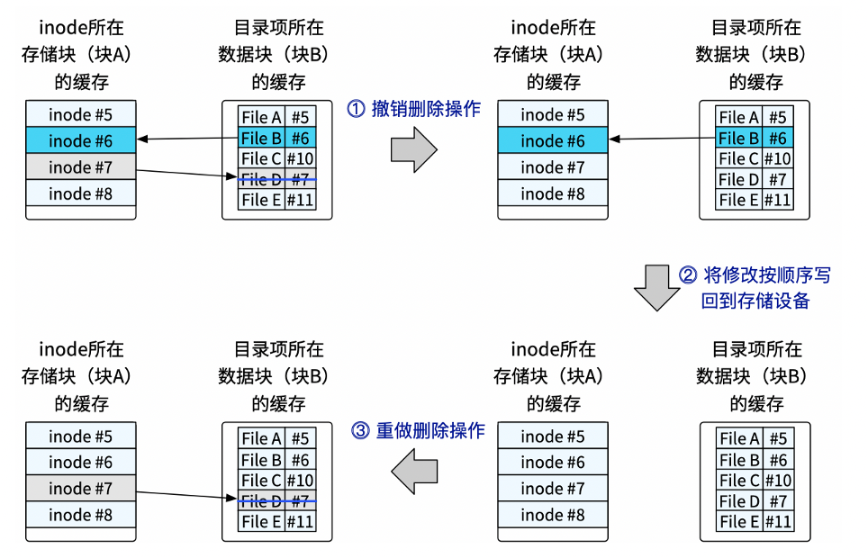

# 14. 不同的文件系统

[toc]

### 同步和互斥

同步：要求有一定的次序，要有order，也要exclusive

互斥：只要求有exclusive，和顺序无关


## 1. **理解一个文件系统的** **11** **个问题**

1. 文件系统使用磁盘块的基本单位是什么？

   block,一般是4K

2. 一个文件的组织方式？

   > 文件并不是唯一的组织方式，还有其他形式，比如kv

3. 空闲空间的组织方式？

​		bitmap, free list, buddy system?

4. 目录的结构是什么？
5. 是否支持硬链接？

6. 是否支持软链接？

7. 磁盘存储的整体布局是什么？

8. 如何根据文件名查找到一个文件？

9. 如何读取一个文件？

10. 如何为一个文件分配新的磁盘空间？

11. 如何挂载一个文件系统？


## 2. **UNIX** **v6** **文件系统**

#### **文件的索引节**点 **：** **inode**

- 常用的元数据

​		–文件类型

​		–文件大小

​		–链接数

​		–文件权限

​		–拥有用户/组

​		–时间（创建、修改、访问时间）

- 具体文件数据的位置


#### **inode** **文件系统的存储布局**

- **inode** **表：记录所有** **inode**

​	–可以看成inode的大数组

​	–每个inode使用作为索引

​	–此时，inode号即为文件名

- **inode** **分配信息（位图）**

​	–记录哪些inode已分配，哪些空闲

- **超级块：** **Super** **Block**

​	–记录磁盘块的大小、其他信息的起始磁盘块位置，等等

​	–是整个文件系统的元数据


#### **inode** **文件系统的基本操作**

- **加载文件系统**

​		–首先读取超级块，然后找到其他信息

- **创建新文件**

​		–根据inode分配信息找到空闲inode，将inode对应的bit设置为1

​		–返回inode在inode表中的索引，作为文件名

- 打开文件

  –查找目标inode，分配新的fd结构保存inode，返回fd号

- 读写文件

​		–默认从fd结构中记录的位置开始读写，读写位置向文件尾移动

​		–可通过lseek调整fd结构中记录的读写位置

- **删除文件**

​		–在inode分配表中，将该inode对应的bit设置为0

- 查找文件（根据inode号）
  在inode表中根据inode号定位该inode

#### **单级** **inode** **过大的问题**的solution：**多级** **inode**

- 引入**索引块**：指向数据块；以及**二级索引块**：指向索引块；...

- 索引块（包括二级索引块）不在inode表的存储区域，而是在数据区域


- 一个多级inode占用的空间很少

  一共只有15个指针（即记录磁盘块），这些指针占用120-Byte

  包含12个直接指针，3个间接指针，1个二级间接指针

  文件最大为：4K x 12 + 4K x 512 x 3 + 4K x 512 x 512 = 48K + 6M + 1G

- **多级** **inode** **和多级页表有什么相似和不同？**

​		相似：都是用多级的方式解决空间消耗过大的问题

​		不同：多级inode可以指针级别不同，这是因为文件内部是没有空洞的，是连续的；而VA中间是有空洞的，不是一段VA中的VA都映射到了PA（比如堆和栈中间可能有段地址是没有分配无法访问的）

> **思考：为什么格式化后可用空间变小了？**
>
> super block，inode table占据了一定的空间，这个时候inode数目即文件数目就确定下来了（可以用在后面新增inode table来动态扩容

#### **目录文件与目录项**

- **目录中的每条映射称为一个** **目录项**

​		–每一条目录项记录了一个inode号与文件名字符串的映射

​		–一个目录可以记录很多目录项

- **目录文件的大小（占用空间）**

​		–与其记录的文件大小无关，和文件数量有关		

​		–“目录” VS. “文件夹”

- **目录支持查找操作**

​		–给定一个目录文件和字符串

​		–在目录文件中查找字符串，并返回对应的inode



- **目录中可以记录子目录**

​		–因为目录本身也是一个文件

​		–通过“/”来分割父目录和子目录

- **最顶端的目录没有目录名（文件名）**

​		–被称为“根目录”（root）

​		–根目录没有文件名，在“/”的前面什么都没有

- **绝对路径和相对路径**

​		–绝对路径：如“/home/xiayb/test.md”

​		–相对路径：如“./test.md”或“xiayb/test.md”

#### 文件的查找过程：/os-book/fs.tex


#### **mmap()** **：用内存接口来访问文件**

- mmap可将文件映射到虚拟内存空间中

​		1.mmap时分配虚拟地址，并标记此段虚拟地址与该文件的inode绑定

​		2.访问mmap返回的虚拟地址时，触发缺页中断（page fault）

​		3.缺页中断处理函数，通过虚拟地址，找到该文件的inode

​		4.从磁盘中将inode中对应的数据读到内存页中

​		5.将内存页映射添加到页表中


#### **mmap()** **：** **文件**内存映射的优势

- 对于随机访问，不用频繁lseek

- 减少系统调用次数

- 可以减少数据copy：如拷贝文件，数据无需经过中间buffer

- 访问的局部性更好

- 可以用madvice为内核提供访问提示，提高性能


## 3、**Ext2** **文件系统**

#### **Ext2** **文件系统的存储布局**

* 将磁盘分为多个块组，每个块组中都有超级块，互为备份

* 超级块（Super Block）记录了整个文件系统的元数据

* 块组描述表记录了块组中各个区域的位置和大小


#### **Ext2** **的常规文件**

- Ext2的inode中

  - 12个直接指针

  - 1个间接指针

  - 1个二级间接指针

  - 1个三级间接指针


#### **使用区段（** **Extent** **）来优化**

> 保存大文件时，如果这些数据块物理上连续，只需要保存**起始块地址和长度**即可

区段（Extent）是由**物理上连续的多个数据块**组成

- 一个区段内的数据可以连续访问，无需按4KB数据块访问

- 可以减少元数据的数量


缺点：

1. 必须是连续的大块block才有效，如果每个extent都是4K的话，反而会导致inode变大

2. 更大的时间开销，不能直接根据offset确定在哪个block上面（之前每个都是4K),现在必须根据每个extent块的offset确定

#### **Ext2** **的** **目录文件**

- 目录：内容为一组目录项的特殊文件

- 目录项：文件名+对应文件的inode号

  - “.”表示当前目录

  - “..”表示父目录


**Ext2的目录项结构**：


#### **其他**常见的**文件类型**

- 字符/块设备文件 （/dev/目录下)
  主要记录设备的Major和Minor号
  Major表示设备类型
  Minor表示设备编号
- FIFO文件
  即命名管道，用于进程间通讯
- SOCK文件
  UNIX域套接字，用于进程间通讯


## 4、**基于** **Table** **的文件系统：** **FAT**

#### **FAT** **32** **存储布局**


#### **FAT** ：文件分配表


#### **FAT** **32**中的目录项

对于长文件名，要用多个目录项进行保存,不会区分大小写

目录同样是一种（特殊的）文件 —— 与基于inode的文件系统一样

目录文件包含若干个目录项，每个目录项记录32个字节

四种目录项：短文件名目录项、长文件名目录项、卷标目录项、"."和".."目录项


#### **如何生成短文件名？**

- **"The quick** **brown.fox ** **->** **"Thequi~1.fox"**

- **如果后一个文件已经存在，怎么办？**

​		–尝试：THEQUI~2FOX

​		–若还冲突，则尝试：THEQUI~3FOX

​		–若还冲突，则尝试： …

​		–若还冲突，则尝试：T~999999FOX

​		–若还冲突，则报错

>- FAT32最大支持多大的单个文件？为什么？
>
> 4G，file size 只有32bit
>
>- 应该如何扩展FAT，使其能支持更大的文件？
>
> 修改file size
>
>- 为什么U盘一般用FAT？
>
> 简单，并且mac和windows都支持
>
>- 为什么FAT不支持link（硬链接）？
>
> FAT中更多的信息比如file size、attribute都记录在directory entry中，文件名和文件耦合在一起了
>
>- 为什么有时候会出现这样的错误？
>
> 
>
> 链式结构，有一个地方错误，后面全部都会错误
>
>- 为什么FAT会有大量的随机读写？
>
>链表，访问的时候就是随机读写

#### **磁盘碎片**

- 磁盘碎片是如何产生的？

​		–思考场景：增大一个文件

​		–表现形式：磁盘使用块不连续

​		–磁盘碎片会导致什么问题？性能下降

- 如何避免磁盘碎片？

​		–做好磁盘的预留

​		–利用内存缓存延迟写入磁盘

​		- 写入时尽可能整合在一起

#### **exFAT** **Highlights**

- 与FAT32并不兼容

- 使用Bitmap加快空间分配

- Unicode保存长文件名

- 允许4GB以上文件（新的目录项格式、文件大小用8个字节）

- 目录中查找文件时使用哈希对比

​		–对文件名的大写形式做哈希

​		–先匹配哈希值，再检查文件名防止冲突

- 使用校验码保证元数据完整性

- 为闪存做优化

​		可调参数，与存储单元边界对齐

​		OEM域

​		没有日志

## 5、**基于**数据库的文件系统：NTFS


#### **NTFS** **主文件表** **MFT**

- MFT是一个关系型数据库（from 微软文档）
  - MFT中的每一行对应着一个文件
  - 每一列为这个文件的某个元数据
  - NTFS 中所有的文件均在 MFT 中有记录
  - 一般会预留整个文件系统存储空间的12.5%，专门保存MFT
- 一切皆文件
  - NTFS 中的所有被分配使用的空间均被某个文件所使用
  - 用于存放文件系统元数据的空间，也会属于某个保留的元数据文件
  - 如：MFT本身，也是一个文件，其元数据保存在MFT中


文件名记录在MFT中，所以everything查找速度很快；文件信息同时记录在目录里面，所以l s的查找速度也得以保证

#### 主文件表包含的文件（保留文件）


#### 主文件表记录

常用属性包括：

- 文件标准元数据（大小、时间等）
- 文件名
- 数据
- 索引根


#### NTFS数据保存位置和目录项

- 非常驻文件（大文件/目录）
  - 数据区的B+树和区段
- 常驻文件（小文件/目录）
  - 大小不超过MFT记录的最大值（1KB）
  - 内嵌在MFT中保存（在"数据"属性中）（所以NTFS存取小文件很高效）
- 目录项与硬链接
  - 包含文件名、文件ID（在MFT中的序号）
  - 支持硬链接：每个硬链接拥有一个单独的目录项

#### 思考时间

- 为什么Everything查找文件这么快：读取MFT，比较快
- 为什么NTFS存取小文件很高效：直接放在MFT中

# 15. 文件系统结构


## 2. **虚拟文件系统** **（** **VFS** **）**

> **中间层，对上提供** **POSIX** **API** **，对下对接不同的文件系统驱动**

#### 虚拟文件系统VFS

- Linux的VFS定义了一些系列接口，具体的文件系统实现这些接口

- Windows的类似机制：Installable File System


- VFS使用vnode作为接口, vnode和inode很像，对于FAT，和inode差异比较大，所以会需要先读出来，转换成和vnode类似的结构
- VFS是in-memory的，不会写磁盘，重启之后会恢复最初始的状态
- Linux的VFS定义了一些系列接口，具体的文件系统实现这些接口，如在读取一个inode的文件时
  - VFS先找到该inode所属文件系统
  - 再调用该文件系统的读取接口

* VFS维护一个统一的文件系统树，操作系统内核启动时会挂载一个根文件系统，其他文件系统可以**挂载**在文件系统树的目录上
  * 这里6号inode会被隐藏，访问不到了，只有unmount之后才能重新看到




- VFS维护所有的挂载信息

  - 查找文件时的每一步，检查当前目录是否为挂载点

  - 若是，则使用被挂载的文件系统继续进行访问
  - 如：文件系统1中的"/OS/OS笔记1"通过操作系统中 的"/home/小红/OS/OS笔记1"访问

- 挂载在逻辑上覆盖挂载点原有的结构， 挂载点下的数据在卸载后依然可以访问

  - 无法访问文件系统2中的"/home/小红"

#### VFS对接FAT32


> - FAT没有inode，如何挂载到VFS？FAT的inode从哪里来？
>   VFS层对上提供的接口，每个文件都有一个inode, 在VFS对于FAT进行适配，适配成inode
> - FAT的驱动需要提供inode
>   磁盘上的FAT并没有inode：硬盘上的数据结构
>   内存中的VFS需要inode：只在内存中的数据结构

#### linux中可以通过文件系统修改系统属性


#### VFS的缺点：

提供的功能托管太多了，导致文件系统本身不能获得灵活的自定义


## 3. **存储结构与缓存**

#### **宏内核** **(Linux)** **中的存储栈**


#### 页缓存（Page Cache）

- 存储访问非常耗时

- 文件访问具有时间局部性：一些目录/文件的数据块会被频繁的读取或写入

- 通过缓存提升文件系统性能

  - 在一个块被读入内存并被访问完成后，并不立即回收内存，将块数据暂时缓存在内存中，下一次被访问时可以避免磁盘读取

  - 在一个块被修改后，并不立即将其写回设备

    - 将块数据暂时留在内存中，此后对于该数据块的写可直接修改在此内存中，可能会有crash的时候的consistency的问题

    

  - 定期或在用户要求时才将数据写回设备

#### **页缓存之外**

- 存储中的每个数据结构，在内存中均有对应的结构
- 存储的数据页：页缓存中的内存页
- 存储中的inode：icache中的inode （inode所在的页的cache)
- 存储中的目录项：dcache中的目录项 （dir entry所在页的cache)
- 存储中的超级块：内存中的超级块结构
- 存储中的分配表：内存中的分配器

> 为什么要为每个结构设计单独的缓存？能否只使用页缓存？
>
> 1. 不同结构的大小和使用方式不同，单独的所以能够更加高效（在内存利用率和性能上）
> 2. 比如 inode 小于 4K，一个页面里有多个 inode，如果其中只有一个 inode 被使用，整个页面都存在内存，浪费了。
> 3. 比如分配器，一些文件系统可以在内存中通过链表等方式，加速分配，而在磁盘上保存 bitmap。

#### 内存与存储结构


* Radix也是页表cache维护的

#### 有缓存情况下的文件查找

由于内存大小限制，内存中缓存的数据是存储中数据的子集

当要访问的数据不在内存中时，会从存储中读取并构造内存中相应的对象


#### ChCore中的文件与存储结构


- 微内核的好处：如果文件系统挂了，内核不同挂掉


## 4、文件系统高级功能

#### read/write 和 mmap的比较


#### **克隆**

- 文件系统层面上的复制
- 只复制关键元数据
- 其他部分CoW共享


#### 快照（Snapshot）

- 同样使用CoW
- 对于基于inode表的文件系统
  - 将inode表拷贝一份作为快照保存
  - 标记已用数据区为CoW
- 对于树状结构的文件系统
  - 将树根拷贝一份作为快照保存
  - 树根以下的节点标记为CoW

#### 稀疏文件

一个文件大部分数据为0，则为稀疏文件

- 在索引中增加标记

- 删除全0块


#### 文件系统的一些其他高级功能

- 加密
- 压缩
- 去重
- 数据和元数据校验
- 配额管理（QoS）
- 软件RAID
- 多设备管理
- 子卷：把文件系统中的一部分变成完整的子文件系统
- 事务（Transaction）


## **5、文件系统的多种形式**

### GIT：内容寻址文件系统

- 表面上GIT是一个版本控制软件
- 但实际上GIT可以被看做是一个内容寻址的文件系统
- 其核心是一个键值存储（KV Store）
  - 值：加入GIT的数据
  - 键：通过数据内容算出的40个字符SHA-1校验和
    - 前2个字符作为子目录名，后38个字符作为文件名
  - 所有对象均保存在.git/objects目录中（文件内容会被压缩）
- 是一个“文件系统之上的文件系统”

#### GIT对象与文件系统


#### GIT的提交


### SQLite：文件系统的竞争者

- 表面上SQLite是一个数据库
- 但实际上SQLite也可以是一个文件系统！
- 其核心还是一个数据库...
  - 在关系型数据库的表中，记录文件名和BLOB类型文件数据
  - 通过查找文件名，获取对应文件数据
  - 存储大量小文件
- 文件系统里的文件（SQLite可以视作一个大文件）里的文件系统里的文件

#### SQLite引发的思考

- 对于小文件，为何一般文件系统不如SQLite效率高？

  1. 打开时间慢=>查找时间慢=>目录结构效率不高、目录太深

- 文件系统如何针对小文件进行改进？

  1. 优化目录结构、用db做fs的索引、或者在fs中内置一个db专门存小文件。

- 还有哪些针对小文件特殊处理的场景？

  1. HTML里面小图片都是拼在一起，用css切图（页面加载速度、网络传输）

  2. 传文件到远端或优盘，先打包再传输

  3. Git的push/pull是先打包再传输


## 6、FUSE：用户态文件系统框架

#### 为什么要用户态文件系统？

- 快速试验文件系统新设计
- 大量第三方库可以使用
- 方便调试
- 无需担心把内核搞崩溃
- 实现新功能


#### FUSE基本流程

1. FUSE文件系统向FUSE驱动注册（挂载）
2. 应用程序发起文件请求
3. 根据挂载点，VFS将请求转发给FUSE驱动
4. FUSE驱动通过中断、共享内存等方式将请求发给FUSE文件系统
5. FUSE文件系统处理请求
6. FUSE文件系统通知FUSE驱动请求结果
7. FUSE驱动通过VFS返回结果给应用程序

##### fuse文件系统的缺点：速度慢

#### FUSE API

- 底层API
  - 直接与内核交互
  - 需要负责处理inode和查找等操作
  - 需要处理内核版本等差异
- 高层API
  - 构建于底层API之上
  - 以路径名为参数
  - 无需关注inode、路径和查找

#### FUSE的用途

- SSHFS（用ssh挂载远端目录到本地）
- Android Sandbox
- GMailFs（以文件接口收发邮件）
- WikipediaFS（用文件查看和编辑Wikipedia）
- 网盘同步
- 分布式文件系统（Lustre、GlusterFS等）
- Since everything is a file, can everything be done with a filesystem?


# 16.文件系统崩溃一致性


#### **创建文件时崩溃，有几种情况？**

创建"/chb"的修改包括：

1. 标记inode为占用
2. 初始化inode
3. 将目录项写入目录中


> 第一种情况：可能会有安全问题，可能读到inode原先的内容，因为文件在销毁的时候并不会清空inode
>
> 第二种情况：可能出现两个文件名指向一个inode,一个文件可以读到另外一个文件的内容不安全

崩溃随时可能发生，{}, {1}，{2}，{3}，{1, 2} （与{2,1}相同），{1, 3}，{2, 3}，{1, 2, 3}一共八种情况；第一种和最后一种是合法的，对应的情况如下：


#### 崩溃一致性：用户期望

重启并恢复后… 

1. 维护文件系统数据结构的内部的不变量 ，例如， 没有磁盘块既在free list中也在一个文件中
2. 仅有最近的一些操作没有被保存到磁盘中
   例如：我昨天写的OS Lab的文件还存在 
   用户只需要关心最近的几次修改还在不在 
3. 没有顺序的异常 
   $ echo 99 > result ; echo done > status   # 此时99已经在result中了

#### 一些（简化的）假设

- 磁盘是fail-stop, 磁盘会忠实执行文件系统下发的命令，不会多做也不会少做

- 磁盘可能不会执行最近的几次操作 

- 保障：磁盘不会写飞(wild writes)

#### 在线与离线恢复

离线恢复：文件系统检查工具, 例如： windows中的chkdsk，Linux中的fsck，例如, ext3

在线恢复：运行过程中，检查一些重要的不一致性，例子, ext4 (同时也使用fsck, 但是非常简单)

#### 文件系统操作所要求的三个属性

```c
creat(“a”); 
fd = creat(“b”); 
write(fd,…); 
// crash
```

- **持久化/Durable**: 哪些操作可见(a和b都可以)
- **原子性/Atomic**: 要不所有操作都可见，要不都不可见(要么a和b都可见，要么都不可见)
- **有序性/Ordered**:  按照前缀序(Prefix)的方式可见(如果b可见，那么a也应该可见)


## **2. 崩溃一致性保障方法**

### 0. overview

- 同步元数据写+fsck
- 日志
- 写时复制
- Soft updates


### 2.1 **同步元数据写** **+fsck**

#### overview

**同步元数据写**

每次元数据写入后，运行sync()保证更新后的元数据入盘

**若非正常重启，则运行fsck检查磁盘，具体步骤**：

1. 检查superblock
   例：保证文件系统大小大于已分配的磁盘块总和
   如果出错，则尝试使用superblock的备份
2. 检查空闲的block

  - 扫描所有inode的所有包含的磁盘块（比较耗时）
  - 用扫描结果来检验磁盘块的bitmap （如果出现了不一致，inode显示已分配，bitmap显示未分配，修改bitmap）
  - 对inode bitmap也用类似方法

3. 检查inode的状态
   检查类型：如普通文件、目录、符号链接等
   若类型错误，则清除掉inode以及对应的bitmap
4. 检查inode链接
   扫描整个文件系统树，核对文件链接的数量 （如果此时出现不一致，在目录中被refer了两次，但是inode的refcount为1，修改refcount为2）
   如果某个inode存在但不在任何一个目录，则放到/lost+found
5. 检查重复磁盘块
   如：两个inode指向同一个磁盘块
   如果一个inode明显有问题则删掉，否则复制磁盘块一边给一个
6. 检查坏的磁盘块ID
   如：指向超出磁盘空间的ID
   问：这种情况下，fsck能做什么呢？仅仅是移除这个指针么？
   1. 把这个指针指向一个全0的区域
   2. 把这个指针删除，然后把后面的指针都往前移一格

7. 检查目录
   这是fsck对数据有更多语义的唯一的一种文件
   保证 . 和 .. 是位于头部的目录项 （常见错误，创建文件后crash没有来得及写数据，..和.是属于目录数据的一部分）
   保证目录的链接数只能是1个
   保证目录中不会有相同的文件名

> 本质：尽量不丢失对于元数据的写
>
> 元数据比较小，对于性能没有特别大的影响

#### fsck的问题：太慢

- fsck需要用多长时间？
  对于服务器70GB磁盘（2百万个inode），需要10分钟
  时间与磁盘的大小成比例增长

- 在Linux早期，非法重启或者每隔一段时间都会fsck

- 同步元数据写导致创建文件等操作非常慢


### 2.2 **日志**

#### overview

> 目的：保证all-or-nothing 

- 在进行修改之前，先将修改记录到日志中
- 所有要进行的修改都记录完毕后，提交日志
- 此后再进行修改
- 修改之后，删除日志

#### example:



- 在"日志提交"写入存储设备之前崩溃: 恢复时发现日志不完整，忽略日志，"/新文件"未被创建
- 在"日志提交"写入存储设备之后崩溃: 将日志中的内容，拷贝到对应位置，"/新文件"被创建成功

##### 这个方法的缺点：

问题1. 每个操作都写磁盘，内存缓存优势被抵消

问题2. 每个修改需要拷贝新数据到日志

问题3. 相同块的多个修改被记录多次

#### **利用内存中的页缓存**

在内存中记录日志，异步写入到磁盘中，仅需保证日志提交在磁盘数据修改之前



#### **批量处理日志以减少磁盘写**

多个文件操作的日志合并在一起，每个修改过的块只需记录一次



#### 日志提交的触发条件

- 定期触发
  每一段时间（如5s）触发一次
  日志达到一定量（如500MB）时触发一次

- 用户触发
  例如：应用调用fsync()时触发

### Case：Linux中的日志系统JBD2

- Journal Block Device 2
- 通用的日志记录模块
  - 日志可以以文件形式保存
  - 日志也可以直接写入存储设备块
- 概念
  - Journal：日志，由文件或设备中某区域组成
  - Handle：原子操作，由需要原子完成的多个修改组成
  - Transaction：事务，多个批量在一起的原子操作

#### JBD2事务的状态


#### JBD2部分接口和使用方法

##### 文件系统挂载时：

```c
journal_t journal;

// 初始化日志系统（日志存在文件中）
journal = jbd2_journal_init_inode(inode)
// 读取并恢复已有日志（如果存在）
jbd2_journal_load(journal)
```

##### 后台进程：

```c
while (sleep_5s()) {
  // 提交事务和回收日志空间（并开始新的事务）
  jbd2_journal_commit_transaction(journal)
}
```

##### 文件系统卸载时

```c
// 释放日志系统
jbd2_journal_destroy(journal)
```

##### 系统调用处理：

```c
handle_t handle;
// 原子操作：创建新文件
handle = jbd2_journal_start(journal, nblocks=8)

// 1. 标记inode为占用
// bh: buffer_head 对应存储设备中的最小访问单元
bitmap_bh = read_inode_bitmap(sb, group)
jbd2_journal_get_write_access(handle, bitmap_bh)
set_bit(ino, bitmap_bh->b_data)
jbd2_journal_dirty_metadata(handle, bitmap_bh)

// 2. 初始化inode
inode_bh = get_inode_bh(sb, ino)
jbd2_journal_get_write_access(handle, inode_bh)
init_inode(inode_bh)
jbd2_journal_dirty_metadata(handle, inode_bh)

// 3. 将目录项写入目录中
data_bh = get_data_page(dir_inode)
jbd2_journal_get_write_access(handle, data_bh)
add_dentry_to_data(page, filename, ino)
jbd2_journal_dirty_metadata(handle, data_bh)

jbd2_journal_stop(handle)  // 结束原子操作
```

#### JBD2日志的磁盘结构


#### Ext4的三种日志模式


- Writeback: 快，但是一致性差，有可能元数据指向了错误的数据, metadata和data之间的关系不保证，可能metadata写了但是data没写
- Journal: 最保险，但是所有写入都需要写两遍，对大文件比较差
- Ordered: 一种平衡的模式。能保证元数据不会指错，但是数据部分可能会出现不一致。（比如写了一个write操作只持久化了一半；一个操作的数据写完了，但是元数据没有修改，（考虑将密码写入一个文件，却未来得及将文件权限进行相应修改）
  - 核心：保证data的持久化在metadata之前

#### Ordered Mode：两次Flush保证顺序


- 在commit之前flush，保证前面的内容都是持久化的了，保证顺序
- 在commit之后flush，保证commit真正持久化，防止在commit之前把旧的元数据覆盖掉

- 问题：两次flush对于性能有很大影响
  - 改进方案：第一个flush：用Jcommit 记录数据和J元数据的hash,从而可以判断前面的信息是否已经落盘
  - 第二个flush：第二个flush可能并不重要，因为user在读取文件的时候使用的是cache中的metadata，这是已经更新过的；元数据的落盘可以尽量拖后，比如隔5s一次落盘；可以给磁盘增加一个功能，在磁盘`commit`写完之后发中断，此时就知道写完了，元数据可以落盘了

- 权衡一致性和性能
  - 数据的数量大，只需要写入一次
  - 元数据的数量少，写入两次相对可接受
- 可能出现的问题
  - 数据只有一份，若出现问题无法回退（all-or-nothing）
  - 部分情况下，一致性还是可以保证的（如新增数据时）
  - 部分情况下，数据会丢失，但元数据依然可以保证一致性


### 2.3 **写时复制** （Copy-on-Write）

#### overview

- 在修改多个数据时，不直接修改数据，而是将数据复制一份，在复制上进行修改，并通过递归的方法将修改变成原子操作
- 常用于树状结构


- 修改A是all-or-nothing的分界点

#### 文件中的写时复制

- 文件数据散落在多个数据块内
  使用日志：数据需要写两遍
- 写时复制保证多个数据块原子更新
  - 将要修改的数据块进行复制（分配新的块）
  - 在新的数据块上修改数据
  - 向上递归复制和修改，直到所有修改能原子完成
  - 进行原子修改
  - 回收资源
- 缺点：不能覆盖，因此在向上更新INODE的时候，需要整个copy inode

> 原子性本质上是有硬件决定的，对于block的修改可以认为是原子的，而inode都很小（一个block内），可以认为对于inode的修改是原子性的

#### **思考时间**

- 对于文件的修改，写时复制一定比日志更高效吗？

  ​	不一定，写时复制对于小修改很低效（至少需要copy一个页）

- 写时复制和日志各自的\

- 缺点有哪些？

  - CoW的小修改；日志要redo，要写两遍

- 能否只用写时复制来实现一个文件系统？

  - Btrfs (B-tree FS）

#### Btrfs (B-tree FS)



- Chunk树: 维护了logical chunk到physical chunk的映射
- 区段树：管理磁盘空间分配（extent）
- 设备树：管理多设备
- FS：文件系统
- 校验码树：管理校验码
- 数据移动树：data relocation tree，记录extent的移动，支持online的磁盘碎片整理
- 优点：all-or- nothing，snapshot很方便


### 2.4 **Soft** **updates**

#### motivation

- 一些不一致情况是良性的
  - 某inode被标记为占用，却从文件系统中无法遍历到该inode (side-effect是浪费了一个inode)
    如创建文件：
    1. 标记inode为占用
    2. 初始化inode
    3. 将目录项写入目录中
  - 合理安排修改写入磁盘的次序（order），可避免恶性不一致情况的发生
- 相对其它方法的优势
  - 无需恢复便可挂载使用
  - 无需在磁盘上记录额外信息

#### Soft Updates的总体思想

- 最新的元数据在内存中
  - 在DRAM中更新，跟踪dependency
  - DRAM 性能更好
  - 无需同步的磁盘写
- 磁盘中的元数据总是一致的（磁盘上显示了dependency的结果，没有dependency的真正写入）
  - 在遵循dependency的前提下写入磁盘
  - 一直能保证一致性
  - 发生崩溃后，重启立即可用



#### Soft Updates的三个次序规则

**1.** **不要指向一个未初始化的结构**

​	–如：目录项指向一个inode之前，该inode结构应该先被初始化

**2.** **一个结构被指针指向时，不要重用该结构**

​	–如：当一个inode指向了一个数据块时，这个数据块不应该被重新分配给其他结构（bitmap可能是不足够的，还要判断是否真的有inode指向该数据块）

**3.** **不要修改最后一个指向有用结构的指针**

​	–如：Rename文件时，在写入新的目录项前，不应删除旧的目录项


#### **对于每个文件系统请求，将其拆解成对多个结构的操作**

–记录对每个结构的修改内容（旧值、新值）

–记录这个修改依赖于那些修改（应在哪些修改之后持久化）

–如创建文件：

1. 标记inode为占用（对bitmap的修改）
2. 初始化inode（对inode的修改，依赖于1）
3. 将目录项写入目录中（对目录文件的内容修改，依赖于1和2）


#### example

##### 创建文件

- 操作步骤
  - 根据规则1，inode 初始化的持久化应早于增加目录项操作的持久化
  - 根据规则2，inode 分配同样应该在增加目录项之前持久化
  - 需同时创建“.”和“..”两个目录项，需要分配并初始化一个新的数据块
  - 根据规则1，数据块的初始化操作应该先 于 inode 中索引的修改持久化
  - 根据规则2，数据块分配信息（如 bitmap）的持久化同样应该在 inode初始化之前
- 异常情况
  - 依然可能会发生空间泄漏，即 inode 分配信息被持久化但却未被文件系统使用
  - 对文件系统结构没有影响；可通过定期扫描找到未使用的 inode 节点并修复


##### **删除文件**

- 操作步骤
  - 根据规则2，文件系统需要将目标文件先从整个文件系统树中去掉，再进行资源回收等操作
- 异常情况
  - 删除目录项为删除操作的原子更新点，系统崩溃只可能发生在此操作之前或之后
  - 若崩溃发生在此之前，则没有删除操作被执行，因此不会产生不一致的情况
  - 若崩溃发生在此之后，并不会造成文件系统中其他文件和数据的不一致性
  - 此过程中造成的空间泄漏，也 可以通过定期检查的方法进行修复


##### **文件重命名**

- 操作步骤
  - 根据规则3，在进行文件移动时，需要先保证目标目录中的目录项被写入完毕，之后才能删除源目录中的目录项
- 异常情况
  - 目标目录中的目录项写入完毕后发生崩溃
  - 重启后会发现两个目录中的目录项均指向该 inode 结构
  - 并未造成被移动文件的数据丢失， 也不影响文件系统中其他文件的一致性


#### **依赖追踪**

– 根据3条规则，对修改之间需要遵守的顺序进行记录

- 如果修改 A需要在修改B之前写入到存储，则称B依赖于A

– Soft update会将这些修改之间的依赖关系记录下来

#### **依赖追踪的两个问题**

- 问题1：环形依赖

  - 一个块通常包含多个文件系统结构

  - 环形依赖：块 A 需要在块 B 前写回，同时块 B 需要在块 A 前写回

    

  > 文件系统首先分配并初始化了6号 inode，使其对应文件File B，然后 新增了目录项。在这些修改还未写入存储设备之时，文件系统还删除了File D，对应的 inode 号为7。这两个操作的目录项刚好在同一个数据块（块 B）中， 而涉及到的两个 inode 刚好也在同一个块（块 A）中。这时，根据 soft updates 的持久化规则，在创建文件时，inode 结构的初始化应在新增目录项之前写回， 因此从块 A 应在块 B 之前被写回到存储设备。同时，在删除文件时，目录项 的删除应在对 inode 结构进行清理之前写回，因此块 B 应该在块 A 之前写回。 一旦产生了这种循环依赖，文件系统无法决定写回顺序。

- 问题2：写回迟滞

  - 当一个结构中的数据被频繁修改时，该结构很可能由于一直产生新的依赖导致长时间无法被写回到存储设备之中

#### 解决依赖追踪的方法：**撤销和重做**

- 解决环形依赖
  -  将依赖追踪从块粒度细化为结构粒度，使用撤销和重做打破循环依赖
- 记录每个结构上的修改记录
  - 当需要将某个结构写回到存储设备时，检测是否有环形依赖
  - 当出现环形依赖时，其先将部分操作撤销
    - 即将内存中的结构还原到此操作执行前的状态
  - 撤销之后环形依赖被打破，根据打破后的依赖将修改按照顺序持久化
  - 持久化完毕之后，将此前被撤销的操作恢复，即重做。
  - 在重做完成后，将最新的内存中的结构按照新的依赖关系再次持久化



> 给出了使用撤销和重做方法打破循环依赖的示例。对于此前创 建File B和删除File D造成的环形依赖，soft updates 首先撤销了删除File D的修改（ 1 ）。在删除完毕后，块 A 和块 B 之间只剩下一个依赖关系。只需要按照依赖关系，先将块 A 进行写回，再将块 B 进行写回即可（ 2 ）。在修改 持久化到存储设备之后，soft updates 将刚刚撤销的删除操作进行重做（ 3 ）。 重做后块 A 和块 B 之间依然只有简单的依赖关系，此时继续按照顺序进行写 回即可。在撤销到重做期间，soft updates 通过对结构上锁，避免应用程序错误地看到撤销后的结构状态。


**撤销和重做的效果：不仅能够打破环形依赖，还能解决写回迟滞的问题**

- 若某个结构被频繁修改，导致不断有新的依赖产生时，可将部分新的修改撤销，在快速完成持久化后将修改重做
- 避免新依赖不断推迟该结构上修改的持久化
- 缺点：撤销了用户的请求，破坏了层次，撤销到重做期间采用加锁的方式，不允许用户进行修改，但是这样有可能会产生性能的影响


# 17. 日志文件系统


### Overview

- 假设：文件被缓存在内存中，文件读请求可以被很好的处理，磁盘写是性能的瓶颈
- 将文件系统的修改以日志的方式顺序写入存储设备,磁盘顺序写的速度要快得多。


其中inode map记录了有多少inode，因为这个时候inode是分散在磁盘中的，所以要用一个inode map来索引inode对应的位置

#### Sprite LFS的数据结构

- 固定位置的结构
  - 超级块、检查点（checkpoint）区域
- 以Log形式保存的结构
  - inode、间接块（索引块）、数据块
  - inode map：记录每个inode的当前位置
  - 段概要（Segment Summary）：记录段中的有效块
  - 段使用表：记录段中有效字节数、段的最后修改时间
  - 目录修改日志

##### example

一个日志文件系统：有4个inode，位置记录在inode map中，对应4个文件分别为：/，/dir2，/file2，/dir2/file1


#### **创建文件举例**

- echo hello > /file3
  - 创建文件
  - 修改文件数据


中间阴影部分相当于就浪费掉了，**文件系统数据被修改后，此前的块被无效化**，所以需要：


### 空间回收利用

#### 空间回收管理方法


#### 两种结合：段（Segment）

- 一个设备被拆分为定长的区域，称为段
  - 段大小需要足以发挥出顺序写的优势，512KB、1MB等
- 每段内只能顺序写入
  - 只有当段内全都是无效数据之后，才能被重新使用
- 干净段用链表维护（对应串联方法）


#### 段使用表

- 记录每个段中有效字节数
  -  归零时变为干净段
- 记录了每个段最近写入时间
  - 将非干净段按时间顺序连在一起，形成逻辑上的连续空间

#### 段清理

1. 将一些段读入内存中准备清理

2. 识别出有效数据

   **识别有效数据的方法**

   - 每个段中保存有段概要（Segment Summary），记录每个块被哪个文件的哪个位置所使用，如：数据块可使用inode号和第几个数据块来表示位置

   - 数据块的有效性可通过对比该位置上的现有指针来判断

     

3. 将有效数据整理后写入到干净段中（对应拷贝方法）

4. 标记被清理的段为干净


#### 清理的策略

> 清理的策略有多种维度

- 清理策略
  - 什么时候执行清理: 后台持续清理？晚上清理？磁盘要满的时候清理？
  - 一次清理多少段？清理哪些段？
  - 有效数据应该以什么顺序排序写入新的段: 维持原顺序？相同目录放一起？相近修改时间放一起？
- 段使用表为策略提供辅助信息
  - 记录每个段中有效字节数
  - 记录每个段最近写入的时间


#### 挂载和恢复

- 方法-1：扫描所有日志，重建出整个文件系统的内存结构
  - 缺点：大量无效数据也被扫描
- 方法-2：定期写入检查点（checkpoint）
  - 写入前的有效数据，可以通过检查点找到
  - 只需扫描检查点之后写入的日志
  - 减少挂载/恢复时间

#### 检查点（Checkpoint）

- 检查点内容
  - inode map的位置（可找到所有文件的内容）
  - 段使用表
  - 当前时间
  - 最后写入的段的指针

> 为什么需要两个检查点区域？
>
> 为了保证至少有一个是可用的


#### 恢复：前滚（roll-forward）

- 尽量恢复检查点后写入的数据
- 通过段概要里面的新inode，恢复新的inode，其inode中的数据块会被自动恢复
- 未被inode"认领"的数据块会被删除

* 缺点：段概要无法保证inode的链接数一致性，如：inode被持久化，但是指向其的目录项未被持久化

- 解决方案：目录修改日志


#### 目录修改日志

- 记录了每个目录操作的信息
  - create、link、rename、unlink
- 以及操作的具体信息
  - 目录项位置、内容、inode的链接数

- 目录修改日志的持久化在目录修改之前
  - 恢复时根据目录修改日志保证inode的链接数是一致的

> LFS的读性能如何
>
> 之前的假设是大多数读请求可以通过内存缓存处理，但是真的去磁盘上读，会比较慢；因为文件会非常分散


# 18. 新型存储设备的文件系统


> #### review: **磁盘结构与性能特性**
>
> - 磁碟、磁头与机械臂
>   - 每个磁碟的两个表面都可以存储数据
>   - 磁碟转速为每分钟 5400 转或 7200 转
>   - 信息保存在以磁柱为中心的同心圆环（即磁道）
>   - 每个磁道按照角度不同又进一步划分成不同的扇区
>   - 需要机械臂主动进行移动来访问不同位置的数据
> - 性能特性: 顺序读写的速度远远大于随机读写（差距100倍左右）
>
> 

## 1. **瓦式磁盘** 

> Shingled Magnetic Recording (SMR) Disk

#### overview

- 传统磁盘密度难以提升
  - 写磁头的宽度难以减小
- 瓦式磁盘将磁道重叠，提升存储密度
  - 减小读磁头的宽度


#### 瓦式磁盘的问题：随机写

随机写会覆盖后面磁道的数据, 只能顺序写入

#### 改进

- 避免整个磁盘只能顺序写入：磁盘划分成多个Band，Band间增大距离，每个Band内必须顺序写入 ，Band大小一般是30MB


#### 当Band内随机写

##### 方法一：多次拷贝

- 修改Band X中的4KB数据

1. 找到空闲Band Y
2. 从Band X的数据拷贝到Band Y，拷贝时将4KB修改写入
3. 将Band Y中的数据拷贝回Band X

- 4KB随机写 → 120MB访问

##### 方法二：缓存+动态映射

- 大容量持久缓存
  - 在磁盘头部预留的区域，磁道不重叠，可随机写入
  - 给固件（STL）单独使用，外部不可见
- 动态映射：Shingle Translation Layer (STL)
  - 从外部（逻辑）地址到内部（物理）地址的映射；如果cache hit了，直接返回内存中的结果，否则返回后面band中的内容
- 修改Band X中的4KB数据
  - 将修改写入缓存，标记Band X为dirty
  - 修改STL映射（让原位置指向持久化缓存）
  - 空闲时，根据缓存内容，清理 dirty Band
- 4KB随机写 → 修改4KB缓存


#### 瓦式磁盘种类


- HM-SMR取消了对于固件的抽象，把管理的任务暴露给了CPU，更加灵活


#### DM-SMR上使用Ext4


因为在最开始的阶段，STL把随机写翻译成了顺序写；到一定时间以后，持久缓存已满，来不及清理，所以性能急剧下降

#### 持久缓存对吞吐量的影响


#### 问题: Ext4的元数据非常分散

- 类似Ext2，Ext4同样使用块组（flex_bg）将文件系统分成多个区域
- 每个块组前16MB用来保存元数据，其余保存数据
- 每次数据修改产生多处元数据的修改
- 8TB分区上有4,000个块组，元数据分散在4,000个Band！
- 分散的元数据随机写 → 脏band数量↓ → 清理工作的负担↓ → 吞吐量↑ 


#### 背景：Ext4上的元数据写回

- Ext4使用JBD2记录元数据日志
- 128MB的日志区域
  - JBD2首先将元数据写入日志区域J，标记元数据为脏
  - 脏元数据在日志提交后被写回到其应有位置S
- 这个时候元数据已经写到日志里面了，所以什么时候写回不重要


#### 解决方法：引入Indirection：以LFS形式增加一个元数据缓存

- 以LFS形式维护10GB日志空间作为元数据缓存

1. JBD2首先将元数据写入日志区域*J*，将元数据标记为clean（无需写回）

2. JBD2在内存中的jmap中将*S*映射到*J*

- Indirection: 元数据访问需要通过 jmap 进行一次地址转换
- 日志空间清理
  - 无效的元数据（被新修改覆盖过的元数据）可以直接被回收
  - 对于冷的元数据，可将其写回到Ext4中其原本的位置*S*
  - 热的元数据继续保留在日志中
- 挂载FS时，读取日志，恢复出jmap


## 2. **闪存盘的文件系统**

#### 闪存盘的组织: (NAND) 闪存盘组织结构

- A chip/package
  => 1/2/4 dies
  => 1/2 planes
  => n blocks （块）
  => n pages （页）
  => n cells
  => 1/2/3/4 levels


- 通道（Channel）
  - 控制器可以同时访问的闪存芯片数量
- 多通道（Multi-channel）
  - 低端盘有2或4个通道
  - 高端盘有8或10个通道


#### 闪存盘的性质

- 非对称的读写与擦除操作
  - 页 (page) 是读写单元 (8-16KB)
  - 块 (block) 是擦除单元 (4-8MB)
- Program/Erase cycles
  - 写入前需要先擦除
  - 每个块被擦除的次数是有限的
- 随机访问性能
  - 没有寻道时间
  - 随机访问的速度提升，但仍与顺序访问有一定差距

- 磨损均衡
  - 频繁写入同一个块会造成写穿问题 （比如说是inode, bitmap等元数据区域）
  - 将写入操作均匀的分摊在整个设备
- 多通道
  - 高并行性
- 异质Cell
  - 存储1到4个比特：SLC 、MLC、TLC、 QLC


#### Flash Translation Layer (FTL)

- 逻辑地址到物理地址的转换
  - 对外使用逻辑地址
  - 内部使用物理地址
  - 可软件实现，也可以固件实现
  - 用于垃圾回收、数据迁移、磨损均衡（wear-levelling）等


#### LFS与Flash很相似：


### F2FS文件系统： Flash Friendly File System

#### LFS的问题

##### 1. 递归更新问题

#### 

##### 2. 单一log顺序写入


#### F2FS的改进1：NAT

- 引入一层 indirection：NAT（node地址转换表）
  - NAT：Node Address Table
  - 维护node号到逻辑块号的映射
  - Node号需转换成逻辑块号才能使用
- F2FS中的文件结构
  - 直接node：保存数据块的逻辑块号
  - 间接node：保存node号                （相当于索引块）
  - 数据块：保存数据


#### F2FS的改进2：多log并行写入


#### 闪存友好的存储布局

- 组织层级
  - Block：4KB，最小的读写单位
  - Segment：2MB
  - Section：多个segment（垃圾回收/GC粒度）
  - Zone：多个section
- 系统元数据（随机写入）
  - 存放在一起：局部性更好
  - CP：检查点
  - SIT：段信息表
  - NAT：node地址转换表
  - SSA：段概要区域
- 数据区（多Log顺序写入）
  - 区分冷/温/热数据
  - 区分文件数据（data segment）与元数据（node segment）


#### 多Log写入

- 按热度将结构分类
  每个类型和热度对应一个log
  默认打开6个log
  用户可进一步配置
- 根据硬件信息可以进一步调整
  调整zone、section大小
  与硬件GC单元对齐等


## 3. **非易失性内存**(NVM)

#### NVDIMM

- 在内存条上加上Flash和超级电容，平时数据在DRAM中；断电后转移到Flash中持久保存
- 容量很难再提升

#### Intel Optane DC Persistent Memory

- 内存接口
- 字节寻址
- 持久保存数据
- 高密度 (512GB/DIMM)
- 需要磨损均衡，但耐磨度比NAND好10倍
- 比DRAM慢十倍以内，比NAND快1000倍

#### 非易失性内存带来的新问题


问题：

1. crash之后，CPU里面的缓存的内容的丢失？

2. **内存写入顺序**：Writeback模式的CPU缓存，虽然能提升性能，但会打乱数据写入内存的顺序

   > 回写（Write Back）也被称为延迟写入（Write Behind / Write Deferred）。也就是说，最初数据只在缓存中更新，稍后再更新到内存中。对内存的写入动作会被推迟，直到修改的内容在缓存中即将被另一个缓存块替换。

考虑持久性和一致性，写入顺序很重要：


#### solution1：使用CLFLUSH保证顺序

- 使用CLFLUSH指令将数据逐出（Evict）缓存，以保证顺序

- CLFLUSH的缺点

  - 顺序执行，阻塞CPU流水线

  - 会将cacheline无效化（Cache-Line Flush的语义）


#### improve：Intel x86 拓展指令集

- 新指令：CLFLUSHOPT
  - 可以看做可并行执行的CLFLUSH
  - 需要用 sfence 来保证顺序

- 新指令： CLWB
  - Cache Line Write Back
  - 与CLFLUSHOPT类似，区别在于不会将cacheline无效化


#### 举例：NVM上的写时复制

利用指针转换的原子性保证all-or-nothing


## 4、非易失性内存文件系统

#### 非易失性内存改变存储栈


设备驱动是为了让磁盘看懂指令而服务的
NVM字节寻址所以不要I/O调度

#### 一致性技术与非易失性内存文件系统

- 原子指令：ALL
- 写时复制：BPFS[SOSP ’09], PMFS[EuroSys ’14], NOVA[FAST ’16]
- 日志 (Journaling): PMFS, NOVA
- Log-structured: NOVA
- Soft updates: SoupFS[USENIX ATC ’17]

#### PMFS


为NVM和体系结构优化: 多种原子更新技术

允许应用直接访问NVM

- DAX mmap

- DAX: Direct Access， 文件mmap时，通过建立页表映射，将数据页映射给应用

  

- Wild writes保护

  - 程序Bug产生的wild writes会破坏NVM上的数据

  - Supervisor Mode Access Protection (SMAP) ：防止内核错误地修改用户内存

  - Write windows (PMFS提出) ：挂载时，NVM映射为只读，写入时，x86的CR0.WP临时设置为0，内核可以修改只读映射

​			

#### 1. PMFS中的一致性保证


#### 2. 拓展的原子指令更新

- 8字节更新
  - CPU原本就支持8字节的原子更新
  - 更新inode的访问时间
- 16字节更新 
  - 使用 cmpxchg16b 指令
  - 同时更新inode中的文件大小和修改时间
- 64字节更新
  - 使用硬件事务内存（HTM）
  - 更新inode中的多个数据
