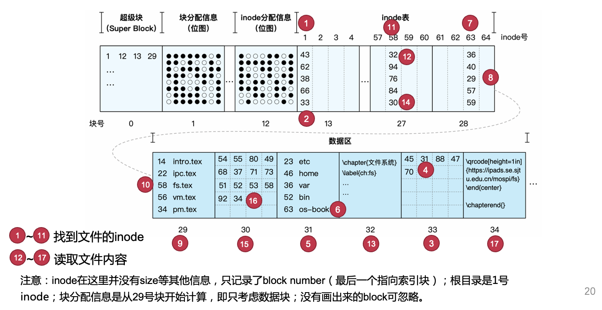
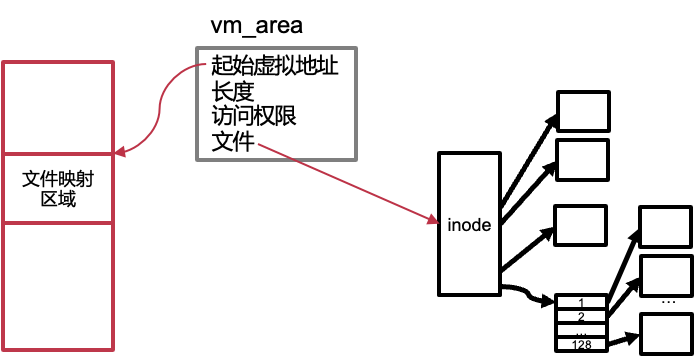
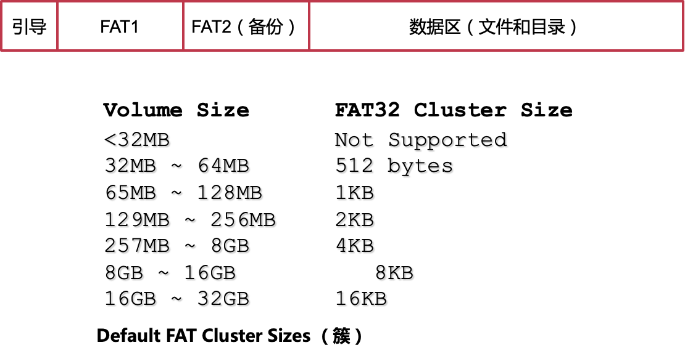
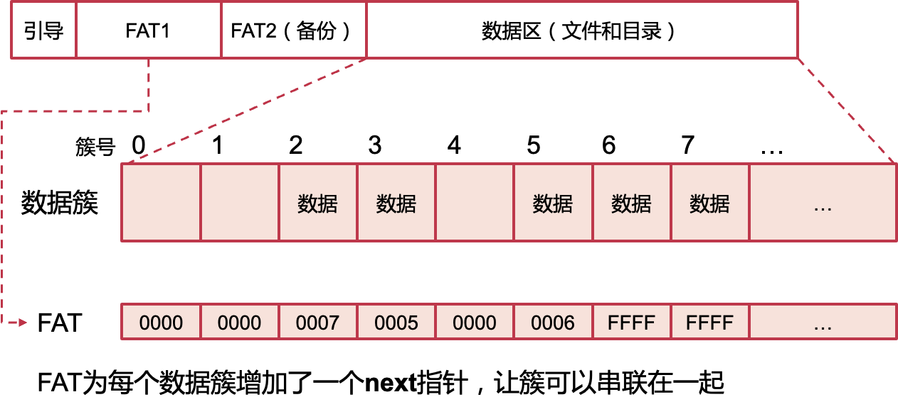
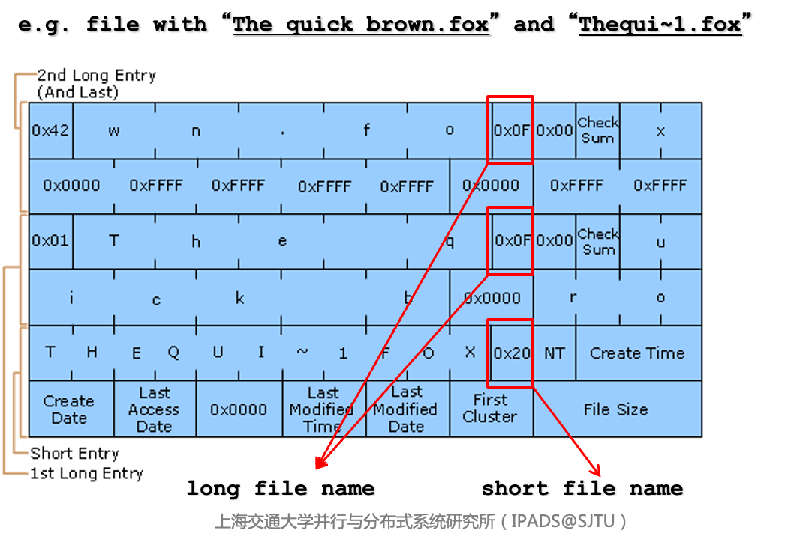
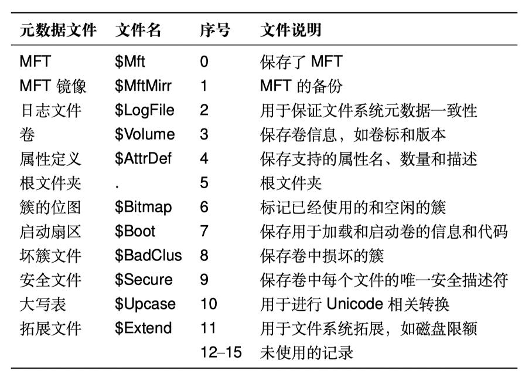

# 不同的文件系统

[toc]

### 同步和互斥

同步：要求有一定的次序，要有order，也要exclusive

互斥：只要求有exclusive，和顺序无关

## 1. **理解一个文件系统的** **11** **个问题**

1. 文件系统使用磁盘块的基本单位是什么？

   block,一般是4K

2. 一个文件的组织方式？

   > 文件并不是唯一的组织方式，还有其他形式，比如kv

3. 空闲空间的组织方式？

​		bitmap, free list, buddy system?

4. 目录的结构是什么？
5. 是否支持硬链接？

6. 是否支持软链接？

7. 磁盘存储的整体布局是什么？

8. 如何根据文件名查找到一个文件？

9. 如何读取一个文件？

10. 如何为一个文件分配新的磁盘空间？

11. 如何挂载一个文件系统？

## 2. **UNIX** **v6** **文件系统**

#### **文件的索引节**点 **：** **inode**

- 常用的元数据

​		–文件类型

​		–文件大小

​		–链接数

​		–文件权限

​		–拥有用户/组

​		–时间（创建、修改、访问时间）

- 具体文件数据的位置

#### **inode** **文件系统的存储布局**

- **inode** **表：记录所有** **inode**

​	–可以看成inode的大数组

​	–每个inode使用作为索引

​	–此时，inode号即为文件名

- **inode** **分配信息（位图）**

​	–记录哪些inode已分配，哪些空闲

- **超级块：** **Super** **Block**

​	–记录磁盘块的大小、其他信息的起始磁盘块位置，等等

​	–是整个文件系统的元数据

#### **inode** **文件系统的基本操作**

- **加载文件系统**

​		–首先读取超级块，然后找到其他信息

- **创建新文件**

​		–根据inode分配信息找到空闲inode，将inode对应的bit设置为1

​		–返回inode在inode表中的索引，作为文件名

- 打开文件

  –查找目标inode，分配新的fd结构保存inode，返回fd号

- 读写文件

​		–默认从fd结构中记录的位置开始读写，读写位置向文件尾移动

​		–可通过lseek调整fd结构中记录的读写位置

- **删除文件**

​		–在inode分配表中，将该inode对应的bit设置为0

- 查找文件（根据inode号）
  在inode表中根据inode号定位该inode

#### **单级** **inode** **过大的问题**的solution：**多级** **inode**

- 引入**索引块**：指向数据块；以及**二级索引块**：指向索引块；...

- 索引块（包括二级索引块）不在inode表的存储区域，而是在数据区域

- 一个多级inode占用的空间很少

  一共只有15个指针（即记录磁盘块），这些指针占用120-Byte

  包含12个直接指针，3个间接指针，1个二级间接指针

  文件最大为：4K x 12 + 4K x 512 x 3 + 4K x 512 x 512 = 48K + 6M + 1G

- **多级** **inode** **和多级页表有什么相似和不同？**

​		相似：都是用多级的方式解决空间消耗过大的问题

​		不同：多级inode可以指针级别不同，这是因为文件内部是没有空洞的，是连续的；而VA中间是有空洞的，不是一段VA中的VA都映射到了PA（比如堆和栈中间可能有段地址是没有分配无法访问的）

> **思考：为什么格式化后可用空间变小了？**
>
> super block，inode table占据了一定的空间，这个时候inode数目即文件数目就确定下来了（可以用在后面新增inode table来动态扩容

#### **目录文件与目录项**

- **目录中的每条映射称为一个** **目录项**

​		–每一条目录项记录了一个inode号与文件名字符串的映射

​		–一个目录可以记录很多目录项

- **目录文件的大小（占用空间）**

​		–与其记录的文件大小无关，和文件数量有关		

​		–“目录” VS. “文件夹”

- **目录支持查找操作**

​		–给定一个目录文件和字符串

​		–在目录文件中查找字符串，并返回对应的inode

- **目录中可以记录子目录**

​		–因为目录本身也是一个文件

​		–通过“/”来分割父目录和子目录

- **最顶端的目录没有目录名（文件名）**

​		–被称为“根目录”（root）

​		–根目录没有文件名，在“/”的前面什么都没有

- **绝对路径和相对路径**

​		–绝对路径：如“/home/xiayb/test.md”

​		–相对路径：如“./test.md”或“xiayb/test.md”

#### 文件的查找过程：/os-book/fs.tex

#### **mmap()** **：用内存接口来访问文件**

- mmap可将文件映射到虚拟内存空间中

​		1.mmap时分配虚拟地址，并标记此段虚拟地址与该文件的inode绑定

​		2.访问mmap返回的虚拟地址时，触发缺页中断（page fault）

​		3.缺页中断处理函数，通过虚拟地址，找到该文件的inode

​		4.从磁盘中将inode中对应的数据读到内存页中

​		5.将内存页映射添加到页表中

#### **mmap()** **：** **文件**内存映射的优势

- 对于随机访问，不用频繁lseek

- 减少系统调用次数

- 可以减少数据copy：如拷贝文件，数据无需经过中间buffer

- 访问的局部性更好

- 可以用madvice为内核提供访问提示，提高性能

## 3、**Ext2** **文件系统**

#### **Ext2** **文件系统的存储布局**

* 将磁盘分为多个块组，每个块组中都有超级块，互为备份

* 超级块（Super Block）记录了整个文件系统的元数据

* 块组描述表记录了块组中各个区域的位置和大小

#### **Ext2** **的常规文件**

- Ext2的inode中

  - 12个直接指针

  - 1个间接指针

  - 1个二级间接指针

  - 1个三级间接指针

#### **使用区段（** **Extent** **）来优化**

> 保存大文件时，如果这些数据块物理上连续，只需要保存**起始块地址和长度**即可

区段（Extent）是由**物理上连续的多个数据块**组成

- 一个区段内的数据可以连续访问，无需按4KB数据块访问

- 可以减少元数据的数量

缺点：

1. 必须是连续的大块block才有效，如果每个extent都是4K的话，反而会导致inode变大

2. 更大的时间开销，不能直接根据offset确定在哪个block上面（之前每个都是4K),现在必须根据每个extent块的offset确定

#### **Ext2** **的** **目录文件**

- 目录：内容为一组目录项的特殊文件

- 目录项：文件名+对应文件的inode号

  - “.”表示当前目录

  - “..”表示父目录

**Ext2的目录项结构**：

#### **其他**常见的**文件类型**

- 字符/块设备文件 （/dev/目录下)
  主要记录设备的Major和Minor号
  Major表示设备类型
  Minor表示设备编号
- FIFO文件
  即命名管道，用于进程间通讯
- SOCK文件
  UNIX域套接字，用于进程间通讯

## 4、**基于** **Table** **的文件系统：** **FAT**

#### **FAT** **32** **存储布局**

#### **FAT** ：文件分配表

#### **FAT** **32**中的目录项

对于长文件名，要用多个目录项进行保存,不会区分大小写

目录同样是一种（特殊的）文件 —— 与基于inode的文件系统一样

目录文件包含若干个目录项，每个目录项记录32个字节

四种目录项：短文件名目录项、长文件名目录项、卷标目录项、"."和".."目录项

#### **如何生成短文件名？**

- **"The quick** **brown.fox ** **->** **"Thequi~1.fox"**

- **如果后一个文件已经存在，怎么办？**

​		–尝试：THEQUI~2FOX

​		–若还冲突，则尝试：THEQUI~3FOX

​		–若还冲突，则尝试： …

​		–若还冲突，则尝试：T~999999FOX

​		–若还冲突，则报错

>- FAT32最大支持多大的单个文件？为什么？
>
>  4G，file size 只有32bit
>
>- 应该如何扩展FAT，使其能支持更大的文件？
>
>  修改file size
>
>- 为什么U盘一般用FAT？
>
>  简单，并且mac和windows都支持
>
>- 为什么FAT不支持link（硬链接）？
>
>  FAT中更多的信息比如file size、attribute都记录在directory entry中，文件名和文件耦合在一起了
>
>- 为什么有时候会出现这样的错误？
>
>  
>
>  链式结构，有一个地方错误，后面全部都会错误
>
>- 为什么FAT会有大量的随机读写？
>
> 链表，访问的时候就是随机读写

#### **磁盘碎片**

- 磁盘碎片是如何产生的？

​		–思考场景：增大一个文件

​		–表现形式：磁盘使用块不连续

​		–磁盘碎片会导致什么问题？性能下降

- 如何避免磁盘碎片？

​		–做好磁盘的预留

​		–利用内存缓存延迟写入磁盘

​		- 写入时尽可能整合在一起

#### **exFAT** **Highlights**

- 与FAT32并不兼容

- 使用Bitmap加快空间分配

- Unicode保存长文件名

- 允许4GB以上文件（新的目录项格式、文件大小用8个字节）

- 目录中查找文件时使用哈希对比

​		–对文件名的大写形式做哈希

​		–先匹配哈希值，再检查文件名防止冲突

- 使用校验码保证元数据完整性

- 为闪存做优化

​		可调参数，与存储单元边界对齐

​		OEM域

​		没有日志

## 5、**基于**数据库的文件系统：NTFS

#### **NTFS** **主文件表** **MFT**

- MFT是一个关系型数据库（from 微软文档）
  - MFT中的每一行对应着一个文件
  - 每一列为这个文件的某个元数据
  - NTFS 中所有的文件均在 MFT 中有记录
  - 一般会预留整个文件系统存储空间的12.5%，专门保存MFT
- 一切皆文件
  - NTFS 中的所有被分配使用的空间均被某个文件所使用
  - 用于存放文件系统元数据的空间，也会属于某个保留的元数据文件
  - 如：MFT本身，也是一个文件，其元数据保存在MFT中

文件名记录在MFT中，所以everything查找速度很快；文件信息同时记录在目录里面，所以l s的查找速度也得以保证

#### 主文件表包含的文件（保留文件）

#### 主文件表记录

常用属性包括：

- 文件标准元数据（大小、时间等）
- 文件名
- 数据
- 索引根

#### NTFS数据保存位置和目录项

- 非常驻文件（大文件/目录）
  - 数据区的B+树和区段
- 常驻文件（小文件/目录）
  - 大小不超过MFT记录的最大值（1KB）
  - 内嵌在MFT中保存（在"数据"属性中）（所以NTFS存取小文件很高效）
- 目录项与硬链接
  - 包含文件名、文件ID（在MFT中的序号）
  - 支持硬链接：每个硬链接拥有一个单独的目录项

#### 思考时间

- 为什么Everything查找文件这么快：读取MFT，比较快
- 为什么NTFS存取小文件很高效：直接放在MFT中

