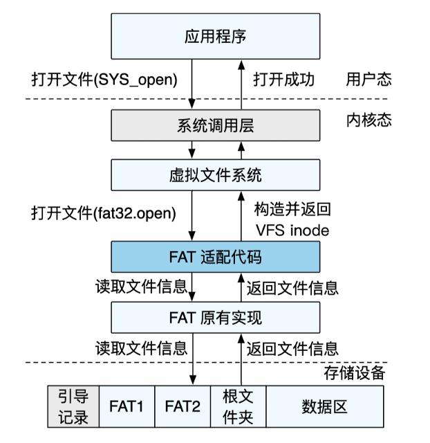
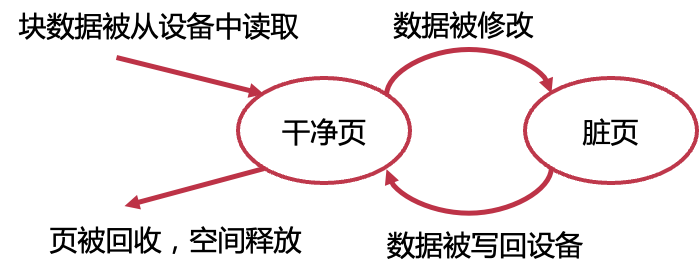
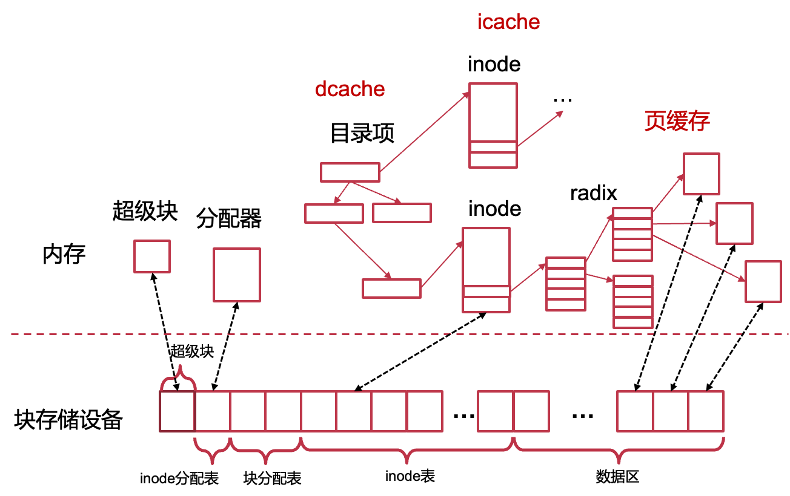
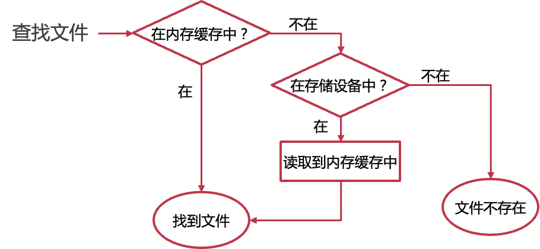
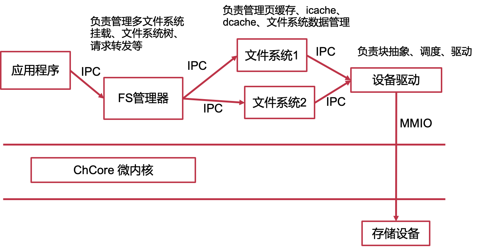
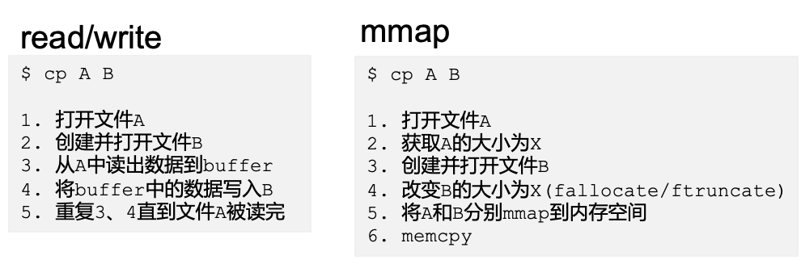
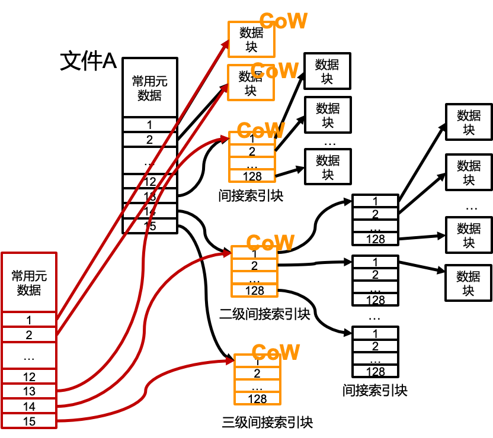
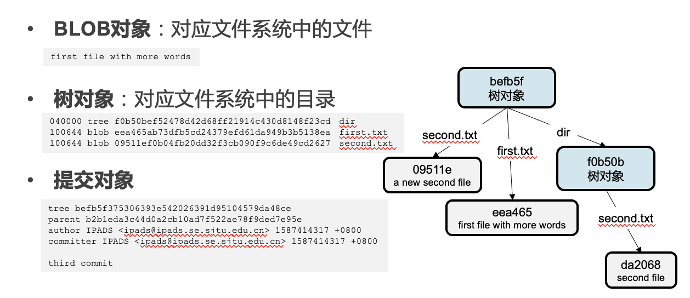
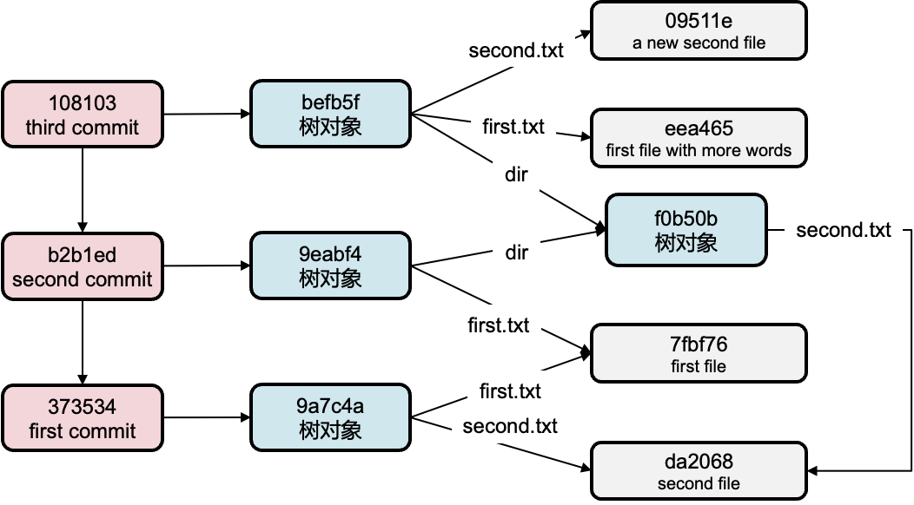

# 15. 文件系统结构

[toc]

## 2. **虚拟文件系统** **（** **VFS** **）**

> **中间层，对上提供** **POSIX** **API** **，对下对接不同的文件系统驱动**

#### 虚拟文件系统VFS

- Linux的VFS定义了一些系列接口，具体的文件系统实现这些接口

- Windows的类似机制：Installable File System

- VFS使用vnode作为接口, vnode和inode很像，对于FAT，和inode差异比较大，所以会需要先读出来，转换成和vnode类似的结构
- VFS是in-memory的，不会写磁盘，重启之后会恢复最初始的状态
- Linux的VFS定义了一些系列接口，具体的文件系统实现这些接口，如在读取一个inode的文件时
  - VFS先找到该inode所属文件系统
  - 再调用该文件系统的读取接口

* VFS维护一个统一的文件系统树，操作系统内核启动时会挂载一个根文件系统，其他文件系统可以**挂载**在文件系统树的目录上
  * 这里6号inode会被隐藏，访问不到了，只有unmount之后才能重新看到

- VFS维护所有的挂载信息

  - 查找文件时的每一步，检查当前目录是否为挂载点

  - 若是，则使用被挂载的文件系统继续进行访问
  - 如：文件系统1中的"/OS/OS笔记1"通过操作系统中 的"/home/小红/OS/OS笔记1"访问

- 挂载在逻辑上覆盖挂载点原有的结构， 挂载点下的数据在卸载后依然可以访问

  - 无法访问文件系统2中的"/home/小红"

#### VFS对接FAT32

> - FAT没有inode，如何挂载到VFS？FAT的inode从哪里来？
>   VFS层对上提供的接口，每个文件都有一个inode, 在VFS对于FAT进行适配，适配成inode
> - FAT的驱动需要提供inode
>   磁盘上的FAT并没有inode：硬盘上的数据结构
>   内存中的VFS需要inode：只在内存中的数据结构

#### linux中可以通过文件系统修改系统属性

#### VFS的缺点：

提供的功能托管太多了，导致文件系统本身不能获得灵活的自定义

## 3. **存储结构与缓存**

#### **宏内核** **(Linux)** **中的存储栈**

#### 页缓存（Page Cache）

- 存储访问非常耗时

- 文件访问具有时间局部性：一些目录/文件的数据块会被频繁的读取或写入
  
- 通过缓存提升文件系统性能
  - 在一个块被读入内存并被访问完成后，并不立即回收内存，将块数据暂时缓存在内存中，下一次被访问时可以避免磁盘读取
  
  - 在一个块被修改后，并不立即将其写回设备
  
    - 将块数据暂时留在内存中，此后对于该数据块的写可直接修改在此内存中，可能会有crash的时候的consistency的问题
  
    
  
  - 定期或在用户要求时才将数据写回设备

#### **页缓存之外**

- 存储中的每个数据结构，在内存中均有对应的结构
- 存储的数据页：页缓存中的内存页
- 存储中的inode：icache中的inode （inode所在的页的cache)
- 存储中的目录项：dcache中的目录项 （dir entry所在页的cache)
- 存储中的超级块：内存中的超级块结构
- 存储中的分配表：内存中的分配器

> 为什么要为每个结构设计单独的缓存？能否只使用页缓存？
>
> 1. 不同结构的大小和使用方式不同，单独的所以能够更加高效（在内存利用率和性能上）
> 2. 比如 inode 小于 4K，一个页面里有多个 inode，如果其中只有一个 inode 被使用，整个页面都存在内存，浪费了。
> 3. 比如分配器，一些文件系统可以在内存中通过链表等方式，加速分配，而在磁盘上保存 bitmap。

#### 内存与存储结构

* Radix也是页表cache维护的

#### 有缓存情况下的文件查找

由于内存大小限制，内存中缓存的数据是存储中数据的子集

当要访问的数据不在内存中时，会从存储中读取并构造内存中相应的对象

#### ChCore中的文件与存储结构

- 微内核的好处：如果文件系统挂了，内核不同挂掉

## 4、文件系统高级功能

#### read/write 和 mmap的比较

#### **克隆**

- 文件系统层面上的复制
- 只复制关键元数据
- 其他部分CoW共享

#### 快照（Snapshot）

- 同样使用CoW
- 对于基于inode表的文件系统
  - 将inode表拷贝一份作为快照保存
  - 标记已用数据区为CoW
- 对于树状结构的文件系统
  - 将树根拷贝一份作为快照保存
  - 树根以下的节点标记为CoW

#### 稀疏文件

一个文件大部分数据为0，则为稀疏文件

- 在索引中增加标记

- 删除全0块

#### 文件系统的一些其他高级功能

- 加密
- 压缩
- 去重
- 数据和元数据校验
- 配额管理（QoS）
- 软件RAID
- 多设备管理
- 子卷：把文件系统中的一部分变成完整的子文件系统
- 事务（Transaction）

## **5、文件系统的多种形式**

### GIT：内容寻址文件系统

- 表面上GIT是一个版本控制软件
- 但实际上GIT可以被看做是一个内容寻址的文件系统
- 其核心是一个键值存储（KV Store）
  - 值：加入GIT的数据
  - 键：通过数据内容算出的40个字符SHA-1校验和
    - 前2个字符作为子目录名，后38个字符作为文件名
  - 所有对象均保存在.git/objects目录中（文件内容会被压缩）
- 是一个“文件系统之上的文件系统”

#### GIT对象与文件系统

#### GIT的提交

### SQLite：文件系统的竞争者

- 表面上SQLite是一个数据库
- 但实际上SQLite也可以是一个文件系统！
- 其核心还是一个数据库...
  - 在关系型数据库的表中，记录文件名和BLOB类型文件数据
  - 通过查找文件名，获取对应文件数据
  - 存储大量小文件
- 文件系统里的文件（SQLite可以视作一个大文件）里的文件系统里的文件

#### SQLite引发的思考

- 对于小文件，为何一般文件系统不如SQLite效率高？

  1. 打开时间慢=>查找时间慢=>目录结构效率不高、目录太深

- 文件系统如何针对小文件进行改进？

  1. 优化目录结构、用db做fs的索引、或者在fs中内置一个db专门存小文件。

- 还有哪些针对小文件特殊处理的场景？

  1. HTML里面小图片都是拼在一起，用css切图（页面加载速度、网络传输）

  2. 传文件到远端或优盘，先打包再传输

  3. Git的push/pull是先打包再传输

## 6、FUSE：用户态文件系统框架

#### 为什么要用户态文件系统？

- 快速试验文件系统新设计
- 大量第三方库可以使用
- 方便调试
- 无需担心把内核搞崩溃
- 实现新功能

#### FUSE基本流程

1. FUSE文件系统向FUSE驱动注册（挂载）
2. 应用程序发起文件请求
3. 根据挂载点，VFS将请求转发给FUSE驱动
4. FUSE驱动通过中断、共享内存等方式将请求发给FUSE文件系统
5. FUSE文件系统处理请求
6. FUSE文件系统通知FUSE驱动请求结果
7. FUSE驱动通过VFS返回结果给应用程序

##### fuse文件系统的缺点：速度慢

#### FUSE API

- 底层API
  - 直接与内核交互
  - 需要负责处理inode和查找等操作
  - 需要处理内核版本等差异
- 高层API
  - 构建于底层API之上
  - 以路径名为参数
  - 无需关注inode、路径和查找

#### FUSE的用途

- SSHFS（用ssh挂载远端目录到本地）
- Android Sandbox
- GMailFs（以文件接口收发邮件）
- WikipediaFS（用文件查看和编辑Wikipedia）
- 网盘同步
- 分布式文件系统（Lustre、GlusterFS等）
- Since everything is a file, can everything be done with a filesystem?