# 16.文件系统崩溃一致性

[toc]

#### **创建文件时崩溃，有几种情况？**

创建"/chb"的修改包括：

1. 标记inode为占用
2. 初始化inode
3. 将目录项写入目录中


> 第一种情况：可能会有安全问题，可能读到inode原先的内容，因为文件在销毁的时候并不会清空inode
>
> 第二种情况：可能出现两个文件名指向一个inode,一个文件可以读到另外一个文件的内容不安全

崩溃随时可能发生，{}, {1}，{2}，{3}，{1, 2} （与{2,1}相同），{1, 3}，{2, 3}，{1, 2, 3}一共八种情况；第一种和最后一种是合法的，对应的情况如下：

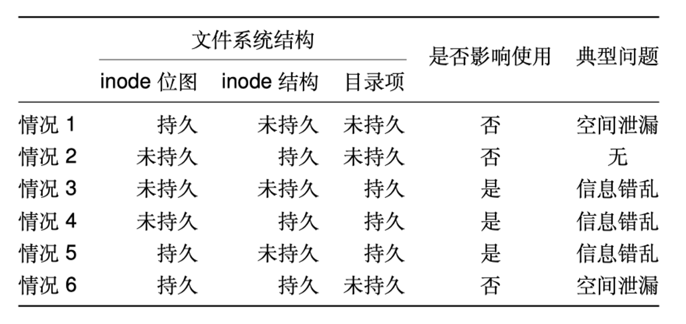

#### 崩溃一致性：用户期望

重启并恢复后… 
1. 维护文件系统数据结构的内部的不变量 ，例如， 没有磁盘块既在free list中也在一个文件中
2. 仅有最近的一些操作没有被保存到磁盘中
    例如：我昨天写的OS Lab的文件还存在 
    用户只需要关心最近的几次修改还在不在 
3. 没有顺序的异常 
    $ echo 99 > result ; echo done > status   # 此时99已经在result中了

#### 一些（简化的）假设

- 磁盘是fail-stop, 磁盘会忠实执行文件系统下发的命令，不会多做也不会少做

- 磁盘可能不会执行最近的几次操作 

- 保障：磁盘不会写飞(wild writes)

#### 在线与离线恢复

离线恢复：文件系统检查工具, 例如： windows中的chkdsk，Linux中的fsck，例如, ext3

在线恢复：运行过程中，检查一些重要的不一致性，例子, ext4 (同时也使用fsck, 但是非常简单)

#### 文件系统操作所要求的三个属性

```c
creat(“a”); 
fd = creat(“b”); 
write(fd,…); 
// crash
```

- **持久化/Durable**: 哪些操作可见(a和b都可以)
- **原子性/Atomic**: 要不所有操作都可见，要不都不可见(要么a和b都可见，要么都不可见)
- **有序性/Ordered**:  按照前缀序(Prefix)的方式可见(如果b可见，那么a也应该可见)


## **2. 崩溃一致性保障方法**

### 0. overview

- 同步元数据写+fsck
- 日志
- 写时复制
- Soft updates


### 2.1 **同步元数据写** **+fsck**

#### overview

**同步元数据写**

每次元数据写入后，运行sync()保证更新后的元数据入盘

**若非正常重启，则运行fsck检查磁盘，具体步骤**：

1. 检查superblock
    例：保证文件系统大小大于已分配的磁盘块总和
    如果出错，则尝试使用superblock的备份
2. 检查空闲的block
  - 扫描所有inode的所有包含的磁盘块（比较耗时）
  - 用扫描结果来检验磁盘块的bitmap （如果出现了不一致，inode显示已分配，bitmap显示未分配，修改bitmap）
  - 对inode bitmap也用类似方法
3. 检查inode的状态
    检查类型：如普通文件、目录、符号链接等
    若类型错误，则清除掉inode以及对应的bitmap
4. 检查inode链接
    扫描整个文件系统树，核对文件链接的数量 （如果此时出现不一致，在目录中被refer了两次，但是inode的refcount为1，修改refcount为2）
    如果某个inode存在但不在任何一个目录，则放到/lost+found
5. 检查重复磁盘块
    如：两个inode指向同一个磁盘块
    如果一个inode明显有问题则删掉，否则复制磁盘块一边给一个
6. 检查坏的磁盘块ID
    如：指向超出磁盘空间的ID
    问：这种情况下，fsck能做什么呢？仅仅是移除这个指针么？
    1. 把这个指针指向一个全0的区域
    2. 把这个指针删除，然后把后面的指针都往前移一格
    
7. 检查目录
    这是fsck对数据有更多语义的唯一的一种文件
    保证 . 和 .. 是位于头部的目录项 （常见错误，创建文件后crash没有来得及写数据，..和.是属于目录数据的一部分）
    保证目录的链接数只能是1个
    保证目录中不会有相同的文件名

> 本质：尽量不丢失对于元数据的写
>
> 元数据比较小，对于性能没有特别大的影响

#### fsck的问题：太慢

- fsck需要用多长时间？
  对于服务器70GB磁盘（2百万个inode），需要10分钟
  时间与磁盘的大小成比例增长

- 在Linux早期，非法重启或者每隔一段时间都会fsck

- 同步元数据写导致创建文件等操作非常慢


### 2.2 **日志**

#### overview

> 目的：保证all-or-nothing 

- 在进行修改之前，先将修改记录到日志中
- 所有要进行的修改都记录完毕后，提交日志
- 此后再进行修改
- 修改之后，删除日志

#### example:

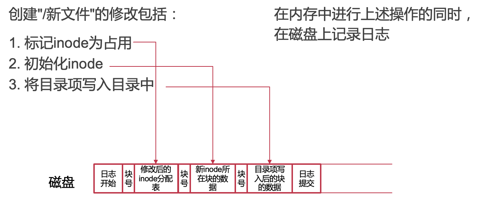

- 在"日志提交"写入存储设备之前崩溃: 恢复时发现日志不完整，忽略日志，"/新文件"未被创建
- 在"日志提交"写入存储设备之后崩溃: 将日志中的内容，拷贝到对应位置，"/新文件"被创建成功

##### 这个方法的缺点：

问题1. 每个操作都写磁盘，内存缓存优势被抵消

问题2. 每个修改需要拷贝新数据到日志

问题3. 相同块的多个修改被记录多次

#### **利用内存中的页缓存**

在内存中记录日志，异步写入到磁盘中，仅需保证日志提交在磁盘数据修改之前

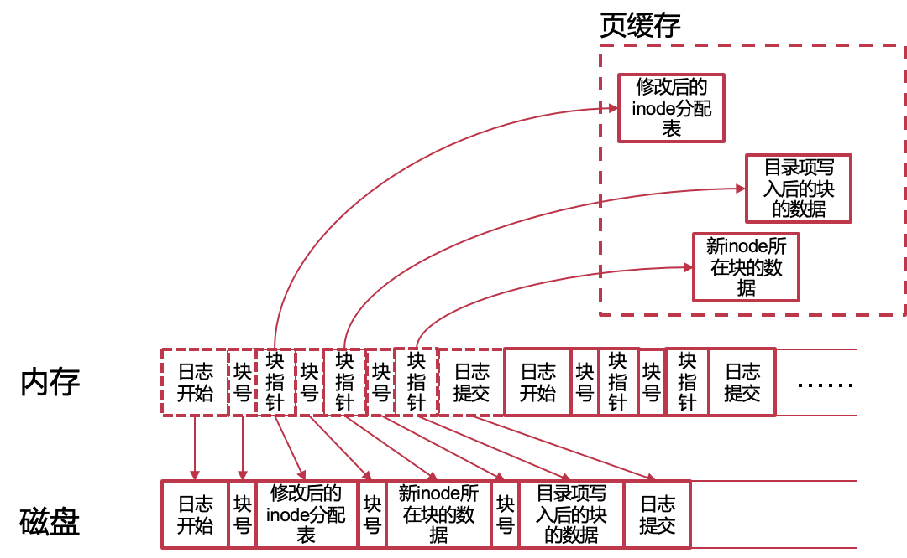

#### **批量处理日志以减少磁盘写**

多个文件操作的日志合并在一起，每个修改过的块只需记录一次

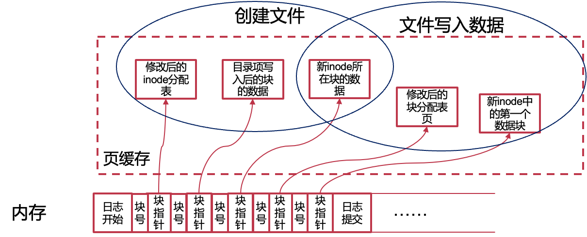

#### 日志提交的触发条件

- 定期触发
  每一段时间（如5s）触发一次
  日志达到一定量（如500MB）时触发一次

- 用户触发
  例如：应用调用fsync()时触发

### Case：Linux中的日志系统JBD2

- Journal Block Device 2
- 通用的日志记录模块
  - 日志可以以文件形式保存
  - 日志也可以直接写入存储设备块
- 概念
  - Journal：日志，由文件或设备中某区域组成
  - Handle：原子操作，由需要原子完成的多个修改组成
  - Transaction：事务，多个批量在一起的原子操作

#### JBD2事务的状态

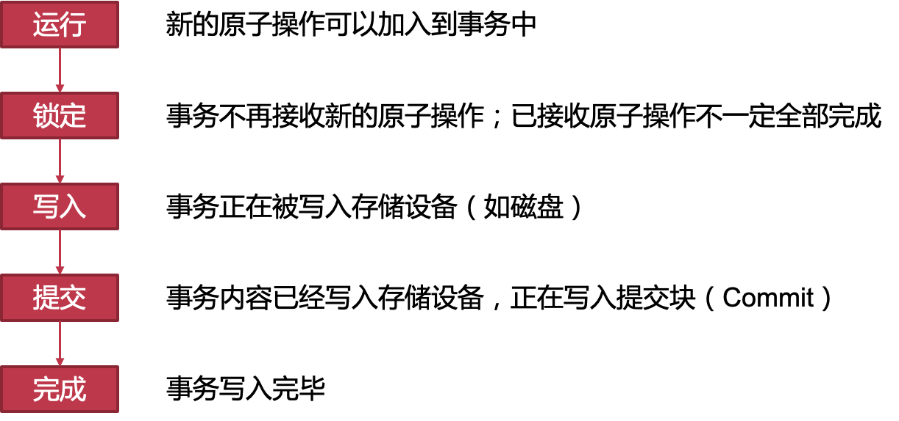

#### JBD2部分接口和使用方法

##### 文件系统挂载时：

```c
journal_t journal;

// 初始化日志系统（日志存在文件中）
journal = jbd2_journal_init_inode(inode)
// 读取并恢复已有日志（如果存在）
jbd2_journal_load(journal)
```

##### 后台进程：

```c
while (sleep_5s()) {
  // 提交事务和回收日志空间（并开始新的事务）
  jbd2_journal_commit_transaction(journal)
}
```

##### 文件系统卸载时

```c
// 释放日志系统
jbd2_journal_destroy(journal)
```

##### 系统调用处理：

```c
handle_t handle;
// 原子操作：创建新文件
handle = jbd2_journal_start(journal, nblocks=8)

// 1. 标记inode为占用
// bh: buffer_head 对应存储设备中的最小访问单元
bitmap_bh = read_inode_bitmap(sb, group)
jbd2_journal_get_write_access(handle, bitmap_bh)
set_bit(ino, bitmap_bh->b_data)
jbd2_journal_dirty_metadata(handle, bitmap_bh)

// 2. 初始化inode
inode_bh = get_inode_bh(sb, ino)
jbd2_journal_get_write_access(handle, inode_bh)
init_inode(inode_bh)
jbd2_journal_dirty_metadata(handle, inode_bh)

// 3. 将目录项写入目录中
data_bh = get_data_page(dir_inode)
jbd2_journal_get_write_access(handle, data_bh)
add_dentry_to_data(page, filename, ino)
jbd2_journal_dirty_metadata(handle, data_bh)

jbd2_journal_stop(handle)  // 结束原子操作
```

#### JBD2日志的磁盘结构

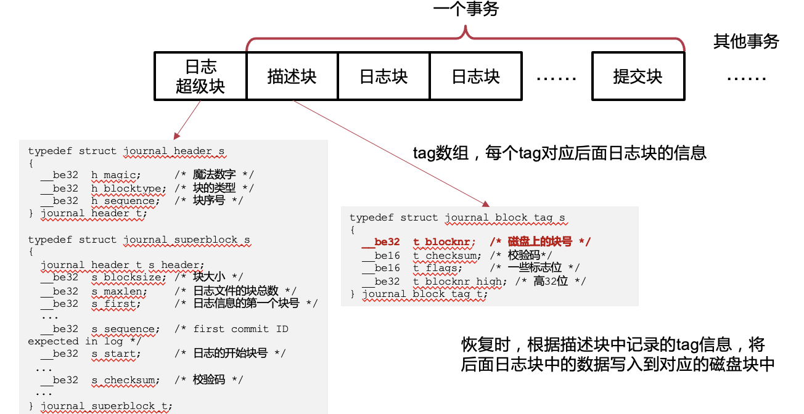

#### Ext4的三种日志模式

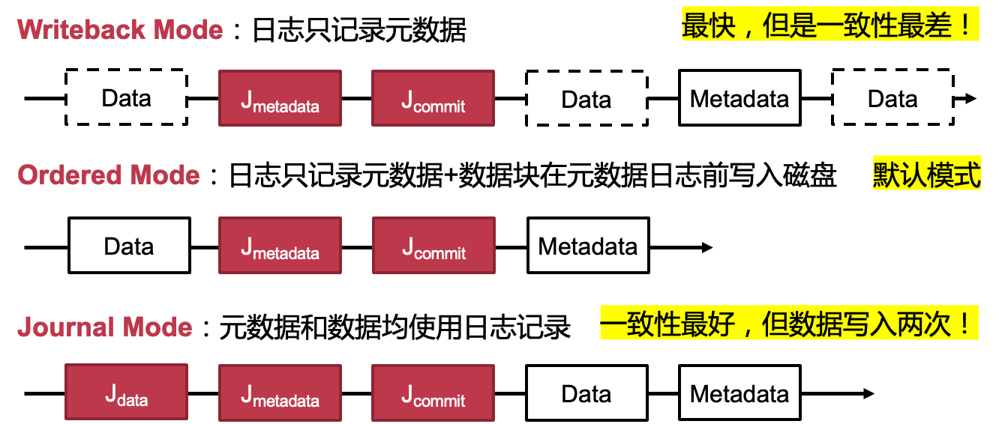

- Writeback: 快，但是一致性差，有可能元数据指向了错误的数据, metadata和data之间的关系不保证，可能metadata写了但是data没写
- Journal: 最保险，但是所有写入都需要写两遍，对大文件比较差
- Ordered: 一种平衡的模式。能保证元数据不会指错，但是数据部分可能会出现不一致。（比如写了一个write操作只持久化了一半；一个操作的数据写完了，但是元数据没有修改，（考虑将密码写入一个文件，却未来得及将文件权限进行相应修改）
  - 核心：保证data的持久化在metadata之前

#### Ordered Mode：两次Flush保证顺序

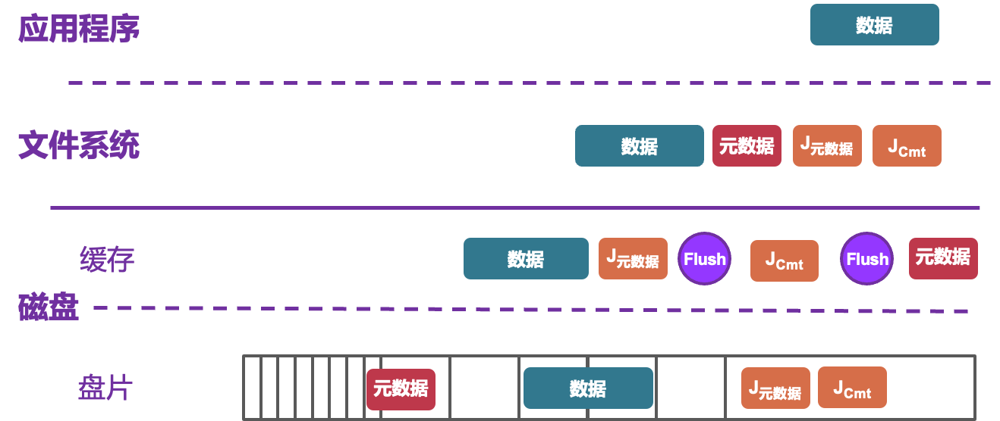

- 在commit之前flush，保证前面的内容都是持久化的了，保证顺序
- 在commit之后flush，保证commit真正持久化，防止在commit之前把旧的元数据覆盖掉

- 问题：两次flush对于性能有很大影响
  - 改进方案：第一个flush：用Jcommit 记录数据和J元数据的hash,从而可以判断前面的信息是否已经落盘
  - 第二个flush：第二个flush可能并不重要，因为user在读取文件的时候使用的是cache中的metadata，这是已经更新过的；元数据的落盘可以尽量拖后，比如隔5s一次落盘；可以给磁盘增加一个功能，在磁盘`commit`写完之后发中断，此时就知道写完了，元数据可以落盘了

- 权衡一致性和性能
  - 数据的数量大，只需要写入一次
  - 元数据的数量少，写入两次相对可接受
- 可能出现的问题
  - 数据只有一份，若出现问题无法回退（all-or-nothing）
  - 部分情况下，一致性还是可以保证的（如新增数据时）
  - 部分情况下，数据会丢失，但元数据依然可以保证一致性


### 2.3 **写时复制** （Copy-on-Write）

#### overview

- 在修改多个数据时，不直接修改数据，而是将数据复制一份，在复制上进行修改，并通过递归的方法将修改变成原子操作
- 常用于树状结构

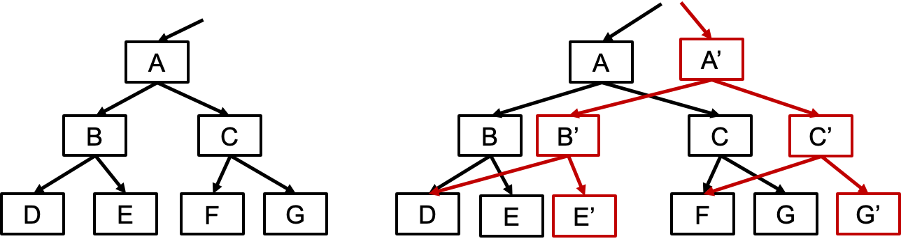

- 修改A是all-or-nothing的分界点

#### 文件中的写时复制

- 文件数据散落在多个数据块内
  使用日志：数据需要写两遍
- 写时复制保证多个数据块原子更新
  - 将要修改的数据块进行复制（分配新的块）
  - 在新的数据块上修改数据
  - 向上递归复制和修改，直到所有修改能原子完成
  - 进行原子修改
  - 回收资源
- 缺点：不能覆盖，因此在向上更新INODE的时候，需要整个copy inode

> 原子性本质上是有硬件决定的，对于block的修改可以认为是原子的，而inode都很小（一个block内），可以认为对于inode的修改是原子性的

#### **思考时间**

- 对于文件的修改，写时复制一定比日志更高效吗？

  ​	不一定，写时复制对于小修改很低效（至少需要copy一个页）

- 写时复制和日志各自的\

- 缺点有哪些？

  - CoW的小修改；日志要redo，要写两遍

- 能否只用写时复制来实现一个文件系统？

  - Btrfs (B-tree FS）

#### Btrfs (B-tree FS)

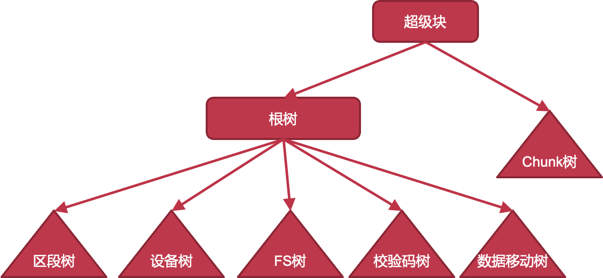

- Chunk树: 维护了logical chunk到physical chunk的映射
- 区段树：管理磁盘空间分配（extent）
- 设备树：管理多设备
- FS：文件系统
- 校验码树：管理校验码
- 数据移动树：data relocation tree，记录extent的移动，支持online的磁盘碎片整理
- 优点：all-or- nothing，snapshot很方便


### 2.4 **Soft** **updates**

#### motivation

- 一些不一致情况是良性的
  - 某inode被标记为占用，却从文件系统中无法遍历到该inode (side-effect是浪费了一个inode)
    如创建文件：
    1. 标记inode为占用
    2. 初始化inode
    3. 将目录项写入目录中
  - 合理安排修改写入磁盘的次序（order），可避免恶性不一致情况的发生
- 相对其它方法的优势
  - 无需恢复便可挂载使用
  - 无需在磁盘上记录额外信息

#### Soft Updates的总体思想

- 最新的元数据在内存中
  - 在DRAM中更新，跟踪dependency
  - DRAM 性能更好
  - 无需同步的磁盘写
- 磁盘中的元数据总是一致的（磁盘上显示了dependency的结果，没有dependency的真正写入）
  - 在遵循dependency的前提下写入磁盘
  - 一直能保证一致性
  - 发生崩溃后，重启立即可用

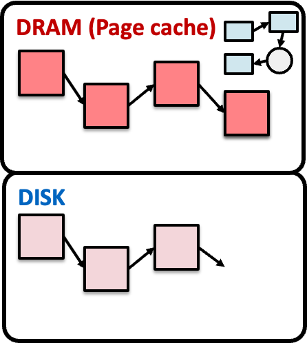

#### Soft Updates的三个次序规则

**1.** **不要指向一个未初始化的结构**

​	–如：目录项指向一个inode之前，该inode结构应该先被初始化

**2.** **一个结构被指针指向时，不要重用该结构**

​	–如：当一个inode指向了一个数据块时，这个数据块不应该被重新分配给其他结构（bitmap可能是不足够的，还要判断是否真的有inode指向该数据块）

**3.** **不要修改最后一个指向有用结构的指针**

​	–如：Rename文件时，在写入新的目录项前，不应删除旧的目录项


#### **对于每个文件系统请求，将其拆解成对多个结构的操作**

–记录对每个结构的修改内容（旧值、新值）

–记录这个修改依赖于那些修改（应在哪些修改之后持久化）

–如创建文件：

1. 标记inode为占用（对bitmap的修改）
2. 初始化inode（对inode的修改，依赖于1）
3. 将目录项写入目录中（对目录文件的内容修改，依赖于1和2）


#### example

##### 创建文件

- 操作步骤
  - 根据规则1，inode 初始化的持久化应早于增加目录项操作的持久化
  - 根据规则2，inode 分配同样应该在增加目录项之前持久化
  - 需同时创建“.”和“..”两个目录项，需要分配并初始化一个新的数据块
  - 根据规则1，数据块的初始化操作应该先 于 inode 中索引的修改持久化
  - 根据规则2，数据块分配信息（如 bitmap）的持久化同样应该在 inode初始化之前
- 异常情况
  - 依然可能会发生空间泄漏，即 inode 分配信息被持久化但却未被文件系统使用
  - 对文件系统结构没有影响；可通过定期扫描找到未使用的 inode 节点并修复

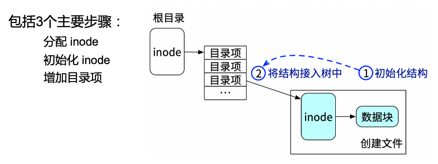

##### **删除文件**

- 操作步骤
  - 根据规则2，文件系统需要将目标文件先从整个文件系统树中去掉，再进行资源回收等操作
- 异常情况
  - 删除目录项为删除操作的原子更新点，系统崩溃只可能发生在此操作之前或之后
  - 若崩溃发生在此之前，则没有删除操作被执行，因此不会产生不一致的情况
  - 若崩溃发生在此之后，并不会造成文件系统中其他文件和数据的不一致性
  - 此过程中造成的空间泄漏，也 可以通过定期检查的方法进行修复

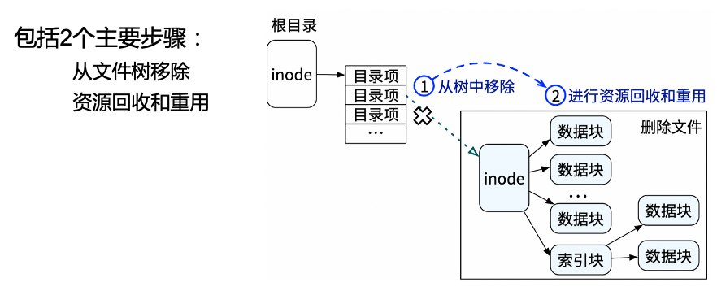

##### **文件重命名**

- 操作步骤
  - 根据规则3，在进行文件移动时，需要先保证目标目录中的目录项被写入完毕，之后才能删除源目录中的目录项
- 异常情况
  - 目标目录中的目录项写入完毕后发生崩溃
  - 重启后会发现两个目录中的目录项均指向该 inode 结构
  - 并未造成被移动文件的数据丢失， 也不影响文件系统中其他文件的一致性

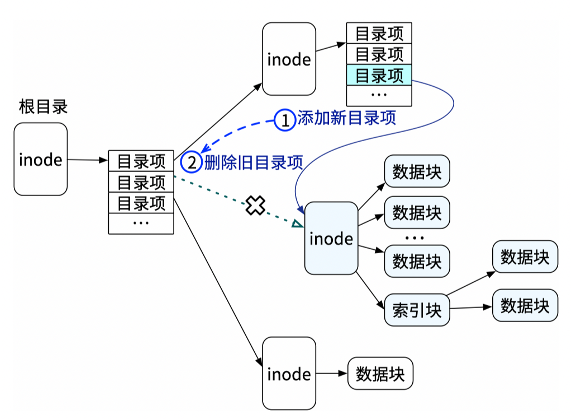


#### **依赖追踪**

– 根据3条规则，对修改之间需要遵守的顺序进行记录

- 如果修改 A需要在修改B之前写入到存储，则称B依赖于A

– Soft update会将这些修改之间的依赖关系记录下来

#### **依赖追踪的两个问题**

- 问题1：环形依赖

  - 一个块通常包含多个文件系统结构

  - 环形依赖：块 A 需要在块 B 前写回，同时块 B 需要在块 A 前写回

    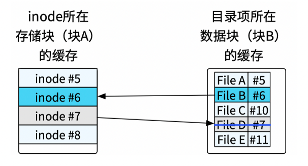

  > 文件系统首先分配并初始化了6号 inode，使其对应文件File B，然后 新增了目录项。在这些修改还未写入存储设备之时，文件系统还删除了File D，对应的 inode 号为7。这两个操作的目录项刚好在同一个数据块（块 B）中， 而涉及到的两个 inode 刚好也在同一个块（块 A）中。这时，根据 soft updates 的持久化规则，在创建文件时，inode 结构的初始化应在新增目录项之前写回， 因此从块 A 应在块 B 之前被写回到存储设备。同时，在删除文件时，目录项 的删除应在对 inode 结构进行清理之前写回，因此块 B 应该在块 A 之前写回。 一旦产生了这种循环依赖，文件系统无法决定写回顺序。

- 问题2：写回迟滞

  - 当一个结构中的数据被频繁修改时，该结构很可能由于一直产生新的依赖导致长时间无法被写回到存储设备之中

#### 解决依赖追踪的方法：**撤销和重做**

- 解决环形依赖
  -  将依赖追踪从块粒度细化为结构粒度，使用撤销和重做打破循环依赖
- 记录每个结构上的修改记录
  - 当需要将某个结构写回到存储设备时，检测是否有环形依赖
  - 当出现环形依赖时，其先将部分操作撤销
    - 即将内存中的结构还原到此操作执行前的状态
  - 撤销之后环形依赖被打破，根据打破后的依赖将修改按照顺序持久化
  - 持久化完毕之后，将此前被撤销的操作恢复，即重做。
  - 在重做完成后，将最新的内存中的结构按照新的依赖关系再次持久化

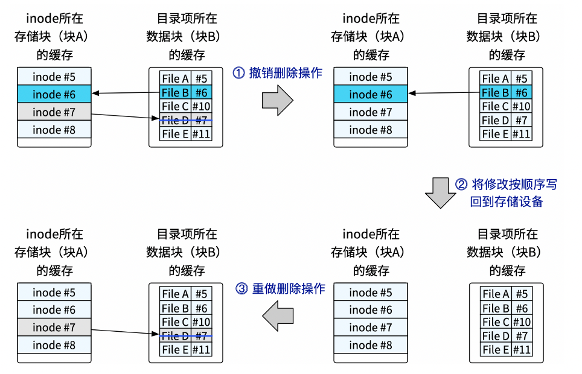

> 给出了使用撤销和重做方法打破循环依赖的示例。对于此前创 建File B和删除File D造成的环形依赖，soft updates 首先撤销了删除File D的修改（ 1 ）。在删除完毕后，块 A 和块 B 之间只剩下一个依赖关系。只需要按照依赖关系，先将块 A 进行写回，再将块 B 进行写回即可（ 2 ）。在修改 持久化到存储设备之后，soft updates 将刚刚撤销的删除操作进行重做（ 3 ）。 重做后块 A 和块 B 之间依然只有简单的依赖关系，此时继续按照顺序进行写 回即可。在撤销到重做期间，soft updates 通过对结构上锁，避免应用程序错误地看到撤销后的结构状态。


**撤销和重做的效果：不仅能够打破环形依赖，还能解决写回迟滞的问题**

- 若某个结构被频繁修改，导致不断有新的依赖产生时，可将部分新的修改撤销，在快速完成持久化后将修改重做
- 避免新依赖不断推迟该结构上修改的持久化
- 缺点：撤销了用户的请求，破坏了层次，撤销到重做期间采用加锁的方式，不允许用户进行修改，但是这样有可能会产生性能的影响