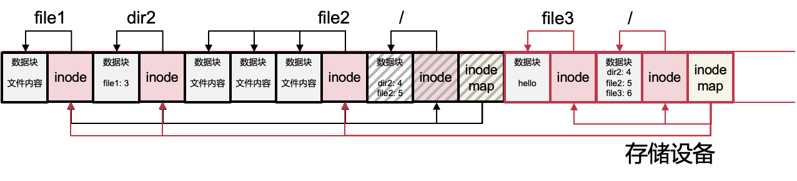
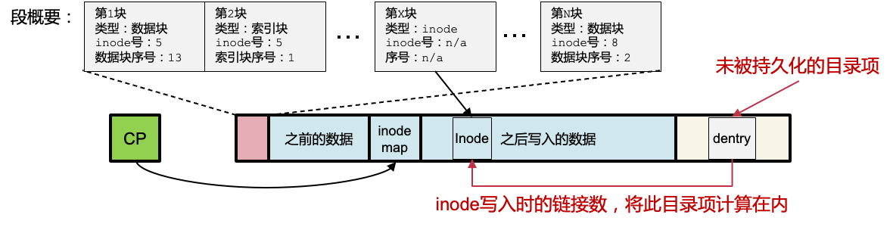

# 17. 日志文件系统

[toc]

### Overview

- 假设：文件被缓存在内存中，文件读请求可以被很好的处理，磁盘写是性能的瓶颈
- 将文件系统的修改以日志的方式顺序写入存储设备,磁盘顺序写的速度要快得多。

其中inode map记录了有多少inode，因为这个时候inode是分散在磁盘中的，所以要用一个inode map来索引inode对应的位置

#### Sprite LFS的数据结构

- 固定位置的结构
  - 超级块、检查点（checkpoint）区域
- 以Log形式保存的结构
  - inode、间接块（索引块）、数据块
  - inode map：记录每个inode的当前位置
  - 段概要（Segment Summary）：记录段中的有效块
  - 段使用表：记录段中有效字节数、段的最后修改时间
  - 目录修改日志

##### example

一个日志文件系统：有4个inode，位置记录在inode map中，对应4个文件分别为：/，/dir2，/file2，/dir2/file1

#### **创建文件举例**

- echo hello > /file3
  - 创建文件
  - 修改文件数据

中间阴影部分相当于就浪费掉了，**文件系统数据被修改后，此前的块被无效化**，所以需要：

### 空间回收利用

#### 空间回收管理方法

#### 两种结合：段（Segment）

- 一个设备被拆分为定长的区域，称为段
  - 段大小需要足以发挥出顺序写的优势，512KB、1MB等
- 每段内只能顺序写入
  - 只有当段内全都是无效数据之后，才能被重新使用
- 干净段用链表维护（对应串联方法）

#### 段使用表

- 记录每个段中有效字节数
  -  归零时变为干净段
- 记录了每个段最近写入时间
  - 将非干净段按时间顺序连在一起，形成逻辑上的连续空间

#### 段清理

1. 将一些段读入内存中准备清理

2. 识别出有效数据

   **识别有效数据的方法**

   - 每个段中保存有段概要（Segment Summary），记录每个块被哪个文件的哪个位置所使用，如：数据块可使用inode号和第几个数据块来表示位置

   - 数据块的有效性可通过对比该位置上的现有指针来判断

     

3. 将有效数据整理后写入到干净段中（对应拷贝方法）

4. 标记被清理的段为干净

#### 清理的策略

> 清理的策略有多种维度

- 清理策略
  - 什么时候执行清理: 后台持续清理？晚上清理？磁盘要满的时候清理？
  - 一次清理多少段？清理哪些段？
  - 有效数据应该以什么顺序排序写入新的段: 维持原顺序？相同目录放一起？相近修改时间放一起？
- 段使用表为策略提供辅助信息
  - 记录每个段中有效字节数
  - 记录每个段最近写入的时间

#### 挂载和恢复

- 方法-1：扫描所有日志，重建出整个文件系统的内存结构
  - 缺点：大量无效数据也被扫描
- 方法-2：定期写入检查点（checkpoint）
  - 写入前的有效数据，可以通过检查点找到
  - 只需扫描检查点之后写入的日志
  - 减少挂载/恢复时间

#### 检查点（Checkpoint）

- 检查点内容
  - inode map的位置（可找到所有文件的内容）
  - 段使用表
  - 当前时间
  - 最后写入的段的指针

> 为什么需要两个检查点区域？
>
> 为了保证至少有一个是可用的

#### 恢复：前滚（roll-forward）

- 尽量恢复检查点后写入的数据
- 通过段概要里面的新inode，恢复新的inode，其inode中的数据块会被自动恢复
- 未被inode"认领"的数据块会被删除

* 缺点：段概要无法保证inode的链接数一致性，如：inode被持久化，但是指向其的目录项未被持久化

- 解决方案：目录修改日志

#### 目录修改日志

- 记录了每个目录操作的信息
  - create、link、rename、unlink
- 以及操作的具体信息
  - 目录项位置、内容、inode的链接数

- 目录修改日志的持久化在目录修改之前
  - 恢复时根据目录修改日志保证inode的链接数是一致的

> LFS的读性能如何
>
> 之前的假设是大多数读请求可以通过内存缓存处理，但是真的去磁盘上读，会比较慢；因为文件会非常分散
