# 18. 新型存储设备的文件系统

[toc]

> #### review: **磁盘结构与性能特性**
>
> - 磁碟、磁头与机械臂
>   - 每个磁碟的两个表面都可以存储数据
>   - 磁碟转速为每分钟 5400 转或 7200 转
>   - 信息保存在以磁柱为中心的同心圆环（即磁道）
>   - 每个磁道按照角度不同又进一步划分成不同的扇区
>   - 需要机械臂主动进行移动来访问不同位置的数据
> - 性能特性: 顺序读写的速度远远大于随机读写（差距100倍左右）
>
> 

## 1. **瓦式磁盘** 

> Shingled Magnetic Recording (SMR) Disk

#### overview

- 传统磁盘密度难以提升
  - 写磁头的宽度难以减小
- 瓦式磁盘将磁道重叠，提升存储密度
  - 减小读磁头的宽度

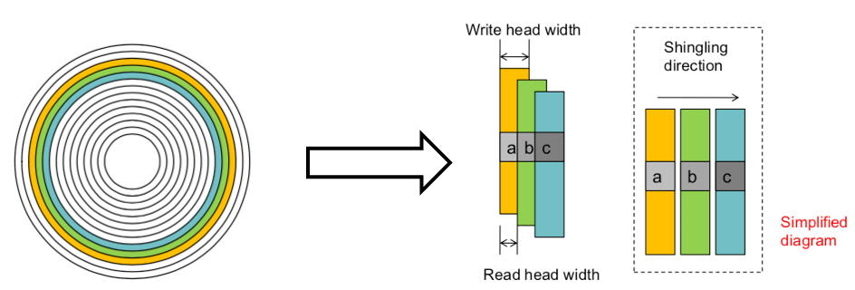

#### 瓦式磁盘的问题：随机写

随机写会覆盖后面磁道的数据, 只能顺序写入

#### 改进

- 避免整个磁盘只能顺序写入：磁盘划分成多个Band，Band间增大距离，每个Band内必须顺序写入 ，Band大小一般是30MB

#### 当Band内随机写

##### 方法一：多次拷贝

- 修改Band X中的4KB数据

1. 找到空闲Band Y
2. 从Band X的数据拷贝到Band Y，拷贝时将4KB修改写入
3. 将Band Y中的数据拷贝回Band X

- 4KB随机写 → 120MB访问

##### 方法二：缓存+动态映射

- 大容量持久缓存
  - 在磁盘头部预留的区域，磁道不重叠，可随机写入
  - 给固件（STL）单独使用，外部不可见
- 动态映射：Shingle Translation Layer (STL)
  - 从外部（逻辑）地址到内部（物理）地址的映射；如果cache hit了，直接返回内存中的结果，否则返回后面band中的内容
- 修改Band X中的4KB数据
  - 将修改写入缓存，标记Band X为dirty
  - 修改STL映射（让原位置指向持久化缓存）
  - 空闲时，根据缓存内容，清理 dirty Band
- 4KB随机写 → 修改4KB缓存

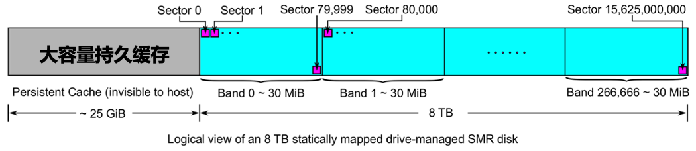

#### 瓦式磁盘种类

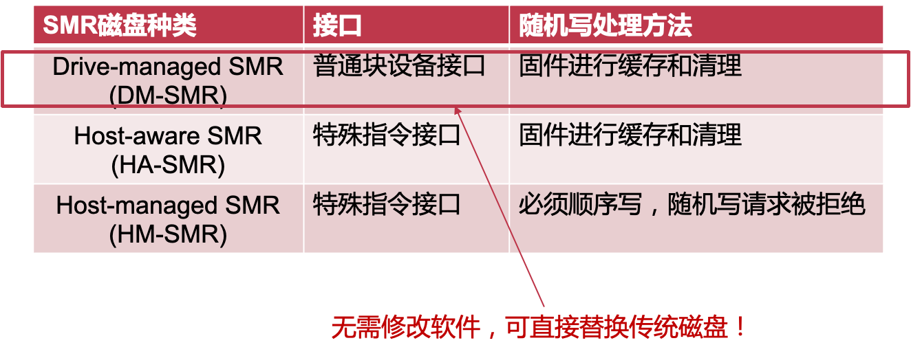

- HM-SMR取消了对于固件的抽象，把管理的任务暴露给了CPU，更加灵活

#### DM-SMR上使用Ext4

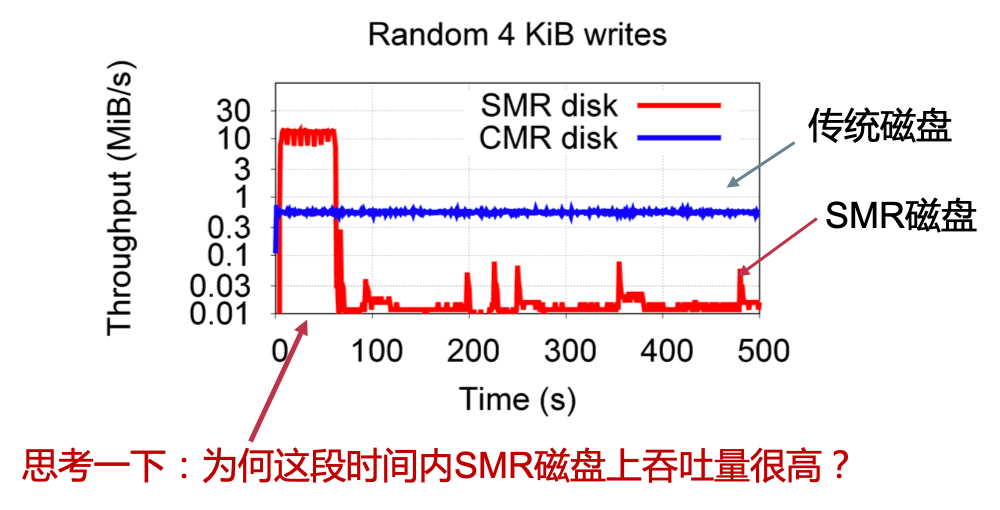

因为在最开始的阶段，STL把随机写翻译成了顺序写；到一定时间以后，持久缓存已满，来不及清理，所以性能急剧下降

#### 持久缓存对吞吐量的影响

#### 问题: Ext4的元数据非常分散

- 类似Ext2，Ext4同样使用块组（flex_bg）将文件系统分成多个区域
- 每个块组前16MB用来保存元数据，其余保存数据
- 每次数据修改产生多处元数据的修改
- 8TB分区上有4,000个块组，元数据分散在4,000个Band！
- 分散的元数据随机写 → 脏band数量↓ → 清理工作的负担↓ → 吞吐量↑ 

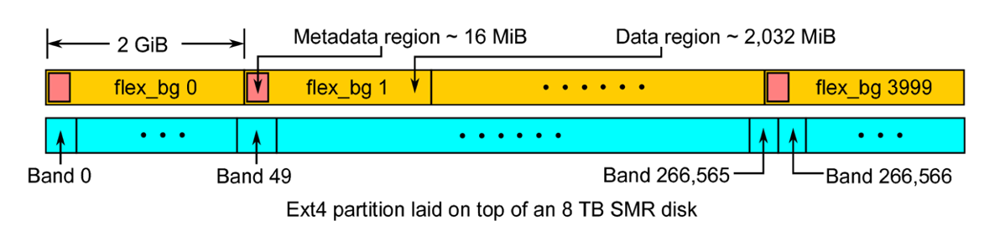

#### 背景：Ext4上的元数据写回

- Ext4使用JBD2记录元数据日志
- 128MB的日志区域
  - JBD2首先将元数据写入日志区域J，标记元数据为脏
  - 脏元数据在日志提交后被写回到其应有位置S
- 这个时候元数据已经写到日志里面了，所以什么时候写回不重要

#### 解决方法：引入Indirection：以LFS形式增加一个元数据缓存

- 以LFS形式维护10GB日志空间作为元数据缓存

1. JBD2首先将元数据写入日志区域*J*，将元数据标记为clean（无需写回）

2. JBD2在内存中的jmap中将*S*映射到*J*

- Indirection: 元数据访问需要通过 jmap 进行一次地址转换
- 日志空间清理
  - 无效的元数据（被新修改覆盖过的元数据）可以直接被回收
  - 对于冷的元数据，可将其写回到Ext4中其原本的位置*S*
  - 热的元数据继续保留在日志中
- 挂载FS时，读取日志，恢复出jmap

## 2. **闪存盘的文件系统**

#### 闪存盘的组织: (NAND) 闪存盘组织结构

- A chip/package
   => 1/2/4 dies
   => 1/2 planes
   => n blocks （块）
   => n pages （页）
   => n cells
   => 1/2/3/4 levels

- 通道（Channel）
  - 控制器可以同时访问的闪存芯片数量
- 多通道（Multi-channel）
  - 低端盘有2或4个通道
  - 高端盘有8或10个通道

#### 闪存盘的性质

- 非对称的读写与擦除操作
  - 页 (page) 是读写单元 (8-16KB)
  - 块 (block) 是擦除单元 (4-8MB)
- Program/Erase cycles
  - 写入前需要先擦除
  - 每个块被擦除的次数是有限的
- 随机访问性能
  - 没有寻道时间
  - 随机访问的速度提升，但仍与顺序访问有一定差距

- 磨损均衡
  - 频繁写入同一个块会造成写穿问题 （比如说是inode, bitmap等元数据区域）
  - 将写入操作均匀的分摊在整个设备
- 多通道
  - 高并行性
- 异质Cell
  - 存储1到4个比特：SLC 、MLC、TLC、 QLC

#### Flash Translation Layer (FTL)

- 逻辑地址到物理地址的转换
  - 对外使用逻辑地址
  - 内部使用物理地址
  - 可软件实现，也可以固件实现
  - 用于垃圾回收、数据迁移、磨损均衡（wear-levelling）等

#### LFS与Flash很相似：

### F2FS文件系统： Flash Friendly File System

#### LFS的问题

##### 1. 递归更新问题

#### 

##### 2. 单一log顺序写入

#### F2FS的改进1：NAT

- 引入一层 indirection：NAT（node地址转换表）
  - NAT：Node Address Table
  - 维护node号到逻辑块号的映射
  - Node号需转换成逻辑块号才能使用
- F2FS中的文件结构
  - 直接node：保存数据块的逻辑块号
  - 间接node：保存node号                （相当于索引块）
  - 数据块：保存数据

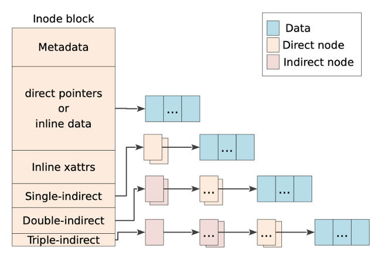

#### F2FS的改进2：多log并行写入

#### 闪存友好的存储布局

- 组织层级
  - Block：4KB，最小的读写单位
  - Segment：2MB
  - Section：多个segment（垃圾回收/GC粒度）
  - Zone：多个section
- 系统元数据（随机写入）
  - 存放在一起：局部性更好
  - CP：检查点
  - SIT：段信息表
  - NAT：node地址转换表
  - SSA：段概要区域
- 数据区（多Log顺序写入）
  - 区分冷/温/热数据
  - 区分文件数据（data segment）与元数据（node segment）

#### 多Log写入

- 按热度将结构分类
  每个类型和热度对应一个log
  默认打开6个log
  用户可进一步配置
- 根据硬件信息可以进一步调整
  调整zone、section大小
  与硬件GC单元对齐等

## 3. **非易失性内存**(NVM)

#### NVDIMM

- 在内存条上加上Flash和超级电容，平时数据在DRAM中；断电后转移到Flash中持久保存
- 容量很难再提升

#### Intel Optane DC Persistent Memory

- 内存接口
- 字节寻址
- 持久保存数据
- 高密度 (512GB/DIMM)
- 需要磨损均衡，但耐磨度比NAND好10倍
- 比DRAM慢十倍以内，比NAND快1000倍

#### 非易失性内存带来的新问题

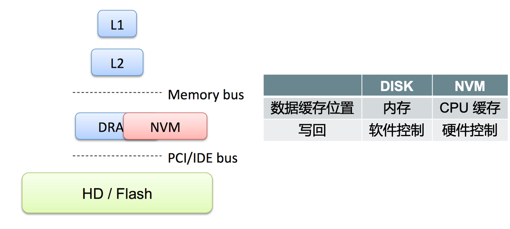

问题：

1. crash之后，CPU里面的缓存的内容的丢失？

2. **内存写入顺序**：Writeback模式的CPU缓存，虽然能提升性能，但会打乱数据写入内存的顺序

   > 回写（Write Back）也被称为延迟写入（Write Behind / Write Deferred）。也就是说，最初数据只在缓存中更新，稍后再更新到内存中。对内存的写入动作会被推迟，直到修改的内容在缓存中即将被另一个缓存块替换。

考虑持久性和一致性，写入顺序很重要：

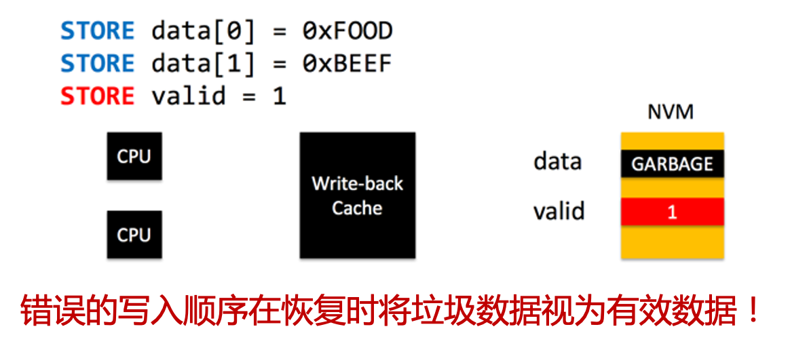

#### solution1：使用CLFLUSH保证顺序

- 使用CLFLUSH指令将数据逐出（Evict）缓存，以保证顺序

- CLFLUSH的缺点

  - 顺序执行，阻塞CPU流水线

  - 会将cacheline无效化（Cache-Line Flush的语义）

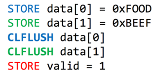

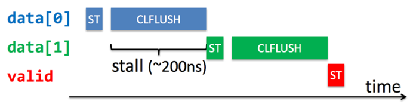

#### improve：Intel x86 拓展指令集

- 新指令：CLFLUSHOPT
  - 可以看做可并行执行的CLFLUSH
  - 需要用 sfence 来保证顺序

- 新指令： CLWB
  - Cache Line Write Back
  - 与CLFLUSHOPT类似，区别在于不会将cacheline无效化

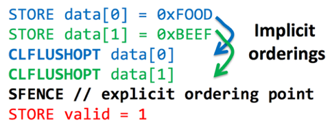

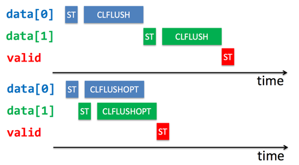

#### 举例：NVM上的写时复制

利用指针转换的原子性保证all-or-nothing

## 4、非易失性内存文件系统

#### 非易失性内存改变存储栈

设备驱动是为了让磁盘看懂指令而服务的
NVM字节寻址所以不要I/O调度

#### 一致性技术与非易失性内存文件系统

- 原子指令：ALL
- 写时复制：BPFS[SOSP ’09], PMFS[EuroSys ’14], NOVA[FAST ’16]
- 日志 (Journaling): PMFS, NOVA
- Log-structured: NOVA
- Soft updates: SoupFS[USENIX ATC ’17]

#### PMFS

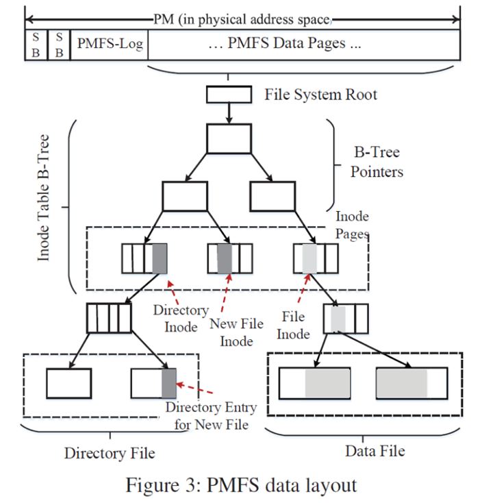

为NVM和体系结构优化: 多种原子更新技术

允许应用直接访问NVM

- DAX mmap

- DAX: Direct Access， 文件mmap时，通过建立页表映射，将数据页映射给应用

  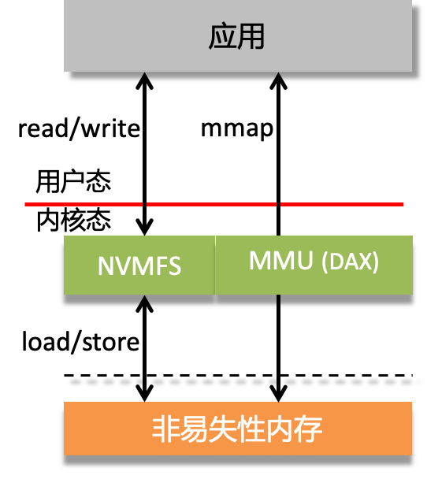

- Wild writes保护

  - 程序Bug产生的wild writes会破坏NVM上的数据

  - Supervisor Mode Access Protection (SMAP) ：防止内核错误地修改用户内存

  - Write windows (PMFS提出) ：挂载时，NVM映射为只读，写入时，x86的CR0.WP临时设置为0，内核可以修改只读映射

​			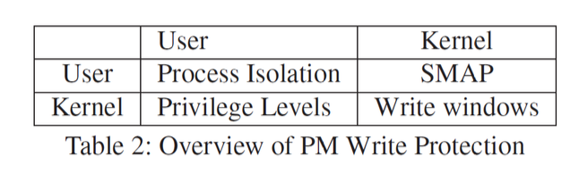

#### 1. PMFS中的一致性保证

#### 2. 拓展的原子指令更新

- 8字节更新
  - CPU原本就支持8字节的原子更新
  - 更新inode的访问时间
- 16字节更新 
  - 使用 cmpxchg16b 指令
  - 同时更新inode中的文件大小和修改时间
- 64字节更新
  - 使用硬件事务内存（HTM）
  - 更新inode中的多个数据