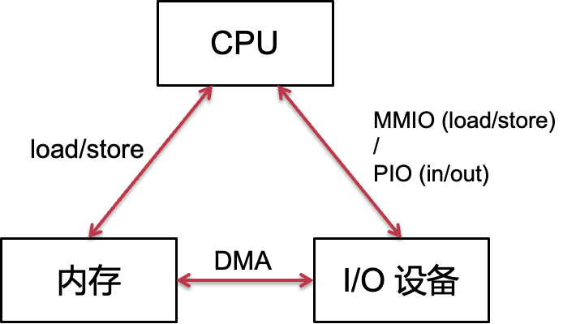
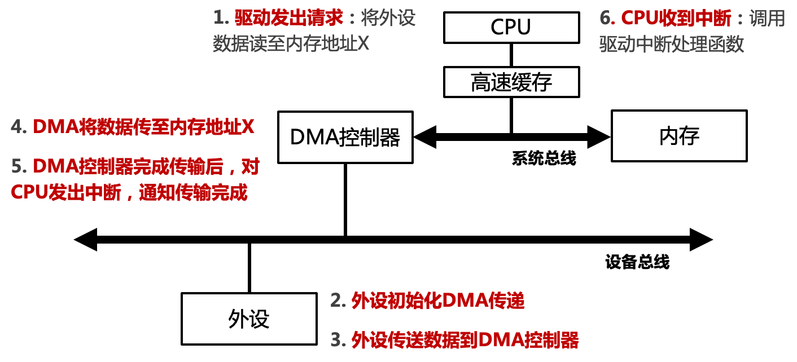

# 19. 设备管理

[toc]

### 操作系统的I/O层次


> 注意，上面的横线不是用户态和内核态的划分，而操作系统和应用程序的分界线


## 1. **认知设备**

#### 计算机系统上的硬件设备很多:

- 种类繁多 
- 规范不同 
- 接口不同 

#### 设备举例：

1. GPIO LED
2. 8042（PS/2 键盘控制器）
3. UART（串口）
4. Flash 闪存
5. Ethernet 网卡


##  2. 设备与CPU的连接

#### 硬件总线：以AMBA为例

物理地址本质上是总线地址

> AHB: Advanced High-performance Bus.        
>
> APB: Advanced Peripheral（外围的）Bus


#### 硬件总线的特点

- 一组电线: 将各个I/O模块连接到一起，包含了地址总线、数据总线和控制总线
- 使用广播: 每个模块都能收到消息
  - 总线地址：标识了预期的接收方
- 仲裁协议
  - 决定哪个模块可以在什么时间收发消息
  - 总线仲裁器：用于选择哪些模块可以使用该总线

#### 同步 VS. 异步

- 同步数据传输
  源（Source）和目标（destination）借助共享时钟进行协作
  例子：DDR内存访问
- 异步数据传输
  源（Source）和目标（destination）借助显式信号进行协作
  例子：对信号的确认（ack）

#### 总线事务

- 源（发送方）获取总线的使用权（具有排他性）
- 源（发送方）将目标（接收方）的地址写到总线上
- 源（发送方）发出 READY 信号，提醒其他模块（广播）
- 目标（接收方）在拷贝完数据后，发出 ACKNOWLEDGE 信号
  - 同步模式下，无需 READY 和 ACKNOWLEDGE，只要在每个时钟周期进行检查即可
- 源（发送方）释放总线


#### 中断线

当中断线的电平升高时，说明发生了中断


## 3. 设备与CPU的交互

#### 硬件设备的接口：设备寄存器


Q： 如何借助设备寄存器完成磁盘读写

1. S1: 把硬盘所有的地址都映射到总线上（这其实是内存的方式，不合理）

2. S2：需要若干寄存器，并没有映射所有的地址

   a. 硬盘块号

   b. 内存对应的位置

   c. 开始的flag

   d. 要写的数据的长度


#### 内存映射 I/O (MMIO)

–将设备寄存器映射到物理地址空间，CPU通过读写设备寄存器操作设备


- 根据物理地址的不同确定是memory, disk或者其他

为了避免编译器寄存器优化，**MMIO地址应使用Volatile关键字**，读写可能有副作用


#### 可编程I/O（Programmable I/O）

- 形式1：MMIO (Memory-mapped I/O)

  - 将设备映射到连续物理内存中
  - 使用内存访问指令（load/store）
  - 行为与内存不完全一样，读写有副作用（需要volatile）
  - 在Arm、RISC-V等架构中使用
  - MMIO的副作用：要在接口层次把寄存器编程内存
    - compiler可能对于地址有误判
    - 打破了store/load的是内存的假设：必须要用volatile

- 形式2：PIO (Port I/O)

  - IO设备具有独立的地址空间
  - 使用专门的PIO指令（ in/out ）
  - 在x86架构中使用

- 特点：

  - 通过CPU in/out 或 load/store 指令

  - 消耗CPU时钟周期和数据量成正比

  - 适合于简单小型的设备

    


#### 直接内存访问（Direct Memory Access, DMA）

- 特点
  - 设备可直接访问总线
  - DMA与内存互相传输数据，传输不需要CPU参与
  - 适合于高吞吐量I/O

- **overview**



- 设备内存访问memory使用的物理地址
  - 缺点：没有权限控制
  - 解决方案：
    - 划分一块专门的内存做DMA（缺点：使用时存在内存的拷贝）
    - I/O设备可以访问任意的地址，但是是提前约定好的地址（缺点：如果I/O设备访问出错，会有问题）
    - 更好的解决方案：IOMMU


#### IOMMU

- 在主板上，让主板上的设备都有虚拟地址的能力
- **避免设备直接使用物理地址访问内存**
  - 设备所使用的地址，由IOMMU翻译为实际的物理地址
  - 广泛应用于虚拟机场景中（允许虚拟机独占某个设备）


#### 思考题：DMA的内存一致性

现代处理器通常带有高速缓存（CPU Cache），当DMA发生时，DMA缓冲区的数据仍在cache中怎么办

解决方法：
方案1：将DMA区域映射为non-cacheable
方案2：由软件负责维护一致性，软件主动刷缓存
部分架构在硬件上保证了DMA一致性，如总线监视技术


## 4. 中断与中断响应

> 设备通知CPU的方式

#### CPU中断处理流程


- 中断适合慢速设备，不适合快速设备
- “执行每条指令后都检查中断请求是否到来”：这个其实是CPU检查引脚电平

#### AArch64的中断分类


#### 多核CPU处理中断**避免中断一次性打断所有核**：ARM 中断控制器——GIC 


GIC(Generic Interrupt Controllers):*接受硬件中断信号，并进行简单处理，通过一定的设置策略，分给对应的*CPU*进行处理*

# 20. 设备管理与I/O子系统


#### ARM 中断控制器——GIC

> GIC(Generic Interrupt Controllers):*接受硬件中断信号，并进行简单处理，通过一定的设置策略，分给对应的*CPU*进行处理。*


- GIC：Generic Interrupt Controller
- 组件1：Distributor
  - 负责全局中断的分发和管理
- 组件2：CPU Interface
  - 类似“门卫”，判断中断是否要发给CPU处理


#### GIC Distributor

- 中断分发器：将当前最高优先级中断转发给对应CPU Interface
- 寄存器：GICD
- 作用：
  - 中断使能
  - 中断优先级
  - 中断分组
  - 中断触发方式
  - 中断的目的core


#### GIC: CPU Interface

- CPU接口：将GICD发送的中断，通过IRQ中断线发给连接到 interface 的核心
- 寄存器：GICC
- 作用：
  - 将中断请求发给CPU
  - 配置中断屏蔽
  - 中断确认（acknowledging an interrupt）
  - 中断完成（indicating completion of an interrupt）
  - 核间中断（Inter-Processor Interrupt，IPI），用于核间通信

> 什么时候需要修改页表：
>
> 什么时候需要flush tlb？
>
> 1. swap，删除进程


#### ARM中断的生命周期

1. Generate：外设发起一个中断
2. Distribute：Distributor对收到的中断源进行仲裁，然后发送给对应的CPU Interface
3. Deliver：CPU Interface将中断传给core
4. Activate：core读 GICC_IAR 寄存器，对中断进行确认
5. Priority drop: core写 GICC_EOIR 寄存器，实现优先级重置
6. Deactivate：core写 GICC_DIR 寄存器，来无效该中断


#### 问题：多个中断同时发生怎么办？

- **中断优先级：**当多个中断同时发生时（NMI、软中断、异常），CPU首先响应高优先级的中断

- ARM Cortex-M 处理器的中断优先级如下所示

| **类型**                        | **优先级（值越低，优先级越高）** |
| ------------------------------- | -------------------------------- |
| 复位（reset）                   | -3                               |
| 不可屏蔽中断（NMI）             | -2                               |
| 硬件故障（Hard  Fault）         | -1                               |
| 系统服务调用（SVcall）          | 可配置                           |
| 调试监控（debug  monitor）      | 可配置                           |
| 系统定时器（SysTick）           | 可配置                           |
| 外部中断（External  Interrupt） | 可配置                           |


#### 中断嵌套

- 中断也能被“中断”
- 在处理当前中断（ISR）时：
  - 更高优先级的中断产生；或者相同优先级的中断产生
- 那么该如何响应？
  - 允许高优先级抢占，同级中断无法抢占
- ARM的FIQ能抢占任意IRQ，FIQ本身不可抢占


#### 如何禁止中断被抢占？

- 中断屏蔽：
  屏蔽全局中断：不再响应任何外设请求
  屏蔽对应中断：只停止对应IRQ的响应

- 屏蔽策略：
  屏蔽全局中断：

  - 系统关键步骤（原子性）

  - 保证任务响应的实时性

  屏蔽对应中断：通常都是这种情况，对系统的整体影响最小


#### 高频中断的问题：活锁

- 网络场景下的中断使用（网卡设备）
  - 当每个网络包到来时都发送中断请求时，OS可能进入活锁
  - 活锁：CPU只顾着响应中断，无法调度用户进程和处理中断发来的数据
- 解决方案：合二为一（中断+轮询），兼顾各方优势
  - 默认使用中断
  - 网络中断发生后，使用轮询处理后续达到的网络包
  - 如果没有更多中断，或轮询中断超过时间限制，则回到中断模式
  - 该方案在Linux网络驱动中称为 NAPI (New API)

#### 在设备端的解决方案：中断合并（Interrupt Coalescing）

- 中断合并：
  - 设备在发送中断前，需要等待一小段时间
  - 在等待期间，其他中断可能也会马上到来，因此将多个中断合并为同一个中断，进而降低频繁中断带来的开销
- 注意：
  - 等待过长时间会导致中断响应时延增加
  - 这是系统中常见的“折衷”（trade-off）


## 2. 案例：Linux的上下半部（中断子系统）

> 中断子系统

#### overview

- 面临问题
  中断处理过程中若运行复杂逻辑，会导致系统失去响应更久
  中断处理时不能调用会导致系统block的函数
- 将中断处理分为两部分
  上半部：尽量快，提高对外设的响应能力
  下半部：将中断的处理推迟完成

#### Top Half：马上做

>  这个时候是关中断的，因此时间要尽可能短

- 最小化公共例程：
  - 保存寄存器、屏蔽中断
  - 恢复寄存器，返回现场
- Top half要做的事情：
  - 将请求放入队列（或设置flag），将其他处理推迟到bottom half
    - 现代处理器中，多个I/O设备共享一个IRQ和中断向量（为啥：IRQ (interupt request) 少，I/O设备多）
    - 多个ISR (interrupt service routines)可以绑定同一向量上
  - 调用每个设备对应的IRQ的ISR 

> 如果在top half执行过程中出现了访问内存页的page fault？
>
> 基本不会出现这种情况，因为内核页基本不会出现page fault；并且top half不允许访问用户态的page，以免发生未知的block

#### Bottom Half：延迟去做

> 这个时候可以慢慢做，因为中断已经被打开了

- 提供可以推迟完成任务的机制

  - softirqs 

  - tasklets  (建立在softirqs之上)

  - 工作队列

  - 内核线程（为什么是内核线程：因为要用到context,对应TCB）

    

- 这些机制都可以被中断

#### 内核线程（Kernel Threads）

- 始终运行在内核态
  - 没有用户空间上下文
  - 和用户进程一样被调度器管理
- 中断线程化*（threaded interrupt handlers）
  - Linux 2.6.30引入
  - 每个中断线程都有自己的上下文


## 3. **设备驱动**

#### overview

- 设备驱动
  - 专门用于操作硬件设备的代码集合
  - 通常由硬件制造商负责提供
  - 驱动程序包含中断处理程序
- 驱动特点
  - 和设备功能高度相关
  - 不同设备间的驱动复杂度差异巨大
  - 是操作系统 bugs 的主要来源


#### 宏内核I/O架构

- 设备驱动在内核态
- 优势：通常性能更好
- 劣势：容错性差
- 中断形式为内核ISR

- 案例：
  Linux、BSD、Windows


#### 微内核I/O架构

- 微内核I/O架构
  - 设备驱动主体在用户态
  - 优势：可靠性和容错性更好
  - 劣势：IPC性能开销
  - 中断为用户态驱动线程
- 案例：
  - 谷歌Fuchsia手机系统
  - ChCore微内核系统


#### 混合I/O架构

- 设备驱动分解为用户态和内核态
- 优势1：驱动开发和Linux内核解耦
- 优势2：允许驱动以闭源形式存在
- 保护硬件厂商的知识产权
- 案例：
  - 谷歌安卓系统：硬件抽象层（HAL）
  - 华为鸿蒙系统：硬件驱动框架（HDF）


#### 安卓的硬件抽象层


#### 设备驱动的复杂性在提高

- 设备的整体趋势：
  - 数量和规模越来越大
  - 更新速度越来越快：驱动代码量在快速增长，复杂度提高
- 驱动开发者的需求：
  - 标准化的数据结构和接口
  - 将驱动开发简化为对数据结构的填充和实现

#### **驱动模型的好处**

- 电源管理：
  - 描述设备在系统中的拓扑结构（树形结构）
  - 保证能正确控制设备的电源，先关闭设备和再关闭总线
- 驱动开发者：
  - 允许同系列设备的驱动代码之间的复用
  - 将设备和驱动联系起来，方便相互索引
- 系统管理员：
  - 帮助用户枚举系统设备，观察设备间拓扑和设备的工作状态

#### 案例：Linux驱动模型（**Linux** **Device** **Driver** **Model** **(LDDM)**


- 支持电源管理与设备的热拔插
- 利用sysfs向用户空间提供系统信息
- 维护内核对象的依赖关系与生命周期，简化开发工作
  - 驱动人员只需告诉内核对象间的依赖关系
  - 启动设备时会自动初始化依赖的对象，直到启动条件满足为止


## 4. I/O子系统

> 设备无关的I/O软件

#### 为什么需要I/O子系统？

- 根据不同需求和场景，出现了大量设备：

  - 通信、存储、智能加速器、人机交互等
  - 数以千计的设备类型，个性千差万别

- 每种设备有自己的协议、规范：

- 设备的异步不可预测性和慢速性：

- 设备的不可靠性（介质失效或传输错误）：

  

#### I/O 子系统的目标

- 提供统一接口，涵盖不同设备：

- 如下代码对各种设备通用：

  ```
  FILE fd = fopen(“/dev/something”,“rw”);	
  for (int i = 0; i < 10; i++) {		fprintf(fd,“Count %d\n”,i);	}	close(fd);
  ```

- 满足I/O硬件管理的共同需求，提供统一抽象

  - 管理硬件资源；隐藏硬件细节


#### 统一抽象——设备文件

- 为应用程序提供的相同的设备抽象：设备文件
- 操作系统将外设细节和协议封装在文件接口的内部
- 复用文件系统接口：open(), read(), write(), close, etc.


#### 设备操作的专用接口：ioctl


#### 设备文件操作与设备驱动函数的对接


#### **设备的逻辑分类**

- Linux设备分类
  - 字符设备（因为没有随机访问，所以没有缓冲区）
  - 块设备
  - 网络设备


##### 1、字符设备（cdev）

- 例子：
  - 键盘、鼠标、串口、打印机等
  - 大多数伪设备：/dev/null, /dev/zero, /dev/random
- 访问模式：
  - 顺序访问，每次读取一个字符
  - 调用驱动程序和设备直接交互
- 文件抽象：
  - open(), read(), write(), close()

##### 2、块设备（blkdev）

- 例子：
  - 磁盘、U盘、闪存等（以存储设备为主）
- 访问模式：
  - 随机访问，以块为单位进行寻址（如512B、4KB不等）
  - 通常为块设备增加一层缓冲，避免频繁读写I/O导致的慢速
- 通常使用内存抽象：
  - 内存映射文件(Memory-Mapped File)：mmap()访问块设备
    - 可减少系统调用次数
      可减少数据的拷贝次数
  - 提供文件形式接口和原始I/O接口（绕过缓冲）
  - **内存映射文件：mmap访问磁盘**


##### 3、网络设备（netdev）

- 例子：
  - 以太网、WiFi、蓝牙等（以通信设备为主）
- 访问模式：
  - 面向格式化报文的收发
  - 在驱动层之上维护多种协议，支持不同策略
- 套接字抽象：
  - socket(), send(), recv(), close(), etc.

##### **设备逻辑分类小结**

- 设备分类：
  - 字符设备（cdev）：键盘、鼠标、串口、打印机等
  - 块设备（blkdev）：磁盘、U盘、闪存等存储设备
  - 网络设备（netdev）：以太网、WiFi、蓝牙等通信设备
- 设备接口：
  - 字符设备： read(), write()
  - 块设备： read(), write(), lseek(), mmap()
  - 网络设备：socket(), send(), recv()
    - 同时兼容文件接口（也可以用read(), write()读写socket）


#### **设备的缓冲管理**

**单缓冲区**

- 问题：
  - 读写性能不匹配：慢速的存储设备 vs. 高速的CPU
  - 读写粒度不匹配：小数据的访问存在读写放大的问题
- 解决方法：
  - 开辟内存缓冲区，避免频繁读写I/O
  - 单缓冲区例子：Linux的page cache


##### 双缓冲区

- 维护两个缓冲区，轮流使用
- 第一个缓冲区被填满但没被读取前，使用第二个缓冲区填充数据
- 双缓冲区例子：显存刷新，防止屏幕内容出现闪烁或撕裂
  - 前置缓冲区被读取后，通过“交换”（swap）将前置和后置身份互换
- 游戏中甚至启用三重缓冲


##### 环形缓冲区

- 容许更多缓冲区存在，提高I/O带宽
- 组成：一段连续内存区域+两个指针，读写时自动推进指针
  - 读指针：指向有效数据区域的开始地址
  - 写指针：指向下一个空闲区域的开始地址
- 环形缓冲区例子：网卡DMA缓冲区、NVMe存储的命令队列


#### 思考题：缓冲区是否总能提高性能？

缓冲区意味着数据的多次拷贝，使用过多反而损伤性能

#### I/O模型

##### 阻塞I/O模型


##### 非阻塞I/O模型


##### 异步I/O模型


##### I/O多路复用模型


##### I/O模型小节

- 阻塞I/O：一直等待
  - 进程请求读数据不得，将其挂起，直到数据来了再将其唤醒
  - 进程请求写数据不得，将其挂起，直到设备准备好了再将其唤醒
- 非阻塞I/O：不等待
  - 读写请求后直接返回（可能读不到数据或者写失败）
- 异步I/O：稍后再来
  - 等读写请求成功后再通知用户
  - 用户执行并不停滞（类似DMA之于CPU）
- I/O多路复用：同时监听多个请求，只要有一个就绪就不再等待


## 5、I/O库

> 应用程序员视角

- 以共享库的形式，和应用程序直接链接
- 简化应用程序I/O开发的复杂度
- 提供更好的性能和更灵活的I/O管理能力

- 例子：
  glibc：提供用户态I/O缓冲区管理
  Linux AIO和io_uring：支持异步I/O


#### 案例：glibc的buffer I/O

- fread()/fwrite()和read()/write() 
  - 前者是I/O库接口（函数调用），后者是VFS接口（系统调用）
  - 使用用户态缓冲区，减少模式切换次数
- 缓冲模式配置：
  - 全缓冲（_IOFBF）：缓冲区满了才flush缓冲区
  - 行缓冲（_IOLBF）：遇到换行符就flush缓冲区
  - 无缓冲（_IONBF）：和直接调用read()/write()效果一样


## 6、设备管理的三种方式

#### 设备管理主要的三类方式

- 第一类（内核直管）：静态I/O资源分配+向上提供文件接口
  - 代表设备：Console（CGA+键盘）
  - 特征：中断号等固定，内核直接提供文件接口（无需外部驱动）
- 第二类（设备驱动）：动态I/O资源分配+向上提供文件接口
  - 代表设备：PCI、USB，如硬盘、网卡等
  - 特征：中断号等动态分配，内核提供驱动框架，设备制造商提供驱动模块
- 第三类（用户态库）：动态I/O资源分配+向上提供内存接口
  - 代表设备：智能网卡、智能SSD
  - 特征：内核直接将设备暴露给用户态，设备制造商提供用户态库,不需要syscall

#### OS的设备管理：对上与对下

- 向下对接设备：分配必要的I/O资源
  - 中断号 + 虚拟地址映射空间
    - 静态绑定：由硬件规范确定
    - 动态分配：动态扫描后再分配
- 对上提供接口：应用使用设备的方式
  - 文件接口：通过系统调用
    - open、read、write、close、ioctl等
  - 内存接口：寄存器直接映射到用户态虚拟内存空间
    - 无需系统调用，应用可直接访问设备


#### 第一类：内核直管

- 以Console为例
  - 包含设备：显示器（CGA）+键盘
- I/O资源静态绑定
  - 中断号（即异常向量表）
  - 寄存器所映射的虚拟内存地址
- 文件接口
  - read：读取键盘输入，通常以行为单位
  - write：向显示器输出字符并显示


#### 第二类：设备驱动

- 操作系统的设备驱动框架

  - 提供标准化的数据结构和接口
  - 将驱动开发简化为对数据结构的填充和实现
  - 方便操作系统统一组织和管理设备

- 操作系统为驱动提供的辅助功能

  - VFS（对上提供文件接口，可复用权限检查等逻辑）
  - 与设备类型相关的框架（如：块设备层、网络协议栈等）
  - 模块动态插入框架（如：Linux的module插入）
  - 中断处理框架（如：Linux的 top half + bottom half）

- 宏内核vs微内核的驱动

  - 宏内核：驱动在内核态
    优势：性能更好
    劣势：容错性差

    

  - 微内核：驱动在用户态
    优势：可靠性好
    劣势：性能开销（IPC）


#### **第三类：用户态库**

- 操作系统内核负责：
  - 将设备寄存器映射到用户可访问的虚拟地址空间
  - 通常只允许某一个应用访问该设备，防止发生冲突
- 用户态库负责：
  - 100%控制硬件设备，并向上或对外提供服务
  - 通过轮询访问设备（问：为何不用中断？因为是用户态）
    - 通常需要独占一个CPU，适用于高速网卡
  - 典型例子：Intel DPDK（网卡）、SPDK（存储）
  - 通常用于高性能场景（问：为什么性能高？）

##### 案例：io_uring (Linux 5.1)

- 问题：频繁的读写I/O请求导致高频模式切换开销
- 提供“提交队列”和“完成队列”两个环形缓冲区：用户程序和内核共享队列，减少拷贝；允许批量处理多个I/O请求，减少切换
- 支持轮询模式，相比于异步通知机制有更低时延

