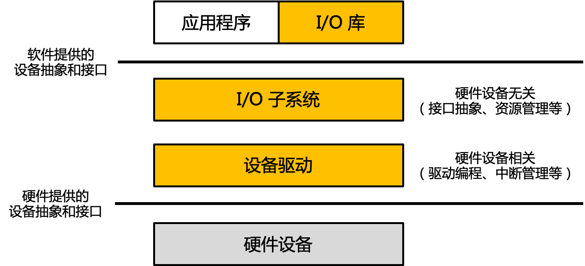
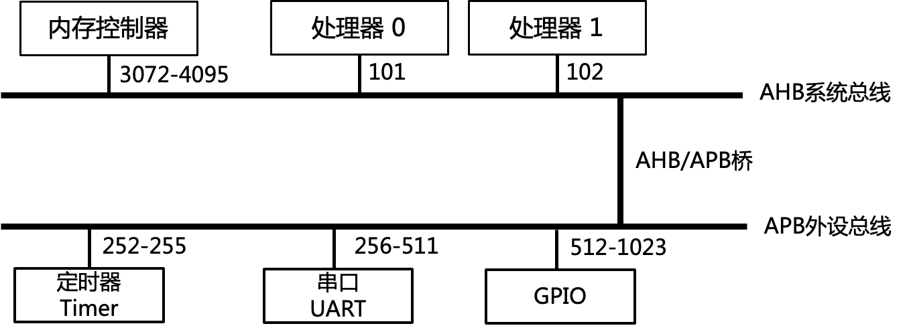
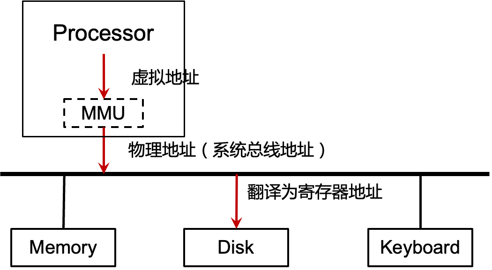
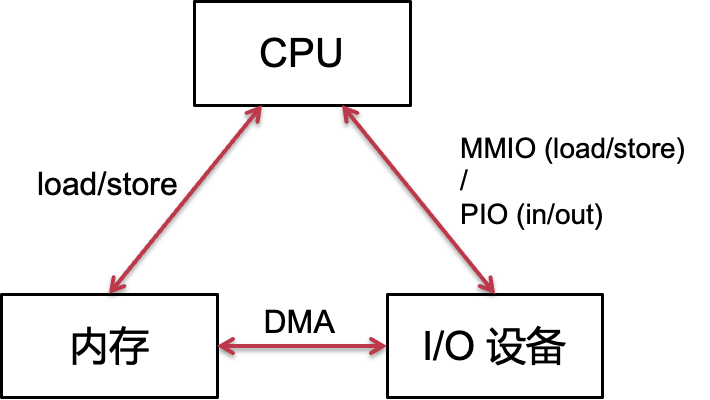
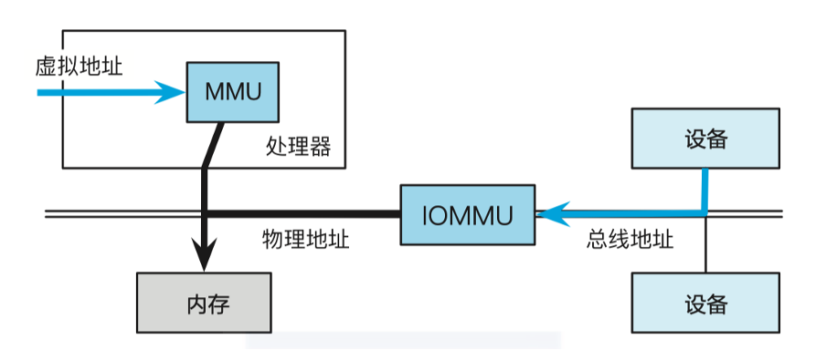
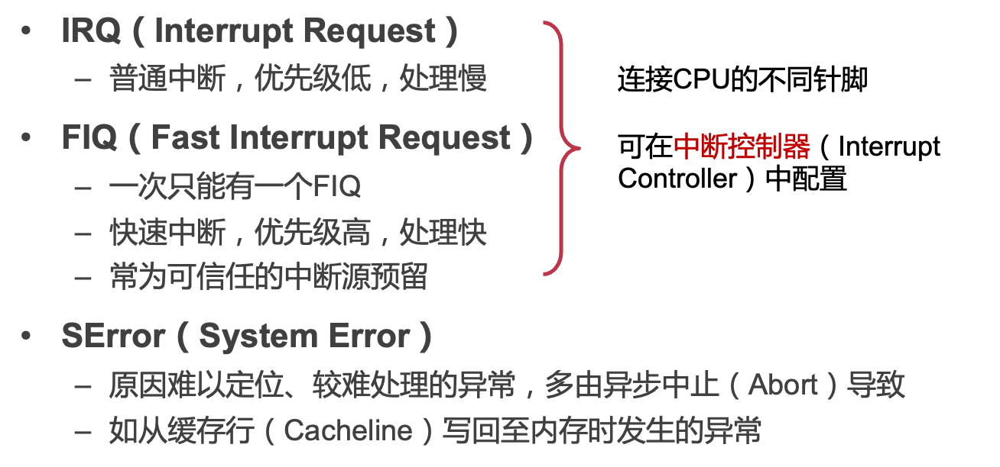
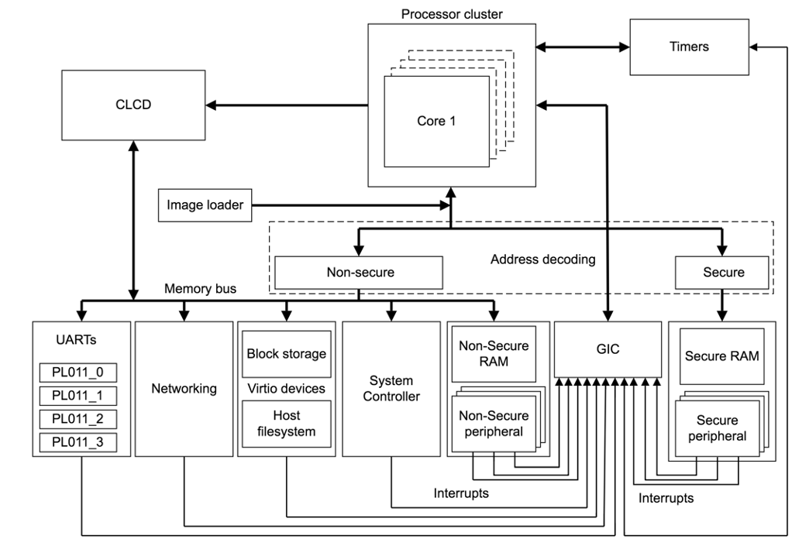

# 19. 设备管理

[toc]

### 操作系统的I/O层次

> 注意，上面的横线不是用户态和内核态的划分，而操作系统和应用程序的分界线

## 1. **认知设备**

#### 计算机系统上的硬件设备很多:

- 种类繁多 
- 规范不同 
- 接口不同 

#### 设备举例：

1. GPIO LED
2. 8042（PS/2 键盘控制器）
3. UART（串口）
4. Flash 闪存
5. Ethernet 网卡

##  2. 设备与CPU的连接

#### 硬件总线：以AMBA为例

物理地址本质上是总线地址

> AHB: Advanced High-performance Bus.        
>
> APB: Advanced Peripheral（外围的）Bus

#### 硬件总线的特点

- 一组电线: 将各个I/O模块连接到一起，包含了地址总线、数据总线和控制总线
- 使用广播: 每个模块都能收到消息
  - 总线地址：标识了预期的接收方
- 仲裁协议
  - 决定哪个模块可以在什么时间收发消息
  - 总线仲裁器：用于选择哪些模块可以使用该总线

#### 同步 VS. 异步

- 同步数据传输
  源（Source）和目标（destination）借助共享时钟进行协作
  例子：DDR内存访问
- 异步数据传输
  源（Source）和目标（destination）借助显式信号进行协作
  例子：对信号的确认（ack）

#### 总线事务

- 源（发送方）获取总线的使用权（具有排他性）
- 源（发送方）将目标（接收方）的地址写到总线上
- 源（发送方）发出 READY 信号，提醒其他模块（广播）
- 目标（接收方）在拷贝完数据后，发出 ACKNOWLEDGE 信号
  - 同步模式下，无需 READY 和 ACKNOWLEDGE，只要在每个时钟周期进行检查即可
- 源（发送方）释放总线

#### 中断线

当中断线的电平升高时，说明发生了中断

## 3. 设备与CPU的交互

#### 硬件设备的接口：设备寄存器

Q： 如何借助设备寄存器完成磁盘读写

1. S1: 把硬盘所有的地址都映射到总线上（这其实是内存的方式，不合理）

2. S2：需要若干寄存器，并没有映射所有的地址

   a. 硬盘块号

   b. 内存对应的位置

   c. 开始的flag

   d. 要写的数据的长度

#### 内存映射 I/O (MMIO)

–将设备寄存器映射到物理地址空间，CPU通过读写设备寄存器操作设备

- 根据物理地址的不同确定是memory, disk或者其他

为了避免编译器寄存器优化，**MMIO地址应使用Volatile关键字**，读写可能有副作用

#### 可编程I/O（Programmable I/O）

- 形式1：MMIO (Memory-mapped I/O)
  - 将设备映射到连续物理内存中
  - 使用内存访问指令（load/store）
  - 行为与内存不完全一样，读写有副作用（需要volatile）
  - 在Arm、RISC-V等架构中使用
  - MMIO的副作用：要在接口层次把寄存器编程内存
    - compiler可能对于地址有误判
    - 打破了store/load的是内存的假设：必须要用volatile
  
- 形式2：PIO (Port I/O)
  - IO设备具有独立的地址空间
  - 使用专门的PIO指令（ in/out ）
  - 在x86架构中使用

- 特点：

  - 通过CPU in/out 或 load/store 指令

  - 消耗CPU时钟周期和数据量成正比

  - 适合于简单小型的设备
  
    

#### 直接内存访问（Direct Memory Access, DMA）

- 特点
  - 设备可直接访问总线
  - DMA与内存互相传输数据，传输不需要CPU参与
  - 适合于高吞吐量I/O

- **overview**

- 设备内存访问memory使用的物理地址
  - 缺点：没有权限控制
  - 解决方案：
    - 划分一块专门的内存做DMA（缺点：使用时存在内存的拷贝）
    - I/O设备可以访问任意的地址，但是是提前约定好的地址（缺点：如果I/O设备访问出错，会有问题）
    - 更好的解决方案：IOMMU

#### IOMMU

- 在主板上，让主板上的设备都有虚拟地址的能力
- **避免设备直接使用物理地址访问内存**
  - 设备所使用的地址，由IOMMU翻译为实际的物理地址
  - 广泛应用于虚拟机场景中（允许虚拟机独占某个设备）

#### 思考题：DMA的内存一致性

现代处理器通常带有高速缓存（CPU Cache），当DMA发生时，DMA缓冲区的数据仍在cache中怎么办

解决方法：
方案1：将DMA区域映射为non-cacheable
方案2：由软件负责维护一致性，软件主动刷缓存
部分架构在硬件上保证了DMA一致性，如总线监视技术

## 4. 中断与中断响应

> 设备通知CPU的方式

#### CPU中断处理流程

- 中断适合慢速设备，不适合快速设备
- “执行每条指令后都检查中断请求是否到来”：这个其实是CPU检查引脚电平

#### AArch64的中断分类

#### 多核CPU处理中断**避免中断一次性打断所有核**：ARM 中断控制器——GIC 

GIC(Generic Interrupt Controllers):*接受硬件中断信号，并进行简单处理，通过一定的设置策略，分给对应的*CPU*进行处理*
