# 21. 系统虚拟化

[toc]

#### 系统虚拟化是云计算的核心支撑技术

- 新引入的一个软件层
- 上层是操作系统（虚拟机）
- 底层硬件与上层软件解耦
- 上层软件可在不同硬件之间切换


#### 虚拟化带来的优势

##### 服务器整合：提高资源利用率

- 单个物理机资源利用率低: CPU利用率通常仅<20%
- 利用系统虚拟化进行资源整合: 一台物理机同时运行多台虚拟机
- 显著提升物理机资源利用率
- 显著降低云服务提供商的成本

##### 方便程序开发

- 调试操作系统
  - 单步调试操作系统
  - 查看当前虚拟硬件的状态
    - 寄存器中的值是否正确
    - 内存映射是否正确
  - 随时修改虚拟硬件的状态
- 测试应用程序的兼容性
  - 可以在一台物理机上同时运行在不同的操作系统
  - 测试应用程序在不同操作系统上的兼容性

##### 简化服务器管理

- 通过软件接口管理虚拟机
  - 创建、开机、关机、销毁
  - 方便高效
- 虚拟机热迁移
  - 方便物理机器的维护和升级


## 2、什么是系统虚拟化?

#### 2.1 操作系统中的接口层次: ISA

- ISA层（Instruction Set Architecture）
- 区分硬件和软件
- 用户ISA
  - 用户态和内核态程序都可以使用
  - mov x0, sp
  - add x0, x0, #1
  - 如果用户想要调用系统的资源，system
- 系统ISA
  - 只有内核态程序可以使用
  - msr vbar_el1, x0


#### 2.2 操作系统中的接口层次: ABI

- Application Binary Interface

- 提供操作系统服务或硬件功能

- 包含用户ISA和系统调用

  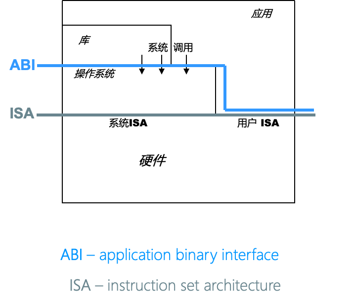

#### 2.3 操作系统中的接口层次: API

- Application Programming Interface
- 不同用户态库提供的接口
- 包含库的接口和用户ISA
- UNIX环境中的clib: 支持UNIX/C编程语言


#### example：这些程序用了哪层接口

- Hello world（API）： API
- Web game：API
- Dota（ABI）
- Office 2016：ABI: underlying is OS
- Windows 10（ISA）
- Java applications（API）
- ChCore（ISA）


> ISA 提供了操作系统和Machine之间的界限

#### **虚拟机和虚拟机监控器**

虚拟机监控器 (VMM/Hypervisor)：向上层虚拟机暴露其所需要的ISA，可同时运行多台虚拟机 (VM)

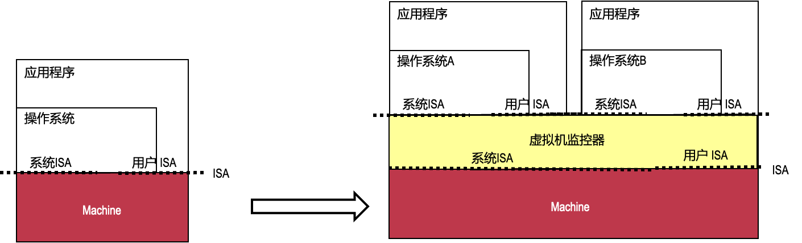


#### 高效系统虚拟化的三个特性

- 为虚拟机内程序提供与该程序原先执行的硬件完全一样的接口
- 虚拟机只比在无虚拟化的情况下性能略差一点 
- 虚拟机监控器控制所有物理资源 


## 3. 虚拟机监控器的分类

#### Type-1虚拟机监控器: VMM直接运行在硬件之上

- 充当操作系统的角色
- 直接管理所有物理资源：实现调度、内存管理、驱动等功能
- 性能损失较少，例如Xen, VMware ESX Server

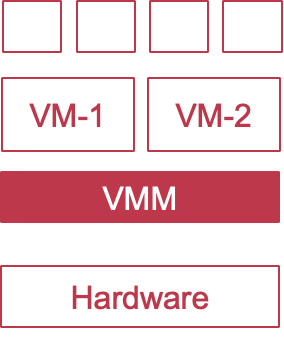

#### Type-2虚拟机监控器（基于Host OS）: VMM依托于主机操作系统

- 主机操作系统管理物理资源
- 虚拟机监控器以进程/内核模块的形态运行
- 易于实现和安装, 例如：QEMU/KVM


#### Type-2的优势

- 在已有的操作系统之上将虚拟机当做应用运行
- 复用主机操作系统的大部分功能
  - 文件系统
  - 驱动程序
  - 处理器调度
  - 物理内存管理


## 3. 如何实现系统虚拟化?

#### 系统ISA：操作系统运行环境

- 读写敏感寄存器: sctrl_el1、ttbr0_el1/ttbr1_el1…
- 控制处理器行为: 例如: WFI (陷入低功耗状态)
- 控制虚拟/物理内存: 打开、配置、安装页表
- 控制外设: DMA、中断


#### 系统虚拟化的流程：Trap & Emulate

- 第一步（Trap）
  - 捕捉所有系统ISA并陷入
- 第二步（Emulate）
  - 由具体指令实现相应虚拟化
    - 控制虚拟处理器行为
    - 控制虚拟内存行为
    - 控制虚拟设备行为
- 第三步
  - 回到虚拟机继续执行


#### 系统虚拟化技术

- 处理器虚拟化
  - 捕捉系统ISA
  - 控制虚拟处理器的行为
- 内存虚拟化
  - 提供“假”物理内存的抽象
- 设备虚拟化
  - 提供虚拟的I/O设备


#### 虚拟化：一种直接的实现方法

- 把虚拟机当做应用程序
  - 将虚拟机监控器运行在EL1
  - 将客户操作系统和其上的进程都运行在EL0
  - 当操作系统执行系统ISA指令时下陷
    - 写入TTBR0_EL1
    - 执行WFI指令
    - …


### 虚拟化功能：迭代演进、分步理解

#### 第一版：支持只有内核态的虚拟机

- VM的能力
  - 只支持一个VM
  - 没有内核态与用户态的切换
  - 只有内核态，且仅运行用户ISA的指令（与用户态没有区别）
- VMM的实现
  - 处理时钟中断造成的VM Exit

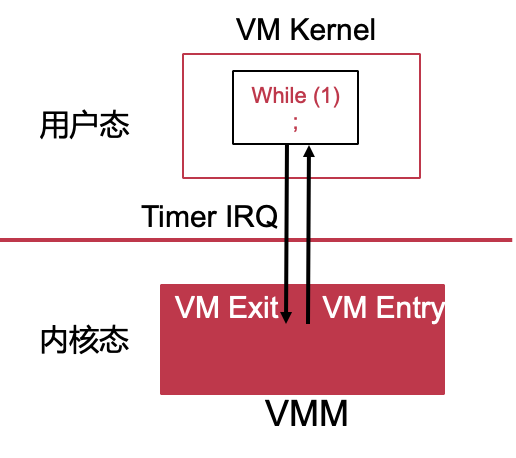

#### 第二版：虚拟机内部支持时钟中断

- VM的能力

  - 设置irq_handler
  - 开关时钟中断 (irq_bit)
  - 运行时钟中断处理函数

- VMM的实现

  - 捕捉VM对irq_handler的修改
  - 捕捉VM对irq_bit的修改
  - 根据irq_bit决定插入虚拟时钟中断vIRQ并调用irq_handler

  需要多次context save/restore

  - 进入VMM
  - VMM进入用户态的handler
  - 处理完之后回到VMM
  - 从VMM回到最初的用户执行


#### 第三版：虚拟机内支持运行单一用户态线程

- VM的能力
  - 虚拟机包含内核态与用户态
  - 用户态运行一个用户态线程
    - U-Thread
  - 用户态线程可调用内核syscall
  - 用户态线程可被时钟中断打断
- VMM的实现
  - 捕捉并转发U-Thread系统调用syscall
  - 转发syscall至VM内核
  - 捕捉并转发U-Thread执行时的时钟中断


#### 第四版：虚拟机内部支持多个用户态线程

- VM的能力
  - 用户态运行多个用户态线程
  - 内核可调度用户态线程
- VMM的实现
  - 与第三版相同


> 思考：Fork bomb是否会影响VMM？
>
> 不会，因为VVM不关心虚拟机内部线程的调度,只是给VM分配一定的资源


#### 第五版：支持多个虚拟机间的分时复用

- VM的能力
  - 支持多个VM
- VMM的实现
  - 每个VM对应一个内核线程
  - 维护VM_runqueue队列:每个元素对应一个VM的运行状态
  - 由VMM实现VM间切换:保存和恢复VM寄存器

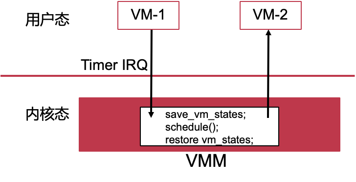

#### 第六版：VMM支持多个物理CPU

- VM的能力
  - 与第五版相同
- VMM的实现（基于第五版）
  - 为每个pCPU维护不同的VM_runqueue，VM_runqueue保存VM的context

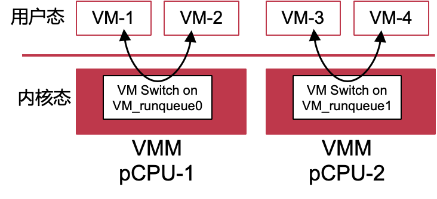

#### 第七版：虚拟机支持多个虚拟CPU

- VM的能力（与第六版的区别）
  - 虚拟机有多个Virtual CPU (vCPU)
- VMM的实现
  - 在VM_runqueue中标记出VM和vCPU的类型，在VM_runqueue保存vCPU的context


- vCPU本质上就是thread
- 如果这个时候vCPU持有spin lock，这个时候vCPU被调度走，这个时候等待拿锁的人需要等待的时候会相比非虚拟化的时候的时间更长

|        | **用户态** **ISA** | **时钟中断** | **用户线程** | **多用户线程** | **多** **虚拟机** | **多物理** **CPU** | **多虚拟** **CPU** |
| ------ | ------------------ | ------------ | ------------ | -------------- | ----------------- | ------------------ | ------------------ |
| 版本一 | √                  |              |              |                |                   |                    |                    |
| 版本二 | √                  | √            |              |                |                   |                    |                    |
| 版本三 | √                  | √            | √            |                |                   |                    |                    |
| 版本四 | √                  | √            | √            | √              |                   |                    |                    |
| 版本五 | √                  | √            | √            | √              | √                 |                    |                    |
| 版本六 | √                  | √            | √            | √              | √                 | √                  |                    |
| 版本七 | √                  | √            | √            | √              | √                 | √                  | √                  |

# 22. 处理器虚拟化

#### ARM不是严格的可虚拟化架构

- 敏感指令
  - 读写特殊寄存器或更改处理器状态
  - 读写敏感内存：例如访问未映射内存、写入只读内存
  - I/O指令
- 特权指令
  - 在用户态执行会触发异常，并陷入内核态

- 在ARM中：不是所有敏感指令都属于特权指令
  - 例子: CPSID/CPSIE指令
    - CPSID和CPSIE分别可以关闭和打开中断
    - 内核态执行：PSTATE.{A, I, F} 可以被CPS指令修改
    - 在用户态执行：CPS 被当做NOP指令，不产生任何效果
    - 不是特权指令

### 如何处理这些不会下陷的敏感指令？

#### 方法1：解释执行

- 使用软件方法一条条对虚拟机代码进行模拟

  - 不区分敏感指令还是其他指令
  - 没有虚拟机指令直接在硬件上执行

- 使用内存维护虚拟机状态

  - 例如：使用uint64_t x[30]数组保存所有通用寄存器的值

  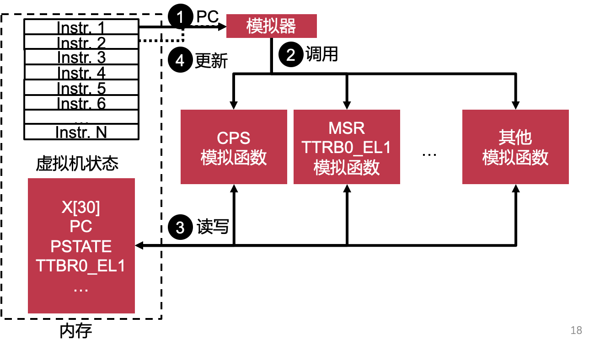

- 示例代码：

  ```c
  void CPU_Run(void)
  {
     while (1) {
        inst = Fetch(CPUState.PC);
  
        CPUState.PC += 4;
  
        switch (inst) {
        case ADD:
           CPUState.GPR[rd] = GPR[rn] + GPR[rm];
           break;
        …
        case CLI:
           CPU_CLI(); break;
        case STI:
           CPU_STI(); break;
        }
  
        if (CPUState.IRQ && CPUState.IE) {
           CPUState.IE = 0;
           CPU_Vector(EXC_INT);
        }
     }
  }
  void CPU_CLI(void)
  {
     CPUState.IE = 0;
  }
  
  
  void CPU_STI(void)
  {
     CPUState.IE = 1;
  }
  
  
  void CPU_Vector(int exc)
  {
     CPUState.LR = CPUState.PC;
     CPUState.PC = disTab[exc];
  }
  
  ```

- **解释执行的优缺点**

  - 优点：

    解决了敏感函数不下陷的问题
    可以模拟不同ISA的虚拟机
    易于实现、复杂度低

  - 缺点：
    非常慢：任何一条虚拟机指令都会转换成多条模拟指令

#### 方法2：二进制翻译

- 提出两个加速技术

  - 在执行前批量翻译虚拟机指令
  - 缓存已翻译完成的指令

- 使用基本块(Basic Block)的翻译粒度（为什么?）

  - 每一个基本块被翻译完后叫代码补丁

  

二进制翻译举例：


实际上是把敏感指令换成对应的函数，如果想要对于性能有优化，将函数展开

- **特点**
  - 优点：
    - 相比前一种方法更快
  - **缺点**
    - 不能处理自修改的代码(Self-modifying Code)
    - 中断插入粒度变大
      模拟执行可以在任意指令位置插入虚拟中断
      二进制翻译时只能在基本块边界插入虚拟中断（在basic block执行的过程中不会通知hypervisor）

> 动态二进制转换用于虚拟化CPU，方法是将潜在危险（或不可虚拟化）的指令序列逐一转换为安全指令序列。
>
> 它的工作原理是这样的：
>
> 1. 监视器检查下一个指令序列。指令序列通常被定义为下一个基本块，即直到下一个控制传输指令（如分支）的所有指令。可能有理由提前结束序列或越过分支，但现在让我们假设我们去下一个分支。
>
> 2. 每条指令都被翻译，翻译被复制到翻译缓存中。
>
> 3. 说明翻译如下：
>
> - 没有问题的说明可以修改后复制到翻译缓存中。我们称这些为“ident”翻译。
>
> - 一些简单的危险指令可以转换为简短的序列仿真代码。此代码直接放入翻译缓存中。我们称之为“内联”翻译。一个例子是修改中断启用标志。
> - 其他危险的指令需要通过监视器中的仿真代码来执行。对于这些说明，对显示器进行呼叫。这些被称为“呼唤”。这方面的一个例子是对页面表基础的更改。
> - 结束基本块的分支需要调用。
>
> 4. 监视器现在可以使用硬件寄存器中的虚拟寄存器跳转到翻译的基本块的开头。
>
> 因此，危险的指令可以是特权指令、不可虚拟化指令、控制流、内存访问。

#### 方法3：半虚拟化(**Para-virtualization**)

- 协同设计
  - 让VMM提供接口给虚拟机，称为Hypercall
  - 修改操作系统源码，让其主动调用VMM接口
- Hypercall可以理解为VMM提供的系统调用
  - 在ARM中是HVC指令
- 将所有不引起下陷的敏感指令替换成超级调用

- **优缺点**:
  - 对于操作系统的小修改，对于性能有很大的提高
  - 有batch的思想，多次操作一次性实现
  - 优点：
    解决了敏感函数不下陷的问题
    协同设计的思想可以提升某些场景下的系统性能, I/O等场景
  - 缺点：
    需要修改操作系统代码，难以用于闭源系统
    即使是开源系统，也难以同时在不同版本中实现

#### 方法4：硬件虚拟化（改硬件）

- x86和ARM都引入了全新的虚拟化特权级
- x86引入了root模式和non-root模式
  - Intel推出了VT-x硬件虚拟化扩展
  - Root模式是最高特权级别，控制物理资源
  - VMM运行在root模式，虚拟机运行在non-root模式
  - 两个模式内都有4个特权级别：Ring0~Ring3
- ARM引入了EL2
  - VMM运行在EL2
  - EL2是最高特权级别，控制物理资源
  - VMM的操作系统和应用程序分别运行在EL1和EL0


## 2、Intel VT-x

#### VT-x的处理器虚拟化


Ring-3:用户态，Ring-0:内核态

|        | Root(Visor) | Non Root(VM) |
| ------ | ----------- | ------------ |
| User   | Tools       | Guest App    |
| Kernel | VMM         | Guest OS     |

- 优化： no-root kernel配置页表，不需要通知VMM


#### Virtual Machine Control Structure (VMCS)

- VMM提供给硬件的内存页（4KB）
  - 记录与当前VM运行相关的所有状态
- VM Entry
  - 硬件自动将当前CPU中的VMM状态保存至VMCS
  - 硬件硬件自动从VMCS中加载VM状态至CPU中
- VM Exit
  - 硬件自动将当前CPU中的VM状态保存至VMCS
  - 硬件自动从VMCS加载VMM状态至CPU中


#### VT-x VMCS的内容

**包含6个部分**

- Guest-state area: 发生VM exit时，CPU的状态会被硬件自动保存至该区域；发生VM Entry时，硬件自动从该区域加载状态至CPU中
- Host-state area：发生VM exit时，硬件自动从该区域加载状态至CPU中；发生VM Entry时，CPU的状态会被自动保存至该区域
- VM-execution control fields： 控制Non-root模式中虚拟机的行为
  - syscall一般Guest OS直接可以解决，设置相应的bit可以使得syscall先到hypervisor
- VM-exit control fields：控制VM exit的行为
- VM-entry control fields：控制VM entry的行为
- VM-exit information fields：VM Exit的原因和相关信息（只读区域）


#### VT-x的执行过程

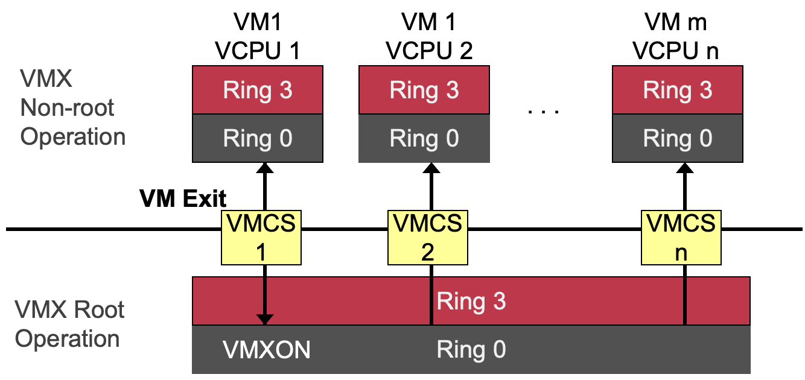

> Question: 在8个物理核，运行10台虚拟机，每台虚拟机上运行4个vCPU,需要多少VMCS?
>
> 一共需要40个，因为VMCS是为vCPU服务的

#### x86中的VM Entry和VM Exit

- VM Entry
  - 从VMM进入VM
  - 从Root模式切换到Non-root模式
  - 第一次启动虚拟机时使用VMLAUNCH指令
  - 后续的VM Entry使用VMRESUME指令
- VM Exit
  - 从VM回到VMM
  - 从Non-root模式切换到Root模式
  - 虚拟机执行敏感指令或发生事件(如外部中断)


## 3. ARM的虚拟化技术

#### Overview

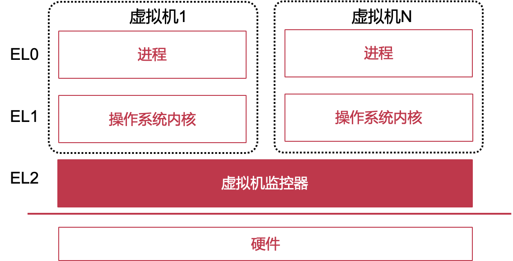

- 优点：将VM和hype visor的寄存器分开，不需要用VMCS保存寄存器

> 思考题2：ARM中没有VMCS，对于VMM的设计和实现来说有什么优缺点？
>
> 需要一个host OS来帮助完成一些功能，因此在使用host OS的时候，需要从el1—>el2->el1

#### ARM的VM Entry和VM Exit

- VM Entry
  - 使用**ERET**指令从VMM进入VM
  - 在进入VM之前，VMM需要主动加载VM状态
    - VM内状态：通用寄存器、系统寄存器、
    - VM的控制状态：HCR_EL2、VTTBR_EL2等
- VM Exit
  - 虚拟机执行敏感指令或收到中断等
  - 以Exception、IRQ、FIQ的形式回到VMM
    - 调用VMM记录在vbar_el2中的相关处理函数
  - 下陷第一步：VMM主动保存所有VM的状态

> 这里是否还是需要保存寄存器？
>
> 如果只有一个虚拟机，那么不需要保存；如果有多台虚拟机，那么因为有context switch，需要保存状态


#### ARM硬件虚拟化的新功能

- ARM中没有VMCS
- VM能直接控制EL1和EL0的状态
  - 自由地修改PSTATE(VMM不需要捕捉CPS指令)
  - 可以读写TTBR0_EL1/SCTRL_EL1/TCR_EL1等寄存器
- VM Exit时VMM仍然可以直接访问VM的EL0和EL1寄存器

> 思考题1：为什么ARM中可以不需要VMCS？
>
> 在ARM架构中，虚拟机可以通过访问虚拟化扩展提供的寄存器和功能来与VMM进行交互。这些寄存器提供了访问虚拟机状态所需的信息，例如虚拟机的控制寄存器、虚拟中断控制器等。因此，在ARM架构中，并不需要像x86架构中的VMCS那样使用中央数据结构来管理虚拟机的状态。
>
> 思考题2：ARM中没有VMCS，对于VMM的设计和实现来说有什么优缺点？
>
> 在ARM架构中，没有像Intel x86架构中的VMCS（Virtual Machine Control Structure）那样的专门硬件机制来支持虚拟机监视器（VMM）的设计和实现。这导致了一些在设计和实现ARM虚拟化解决方案时的优缺点。
>
> 优点：
>
> 1. 简化设计：缺少VMCS可以使VMM的设计相对简化。VMCS是一个复杂的数据结构，它跟踪和管理虚拟机的状态，需要处理各种VMCS字段、数据结构和事件，而在ARM中，VMM可以避免这些复杂性。
> 2. 系统调用开销较小：在x86架构中，VMM需要通过VMCS来截获和处理虚拟机中的系统调用，这会引入额外的开销。在ARM中，由于缺少类似的机制，VMM可以直接处理系统调用，从而减少了系统调用的开销。
>
> 缺点：
>
> 1. 虚拟化性能：由于缺少VMCS等硬件支持，ARM虚拟化解决方案可能在性能方面受到一定的影响。在x86架构中，VMCS的存在可以提供一些硬件加速，从而改善虚拟化的性能。
> 2. 设备虚拟化的挑战：在x86架构中，VMCS可以用于设备虚拟化，通过直接分配给虚拟机的设备模拟硬件的行为。在ARM中，由于缺少类似的机制，设备虚拟化可能需要更多的软件技术和复杂性。
>
> 总体而言，ARM架构中缺少VMCS等硬件支持对于VMM的设计和实现带来了一些简化的优势，但也可能导致性能和设备虚拟化方面的挑战。在ARM虚拟化解决方案中，需要依靠软件技术和优化来克服这些挑战，并在性能和功能上提供满足需求的解决方案。

#### HCR_EL2寄存器简介

- HCR_EL2：VMM控制VM行为的系统寄存器
  - VMM有选择地决定VM在某些情况时下陷
  - 和VT-x VMCS中VM-execution control area类似
- 在VM Entry之前设置相关位，控制虚拟机行为
  - TRVM(32位)和TVM(26位): VM读写内存控制寄存器是否下陷，例如SCTRL_EL1、TTBR0_EL1
  - TWE(14位)和TWI(13位)：执行WFE和WFI指令是否下陷
  - AMO(6位)/IMO(5位)/FMO(4位)：Exception/IRQ/FIQ是否下陷
  - VM(0位): 是否打开第二阶段地址翻译

### ARM硬件虚拟化发展

#### ARMv8.0

- 增加EL2特权级
- EL2只能运行VMM，不能运行一般操作系统内核
  - OS一般只使用EL1的寄存器，在EL2中不存在对应的寄存器
    - EL1：TTBR0_EL1、TTBR1_EL1
    - EL2：TTBR_EL2
  - EL2不能与EL0共享内存
- 因此：**无法在EL2中运行Type-2虚拟机监控器的Host OS,** 或者说，Host OS需要大量修改才能运行在EL2

#### ARMv8.0中的Type-2 VMM架构

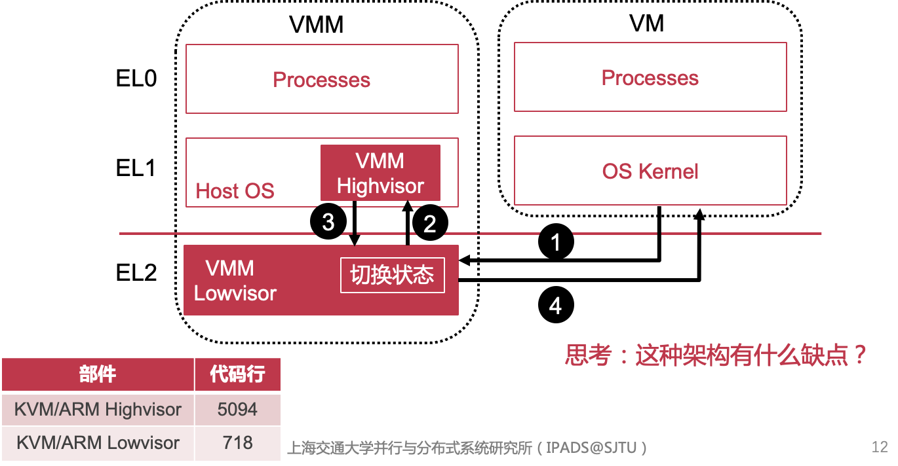

1. lowvisor的逻辑非常简单，只是无脑转发(但是也会带来开销)
2. 在进入highwisor之前需要保存状态，用内存保存EL1register

#### ARMv8.1中的Type-2 VMM架构

- ARMv8.1
  - 推出Virtualization Host Extensions(VHE)，在HCR_EL2.E2H打开
    - 寄存器映射
    - 允许与EL0共享内存
  - **使EL2中可直接运行未修改的操作系统内核（Host OS）**


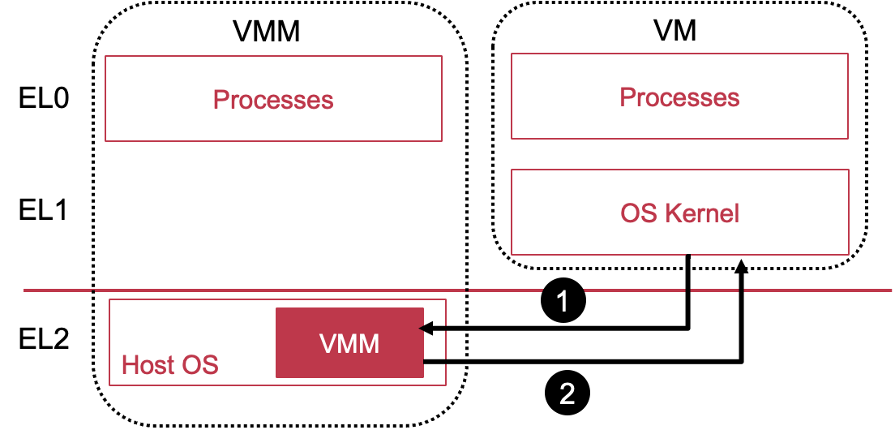

### VT-x和VHE对比

|                                    | **VT-x**       | **VHE** |
| ---------------------------------- | -------------- | ------- |
| 新特权级                           | Root和Non-root | EL2     |
| 是否有VMCS？                       | 是             | 否      |
| VM  Entry/Exit时硬件自动保存状态？ | 是             | 否      |
| 是否引入新的指令？                 | 是(多)         | 是(少)  |
| 是否引入新的系统寄存器?            | 否             | 是(多)  |
| 是否有扩展页表(第二阶段页表)?      | 是             | 是      |

#### Type-1和Type-2在VT-x和VHE下架构


## 4. 案例：QEMU/KVM

#### QEMU/KVM架构

- **QEMU运行在用户态，负责实现策略**

  - 也提供虚拟设备的支持

- **KVM以Linux内核模块运行，负责实现机制**

  - 可以直接使用Linux的功能
  - 例如内存管理、进程调度
  - 使用硬件虚拟化功能

- 两部分合作

  - KVM捕捉所有敏感指令和事件，传递给QEMU
  - KVM不提供设备的虚拟化，需要使用QEMU的虚拟设备

- 需要两个switch case

  - KVM为QEMU提供的接口
    - KVM事件处理

- 对于QEMU而言，创建vCPU就是创建线程，KVM会为其维护一个VMCS

- **QEMU使用KVM的用户态接口**

  - **QEMU使用/dev/kvm与内核态的KVM通信**，使用ioctl向KVM传递不同的命令：CREATE_VM, CREATE_VCPU, KVM_RUN等

    ```c
    open("/dev/kvm")
    ioctl(KVM_CREATE_VM)
    ioctl(KVM_CREATE_VCPU)
    while (true) {
         ioctl(KVM_RUN)
         exit_reason = get_exit_reason();
         switch (exit_reason) {
           case KVM_EXIT_IO:  /* ... */
             break;
           case KVM_EXIT_MMIO: /* ... */
             break;
         }
    }
    ```

#### ioctl(KVM_RUN)时发生了什么

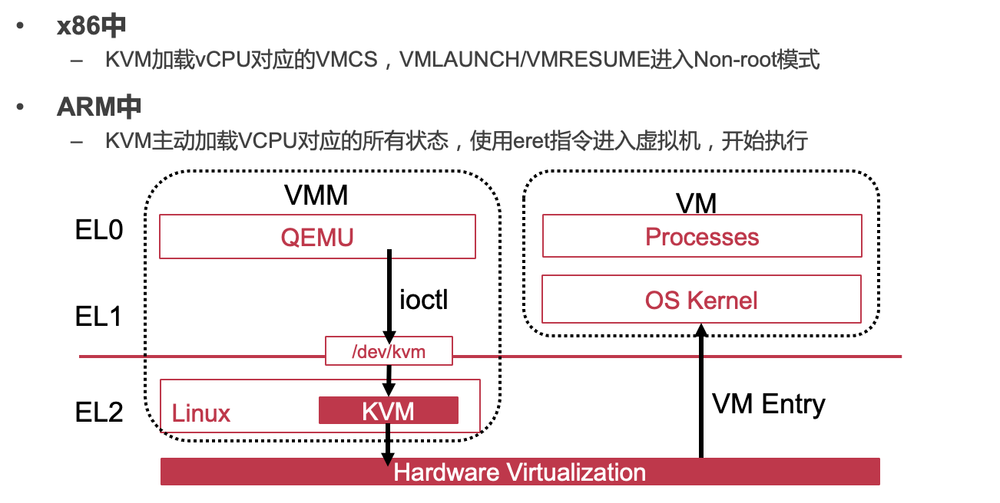

#### QEMU/KVM的流程


如果是时间片中断，就不需要再回到QEMU

#### WFI指令VM Exit的处理流程

> WFI代表"Wait For Interrupt"，是ARM架构中的一个指令。WFI指令用于使CPU进入低功耗待机状态，等待中断信号的到来。当执行WFI指令时，CPU会停止执行指令并进入休眠状态，只有当中断信号被触发时，CPU才会被唤醒并继续执行。

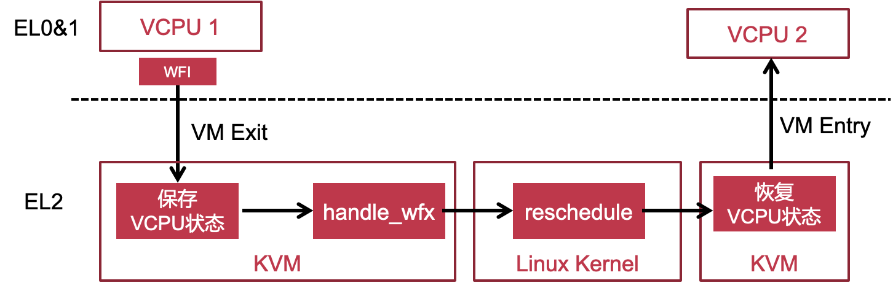

#### I/O指令VM Exit的处理流程


> #### QEMU和KVM分别用到了什么虚拟化技术
>
> QEMU (Quick Emulator) 和 KVM (Kernel-based Virtual Machine) 是常见的开源虚拟化解决方案。它们结合使用多种虚拟化技术来提供完整的虚拟化环境。
>
> 1. QEMU:
>    QEMU 是一个功能强大的开源虚拟机监控器（Virtual Machine Monitor，VMM）。它可以模拟多种硬件架构，并提供硬件级别的虚拟化。QEMU 使用了以下虚拟化技术：
>
>    - 系统模拟：QEMU 可以模拟不同体系结构的处理器（如x86、ARM等），允许在宿主机上运行与不同体系结构兼容的客户操作系统。
>
>    - 二进制翻译：QEMU 可以将客户操作系统的指令动态翻译成宿主机上的本地指令。这种技术使得在宿主机上运行不同体系结构的客户操作系统成为可能。
>
>    - 设备模拟：QEMU 提供了对各种外部设备（如网络接口卡、磁盘控制器等）的模拟，使得客户操作系统可以与这些虚拟设备进行交互。
>
>    - 硬件加速：QEMU 可以利用宿主机上的硬件加速功能，如KVM模块，来提高虚拟化性能。
>
> 2. KVM:
>    KVM 是基于Linux内核的虚拟化技术，它通过将Linux内核转变为一个虚拟机监控器（VMM），提供硬件级别的虚拟化。KVM 使用了以下虚拟化技术：
>
>    - 硬件虚拟化扩展：KVM 利用宿主机处理器的硬件虚拟化扩展，如Intel的VT-x和AMD的AMD-V，来提供硬件级别的虚拟化支持。这些扩展使得宿主机可以直接运行客户操作系统，而不需要通过软件仿真来模拟处理器。
>
>    - 虚拟设备模拟：KVM 提供虚拟设备模拟功能，允许客户操作系统与虚拟设备进行交互。这些虚拟设备通过宿主机的驱动程序和设备模拟器来实现。
>
>    - 内核模块：KVM 以内核模块的形式存在于Linux内核中，通过将Linux内核转变为一个VMM，提供虚拟化功能。
>
> QEMU 和 KVM 的结合使用使得可以在宿主机上运行多个虚拟机实例，并为每个虚拟机提供独立的操作系统和应用程序环境。QEMU 负责虚拟硬件的模
>
> 拟和指令翻译，而 KVM 利用硬件虚拟化扩展提供更高效的虚拟化性能。这种结合提供了高度灵活性和较好的性能，使得在单个宿主机上部署和管理多个虚拟机变得更加简单和高效。

# 23. 内存虚拟化 


## 1. 内存虚拟化

#### 为什么需要内存虚拟化?

如果VM使用的是真实物理地址:可能自己的内存被别的虚拟机读写，在正确性和安全性上无法得到保证

#### 内存虚拟化的目标

- 为虚拟机提供虚拟的物理地址空间，物理地址从0开始连续增长
- 隔离不同虚拟机的物理地址空间，VM-1无法访问其他的内存

#### 三种地址


- 客户指的是虚拟机，主机是hypervisor


### 怎么实现内存虚拟化?

1、影子页表(Shadow Page Table)
2、直接页表(Direct Page Table)
3、硬件虚拟化

#### 影子页表(Shadow Page Table)

> 影子页表是每个进程一个，HPT是每个虚拟机一个

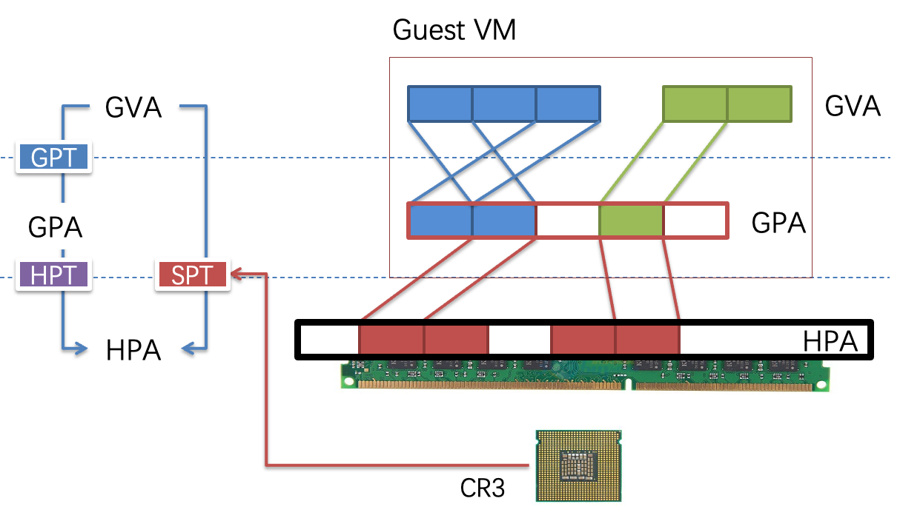

- SPT可以直接把GVA翻译成HPA，Guest是看不到的

实现思路：

1.**VMM intercepts guest OS setting the virtual CR3**

2.**VMM iterates over the guest page table, constructs a corresponding shadow page** **table**

3.**In shadow PT, every guest physical address is translated into host physical address**

4.**Finally, VMM loads the host physical address of the shadow page** **table**

> 1.VMM拦截设置虚拟CR3的guest OS
>
> 2.VMM在guest page table上迭代，构建相应的shadow page **table**
>
> 3.在影子PT中，每个客人的实际地址都被翻译成主机的实际地址
>
> 4.最后，VMM加载阴影页表的主机物理地址

代码：

```c
set_cr3 (guest_page_table):
    for GVA in 0 to 220
        if guest_page_table[GVA] & PTE_P:
            GPA = guest_page_table[GVA] >> 12
            HPA = host_page_table[GPA] >> 12
            shadow_page_table[GVA] = (HPA<<12)|PTE_P
        else
            shadow_page_table[GVA] = 0
     CR3 = PHYSICAL_ADDR(shadow_page_table)

```

遍历所有的地址，将GPT和HPT结合起来得到GVA到HPA的映射

对于缺页异常，要trap住，具体实现：

把GPT所在的page设置为read only，这个时候需要修改的页表是SPT，因为是SPT是真正负责地址翻译的

#### Guest OS修改页表，如何生效？

- Real hardware would start using the new page table's mappings
  Virtual machine monitor has a separate shadow page table
- Goal: 
  VMM needs to intercept when guest OS modifies page table, update shadow page table accordingly
- Technique: 
  Use the read/write bit in the PTE to mark those pages read-only
  If guest OS tries to modify them, hardware triggers page fault
  Page fault handled by VMM: update shadow page table & restart guest

> - 真实硬件将开始使用新页表的映射虚拟机监视器有一个单独的影子页表
> - 目标：
>   VMM需要拦截guest OS修改页表，相应更新shadow页表
> - 技术：
>   使用 PTE 中的读/写位将这些页面标记为只读
>   如果客户操作系统试图修改它们，硬件会触发页面错误
>   VMM 处理的Page fault：更新影子页表并重启客户机

#### Guest内核如何与Guest应用隔离？

- How do we selectively allow / deny access to kernel-only pages in guest PT? 
  - Hardware doesn't know about the virtual U/K bit 
- Idea: 
  - Generate two shadow page tables, one for U, one for K
  - When guest OS switches to U mode, VMM must invoke set_ptp(current, 0)

##### 构建2个不同的Guest Pages


##### Two Memory Views of Guest VM


#### 2、Direct Paging (Para-virtualization)

- Modify the guest OS
  - No GPA is needed, just GVA and HPA
  - Guest OS directly manages its HPA space
  - Use hypercall to let the VMM update the page table（batch，批量化，效率更高，缺点是不够透明）
  - The hardware CR3 will point to guest page table
- VMM will check all the page table operations
  - The guest page tables are read-only to the guest

- 存在权限问题：无法设置权限
- 解决方案：Guest对于页表只有只读权限，在修改页表的时候需要经过VMM的检查
- Positive
  Easy to implement and more clear architecture
  Better performance: guest can batch to reduce trap
- Negatives
  Not transparent to the guest OS
  The guest now knows much info, e.g., HPA
  May use such info to trigger rowhammer attacks

> Rowhammer: 频繁写相邻的VM的memory，导致此VM的memory的bit被flip，内容被修改，这个可能是关键的内容，比如页表的权限


#### 3、硬件虚拟化对内存翻译的支持

- Intel VT-x和ARM硬件虚拟化都有对应的内存虚拟化
  - Intel Extended Page Table (EPT)
  - ARM Stage-2 Page Table (第二阶段页表)
- 新的页表
  - 将GPA翻译成HPA
  - 此表被VMM直接控制
  - 每一个VM有一个对应的页表

- 第一阶段页表：虚拟机内虚拟地址翻译（GVA->GPA）
- 第二阶段页表：虚拟机客户物理地址翻译（GPA->HPA）

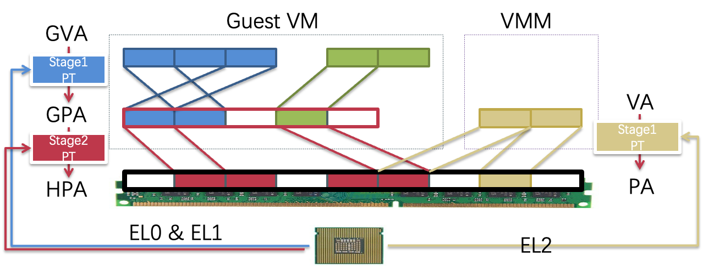

#### 第二阶段四级页表

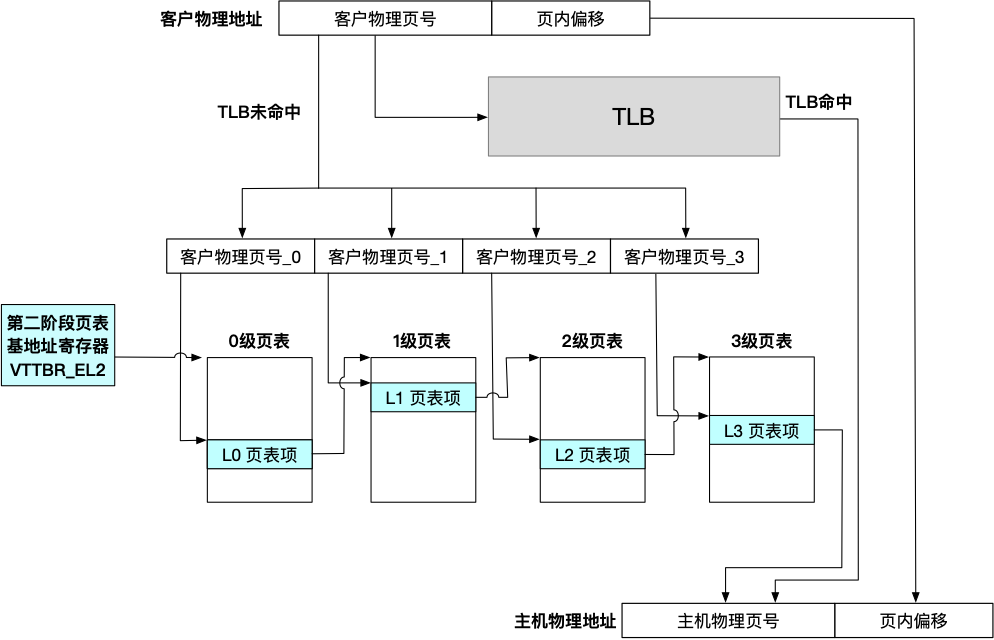

##### VTTBR_EL2

- 存储虚拟机第二阶段页表基地址，只有1个寄存器：VTTBR_EL2
- 对比第一阶段页表
  - 有2个页表基地址寄存器：TTBR0_EL1、TTBR1_EL1
  - VMM在调度VM之前需要在VTTBR_EL2中写入此VM的第二阶段页表基地址
- 第二阶段页表使能：HCR_EL2第0位

#### 第二阶段页表项

- 第3级页表页中的页表项：与第一阶段页表完全一致

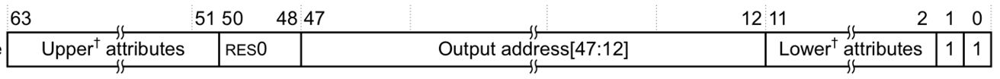

- 第0-2级页表页中的页表项：与第一阶段在高位有不同


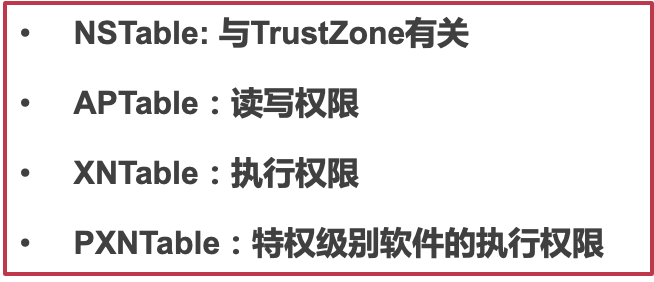

#### 二十四次内存访问

> 在传统的页表中，如果是4级页表，访问内存中的内容需要4次访存
>
> 但是在两阶段页表中，需要24次访存（读TTBR0_EL1无需内存访问），一级页表里面都是存着GPA，需要翻译成HPA才能真正访存

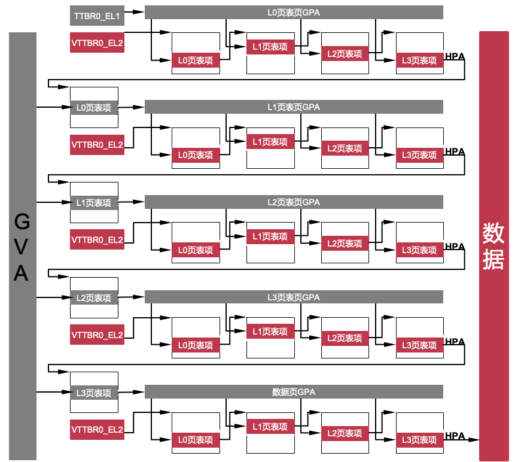

#### 提高性能的方式：TLB缓存地址翻译结果

- 回顾：TLB不仅可以缓存第一阶段地址翻译结果
- TLB也可以第二阶段地址翻译后的结果
  - 包括第一阶段的翻译结果(GVA->GPA)
  - 包括第二阶段的翻译结果(GPA->HPA)
  - 大大提升GVA->HPA的翻译性能：不需要24次内存访问
- 切换VTTBR_EL2时
  - 理论上应将前一个VM的TLB项全部刷掉
  - 可以只清空当前进程的
  - 刷TLB相关指令
    清空全部：TLBI VMALLS12E1IS 
    清空指定GVA：TLBI VAE1IS
    清空指定GPA：TLBI IPAS2E1IS 
  - VMID (Virtual Machine IDentifier)
    VMM为不同进程分配8/16 VMID，将VMID填写在VTTBR_EL2的高8/16位
    VMID位数由VTCR_EL2的第19位（VS位）决定
    避免刷新上个VM的TLB

#### 如何处理缺页异常

- 两阶段翻译的缺页异常分开处理
- 第一阶段缺页异常
  - 直接调用VM的Page fault handler
  - 修改第一阶段页表不会引起任何虚拟机下陷
- 第二阶段缺页异常
  - 虚拟机下陷，直接调用VMM的Page fault handler

#### 第二阶段页表的优缺点

- 优点
  - VMM实现简单
  - 不需要捕捉Guest Page Table的更新
  - 减少内存开销：每个VM对应一个页表
- 缺点
  - TLB miss时性能开销较大

#### 如何实现虚拟机级别的内存换页？

- 具体场景：将虚拟机A的128MB内存转移到虚拟机B中
  - 虚拟机A对内存的使用较少
  - 虚拟机B对内存需求较大
- 问题
  - VMM无法识别虚拟机内存的语义
  - 两层内存换页机制
    - VM与VMM的换页机制可能彼此冲突，造成开销。

- 解决方案： ==内存气球机制==（具体内容是什么？看书！！！）

- 内存气球机制的缺点：速度慢

# 24. I/O虚拟化


#### 为什么需要I/O虚拟化

举例：如果VM直接管理物理网卡，

- **正确性问题**：所有VM都直接访问网卡
  所有VM都有相同的MAC地址、IP地址，无法正常收发网络包
- **安全性问题**：恶意VM可以直接读取其他VM的数据
  除了直接读取所有网络包，还可能通过DMA访问其他内存

#### I/O虚拟化的目标

- 为虚拟机提供虚拟的外部设备
  - 虚拟机正常使用设备
- 隔离不同虚拟机对外部设备的直接访问
  - 实现I/O数据流和控制流的隔离
- 提高物理设备的利用资源
  - 多个VM同时使用，可以提高物理设备的资源利用率


## 怎么实现I/O虚拟化?

### 1、设备模拟（Emulation）

- OS与设备交互的硬件接口
  模拟寄存器(中断等)
  捕捉MMIO操作
- 硬件虚拟化的方式
  硬件虚拟化捕捉PIO指令
  MMIO对应内存在第二阶段页表中设置为invalid

> VMM为VM提供一段设备对应的虚拟设备地址，但是在访问这段地址的时候，会触发page fault，VMM处理对于设备的操作，设备处理完成后，中断会发送到VMM，VMM再发送一个中断给VM


#### 例：QEMU/KVM设备模拟

以虚拟网卡举例——发包过程：

Qemu：HVA-> HPA

VM: GPA->HPA


以虚拟网卡举例——收包过程：

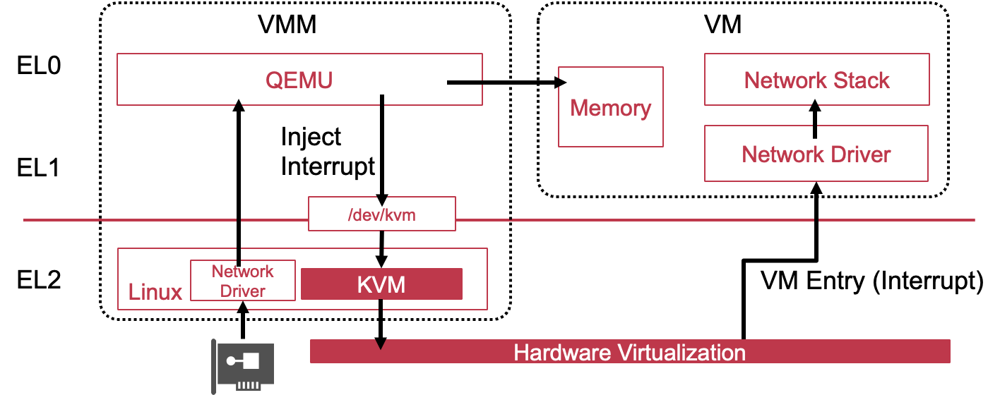

#### **设备模拟的优缺点**

- 优点
  - 可以模拟任意设备：选择流行设备，支持较“久远”的OS（如e1000网卡）
  - 允许在中间拦截（Interposition）:例如在QEMU层面检查网络内容
  - 不需要硬件修改
- 缺点
  - 性能不佳


### 方法2：半虚拟化方式

- 协同设计
  - 虚拟机“知道”自己运行在虚拟化环境
  - 虚拟机内运行前端(front-end)驱动
  - VMM内运行后端(back-end)驱动
- VMM主动提供Hypercall给VM
- 通过共享内存传递指令和命令

> 快的原因：半虚拟化带来的批量处理的好处

#### VirtIO: Unified Para-virtualized I/O

- **标准化的半虚拟化I/O框架**
  - 通用的前端抽象
  - 标准化接口
  - 增加代码的跨平台重用

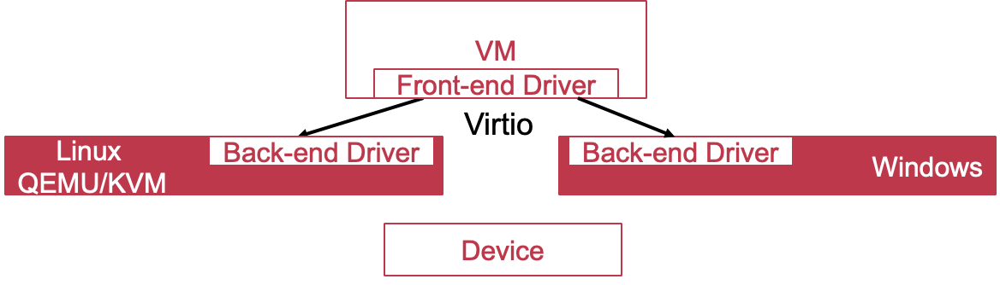

#### Virtqueue

- **VM和VMM之间传递I/O请求的队列**
- 3个部分
  - Descriptor Table：其中每一个descriptor描述了前后端共享的内存，链表组织
  - Available Ring：可用descriptor的索引，Ring Entry指向一个descriptor链表
  - Used Ring：已用descriptor的索引

#### 例：QEMU/KVM半虚拟化

##### 发网络包


##### 收网络包


#### 半虚拟化方式的优缺点

- 优点
  - 性能优越：多个MMIO/PIO指令可以整合成一次Hypercall
  - VMM实现简单，不再需要理解物理设备接口
- 缺点
  - 需要修改虚拟机操作系统内核


### 方法3：设备直通（性能最好）

**虚拟机直接管理物理设备**


#### 问题1：**DMA** **恶意读写内存**，操作物理地址绕开了翻译时的检查

- 解决方案：使用IOMMU (VMM提供，在启动虚拟机的时候就确定了)

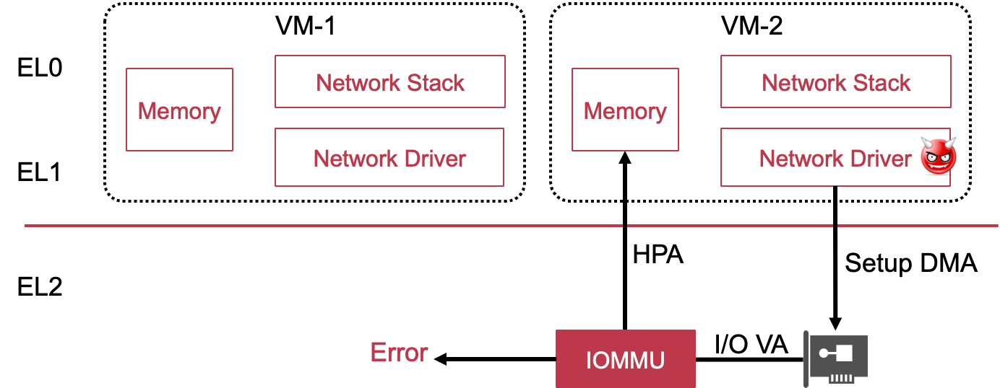

##### IOMMU与MMU：

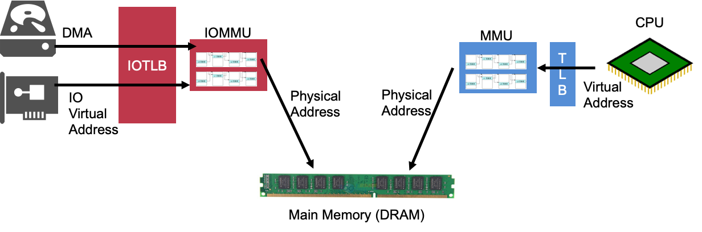

##### ARM SMMU

- SMMU是ARM中IOMMU的实现：System MMU
- SMMU的设计与AARCH64 MMU一致
  - 也存在两阶段地址翻译
  - 第一阶段：OS为进程配置：IOVA->GPA
  - 第二阶段：第一阶段翻译完之后进行第二阶段，VMM为VM配置：GPA->HPA 

#### 问题2：设备独占

- Scalability不够：设备被VM-1独占后，就无法被VM-2使用：如果一台物理机上运行16个虚拟机，必须为这些虚拟机安装16个物理网卡

#### 解决方案：Single Root I/O Virtualization (SR-IOV)

- SR-IOV是PCI-SIG组织确定的标准
- **满足SRIOV标准的设备，在设备层实现设备复用**
  - 能够创建多个Virtual Function(VF)，每一个VF分配给一个VM，负责进行数据传输，属于数据面（Data-plane）
  - 物理设备被称为Physical Function(PF)，由Host管理，负责进行配置和管理，属于控制面（Control-plane）
- 设备的功能
  - 确保VF之间的数据流和控制流彼此不影响


#### 设备直通的优缺点

- 优点
  - 性能优越
  - 简化VMM的设计与实现
- 缺点
  - 需要特定硬件功能的支持（IOMMU、SRIOV等）
  - 不能实现Interposition：难以支持虚拟机热迁移


#### I/O虚拟化技术对比

|                  | **设备模拟** | **半虚拟化**         | **设备直通** |
| ---------------- | ------------ | -------------------- | ------------ |
| 性能             | 差           | 中                   | 好           |
| 修改虚拟机内核   | 否           | 驱动+修改            | 安装VF驱动   |
| VMM复杂度        | 高           | 中                   | 低           |
| Interposition    | 有           | 有                   | 无           |
| 是否依赖硬件功能 | 否           | 否                   | 是           |
| 支持老版本OS     | 是           | 有的支持，有的不支持 | 否           |

在实际的应用中，其实是多种方式复用的

Interposition：抽象能力， 设备直通中hypervisor不参与，因此抽象能力比较弱


### 中断虚拟化

- VMM在完成I/O操作后通知VM
  - 例如在DMA操作之后
- VMM在VM Entry时插入虚拟中断
  - VM的中断处理函数会被调用
- 虚拟中断类型
  - 时钟中断
  - 核间中断
  - 外部中断

#### ARM中断虚拟化的实现方法

- 打断虚拟机执行
  - 通过List Register插入
- 不打断虚拟机执行
  - 通过GIC ITS插入

#### Virtual CPU Interface

- GIC为虚拟机提供的硬件功能
- VM通过Virtual CPU Interface与GIC交互
- VMM通过Physical CPU Interface与GIC交互


#### **插入虚拟中断：以半虚拟化举例**

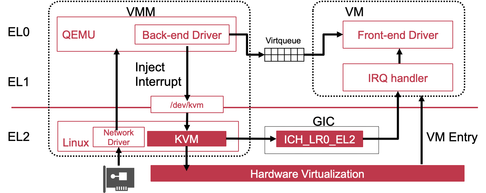

问题：要打断虚拟机执行

#### 不打断虚拟机执行：GIC ITS

- GIC第4版本推出了Direct injection of virtual interrupts 
  - 将物理设备的物理中断与虚拟中断绑定
  - 物理设备直接向虚拟机发送虚拟中断
- VMM在运行VM前
  - 配置GIC ITS (Interrupt Translation Service)
    - 建立物理中断与虚拟中断的映射
  - 映射内容
    - 设备与物理中断的映射
    - 分配虚拟中断号
    - 发送给哪些物理核上的虚拟处理器

#### 虚拟中断的直接插入


- GICv4目前在服务器上基本上没有实现

- 但是非常有前景


# 25. 机密虚拟化

#### background：当虚拟机监控器不可信

- 系统的复杂性
  - 软件：恶意软件，虚拟机监控器本身可能存在漏洞
  - 人：运维外包（如云计算等）导致接触计算机的人更复杂
- 不可信的虚拟机监控器
  - 可以查看任意虚拟机的vCPU寄存器、内存内容、I/O数据
  - 可以修改虚拟机的状态
    - VMM控制着页表，可直接映射虚拟机的内存并读取数据
  - 可以控制虚拟机的行为
    - VMM控制着页表，可直接在应用内部新映射一段恶意代码
    - VMM可任意改变虚拟机的RIP，劫持其执行流

#### 虚拟机监控器漏洞的危害

- 虚拟机提权(Privilege Escalation)
- 隐私数据泄露(Data Leakage)
- 拒绝服务攻击(Denial of Service)

#### 一种新的威胁模型：安全处理器

- **不信任CPU外的硬件**
  包括内存（DRAM）、设备、网络
- **仅信任CPU**
  包括cache、所有计算逻辑（Anyway，总得信任CPU吧...）
- **Enclave（飞地）**
  又称为可信执行环境，TEE（Trusted Execution Environment），将管理资源和安全解耦了，VMM不能管理这个VM

#### Enclave/TEE：可信执行环境

- Enclave/TEE的定义
  - Enclave，又称"可信执行环境" （TEE，Trusted Execution Environment），是计算机系统中一块通过底层软硬件构造的安全区域，通过保证加载到该区域的代码和数据的完整性和隐私性，实现对代码执行与数据资产的保护 —— Wikipedia
- Enclave的两个主要功能
  - 远程认证：验证远程节点是否为加载了合法代码的Enclave
  - 隔离运行：Enclave外无法访问Enclave内部的数据
- Enclave带来的能力：限制访问数据的软件
  - 可保证数据只在提前被认证的合法节点间流动
    - 合法节点：部署了合法软件的节点

#### 硬件Enclave提供不同粒度的隔离环境

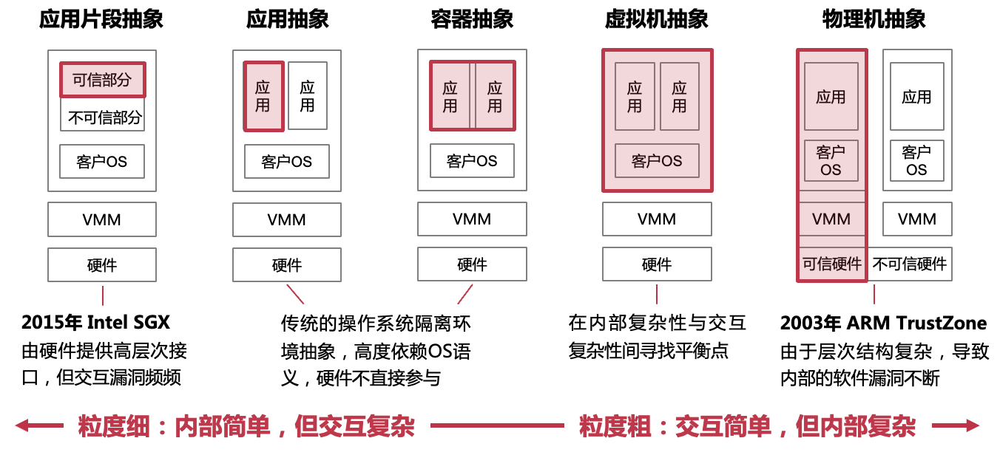

> 现阶段是硬件特性爆发阶段，各家的硬件还没有完全形成合适的、统一的隔离抽象。ARM提出的隔离是物理机粒度、Intel提出的则是非常细粒度的应用片段隔离。
>
> 这是两个极端，粒度细的优点是内部逻辑简单，但内外交互的接口很复杂，因为具有高层语义；而粒度粗则相反，交互接口很底层、很简单，但隔离环境内部的层次多，所以逻辑复杂。
>
> 在2013年，我们提出了一种基于加密内存保护的虚拟机抽象，（交互内容比较少，只有一些page fault，hypercall等）在内部复杂性与交互复杂性之间找到一个平衡点。


### **机密虚拟化** Overview

- 一种通过基于硬件的可信执行环境来保护虚拟机数据的机制和方法
  - 保护虚拟机免受不可信虚拟机监控器和管理员的威胁
- 关键技术
  - 虚拟机内部与外部的隔离
  - 内存加密和完整性保护
  - 远程验证

#### 可信固件

>  在VM和VMM之间增加的一层，使得VM不能直接访问VMM

- 由CPU厂商开发的可信软件，比虚拟机监控器的特权级更高
- 可信固件能够访问所有物理资源，对系统进行配置并提供保护机制


#### 内存隔离机制

> **机密虚拟机的内存范围不能被其他虚拟机和虚拟机监控器访问**


#### 硬件内存加密与保护机制

- 硬件加密保护隐私性
  - CPU外皆为密文，包括内存、存储、网络等
  - CPU内部为明文，包括各级Cache与寄存器
  - 数据进出CPU时，由进行加密和解密操作
- 硬件Merkle Tree保护完整性
  - 对内存中数据计算一级hash，对一级hash计算二级hash，形成树
  - CPU内部仅保存root hash，其它hash保存在不可信的内存中
  - 当内存中的数据被修改时，更新Merkle Tree

#### 硬件内存加密

- 方法一：单密钥加密
  - 缺点：同样的明文会产生同样的密文(隐私性不好)
- 方法二：多密钥加密
  - 缺点：如何保存这些密钥？CPU内部放不下
- 方法三：单密钥 + 多 seed
  - 为每个cache line单独生成一个seed，用密钥加密后，对数据进行异或

##### 生成seed用于加密


> seed可以提前算好，只要有数据来做异或就好；加密是根据地址的


### 内存完整性保护

目标：

> 内存数据的完整性保护：机密虚拟机的内存数据不可被恶意修改
> 内存映射的完整性保护：机密虚拟机的第二阶段页表映射不可被恶习改变

#### Merkle hash Tree

- 可以保证内存不会受到拼接和欺骗攻击
  - 不知道hash key无法计算对应的mac
- 无法防御回放攻击
  - 攻击者可以将mac和data同时替换成老版本
- 将root hash (mac) 存储在CPU中
  - 防御回放攻击
    - 攻击者无法修改root mac的值
    - 如果修改了内存，向上回溯计算的时候会修改root的值，因此会被发现
- 缺点：支持不了太多的内存


#### 远程验证（Remote Attestation）

要解决的问题：如何远程判断某个主体是机密虚拟机？

- 例如，如何判断某个在云端的服务运行环境是安全的
- 必须在认证之后，再进行下一步的操作，例如发送数据

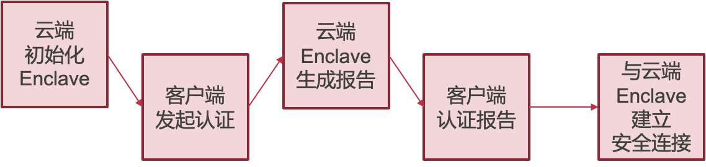

- 客户发起认证，会发送一个随机数给云端
- 云端会用这个随机数hash之后，加密内存、CPU等信息，连同数字签名一起，送会给客户端


## 机密虚拟化案例分析：ARM CCA

> ARM CCA (ARM Cryptocell-713A) 是 ARM 公司推出的一款面向嵌入式设备的安全子系统。它提供了一系列硬件和软件组件，用于实现安全性和加密功能，帮助保护嵌入式设备中的敏感数据和应用程序。
>
> ARM CCA 的主要特性和组件包括：
>
> 1. 安全处理器核心：ARM CCA 集成了一个安全处理器核心，专门用于执行安全功能和保护关键数据。该核心具有独立的安全状态和内存空间，隔离安全和非安全代码的执行环境。
>
> 2. 加密引擎：ARM CCA 提供了硬件加速的加密引擎，支持各种常见的加密算法，如对称加密算法（如AES）、哈希算法（如SHA-256）、公钥加密算法（如RSA）等。这些硬件加速模块可以提供高效的加密和解密性能。
>
> 3. 安全存储：ARM CCA 提供了安全存储功能，可用于存储敏感数据，如密钥、证书和安全配置信息。这些存储区域受到硬件保护，防止非授权访问和篡改。
>
> 4. 安全启动和认证：ARM CCA 支持安全启动过程，确保设备的固件和软件在启动时未被篡改。它提供了认证机制，用于验证固件和软件的完整性和真实性。
>
> 5. 安全连接：ARM CCA 支持安全连接和通信，包括 TLS（Transport Layer Security）协议和加密通信通道的建立。它提供了加密套件和协议支持，用于确保数据在传输过程中的机密性和完整性。
>
> 6. 安全调试：ARM CCA 提供了安全调试功能，可以限制和控制对设备的调试访问。它支持远程安全调试和固件的安全调试模式。
>
> ARM CCA 可以广泛应用于各种嵌入式设备，如物联网设备、智能手机、平板电脑、汽车电子、工业控制系统等。它的设计目标是提供一种安全、高效和可靠的解决方案，以满足嵌入式系统中的安全需求。

#### ARM TrustZone 技术

- ARMv6版本开始的安全硬件特性
  - 包括ARM11及Cortex A系列
  - 目前大部分手机芯片均有该硬件特性
- 同时运行一个安全的OS和一个普通的OS
  - 两个系统之间互相隔离运行
  - 安全的OS具有更多的权限
- TrustZone是一个全系统级别的安全架构
  - 处理器、内存和外设的安全隔离

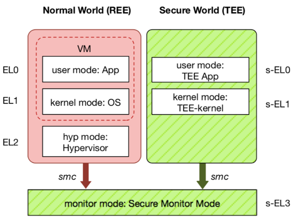

#### ARM Confidential Compute Architecture

- 硬件扩展：Realm Management Extension （相当于机密虚拟机的位置）
  - 全新的特权世界Realm
  - 全新的物理地址空间
  - 细粒度和动态内存隔离机制
- CCA固件
  - RMM管理Realm
  - Monitor管理物理内存及翻译


#### 世界状态World State和内存隔离

- 4个世界状态：Non-secure, Realm, secure, root
- 4个Physical Address Space (PAS) 
  - Non-secure PAS
  - Secure PAS（为了兼容trust Zone）
  - Realm PAS
  - Root PAS

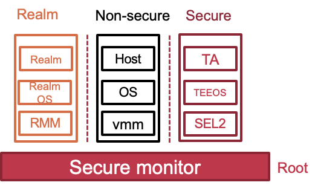


#### 内存加密

- 内存保护引擎（MPE）
  - MPE为不同PAS提供不同的秘钥或Tweak
  - Non-secure以外的PAS必须经过内存加密
  - Monitor 可以配置MPE
  - 硬件完整性保护非必须


#### 物理内存检查模块Granule Protection Check (GPC)

- Granule protection check
  - 2-level index table for PAS tag
  - PA->Tag translation（monitor提供的HPA到Tag的翻译）


- **在MMU和SMMU中添加GPC模块**，PAS标签在SoC中不断进行传递：

  

#### 可信软件固件

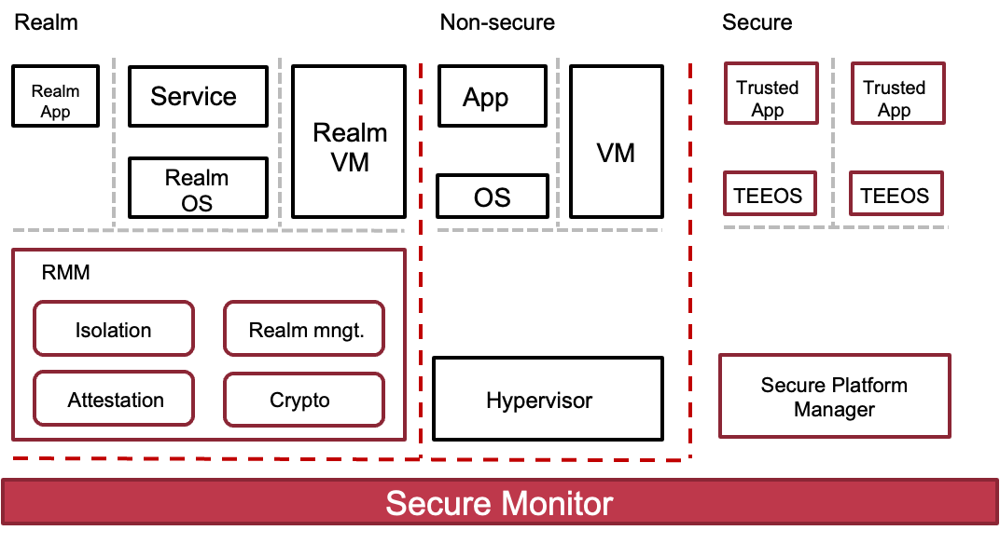

#### RMM接口：RMI和RSI

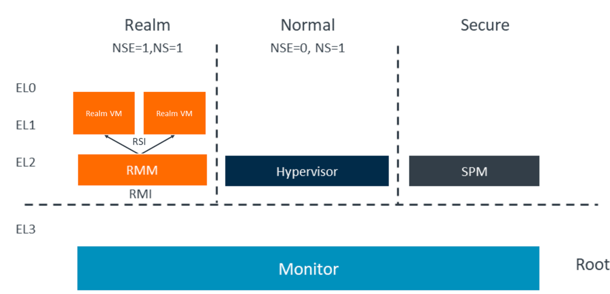

#### 远程验证

- 验证报告的控制流
  - Monitor获得CCA平台报告，并返回给RMM
  - RMM将Realm的度量信息添加到报告中，并返回给Realm


## 其他虚拟化方案

### ARM SEL2

- ARM TrustZone & Secure-EL2 (S-EL2)硬件扩展
  - TrustZone: 与普通世界硬件隔离，被广泛应用于移动端
  - 从ARMv8.4开始引入的S-EL2扩展在TrustZone中支持了硬件虚拟化
    - S-EL2与普通世界的EL2功能相同

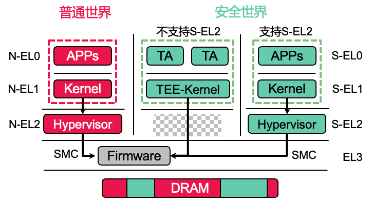

> 基于区域粒度的内存隔离
>
> -最多8个内存区域 (TZC-400)
>
> -可在EL3 & S-EL2进行配置

### ARM TwinVisor

- 关键观察：在普通世界中已经存在功能成熟、被广泛应用的hypervisor了

- 将机密虚拟机的资源管理功能与保护机制解耦 

- 虚拟机管理内存的粒度是4K，且是on-demand

  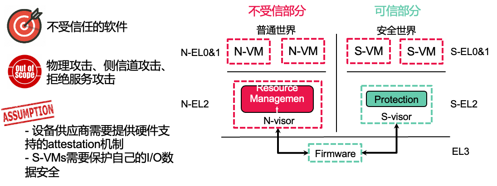

> 在 TwinVisor 的威胁模型中，只有 S-visor 和EL3中的固件属于TCB。
>
> N-VMs和N-visor可以被攻击者入侵并控制，而S-VMs可能被恶意的云租户控制。
>
> 物理攻击、side-channel和DoS攻击不在TwinVisor的考虑范围内，这些攻击的防御方法与TwinVisor的设计是正交的。
>
> TwinVisor假设设备供应商提供硬件支持的root of trust以进行attestation，而S-VM则通过加密和完整性检查来保护自己的I/O数据安全。

### AMD Secure Encrypted Virtualization (SEV)

- 以虚拟机为粒度的Enclave
  - 对不同的虚拟机进行加密
  - 每个虚拟机的密钥均不相同
  - Hypervisor有自己的密钥
- 安全模型的缺陷
  - 依然部分依赖Hypervisor
    - 如：为VM设置正确的密钥


### Intel Trusted Domain Extensions (TDX)

- Intel TDX将VM（也称为TD）与虚拟机监控器和其他非TD软件隔离开
  - Virtual Machine Extensions (VMX) 
  - SEAM firmware
  - Multi-key, total memory-encryption (MKTME) technology
  - 提供guest-aware exception
  - side-channel attack: VM的page fault会交给VMM，VMM会根据VM page fault的信息反推出控制流
    - 解决方案：增加SEAM module，SEAM会让VM检查确认地址

​	


# 26. 轻量级虚拟化


## 1. 虚拟化的技术

| **虚拟化** | **软件方案**                                                 | **硬件方案**                           |
| ---------- | ------------------------------------------------------------ | -------------------------------------- |
| CPU        | •Trap  &  Emulate  •指令解释执行  •二进制翻译  •Para-virtualization | •EL-2  (ARM)                           |
| 内存       | •Shadow  page  table  •Separating page tables for U/K  •Para-virtualization: Direct paging | •Stage-2  PT  (ARM)                    |
| I/O        | •Direct  I/O  •设备模拟  •Para-virtualization:  Front-end & back-end driver (e.g., virtio) | •SMMU  (ARM)  /  IOMMU  (x86)  •SR-IOV |

#### 虚拟化的优缺点

- 虚拟化的优势
  - 可以运行完整的软件栈，包括不同的操作系统
  - 灵活的整体资源分配（支持动态迁移）
  - 方便的添加、删除、备份（只需文件操作）
  - 虚拟机之间的强隔离（能抵御 fork bomb ）
- 虚拟化的问题：太重
  - 云：性能损失，尤其是I/O虚拟化（半虚拟化等有比较大的开销）
  - 用户：两层操作系统导致资源浪费


## 2. **chroot**

#### overview：**文件系统视图的隔离**

- 为每个执行环境提供单独的文件系统视图
- 原理
  - Unix系统中的“一切皆文件”设计理念
  - 对于用户态来说，文件系统相当重要
- 方法
  - 改变文件系统的根目录，即chroot

#### Chroot效果

- 控制进程能够访问哪些目录子树
- 改变进程所属的根目录
- 进程只能看到根目录下属的文件

#### Chroot原理

- 进程只能从根目录向下开始查找文件
  - 操作系统内部修改了根目录的位置
- 一个简单的设计
  - 内核为每个用户记录一个根目录路径
  - 进程打开文件时内核从该用户的根目录开始查找

- 特殊检查根目录下的“..”
  - 使得“/..”与“/”等价
  - 无法通过“..”打破隔离
- 每个TCB都指向一个root目录
  - 一个用户可以对多个进程chroot

- 需要root权限才能变更根目录
  - 也意味着chroot无法限制root用户
- 确保chroot有效
  - 使用setuid消除目标进程的root权限

```c
struct fs_struct{
    ......
    struct path root, pwd;
};

struct task_struct{
    ......
    struct fs_struct  *fs;
    ......
};

// 确保chroot有效
chdir(“jail”);
chroot(“.”);
setuid(UID); // UID > 0
```


#### 基于Name Space的限制

- 通过文件系统的name space来限制用户
  - 如果用户直接通过inode访问，则可绕过
  - 不允许用户直接用inode访问文件
  - 让不同的用户看到的inode不同
- 其它层也可以限制用户
  - 例如：inode层可以限制用户


#### Chroot的缺点

- 不同的执行环境想要共享一些文件怎么办？
- 涉及到网络服务时会发生什么？
  - 所有执行环境共用一个IP地址，所以无法区分许多服务
- 执行环境需要root权限该怎么办？
  - 全局只有一个root用户，所以不同执行环境间可能相互影响

##### Chroot不能实现彻底的隔离，因为还有许多资源被共享


## 3. Linux container

#### LinuX Container (LXC)

- 基于容器的轻量级虚拟化方案
  - 由Linux内核提供资源隔离机制，不同的容器共享OS的资源，但是提供了独占的抽象
- 安全隔离
  - 基于namespace机制
- 性能隔离
  - Linux cgroup

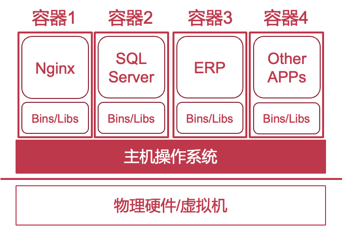

#### Linux Namespace (NS)

- 每种NS封装一类全局资源
  - 进程只能访问封装后的局部资源
  - 目前一共有七种NS
- 进程通过系统调用控制NS

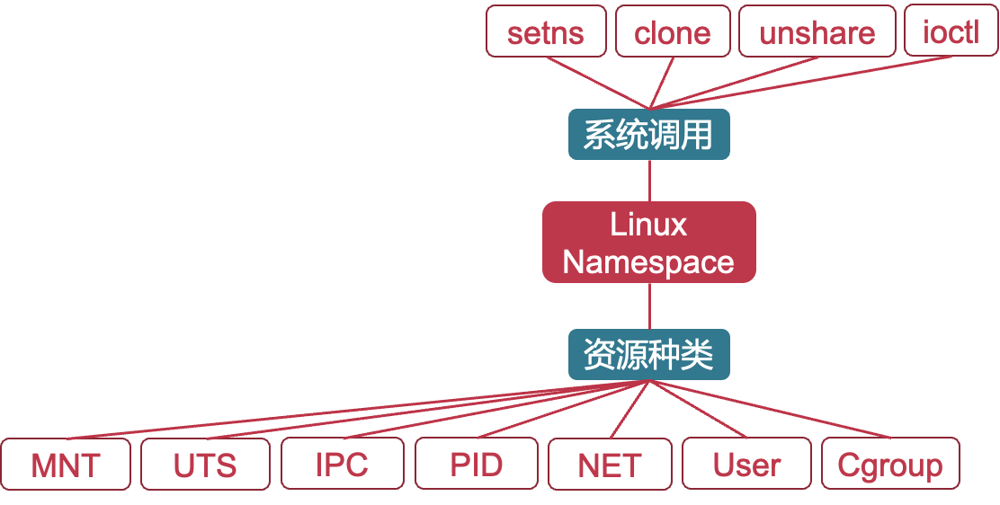

#### 1、Mount Namespace

> 容器内外可部分共享文件系统, 如果容器内修改了一个挂载点会发生什么？
>
> 假设主机操作系统上运行了一个容器
> Step-1：主机OS准备从/mnt目录下的ext4文件系统中读取数据
> Step-2：容器中进程在/mnt目录下挂载了一个xfs文件系统
> Step-3：主机操作系统可能读到错误数据

- 设计思路
  - 在内核中分别记录每个NS中对于挂载点的修改
  - 访问挂载点时，内核根据当前NS的记录查找文件
- 每个NS有独立的文件系统树
  - 新NS会拷贝一份父NS的文件系统树
  - 修改挂载点只会反映到自己NS的文件系统树


#### 2. IPC Namespace的实现

> 不同容器内的进程若共享IPC对象会发生什么？
>
> 假设有两个容器A和B: A中进程使用名为“my_mem”共享内存进行数据共享,B中进程也使用名为“my_mem”共享内存进行通信,B中进程可能收到A中进程的数据，导致出错以及数据泄露

- 使每个IPC对象只能属于一个NS
  每个NS单独记录属于自己的IPC对象
  进程只能在当前NS中寻找IPC对象
- 图例
  即使不同NS的共享内存ID均为my_mem -> 不同的共享内存

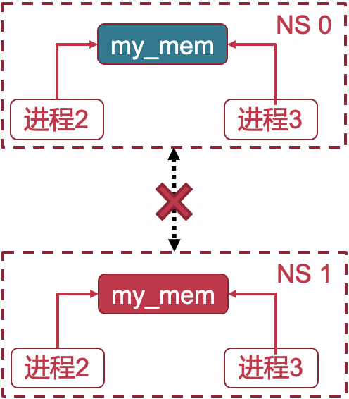

#### 3. Network Namespace的实现

> 不同的容器共用一个IP会发生什么？
>
> 假设有两个容器均提供网络服务,两个容器的外部用户向同一IP发送网络服务请求,主机操作系统不知道该将网络包转发给哪个容器
>
> ##### Linux对于多IP的支持
>
> 在虚拟机场景下很常见: 
>
> - 每个虚拟机分配一个IP，IP绑定到各自的网络设备上
>
> - 内部的二级虚拟网络设备
>
>   - br0: 虚拟网桥
>   - tap: 虚拟网络设备
>
>   

- 每个NS拥有一套独立的网络资源
  - 包括IP地址、网络设备等
- 新NS默认只有一个loopback设备，其余设备需后续分配或从外部加入
- 图例
  - 创建相连的veth虚拟设备对
  - 一端加入NS即可连通网络
  - 分配IP后可分别与外界通信

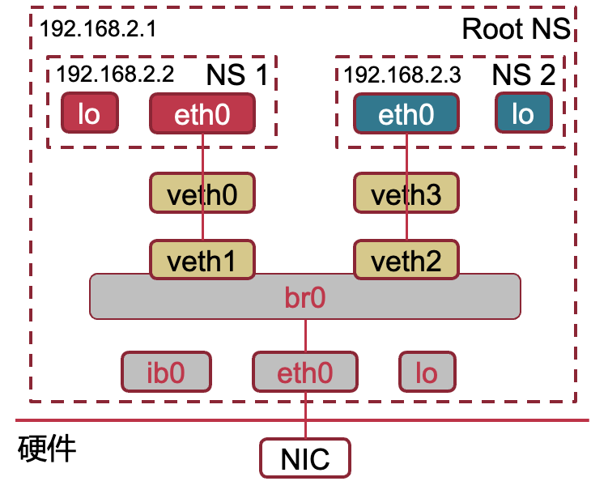

#### 4、PID Namespace

> 容器内进程可以看到容器外进程的PID会发生什么？
>
> 假设有容器内存在一个恶意进程,恶意进程向容器外进程发送SIGKILL信号,主机操作系统或其他容器中的正常进程会被杀死

- 对NS内外的PID进行单向隔离:外部能看到内部的进程，反之则不能
- 图例
  子NS中的进程在父NS中也有PID
  进程只能看到当前NS的PID
  子NS中的进程无法向外发送信号

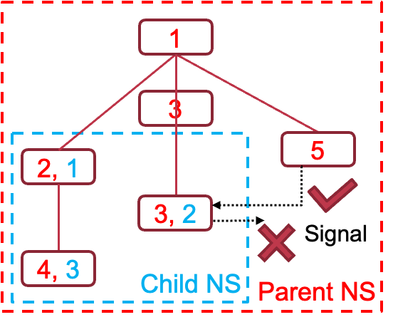

#### 5、User Namespace

> 容器内外共享一个root用户会发生什么？
>
> 假设一个恶意用户在容器内获取了root权限, 恶意用户相当于拥有了整个系统的最高权限,可以窃取其他容器甚至主机操作系统的隐私信息, 可以控制或破坏系统内的各种服务

- 对NS内外的UID和GID进行映射
  - 允许普通用户在容器内有更高权限
    - 基于Linux Capability机制(相当于权限机制)
  - 容器内root用户在容器外无特权
    - 只是普通用户
- 图例
  - 普通用户在子NS中是root用户


##### 进一步限制容器内Root

如果容器内root要执行特权操作怎么办？

- insmod？一旦允许在内核中插入驱动，则拥有最高权限
- 关机/重启？整个云服务器会受影响

1、从内核角度来看，仅仅是普通用户
2、限制系统调用
Seccomp机制（限制能调用的SYSCALL的种类和参数）


#### 其他Namespace

6、UTS Namespace

- 每个NS拥有独立的hostname等名称
- 便于分辨主机操作系统及其上的多个容器

7、Cgroup Namespace

- cgroupfs的实现向容器内暴露cgroup根目录
- 增强隔离性：避免向容器内泄露主机操作系统信息
- 增强可移植性：取消cgroup路径名依赖


### 性能隔离

#### Control Cgroups (Cgroups)

- Cgroups是Linux内核（从Linux2.6.24开始）提供的一种资源隔离的功能
- Cgroups可以做什么
  - 将线程分组
  - 对每组线程使用的多种物理资源进行限制和监控
- 怎么用Cgroups
  - 名为cgroupfs的伪文件系统提供了用户接口
  - 为什么是伪文件系统？本质上是内核的数据结构，不是真的文件，但是可以通过读写的方式进行通信

#### Cgroups的常用术语

- 任务（task）
- 控制组（cgroup）
- 子系统（subsystem）
- 层级 （hierarchy）

#### 任务（Task）

任务就是系统中的一个线程

#### 控制组（Control Group）

- Cgroups进行资源监控和限制的单位
  - 比如能用多少CPU和内存
- 任务的集合
  - 控制组cgroup1包含task1
  - 控制组cgroup2包含task2
  - 控制组cgroup3由task1和task2组成


#### 子系统（Sub-system）

- 可以跟踪或限制控制组使用该类型物理资源的内核组件
- 也被称为资源控制器


#### 层级（Hierarchy）

- 由控制组组成的树状结构
- 通过被挂载到文件系统中形成
- 一个任务在每个层级结构中只能属于一个控制组
- 一个子系统只能附加于一个层级结构
- 一个层级结构可以附加多个子系统

#### 资源控制模型

- 最大值：直接设置一个控制组所能使用的物理资源的最大值，例如：
  - 内存子系统：最多能使用1GB内存
  - 存储子系统：最大能使用100MB/s的磁盘IO
  - 缺点：不够动态
- 比例：设置不同控制组使用同一物理资源时的资源分配比例，例如：
  - 存储子系统：两个控制组按照1：1的比例使用磁盘IO资源
  - CPU子系统：两个控制组按照2：1的比例使用CPU时间

#### QA：如何对任务使用资源进行监控和限制

- Cgroups进行监控和限制的单位是什么？
  - 控制组
- 如何知道一个控制组使用了多少物理资源？
  - 计算该控制组所有任务使用的该物理资源的总和
- 如何限制一个控制组
  - 使该控制组的所有任务使用的物理资源不超过这个限制
  - 在每个任务使用物理资源时，需要保证不违反该控制组的限制

#### example

#### 1. CPU子系统

- 回顾CFS（完全公平调度器）
  - 可以为每个任务设定一个“权重值”
  - “权重值”确定了不同任务占用资源的比例
- CPU子系统允许为不同的控制组设定CPU时间的比例
  - 直接利用CFS来实现按比例分配的资源控制模型
  - 为控制组设定权重：向cpu.shares文件中写入权重值（默认1024）

#### 2. 内存子系统

- 监控控制组使用的内存

  - 利用page_counter监控每个控制组使用了多少内存

- 限制控制组使用的内存

  - 通过修改memory.limit_in_bytes文件设定控制组最大内存使用量

- Linux分配内存首先需要charge同等大小的内存，只有charge成功，才能分配内存

- charge内存的简化代码：

  ```c
  new = atomic_long_add_return(nr_pages, &page_counter->usage);
  if (new > page_counter->max) {
    atomic_long_sub(nr_pages, &page_counter->usage);
    goto failed;
  }
  ```

- 释放内存时会执行相反的uncharge操作

#### 3. 存储子系统（blkio）

- 限制最大IOPS/BPS
  - blkio.throttle.read_bps_device 限制对某块设备的读带宽
  - blkio.throttle.read_iops_device 限制对某块设备的每秒读次数
  - blkio.throttle.write_bps_device 限制对某块设备的写带宽
  - blkio.throttle.write_iops_device 限制对某块设备的每秒写次数
- 设定权重（weight）
  - blkio.weight 该控制组的权重值
  - blkio.weight_device 对某块设备单独的权重值

### 小结：隔离的不同方式

更强的隔离能力，可能会引起资源的利用率下降

- 物理机隔离
- 虚拟机隔离
- 机密虚拟机隔离
- 文件系统隔离：Chroot
- 容器隔离：Name Space
- 进程隔离：传统方式
- 性能隔离：Cgroup
