# 21. 系统虚拟化

[toc]

#### 系统虚拟化是云计算的核心支撑技术

- 新引入的一个软件层
- 上层是操作系统（虚拟机）
- 底层硬件与上层软件解耦
- 上层软件可在不同硬件之间切换

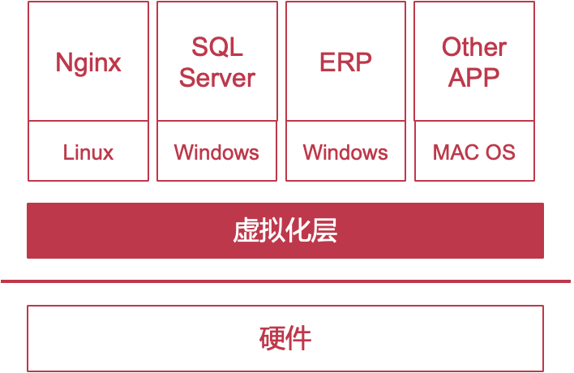

#### 虚拟化带来的优势

##### 服务器整合：提高资源利用率

- 单个物理机资源利用率低: CPU利用率通常仅<20%
- 利用系统虚拟化进行资源整合: 一台物理机同时运行多台虚拟机
- 显著提升物理机资源利用率
- 显著降低云服务提供商的成本

##### 方便程序开发

- 调试操作系统
  - 单步调试操作系统
  - 查看当前虚拟硬件的状态
    - 寄存器中的值是否正确
    - 内存映射是否正确
  - 随时修改虚拟硬件的状态
- 测试应用程序的兼容性
  - 可以在一台物理机上同时运行在不同的操作系统
  - 测试应用程序在不同操作系统上的兼容性

##### 简化服务器管理

- 通过软件接口管理虚拟机
  - 创建、开机、关机、销毁
  - 方便高效
- 虚拟机热迁移
  - 方便物理机器的维护和升级

## 2、什么是系统虚拟化?

#### 2.1 操作系统中的接口层次: ISA

- ISA层（Instruction Set Architecture）
- 区分硬件和软件
- 用户ISA
  - 用户态和内核态程序都可以使用
  - mov x0, sp
  - add x0, x0, #1
  - 如果用户想要调用系统的资源，system
- 系统ISA
  - 只有内核态程序可以使用
  - msr vbar_el1, x0

#### 2.2 操作系统中的接口层次: ABI

- Application Binary Interface

- 提供操作系统服务或硬件功能

- 包含用户ISA和系统调用

  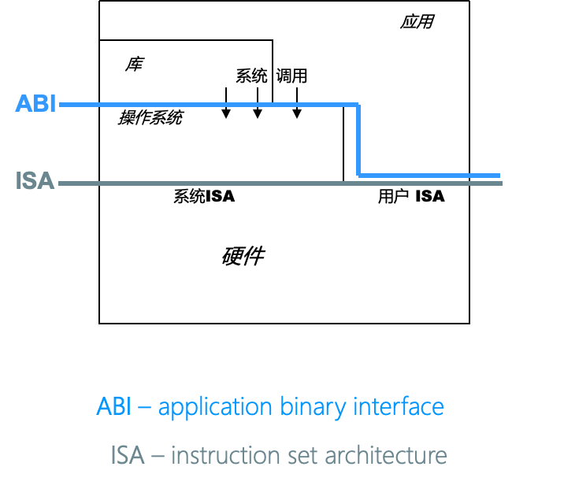

#### 2.3 操作系统中的接口层次: API

- Application Programming Interface
- 不同用户态库提供的接口
- 包含库的接口和用户ISA
- UNIX环境中的clib: 支持UNIX/C编程语言

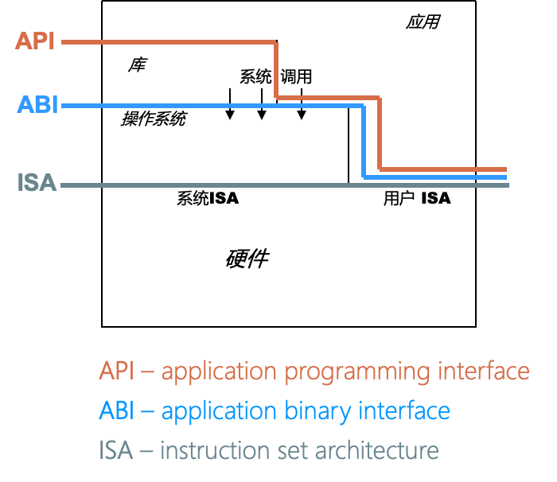

#### example：这些程序用了哪层接口

- Hello world（API）： API
- Web game：API
- Dota（ABI）
- Office 2016：ABI: underlying is OS
- Windows 10（ISA）
- Java applications（API）
- ChCore（ISA）

> ISA 提供了操作系统和Machine之间的界限

#### **虚拟机和虚拟机监控器**

虚拟机监控器 (VMM/Hypervisor)：向上层虚拟机暴露其所需要的ISA，可同时运行多台虚拟机 (VM)

#### 高效系统虚拟化的三个特性

- 为虚拟机内程序提供与该程序原先执行的硬件完全一样的接口
- 虚拟机只比在无虚拟化的情况下性能略差一点 
- 虚拟机监控器控制所有物理资源 

## 3. 虚拟机监控器的分类

#### Type-1虚拟机监控器: VMM直接运行在硬件之上

- 充当操作系统的角色
- 直接管理所有物理资源：实现调度、内存管理、驱动等功能
- 性能损失较少，例如Xen, VMware ESX Server

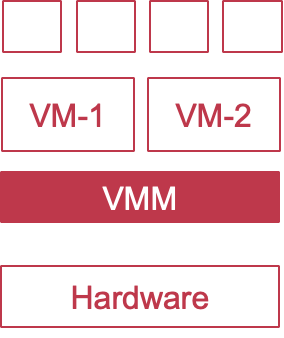

#### Type-2虚拟机监控器（基于Host OS）: VMM依托于主机操作系统

- 主机操作系统管理物理资源
- 虚拟机监控器以进程/内核模块的形态运行
- 易于实现和安装, 例如：QEMU/KVM

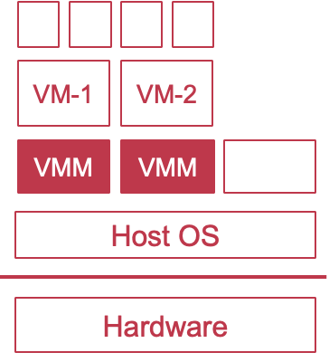

#### Type-2的优势

- 在已有的操作系统之上将虚拟机当做应用运行
- 复用主机操作系统的大部分功能
  - 文件系统
  - 驱动程序
  - 处理器调度
  - 物理内存管理

## 3. 如何实现系统虚拟化?

#### 系统ISA：操作系统运行环境

- 读写敏感寄存器: sctrl_el1、ttbr0_el1/ttbr1_el1…
- 控制处理器行为: 例如: WFI (陷入低功耗状态)
- 控制虚拟/物理内存: 打开、配置、安装页表
- 控制外设: DMA、中断

#### 系统虚拟化的流程：Trap & Emulate

- 第一步（Trap）
  - 捕捉所有系统ISA并陷入
- 第二步（Emulate）
  - 由具体指令实现相应虚拟化
    - 控制虚拟处理器行为
    - 控制虚拟内存行为
    - 控制虚拟设备行为
- 第三步
  - 回到虚拟机继续执行

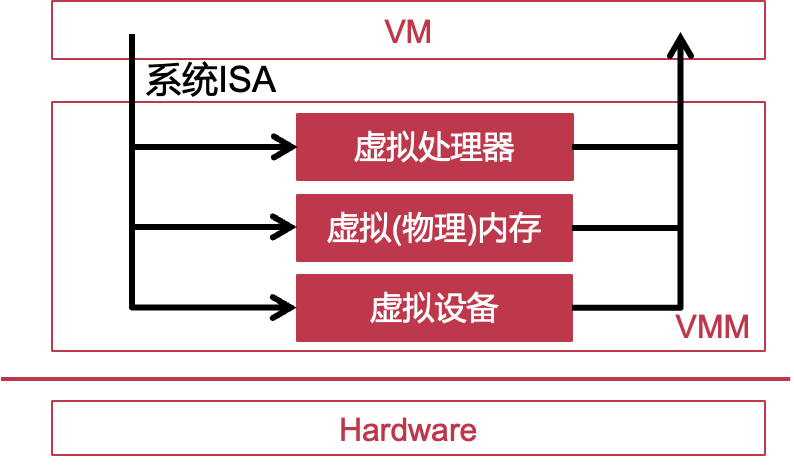

#### 系统虚拟化技术

- 处理器虚拟化
  - 捕捉系统ISA
  - 控制虚拟处理器的行为
- 内存虚拟化
  - 提供“假”物理内存的抽象
- 设备虚拟化
  - 提供虚拟的I/O设备

#### 虚拟化：一种直接的实现方法

- 把虚拟机当做应用程序
  - 将虚拟机监控器运行在EL1
  - 将客户操作系统和其上的进程都运行在EL0
  - 当操作系统执行系统ISA指令时下陷
    - 写入TTBR0_EL1
    - 执行WFI指令
    - …

### 虚拟化功能：迭代演进、分步理解

#### 第一版：支持只有内核态的虚拟机

- VM的能力
  - 只支持一个VM
  - 没有内核态与用户态的切换
  - 只有内核态，且仅运行用户ISA的指令（与用户态没有区别）
- VMM的实现
  - 处理时钟中断造成的VM Exit

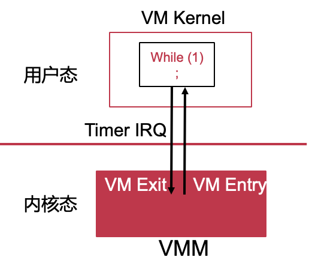

#### 第二版：虚拟机内部支持时钟中断

- VM的能力
  - 设置irq_handler
  - 开关时钟中断 (irq_bit)
  - 运行时钟中断处理函数
  
- VMM的实现
  - 捕捉VM对irq_handler的修改
  - 捕捉VM对irq_bit的修改
  - 根据irq_bit决定插入虚拟时钟中断vIRQ并调用irq_handler
  
  需要多次context save/restore
  
  - 进入VMM
  - VMM进入用户态的handler
  - 处理完之后回到VMM
  - 从VMM回到最初的用户执行

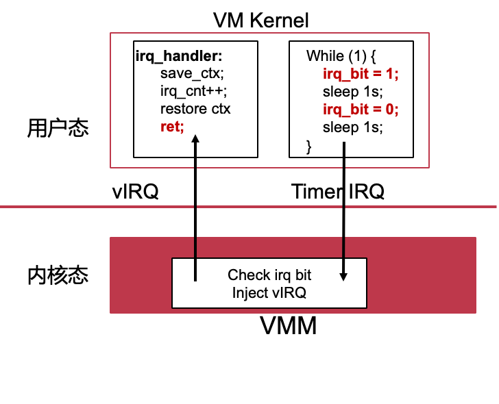

#### 第三版：虚拟机内支持运行单一用户态线程

- VM的能力
  - 虚拟机包含内核态与用户态
  - 用户态运行一个用户态线程
    - U-Thread
  - 用户态线程可调用内核syscall
  - 用户态线程可被时钟中断打断
- VMM的实现
  - 捕捉并转发U-Thread系统调用syscall
  - 转发syscall至VM内核
  - 捕捉并转发U-Thread执行时的时钟中断

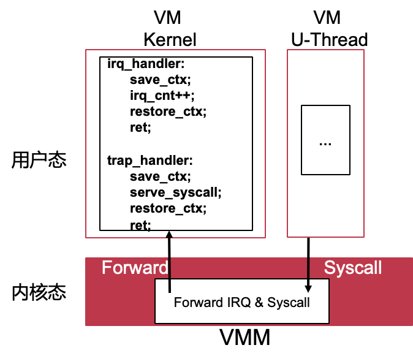

#### 第四版：虚拟机内部支持多个用户态线程

- VM的能力
  - 用户态运行多个用户态线程
  - 内核可调度用户态线程
- VMM的实现
  - 与第三版相同

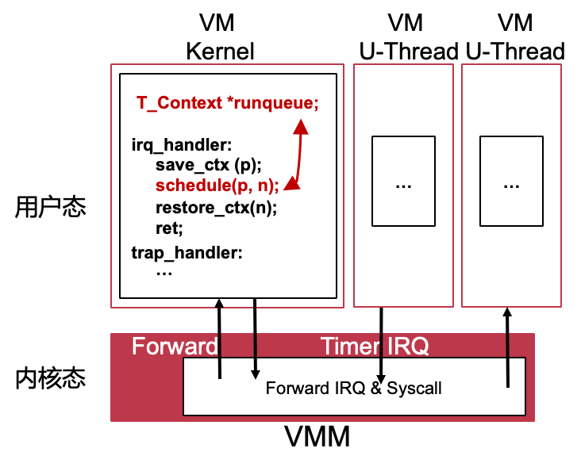

> 思考：Fork bomb是否会影响VMM？
>
> 不会，因为VVM不关心虚拟机内部线程的调度,只是给VM分配一定的资源

#### 第五版：支持多个虚拟机间的分时复用

- VM的能力
  - 支持多个VM
- VMM的实现
  - 每个VM对应一个内核线程
  - 维护VM_runqueue队列:每个元素对应一个VM的运行状态
  - 由VMM实现VM间切换:保存和恢复VM寄存器

#### 第六版：VMM支持多个物理CPU

- VM的能力
  - 与第五版相同
- VMM的实现（基于第五版）
  - 为每个pCPU维护不同的VM_runqueue，VM_runqueue保存VM的context

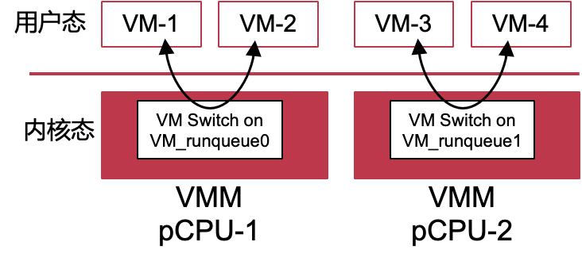

#### 第七版：虚拟机支持多个虚拟CPU

- VM的能力（与第六版的区别）
  - 虚拟机有多个Virtual CPU (vCPU)
- VMM的实现
  - 在VM_runqueue中标记出VM和vCPU的类型，在VM_runqueue保存vCPU的context

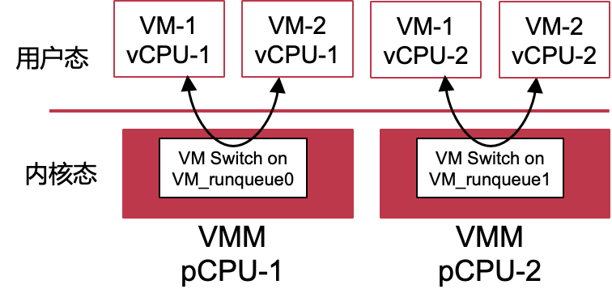

- vCPU本质上就是thread
- 如果这个时候vCPU持有spin lock，这个时候vCPU被调度走，这个时候等待拿锁的人需要等待的时候会相比非虚拟化的时候的时间更长

|        | **用户态** **ISA** | **时钟中断** | **用户线程** | **多用户线程** | **多** **虚拟机** | **多物理** **CPU** | **多虚拟** **CPU** |
| ------ | ------------------ | ------------ | ------------ | -------------- | ----------------- | ------------------ | ------------------ |
| 版本一 | √                  |              |              |                |                   |                    |                    |
| 版本二 | √                  | √            |              |                |                   |                    |                    |
| 版本三 | √                  | √            | √            |                |                   |                    |                    |
| 版本四 | √                  | √            | √            | √              |                   |                    |                    |
| 版本五 | √                  | √            | √            | √              | √                 |                    |                    |
| 版本六 | √                  | √            | √            | √              | √                 | √                  |                    |
| 版本七 | √                  | √            | √            | √              | √                 | √                  | √                  |
