# 22. 处理器虚拟化

[toc]

#### ARM不是严格的可虚拟化架构

- 敏感指令
  - 读写特殊寄存器或更改处理器状态
  - 读写敏感内存：例如访问未映射内存、写入只读内存
  - I/O指令
- 特权指令
  - 在用户态执行会触发异常，并陷入内核态

- 在ARM中：不是所有敏感指令都属于特权指令
  - 例子: CPSID/CPSIE指令
    - CPSID和CPSIE分别可以关闭和打开中断
    - 内核态执行：PSTATE.{A, I, F} 可以被CPS指令修改
    - 在用户态执行：CPS 被当做NOP指令，不产生任何效果
    - 不是特权指令

### 如何处理这些不会下陷的敏感指令？

#### 方法1：解释执行

- 使用软件方法一条条对虚拟机代码进行模拟

  - 不区分敏感指令还是其他指令
  - 没有虚拟机指令直接在硬件上执行

- 使用内存维护虚拟机状态

  - 例如：使用uint64_t x[30]数组保存所有通用寄存器的值

  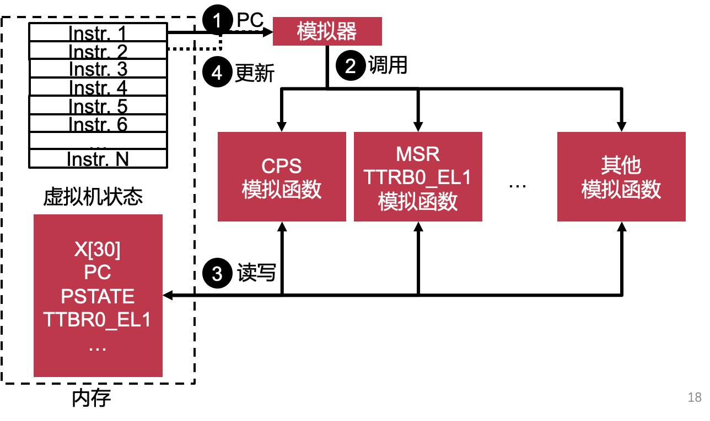

- 示例代码：

  ```c
  void CPU_Run(void)
  {
     while (1) {
        inst = Fetch(CPUState.PC);
  
        CPUState.PC += 4;
  
        switch (inst) {
        case ADD:
           CPUState.GPR[rd] = GPR[rn] + GPR[rm];
           break;
        …
        case CLI:
           CPU_CLI(); break;
        case STI:
           CPU_STI(); break;
        }
  
        if (CPUState.IRQ && CPUState.IE) {
           CPUState.IE = 0;
           CPU_Vector(EXC_INT);
        }
     }
  }
  void CPU_CLI(void)
  {
     CPUState.IE = 0;
  }
  
  
  void CPU_STI(void)
  {
     CPUState.IE = 1;
  }
  
  
  void CPU_Vector(int exc)
  {
     CPUState.LR = CPUState.PC;
     CPUState.PC = disTab[exc];
  }
  
  ```
  
- **解释执行的优缺点**

  - 优点：

    解决了敏感函数不下陷的问题
    可以模拟不同ISA的虚拟机
    易于实现、复杂度低

  - 缺点：
    非常慢：任何一条虚拟机指令都会转换成多条模拟指令

#### 方法2：二进制翻译

- 提出两个加速技术

  - 在执行前批量翻译虚拟机指令
  - 缓存已翻译完成的指令

- 使用基本块(Basic Block)的翻译粒度（为什么?）

  - 每一个基本块被翻译完后叫代码补丁

  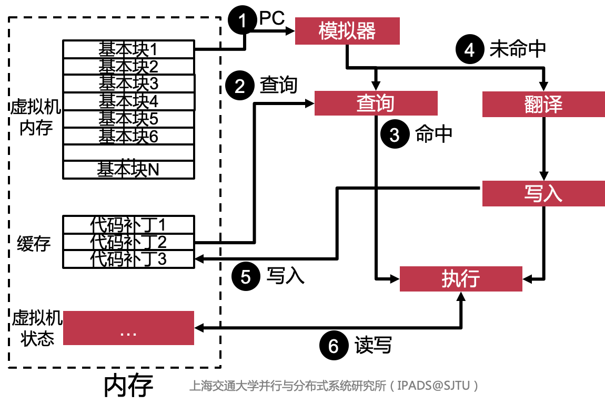

二进制翻译举例：

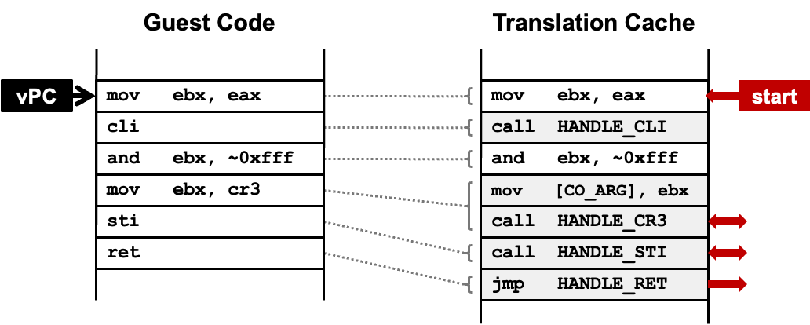

实际上是把敏感指令换成对应的函数，如果想要对于性能有优化，将函数展开

- **特点**
  - 优点：
    - 相比前一种方法更快
  - **缺点**
    - 不能处理自修改的代码(Self-modifying Code)
    - 中断插入粒度变大
      模拟执行可以在任意指令位置插入虚拟中断
      二进制翻译时只能在基本块边界插入虚拟中断（在basic block执行的过程中不会通知hypervisor）

> 动态二进制转换用于虚拟化CPU，方法是将潜在危险（或不可虚拟化）的指令序列逐一转换为安全指令序列。
>
> 它的工作原理是这样的：
>
> 1. 监视器检查下一个指令序列。指令序列通常被定义为下一个基本块，即直到下一个控制传输指令（如分支）的所有指令。可能有理由提前结束序列或越过分支，但现在让我们假设我们去下一个分支。
>
> 2. 每条指令都被翻译，翻译被复制到翻译缓存中。
>
> 3. 说明翻译如下：
>
> - 没有问题的说明可以修改后复制到翻译缓存中。我们称这些为“ident”翻译。
>
> - 一些简单的危险指令可以转换为简短的序列仿真代码。此代码直接放入翻译缓存中。我们称之为“内联”翻译。一个例子是修改中断启用标志。
> - 其他危险的指令需要通过监视器中的仿真代码来执行。对于这些说明，对显示器进行呼叫。这些被称为“呼唤”。这方面的一个例子是对页面表基础的更改。
> - 结束基本块的分支需要调用。
>
> 4. 监视器现在可以使用硬件寄存器中的虚拟寄存器跳转到翻译的基本块的开头。
>
> 因此，危险的指令可以是特权指令、不可虚拟化指令、控制流、内存访问。

#### 方法3：半虚拟化(**Para-virtualization**)

- 协同设计
  - 让VMM提供接口给虚拟机，称为Hypercall
  - 修改操作系统源码，让其主动调用VMM接口
- Hypercall可以理解为VMM提供的系统调用
  - 在ARM中是HVC指令
- 将所有不引起下陷的敏感指令替换成超级调用

- **优缺点**:
  - 对于操作系统的小修改，对于性能有很大的提高
  - 有batch的思想，多次操作一次性实现
  - 优点：
    解决了敏感函数不下陷的问题
    协同设计的思想可以提升某些场景下的系统性能, I/O等场景
  - 缺点：
    需要修改操作系统代码，难以用于闭源系统
    即使是开源系统，也难以同时在不同版本中实现

#### 方法4：硬件虚拟化（改硬件）

- x86和ARM都引入了全新的虚拟化特权级
- x86引入了root模式和non-root模式
  - Intel推出了VT-x硬件虚拟化扩展
  - Root模式是最高特权级别，控制物理资源
  - VMM运行在root模式，虚拟机运行在non-root模式
  - 两个模式内都有4个特权级别：Ring0~Ring3
- ARM引入了EL2
  - VMM运行在EL2
  - EL2是最高特权级别，控制物理资源
  - VMM的操作系统和应用程序分别运行在EL1和EL0


## 2、Intel VT-x

#### VT-x的处理器虚拟化

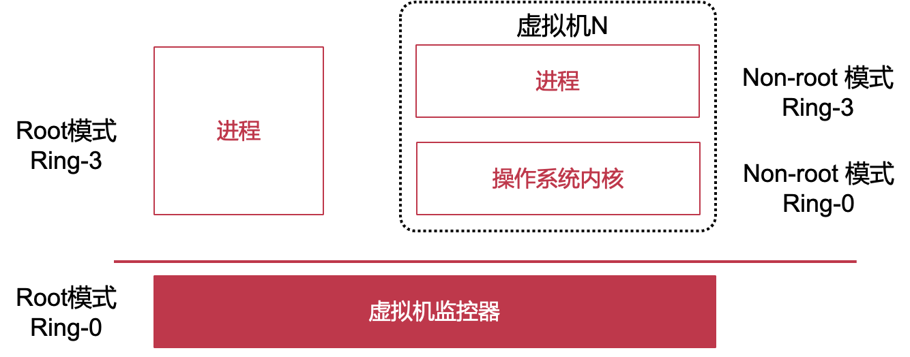

Ring-3:用户态，Ring-0:内核态

|        | Root(Visor) | Non Root(VM) |
| ------ | ----------- | ------------ |
| User   | Tools       | Guest App    |
| Kernel | VMM         | Guest OS     |

- 优化： no-root kernel配置页表，不需要通知VMM


#### Virtual Machine Control Structure (VMCS)

- VMM提供给硬件的内存页（4KB）
  - 记录与当前VM运行相关的所有状态
- VM Entry
  - 硬件自动将当前CPU中的VMM状态保存至VMCS
  - 硬件硬件自动从VMCS中加载VM状态至CPU中
- VM Exit
  - 硬件自动将当前CPU中的VM状态保存至VMCS
  - 硬件自动从VMCS加载VMM状态至CPU中


#### VT-x VMCS的内容

**包含6个部分**

- Guest-state area: 发生VM exit时，CPU的状态会被硬件自动保存至该区域；发生VM Entry时，硬件自动从该区域加载状态至CPU中
- Host-state area：发生VM exit时，硬件自动从该区域加载状态至CPU中；发生VM Entry时，CPU的状态会被自动保存至该区域
- VM-execution control fields： 控制Non-root模式中虚拟机的行为
  - syscall一般Guest OS直接可以解决，设置相应的bit可以使得syscall先到hypervisor
- VM-exit control fields：控制VM exit的行为
- VM-entry control fields：控制VM entry的行为
- VM-exit information fields：VM Exit的原因和相关信息（只读区域）


#### VT-x的执行过程

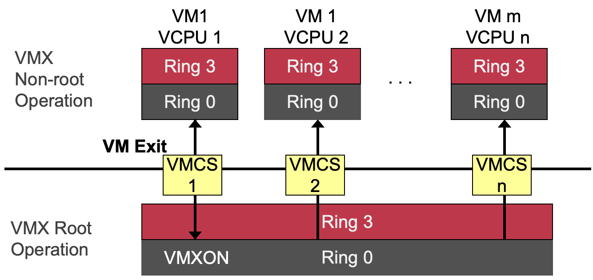

> Question: 在8个物理核，运行10台虚拟机，每台虚拟机上运行4个vCPU,需要多少VMCS?
>
> 一共需要40个，因为VMCS是为vCPU服务的

#### x86中的VM Entry和VM Exit

- VM Entry
  - 从VMM进入VM
  - 从Root模式切换到Non-root模式
  - 第一次启动虚拟机时使用VMLAUNCH指令
  - 后续的VM Entry使用VMRESUME指令
- VM Exit
  - 从VM回到VMM
  - 从Non-root模式切换到Root模式
  - 虚拟机执行敏感指令或发生事件(如外部中断)

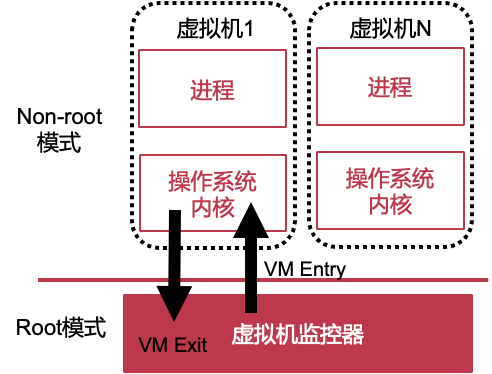

## 3. ARM的虚拟化技术

#### Overview

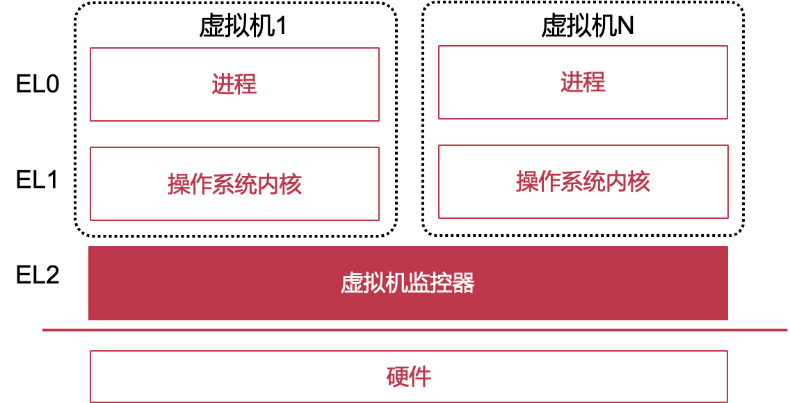

- 优点：将VM和hype visor的寄存器分开，不需要用VMCS保存寄存器

> 思考题2：ARM中没有VMCS，对于VMM的设计和实现来说有什么优缺点？
>
> 需要一个host OS来帮助完成一些功能，因此在使用host OS的时候，需要从el1—>el2->el1

#### ARM的VM Entry和VM Exit

- VM Entry
  - 使用**ERET**指令从VMM进入VM
  - 在进入VM之前，VMM需要主动加载VM状态
    - VM内状态：通用寄存器、系统寄存器、
    - VM的控制状态：HCR_EL2、VTTBR_EL2等
- VM Exit
  - 虚拟机执行敏感指令或收到中断等
  - 以Exception、IRQ、FIQ的形式回到VMM
    - 调用VMM记录在vbar_el2中的相关处理函数
  - 下陷第一步：VMM主动保存所有VM的状态

> 这里是否还是需要保存寄存器？
>
> 如果只有一个虚拟机，那么不需要保存；如果有多台虚拟机，那么因为有context switch，需要保存状态

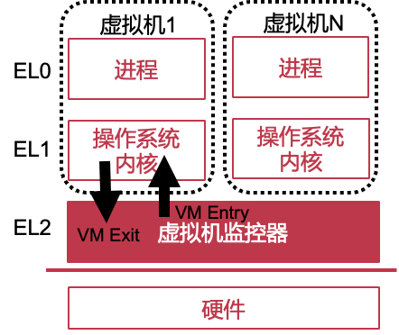

#### ARM硬件虚拟化的新功能

- ARM中没有VMCS
- VM能直接控制EL1和EL0的状态
  - 自由地修改PSTATE(VMM不需要捕捉CPS指令)
  - 可以读写TTBR0_EL1/SCTRL_EL1/TCR_EL1等寄存器
- VM Exit时VMM仍然可以直接访问VM的EL0和EL1寄存器

> 思考题1：为什么ARM中可以不需要VMCS？
>
> 在ARM架构中，虚拟机可以通过访问虚拟化扩展提供的寄存器和功能来与VMM进行交互。这些寄存器提供了访问虚拟机状态所需的信息，例如虚拟机的控制寄存器、虚拟中断控制器等。因此，在ARM架构中，并不需要像x86架构中的VMCS那样使用中央数据结构来管理虚拟机的状态。
>
> 思考题2：ARM中没有VMCS，对于VMM的设计和实现来说有什么优缺点？
>
> 在ARM架构中，没有像Intel x86架构中的VMCS（Virtual Machine Control Structure）那样的专门硬件机制来支持虚拟机监视器（VMM）的设计和实现。这导致了一些在设计和实现ARM虚拟化解决方案时的优缺点。
>
> 优点：
> 1. 简化设计：缺少VMCS可以使VMM的设计相对简化。VMCS是一个复杂的数据结构，它跟踪和管理虚拟机的状态，需要处理各种VMCS字段、数据结构和事件，而在ARM中，VMM可以避免这些复杂性。
> 2. 系统调用开销较小：在x86架构中，VMM需要通过VMCS来截获和处理虚拟机中的系统调用，这会引入额外的开销。在ARM中，由于缺少类似的机制，VMM可以直接处理系统调用，从而减少了系统调用的开销。
>
> 缺点：
> 1. 虚拟化性能：由于缺少VMCS等硬件支持，ARM虚拟化解决方案可能在性能方面受到一定的影响。在x86架构中，VMCS的存在可以提供一些硬件加速，从而改善虚拟化的性能。
> 2. 设备虚拟化的挑战：在x86架构中，VMCS可以用于设备虚拟化，通过直接分配给虚拟机的设备模拟硬件的行为。在ARM中，由于缺少类似的机制，设备虚拟化可能需要更多的软件技术和复杂性。
>
> 总体而言，ARM架构中缺少VMCS等硬件支持对于VMM的设计和实现带来了一些简化的优势，但也可能导致性能和设备虚拟化方面的挑战。在ARM虚拟化解决方案中，需要依靠软件技术和优化来克服这些挑战，并在性能和功能上提供满足需求的解决方案。

#### HCR_EL2寄存器简介

- HCR_EL2：VMM控制VM行为的系统寄存器
  - VMM有选择地决定VM在某些情况时下陷
  - 和VT-x VMCS中VM-execution control area类似
- 在VM Entry之前设置相关位，控制虚拟机行为
  - TRVM(32位)和TVM(26位): VM读写内存控制寄存器是否下陷，例如SCTRL_EL1、TTBR0_EL1
  - TWE(14位)和TWI(13位)：执行WFE和WFI指令是否下陷
  - AMO(6位)/IMO(5位)/FMO(4位)：Exception/IRQ/FIQ是否下陷
  - VM(0位): 是否打开第二阶段地址翻译

### ARM硬件虚拟化发展

#### ARMv8.0

- 增加EL2特权级
- EL2只能运行VMM，不能运行一般操作系统内核
  - OS一般只使用EL1的寄存器，在EL2中不存在对应的寄存器
    - EL1：TTBR0_EL1、TTBR1_EL1
    - EL2：TTBR_EL2
  - EL2不能与EL0共享内存
- 因此：**无法在EL2中运行Type-2虚拟机监控器的Host OS,** 或者说，Host OS需要大量修改才能运行在EL2

#### ARMv8.0中的Type-2 VMM架构

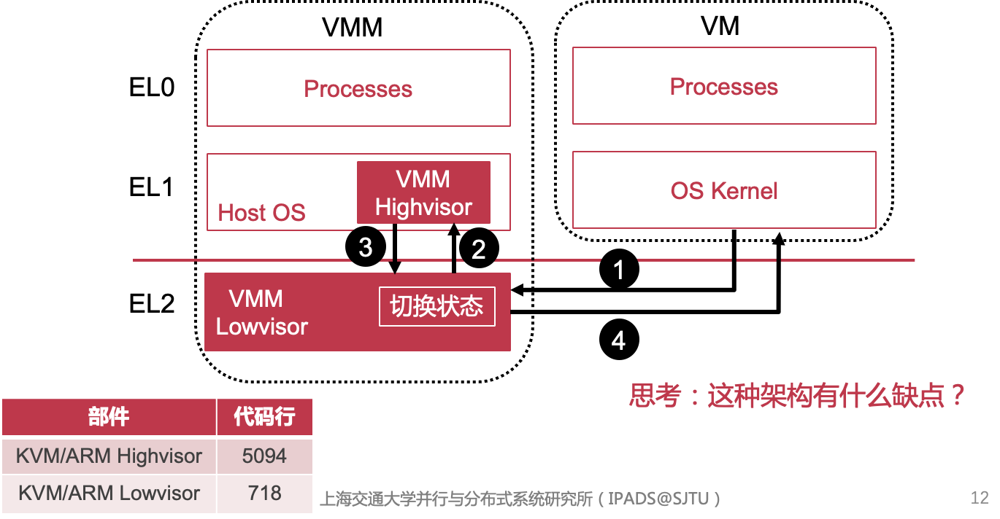

1. lowvisor的逻辑非常简单，只是无脑转发(但是也会带来开销)
2. 在进入highwisor之前需要保存状态，用内存保存EL1register

#### ARMv8.1中的Type-2 VMM架构

- ARMv8.1
  - 推出Virtualization Host Extensions(VHE)，在HCR_EL2.E2H打开
    - 寄存器映射
    - 允许与EL0共享内存
  - **使EL2中可直接运行未修改的操作系统内核（Host OS）**


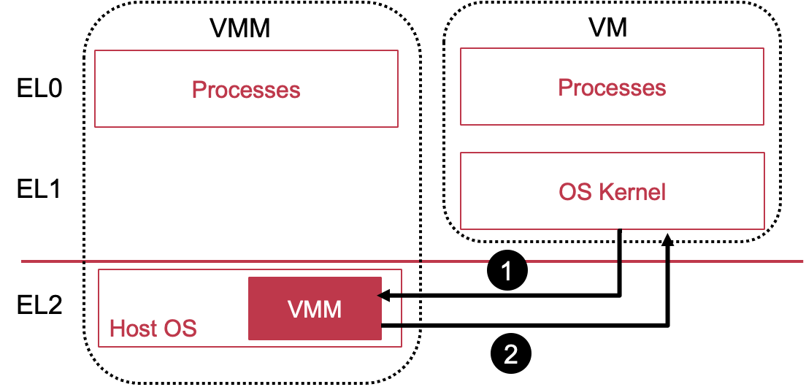

### VT-x和VHE对比

|                                    | **VT-x**       | **VHE** |
| ---------------------------------- | -------------- | ------- |
| 新特权级                           | Root和Non-root | EL2     |
| 是否有VMCS？                       | 是             | 否      |
| VM  Entry/Exit时硬件自动保存状态？ | 是             | 否      |
| 是否引入新的指令？                 | 是(多)         | 是(少)  |
| 是否引入新的系统寄存器?            | 否             | 是(多)  |
| 是否有扩展页表(第二阶段页表)?      | 是             | 是      |

#### Type-1和Type-2在VT-x和VHE下架构

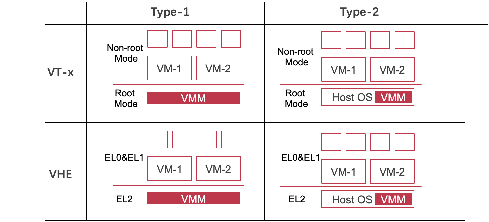


## 4. 案例：QEMU/KVM

#### QEMU/KVM架构

- **QEMU运行在用户态，负责实现策略**
  - 也提供虚拟设备的支持
- **KVM以Linux内核模块运行，负责实现机制**
  - 可以直接使用Linux的功能
  - 例如内存管理、进程调度
  - 使用硬件虚拟化功能
- 两部分合作
  - KVM捕捉所有敏感指令和事件，传递给QEMU
  - KVM不提供设备的虚拟化，需要使用QEMU的虚拟设备

- 需要两个switch case
  - KVM为QEMU提供的接口
    - KVM事件处理
- 对于QEMU而言，创建vCPU就是创建线程，KVM会为其维护一个VMCS

- **QEMU使用KVM的用户态接口**

  - **QEMU使用/dev/kvm与内核态的KVM通信**，使用ioctl向KVM传递不同的命令：CREATE_VM, CREATE_VCPU, KVM_RUN等

    ```c
    open("/dev/kvm")
    ioctl(KVM_CREATE_VM)
    ioctl(KVM_CREATE_VCPU)
    while (true) {
         ioctl(KVM_RUN)
         exit_reason = get_exit_reason();
         switch (exit_reason) {
           case KVM_EXIT_IO:  /* ... */
             break;
           case KVM_EXIT_MMIO: /* ... */
             break;
         }
    }
    ```

#### ioctl(KVM_RUN)时发生了什么

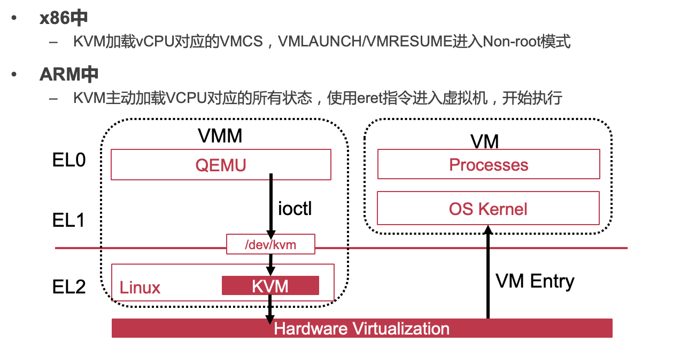

#### QEMU/KVM的流程

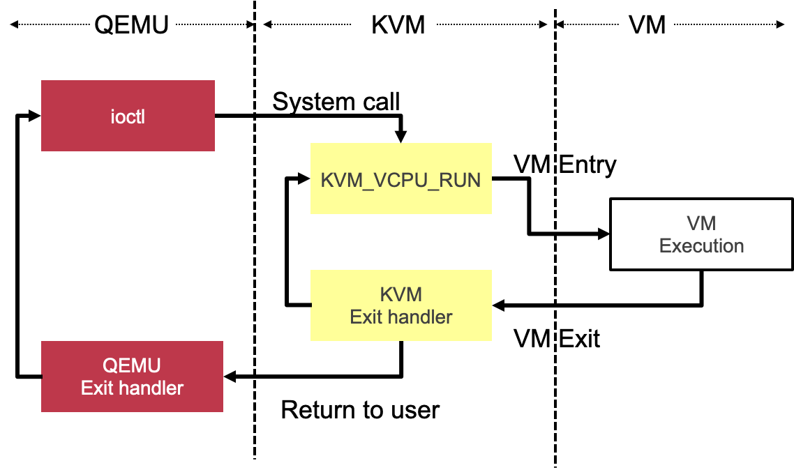

如果是时间片中断，就不需要再回到QEMU

#### WFI指令VM Exit的处理流程

> WFI代表"Wait For Interrupt"，是ARM架构中的一个指令。WFI指令用于使CPU进入低功耗待机状态，等待中断信号的到来。当执行WFI指令时，CPU会停止执行指令并进入休眠状态，只有当中断信号被触发时，CPU才会被唤醒并继续执行。

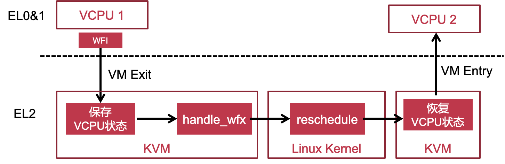

#### I/O指令VM Exit的处理流程

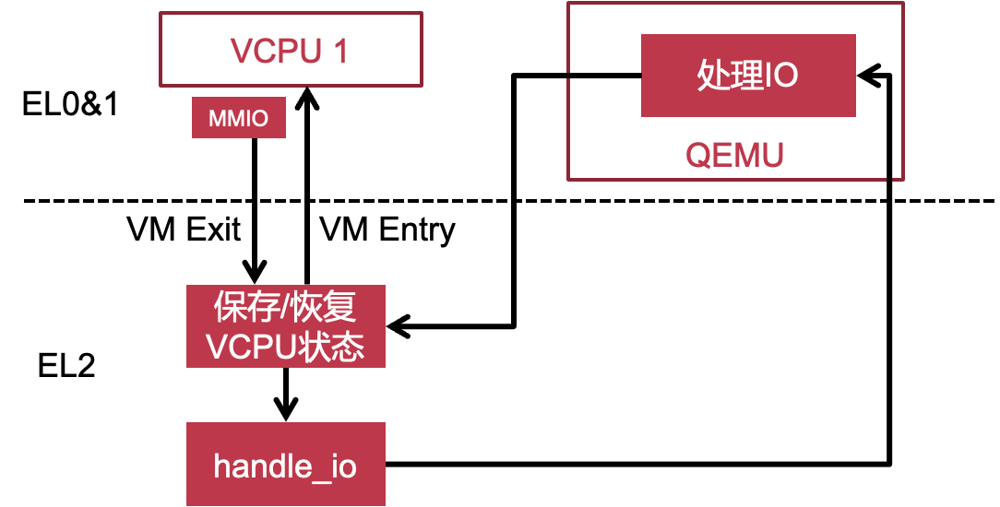

> #### QEMU和KVM分别用到了什么虚拟化技术
>
> QEMU (Quick Emulator) 和 KVM (Kernel-based Virtual Machine) 是常见的开源虚拟化解决方案。它们结合使用多种虚拟化技术来提供完整的虚拟化环境。
>
> 1. QEMU:
> QEMU 是一个功能强大的开源虚拟机监控器（Virtual Machine Monitor，VMM）。它可以模拟多种硬件架构，并提供硬件级别的虚拟化。QEMU 使用了以下虚拟化技术：
>
>    - 系统模拟：QEMU 可以模拟不同体系结构的处理器（如x86、ARM等），允许在宿主机上运行与不同体系结构兼容的客户操作系统。
>
>    - 二进制翻译：QEMU 可以将客户操作系统的指令动态翻译成宿主机上的本地指令。这种技术使得在宿主机上运行不同体系结构的客户操作系统成为可能。
>
>    - 设备模拟：QEMU 提供了对各种外部设备（如网络接口卡、磁盘控制器等）的模拟，使得客户操作系统可以与这些虚拟设备进行交互。
>
>    - 硬件加速：QEMU 可以利用宿主机上的硬件加速功能，如KVM模块，来提高虚拟化性能。
>
> 2. KVM:
>    KVM 是基于Linux内核的虚拟化技术，它通过将Linux内核转变为一个虚拟机监控器（VMM），提供硬件级别的虚拟化。KVM 使用了以下虚拟化技术：
>
>    - 硬件虚拟化扩展：KVM 利用宿主机处理器的硬件虚拟化扩展，如Intel的VT-x和AMD的AMD-V，来提供硬件级别的虚拟化支持。这些扩展使得宿主机可以直接运行客户操作系统，而不需要通过软件仿真来模拟处理器。
>
>    - 虚拟设备模拟：KVM 提供虚拟设备模拟功能，允许客户操作系统与虚拟设备进行交互。这些虚拟设备通过宿主机的驱动程序和设备模拟器来实现。
>
>    - 内核模块：KVM 以内核模块的形式存在于Linux内核中，通过将Linux内核转变为一个VMM，提供虚拟化功能。
>
> QEMU 和 KVM 的结合使用使得可以在宿主机上运行多个虚拟机实例，并为每个虚拟机提供独立的操作系统和应用程序环境。QEMU 负责虚拟硬件的模
>
> 拟和指令翻译，而 KVM 利用硬件虚拟化扩展提供更高效的虚拟化性能。这种结合提供了高度灵活性和较好的性能，使得在单个宿主机上部署和管理多个虚拟机变得更加简单和高效。
