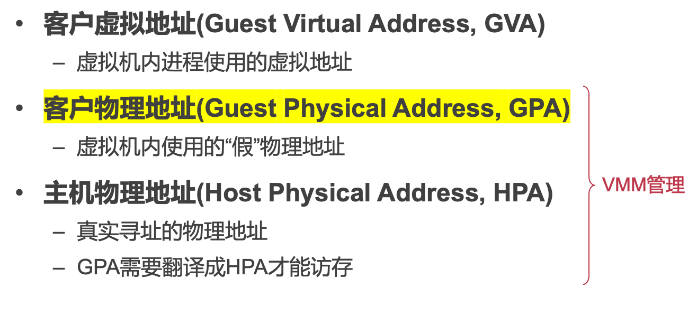
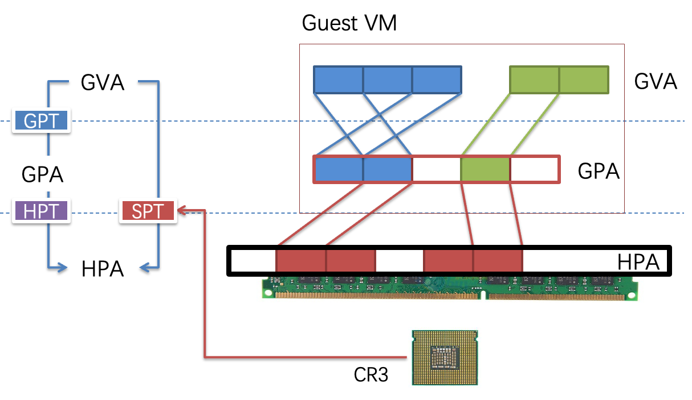
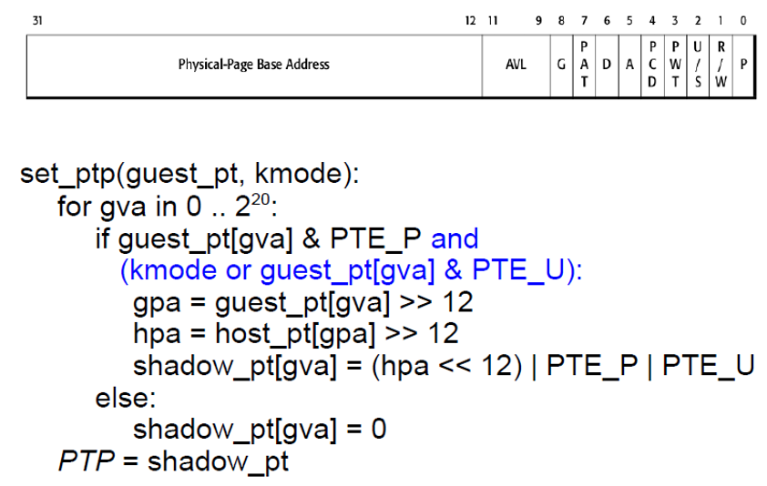
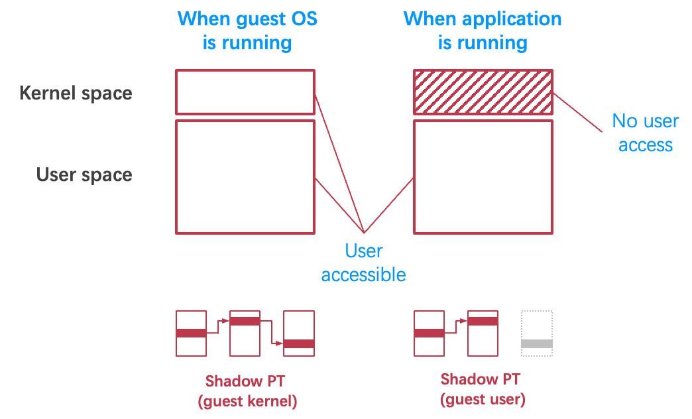
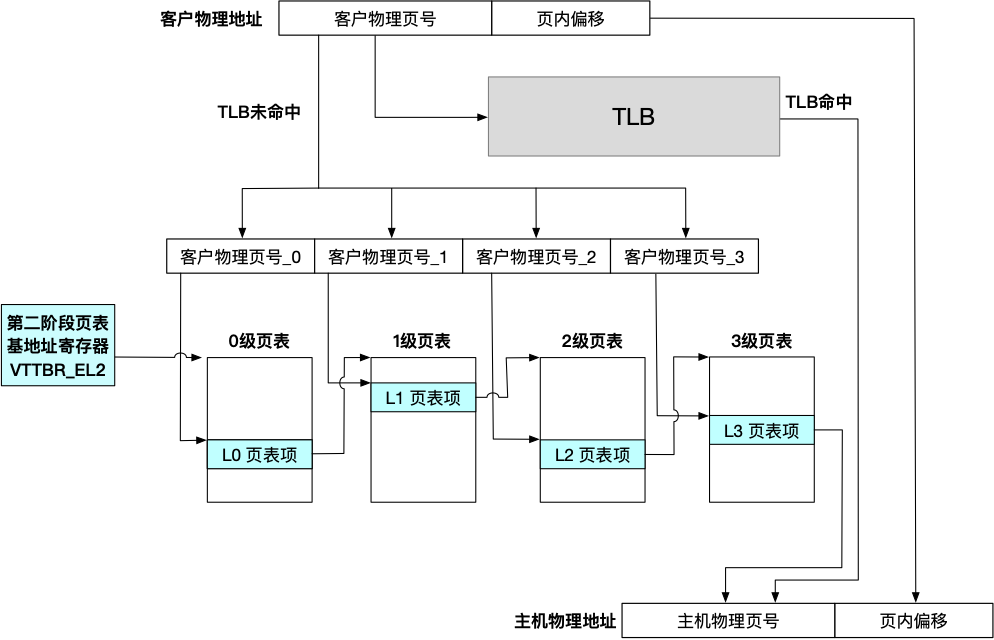
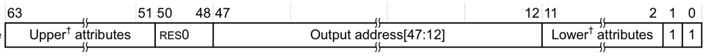
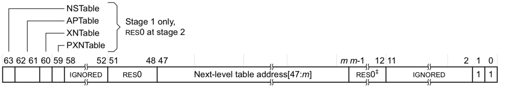
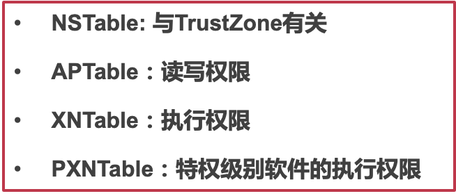
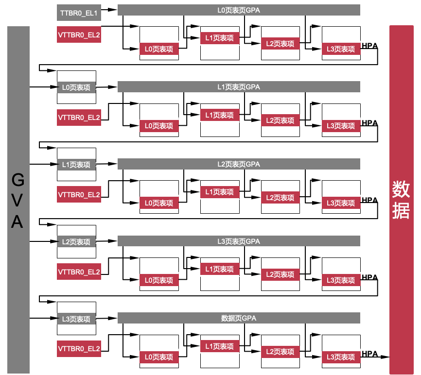

# 23. 内存虚拟化 

[toc]

## 1. 内存虚拟化

#### 为什么需要内存虚拟化?

如果VM使用的是真实物理地址:可能自己的内存被别的虚拟机读写，在正确性和安全性上无法得到保证

#### 内存虚拟化的目标

- 为虚拟机提供虚拟的物理地址空间，物理地址从0开始连续增长
- 隔离不同虚拟机的物理地址空间，VM-1无法访问其他的内存

#### 三种地址



- 客户指的是虚拟机，主机是hypervisor


### 怎么实现内存虚拟化?

1、影子页表(Shadow Page Table)
2、直接页表(Direct Page Table)
3、硬件虚拟化

#### 影子页表(Shadow Page Table)

> 影子页表是每个进程一个，HPT是每个虚拟机一个



- SPT可以直接把GVA翻译成HPA，Guest是看不到的

实现思路：

1.**VMM intercepts guest OS setting the virtual CR3**

2.**VMM iterates over the guest page table, constructs a corresponding shadow page** **table**

3.**In shadow PT, every guest physical address is translated into host physical address**

4.**Finally, VMM loads the host physical address of the shadow page** **table**

> 1.VMM拦截设置虚拟CR3的guest OS
>
> 2.VMM在guest page table上迭代，构建相应的shadow page **table**
>
> 3.在影子PT中，每个客人的实际地址都被翻译成主机的实际地址
>
> 4.最后，VMM加载阴影页表的主机物理地址

代码：

```c
set_cr3 (guest_page_table):
    for GVA in 0 to 220
        if guest_page_table[GVA] & PTE_P:
            GPA = guest_page_table[GVA] >> 12
            HPA = host_page_table[GPA] >> 12
            shadow_page_table[GVA] = (HPA<<12)|PTE_P
        else
            shadow_page_table[GVA] = 0
     CR3 = PHYSICAL_ADDR(shadow_page_table)

```

遍历所有的地址，将GPT和HPT结合起来得到GVA到HPA的映射

对于缺页异常，要trap住，具体实现：

把GPT所在的page设置为read only，这个时候需要修改的页表是SPT，因为是SPT是真正负责地址翻译的

#### Guest OS修改页表，如何生效？

- Real hardware would start using the new page table's mappings
  Virtual machine monitor has a separate shadow page table
- Goal: 
  VMM needs to intercept when guest OS modifies page table, update shadow page table accordingly
- Technique: 
  Use the read/write bit in the PTE to mark those pages read-only
  If guest OS tries to modify them, hardware triggers page fault
  Page fault handled by VMM: update shadow page table & restart guest

> - 真实硬件将开始使用新页表的映射虚拟机监视器有一个单独的影子页表
> - 目标：
>    VMM需要拦截guest OS修改页表，相应更新shadow页表
> - 技术：
>    使用 PTE 中的读/写位将这些页面标记为只读
>    如果客户操作系统试图修改它们，硬件会触发页面错误
>    VMM 处理的Page fault：更新影子页表并重启客户机

#### Guest内核如何与Guest应用隔离？

- How do we selectively allow / deny access to kernel-only pages in guest PT? 
  - Hardware doesn't know about the virtual U/K bit 
- Idea: 
  - Generate two shadow page tables, one for U, one for K
  - When guest OS switches to U mode, VMM must invoke set_ptp(current, 0)

##### 构建2个不同的Guest Pages



##### Two Memory Views of Guest VM



#### 2、Direct Paging (Para-virtualization)

- Modify the guest OS
  - No GPA is needed, just GVA and HPA
  - Guest OS directly manages its HPA space
  - Use hypercall to let the VMM update the page table（batch，批量化，效率更高，缺点是不够透明）
  - The hardware CR3 will point to guest page table
- VMM will check all the page table operations
  - The guest page tables are read-only to the guest

- 存在权限问题：无法设置权限
- 解决方案：Guest对于页表只有只读权限，在修改页表的时候需要经过VMM的检查
- Positive
  Easy to implement and more clear architecture
  Better performance: guest can batch to reduce trap
- Negatives
  Not transparent to the guest OS
  The guest now knows much info, e.g., HPA
  May use such info to trigger rowhammer attacks

> Rowhammer: 频繁写相邻的VM的memory，导致此VM的memory的bit被flip，内容被修改，这个可能是关键的内容，比如页表的权限


#### 3、硬件虚拟化对内存翻译的支持

- Intel VT-x和ARM硬件虚拟化都有对应的内存虚拟化
  - Intel Extended Page Table (EPT)
  - ARM Stage-2 Page Table (第二阶段页表)
- 新的页表
  - 将GPA翻译成HPA
  - 此表被VMM直接控制
  - 每一个VM有一个对应的页表

- 第一阶段页表：虚拟机内虚拟地址翻译（GVA->GPA）
- 第二阶段页表：虚拟机客户物理地址翻译（GPA->HPA）


#### 第二阶段四级页表



##### VTTBR_EL2

- 存储虚拟机第二阶段页表基地址，只有1个寄存器：VTTBR_EL2
- 对比第一阶段页表
  - 有2个页表基地址寄存器：TTBR0_EL1、TTBR1_EL1
  - VMM在调度VM之前需要在VTTBR_EL2中写入此VM的第二阶段页表基地址
- 第二阶段页表使能：HCR_EL2第0位

#### 第二阶段页表项

- 第3级页表页中的页表项：与第一阶段页表完全一致



- 第0-2级页表页中的页表项：与第一阶段在高位有不同





#### 二十四次内存访问

> 在传统的页表中，如果是4级页表，访问内存中的内容需要4次访存
>
> 但是在两阶段页表中，需要24次访存（读TTBR0_EL1无需内存访问），一级页表里面都是存着GPA，需要翻译成HPA才能真正访存



#### 提高性能的方式：TLB缓存地址翻译结果

- 回顾：TLB不仅可以缓存第一阶段地址翻译结果
- TLB也可以第二阶段地址翻译后的结果
  - 包括第一阶段的翻译结果(GVA->GPA)
  - 包括第二阶段的翻译结果(GPA->HPA)
  - 大大提升GVA->HPA的翻译性能：不需要24次内存访问
- 切换VTTBR_EL2时
  - 理论上应将前一个VM的TLB项全部刷掉
  - 可以只清空当前进程的
  - 刷TLB相关指令
    清空全部：TLBI VMALLS12E1IS 
    清空指定GVA：TLBI VAE1IS
    清空指定GPA：TLBI IPAS2E1IS 
  - VMID (Virtual Machine IDentifier)
    VMM为不同进程分配8/16 VMID，将VMID填写在VTTBR_EL2的高8/16位
    VMID位数由VTCR_EL2的第19位（VS位）决定
    避免刷新上个VM的TLB

#### 如何处理缺页异常

- 两阶段翻译的缺页异常分开处理
- 第一阶段缺页异常
  - 直接调用VM的Page fault handler
  - 修改第一阶段页表不会引起任何虚拟机下陷
- 第二阶段缺页异常
  - 虚拟机下陷，直接调用VMM的Page fault handler

#### 第二阶段页表的优缺点

- 优点
  - VMM实现简单
  - 不需要捕捉Guest Page Table的更新
  - 减少内存开销：每个VM对应一个页表
- 缺点
  - TLB miss时性能开销较大

#### 如何实现虚拟机级别的内存换页？

- 具体场景：将虚拟机A的128MB内存转移到虚拟机B中
  - 虚拟机A对内存的使用较少
  - 虚拟机B对内存需求较大
- 问题
  - VMM无法识别虚拟机内存的语义
  - 两层内存换页机制
    - VM与VMM的换页机制可能彼此冲突，造成开销。

- 解决方案： ==内存气球机制==（具体内容是什么？看书！！！）

- 内存气球机制的缺点：速度慢