# 24. I/O虚拟化

[toc]

#### 为什么需要I/O虚拟化

举例：如果VM直接管理物理网卡，

- **正确性问题**：所有VM都直接访问网卡
  所有VM都有相同的MAC地址、IP地址，无法正常收发网络包
- **安全性问题**：恶意VM可以直接读取其他VM的数据
  除了直接读取所有网络包，还可能通过DMA访问其他内存

#### I/O虚拟化的目标

- 为虚拟机提供虚拟的外部设备
  - 虚拟机正常使用设备
- 隔离不同虚拟机对外部设备的直接访问
  - 实现I/O数据流和控制流的隔离
- 提高物理设备的利用资源
  - 多个VM同时使用，可以提高物理设备的资源利用率

## 怎么实现I/O虚拟化?

### 1、设备模拟（Emulation）

- OS与设备交互的硬件接口
  模拟寄存器(中断等)
  捕捉MMIO操作
- 硬件虚拟化的方式
  硬件虚拟化捕捉PIO指令
  MMIO对应内存在第二阶段页表中设置为invalid

> VMM为VM提供一段设备对应的虚拟设备地址，但是在访问这段地址的时候，会触发page fault，VMM处理对于设备的操作，设备处理完成后，中断会发送到VMM，VMM再发送一个中断给VM

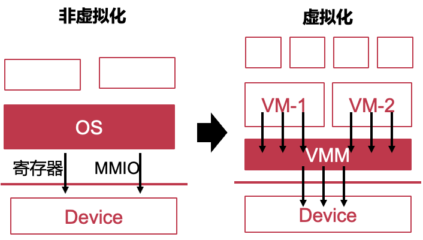

#### 例：QEMU/KVM设备模拟

以虚拟网卡举例——发包过程：

Qemu：HVA-> HPA

VM: GPA->HPA

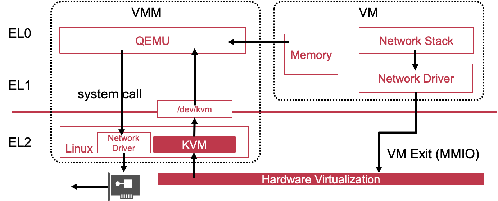

以虚拟网卡举例——收包过程：

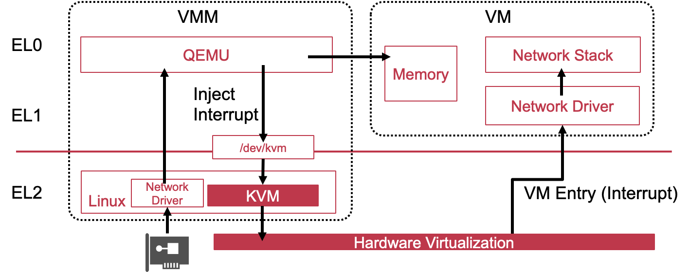

#### **设备模拟的优缺点**

- 优点
  - 可以模拟任意设备：选择流行设备，支持较“久远”的OS（如e1000网卡）
  - 允许在中间拦截（Interposition）:例如在QEMU层面检查网络内容
  - 不需要硬件修改
- 缺点
  - 性能不佳

### 方法2：半虚拟化方式

- 协同设计
  - 虚拟机“知道”自己运行在虚拟化环境
  - 虚拟机内运行前端(front-end)驱动
  - VMM内运行后端(back-end)驱动
- VMM主动提供Hypercall给VM
- 通过共享内存传递指令和命令

> 快的原因：半虚拟化带来的批量处理的好处

#### VirtIO: Unified Para-virtualized I/O

- **标准化的半虚拟化I/O框架**
  - 通用的前端抽象
  - 标准化接口
  - 增加代码的跨平台重用

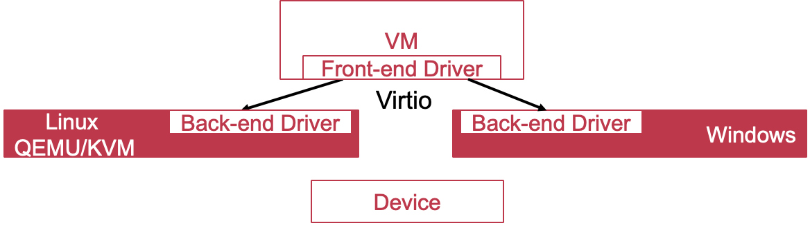

#### Virtqueue

- **VM和VMM之间传递I/O请求的队列**
- 3个部分
  - Descriptor Table：其中每一个descriptor描述了前后端共享的内存，链表组织
  - Available Ring：可用descriptor的索引，Ring Entry指向一个descriptor链表
  - Used Ring：已用descriptor的索引

#### 例：QEMU/KVM半虚拟化

##### 发网络包

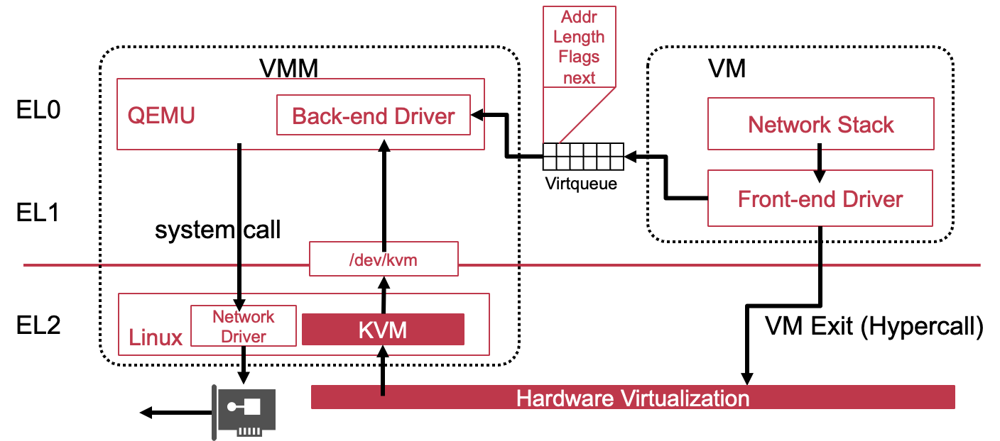

##### 收网络包

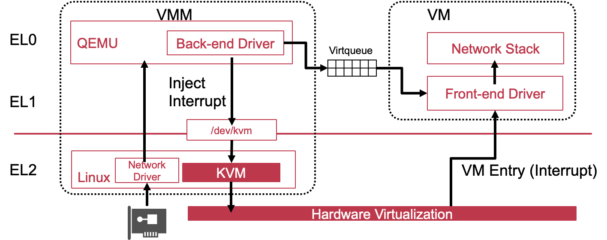

#### 半虚拟化方式的优缺点

- 优点
  - 性能优越：多个MMIO/PIO指令可以整合成一次Hypercall
  - VMM实现简单，不再需要理解物理设备接口
- 缺点
  - 需要修改虚拟机操作系统内核

### 方法3：设备直通（性能最好）

**虚拟机直接管理物理设备**

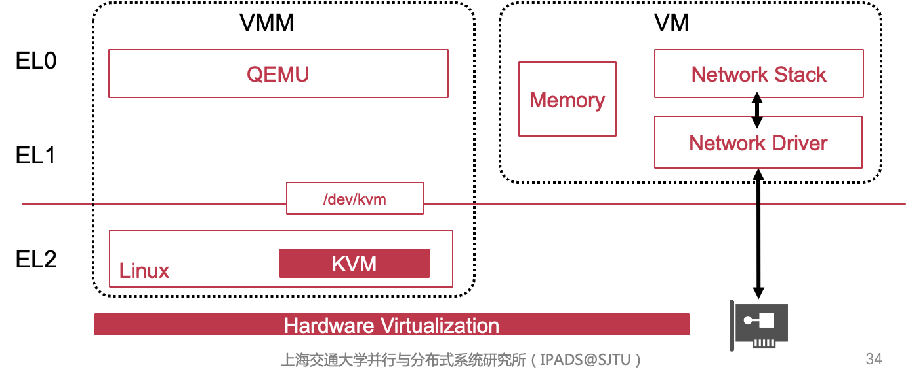

#### 问题1：**DMA** **恶意读写内存**，操作物理地址绕开了翻译时的检查

- 解决方案：使用IOMMU (VMM提供，在启动虚拟机的时候就确定了)

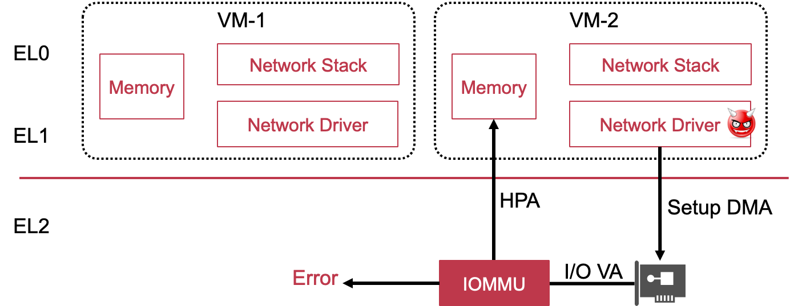

##### IOMMU与MMU：

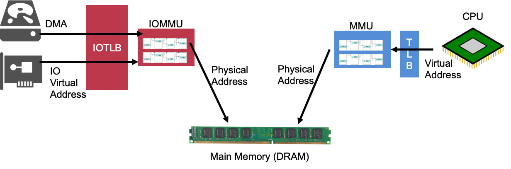

##### ARM SMMU

- SMMU是ARM中IOMMU的实现：System MMU
- SMMU的设计与AARCH64 MMU一致
  - 也存在两阶段地址翻译
  - 第一阶段：OS为进程配置：IOVA->GPA
  - 第二阶段：第一阶段翻译完之后进行第二阶段，VMM为VM配置：GPA->HPA 

#### 问题2：设备独占

- Scalability不够：设备被VM-1独占后，就无法被VM-2使用：如果一台物理机上运行16个虚拟机，必须为这些虚拟机安装16个物理网卡

#### 解决方案：Single Root I/O Virtualization (SR-IOV)

- SR-IOV是PCI-SIG组织确定的标准
- **满足SRIOV标准的设备，在设备层实现设备复用**
  - 能够创建多个Virtual Function(VF)，每一个VF分配给一个VM，负责进行数据传输，属于数据面（Data-plane）
  - 物理设备被称为Physical Function(PF)，由Host管理，负责进行配置和管理，属于控制面（Control-plane）
- 设备的功能
  - 确保VF之间的数据流和控制流彼此不影响

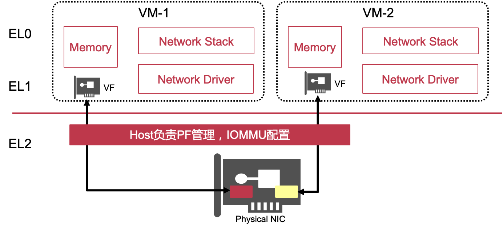

#### 设备直通的优缺点

- 优点
  - 性能优越
  - 简化VMM的设计与实现
- 缺点
  - 需要特定硬件功能的支持（IOMMU、SRIOV等）
  - 不能实现Interposition：难以支持虚拟机热迁移

#### I/O虚拟化技术对比

|                  | **设备模拟** | **半虚拟化**         | **设备直通** |
| ---------------- | ------------ | -------------------- | ------------ |
| 性能             | 差           | 中                   | 好           |
| 修改虚拟机内核   | 否           | 驱动+修改            | 安装VF驱动   |
| VMM复杂度        | 高           | 中                   | 低           |
| Interposition    | 有           | 有                   | 无           |
| 是否依赖硬件功能 | 否           | 否                   | 是           |
| 支持老版本OS     | 是           | 有的支持，有的不支持 | 否           |

在实际的应用中，其实是多种方式复用的

Interposition：抽象能力， 设备直通中hypervisor不参与，因此抽象能力比较弱

### 中断虚拟化

- VMM在完成I/O操作后通知VM
  - 例如在DMA操作之后
- VMM在VM Entry时插入虚拟中断
  - VM的中断处理函数会被调用
- 虚拟中断类型
  - 时钟中断
  - 核间中断
  - 外部中断

#### ARM中断虚拟化的实现方法

- 打断虚拟机执行
  - 通过List Register插入
- 不打断虚拟机执行
  - 通过GIC ITS插入

#### Virtual CPU Interface

- GIC为虚拟机提供的硬件功能
- VM通过Virtual CPU Interface与GIC交互
- VMM通过Physical CPU Interface与GIC交互

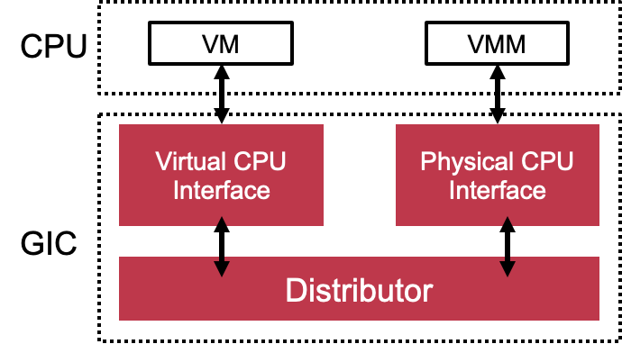

#### **插入虚拟中断：以半虚拟化举例**

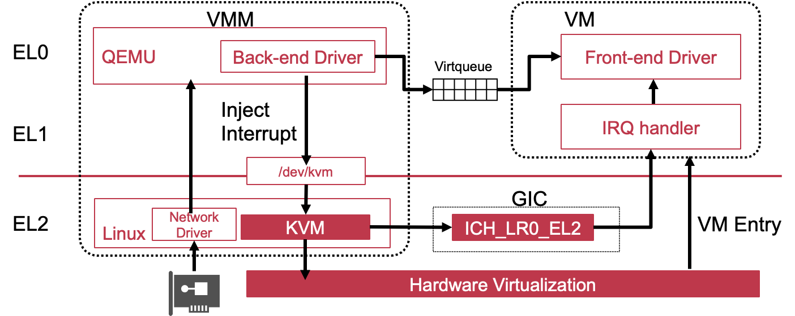

问题：要打断虚拟机执行

#### 不打断虚拟机执行：GIC ITS

- GIC第4版本推出了Direct injection of virtual interrupts 
  - 将物理设备的物理中断与虚拟中断绑定
  - 物理设备直接向虚拟机发送虚拟中断
- VMM在运行VM前
  - 配置GIC ITS (Interrupt Translation Service)
    - 建立物理中断与虚拟中断的映射
  - 映射内容
    - 设备与物理中断的映射
    - 分配虚拟中断号
    - 发送给哪些物理核上的虚拟处理器

#### 虚拟中断的直接插入

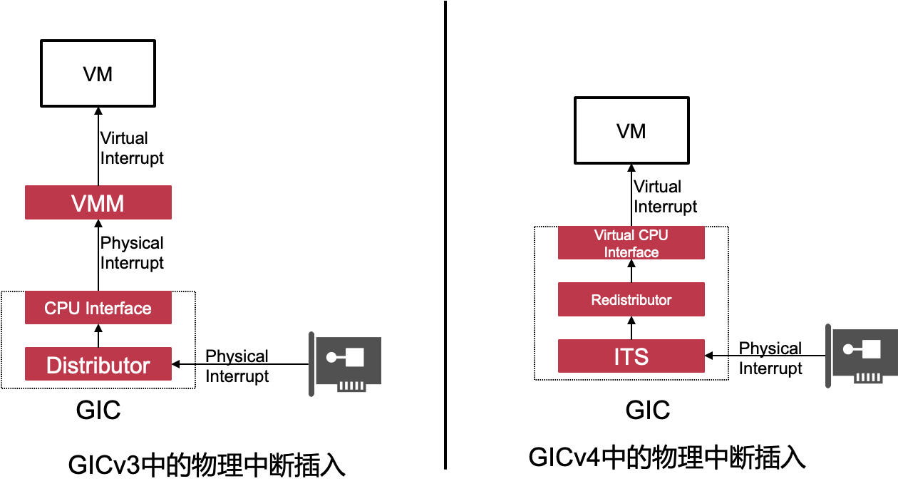

- GICv4目前在服务器上基本上没有实现

- 但是非常有前景
