# 25. 机密虚拟化

#### background：当虚拟机监控器不可信

- 系统的复杂性
  - 软件：恶意软件，虚拟机监控器本身可能存在漏洞
  - 人：运维外包（如云计算等）导致接触计算机的人更复杂
- 不可信的虚拟机监控器
  - 可以查看任意虚拟机的vCPU寄存器、内存内容、I/O数据
  - 可以修改虚拟机的状态
    - VMM控制着页表，可直接映射虚拟机的内存并读取数据
  - 可以控制虚拟机的行为
    - VMM控制着页表，可直接在应用内部新映射一段恶意代码
    - VMM可任意改变虚拟机的RIP，劫持其执行流

#### 虚拟机监控器漏洞的危害

- 虚拟机提权(Privilege Escalation)
- 隐私数据泄露(Data Leakage)
- 拒绝服务攻击(Denial of Service)

#### 一种新的威胁模型：安全处理器

- **不信任CPU外的硬件**
  包括内存（DRAM）、设备、网络
- **仅信任CPU**
  包括cache、所有计算逻辑（Anyway，总得信任CPU吧...）
- **Enclave（飞地）**
  又称为可信执行环境，TEE（Trusted Execution Environment），将管理资源和安全解耦了，VMM不能管理这个VM

#### Enclave/TEE：可信执行环境

- Enclave/TEE的定义
  - Enclave，又称"可信执行环境" （TEE，Trusted Execution Environment），是计算机系统中一块通过底层软硬件构造的安全区域，通过保证加载到该区域的代码和数据的完整性和隐私性，实现对代码执行与数据资产的保护 —— Wikipedia
- Enclave的两个主要功能
  - 远程认证：验证远程节点是否为加载了合法代码的Enclave
  - 隔离运行：Enclave外无法访问Enclave内部的数据
- Enclave带来的能力：限制访问数据的软件
  - 可保证数据只在提前被认证的合法节点间流动
    - 合法节点：部署了合法软件的节点

#### 硬件Enclave提供不同粒度的隔离环境

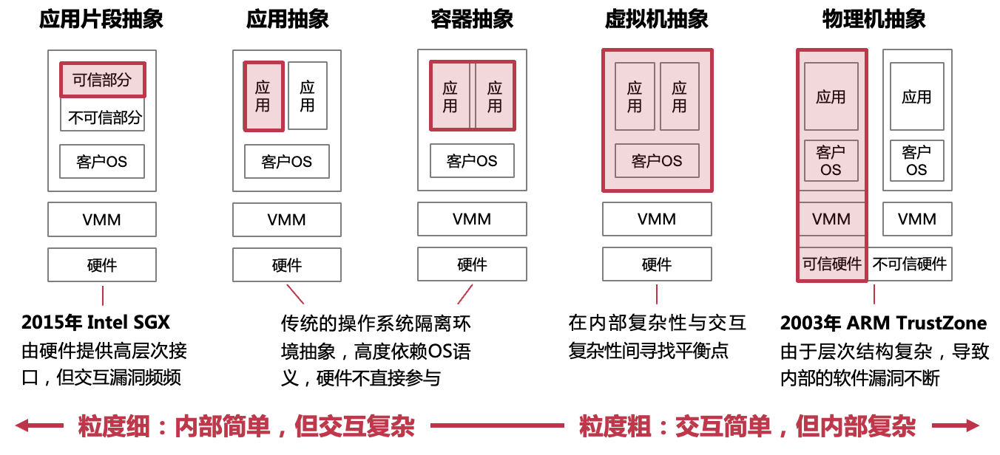

> 现阶段是硬件特性爆发阶段，各家的硬件还没有完全形成合适的、统一的隔离抽象。ARM提出的隔离是物理机粒度、Intel提出的则是非常细粒度的应用片段隔离。
>
> 这是两个极端，粒度细的优点是内部逻辑简单，但内外交互的接口很复杂，因为具有高层语义；而粒度粗则相反，交互接口很底层、很简单，但隔离环境内部的层次多，所以逻辑复杂。
>
> 在2013年，我们提出了一种基于加密内存保护的虚拟机抽象，（交互内容比较少，只有一些page fault，hypercall等）在内部复杂性与交互复杂性之间找到一个平衡点。

### **机密虚拟化** Overview

- 一种通过基于硬件的可信执行环境来保护虚拟机数据的机制和方法
  - 保护虚拟机免受不可信虚拟机监控器和管理员的威胁
- 关键技术
  - 虚拟机内部与外部的隔离
  - 内存加密和完整性保护
  - 远程验证

#### 可信固件

>  在VM和VMM之间增加的一层，使得VM不能直接访问VMM

- 由CPU厂商开发的可信软件，比虚拟机监控器的特权级更高
- 可信固件能够访问所有物理资源，对系统进行配置并提供保护机制

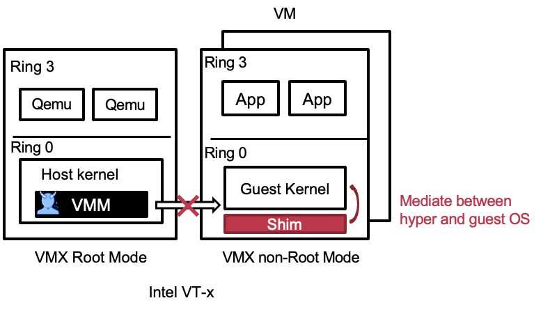

#### 内存隔离机制

> **机密虚拟机的内存范围不能被其他虚拟机和虚拟机监控器访问**

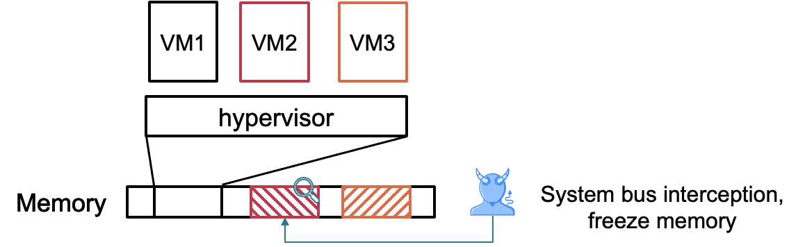

#### 硬件内存加密与保护机制

- 硬件加密保护隐私性
  - CPU外皆为密文，包括内存、存储、网络等
  - CPU内部为明文，包括各级Cache与寄存器
  - 数据进出CPU时，由进行加密和解密操作
- 硬件Merkle Tree保护完整性
  - 对内存中数据计算一级hash，对一级hash计算二级hash，形成树
  - CPU内部仅保存root hash，其它hash保存在不可信的内存中
  - 当内存中的数据被修改时，更新Merkle Tree

#### 硬件内存加密

- 方法一：单密钥加密
  - 缺点：同样的明文会产生同样的密文(隐私性不好)
- 方法二：多密钥加密
  - 缺点：如何保存这些密钥？CPU内部放不下
- 方法三：单密钥 + 多 seed
  - 为每个cache line单独生成一个seed，用密钥加密后，对数据进行异或

##### 生成seed用于加密

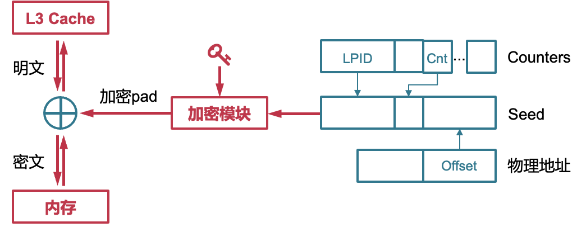

> seed可以提前算好，只要有数据来做异或就好；加密是根据地址的

### 内存完整性保护

目标：

> 内存数据的完整性保护：机密虚拟机的内存数据不可被恶意修改
> 内存映射的完整性保护：机密虚拟机的第二阶段页表映射不可被恶习改变

#### Merkle hash Tree

- 可以保证内存不会受到拼接和欺骗攻击
  - 不知道hash key无法计算对应的mac
- 无法防御回放攻击
  - 攻击者可以将mac和data同时替换成老版本
- 将root hash (mac) 存储在CPU中
  - 防御回放攻击
    - 攻击者无法修改root mac的值
    - 如果修改了内存，向上回溯计算的时候会修改root的值，因此会被发现
- 缺点：支持不了太多的内存

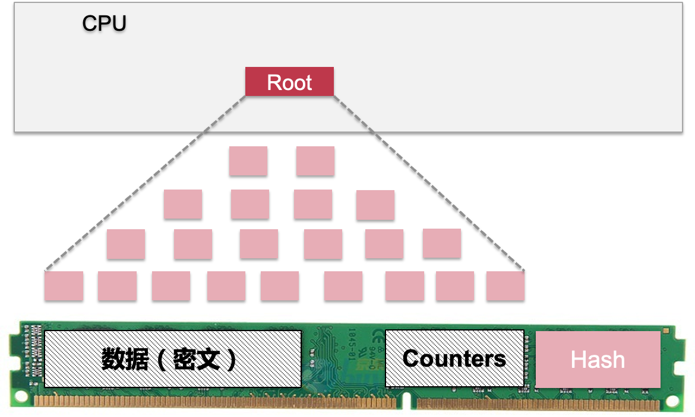

#### 远程验证（Remote Attestation）

要解决的问题：如何远程判断某个主体是机密虚拟机？

- 例如，如何判断某个在云端的服务运行环境是安全的
- 必须在认证之后，再进行下一步的操作，例如发送数据

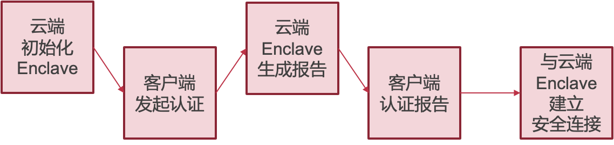

- 客户发起认证，会发送一个随机数给云端
- 云端会用这个随机数hash之后，加密内存、CPU等信息，连同数字签名一起，送会给客户端

## 机密虚拟化案例分析：ARM CCA

> ARM CCA (ARM Cryptocell-713A) 是 ARM 公司推出的一款面向嵌入式设备的安全子系统。它提供了一系列硬件和软件组件，用于实现安全性和加密功能，帮助保护嵌入式设备中的敏感数据和应用程序。
>
> ARM CCA 的主要特性和组件包括：
>
> 1. 安全处理器核心：ARM CCA 集成了一个安全处理器核心，专门用于执行安全功能和保护关键数据。该核心具有独立的安全状态和内存空间，隔离安全和非安全代码的执行环境。
>
> 2. 加密引擎：ARM CCA 提供了硬件加速的加密引擎，支持各种常见的加密算法，如对称加密算法（如AES）、哈希算法（如SHA-256）、公钥加密算法（如RSA）等。这些硬件加速模块可以提供高效的加密和解密性能。
>
> 3. 安全存储：ARM CCA 提供了安全存储功能，可用于存储敏感数据，如密钥、证书和安全配置信息。这些存储区域受到硬件保护，防止非授权访问和篡改。
>
> 4. 安全启动和认证：ARM CCA 支持安全启动过程，确保设备的固件和软件在启动时未被篡改。它提供了认证机制，用于验证固件和软件的完整性和真实性。
>
> 5. 安全连接：ARM CCA 支持安全连接和通信，包括 TLS（Transport Layer Security）协议和加密通信通道的建立。它提供了加密套件和协议支持，用于确保数据在传输过程中的机密性和完整性。
>
> 6. 安全调试：ARM CCA 提供了安全调试功能，可以限制和控制对设备的调试访问。它支持远程安全调试和固件的安全调试模式。
>
> ARM CCA 可以广泛应用于各种嵌入式设备，如物联网设备、智能手机、平板电脑、汽车电子、工业控制系统等。它的设计目标是提供一种安全、高效和可靠的解决方案，以满足嵌入式系统中的安全需求。
>

#### ARM TrustZone 技术

- ARMv6版本开始的安全硬件特性
  - 包括ARM11及Cortex A系列
  - 目前大部分手机芯片均有该硬件特性
- 同时运行一个安全的OS和一个普通的OS
  - 两个系统之间互相隔离运行
  - 安全的OS具有更多的权限
- TrustZone是一个全系统级别的安全架构
  - 处理器、内存和外设的安全隔离

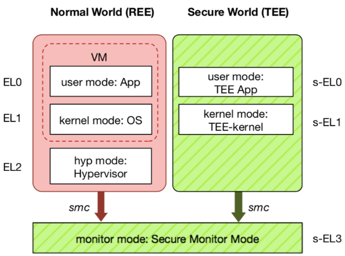

#### ARM Confidential Compute Architecture

- 硬件扩展：Realm Management Extension （相当于机密虚拟机的位置）
  - 全新的特权世界Realm
  - 全新的物理地址空间
  - 细粒度和动态内存隔离机制
- CCA固件
  - RMM管理Realm
  - Monitor管理物理内存及翻译

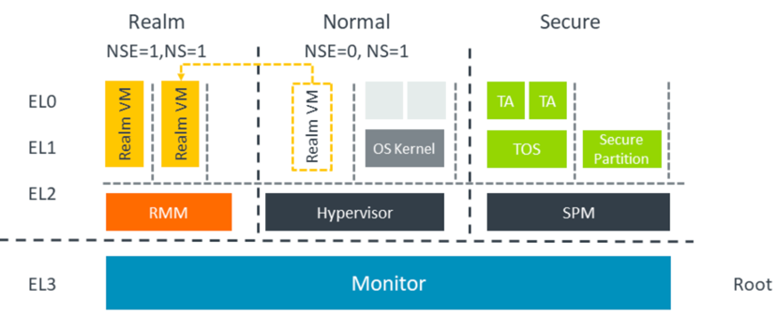

#### 世界状态World State和内存隔离

- 4个世界状态：Non-secure, Realm, secure, root
- 4个Physical Address Space (PAS) 
  - Non-secure PAS
  - Secure PAS（为了兼容trust Zone）
  - Realm PAS
  - Root PAS

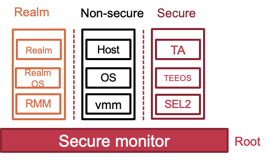

#### 内存加密

- 内存保护引擎（MPE）
  - MPE为不同PAS提供不同的秘钥或Tweak
  - Non-secure以外的PAS必须经过内存加密
  - Monitor 可以配置MPE
  - 硬件完整性保护非必须

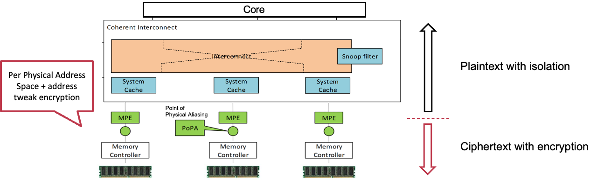

#### 物理内存检查模块Granule Protection Check (GPC)

- Granule protection check
  - 2-level index table for PAS tag
  - PA->Tag translation（monitor提供的HPA到Tag的翻译）

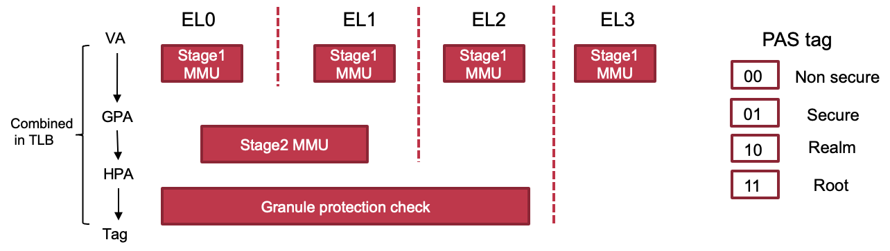

- **在MMU和SMMU中添加GPC模块**，PAS标签在SoC中不断进行传递：

  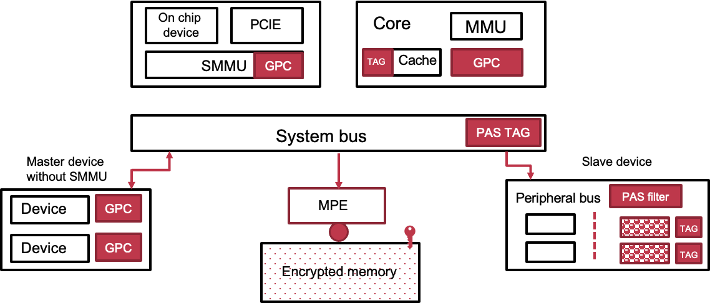

#### 可信软件固件

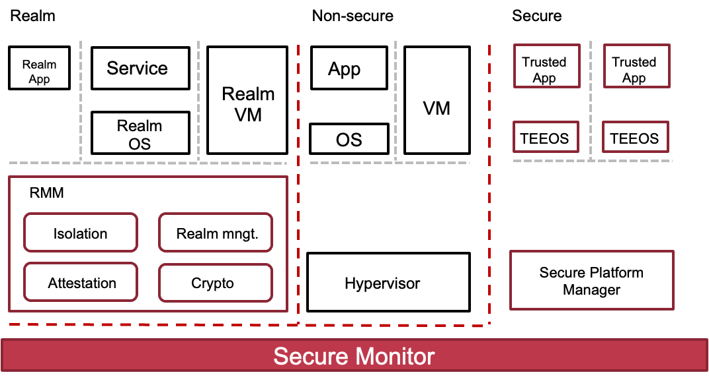

#### RMM接口：RMI和RSI

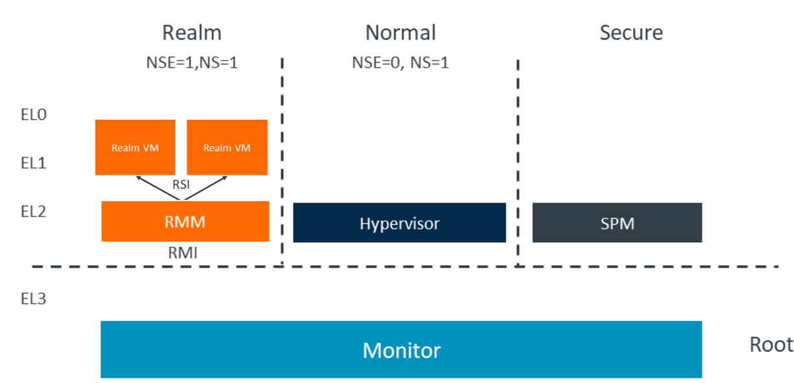

#### 远程验证

- 验证报告的控制流
  - Monitor获得CCA平台报告，并返回给RMM
  - RMM将Realm的度量信息添加到报告中，并返回给Realm

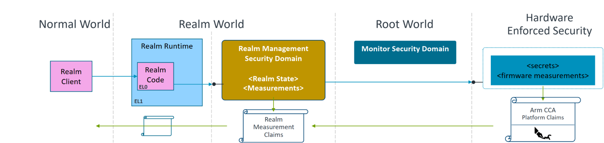

## 其他虚拟化方案

### ARM SEL2

- ARM TrustZone & Secure-EL2 (S-EL2)硬件扩展
  - TrustZone: 与普通世界硬件隔离，被广泛应用于移动端
  - 从ARMv8.4开始引入的S-EL2扩展在TrustZone中支持了硬件虚拟化
    - S-EL2与普通世界的EL2功能相同

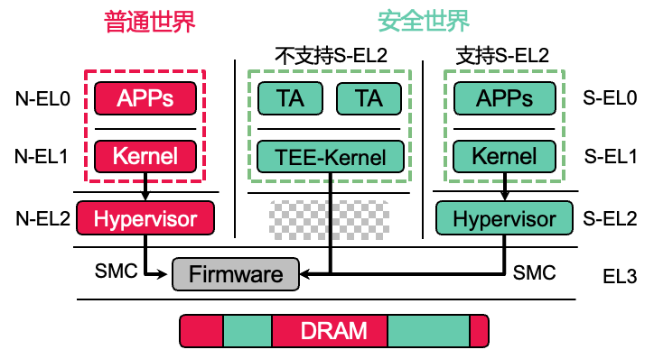

> 基于区域粒度的内存隔离
>
> -最多8个内存区域 (TZC-400)
>
> -可在EL3 & S-EL2进行配置

### ARM TwinVisor

- 关键观察：在普通世界中已经存在功能成熟、被广泛应用的hypervisor了
- 将机密虚拟机的资源管理功能与保护机制解耦 

- 虚拟机管理内存的粒度是4K，且是on-demand

  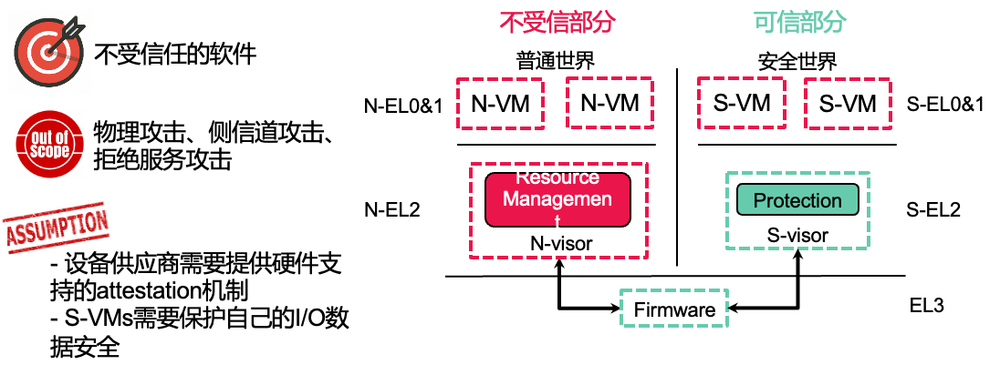

> 在 TwinVisor 的威胁模型中，只有 S-visor 和EL3中的固件属于TCB。
>
> N-VMs和N-visor可以被攻击者入侵并控制，而S-VMs可能被恶意的云租户控制。
>
> 物理攻击、side-channel和DoS攻击不在TwinVisor的考虑范围内，这些攻击的防御方法与TwinVisor的设计是正交的。
>
> TwinVisor假设设备供应商提供硬件支持的root of trust以进行attestation，而S-VM则通过加密和完整性检查来保护自己的I/O数据安全。

### AMD Secure Encrypted Virtualization (SEV)

- 以虚拟机为粒度的Enclave
  - 对不同的虚拟机进行加密
  - 每个虚拟机的密钥均不相同
  - Hypervisor有自己的密钥
- 安全模型的缺陷
  - 依然部分依赖Hypervisor
    - 如：为VM设置正确的密钥

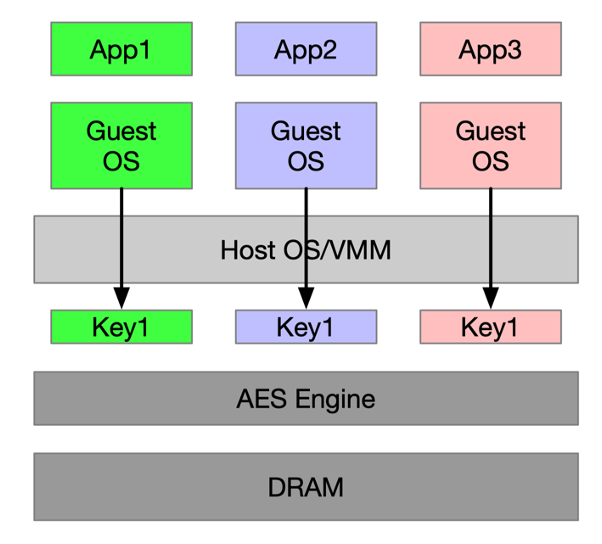

### Intel Trusted Domain Extensions (TDX)

- Intel TDX将VM（也称为TD）与虚拟机监控器和其他非TD软件隔离开
  - Virtual Machine Extensions (VMX) 
  - SEAM firmware
  - Multi-key, total memory-encryption (MKTME) technology
  - 提供guest-aware exception
  - side-channel attack: VM的page fault会交给VMM，VMM会根据VM page fault的信息反推出控制流
    - 解决方案：增加SEAM module，SEAM会让VM检查确认地址

​	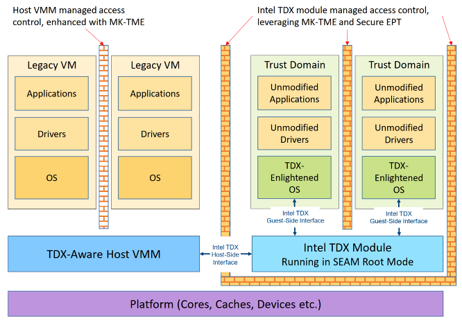

