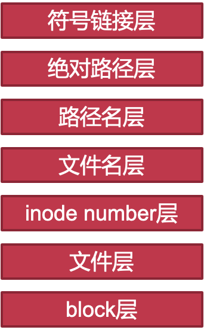
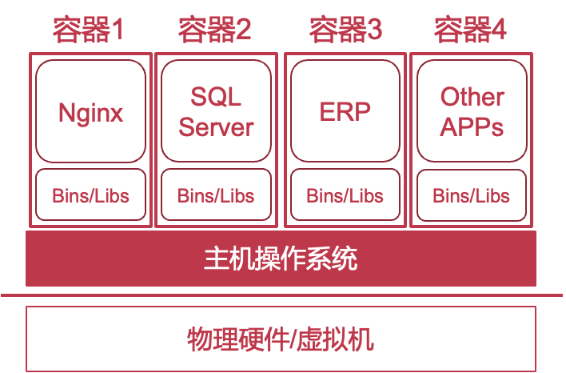
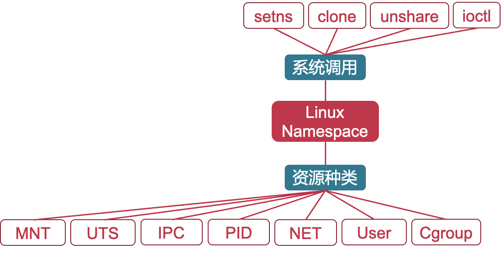
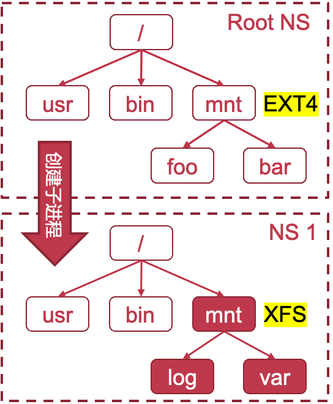
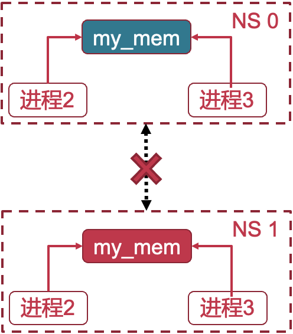
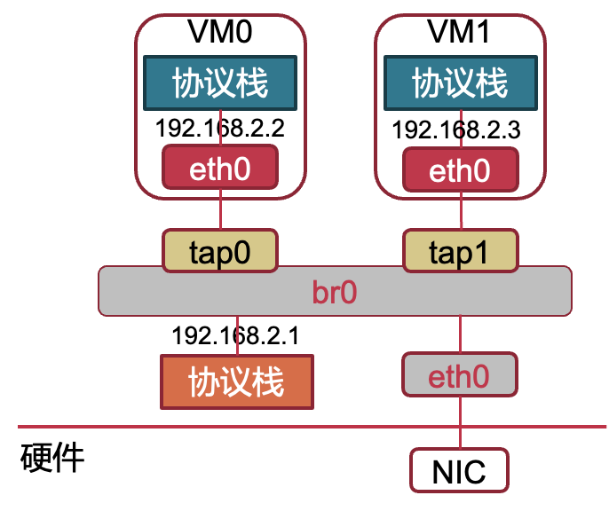
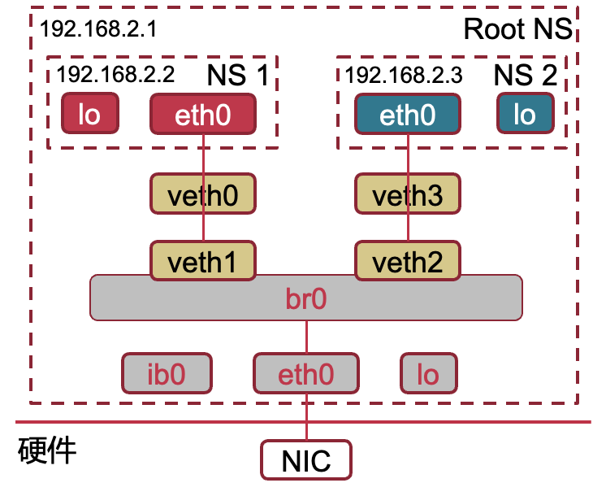
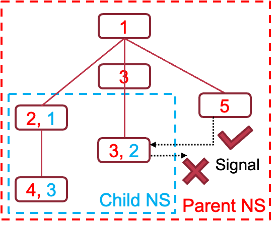
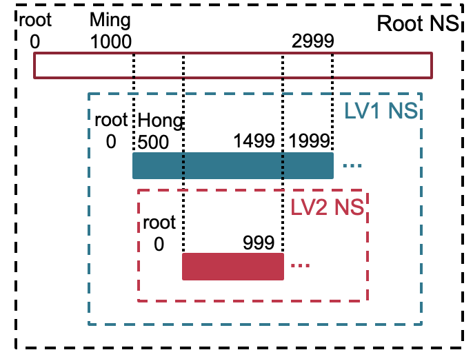

# 26. 轻量级虚拟化


## 1. 虚拟化的技术

| **虚拟化** | **软件方案**                                                 | **硬件方案**                           |
| ---------- | ------------------------------------------------------------ | -------------------------------------- |
| CPU        | •Trap  &  Emulate  •指令解释执行  •二进制翻译  •Para-virtualization | •EL-2  (ARM)                           |
| 内存       | •Shadow  page  table  •Separating page tables for U/K  •Para-virtualization: Direct paging | •Stage-2  PT  (ARM)                    |
| I/O        | •Direct  I/O  •设备模拟  •Para-virtualization:  Front-end & back-end driver (e.g., virtio) | •SMMU  (ARM)  /  IOMMU  (x86)  •SR-IOV |

#### 虚拟化的优缺点

- 虚拟化的优势
  - 可以运行完整的软件栈，包括不同的操作系统
  - 灵活的整体资源分配（支持动态迁移）
  - 方便的添加、删除、备份（只需文件操作）
  - 虚拟机之间的强隔离（能抵御 fork bomb ）
- 虚拟化的问题：太重
  - 云：性能损失，尤其是I/O虚拟化（半虚拟化等有比较大的开销）
  - 用户：两层操作系统导致资源浪费


## 2. **chroot**

#### overview：**文件系统视图的隔离**

- 为每个执行环境提供单独的文件系统视图
- 原理
  - Unix系统中的“一切皆文件”设计理念
  - 对于用户态来说，文件系统相当重要
- 方法
  - 改变文件系统的根目录，即chroot

#### Chroot效果

- 控制进程能够访问哪些目录子树
- 改变进程所属的根目录
- 进程只能看到根目录下属的文件

#### Chroot原理

- 进程只能从根目录向下开始查找文件
  - 操作系统内部修改了根目录的位置
- 一个简单的设计
  - 内核为每个用户记录一个根目录路径
  - 进程打开文件时内核从该用户的根目录开始查找

- 特殊检查根目录下的“..”
  - 使得“/..”与“/”等价
  - 无法通过“..”打破隔离
- 每个TCB都指向一个root目录
  - 一个用户可以对多个进程chroot

- 需要root权限才能变更根目录
  - 也意味着chroot无法限制root用户
- 确保chroot有效
  - 使用setuid消除目标进程的root权限

```c
struct fs_struct{
    ......
    struct path root, pwd;
};

struct task_struct{
    ......
    struct fs_struct  *fs;
    ......
};

// 确保chroot有效
chdir(“jail”);
chroot(“.”);
setuid(UID); // UID > 0
```


#### 基于Name Space的限制

- 通过文件系统的name space来限制用户
  - 如果用户直接通过inode访问，则可绕过
  - 不允许用户直接用inode访问文件
  - 让不同的用户看到的inode不同
- 其它层也可以限制用户
  - 例如：inode层可以限制用户



#### Chroot的缺点

- 不同的执行环境想要共享一些文件怎么办？
- 涉及到网络服务时会发生什么？
  - 所有执行环境共用一个IP地址，所以无法区分许多服务
- 执行环境需要root权限该怎么办？
  - 全局只有一个root用户，所以不同执行环境间可能相互影响

##### Chroot不能实现彻底的隔离，因为还有许多资源被共享


## 3. Linux container

#### LinuX Container (LXC)

- 基于容器的轻量级虚拟化方案
  - 由Linux内核提供资源隔离机制，不同的容器共享OS的资源，但是提供了独占的抽象
- 安全隔离
  - 基于namespace机制
- 性能隔离
  - Linux cgroup



#### Linux Namespace (NS)

- 每种NS封装一类全局资源
  - 进程只能访问封装后的局部资源
  - 目前一共有七种NS
- 进程通过系统调用控制NS



#### 1、Mount Namespace

> 容器内外可部分共享文件系统, 如果容器内修改了一个挂载点会发生什么？
>
> 假设主机操作系统上运行了一个容器
> Step-1：主机OS准备从/mnt目录下的ext4文件系统中读取数据
> Step-2：容器中进程在/mnt目录下挂载了一个xfs文件系统
> Step-3：主机操作系统可能读到错误数据

- 设计思路
  - 在内核中分别记录每个NS中对于挂载点的修改
  - 访问挂载点时，内核根据当前NS的记录查找文件
- 每个NS有独立的文件系统树
  - 新NS会拷贝一份父NS的文件系统树
  - 修改挂载点只会反映到自己NS的文件系统树



#### 2. IPC Namespace的实现

> 不同容器内的进程若共享IPC对象会发生什么？
>
> 假设有两个容器A和B: A中进程使用名为“my_mem”共享内存进行数据共享,B中进程也使用名为“my_mem”共享内存进行通信,B中进程可能收到A中进程的数据，导致出错以及数据泄露

- 使每个IPC对象只能属于一个NS
  每个NS单独记录属于自己的IPC对象
  进程只能在当前NS中寻找IPC对象
- 图例
  即使不同NS的共享内存ID均为my_mem -> 不同的共享内存



#### 3. Network Namespace的实现

> 不同的容器共用一个IP会发生什么？
>
> 假设有两个容器均提供网络服务,两个容器的外部用户向同一IP发送网络服务请求,主机操作系统不知道该将网络包转发给哪个容器
>
> ##### Linux对于多IP的支持
>
> 在虚拟机场景下很常见: 
>
> - 每个虚拟机分配一个IP，IP绑定到各自的网络设备上
>
> - 内部的二级虚拟网络设备
>
>   - br0: 虚拟网桥
>   - tap: 虚拟网络设备
>
>   

- 每个NS拥有一套独立的网络资源
  - 包括IP地址、网络设备等
- 新NS默认只有一个loopback设备，其余设备需后续分配或从外部加入
- 图例
  - 创建相连的veth虚拟设备对
  - 一端加入NS即可连通网络
  - 分配IP后可分别与外界通信



#### 4、PID Namespace

> 容器内进程可以看到容器外进程的PID会发生什么？
>
> 假设有容器内存在一个恶意进程,恶意进程向容器外进程发送SIGKILL信号,主机操作系统或其他容器中的正常进程会被杀死

- 对NS内外的PID进行单向隔离:外部能看到内部的进程，反之则不能
- 图例
  子NS中的进程在父NS中也有PID
  进程只能看到当前NS的PID
  子NS中的进程无法向外发送信号



#### 5、User Namespace

> 容器内外共享一个root用户会发生什么？
>
> 假设一个恶意用户在容器内获取了root权限, 恶意用户相当于拥有了整个系统的最高权限,可以窃取其他容器甚至主机操作系统的隐私信息, 可以控制或破坏系统内的各种服务

- 对NS内外的UID和GID进行映射
  - 允许普通用户在容器内有更高权限
    - 基于Linux Capability机制(相当于权限机制)
  - 容器内root用户在容器外无特权
    - 只是普通用户
- 图例
  - 普通用户在子NS中是root用户



##### 进一步限制容器内Root

如果容器内root要执行特权操作怎么办？

- insmod？一旦允许在内核中插入驱动，则拥有最高权限
- 关机/重启？整个云服务器会受影响

1、从内核角度来看，仅仅是普通用户
2、限制系统调用
Seccomp机制（限制能调用的SYSCALL的种类和参数）


#### 其他Namespace

6、UTS Namespace

- 每个NS拥有独立的hostname等名称
- 便于分辨主机操作系统及其上的多个容器

7、Cgroup Namespace

- cgroupfs的实现向容器内暴露cgroup根目录
- 增强隔离性：避免向容器内泄露主机操作系统信息
- 增强可移植性：取消cgroup路径名依赖


### 性能隔离

#### Control Cgroups (Cgroups)

- Cgroups是Linux内核（从Linux2.6.24开始）提供的一种资源隔离的功能
- Cgroups可以做什么
  - 将线程分组
  - 对每组线程使用的多种物理资源进行限制和监控
- 怎么用Cgroups
  - 名为cgroupfs的伪文件系统提供了用户接口
  - 为什么是伪文件系统？本质上是内核的数据结构，不是真的文件，但是可以通过读写的方式进行通信

#### Cgroups的常用术语

- 任务（task）
- 控制组（cgroup）
- 子系统（subsystem）
- 层级 （hierarchy）

#### 任务（Task）

任务就是系统中的一个线程

#### 控制组（Control Group）

- Cgroups进行资源监控和限制的单位
  - 比如能用多少CPU和内存
- 任务的集合
  - 控制组cgroup1包含task1
  - 控制组cgroup2包含task2
  - 控制组cgroup3由task1和task2组成


#### 子系统（Sub-system）

- 可以跟踪或限制控制组使用该类型物理资源的内核组件
- 也被称为资源控制器


#### 层级（Hierarchy）

- 由控制组组成的树状结构
- 通过被挂载到文件系统中形成
- 一个任务在每个层级结构中只能属于一个控制组
- 一个子系统只能附加于一个层级结构
- 一个层级结构可以附加多个子系统

#### 资源控制模型

- 最大值：直接设置一个控制组所能使用的物理资源的最大值，例如：
  - 内存子系统：最多能使用1GB内存
  - 存储子系统：最大能使用100MB/s的磁盘IO
  - 缺点：不够动态
- 比例：设置不同控制组使用同一物理资源时的资源分配比例，例如：
  - 存储子系统：两个控制组按照1：1的比例使用磁盘IO资源
  - CPU子系统：两个控制组按照2：1的比例使用CPU时间

#### QA：如何对任务使用资源进行监控和限制

- Cgroups进行监控和限制的单位是什么？
  - 控制组
- 如何知道一个控制组使用了多少物理资源？
  - 计算该控制组所有任务使用的该物理资源的总和
- 如何限制一个控制组
  - 使该控制组的所有任务使用的物理资源不超过这个限制
  - 在每个任务使用物理资源时，需要保证不违反该控制组的限制

#### example

#### 1. CPU子系统

- 回顾CFS（完全公平调度器）
  - 可以为每个任务设定一个“权重值”
  - “权重值”确定了不同任务占用资源的比例
- CPU子系统允许为不同的控制组设定CPU时间的比例
  - 直接利用CFS来实现按比例分配的资源控制模型
  - 为控制组设定权重：向cpu.shares文件中写入权重值（默认1024）

#### 2. 内存子系统

- 监控控制组使用的内存
  - 利用page_counter监控每个控制组使用了多少内存
  
- 限制控制组使用的内存
  - 通过修改memory.limit_in_bytes文件设定控制组最大内存使用量
  
- Linux分配内存首先需要charge同等大小的内存，只有charge成功，才能分配内存
  
- charge内存的简化代码：
  
  ```c
  new = atomic_long_add_return(nr_pages, &page_counter->usage);
  if (new > page_counter->max) {
    atomic_long_sub(nr_pages, &page_counter->usage);
    goto failed;
  }
  ```
  
- 释放内存时会执行相反的uncharge操作

#### 3. 存储子系统（blkio）

- 限制最大IOPS/BPS
  - blkio.throttle.read_bps_device 限制对某块设备的读带宽
  - blkio.throttle.read_iops_device 限制对某块设备的每秒读次数
  - blkio.throttle.write_bps_device 限制对某块设备的写带宽
  - blkio.throttle.write_iops_device 限制对某块设备的每秒写次数
- 设定权重（weight）
  - blkio.weight 该控制组的权重值
  - blkio.weight_device 对某块设备单独的权重值

### 小结：隔离的不同方式

更强的隔离能力，可能会引起资源的利用率下降

- 物理机隔离
- 虚拟机隔离
- 机密虚拟机隔离
- 文件系统隔离：Chroot
- 容器隔离：Name Space
- 进程隔离：传统方式
- 性能隔离：Cgroup