# 27. 操作系统安全机制

[toc]

## 1. **操作系统的安全服务**

#### background: 安全是操作系统的重要功能和服务

- 系统中有许多需要保护的数据
  - 如账号密码、信用卡号、地理位置、照片视频等
  - 操作系统需要允许这些数据被合法访问，但不允许被非法访问
- 系统中可能存在许多恶意应用
  - 操作系统需要与这些恶意应用作斗争，保护自己，限制对方
- 操作系统不可避免的存在漏洞
  - 操作系统需要考虑自己被完全攻破的情况下依然提供一定的保护

### 操作系统安全的三个层次

b: 防火墙

c: 黑匣子

#### 层次一：基于OS的应用隔离与访问控制

- 威胁模型

  - 操作系统是可信的，能够正常执行且不受攻击
  - 应用程序可能是恶意的，会窃取其他应用数据
  - 应用程序可能存在bug，导致访问其他应用数据

- 应用隔离

  - 内存数据隔离：依赖进程间不同虚拟地址空间的隔离

  - 文件系统隔离：文件系统是全局的，需限制哪些应用不能访问哪些文件

    - 操作系统提供对文件系统的访问控制机制

      （对于简单的场景，访问控制是有效的；对于复杂的场景，访问控制不能完全解决问题）

#### 层次二：OS对恶意应用的隔离与防御

- 威胁模型
  - 操作系统存在bug和安全漏洞
  - 操作系统的运行过程依然可信
  - 恶意应用利用操作系统漏洞攻击，获取更高权限或直接窃取其他应用的数据
- 操作系统防御
  - 防御常见的操作系统bug/漏洞
  - 沙盒机制限制应用的运行

#### 层次三：OS不可信时对应用的保护

- 威胁模型
  - 操作系统不可信，有可能被攻击者完全控制
  - 恶意应用可能与操作系统串通发起攻击
- 基于更底层的应用保护
  - 基于Hypervisor的保护：可信基更小
  - 基于硬件Enclave的保护：硬件通常更可信
    - 可以不信任Hypervisor
  - 一定要有一个信任基

#### 操作系统安全的三个概念

- 可信计算基（Trusted Computing Base）
  - 为实现计算机系统安全保护的所有安全保护机制的集合
  - 包括软件、硬件和固件（硬件上的软件）
- 攻击面（Attacking Surface）
  - 一个组件被其他组件攻击的所有方法的集合
  - 可能来自上层、同层和底层
- 防御纵深（Defense in-depth）
  - 为系统设置多道防线，为防御增加冗余，以进一步提高攻击难度

#### 操作系统安全很难指标化

> 对于负面目标，目前缺乏很好的量化和判断方法, 除了Alice其他人都不能访问某个文件

- 指标-1：千行代码的缺陷密度
  - 常用指标：每 1,000 行代码的平均缺陷数量
    - Linux 的缺陷密度近年来已经小于 0.5
    - GPU 驱动的缺陷密度仅为 0.19， 160个缺陷
    - SMACK（Linux 的一个安全模块）高达 1.11，6个缺陷
  - 在代码长度差不多，重要程度差不多的时候比较合适
- 指标-2：已发现的缺陷数量
  - 缺陷的编号方法
    - CVE（Common Vulnerabilities and Exposures）
      - 一种常见的漏洞编号方式，CVE-2020-10757
    - 国家计算机网络应急处理协调中心的 CNCVE 编号
    - 国家信息安全漏洞共享平台的 CNVD 编号
    - 中国信息安全测评中心的 CNNVD 编号
  - 相对值直接比较也缺乏说服力
    - Linux 内核的 CVE 数量目前排在第 3 位（2,357 个）
    - Windows XP 则排第 28 位（741 个），比Linux更安全？

#### 安全目标（从数据角度）：CIA

- 机密性（Confidentiality）
  - 常又称隐私性（Privacy）
  - 数据不能被未授权的主体窃取（即恶意读操作）
- 完整性（Integrity）
  - 数据不能被未授权的主体篡改（即恶意写操作）
- 可用性（Availability）
  - 数据能够被授权主体正常访问

## 2. 访问控制（Access Control）

#### 访问控制与引用监视器

- 访问控制（Access Control）
  - 按照访问实体的身份来限制其访问对象的一种机制
  - 为了实现对不同应用访问不同数据的权限控制
  - 包含"认证"和"授权"两个重要步骤
- 引用监视器（Reference Monitor）
  - 是实现访问控制的一种方式
  - 主体必须通过引用（reference）的方式间接访问对象
  - Reference monitor 位于主体和对象之间，进行检查

#### 引用监视器（Reference Monitor）机制

Reference Monitor 负责两件事：

- Authentication：确定发起请求实体的身份，即认证
- Authorization：确定实体确实拥有访问资源的权限，包含授权和鉴权

#### 认证：从用户到进程

> 认证机制需要拥有的信息：
>
> 知道什么 （Something you know）：例如密码/口令、手势密码、某个问题的答案等
> 有什么 （Something you have）：例如 USB-key、密码器等实物
> 是什么 （Something you are）：如指纹、虹膜、步态、键盘输入习惯等属于人的一部分

> 进程与用户之间如何绑定？

- 每个进程的PCB中均包含了user字段
- 每个进程都来自于父进程，继承了父进程的user
- 用户在登录后运行的第一个进程（shell），初始化user字段
- 在Windows下，窗口管理器会扮演类似shell的角色

所以，进程必须存在层次结构

#### 访问控制矩阵

- 权限矩阵: 对象与实体的关系

- 不现实：占用的空间太大，并且每当新建一个用户的时候，都必须要更新所有 inode 中的权限 bit

  

#### 授权机制：POSIX的文件权限

- 将用户分为三类
  - 文件拥有者、文件拥有组、其他用户组
  - 每个文件只需要用9个bit即可：3种权限（读-写-执行） x 3 类用户
- 何时检查用户权限？
  - 每次打开文件时，进行鉴权和授权
    - open()包含可读/可写的参数，OS根据用户组进行检查（鉴权）
    - 引入fd，记录本次打开权限（授权），作为后续操作的参数
  - 每次操作文件时，根据fd信息进行检查（鉴权）

#### 例：Windows的ACL

- Windows使用不同于POSIX的ACL机制
  以文件和目录为粒度
  为多个用户和用户组设置不同的权限
- 放在ntsf里面，这本质上是个数据库
- 对比POSIX：只有3类用户/组

#### 基于角色的访问控制（RBAC）

- RBAC：**将用户（人）与角色解耦的访问控制方法**
  - Role-Based Access Control
  - 提出了角色的概念，与权限直接相关
  - 用户通过拥有一个或多个角色，间接地拥有权限
  - "用户-角色"，以及"角色-权限"，一般都是多对多的关系
- RBAC的优势
  - 设定角色与权限之间的关系比设定用户与权限之间的关系更直观
  - 可一次性地更新所有拥有该角色用户的权限，提高了权限更新的效率
  - 角色与权限之间的关系比较稳定，而用户和角色之间的关系变化相对频繁
    - 设计者负责设定权限与角色的关系（机制）
    - 管理者只需要配置用户属于哪些角色（策略）

在linux里面，group有类似的功能

#### 最小特权级原则：setuid 机制

- 问题：passwd 命令如何工作？
  - 用户有权限使用 passwd 命令修改自己的密码
  - 用户的密码保存在 /etc/shadow 中，用户无权访问
  - 本质上是以文件为单位的权限管理粒度过粗——怎么解决？
- 解决方法：运行 passwd 时使用 root 身份（RBAC的思想）
  - 如何保证用户提权为root后只能运行passwd？
    - 在passwd的inode中增加一个SUID位，使得用户仅在执行该程序时才会被提权，执行完后恢复，从而将进程提权的时间降至最小
  - passwd程序本身的逻辑会保证某一个用户只能修改其自身的密码

#### setuid的安全风险

- setuid 不同于RBAC
  - setuid在Linux下通常用于以root身份运行，拥有的权限，远超过必要
  - 必要权限：用户能够读写 /etc/passwd 文件中的某一行
  - 实际权限：
    - 用户能够访问整个 /etc/passwd 文件
    - 用户（短暂地）拥有root用户的权限
- setuid的安全隐患
  - 一旦 passwd 程序存在漏洞，如 buffer-overflow 导致的返回地址修改，则攻击者很容易以root身份通过ROP运行 execv("/bin/sh")

#### 权限控制的另一种思路：Capability

- Capability表示一种能力
  - 例如：读取/foo文件，写入/foo文件，等等
  - 有点像钥匙，能打开某一把锁的话就能进行某个操作
  - 每个进程可以拥有一组能力
- Capability怎么实现？很多种方式
  - 仅仅是一串bit，但必须保存在内核（只有内核能访问的内存）中，否则进程就可以任意伪造
    - 通常保存在进程的PCB中，在进程进行某个操作的时候内核检查
  - 可以把不同Capability的组合对应为ACL中的不同组
  - 因此使用Capability的控制粒度可以很细，而且不需要建立大量的组

#### Capability的典型操作

1. 服务端通过系统调用创建一个 Capability，获得相应的 ID；
2. 服务端通过系统调用，将此 Capability ID 传递给某个客户端；
3. 客户端通过 IPC 调用服务端的某个服务函数，以 Capability ID 作为参数；
4. IPC 调用过程中，操作系统根据该 Capability ID 检查该客户端是否有权限调用服务端函数，检查通过则切换至服务端继续运行；
5. 服务端执行函数，并将结果返回给客户端。

> Capability 有传递性，但是给别人就自己没有了
>
> capability的检查是操作系统完成的，如果检查不通过，不会到第5步

#### fd与Capability的类似之处

- 文件描述符 fd 可以看做是 Capability 的一种实现
  - 用户不能伪造 fd，必须通过内核打开文件（回顾 file_table/fd_table）
  - fd 只是一个指向保存在内核中数据结构的"指针"
  - 拥有 fd 就拥有了访问对应文件的权限
  - 一个文件可以对应不同 fd，相应的权限可以不同
- fd 也可以在不同进程之间传递
  - 父进程可以传递给子进程（回顾pipe）
  - 非父子进程之间可以通过 sendmsg 传递 fd

#### Linux的Capability

- 提供细粒度控制进程的权限
  - 初衷：解决root用户权限过高的问题
- 需要注意，与前面说的Capability的不同
  - 语义都是预先由内核定义，而不允许用户进程自定义
  - 不允许传递，而是在创建进程的时候，与该进程相绑定
  - 没有提供 Capability ID，无法通过 ID 索引内核资源进行操作

> 这个和前面提到的capability不同，这个是Linux为权限控制提供的特殊设计

## DAC与MAC

- 自主访问控制（DAC: Discretionary Access Control）
  - 指一个对象的拥有者有权限决定该对象是否可以被其他人访问
    - 例如，文件系统就是一类典型的 DAC
  - 但是对部分场景（如军队）来说，DAC过于灵活
    - 例如，文件拥有者是否真的有权可随意设置文件权限？
- 强制访问控制（MAC: Mandatory Access Control）
  - 由"系统"增加一些强制的、不可改变的规则
    - 例如，在军队中，如果某个文件设置为机密，那么就算是指挥官也不能把这个文件给没有权限的人看——这个规则是由军法（系统）规定的
  - MAC与DAC可以结合，此时MAC的优先级更高

### Bell-LaPadula 模型

- BLP属于强制访问控制（MAC）模型

  - 一个用于访问控制的状态机模型
  - 目的是为了用于政府、军队等具有严格安全等级的场景

- BLP 规定了两条 MAC 规则和一条 DAC 规则

  - 简单安全属性：某个安全级别的主体无法读取更高安全级别的对象

  * *属性（星属性）:某一安全级别的主体无法写入任何更低安全级别的对象

  * 自主安全属性：使用访问矩阵来规定自主访问控制（DAC）

#### Bell-LaPadula 模型的例子

- 例如，有如下的文件和用户：
  - 文件 A：高机密级别（机密文件），文件 B：低机密级别（普通文件）
  - 进程 X：高机密级别（长官创建），进程 Y：低机密级别（士兵创建）
- 根据上面的两条 MAC 规则，读与写的限制如下：
  - 根据简单安全属性，进程 X 可以读取文件 A，也可以读取文件 B，而进 程 Y 只能读取文件 B
  - 根据星属性，进程 X 只可以写入文件 A，而进程 Y 可以写入文件 A 或文件 B
  - 策略也可以简称“下读，上写”

#### Bell-LaPadula 模型的不足

- 在现实应用中的问题（安全性与可用性的矛盾）
  不允许数据从高机密级别的对象流向低机密级别的对象
  例如，长官无法向士兵传递命令，因为长官不能 “向下写”任何数据
- 引入了“受信任主体”的概念（Trusted Subject） ：
  受信任主体可以不受星属性的限制，但前提是该主体必须遵守相应的“降密策略”（Declassification Policy）
  具体的降密策略因不同场景而不同，需要具体情况具体设置
  然而，并没有一种简单普适的方法来保证数据可靠安全的降密

## 案例：SELinux

- SELinux，由NSA发起，2003年并入Linux
  - 是 Flask 安全架构在 Linux 上的实现
    - Flask 是一个 OS 的安全架构，可灵活提供不同的安全策略
  - 是一个 Linux 内核的安全模块（LSM）
    - 在Linux内核的关键代码区域插入了许多 hook进行安全检查
- SELinux 提供一套访问控制的框架
  - 支持不同的安全策略，包括强制类型访问（MAC）

​	

#### SELinux引入的概念

- 用户（User）：指系统中的用户
  - 与 Linux 系统用户并没有关系
- 策略（Policy）：一组规则（Rule）的集合
  - 默认是"Targeted"策略，主要对服务进程进行访问控制
  - MLS （Multi-Level Security），实现了 Bell-LaPadula 模型
  - Minimum，考虑资源消耗，仅应用了一些基础的策略规则，一般用于手机等平台
- 安全上下文：是主体和对象的标签（Label）
  - 用于访问时的权限检查
  - 可通过"ls -Z"的命令来查看文件对应的安全上下文

#### SELinux的访问向量

- SELinux 将访问控制抽象为一个问题：
  - 一个 < 主体 > 是否可以在一个 < 对象 > 上做一个 < 操作 >
  - 3W: Who, Which (obj), What (operation)
- AVC: Access Vector Cache
  - SELinux 会先查询AVC，若查不到，则再查询安全服务器
  - 安全服务器在策略数据库中查找相应的安全上下文进行判断

#### SELinux的安全上下文

- SELinux本质上是一个标签系统
  - 所有的主体和对象都对应了各自的标签
- 标签的格式 < 用户:角色:类型:MLS层级 >
  - 用户登录后，系统根据角色分配给用户一个安全上下文
  - 类型（Type）用于实现访问控制
    - 每个对象都有一个 type
    - 每个进程的type称为 domain
      - 一个角色对应一个domain
      - 重要的服务进程被标记为特定的domain
      - 例如：/usr/sbin/sshd 的类型为 sshd_exec_t

#### 进程的domain与对象的type

#### SELinux在实际应用中的问题

- 规则的设置过于复杂
  - 不同规则之间可能存在冲突，错误的规则影响可用性
- 日志难以被理解
  - 当发生违反规则的情况，很难解释发生了什么，该如何判定
- 应用程序不支持
  - 部分规则需要应用程序的配合
- 性能影响
  - 权限检查不可避免的带来性能的损失

#### SEAndroid的改进与应用

- 2013年引入Android
  - SEAndroid是Android开源项目（AOSP）的一部分
  - 并默认包含在所有主流Android设备中
- 用于辅助权限检查
  - 有助于在Android设备上强制执行应用程序沙盒边界和其他安全策略

# 28**操作系统攻防**

## 1. **操作系统内核漏洞**

#### 漏洞分类的三个角度

- 漏洞类型（指攻击所利用的漏洞类型）
  - 栈/堆缓冲区溢出、整形溢出、空指针/指针计算错误、内存暴露、use-after-free、double-free、未初始化读取、格式化字符串错误、竞争条件错误、参数检查错误、认证检查错误，等等
- 攻击模块（指攻击所利用漏洞的所在的模块）
  - 调度模块、内存管理模块、通信模块、文件系统、设备驱动等
- 攻击效果（指攻击的目的或攻击导致的结果）
  - 执行任意代码、内存篡改、窃取数据、拒绝服务、破坏硬件等

#### 操作系统的漏洞

- 操作系统本身也是软件
  - 同样存在各种漏洞，如缓冲区溢出、未初始化指针、竞争等
- 操作系统与一般应用软件不同
  - 需要对硬件直接操作，与高级语言的抽象往往不匹配
    - 高级语言的内存安全等特性往往无法使用
  - 硬件语义的加入，为正确性判断带来了更多挑战
    - 例如对栈的操作，会使编译器失去上下文
  - 以数据表示权限等，使数据类攻击具有更强的能力
    - 例如页表的权限位，userid=0

> **思考问题**: **内核中哪些数据结构非常危险？**
>
> 所有记录权限、敏感数据的地方：页表、PCB、uid、gid、系统调用表、VFS函数表、IDT、键盘驱动、skb等等

#### 例：木马如何隐藏自己？

**被恶意软件使用的技术** *adore-ng*:

把自己从run queue中保留，但是从task list中删掉

## 2. **操作系统内核攻防**

#### 操作系统出现性能不升反降的趋势

- "安全税"导致的性能开销

  - 内核页表隔离（KPTI）

    1.为防御2018年的熔断漏洞

    2.隔离导致性能下降达30%

  - 避免间接跳转预测执行

  - SLAB空闲列表随机化

  - 用户态内存复制安全强化

- 两年内 poll() 时延上升至146%

#### 整形溢出漏洞

防御方法：增加对溢出的检查代码；利用自动化工具查找并修复

count变量来自用户空间，尽管对其长度进行了检查， 但这个检查是不够的:因为sizeof（struct rps\_dev\_flow）的长度是 8，因此如果count的长度正好是 2^30，那么vmalloc的参数依然会造成溢出。 由于count远远大于 vmalloc 得到的内存大小，因此在后续for循环中便会写入超出table边界的内存区域。

> Vmalloc: 类似用户态malloc，不一定真的malloc
>
> kmalloc：一定会真正分配空间

#### Return-to-user攻击（ret2usr）

- 内核错误地运行了用户态的代码
  - 由于内核与应用程序共享同一个页表，内核运行时可以任意访问用户态的虚拟地址空间，内核可能执行位于用户态的代码
- 攻击者的常用方法
  - 先在用户态中初始加载一段恶意代码，然后利用内核的某个漏洞，修改内核中的某个函数指针指向这段恶意代码的地址
  - 也可以利用内核的栈溢出漏洞，覆盖栈上的返回地址为恶意代码的地址，使内核在执行 ret 指令时跳转到位于用户态的代码

#### ret2usr攻击的防御方法

- 方法一：仔细检查内核中的每个函数指针
  - 需对内核所有模块进行检查，很难做到 100% 的覆盖率
- 方法二：在陷入内核时修改页表，将用户态所有的内存都标记为不可执行
  - 由于修改页表后必须要刷新 TLB 才能生效，因 此修改页表、刷新 TLB，以及后续运行触发 TLB miss 都会导致性能下降
  - 在返回用户态之前必须将页表恢复，并再次刷掉 TLB，这样又会导致用户态执行时出现 TLB miss，因此对性能的影响非常大
- 方法三：硬件保证CPU处于内核态时不得运行任何用户态的代码
  - 如 Intel 的 SMEP（Supervisor Mode Execution Prevention）技术
    - 在Supervisor的时候禁止执行用户态代码
  - ARM 同样有类似 SMEP 的技术，称为 PXN（Privileged eXecute-Never）

#### SMEP 不能完全解决 ret2usr：ret2dir

- 操作系统管理内存的方法"直接映射" （kmalloc，通过buddy system分配）
  - 将一部分或所有的物理内存映射到一段连续的内核态虚拟地址空间
  - 分配给应用程序后，直接映射依然存在
  - 因此，同一块物理内存在系统中有多个虚拟地址
    - 例如，某个内存页分配给了应用程序，那么内核既可以通过应用程序的虚拟地址访问（前提是内核与应用在一个地址空间），也可以通过直接映射的虚拟地址访问
- 基于直接映射的攻击，可绕过SMEP
  - 攻击者首先推算出位于用户态的恶意代码在内核直接映射区域的虚拟地址，然后在 ret2usr 攻击中让内核跳转到该地址执行（内容依然为攻击者控制）
  - 攻击成功还有一个前提：直接映射区域必须是可执行的
    - 在 3.8.13 以及 之前的 Linux 版本，将直接映射区域的权限设置为了"可读-可写-可执行"
  - 这种利用直接映射区域的 ret2usr 攻击被称为"ret2dir"攻击

#### Rootkit：获取内核权限的恶意代码

- Rootkit 是指以得到 root 权限为目的的恶意软件
  - Rootkit 可以运行在用户态，也可以运行在内核态
  - 通过ROP的形式攻击
- 用户态的Rootkit
  - 可以将自己注入到某个具有 root 权限的进程中，并接收攻击者的命令
- 内核态的Rootkit
  - 可以 hook 某个内核中的关键函数，从而在该函数被调用时触发运行
  - 可以是以内核线程的方式运行
  - 可以是修改内核中的系统调用表，用恶意代码来替换掉正常的系统调用

#### KASLR：内核地址布局随机化

- ASLR 与 KASLR
  - ASLR 通过随机化地址空间布局来提高系统攻击难度
  - KASLR是对内核启用地址随机化
- KASLR 可缓解 ret2dir 攻击
  - 攻击者需要知道用户态恶意代码在内核中直接映射区域的地址
  - KASLR 通过将内核的虚拟地址布局进行随机化，使攻击者准确定位内核地址的难度大大提升

#### 内核漏洞防御机制（一部分）

- 运行时工具
  - SFI（Software Fault Isolation）：对内存做访问控制（预先判断是否是在合法的访问区间）
  - 代码完整性保护：阻止非法代码运行（算哈希，判断代码是否被修改）
  - 用户态驱动：降低内核攻击面
  - 未初始化内存跟踪：防止未初始化内存被使用或复制到用户态（跟踪粒度要细一些，但是不能太细，因为会增加开销）
- 编译时工具
  - 代码静态分析工具，通常需要开发者添加annotation

## 3. 案例：IOS的系统安全（这个貌似没讲）

#### 文件加密保护机制

**每个文件都加密，且秘钥均不相同**：

- 创建文件时，系统会新建一个 256-bit 的秘钥用于该文件的加密
- 硬件的 AES 引擎会在写 入文件时，使用该秘钥对文件进行 AES CBC 模式加密，再写入到闪存中
- 加密过程中的初始化向量（IV，Initialization Vector）使用了当前块在文件中的偏移，然后用文件秘钥的 SHA-1 值进行加密得到

#### 进程沙盒机制

- 所有第三方 App 都运行在一个沙盒中
  - 被限制访问其他应用程序存储的文件或对设备进行修改
  - 若第三方 App 需要访问其任何沙盒外部的数据， 只能显式地通过 iOS 提供的 API 来访问
  - 因此 iOS 可以在 API设置各种检查来进一步增强安全性
- 第三方 App 都以mobile的非特权用户身份运行
  - 整个 OS 的分区以只读方式加载，所有的数据内存区域均使用 ARM 的 XN 机制（Execute Never）标记为不可执行
  - 只有很少部分的内存页被标记为可写可执行（例如 Safari，用于 JavaScript 的 JIT），内核会仔细检查 App 是否有权限做这样的映射

# 29. 硬件辅助系统安全

## 1. bg: 操作系统不可信

> **除了应用，别的都不可信**

#### 恶意操作系统如何攻击应用？

- 应用的攻击面
  - 同层：其他应用程序
  - 底层：操作系统、Hypervisor、硬件
- 操作系统窃取应用的数据
  - 操作系统控制着页表，可直接映射应用的内存并读取数据
- 操作系统改变应用的执行
  - 操作系统控制着页表，可直接在应用内部新映射一段恶意代码
  - 操作系统可任意改变程序的RIP，劫持其执行流

#### 一种新的威胁模型：安全处理器

- 不信任CPU外的硬件：包括内存（DRAM）、设备、网络
- 仅信任CPU：包括cache、所有计算逻辑（Anyway，总得信任CPU吧...）
- Enclave（飞地）：又称为可信执行环境，TEE（Trusted Execution Environment）

## 2. 可信执行环境

#### Enclave/TEE：可信执行环境

- Enclave/TEE的定义: Enclave，又称“可信执行环境” （TEE，Trusted Execution Environment），是计算机系统中一块通过底层软硬件构造的安全区域，通过保证加载到该区域的代码和数据的完整性和隐私性（不保证可用性），实现对代码执行与数据资产的保护 —— Wikipedia
- Enclave的两个主要功能
  - 远程证明：验证远程节点是否为加载了合法代码的Enclave
  - 隔离执行：Enclave外无法访问Enclave内部的数据
- Enclave带来的能力：限制访问数据的软件
  - 可保证数据只在提前被认证的合法节点间流动
    - 合法节点：部署了合法软件的节点

#### 安全屋：一种“简单”的机密计算抽象

> 一个例子：多方数据训练
>
> 数据：来自多方的隐私数据，例如：14亿人的人脸数据
> 目标：基于多方数据训练出一个模型，例如：得到一个人脸识别模型
> 要求：隐私不能泄露，例如：训练完后立刻销毁原始的人脸数据
>
> **找一间只有一个入口和一个出口的屋子——安全屋**：确保没有窗、没有通风口，没有任何可以离开的通道，屋子里只有一台仅安装了训练算法的电脑
> 在出入口的地方各安装一个机械臂，十四亿人排队将照片通过U盘交给输入机械臂，输入后U盘留在房间
> 训练完成后，得到的模型存入U盘，并通过输出机械臂送到出口处，输出U盘被取走后触发清理流程，屋子里的所有电子设备全部销毁

**实现与流程**：

- 输入
  - U盘从仅有的入口输入
- 运算
  - 训练输入数据生成模型
- 输出
  - 模型通过仅有的出口输出
- 清理
  - 一旦输出完成立即清理
  - 没有任何数据沉淀

安全屋只对于硬件部分做出保证，（**系统层面：机密计算**），**算法** **层面**和数据层面不是TEE保证的内容

#### 可信执行环境（TEE）的组成

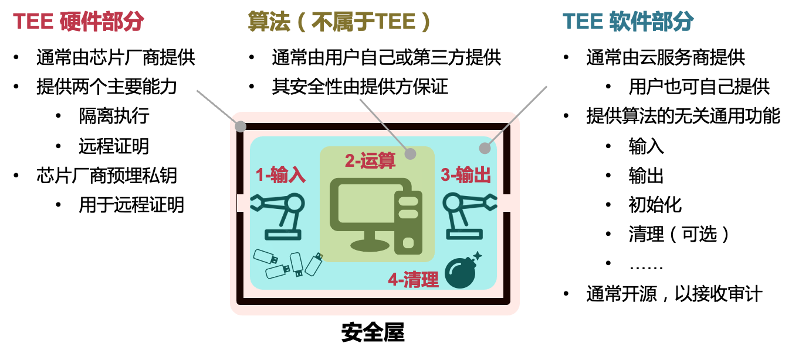

#### 四个问题对应的两个技术点

### TEE技术点一：远程证明

#### 如何向用户证明TEE是真的？

- 认证：TEE的硬件是真的
  - TEE来自某个芯片制造商（如Intel）
  - 方法：通过硬件中内置的私钥来判断（对应公钥由认证服务器维护）
  - 前提：该私钥不出硬件，且对应的公钥不可伪造
- 认证： TEE的软件是真的
  - TEE中加载的软件：包含系统软件和用户的软件
  - 方法：通过对TEE内存计算hash来判断（使用TEE内嵌私钥签名）
  - 时间节点：在所有代码加载入TEE的内存后，在执行第一行代码前（一旦开始执行第一行代码，自己的代码本身可能有漏洞）

#### 静态度量与动态度量

- 启动时的度量（静态度量）
  - 如专用的TPM芯片（Trusted Platform Module）
  - TPM验证最早启动的软件组件（如加载器bootloader）
  - 下层软件加载验证上层软件，形成信任链，TPM是信任根
  - 缺点：只能启动时度量
- 启动后的度量（动态度量）
  - 如Intel TXT（Trusted eXecution Technology）
  - 支持启动后对区域内存进行认证，如认证Hypervisor

#### **TEE** **的初始化与远程证明**

- TEE初始化（TEE服务商）
  - 初始化硬件环境，并加载软件进入TEE
- 远程证明（三方交互）
  - 用户向TEE发起一个认证请求
  - TEE生成认证，签名后返回给用户
  - 用户向验证服务器确认认证有效性
- 建立安全信道（用户与TEE）
  - 用户与TEE交换密钥后建立加密通道
- 通过信道输入数据，并调用算法执行（用户与算法）

#### 远程验证（Remote Attestation）

#### 远程证明的安全边界：何时无效？

- 远程证明可能被攻击成功的场景
  - TEE内部的私钥被泄露或被伪造
  - 认证服务器签名私钥被泄露或被伪造
  - 加密算法被攻破（如量子计算等）
  - 依然基于传统的PKI体系（如CA等）
- 信任方
  - TEE硬件制造商、远程证明服务提供方

### TEE技术点二：隔离执行

#### 云计算的安全等级

篡改内容：管理员可修改算法或数据使计算得出不正确的结果
窃取数据：管理员可窃取算法执行过程中在内存或存储中的机密数据
观察活动：管理员可观察到算法具体执行过程中与内存或存储的交互活动
如：访存行为、磁盘I/O行为、网络I/O行为，等等

| **安全等级**   | **篡改内容** | **窃取数据** | **观察活动** |
| -------------- | ------------ | ------------ | ------------ |
| **最高**       | 不允许       | 不允许       | 不允许       |
| **高**         | 不允许       | 不允许       | 允许         |
| **中**         | 不允许       | 允许         | 允许         |
| **低（现状）** | 允许         | 允许         | 允许         |

#### TEE的攻击面

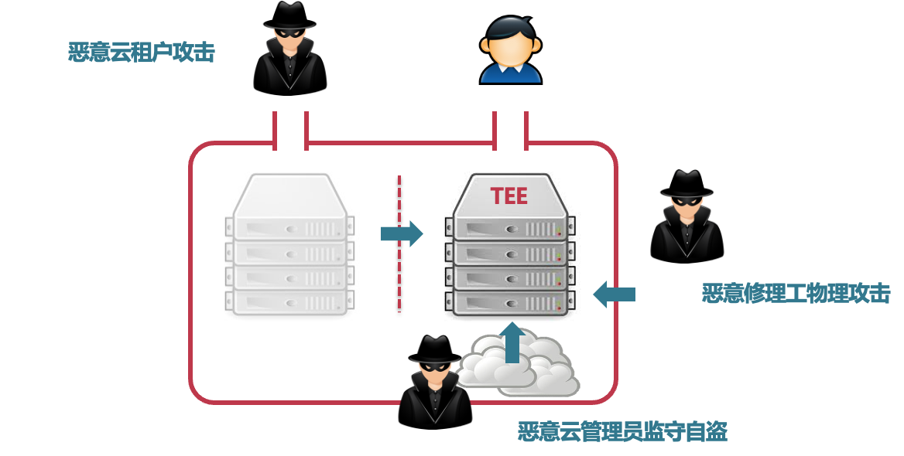

#### 攻击-1：恶意特权软件的攻击

- 特权软件：如操作系统、Hypervisor
  - 通常直接控制所有硬件资源
  - 为应用程序提供抽象，如系统调用
- 来自恶意特权软件的攻击 —— 降维打击
  - 可直接窃取或篡改用户数据和代码（隐私性与完整性攻击）
    - 包括CPU状态、内存、存储、网络等
  - 可拒绝为应用提供服务（可用性攻击）

#### 防御-1：基于访问控制隔离特权软件

- 利用硬件隔离机制限制特权软件的权限
  - 方法-1：直接新增硬件隔离能力保护TEE范围的硬件
  - 方法-2：引入更底层的特权软件（属于可信计算基）
- 典型实现
  - 页表机制，主流CPU均支持
  - PMP（Physical Memory Protection），如：RISC-V
  - PRM（Processor Reserved Memory），如：Intel SGX
  - 嵌套虚拟化，如：CloudVisor

#### 攻击-2：恶意硬件的攻击

- 硬件攻击的特点
  - 攻击难度更高：通常需要直接接触硬件（如伪装成维修人员）
  - 防御难度更高：直接绕过软件的防御（如访问权限）
- 典型的硬件攻击
  - 内存中间人攻击（威胁机密性、完整性与可用性）
  - 系统总线嗅探攻击（威胁机密性）
  - 非易失性内存窃取（威胁机密性、完整性）
  - 恶意DMA攻击（威胁机密性、完整性）
  - 内存冷冻启动攻击（威胁机密性）

#### 防御-2：基于内存加密防御物理攻击

- 隐私性保护：内存加密
  - CPU外皆为密文，包括内存、存储、网络等
  - CPU内部为明文，包括各级Cache与寄存器
  - 数据进出CPU时，进行加密和解密操作
- 完整性保护：Hash Tree
  - 对内存数据计算一级hash，对一级hash计算二级hash，形成树
  - CPU内部仅保存root hash
  - 当内存中的数据被修改时，更新Merkle Tree

#### 攻击-3：基于访问模式的侧信道攻击

- 侧信道（隐秘信道）
  - 原本无法直接通信的两方，通过原本不被用于通信的机制进行数据传输
  - 常见的隐秘信道：时间、功耗、电磁泄露、声音等
- TEE内代码执行过程会暴露访问模式
  - 磁盘和网络访问模式对特权软件可见
  - 内存访问模式可通过缓存和页表泄露
  - 例-1，利用页表攻击Intel SGX窃取TEE内数据
  - 例-2，利用缓存攻击TrustZone窃取TEE数据

#### 防御-3：混淆访问模式+减少资源共享

- 混淆访问模式（通常在应用层）
  - 使用常量时间算法以消除时间侧信道
  - 使用ORAM（Oblivious RAM）以混淆访存模式
    - 使用固定模式访问资源以消除信息泄露
- 减少资源共享（通常在系统层）
  - 空间隔离：为TEE使用单独的CPU核、内存和外设
  - 时间隔离：在切换时刷掉所有共享状态
    - 如缓存、TLB等可被观测到的状态

## 3. 可信执行环境的三种形态

#### TEE技术发展的三个阶段和三种形态

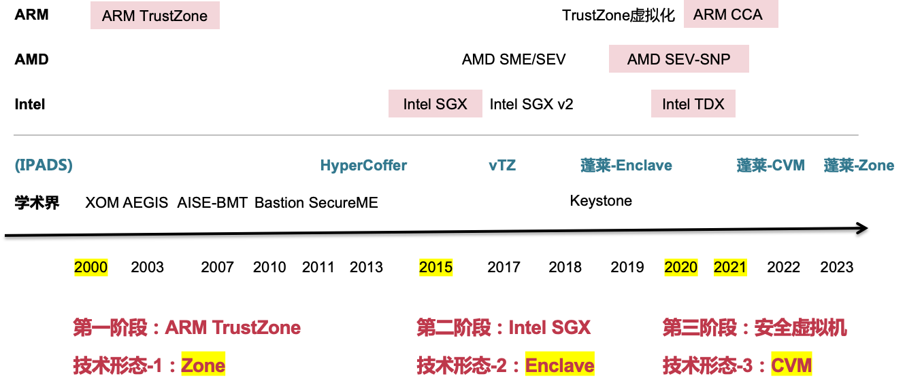

#### 三种形态的技术特点

### 形态-1：Enclave -- Intel SGX

- SGX: Software Guard eXtension
  - 2015年首次引入Intel Skylake架构
  - 保护程序和代码在运行时的安全（data in-run）
    - 其他安全包括：存储时安全和传输时安全
- 关键技术
  - Enclave内部与外部的隔离
  - 内存加密与完整性保护
  - 远程验证

#### 硬件内存加密与保护机制

- 硬件加密保护隐私性
  - CPU外皆为密文，包括内存、存储、网络等
  - CPU内部为明文，包括各级Cache与寄存器
  - 数据进出CPU时，由进行加密和解密操作
- 硬件Merkle Tree保护完整性
  - 对内存中数据计算一级hash，对一级hash计算二级hash，形成树
  - CPU内部仅保存root hash，其它hash保存在不可信的内存中
  - 当内存中的数据被修改时，更新Merkle Tree

#### EPC（Enclave Page Cache）

- CPU预留一部分内存作为安全内存，仅允许Enclave访问
  - 连续的128MB/256MB，这部分不会暴露给软件操作
    - SGXv2增加到256GB，但去除了完整性保护
  - 全部加密，并保证数据的完整性（即无法篡改）
    - 可能的篡改方法：通过总线直接修改
- 操作系统负责将EPC映射至Enclave中
  - 操作系统也可以触发swap，将数据从EPC交换到DRAM中(换入换出的时候会算哈希，保证内容不被篡改)
    - 由专门的硬件指令来进行swap，粒度为一个内存页（4K）
  - 注意：页表依然由不可信的操作系统控制

#### Enclave与进程的关系

- Enclave是进程的一部分
  - Enclave内外共享一个虚拟地址空间
  - Enclave内部可以访问外部的内存，反之则不行
- 创建Enclave的过程
  1. OS创建进程
  2. OS分配虚拟地址空间
  3. OS将Enclave的code加载到EPC中
     1. 并将EPC映射到Enclave的虚拟地址
     2. 循环3，完成所有code加载和映射
  4. 完成进程创建

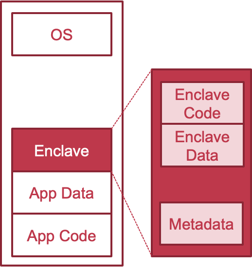

> ##### 远程验证（Remote Attestation）要解决的问题：如何远程判断某个主体是Enclave？例如，如何判断某个在云端的服务运行环境是安全的
>
> **必须在认证之后，再进行下一步的操作，例如发送数据**

#### 硬件内存加密

- 加密的最小单位
  - Cache line：64Byte（512bit）
- 方法一：单密钥加密
  - 缺点：同样的明文会产生同样的密文
- 方法二：多密钥加密
  - 缺点：如何保存这些密钥？CPU内部放不下
- 方法三：单密钥 + 多 seed
  - 为每个cache line单独生成一个seed，用密钥加密后，对数据进行异或
- 采用加密pad的方式而不是直接加密数据
  - 每个内存区域对应一个pad
  - 对pad进行加密，然后数据与pad进行异或以实现加解密
- 加密pad由key和seed共同组成
  - Seed可以由时空因子组成
  - 明文只需一次异或运算得到密文
- 任意两次加密的pad必须不同
  - 如果两次加密的pad相同，可以轻松的反推明文

#### 生成seed用于加密

counter：避免向同一个地址写两次同样的数据seed相同

任意两次加密的pad必须不一样

#### **内存完整性保护**

- Merkle hash Tree
  - 可以保证内存不会受到拼接和欺骗攻击
    - 不知道hash key无法计算对应的mac
  - 无法防御回放攻击
    - 攻击者可以将mac和data同时替换成老版本
- 将root hash (mac) 存储在CPU中
  - 防御回放攻击
    - 攻击者无法修改root mac的值

#### 形态-2：ARM TrustZone 技术

- ARMv6版本开始的安全硬件特性
  - 包括ARM11及Cortex A系列
  - 目前大部分手机芯片均有该硬件特性
- 同时运行一个安全的OS和一个普通的OS
  - 两个系统之间互相隔离运行
  - 安全的OS具有更多的权限
- TrustZone是一个全系统级别的安全架构
  - 处理器、内存和外设的安全隔离

#### TEE硬件状态与软件架构

- TEE内部运行一个完整的操作系统
  - 与Android版本无关，也无需适配
  - TEE与Android通过共享内存进行交互
- TEE内部也分内核态与用户态
  - TEE用户态可运行多个安全应用（TA）
  - 安全应用可支持动态下载和动态更新
- TEE内部结构
  - Secure OS + 中间件 + 安全应用 + 外部交互

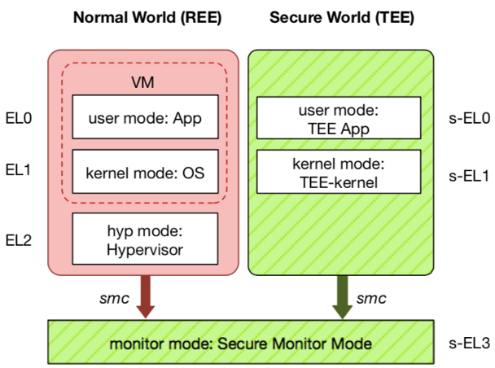

#### 例：用TrustZone保护指纹的录入和识别

#### 形态-3：机密虚拟机 -- AMD SEV

- 以虚拟机为粒度的Enclave
  - 对不同的虚拟机进行加密
  - 每个虚拟机的密钥均不相同
  - Hypervisor有自己的密钥
- 安全模型的缺陷
  - 依然部分依赖Hypervisor
    - 如：为VM设置正确的密钥

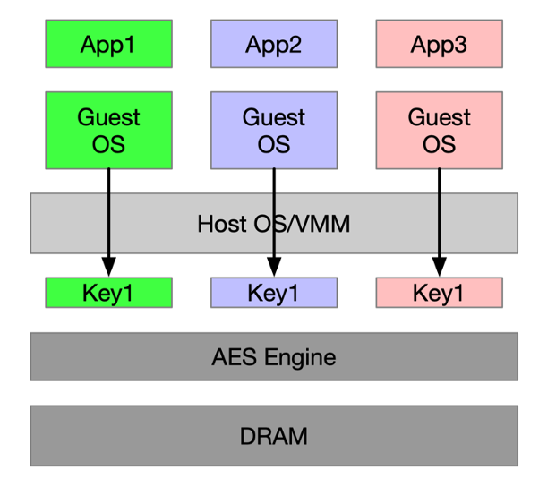

#### RISC-V平台的可信执行环境

- RISC-V具有一个新的模式：Machine-Mode
  - 位于操作系统和Hypervisor之下，直接访问物理地址
  - 具有最高权限，可访问所有的计算资源，并提供新的功能
  - 在M-Mode下实现的软件monitor，可实现Enclave的接口
  - 这个任何人都可以改

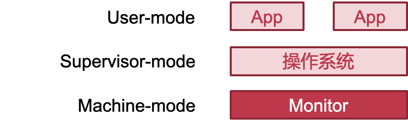

#### 蓬莱TEE

#### 蓬莱平台目前三种架构都支持

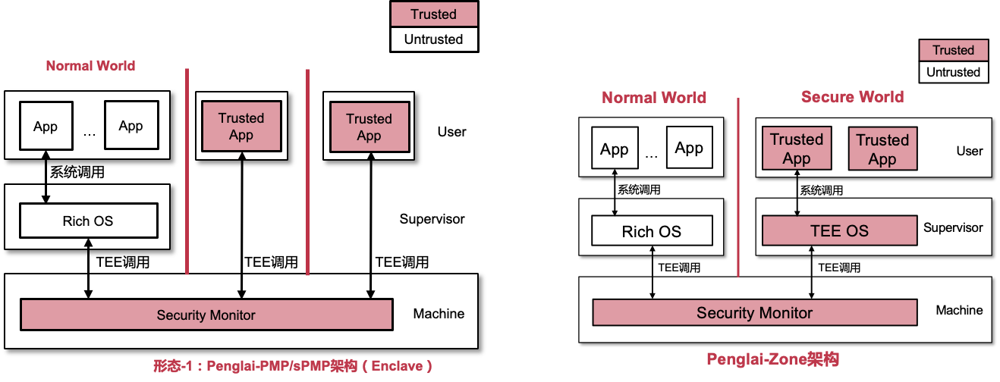

## 小结：**控制系统复杂性**

- TEE/Enclave的抽象是一种简化

  - 对威胁模型和信任关系的简化

    - 例如：Intel SGX将对软硬件环境的信任规约到对Intel的信任

  - 这种简化有可能带来新的问题：Single-point of Failure

    > 这意味着Intel SGX依赖于Intel提供的硬件和软件来实现其安全性和可信性。如果Intel本身存在漏洞、后门或其他安全问题，那么整个SGX系统就会受到威胁，因为它依赖于Intel的可信性。
    >
    > 这种依赖性给了Intel作为一个实体过大的权力和责任。一旦Intel发生安全漏洞、被黑客攻击或存在其他问题，所有使用SGX技术的系统和应用程序都可能受到影响。这种情况下，整个系统将成为单一的故障点，可能导致数据泄露、代码执行问题或其他安全威胁。

- TEE/Enclave的主要技术

  - 远程证明：对密钥的管理
  - 隔离执行：基于权限的隔离与基于加密的控制

#### TEE/Enclave的不足

- 仅靠隔离是不够的，还需要考虑交互安全
  - Enclave依然需要OS提供服务：调度、系统调用、资源分配...
  - 即使隔离，OS依然可能发起的攻击包括
    - 接口攻击：合法的系统调用返回错误的值
      - 例：malloc返回指向栈的地址，导致内部自己破坏掉栈
    - DoS攻击：拒绝分配计算资源（恶意调度）
- 依然受到侧信道等攻击的威胁
  - Spectre、L1TF

## 侧信道与隐秘信道

> 隐秘信道（Covert Channel）
>
> - 原本无法直接通信的两方，通过原本不被用于通信的机制进行数据传输
> - 常见的隐秘信道：时间、功耗、电磁泄露、声音等
>
> 例：消费记录的应用 A，在没有网络的情况下如何把数据发出去？
>
> - 假设有一个应用B运行在同一个手机
> - 若A可播放声音，B可录音，则A把数据编码为声音发送给B
> - 若A可打开闪光灯，B可摄像，则A把数据编码为光的闪烁长短与频率发送给B
> - 若A可震动，B可访问运动传感器，则A把数据编码为震动频率发送给B
> - 若B可访问CPU温度，则A可长时间运行计算密集代码，CPU升温表示1，反之为0
> - ...

#### 侧信道与隐秘信道的关系

- 侧信道与隐秘信道很类似
  - 两者都使用类似的方式（信道）进行数据的传递
- 侧信道攻击和隐秘信道攻击的不同
  - 隐秘信道攻击：两方是互相串通的，其目的就是为了将信息从一方传给另一方
  - 侧信道攻击：一方是攻击者，另一方是被攻击者，攻击者窃取被攻击者的数据, 即被攻击者无意间通过侧信道泄露了自己的数据

#### 缓存信道（Cache Channel）

- 利用缓存的状态推测执行的信息
  - 例如：可根据 func_a 还是 func_b 的代码在缓存中，来判断 i 的值(在测试进行前，首先要让cache中的func_a和func_b都miss（flush))
  - 判断方法：func_a 和 func_b 的时延
- 常见的四种攻击方式
  - Flush+reload
  - Flush+flush
  - Prime+probe
  - Evict+time

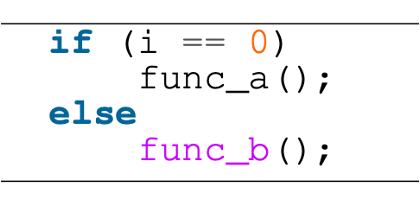

#### 1. Flush+Reload

- **假设：**攻击进程和目标进程共享一块内存

- **攻击步骤**

  - 1. 攻击进程首先将 cache 清空（如：不断访问其他内存占满cache或直接flush）

  - 2. 等待目标进程执行

  - 3. 攻击进程访问共享内存中的某个变量，并记录访问的时间

    - 若时间长，则表示 cache miss，意味着目标进程没有访问过该变量

    - 若时间短，则表示 cache hit，意味着目标进程访问过该变量

- **特点分析**

–优点：可以跨CPU核，甚至跨多个CPU；噪音低

–缺点：攻击准备难度高，需构造与目标进程完全相同的内存页

#### 2. Flush+Flush

- 基于缓存刷新时间（如clflush）来推测数据在缓存中的状态

  - 攻击进程首先将 cache 清空（Flush）

  - 等待目标进程执行

  - 运行clflush再次清空不同的缓存区域
    - 若时间较短说明缓存中无数据
    - 时间较长则说明缓存中有数据，目标进程曾访问对应的内存

- 特点分析
  优点：只需清空缓存而不需实际访存，因此具有一定的隐蔽性
  缺点：clflush对于有数据和无数据的时间差异不明显，攻击精度不高

#### 3. Evict+Reload

场景：CPU没有 clflush 指令

1. 将关键数据所在的 cache set 都替换成攻击进程的数据
   前提：攻击者知道关键数据的内存地址，以及CPU上内存-cache的映射机制
2. 等待目标进程执行
3. 访问 cache set 中的某个数据
   1. 若时间很短，说明目标进程没有将该数据 evict，即没有访问过某个关键数据
   2. 反之，则说明目标进程访问了某个关键数据

特点分析

- 优点：无需依赖 flush 指令
- 缺点：无法支持动态分配的内存；需要了解 LLC 的 eviction 策略；Cache 必须是 inclusive；无法很好地支持多 CPU

#### 4. Prime+Probe

攻击的具体步骤如下:

1. 攻击进程用自己的数据将 cache set 填满（Prime）
2. 等待目标进程执行
3. 再次访问自己的数据
   若时间很短，说明目标进程没有将该数据 evict，即没有访问过某个关键数据
   反之，则说明目标进程访问了某个关键数据

特点分析：

- 优点：不需要共享内存;支持动态和静态分配的内存
- 缺点：噪音更多；需要考虑 LLC 的实现细节，如组相连等；Cache 必须是 inclusive;无法很好地支持多CPU；需要首先定位目标进程使用的cache set

> 需要物理接触或共享内存：Prime+Probe攻击需要攻击者与目标系统物理接触或共享一部分内存。这意味着攻击者需要在目标系统上安装恶意软件或者拥有物理访问权限，这在许多情况下是不可行的。因此，该攻击对于远程攻击来说并不适用。
>
> 需要预先对目标系统进行Prime阶段：Prime+Probe攻击需要在目标系统上执行"Prime"阶段，以在缓存中加载特定的数据或设置特定的状态。这个Prime阶段的执行可能需要一定的时间，并且在一些情况下，攻击者可能无法准确地预测或控制目标系统上的Prime阶段。这可能导致攻击的成功率下降。
>
> 受到干扰和噪声的影响：Prime+Probe攻击在获取敏感信息时受到干扰和噪声的影响。例如，其他进程的活动、系统负载变化或硬件故障等因素可能影响到攻击的准确性和可靠性。这些干扰因素使得攻击的成功率降低，并且可能需要进行多次尝试才能成功地提取出目标信息。
>
> 依赖于特定的硬件和架构：Prime+Probe攻击的成功性也受限于目标系统所使用的硬件和架构。攻击者需要根据目标系统的具体情况进行定制化的攻击技术和代码，这可能需要对多个硬件和架构进行适配和优化。因此，攻击者可能需要针对不同的系统进行研究和开发，增加了攻击的复杂性和成本。
>
> ##### 为什么这种攻击方式在多CPU上不可行？
>
> 1. 缓存一致性：在多CPU系统中，每个CPU都有自己的缓存，用于存储最近使用的数据。然而，这些缓存之间需要保持一致性，以确保数据的一致性和正确性。当一个CPU修改了共享数据时，它必须通知其他CPU刷新其缓存中的副本。这种缓存一致性协议（如MESI或MOESI）会导致在不同的CPU之间共享数据时的延迟和开销，从而干扰Prime+Probe攻击所依赖的时间测量和干扰效应。
> 2. 干扰效应：Prime+Probe攻击通过在Prime阶段将特定数据加载到缓存中，然后在Probe阶段通过测量访问该数据的时间来推断缓存中的信息。在多CPU系统中，其他CPU的活动和访问模式可能会导致缓存中的数据发生变化，从而干扰攻击的准确性。由于多个CPU同时访问共享数据，缓存状态的变化更加频繁和复杂，使得攻击者很难精确地进行时间测量和数据推断。
> 3. 时间测量的不确定性：在多CPU系统中，由于每个CPU可能有不同的时钟频率和延迟，攻击者在不同CPU上进行时间测量时可能会遇到不确定性。这意味着相同的访问可能在不同的CPU上产生不同的测量结果，导致攻击的准确性下降。

### 侧信道攻击的防御

- **侧信道攻击很难被完全防御住，根本原因在于共享**
  - 当被攻击者在做了某个操作后，对系统整体产生了影响
  - 这个影响能够被使用同样系统的攻击者发现，那么就构成了一个最简单的侧信道：发现影响和没发现影响（即做了操作和没做操作）可以被编码为 0 和 1
- **防御侧信道的根本方法：不共享**
  - 将攻击者和被攻击者运行在完全隔离的物理主机，使其没有任何共享，包括计算硬件、网络，甚至空间（光、温度、声音）
  - 更实际的方法是针对常见攻击进行防御

#### 常量时间（Constant Time）算法

- 算法的运行时间与输入无关
  - 无法通过运行时间得到与输入相关的任何信息
  - 代码执行没有分支跳转
- 常见的实现方法：cmov
  - Conditional MOV
- 缺点：计算变得更慢
  - 需要做两份运算

#### 不经意随机访问内存（ORAM）

- ORAM 将访存行为与程序执行过程解耦：攻击者即使能够观察到所有的访存请求，也无法反推出与程序执行相关的信息
- **最简单的实现：定时、定量、定位的访问方式**
  - 无论实际是否有访存需求，均以固定周期，访问固定位置，每次访问固定的大小
  - 例如， CPU 顺序循环访问所有的有效内存区域，程序按需获得真正想要访问的数据，若还没访问到则等待，若已经访问过了则等待下次循环
  - 类似上海和北京之间的高铁，无论乘客是谁，都按照时刻表运行，哪怕有时候位子没坐满也发车，因此根据高铁的班次并不能反推出谁坐了高铁
- ORAM 会引入很大的额外负载
  - 产生大量的无效内存访 问，导致有效访存的吞吐率下降
  - 访存需要等待一定的时刻，导致时延大幅度增加

## 5. 案例分析：Meltdown

#### 背景-1：基于页表权限的内核数据保护

操作系统对内核数据的保护方法：操作系统使用硬件提供的**页表**机制实现对内核内存的访问控制。所有程序均使用虚拟地址进行对内存数据的访问操作，而页表控制了虚拟地址与实际物理地址的转换，并且在转换过程中进行访问权限的检查。

对于内核内存，其会在页表中进行特殊标注，只有运行在内核态的程序才能够访问该内存数据。

当操作系统正常访问内核数据时，在地址翻译的过程中，页表会发现当前CPU特权级满足内存的权限管控要求，应许访问；

而当一个恶意应用企图访问内核内存时，页表会发现当前CPU处于用户态，与内核内存所要求的的内核态权限不符，从而拒绝本次访问.此时，CPU会触发一个硬件异常，而应用就会看到我们常见的段错误！

**页表所提供的用户/内核内存权限检查机制，是现在操作系统对内存保护的最核心技术之一。**而Meltdown漏洞则能够绕开这一最为核心的内存保护机制，让其形同虚设

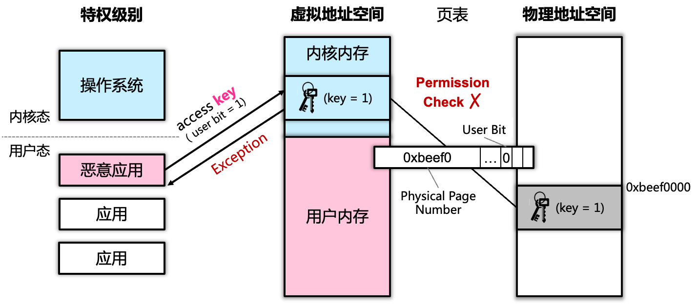

#### 背景-2：CPU投机执行（预测执行）

> Meltdown漏洞绕开页表隔离机制的主要手段是利用CPU的投机执行技术，我们对其简单回顾一下。
>
> 现代CPU为了执行效率的提升，其内部会有多个执行单元，能够并发执行多条指令。
> 因此，CPU会投机发射临近的指令进行并发执行，虽然最后所有的指令会被顺序提交，但是指令在执行过程中仍然是并发投机的。
>
> 那么由此而来的一个问题是：如果投机执行了错误的指令怎么办？
> 例如。。。
>
> CPU的设计人员考虑到了该问题，对于不该被执行到的指令，处理器会丢弃或者回滚掉漆对所寄存器、内存等执行状态的所有修改。
>
> 面对机器复杂的CPU结构，设计师不能够确保对所有状态的正确回滚

- CPU为了性能会进行投机执行
  - 处理器内部会并发执行多条指令，无依赖关系的邻近指令在处理器内部的执行顺序会被打乱，部分指令会被提前
- 问：若提前执行了错误指令怎么办？如前一条指令异常，处理器投机执行了后续本不应被执行的指令
- 答：执行结果丢弃/回滚：对于不应被执行的指令，处理器会丢弃/回滚其对寄存器、内存等执行状态的修改
- 复杂的CPU能确保所有状态均正确丢弃/回滚吗？不能

#### Meltdown漏洞原理

- 起因：迟到的内存访问异常
  - 在投机执行期间，跨权限的内存访问不会立刻触发异常，而是仍会继续执行后续指令
- 故障：遗漏的缓存状态回滚
  - 当硬件抛出内存访问异常时，CPU理应回滚被错误执行指令对所有状态的修改
  - 但是，**实际上CPU未回滚被错误执行指令对CPU缓存的状态修改**
- 结果：应用可任意读取操作系统内存
  - **利用缓存隐秘信道，窃取非法访问到的内核数据**

> 漏洞的起因是CPU的投机执行，正常情况下，当用户发起对内核内存的访问请求，会触发一个内存访问异常。但是由于投机执行机制，该异常不会立刻发生，CPU仍然会乱序的执行到非法访问的后续执行令；
>
> 而在这个投机执行的小窗口内，应用就能够对内核内存进行非法的访问。
>
> 这是**隐秘信道**
>
> 到此其实还没有漏洞，因为正常情况CPU会回滚这个小窗口中的所有操作，所以即使临时拿到了内核数据，也无法完成攻击。
>
> 但是故障就发生在对于这些状态的丢弃、回滚上。
>
> 而造成的结果是，攻击者能够通过观察缓存状态的变化，从而窃取到内核数据。

#### example

最终，CPU并没有对缓存状态进行回滚，也就意味着指令2访问的buf1的数据会被加载到缓存中

- 通过未回滚缓存状态窃取目标数据
  - 使用目标数据作为索引访问攻击数组 buf （指令2）
    - 被访问元素会被加载到缓存中
  - 异常发生后，根据数组元素是否被缓存，窃取目标数据
    - 若buf中第 i 个元素在缓存中，则目标数据 key = i

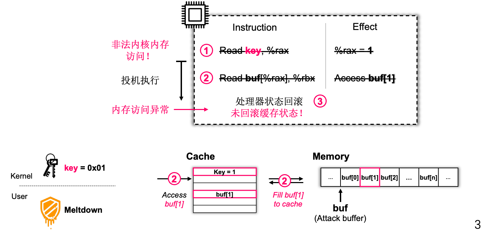

> 利用遗留在缓存中的数据，攻击者就能够间接获得目标的内核数据key
>
> 攻击者只需要将目标数据作为索引发起对一个bug数组的访问，之后目标元素就会被加载到缓存中。
>
> 之后，攻击者仅需逐一查看bug数组中拿一个元素在缓存中，就能够窃取到目标数据

#### Meltdown漏洞危害

- 允许对内核内存的随意访问
  - 用户态与内核态共享同一虚拟地址空间，仅通过页表中的权限位进行内核内存的隔离保护
  - 利用Meltdown可随意读取任意内核内存
- 允许对所有内存资源的随意访问
  - 内核地址空间大多映射了所有物理内存
    - 如Linux中的direct map区域直接映射了整个物理内存区域
  - 利用Meltdown可对direct map区域进行读取，从而访问所有内存数据

> 目前操作系统主要依赖页表的用户;内核权限检查，进行用户内存与内核内存的隔离。而Meltdown漏洞能够直接绕过这一检查，从而允许攻击者随意去读任意的内核内存数据。
>
> 更为严重的是，在之前的课程我们有介绍过，操作系统一般会直接映射所有的物理内存资源。例如Linux中的direct mao区域。
>
> 也就意味着，攻击者应用Meltdown漏洞能够随意访问整个系统的内存资源

#### Meltdown漏洞的软件防御方法

在上述的漏洞原理介绍中，我们观察到，Meltdown漏洞的主要能力其实是绕过页表中的用户/内核权限位，但是其无法访问“没有内存映射的内存数据。如果一个目标地址在也表中不存在映射，那么攻击者就睡没有数据可偷

思路：**去除内核地址在用户态的映射，为用户态构建专用页表**，**将内核地址在用户态的映射去除**，攻击者利用Meltdown访问内核地址时，页表无法定位目标物理地址

#### KPTI：Linux的Meltdown漏洞防御机制

> **Kernel** **Page** **Table** **Isolation**

将用户态与内核态所用页表分离:

- 用户页表：仅映射用户地址空间与部分内核地址空间
- 内核页表：映射包括用户与内核的全部地址空间（与原有一致）

#### KPTI造成的性能损失:页表切换导致显著的性能损失

- 切换操作本身的时延增加

  - 切换操作：旧页表保存 -> 新页表加载  -> 修改CR3 -> 刷新TLB

  - 进出内核均需切换页表并刷新TLB，额外指令导致切换时延增长

  - 操作发生在系统关键路径

- 切换后的运行时性能损失: TLB刷新导致TLB未命中率提升，直接影响程序执行性能
- 部分应用性能降低可达30%

#### KPTI：性能优化方法

**优化单一切换操作的时延**: 页表切换仅需简单位操作

首先KPTI对切换操作进行了优化，旨在减少切换过程中的非必要内存访问。

通过在页表分配时，将两个根页表放在响铃的两个4K页中，切换代码无需加载/保存页表，只需对现有cr3中的页表进行一次位操作即可得到目标页表地址

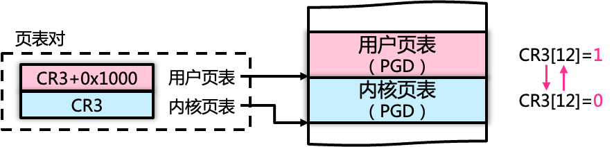

**优化非必要的TLB刷新**:用户/内核页表使用不同的ASID，进出内核无需刷新TLB (ASID会作为tag进行TLB索引,CPU仅匹配与当前ASID一致的TLB项)

刷新TLB的目的是防止攻击者使用内核遗留在TLB中的映射缓存，从而发起meltdown攻击。

KPTI可以利用TLB中的address space id机制，CPU只会使用与当前ASID一致的TLB缓存。

这样通过给用户也表和内核页表分配不同的ASID，就可以避免页表切换过程的TLB刷新操作；

同样的，为了避免内存访问，用户与内核的ASID只差1bit，这样切换代码仍可以通过简单的位操作进行两个页表的转换。

# OS Debug

## 1. 调试器的基本原理

#### 调试器的作用与功能

作用：定位和修复BUG，帮助程序员理解程序行为

基本功能：

- 中断程序运行读取内部状态
- 获取程序异常退出原因
- 动态修改软件状态
- 控制流追踪

#### 调试器 – 建立调试关系

- **Linux的调试支持：ptrace系统调用**
  - GDB建立调试控制关系
    - 子进程通过PTRACE_TRACEME将调试权交给父进程
    - 通过PTRACE_ATTACH调试指定pid的进程
  - 如何调试下述触发除零错误程序

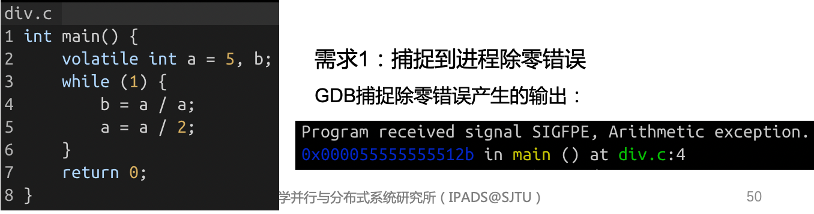

#### GDB捕捉异常信号流程

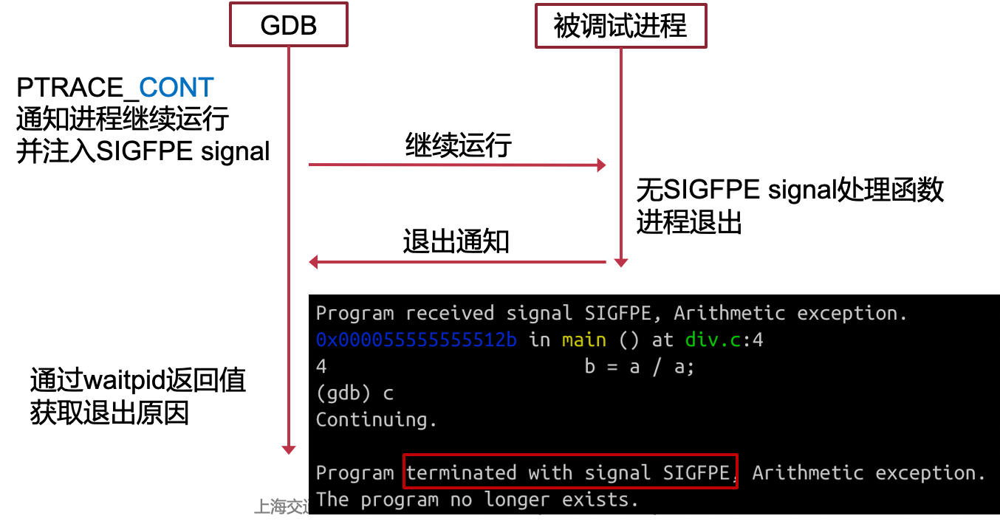

#### 调试器 – 配置断点

- 需求2: 停止进程运行，用以观察进程状态
  - 发送SIGINT至进程
  - 或断点：在执行到特定指令地址时停止运行
- 使用断点调试
  - 在第4行插入断点
  - 观察变量a的值是否为0

#### 断点的硬件支持

- 断点异常指令
  - 在执行到特定指令时，触发断点异常陷入内核
  - x86的int 3指令，AArch64的BKP指令
- 单步调试
  - 程序在用户态执行一条指令后立即陷入内核
  - 通过特殊寄存器配置：x86的Trap Flag，AArch64的Software Step

#### GDB配置断点及断点触发

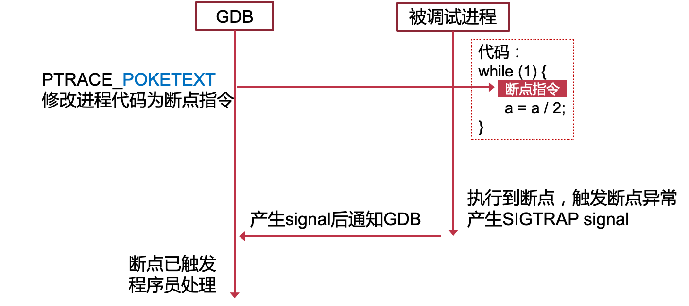

#### GDB断点恢复运行

#### 调试器 – 配置内存断点

- 需求3: 变量遭到异常修改时中断运行
- 内存断点
  - 在变量a被修改时中断运行，观察是否为0

#### 内存断点的硬件支持

- Naïve实现
  - 把内存地址所在页设为只可读
  - 访问时触发page fault
  - 缺点：对该页所有写操作均导致page fault，性能较差
- 断点寄存器
  - 当访存地址为寄存器中的值时，触发断点异常

#### 断点寄存器

- x86断点寄存器
  - 访存地址等于断点寄存器触发中断
  - 访存条件可配置
    - 数据写 （内存断点）
    - 数据读和写 
    - 指令地址（断点）
- GDB配置被调试应用的断点寄存器
  - 通过PTRACE_POKEUSER设置

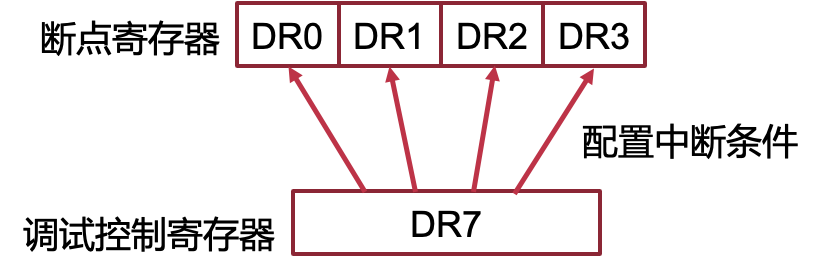

#### 远程调试

## 2. 操作系统的调试器支持

#### 操作系统调试器常见实现方法

- 调试操作系统调试支持的难点
  - 缺乏操作系统提供给用户态的调试功能支持
  - 硬件相关问题，如外部设备、页表等
- 模拟器
  - 虚拟机：完整模拟底层硬件，在模拟器中提供GDB stub
  - 用户态模拟：例如 User-mode Linux，忽略硬件相关的实现，使Linux内核以普通进程的方式运行
- 内核自身实现的调试器
  - 操作系统内部实现GDB stub，如Linux的KGDB

#### 案例：QEMU的GDB支持

- 与调试普通进程对比
  - 不再有进程抽象相关的支持（如signal和系统调用跟踪）
  - ptrace相关接口替换为虚拟机管理接口
    - 如内存读写由PTRACE_POKETEXT替换为直接读写虚拟机内存（假设hypervisor能直接访问虚拟机内存）
- 挑战
  - 不能干扰客户机操作系统内部使用调试功能
  - 断点指令失效
    - 动态代码装载覆写断点指令使断点失效

#### 断点指令相关问题

- 使用断点指令在操作系统调试中的困难

  - 动态代码装载复写断点指令使断点失效

  > 动态代码装载（Dynamic Code Loading）是指在程序运行时动态加载和执行代码的过程。传统的静态编译方式在程序编译阶段将所有的代码编译为可执行文件，而动态代码装载则允许程序在运行时根据需要加载和执行代码，从而提供了更大的灵活性和动态性。
  >
  > 动态代码装载通常涉及使用特定的编程技术和API来实现。具体来说，动态代码装载可以包括以下步骤：
  >
  > 1. 加载代码：在运行时，程序使用相关的API或机制从外部文件或其他来源加载代码。这些代码可以是预先编写好的模块、插件、动态链接库（DLL）或共享对象等。
  >
  > 2. 代码解析：加载的代码需要进行解析，以获取函数、变量和其他相关的符号信息。这可以通过符号表、元数据或其他约定来实现。解析过程将使程序能够识别和访问加载的代码中的特定功能和资源。
  >
  > 3. 内存分配：为了执行加载的代码，程序需要在内存中为其分配空间。这可能涉及动态分配内存或使用操作系统提供的内存映射机制。分配的内存将用于存储加载的代码、数据和相关的执行环境。
  >
  > 4. 代码执行：一旦代码加载和内存分配完成，程序可以通过调用相应的函数或入口点来执行加载的代码。这将导致加载的代码在程序的上下文中运行，从而实现所需的功能或扩展。
  >
  > 动态代码装载的主要优点是增加了程序的灵活性和可扩展性。它允许程序在运行时动态加载和卸载代码，从而实现模块化的设计、插件系统、动态功能扩展和热更新等特性。动态代码装载在许多应用领域都有应用，包括动态语言解释器、插件式应用程序、动态网页技术和即时编译器等。

- 解决方法：硬件断点

  - 指令地址等于断点寄存器即触发中断
  - 缺点：影响虚拟机内部使用硬件断点

## 3. 性能调试

#### 为什么需要性能调试

程序功能性正确，但性能未达到理想情况，分析程序性能瓶颈：

- 程序运行时哪部分代码耗时较长
- 哪部分内存发生较多缓存缺失
- 跳转指令是否发生大量错误预测

#### 硬件计数器

- 监控程序执行过程中处理器发生某些事件的次数
  E.g., 执行指令数量，各级缓存缺失（cache miss）次数
- 使用方法1:  获取事件发生次数
  - 设置事件类型，打开计数器
  - 一段时间后读取计数器
    - 用户态通过特定指令或系统调用读取
  - 使用该方法分析 hackbench 性能瓶颈仍需大量插桩，意义不大

#### 硬件计数器 – 采样

- 直接读取计数缺点
  - 缺点：可能涉及对原有代码修改（插桩）
- 使用方法2: 采样
  - 设置事件类型，打开计数器
  - 当计数器溢出时，产生中断
    - 在中断处理中获取地址信息
    - 清空计数器，等待下一次中断
  - 分析 hackbench 性能瓶颈：每经过一定cycle数触发一次中断，统计中断时指令地址，观察这些地址属于哪些函数

#### Linux性能计数器采样支持

- 性能相关事件 perf events
  - 以event的抽象暴露性能计数器（以及一些其它性能调试方法）
  - perf_event_open通知内核需要使用哪些计数器
  - 采样过程由内核完成
  - 采样结果放入内核与用户态共享的内存中，减少读取大量采样信息时的开销
- 前端工具perf
  - 直接使用perf events相关系统调用仍然较复杂
  - perf工具包装常见的性能分析方法

#### 采样分析hackbench

#### 基于中断采样的缺点

- 中断时收集信息的缺陷
  - 采样获取的指令地址不准确
    - 中断发送需要时间，CPU收到中断时的指令地址，与产生采样点指令地址可能存在偏移 （skid）
    - 乱序执行
  - 中断时无法收集完整的采样信息
    - E.g., 缓存缺失时，对应的内存地址未知
- 更精确的采样支持需要：
  - 计数器溢出时马上收集信息
  - 能够收集更广泛的信息

#### 精确采样硬件支持

例如x86的PEBS (Processor/Precise Event Based Sampling)：计数器溢出时，立即记录相关信息至内存（其实还是会有一定的时间差）

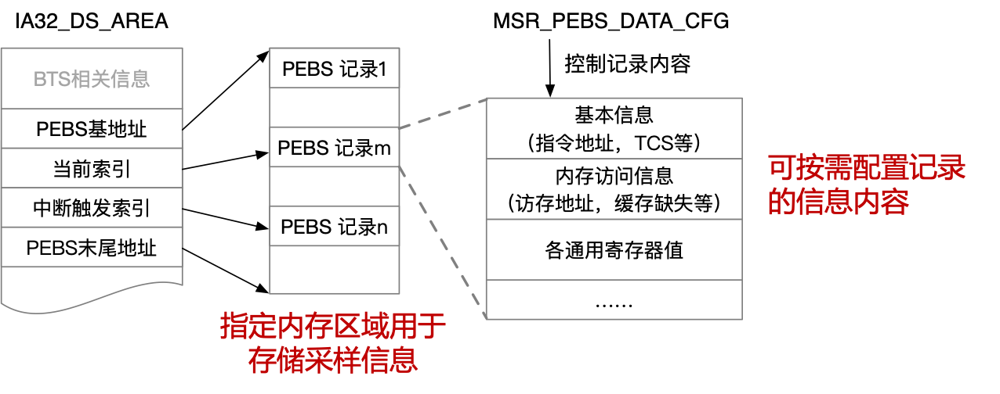

- 有无必要启用精确采样分析 hackbench（–perf record -e cycles:ppp hackbench）
  - 不具备必要性：即使指令地址有偏移，针对cycle数采样情况下，各函数收到中断的概率大致不变
- 何时需要启用精确采样：
  - 需要确定发生特定事件（缓存缺失、跳转预测失败）时指令地址
  - 需要除了指令地址外的其他采样信息
  - E.g., 获取缓存缺失地址：perf mem record

#### 基于软件的控制流追踪

backtrace：根据调用栈递归获取上层调用者

缺点：

- 编译器优化可能去除栈指针存储
- 只能处理函数调用
- 无法应对jmp、中断等导致的控制流变化

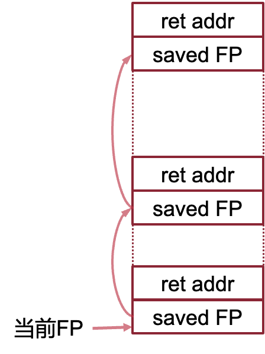

#### 基于硬件的控制流追踪（属于PEBS）

- 记录jmp、call、中断等导致跳转的前后位置，构建完整控制流
- e.g., Last Branch Record (Intel)：两组寄存器分别构成栈，记录最近N次跳转的信息

#### 追踪hackbench控制流

- 指示perf采样时记录控制流变化：
  - perf record -e cycles -g hackbench
  - perf report

#### 程序执行追踪

- 步骤一：确定哪些函数占用了较长执行时间 - 采样
- 步骤二：确定是如何执行到该函数的 – 控制流跟踪
- 步骤三：理解程序行为，为什么会产生这种调用关系
  - hackbench 中大量时间处理socket读写，读写数据规模有多大
  - 作为调度测试，hackbench 是否对调度器产生了足够压力-静态追踪
- 需要具有更多程序语义的跟踪机制

#### 静态追踪方法

- 在代码编写时静态插桩获取信息的方法
  - 简单可靠的方法：打印
  - 在常用的函数中预置静态的跟踪函数，打印可能造成性能开销
    - 提供打开或关闭选项，关闭时应几乎不产生性能开销
    - e.g., Linux 的 Tracepoint

#### 分析hackbench中线程切换

Tracepiont作为perf event事件：perf record -e sched:sched_switch hackbench

- 作为调度测试，hackbench确实触发了大量调度
- 获取了调度前后进程名、pid、优先级等信息

#### **静态追踪方法缺陷**

- 修改静态定义的跟踪点需要重新编写、部署内核

- 比如，Hackbench中，已知socket读操作耗时较长，希望判断是否是数据量较大导致的，但是vfs_read没有预置静态Tracepoint

#### 动态追踪方法

程序运行时，在不确定的代码位置插入一段动态指定的追踪函数，e.g., Linux kprobe，实现方式类似于断点调试

#### Linux动态追踪方法kprobe

使用和调试器类似的原理动态插入代码：e.g., 配置handler函数在执行 指令2 之前执行

#### example：分析hackbench数据读写大小

## 4. 测试的基本原则和方法

#### 测试的目的

- 验证程序功能正确性
  - 程序是否会崩溃
  - 功能是否与设计一致
- 基准测试：确定程序在特定运行环境下的性能指标
- 操作系统测试的必要性：作为基础设施，操作系统的正确性和性能直接影响上层应用

#### 操作系统测试的基本方法与原则

- **测试规模由小至大：小规模测试中暴露的错误更方便定位**

  - 单元测试：以函数或功能模块为粒度测试

    - ChCore：单独编译内存管理、调度器等模块，在无需运行内核条件下测试

    - Linux：KUNIT，仅编译部分代码，在UML模式下运行

  - 单元测试完成后进行集成测试

    - 集成测试：整合各个功能模块统一测试

    - ChCore：完整部署内核并运行用户态应用，对网络、文件系统、同步原语等测试
    - LTP（Linux Test Project）针对大部分系统调用进行测试

- **代码迭代中，尽早确认新修改是否引入** **BUG**

  - 产生BUG的原因
    - 新的修改本身异常
    - 代码修改触发原有隐藏的异常

  - 回归测试
    - 小规模代码修改后马上运行测试，即使该测试与修改部分无直接关系
    - ChCore：每次代码被push到远端，以及代码合并进主线前，都会运行完整的测试

#### 兼容性测试

> 确保操作系统能够运行在不同硬件平台，支持各类不同应用

- 测试不同硬件环境下兼容性:

  - ChCore：各类测试在虚拟化的x86，虚拟化的AArch64，真实的AArch64硬件均部署运行

  - Linux：kernelci 验证Linux在各类不同硬件上能否完成基本测试

- 测试向上能否兼容应用
  - 向后兼容性，操作系统开发迭代后仍能运行较老的应用
  - 不同操作系统间如何提供统一的接口
    - 如针对Linux开发的应用能够部署在众多Linux发行版中
  - 遵循各类标准
    - 如Linux目录树标准 FHS (Filesystem Hierarchy Standard)
    - 如API 标准 POSIX (Portable Operating System Interface)
  - 针对标准进行测试
    - 使用 POSIX Test Suite 验证 POSIX 接口符合标准

#### 操作系统稳定性

> 基本功能正常前提下，需要确保极端状况下操作系统的正常运行

- 压力测试
  - 压榨处理器、内存、I/O等资源至极限
  - 频繁进行系统调用
- 长时间测试 (长稳测试)
  - 提高测试时的代码覆盖率
  - 未测试代码出现异常概率更高

#### 压力测试案例： syzkaller模糊测试

**模糊测试（fuzzing）**:

- 为操作系统构造大量随机系统调用并执行
- 系统调用参数随机变化，期望能覆盖更多代码
  - 但是纯随机变化参数效果不佳, 大量输入可能属于同一等价类，代码执行路径相同
- 基于变异（mutation）的参数生成: 在已有参数基础上随机变化
  - 部分随机变化会引入新的代码覆盖
  - 收集产生新代码覆盖的输入，作为新的等价类
  - 在新输入基础上继续变异

- 多个虚拟机运行操作系统
  - 提升测试效率
  - 虚拟机内部不断进行：
    - 系统调用
    - 系统调用参数变异
    - 收集代码覆盖信息
- 共享语料库: 提升变异的效率

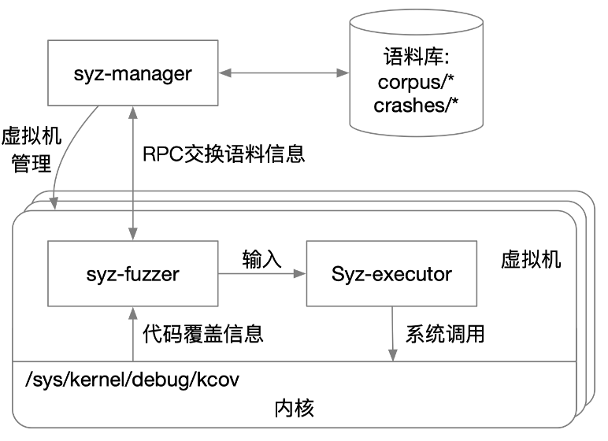

#### 性能测试

> **定量比较不同软硬件配置下性能表现**

- 选择合适的测试程序
  - 明确测试的性能指标（如吞吐量，延迟等）
  - 明确测试的场景（如文件系统读写测试使用顺序还是随机）
  - 已有测试不满足需求时可以自己实现测试程序, 但必须确保测试符合真实场景，有代表性

- 控制无关变量
  - 以文件系统测试为例
  - 软件配置：文件系统类型，配置（日志级别，缓存）
  - 硬件配置：硬盘种类和型号
  - 其他无关因素：内核版本，时钟中断频率，无其它占用大量资源的应用
- 减少随机不稳定因素
  - 考虑预热一段时间再测试
  - 绑核心运行
  - 避免跨NUMA节点的内存访问

#### 持续集成

> **有效地进行和管理测试**

- 持续集成 ( CI, Continuous Integration )
  - 开发者较频繁地将代码合并入主线，使用自动化测试保障代码正确性
  - 自动化部署和回归测试
    - ChCore：代码在push到远端分支时，自动开始进行如下流程
      - 各个平台版本内核的编译
      - 静态检查工具分析
      - 各模块单元测试和整体集成测试
      - 针对IPC和系统调用的性能测试

- 门禁系统：确保主线代码的可靠性
  - 通过自动化测试才能合并进入主线
  - ChCore的门禁设置：按顺序通过如下测试

