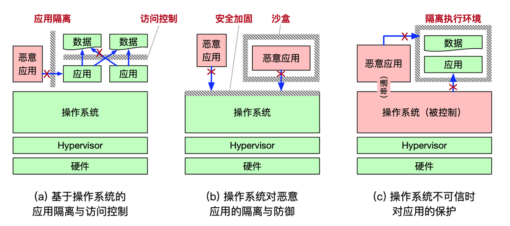
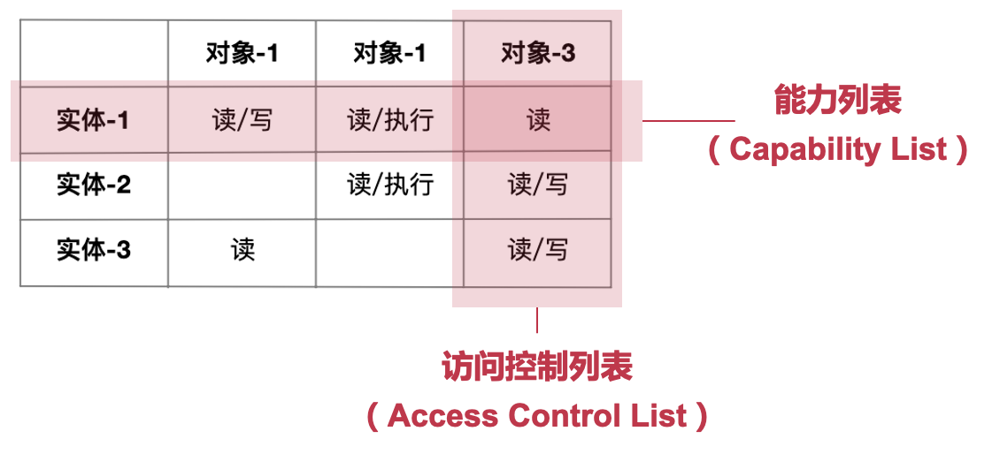

# 27. 操作系统安全机制

## 1. **操作系统的安全服务**

#### background: 安全是操作系统的重要功能和服务

- 系统中有许多需要保护的数据
  - 如账号密码、信用卡号、地理位置、照片视频等
  - 操作系统需要允许这些数据被合法访问，但不允许被非法访问
- 系统中可能存在许多恶意应用
  - 操作系统需要与这些恶意应用作斗争，保护自己，限制对方
- 操作系统不可避免的存在漏洞
  - 操作系统需要考虑自己被完全攻破的情况下依然提供一定的保护

### 操作系统安全的三个层次

b: 防火墙

c: 黑匣子

#### 层次一：基于OS的应用隔离与访问控制

- 威胁模型

  - 操作系统是可信的，能够正常执行且不受攻击
  - 应用程序可能是恶意的，会窃取其他应用数据
  - 应用程序可能存在bug，导致访问其他应用数据

- 应用隔离

  - 内存数据隔离：依赖进程间不同虚拟地址空间的隔离

  - 文件系统隔离：文件系统是全局的，需限制哪些应用不能访问哪些文件

    - 操作系统提供对文件系统的访问控制机制

      （对于简单的场景，访问控制是有效的；对于复杂的场景，访问控制不能完全解决问题）

#### 层次二：OS对恶意应用的隔离与防御

- 威胁模型
  - 操作系统存在bug和安全漏洞
  - 操作系统的运行过程依然可信
  - 恶意应用利用操作系统漏洞攻击，获取更高权限或直接窃取其他应用的数据
- 操作系统防御
  - 防御常见的操作系统bug/漏洞
  - 沙盒机制限制应用的运行

#### 层次三：OS不可信时对应用的保护

- 威胁模型
  - 操作系统不可信，有可能被攻击者完全控制
  - 恶意应用可能与操作系统串通发起攻击
- 基于更底层的应用保护
  - 基于Hypervisor的保护：可信基更小
  - 基于硬件Enclave的保护：硬件通常更可信
    - 可以不信任Hypervisor
  - 一定要有一个信任基

#### 操作系统安全的三个概念

- 可信计算基（Trusted Computing Base）
  - 为实现计算机系统安全保护的所有安全保护机制的集合
  - 包括软件、硬件和固件（硬件上的软件）
- 攻击面（Attacking Surface）
  - 一个组件被其他组件攻击的所有方法的集合
  - 可能来自上层、同层和底层
- 防御纵深（Defense in-depth）
  - 为系统设置多道防线，为防御增加冗余，以进一步提高攻击难度

#### 操作系统安全很难指标化

> 对于负面目标，目前缺乏很好的量化和判断方法, 除了Alice其他人都不能访问某个文件

- 指标-1：千行代码的缺陷密度
  - 常用指标：每 1,000 行代码的平均缺陷数量
    - Linux 的缺陷密度近年来已经小于 0.5
    - GPU 驱动的缺陷密度仅为 0.19， 160个缺陷
    - SMACK（Linux 的一个安全模块）高达 1.11，6个缺陷
  - 在代码长度差不多，重要程度差不多的时候比较合适
- 指标-2：已发现的缺陷数量
  - 缺陷的编号方法
    - CVE（Common Vulnerabilities and Exposures）
      - 一种常见的漏洞编号方式，CVE-2020-10757
    - 国家计算机网络应急处理协调中心的 CNCVE 编号
    - 国家信息安全漏洞共享平台的 CNVD 编号
    - 中国信息安全测评中心的 CNNVD 编号
  - 相对值直接比较也缺乏说服力
    - Linux 内核的 CVE 数量目前排在第 3 位（2,357 个）
    - Windows XP 则排第 28 位（741 个），比Linux更安全？

#### 安全目标（从数据角度）：CIA

- 机密性（Confidentiality）
  - 常又称隐私性（Privacy）
  - 数据不能被未授权的主体窃取（即恶意读操作）
- 完整性（Integrity）
  - 数据不能被未授权的主体篡改（即恶意写操作）
- 可用性（Availability）
  - 数据能够被授权主体正常访问

## 2. 访问控制（Access Control）

#### 访问控制与引用监视器

- 访问控制（Access Control）
  - 按照访问实体的身份来限制其访问对象的一种机制
  - 为了实现对不同应用访问不同数据的权限控制
  - 包含"认证"和"授权"两个重要步骤
- 引用监视器（Reference Monitor）
  - 是实现访问控制的一种方式
  - 主体必须通过引用（reference）的方式间接访问对象
  - Reference monitor 位于主体和对象之间，进行检查

#### 引用监视器（Reference Monitor）机制

Reference Monitor 负责两件事：

- Authentication：确定发起请求实体的身份，即认证
- Authorization：确定实体确实拥有访问资源的权限，包含授权和鉴权

#### 认证：从用户到进程

> 认证机制需要拥有的信息：
>
> 知道什么 （Something you know）：例如密码/口令、手势密码、某个问题的答案等
> 有什么 （Something you have）：例如 USB-key、密码器等实物
> 是什么 （Something you are）：如指纹、虹膜、步态、键盘输入习惯等属于人的一部分

> 进程与用户之间如何绑定？

- 每个进程的PCB中均包含了user字段
- 每个进程都来自于父进程，继承了父进程的user
- 用户在登录后运行的第一个进程（shell），初始化user字段
- 在Windows下，窗口管理器会扮演类似shell的角色

所以，进程必须存在层次结构

#### 访问控制矩阵

- 权限矩阵: 对象与实体的关系

- 不现实：占用的空间太大，并且每当新建一个用户的时候，都必须要更新所有 inode 中的权限 bit

  

#### 授权机制：POSIX的文件权限

- 将用户分为三类
  - 文件拥有者、文件拥有组、其他用户组
  - 每个文件只需要用9个bit即可：3种权限（读-写-执行） x 3 类用户
- 何时检查用户权限？
  - 每次打开文件时，进行鉴权和授权
    - open()包含可读/可写的参数，OS根据用户组进行检查（鉴权）
    - 引入fd，记录本次打开权限（授权），作为后续操作的参数
  - 每次操作文件时，根据fd信息进行检查（鉴权）

#### 例：Windows的ACL

- Windows使用不同于POSIX的ACL机制
  以文件和目录为粒度
  为多个用户和用户组设置不同的权限
- 放在ntsf里面，这本质上是个数据库
- 对比POSIX：只有3类用户/组

#### 基于角色的访问控制（RBAC）

- RBAC：**将用户（人）与角色解耦的访问控制方法**
  - Role-Based Access Control
  - 提出了角色的概念，与权限直接相关
  - 用户通过拥有一个或多个角色，间接地拥有权限
  - "用户-角色"，以及"角色-权限"，一般都是多对多的关系
- RBAC的优势
  - 设定角色与权限之间的关系比设定用户与权限之间的关系更直观
  - 可一次性地更新所有拥有该角色用户的权限，提高了权限更新的效率
  - 角色与权限之间的关系比较稳定，而用户和角色之间的关系变化相对频繁
    - 设计者负责设定权限与角色的关系（机制）
    - 管理者只需要配置用户属于哪些角色（策略）

在linux里面，group有类似的功能

#### 最小特权级原则：setuid 机制

- 问题：passwd 命令如何工作？
  - 用户有权限使用 passwd 命令修改自己的密码
  - 用户的密码保存在 /etc/shadow 中，用户无权访问
  - 本质上是以文件为单位的权限管理粒度过粗——怎么解决？
- 解决方法：运行 passwd 时使用 root 身份（RBAC的思想）
  - 如何保证用户提权为root后只能运行passwd？
    - 在passwd的inode中增加一个SUID位，使得用户仅在执行该程序时才会被提权，执行完后恢复，从而将进程提权的时间降至最小
  - passwd程序本身的逻辑会保证某一个用户只能修改其自身的密码

#### setuid的安全风险

- setuid 不同于RBAC
  - setuid在Linux下通常用于以root身份运行，拥有的权限，远超过必要
  - 必要权限：用户能够读写 /etc/passwd 文件中的某一行
  - 实际权限：
    - 用户能够访问整个 /etc/passwd 文件
    - 用户（短暂地）拥有root用户的权限
- setuid的安全隐患
  - 一旦 passwd 程序存在漏洞，如 buffer-overflow 导致的返回地址修改，则攻击者很容易以root身份通过ROP运行 execv("/bin/sh")

#### 权限控制的另一种思路：Capability

- Capability表示一种能力
  - 例如：读取/foo文件，写入/foo文件，等等
  - 有点像钥匙，能打开某一把锁的话就能进行某个操作
  - 每个进程可以拥有一组能力
- Capability怎么实现？很多种方式
  - 仅仅是一串bit，但必须保存在内核（只有内核能访问的内存）中，否则进程就可以任意伪造
    - 通常保存在进程的PCB中，在进程进行某个操作的时候内核检查
  - 可以把不同Capability的组合对应为ACL中的不同组
  - 因此使用Capability的控制粒度可以很细，而且不需要建立大量的组

#### Capability的典型操作

1. 服务端通过系统调用创建一个 Capability，获得相应的 ID；
2. 服务端通过系统调用，将此 Capability ID 传递给某个客户端；
3. 客户端通过 IPC 调用服务端的某个服务函数，以 Capability ID 作为参数；
4. IPC 调用过程中，操作系统根据该 Capability ID 检查该客户端是否有权限调用服务端函数，检查通过则切换至服务端继续运行；
5. 服务端执行函数，并将结果返回给客户端。

> Capability 有传递性，但是给别人就自己没有了
>
> capability的检查是操作系统完成的，如果检查不通过，不会到第5步

#### fd与Capability的类似之处

- 文件描述符 fd 可以看做是 Capability 的一种实现
  - 用户不能伪造 fd，必须通过内核打开文件（回顾 file_table/fd_table）
  - fd 只是一个指向保存在内核中数据结构的"指针"
  - 拥有 fd 就拥有了访问对应文件的权限
  - 一个文件可以对应不同 fd，相应的权限可以不同
- fd 也可以在不同进程之间传递
  - 父进程可以传递给子进程（回顾pipe）
  - 非父子进程之间可以通过 sendmsg 传递 fd

#### Linux的Capability

- 提供细粒度控制进程的权限
  - 初衷：解决root用户权限过高的问题
- 需要注意，与前面说的Capability的不同
  - 语义都是预先由内核定义，而不允许用户进程自定义
  - 不允许传递，而是在创建进程的时候，与该进程相绑定
  - 没有提供 Capability ID，无法通过 ID 索引内核资源进行操作

> 这个和前面提到的capability不同，这个是Linux为权限控制提供的特殊设计

## DAC与MAC

- 自主访问控制（DAC: Discretionary Access Control）
  - 指一个对象的拥有者有权限决定该对象是否可以被其他人访问
    - 例如，文件系统就是一类典型的 DAC
  - 但是对部分场景（如军队）来说，DAC过于灵活
    - 例如，文件拥有者是否真的有权可随意设置文件权限？
- 强制访问控制（MAC: Mandatory Access Control）
  - 由"系统"增加一些强制的、不可改变的规则
    - 例如，在军队中，如果某个文件设置为机密，那么就算是指挥官也不能把这个文件给没有权限的人看——这个规则是由军法（系统）规定的
  - MAC与DAC可以结合，此时MAC的优先级更高

### Bell-LaPadula 模型

- BLP属于强制访问控制（MAC）模型
  - 一个用于访问控制的状态机模型
  - 目的是为了用于政府、军队等具有严格安全等级的场景

- BLP 规定了两条 MAC 规则和一条 DAC 规则

  - 简单安全属性：某个安全级别的主体无法读取更高安全级别的对象

  * *属性（星属性）:某一安全级别的主体无法写入任何更低安全级别的对象

  * 自主安全属性：使用访问矩阵来规定自主访问控制（DAC）

#### Bell-LaPadula 模型的例子

- 例如，有如下的文件和用户：
  - 文件 A：高机密级别（机密文件），文件 B：低机密级别（普通文件）
  - 进程 X：高机密级别（长官创建），进程 Y：低机密级别（士兵创建）
- 根据上面的两条 MAC 规则，读与写的限制如下：
  - 根据简单安全属性，进程 X 可以读取文件 A，也可以读取文件 B，而进 程 Y 只能读取文件 B
  - 根据星属性，进程 X 只可以写入文件 A，而进程 Y 可以写入文件 A 或文件 B
  - 策略也可以简称“下读，上写”

#### Bell-LaPadula 模型的不足

- 在现实应用中的问题（安全性与可用性的矛盾）
  不允许数据从高机密级别的对象流向低机密级别的对象
  例如，长官无法向士兵传递命令，因为长官不能 “向下写”任何数据
- 引入了“受信任主体”的概念（Trusted Subject） ：
  受信任主体可以不受星属性的限制，但前提是该主体必须遵守相应的“降密策略”（Declassification Policy）
  具体的降密策略因不同场景而不同，需要具体情况具体设置
  然而，并没有一种简单普适的方法来保证数据可靠安全的降密

## 案例：SELinux

- SELinux，由NSA发起，2003年并入Linux
  - 是 Flask 安全架构在 Linux 上的实现
    - Flask 是一个 OS 的安全架构，可灵活提供不同的安全策略
  - 是一个 Linux 内核的安全模块（LSM）
    - 在Linux内核的关键代码区域插入了许多 hook进行安全检查
- SELinux 提供一套访问控制的框架
  - 支持不同的安全策略，包括强制类型访问（MAC）

​	

#### SELinux引入的概念

- 用户（User）：指系统中的用户
  - 与 Linux 系统用户并没有关系
- 策略（Policy）：一组规则（Rule）的集合
  - 默认是"Targeted"策略，主要对服务进程进行访问控制
  - MLS （Multi-Level Security），实现了 Bell-LaPadula 模型
  - Minimum，考虑资源消耗，仅应用了一些基础的策略规则，一般用于手机等平台
- 安全上下文：是主体和对象的标签（Label）
  - 用于访问时的权限检查
  - 可通过"ls -Z"的命令来查看文件对应的安全上下文

#### SELinux的访问向量

- SELinux 将访问控制抽象为一个问题：
  - 一个 < 主体 > 是否可以在一个 < 对象 > 上做一个 < 操作 >
  - 3W: Who, Which (obj), What (operation)
- AVC: Access Vector Cache
  - SELinux 会先查询AVC，若查不到，则再查询安全服务器
  - 安全服务器在策略数据库中查找相应的安全上下文进行判断

#### SELinux的安全上下文

- SELinux本质上是一个标签系统
  - 所有的主体和对象都对应了各自的标签
- 标签的格式 < 用户:角色:类型:MLS层级 >
  - 用户登录后，系统根据角色分配给用户一个安全上下文
  - 类型（Type）用于实现访问控制
    - 每个对象都有一个 type
    - 每个进程的type称为 domain
      - 一个角色对应一个domain
      - 重要的服务进程被标记为特定的domain
      - 例如：/usr/sbin/sshd 的类型为 sshd_exec_t

#### 进程的domain与对象的type

#### SELinux在实际应用中的问题

- 规则的设置过于复杂
  - 不同规则之间可能存在冲突，错误的规则影响可用性
- 日志难以被理解
  - 当发生违反规则的情况，很难解释发生了什么，该如何判定
- 应用程序不支持
  - 部分规则需要应用程序的配合
- 性能影响
  - 权限检查不可避免的带来性能的损失

#### SEAndroid的改进与应用

- 2013年引入Android
  - SEAndroid是Android开源项目（AOSP）的一部分
  - 并默认包含在所有主流Android设备中
- 用于辅助权限检查
  - 有助于在Android设备上强制执行应用程序沙盒边界和其他安全策略

