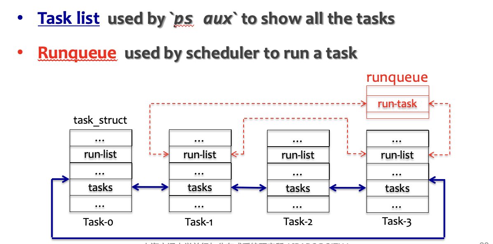
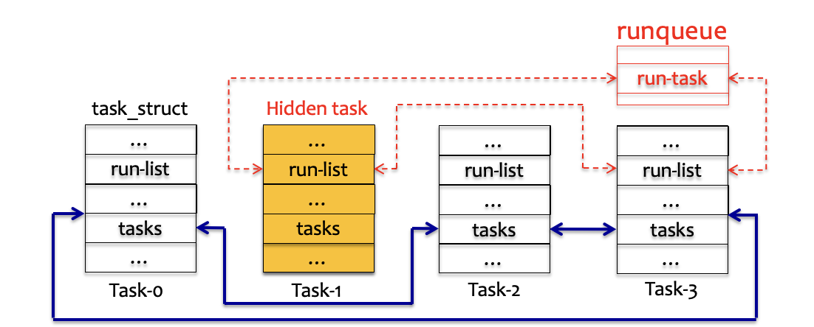
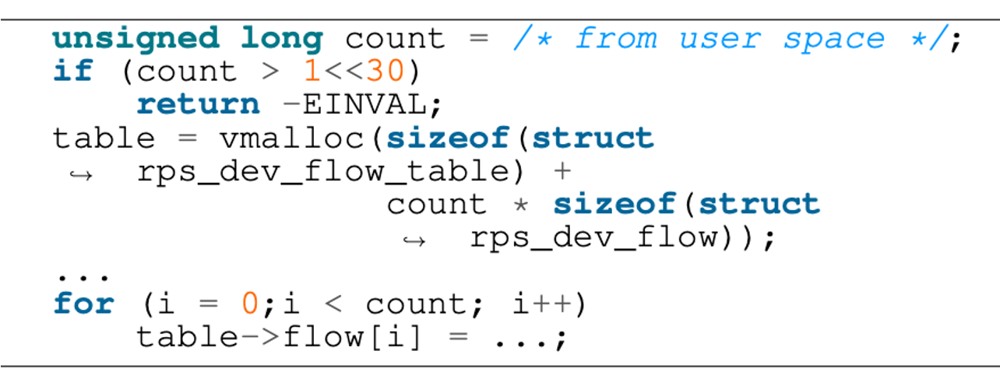

# 28**操作系统攻防**

## 1. **操作系统内核漏洞**

#### 漏洞分类的三个角度

- 漏洞类型（指攻击所利用的漏洞类型）
  - 栈/堆缓冲区溢出、整形溢出、空指针/指针计算错误、内存暴露、use-after-free、double-free、未初始化读取、格式化字符串错误、竞争条件错误、参数检查错误、认证检查错误，等等
- 攻击模块（指攻击所利用漏洞的所在的模块）
  - 调度模块、内存管理模块、通信模块、文件系统、设备驱动等
- 攻击效果（指攻击的目的或攻击导致的结果）
  - 执行任意代码、内存篡改、窃取数据、拒绝服务、破坏硬件等

#### 操作系统的漏洞

- 操作系统本身也是软件
  - 同样存在各种漏洞，如缓冲区溢出、未初始化指针、竞争等
- 操作系统与一般应用软件不同
  - 需要对硬件直接操作，与高级语言的抽象往往不匹配
    - 高级语言的内存安全等特性往往无法使用
  - 硬件语义的加入，为正确性判断带来了更多挑战
    - 例如对栈的操作，会使编译器失去上下文
  - 以数据表示权限等，使数据类攻击具有更强的能力
    - 例如页表的权限位，userid=0

> **思考问题**: **内核中哪些数据结构非常危险？**
>
> 所有记录权限、敏感数据的地方：页表、PCB、uid、gid、系统调用表、VFS函数表、IDT、键盘驱动、skb等等

#### 例：木马如何隐藏自己？

**被恶意软件使用的技术** *adore-ng*:

把自己从run queue中保留，但是从task list中删掉

## 2. **操作系统内核攻防**

#### 操作系统出现性能不升反降的趋势

- "安全税"导致的性能开销

  - 内核页表隔离（KPTI）

    1.为防御2018年的熔断漏洞

    2.隔离导致性能下降达30%

  - 避免间接跳转预测执行

  - SLAB空闲列表随机化

  - 用户态内存复制安全强化

- 两年内 poll() 时延上升至146%

#### 整形溢出漏洞

防御方法：增加对溢出的检查代码；利用自动化工具查找并修复

count变量来自用户空间，尽管对其长度进行了检查， 但这个检查是不够的:因为sizeof（struct rps\_dev\_flow）的长度是 8，因此如果count的长度正好是 2^30，那么vmalloc的参数依然会造成溢出。 由于count远远大于 vmalloc 得到的内存大小，因此在后续for循环中便会写入超出table边界的内存区域。

> Vmalloc: 类似用户态malloc，不一定真的malloc
>
> kmalloc：一定会真正分配空间

#### Return-to-user攻击（ret2usr）

- 内核错误地运行了用户态的代码
  - 由于内核与应用程序共享同一个页表，内核运行时可以任意访问用户态的虚拟地址空间，内核可能执行位于用户态的代码
- 攻击者的常用方法
  - 先在用户态中初始加载一段恶意代码，然后利用内核的某个漏洞，修改内核中的某个函数指针指向这段恶意代码的地址
  - 也可以利用内核的栈溢出漏洞，覆盖栈上的返回地址为恶意代码的地址，使内核在执行 ret 指令时跳转到位于用户态的代码

#### ret2usr攻击的防御方法

- 方法一：仔细检查内核中的每个函数指针
  - 需对内核所有模块进行检查，很难做到 100% 的覆盖率
- 方法二：在陷入内核时修改页表，将用户态所有的内存都标记为不可执行
  - 由于修改页表后必须要刷新 TLB 才能生效，因 此修改页表、刷新 TLB，以及后续运行触发 TLB miss 都会导致性能下降
  - 在返回用户态之前必须将页表恢复，并再次刷掉 TLB，这样又会导致用户态执行时出现 TLB miss，因此对性能的影响非常大
- 方法三：硬件保证CPU处于内核态时不得运行任何用户态的代码
  - 如 Intel 的 SMEP（Supervisor Mode Execution Prevention）技术
    - 在Supervisor的时候禁止执行用户态代码
  - ARM 同样有类似 SMEP 的技术，称为 PXN（Privileged eXecute-Never）

#### SMEP 不能完全解决 ret2usr：ret2dir

- 操作系统管理内存的方法"直接映射" （kmalloc，通过buddy system分配）
  - 将一部分或所有的物理内存映射到一段连续的内核态虚拟地址空间
  - 分配给应用程序后，直接映射依然存在
  - 因此，同一块物理内存在系统中有多个虚拟地址
    - 例如，某个内存页分配给了应用程序，那么内核既可以通过应用程序的虚拟地址访问（前提是内核与应用在一个地址空间），也可以通过直接映射的虚拟地址访问
- 基于直接映射的攻击，可绕过SMEP
  - 攻击者首先推算出位于用户态的恶意代码在内核直接映射区域的虚拟地址，然后在 ret2usr 攻击中让内核跳转到该地址执行（内容依然为攻击者控制）
  - 攻击成功还有一个前提：直接映射区域必须是可执行的
    - 在 3.8.13 以及 之前的 Linux 版本，将直接映射区域的权限设置为了"可读-可写-可执行"
  - 这种利用直接映射区域的 ret2usr 攻击被称为"ret2dir"攻击

#### Rootkit：获取内核权限的恶意代码

- Rootkit 是指以得到 root 权限为目的的恶意软件
  - Rootkit 可以运行在用户态，也可以运行在内核态
  - 通过ROP的形式攻击
- 用户态的Rootkit
  - 可以将自己注入到某个具有 root 权限的进程中，并接收攻击者的命令
- 内核态的Rootkit
  - 可以 hook 某个内核中的关键函数，从而在该函数被调用时触发运行
  - 可以是以内核线程的方式运行
  - 可以是修改内核中的系统调用表，用恶意代码来替换掉正常的系统调用

#### KASLR：内核地址布局随机化

- ASLR 与 KASLR
  - ASLR 通过随机化地址空间布局来提高系统攻击难度
  - KASLR是对内核启用地址随机化
- KASLR 可缓解 ret2dir 攻击
  - 攻击者需要知道用户态恶意代码在内核中直接映射区域的地址
  - KASLR 通过将内核的虚拟地址布局进行随机化，使攻击者准确定位内核地址的难度大大提升

#### 内核漏洞防御机制（一部分）

- 运行时工具
  - SFI（Software Fault Isolation）：对内存做访问控制（预先判断是否是在合法的访问区间）
  - 代码完整性保护：阻止非法代码运行（算哈希，判断代码是否被修改）
  - 用户态驱动：降低内核攻击面
  - 未初始化内存跟踪：防止未初始化内存被使用或复制到用户态（跟踪粒度要细一些，但是不能太细，因为会增加开销）
- 编译时工具
  - 代码静态分析工具，通常需要开发者添加annotation

## 3. 案例：IOS的系统安全（这个貌似没讲）

#### 文件加密保护机制

**每个文件都加密，且秘钥均不相同**：

- 创建文件时，系统会新建一个 256-bit 的秘钥用于该文件的加密
- 硬件的 AES 引擎会在写 入文件时，使用该秘钥对文件进行 AES CBC 模式加密，再写入到闪存中
- 加密过程中的初始化向量（IV，Initialization Vector）使用了当前块在文件中的偏移，然后用文件秘钥的 SHA-1 值进行加密得到

#### 进程沙盒机制

- 所有第三方 App 都运行在一个沙盒中
  - 被限制访问其他应用程序存储的文件或对设备进行修改
  - 若第三方 App 需要访问其任何沙盒外部的数据， 只能显式地通过 iOS 提供的 API 来访问
  - 因此 iOS 可以在 API设置各种检查来进一步增强安全性
- 第三方 App 都以mobile的非特权用户身份运行
  - 整个 OS 的分区以只读方式加载，所有的数据内存区域均使用 ARM 的 XN 机制（Execute Never）标记为不可执行
  - 只有很少部分的内存页被标记为可写可执行（例如 Safari，用于 JavaScript 的 JIT），内核会仔细检查 App 是否有权限做这样的映射
