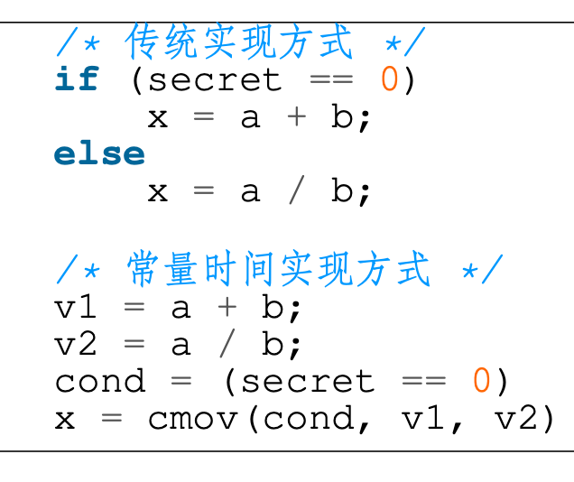

# 29. 硬件辅助系统安全

## 1. bg: 操作系统不可信

> **除了应用，别的都不可信**

#### 恶意操作系统如何攻击应用？

- 应用的攻击面
  - 同层：其他应用程序
  - 底层：操作系统、Hypervisor、硬件
- 操作系统窃取应用的数据
  - 操作系统控制着页表，可直接映射应用的内存并读取数据
- 操作系统改变应用的执行
  - 操作系统控制着页表，可直接在应用内部新映射一段恶意代码
  - 操作系统可任意改变程序的RIP，劫持其执行流

#### 一种新的威胁模型：安全处理器

- 不信任CPU外的硬件：包括内存（DRAM）、设备、网络
- 仅信任CPU：包括cache、所有计算逻辑（Anyway，总得信任CPU吧...）
- Enclave（飞地）：又称为可信执行环境，TEE（Trusted Execution Environment）

## 2. 可信执行环境

#### Enclave/TEE：可信执行环境

- Enclave/TEE的定义: Enclave，又称“可信执行环境” （TEE，Trusted Execution Environment），是计算机系统中一块通过底层软硬件构造的安全区域，通过保证加载到该区域的代码和数据的完整性和隐私性（不保证可用性），实现对代码执行与数据资产的保护 —— Wikipedia
- Enclave的两个主要功能
  - 远程证明：验证远程节点是否为加载了合法代码的Enclave
  - 隔离执行：Enclave外无法访问Enclave内部的数据
- Enclave带来的能力：限制访问数据的软件
  - 可保证数据只在提前被认证的合法节点间流动
    - 合法节点：部署了合法软件的节点

#### 安全屋：一种“简单”的机密计算抽象

> 一个例子：多方数据训练
>
> 数据：来自多方的隐私数据，例如：14亿人的人脸数据
> 目标：基于多方数据训练出一个模型，例如：得到一个人脸识别模型
> 要求：隐私不能泄露，例如：训练完后立刻销毁原始的人脸数据
>
> **找一间只有一个入口和一个出口的屋子——安全屋**：确保没有窗、没有通风口，没有任何可以离开的通道，屋子里只有一台仅安装了训练算法的电脑
> 在出入口的地方各安装一个机械臂，十四亿人排队将照片通过U盘交给输入机械臂，输入后U盘留在房间
> 训练完成后，得到的模型存入U盘，并通过输出机械臂送到出口处，输出U盘被取走后触发清理流程，屋子里的所有电子设备全部销毁

**实现与流程**：

- 输入
  - U盘从仅有的入口输入
- 运算
  - 训练输入数据生成模型
- 输出
  - 模型通过仅有的出口输出
- 清理
  - 一旦输出完成立即清理
  - 没有任何数据沉淀

安全屋只对于硬件部分做出保证，（**系统层面：机密计算**），**算法** **层面**和数据层面不是TEE保证的内容

#### 可信执行环境（TEE）的组成

#### 四个问题对应的两个技术点

### TEE技术点一：远程证明

#### 如何向用户证明TEE是真的？

- 认证：TEE的硬件是真的
  - TEE来自某个芯片制造商（如Intel）
  - 方法：通过硬件中内置的私钥来判断（对应公钥由认证服务器维护）
  - 前提：该私钥不出硬件，且对应的公钥不可伪造
- 认证： TEE的软件是真的
  - TEE中加载的软件：包含系统软件和用户的软件
  - 方法：通过对TEE内存计算hash来判断（使用TEE内嵌私钥签名）
  - 时间节点：在所有代码加载入TEE的内存后，在执行第一行代码前（一旦开始执行第一行代码，自己的代码本身可能有漏洞）

#### 静态度量与动态度量

- 启动时的度量（静态度量）
  - 如专用的TPM芯片（Trusted Platform Module）
  - TPM验证最早启动的软件组件（如加载器bootloader）
  - 下层软件加载验证上层软件，形成信任链，TPM是信任根
  - 缺点：只能启动时度量
- 启动后的度量（动态度量）
  - 如Intel TXT（Trusted eXecution Technology）
  - 支持启动后对区域内存进行认证，如认证Hypervisor

#### **TEE** **的初始化与远程证明**

- TEE初始化（TEE服务商）
  - 初始化硬件环境，并加载软件进入TEE
- 远程证明（三方交互）
  - 用户向TEE发起一个认证请求
  - TEE生成认证，签名后返回给用户
  - 用户向验证服务器确认认证有效性
- 建立安全信道（用户与TEE）
  - 用户与TEE交换密钥后建立加密通道
- 通过信道输入数据，并调用算法执行（用户与算法）

#### 远程验证（Remote Attestation）

#### 远程证明的安全边界：何时无效？

- 远程证明可能被攻击成功的场景
  - TEE内部的私钥被泄露或被伪造
  - 认证服务器签名私钥被泄露或被伪造
  - 加密算法被攻破（如量子计算等）
  - 依然基于传统的PKI体系（如CA等）
- 信任方
  - TEE硬件制造商、远程证明服务提供方

### TEE技术点二：隔离执行

#### 云计算的安全等级

篡改内容：管理员可修改算法或数据使计算得出不正确的结果
窃取数据：管理员可窃取算法执行过程中在内存或存储中的机密数据
观察活动：管理员可观察到算法具体执行过程中与内存或存储的交互活动
如：访存行为、磁盘I/O行为、网络I/O行为，等等

| **安全等级**   | **篡改内容** | **窃取数据** | **观察活动** |
| -------------- | ------------ | ------------ | ------------ |
| **最高**       | 不允许       | 不允许       | 不允许       |
| **高**         | 不允许       | 不允许       | 允许         |
| **中**         | 不允许       | 允许         | 允许         |
| **低（现状）** | 允许         | 允许         | 允许         |

#### TEE的攻击面

#### 攻击-1：恶意特权软件的攻击

- 特权软件：如操作系统、Hypervisor
  - 通常直接控制所有硬件资源
  - 为应用程序提供抽象，如系统调用
- 来自恶意特权软件的攻击 —— 降维打击
  - 可直接窃取或篡改用户数据和代码（隐私性与完整性攻击）
    - 包括CPU状态、内存、存储、网络等
  - 可拒绝为应用提供服务（可用性攻击）

#### 防御-1：基于访问控制隔离特权软件

- 利用硬件隔离机制限制特权软件的权限
  - 方法-1：直接新增硬件隔离能力保护TEE范围的硬件
  - 方法-2：引入更底层的特权软件（属于可信计算基）
- 典型实现
  - 页表机制，主流CPU均支持
  - PMP（Physical Memory Protection），如：RISC-V
  - PRM（Processor Reserved Memory），如：Intel SGX
  - 嵌套虚拟化，如：CloudVisor

#### 攻击-2：恶意硬件的攻击

- 硬件攻击的特点
  - 攻击难度更高：通常需要直接接触硬件（如伪装成维修人员）
  - 防御难度更高：直接绕过软件的防御（如访问权限）
- 典型的硬件攻击
  - 内存中间人攻击（威胁机密性、完整性与可用性）
  - 系统总线嗅探攻击（威胁机密性）
  - 非易失性内存窃取（威胁机密性、完整性）
  - 恶意DMA攻击（威胁机密性、完整性）
  - 内存冷冻启动攻击（威胁机密性）

#### 防御-2：基于内存加密防御物理攻击

- 隐私性保护：内存加密
  - CPU外皆为密文，包括内存、存储、网络等
  - CPU内部为明文，包括各级Cache与寄存器
  - 数据进出CPU时，进行加密和解密操作
- 完整性保护：Hash Tree
  - 对内存数据计算一级hash，对一级hash计算二级hash，形成树
  - CPU内部仅保存root hash
  - 当内存中的数据被修改时，更新Merkle Tree

#### 攻击-3：基于访问模式的侧信道攻击

- 侧信道（隐秘信道）
  - 原本无法直接通信的两方，通过原本不被用于通信的机制进行数据传输
  - 常见的隐秘信道：时间、功耗、电磁泄露、声音等
- TEE内代码执行过程会暴露访问模式
  - 磁盘和网络访问模式对特权软件可见
  - 内存访问模式可通过缓存和页表泄露
  - 例-1，利用页表攻击Intel SGX窃取TEE内数据
  - 例-2，利用缓存攻击TrustZone窃取TEE数据

#### 防御-3：混淆访问模式+减少资源共享

- 混淆访问模式（通常在应用层）
  - 使用常量时间算法以消除时间侧信道
  - 使用ORAM（Oblivious RAM）以混淆访存模式
    - 使用固定模式访问资源以消除信息泄露
- 减少资源共享（通常在系统层）
  - 空间隔离：为TEE使用单独的CPU核、内存和外设
  - 时间隔离：在切换时刷掉所有共享状态
    - 如缓存、TLB等可被观测到的状态

## 3. 可信执行环境的三种形态

#### TEE技术发展的三个阶段和三种形态

#### 三种形态的技术特点

### 形态-1：Enclave -- Intel SGX

- SGX: Software Guard eXtension
  - 2015年首次引入Intel Skylake架构
  - 保护程序和代码在运行时的安全（data in-run）
    - 其他安全包括：存储时安全和传输时安全
- 关键技术
  - Enclave内部与外部的隔离
  - 内存加密与完整性保护
  - 远程验证

#### 硬件内存加密与保护机制

- 硬件加密保护隐私性
  - CPU外皆为密文，包括内存、存储、网络等
  - CPU内部为明文，包括各级Cache与寄存器
  - 数据进出CPU时，由进行加密和解密操作
- 硬件Merkle Tree保护完整性
  - 对内存中数据计算一级hash，对一级hash计算二级hash，形成树
  - CPU内部仅保存root hash，其它hash保存在不可信的内存中
  - 当内存中的数据被修改时，更新Merkle Tree

#### EPC（Enclave Page Cache）

- CPU预留一部分内存作为安全内存，仅允许Enclave访问
  - 连续的128MB/256MB，这部分不会暴露给软件操作
    - SGXv2增加到256GB，但去除了完整性保护
  - 全部加密，并保证数据的完整性（即无法篡改）
    - 可能的篡改方法：通过总线直接修改
- 操作系统负责将EPC映射至Enclave中
  - 操作系统也可以触发swap，将数据从EPC交换到DRAM中(换入换出的时候会算哈希，保证内容不被篡改)
    - 由专门的硬件指令来进行swap，粒度为一个内存页（4K）
  - 注意：页表依然由不可信的操作系统控制

#### Enclave与进程的关系

- Enclave是进程的一部分
  - Enclave内外共享一个虚拟地址空间
  - Enclave内部可以访问外部的内存，反之则不行
- 创建Enclave的过程
  1. OS创建进程
  2. OS分配虚拟地址空间
  3. OS将Enclave的code加载到EPC中
     1. 并将EPC映射到Enclave的虚拟地址
     2. 循环3，完成所有code加载和映射
  4. 完成进程创建

> ##### 远程验证（Remote Attestation）要解决的问题：如何远程判断某个主体是Enclave？例如，如何判断某个在云端的服务运行环境是安全的
>
> **必须在认证之后，再进行下一步的操作，例如发送数据**

#### 硬件内存加密

- 加密的最小单位
  - Cache line：64Byte（512bit）
- 方法一：单密钥加密
  - 缺点：同样的明文会产生同样的密文
- 方法二：多密钥加密
  - 缺点：如何保存这些密钥？CPU内部放不下
- 方法三：单密钥 + 多 seed
  - 为每个cache line单独生成一个seed，用密钥加密后，对数据进行异或
- 采用加密pad的方式而不是直接加密数据
  - 每个内存区域对应一个pad
  - 对pad进行加密，然后数据与pad进行异或以实现加解密
- 加密pad由key和seed共同组成
  - Seed可以由时空因子组成
  - 明文只需一次异或运算得到密文
- 任意两次加密的pad必须不同
  - 如果两次加密的pad相同，可以轻松的反推明文

#### 生成seed用于加密

counter：避免向同一个地址写两次同样的数据seed相同

任意两次加密的pad必须不一样

#### **内存完整性保护**

- Merkle hash Tree
  - 可以保证内存不会受到拼接和欺骗攻击
    - 不知道hash key无法计算对应的mac
  - 无法防御回放攻击
    - 攻击者可以将mac和data同时替换成老版本
- 将root hash (mac) 存储在CPU中
  - 防御回放攻击
    - 攻击者无法修改root mac的值

#### 形态-2：ARM TrustZone 技术

- ARMv6版本开始的安全硬件特性
  - 包括ARM11及Cortex A系列
  - 目前大部分手机芯片均有该硬件特性
- 同时运行一个安全的OS和一个普通的OS
  - 两个系统之间互相隔离运行
  - 安全的OS具有更多的权限
- TrustZone是一个全系统级别的安全架构
  - 处理器、内存和外设的安全隔离

#### TEE硬件状态与软件架构

- TEE内部运行一个完整的操作系统
  - 与Android版本无关，也无需适配
  - TEE与Android通过共享内存进行交互
- TEE内部也分内核态与用户态
  - TEE用户态可运行多个安全应用（TA）
  - 安全应用可支持动态下载和动态更新
- TEE内部结构
  - Secure OS + 中间件 + 安全应用 + 外部交互

#### 例：用TrustZone保护指纹的录入和识别

#### 形态-3：机密虚拟机 -- AMD SEV

- 以虚拟机为粒度的Enclave
  - 对不同的虚拟机进行加密
  - 每个虚拟机的密钥均不相同
  - Hypervisor有自己的密钥
- 安全模型的缺陷
  - 依然部分依赖Hypervisor
    - 如：为VM设置正确的密钥

#### RISC-V平台的可信执行环境

- RISC-V具有一个新的模式：Machine-Mode
  - 位于操作系统和Hypervisor之下，直接访问物理地址
  - 具有最高权限，可访问所有的计算资源，并提供新的功能
  - 在M-Mode下实现的软件monitor，可实现Enclave的接口
  - 这个任何人都可以改

#### 蓬莱TEE

#### 蓬莱平台目前三种架构都支持

## 小结：**控制系统复杂性**

- TEE/Enclave的抽象是一种简化
  - 对威胁模型和信任关系的简化
    - 例如：Intel SGX将对软硬件环境的信任规约到对Intel的信任
    
  - 这种简化有可能带来新的问题：Single-point of Failure
  
    > 这意味着Intel SGX依赖于Intel提供的硬件和软件来实现其安全性和可信性。如果Intel本身存在漏洞、后门或其他安全问题，那么整个SGX系统就会受到威胁，因为它依赖于Intel的可信性。
    >
    > 这种依赖性给了Intel作为一个实体过大的权力和责任。一旦Intel发生安全漏洞、被黑客攻击或存在其他问题，所有使用SGX技术的系统和应用程序都可能受到影响。这种情况下，整个系统将成为单一的故障点，可能导致数据泄露、代码执行问题或其他安全威胁。
  
- TEE/Enclave的主要技术
  - 远程证明：对密钥的管理
  - 隔离执行：基于权限的隔离与基于加密的控制

#### TEE/Enclave的不足

- 仅靠隔离是不够的，还需要考虑交互安全
  - Enclave依然需要OS提供服务：调度、系统调用、资源分配...
  - 即使隔离，OS依然可能发起的攻击包括
    - 接口攻击：合法的系统调用返回错误的值
      - 例：malloc返回指向栈的地址，导致内部自己破坏掉栈
    - DoS攻击：拒绝分配计算资源（恶意调度）
- 依然受到侧信道等攻击的威胁
  - Spectre、L1TF

## 侧信道与隐秘信道

> 隐秘信道（Covert Channel）
>
> - 原本无法直接通信的两方，通过原本不被用于通信的机制进行数据传输
> - 常见的隐秘信道：时间、功耗、电磁泄露、声音等
>
> 例：消费记录的应用 A，在没有网络的情况下如何把数据发出去？
>
> - 假设有一个应用B运行在同一个手机
> - 若A可播放声音，B可录音，则A把数据编码为声音发送给B
> - 若A可打开闪光灯，B可摄像，则A把数据编码为光的闪烁长短与频率发送给B
> - 若A可震动，B可访问运动传感器，则A把数据编码为震动频率发送给B
> - 若B可访问CPU温度，则A可长时间运行计算密集代码，CPU升温表示1，反之为0
> - ...

#### 侧信道与隐秘信道的关系

- 侧信道与隐秘信道很类似
  - 两者都使用类似的方式（信道）进行数据的传递
- 侧信道攻击和隐秘信道攻击的不同
  - 隐秘信道攻击：两方是互相串通的，其目的就是为了将信息从一方传给另一方
  - 侧信道攻击：一方是攻击者，另一方是被攻击者，攻击者窃取被攻击者的数据, 即被攻击者无意间通过侧信道泄露了自己的数据

#### 缓存信道（Cache Channel）

- 利用缓存的状态推测执行的信息
  - 例如：可根据 func_a 还是 func_b 的代码在缓存中，来判断 i 的值(在测试进行前，首先要让cache中的func_a和func_b都miss（flush))
  - 判断方法：func_a 和 func_b 的时延
- 常见的四种攻击方式
  - Flush+reload
  - Flush+flush
  - Prime+probe
  - Evict+time

#### 1. Flush+Reload

- **假设：**攻击进程和目标进程共享一块内存

- **攻击步骤**

  - 1. 攻击进程首先将 cache 清空（如：不断访问其他内存占满cache或直接flush）

  - 2. 等待目标进程执行

  - 3. 攻击进程访问共享内存中的某个变量，并记录访问的时间

    - 若时间长，则表示 cache miss，意味着目标进程没有访问过该变量

    - 若时间短，则表示 cache hit，意味着目标进程访问过该变量

- **特点分析**

–优点：可以跨CPU核，甚至跨多个CPU；噪音低

–缺点：攻击准备难度高，需构造与目标进程完全相同的内存页

#### 2. Flush+Flush

- 基于缓存刷新时间（如clflush）来推测数据在缓存中的状态

  - 攻击进程首先将 cache 清空（Flush）

  - 等待目标进程执行

  - 运行clflush再次清空不同的缓存区域
    - 若时间较短说明缓存中无数据
    - 时间较长则说明缓存中有数据，目标进程曾访问对应的内存

- 特点分析
  优点：只需清空缓存而不需实际访存，因此具有一定的隐蔽性
  缺点：clflush对于有数据和无数据的时间差异不明显，攻击精度不高

#### 3. Evict+Reload

场景：CPU没有 clflush 指令
1. 将关键数据所在的 cache set 都替换成攻击进程的数据
    前提：攻击者知道关键数据的内存地址，以及CPU上内存-cache的映射机制
2. 等待目标进程执行
3. 访问 cache set 中的某个数据
     1. 若时间很短，说明目标进程没有将该数据 evict，即没有访问过某个关键数据
     2. 反之，则说明目标进程访问了某个关键数据

特点分析

- 优点：无需依赖 flush 指令
- 缺点：无法支持动态分配的内存；需要了解 LLC 的 eviction 策略；Cache 必须是 inclusive；无法很好地支持多 CPU

#### 4. Prime+Probe

攻击的具体步骤如下:
1. 攻击进程用自己的数据将 cache set 填满（Prime）
2. 等待目标进程执行
3. 再次访问自己的数据
    若时间很短，说明目标进程没有将该数据 evict，即没有访问过某个关键数据
    反之，则说明目标进程访问了某个关键数据

特点分析：

- 优点：不需要共享内存;支持动态和静态分配的内存
- 缺点：噪音更多；需要考虑 LLC 的实现细节，如组相连等；Cache 必须是 inclusive;无法很好地支持多CPU；需要首先定位目标进程使用的cache set

> 需要物理接触或共享内存：Prime+Probe攻击需要攻击者与目标系统物理接触或共享一部分内存。这意味着攻击者需要在目标系统上安装恶意软件或者拥有物理访问权限，这在许多情况下是不可行的。因此，该攻击对于远程攻击来说并不适用。
>
> 需要预先对目标系统进行Prime阶段：Prime+Probe攻击需要在目标系统上执行"Prime"阶段，以在缓存中加载特定的数据或设置特定的状态。这个Prime阶段的执行可能需要一定的时间，并且在一些情况下，攻击者可能无法准确地预测或控制目标系统上的Prime阶段。这可能导致攻击的成功率下降。
>
> 受到干扰和噪声的影响：Prime+Probe攻击在获取敏感信息时受到干扰和噪声的影响。例如，其他进程的活动、系统负载变化或硬件故障等因素可能影响到攻击的准确性和可靠性。这些干扰因素使得攻击的成功率降低，并且可能需要进行多次尝试才能成功地提取出目标信息。
>
> 依赖于特定的硬件和架构：Prime+Probe攻击的成功性也受限于目标系统所使用的硬件和架构。攻击者需要根据目标系统的具体情况进行定制化的攻击技术和代码，这可能需要对多个硬件和架构进行适配和优化。因此，攻击者可能需要针对不同的系统进行研究和开发，增加了攻击的复杂性和成本。
>
> ##### 为什么这种攻击方式在多CPU上不可行？
>
> 1. 缓存一致性：在多CPU系统中，每个CPU都有自己的缓存，用于存储最近使用的数据。然而，这些缓存之间需要保持一致性，以确保数据的一致性和正确性。当一个CPU修改了共享数据时，它必须通知其他CPU刷新其缓存中的副本。这种缓存一致性协议（如MESI或MOESI）会导致在不同的CPU之间共享数据时的延迟和开销，从而干扰Prime+Probe攻击所依赖的时间测量和干扰效应。
> 2. 干扰效应：Prime+Probe攻击通过在Prime阶段将特定数据加载到缓存中，然后在Probe阶段通过测量访问该数据的时间来推断缓存中的信息。在多CPU系统中，其他CPU的活动和访问模式可能会导致缓存中的数据发生变化，从而干扰攻击的准确性。由于多个CPU同时访问共享数据，缓存状态的变化更加频繁和复杂，使得攻击者很难精确地进行时间测量和数据推断。
> 3. 时间测量的不确定性：在多CPU系统中，由于每个CPU可能有不同的时钟频率和延迟，攻击者在不同CPU上进行时间测量时可能会遇到不确定性。这意味着相同的访问可能在不同的CPU上产生不同的测量结果，导致攻击的准确性下降。

### 侧信道攻击的防御

- **侧信道攻击很难被完全防御住，根本原因在于共享**
  - 当被攻击者在做了某个操作后，对系统整体产生了影响
  - 这个影响能够被使用同样系统的攻击者发现，那么就构成了一个最简单的侧信道：发现影响和没发现影响（即做了操作和没做操作）可以被编码为 0 和 1
- **防御侧信道的根本方法：不共享**
  - 将攻击者和被攻击者运行在完全隔离的物理主机，使其没有任何共享，包括计算硬件、网络，甚至空间（光、温度、声音）
  - 更实际的方法是针对常见攻击进行防御

#### 常量时间（Constant Time）算法

- 算法的运行时间与输入无关
  - 无法通过运行时间得到与输入相关的任何信息
  - 代码执行没有分支跳转
- 常见的实现方法：cmov
  - Conditional MOV
- 缺点：计算变得更慢
  - 需要做两份运算

#### 不经意随机访问内存（ORAM）

- ORAM 将访存行为与程序执行过程解耦：攻击者即使能够观察到所有的访存请求，也无法反推出与程序执行相关的信息
- **最简单的实现：定时、定量、定位的访问方式**
  - 无论实际是否有访存需求，均以固定周期，访问固定位置，每次访问固定的大小
  - 例如， CPU 顺序循环访问所有的有效内存区域，程序按需获得真正想要访问的数据，若还没访问到则等待，若已经访问过了则等待下次循环
  - 类似上海和北京之间的高铁，无论乘客是谁，都按照时刻表运行，哪怕有时候位子没坐满也发车，因此根据高铁的班次并不能反推出谁坐了高铁
- ORAM 会引入很大的额外负载
  - 产生大量的无效内存访 问，导致有效访存的吞吐率下降
  - 访存需要等待一定的时刻，导致时延大幅度增加

## 5. 案例分析：Meltdown

#### 背景-1：基于页表权限的内核数据保护

操作系统对内核数据的保护方法：操作系统使用硬件提供的**页表**机制实现对内核内存的访问控制。所有程序均使用虚拟地址进行对内存数据的访问操作，而页表控制了虚拟地址与实际物理地址的转换，并且在转换过程中进行访问权限的检查。

对于内核内存，其会在页表中进行特殊标注，只有运行在内核态的程序才能够访问该内存数据。

当操作系统正常访问内核数据时，在地址翻译的过程中，页表会发现当前CPU特权级满足内存的权限管控要求，应许访问；

而当一个恶意应用企图访问内核内存时，页表会发现当前CPU处于用户态，与内核内存所要求的的内核态权限不符，从而拒绝本次访问.此时，CPU会触发一个硬件异常，而应用就会看到我们常见的段错误！

**页表所提供的用户/内核内存权限检查机制，是现在操作系统对内存保护的最核心技术之一。**而Meltdown漏洞则能够绕开这一最为核心的内存保护机制，让其形同虚设

#### 背景-2：CPU投机执行（预测执行）

> Meltdown漏洞绕开页表隔离机制的主要手段是利用CPU的投机执行技术，我们对其简单回顾一下。
>
> 现代CPU为了执行效率的提升，其内部会有多个执行单元，能够并发执行多条指令。
> 因此，CPU会投机发射临近的指令进行并发执行，虽然最后所有的指令会被顺序提交，但是指令在执行过程中仍然是并发投机的。
>
> 那么由此而来的一个问题是：如果投机执行了错误的指令怎么办？
> 例如。。。
>
> CPU的设计人员考虑到了该问题，对于不该被执行到的指令，处理器会丢弃或者回滚掉漆对所寄存器、内存等执行状态的所有修改。
>
> 面对机器复杂的CPU结构，设计师不能够确保对所有状态的正确回滚

- CPU为了性能会进行投机执行
  - 处理器内部会并发执行多条指令，无依赖关系的邻近指令在处理器内部的执行顺序会被打乱，部分指令会被提前
- 问：若提前执行了错误指令怎么办？如前一条指令异常，处理器投机执行了后续本不应被执行的指令
- 答：执行结果丢弃/回滚：对于不应被执行的指令，处理器会丢弃/回滚其对寄存器、内存等执行状态的修改
- 复杂的CPU能确保所有状态均正确丢弃/回滚吗？不能

#### Meltdown漏洞原理

- 起因：迟到的内存访问异常
  - 在投机执行期间，跨权限的内存访问不会立刻触发异常，而是仍会继续执行后续指令
- 故障：遗漏的缓存状态回滚
  - 当硬件抛出内存访问异常时，CPU理应回滚被错误执行指令对所有状态的修改
  - 但是，**实际上CPU未回滚被错误执行指令对CPU缓存的状态修改**
- 结果：应用可任意读取操作系统内存
  - **利用缓存隐秘信道，窃取非法访问到的内核数据**

> 漏洞的起因是CPU的投机执行，正常情况下，当用户发起对内核内存的访问请求，会触发一个内存访问异常。但是由于投机执行机制，该异常不会立刻发生，CPU仍然会乱序的执行到非法访问的后续执行令；
>
> 而在这个投机执行的小窗口内，应用就能够对内核内存进行非法的访问。
>
> 这是**隐秘信道**
>
> 到此其实还没有漏洞，因为正常情况CPU会回滚这个小窗口中的所有操作，所以即使临时拿到了内核数据，也无法完成攻击。
>
> 但是故障就发生在对于这些状态的丢弃、回滚上。
>
> 而造成的结果是，攻击者能够通过观察缓存状态的变化，从而窃取到内核数据。

#### example

最终，CPU并没有对缓存状态进行回滚，也就意味着指令2访问的buf1的数据会被加载到缓存中

- 通过未回滚缓存状态窃取目标数据
  - 使用目标数据作为索引访问攻击数组 buf （指令2）
    - 被访问元素会被加载到缓存中
  - 异常发生后，根据数组元素是否被缓存，窃取目标数据
    - 若buf中第 i 个元素在缓存中，则目标数据 key = i

> 利用遗留在缓存中的数据，攻击者就能够间接获得目标的内核数据key
>
> 攻击者只需要将目标数据作为索引发起对一个bug数组的访问，之后目标元素就会被加载到缓存中。
>
> 之后，攻击者仅需逐一查看bug数组中拿一个元素在缓存中，就能够窃取到目标数据

#### Meltdown漏洞危害

- 允许对内核内存的随意访问
  - 用户态与内核态共享同一虚拟地址空间，仅通过页表中的权限位进行内核内存的隔离保护
  - 利用Meltdown可随意读取任意内核内存
- 允许对所有内存资源的随意访问
  - 内核地址空间大多映射了所有物理内存
    - 如Linux中的direct map区域直接映射了整个物理内存区域
  - 利用Meltdown可对direct map区域进行读取，从而访问所有内存数据

> 目前操作系统主要依赖页表的用户;内核权限检查，进行用户内存与内核内存的隔离。而Meltdown漏洞能够直接绕过这一检查，从而允许攻击者随意去读任意的内核内存数据。
> 
>更为严重的是，在之前的课程我们有介绍过，操作系统一般会直接映射所有的物理内存资源。例如Linux中的direct mao区域。
> 
>也就意味着，攻击者应用Meltdown漏洞能够随意访问整个系统的内存资源

#### Meltdown漏洞的软件防御方法

在上述的漏洞原理介绍中，我们观察到，Meltdown漏洞的主要能力其实是绕过页表中的用户/内核权限位，但是其无法访问“没有内存映射的内存数据。如果一个目标地址在也表中不存在映射，那么攻击者就睡没有数据可偷

思路：**去除内核地址在用户态的映射，为用户态构建专用页表**，**将内核地址在用户态的映射去除**，攻击者利用Meltdown访问内核地址时，页表无法定位目标物理地址

#### KPTI：Linux的Meltdown漏洞防御机制

> **Kernel** **Page** **Table** **Isolation**

将用户态与内核态所用页表分离:

- 用户页表：仅映射用户地址空间与部分内核地址空间
- 内核页表：映射包括用户与内核的全部地址空间（与原有一致）

#### KPTI造成的性能损失:页表切换导致显著的性能损失

- 切换操作本身的时延增加

  - 切换操作：旧页表保存 -> 新页表加载  -> 修改CR3 -> 刷新TLB

  - 进出内核均需切换页表并刷新TLB，额外指令导致切换时延增长

  - 操作发生在系统关键路径

- 切换后的运行时性能损失: TLB刷新导致TLB未命中率提升，直接影响程序执行性能
- 部分应用性能降低可达30%

#### KPTI：性能优化方法

**优化单一切换操作的时延**: 页表切换仅需简单位操作

首先KPTI对切换操作进行了优化，旨在减少切换过程中的非必要内存访问。

通过在页表分配时，将两个根页表放在响铃的两个4K页中，切换代码无需加载/保存页表，只需对现有cr3中的页表进行一次位操作即可得到目标页表地址

**优化非必要的TLB刷新**:用户/内核页表使用不同的ASID，进出内核无需刷新TLB (ASID会作为tag进行TLB索引,CPU仅匹配与当前ASID一致的TLB项)

刷新TLB的目的是防止攻击者使用内核遗留在TLB中的映射缓存，从而发起meltdown攻击。

KPTI可以利用TLB中的address space id机制，CPU只会使用与当前ASID一致的TLB缓存。

这样通过给用户也表和内核页表分配不同的ASID，就可以避免页表切换过程的TLB刷新操作；

同样的，为了避免内存访问，用户与内核的ASID只差1bit，这样切换代码仍可以通过简单的位操作进行两个页表的转换。

