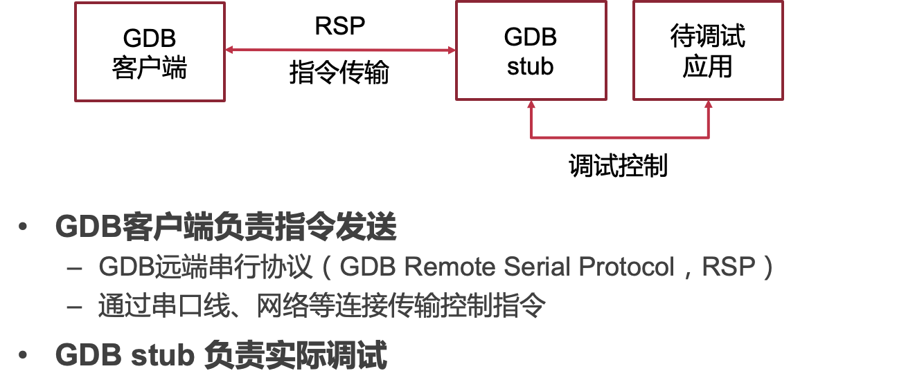
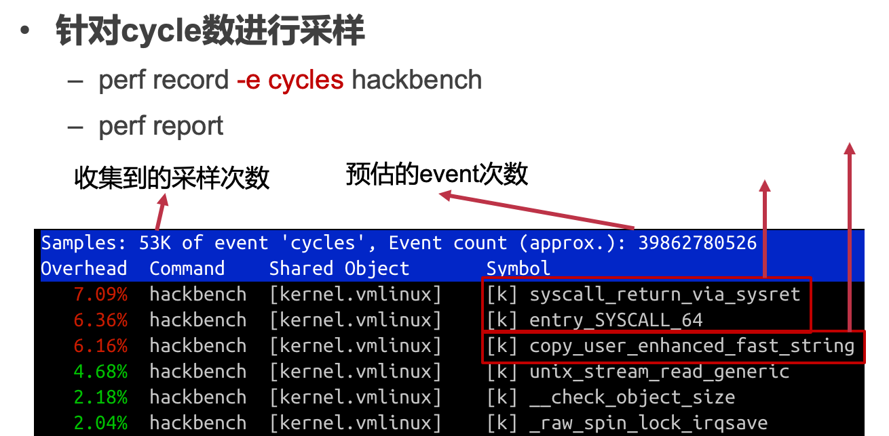

# OS Debug

## 1. 调试器的基本原理

#### 调试器的作用与功能

作用：定位和修复BUG，帮助程序员理解程序行为

基本功能：

- 中断程序运行读取内部状态
- 获取程序异常退出原因
- 动态修改软件状态
- 控制流追踪

#### 调试器 – 建立调试关系

- **Linux的调试支持：ptrace系统调用**
  - GDB建立调试控制关系
    - 子进程通过PTRACE_TRACEME将调试权交给父进程
    - 通过PTRACE_ATTACH调试指定pid的进程
  - 如何调试下述触发除零错误程序

#### GDB捕捉异常信号流程

#### 调试器 – 配置断点

- 需求2: 停止进程运行，用以观察进程状态
  - 发送SIGINT至进程
  - 或断点：在执行到特定指令地址时停止运行
- 使用断点调试
  - 在第4行插入断点
  - 观察变量a的值是否为0

#### 断点的硬件支持

- 断点异常指令
  - 在执行到特定指令时，触发断点异常陷入内核
  - x86的int 3指令，AArch64的BKP指令
- 单步调试
  - 程序在用户态执行一条指令后立即陷入内核
  - 通过特殊寄存器配置：x86的Trap Flag，AArch64的Software Step

#### GDB配置断点及断点触发

#### GDB断点恢复运行

#### 调试器 – 配置内存断点

- 需求3: 变量遭到异常修改时中断运行
- 内存断点
  - 在变量a被修改时中断运行，观察是否为0

#### 内存断点的硬件支持

- Naïve实现
  - 把内存地址所在页设为只可读
  - 访问时触发page fault
  - 缺点：对该页所有写操作均导致page fault，性能较差
- 断点寄存器
  - 当访存地址为寄存器中的值时，触发断点异常

#### 断点寄存器

- x86断点寄存器
  - 访存地址等于断点寄存器触发中断
  - 访存条件可配置
    - 数据写 （内存断点）
    - 数据读和写 
    - 指令地址（断点）
- GDB配置被调试应用的断点寄存器
  - 通过PTRACE_POKEUSER设置

#### 远程调试

## 2. 操作系统的调试器支持

#### 操作系统调试器常见实现方法

- 调试操作系统调试支持的难点
  - 缺乏操作系统提供给用户态的调试功能支持
  - 硬件相关问题，如外部设备、页表等
- 模拟器
  - 虚拟机：完整模拟底层硬件，在模拟器中提供GDB stub
  - 用户态模拟：例如 User-mode Linux，忽略硬件相关的实现，使Linux内核以普通进程的方式运行
- 内核自身实现的调试器
  - 操作系统内部实现GDB stub，如Linux的KGDB

#### 案例：QEMU的GDB支持

- 与调试普通进程对比
  - 不再有进程抽象相关的支持（如signal和系统调用跟踪）
  - ptrace相关接口替换为虚拟机管理接口
    - 如内存读写由PTRACE_POKETEXT替换为直接读写虚拟机内存（假设hypervisor能直接访问虚拟机内存）
- 挑战
  - 不能干扰客户机操作系统内部使用调试功能
  - 断点指令失效
    - 动态代码装载覆写断点指令使断点失效

#### 断点指令相关问题

- 使用断点指令在操作系统调试中的困难
  - 动态代码装载复写断点指令使断点失效
  
  > 动态代码装载（Dynamic Code Loading）是指在程序运行时动态加载和执行代码的过程。传统的静态编译方式在程序编译阶段将所有的代码编译为可执行文件，而动态代码装载则允许程序在运行时根据需要加载和执行代码，从而提供了更大的灵活性和动态性。
  >
  > 动态代码装载通常涉及使用特定的编程技术和API来实现。具体来说，动态代码装载可以包括以下步骤：
  >
  > 1. 加载代码：在运行时，程序使用相关的API或机制从外部文件或其他来源加载代码。这些代码可以是预先编写好的模块、插件、动态链接库（DLL）或共享对象等。
  >
  > 2. 代码解析：加载的代码需要进行解析，以获取函数、变量和其他相关的符号信息。这可以通过符号表、元数据或其他约定来实现。解析过程将使程序能够识别和访问加载的代码中的特定功能和资源。
  >
  > 3. 内存分配：为了执行加载的代码，程序需要在内存中为其分配空间。这可能涉及动态分配内存或使用操作系统提供的内存映射机制。分配的内存将用于存储加载的代码、数据和相关的执行环境。
  >
  > 4. 代码执行：一旦代码加载和内存分配完成，程序可以通过调用相应的函数或入口点来执行加载的代码。这将导致加载的代码在程序的上下文中运行，从而实现所需的功能或扩展。
  >
  > 动态代码装载的主要优点是增加了程序的灵活性和可扩展性。它允许程序在运行时动态加载和卸载代码，从而实现模块化的设计、插件系统、动态功能扩展和热更新等特性。动态代码装载在许多应用领域都有应用，包括动态语言解释器、插件式应用程序、动态网页技术和即时编译器等。
  
- 解决方法：硬件断点
  - 指令地址等于断点寄存器即触发中断
  - 缺点：影响虚拟机内部使用硬件断点

## 3. 性能调试

#### 为什么需要性能调试

程序功能性正确，但性能未达到理想情况，分析程序性能瓶颈：

- 程序运行时哪部分代码耗时较长
- 哪部分内存发生较多缓存缺失
- 跳转指令是否发生大量错误预测

#### 硬件计数器

- 监控程序执行过程中处理器发生某些事件的次数
  E.g., 执行指令数量，各级缓存缺失（cache miss）次数
- 使用方法1:  获取事件发生次数
  - 设置事件类型，打开计数器
  - 一段时间后读取计数器
    - 用户态通过特定指令或系统调用读取
  - 使用该方法分析 hackbench 性能瓶颈仍需大量插桩，意义不大

#### 硬件计数器 – 采样

- 直接读取计数缺点
  - 缺点：可能涉及对原有代码修改（插桩）
- 使用方法2: 采样
  - 设置事件类型，打开计数器
  - 当计数器溢出时，产生中断
    - 在中断处理中获取地址信息
    - 清空计数器，等待下一次中断
  - 分析 hackbench 性能瓶颈：每经过一定cycle数触发一次中断，统计中断时指令地址，观察这些地址属于哪些函数

#### Linux性能计数器采样支持

- 性能相关事件 perf events
  - 以event的抽象暴露性能计数器（以及一些其它性能调试方法）
  - perf_event_open通知内核需要使用哪些计数器
  - 采样过程由内核完成
  - 采样结果放入内核与用户态共享的内存中，减少读取大量采样信息时的开销
- 前端工具perf
  - 直接使用perf events相关系统调用仍然较复杂
  - perf工具包装常见的性能分析方法

#### 采样分析hackbench

#### 基于中断采样的缺点

- 中断时收集信息的缺陷
  - 采样获取的指令地址不准确
    - 中断发送需要时间，CPU收到中断时的指令地址，与产生采样点指令地址可能存在偏移 （skid）
    - 乱序执行
  - 中断时无法收集完整的采样信息
    - E.g., 缓存缺失时，对应的内存地址未知
- 更精确的采样支持需要：
  - 计数器溢出时马上收集信息
  - 能够收集更广泛的信息

#### 精确采样硬件支持

例如x86的PEBS (Processor/Precise Event Based Sampling)：计数器溢出时，立即记录相关信息至内存（其实还是会有一定的时间差）

- 有无必要启用精确采样分析 hackbench（–perf record -e cycles:ppp hackbench）
  - 不具备必要性：即使指令地址有偏移，针对cycle数采样情况下，各函数收到中断的概率大致不变
- 何时需要启用精确采样：
  - 需要确定发生特定事件（缓存缺失、跳转预测失败）时指令地址
  - 需要除了指令地址外的其他采样信息
  - E.g., 获取缓存缺失地址：perf mem record

#### 基于软件的控制流追踪

backtrace：根据调用栈递归获取上层调用者

缺点：

- 编译器优化可能去除栈指针存储
- 只能处理函数调用
- 无法应对jmp、中断等导致的控制流变化

#### 基于硬件的控制流追踪（属于PEBS）

- 记录jmp、call、中断等导致跳转的前后位置，构建完整控制流
- e.g., Last Branch Record (Intel)：两组寄存器分别构成栈，记录最近N次跳转的信息

#### 追踪hackbench控制流

- 指示perf采样时记录控制流变化：
  - perf record -e cycles -g hackbench
  - perf report

#### 程序执行追踪

- 步骤一：确定哪些函数占用了较长执行时间 - 采样
- 步骤二：确定是如何执行到该函数的 – 控制流跟踪
- 步骤三：理解程序行为，为什么会产生这种调用关系
  - hackbench 中大量时间处理socket读写，读写数据规模有多大
  - 作为调度测试，hackbench 是否对调度器产生了足够压力-静态追踪
- 需要具有更多程序语义的跟踪机制

#### 静态追踪方法

- 在代码编写时静态插桩获取信息的方法
  - 简单可靠的方法：打印
  - 在常用的函数中预置静态的跟踪函数，打印可能造成性能开销
    - 提供打开或关闭选项，关闭时应几乎不产生性能开销
    - e.g., Linux 的 Tracepoint

#### 分析hackbench中线程切换

Tracepiont作为perf event事件：perf record -e sched:sched_switch hackbench

- 作为调度测试，hackbench确实触发了大量调度
- 获取了调度前后进程名、pid、优先级等信息

#### **静态追踪方法缺陷**

- 修改静态定义的跟踪点需要重新编写、部署内核

- 比如，Hackbench中，已知socket读操作耗时较长，希望判断是否是数据量较大导致的，但是vfs_read没有预置静态Tracepoint

#### 动态追踪方法

程序运行时，在不确定的代码位置插入一段动态指定的追踪函数，e.g., Linux kprobe，实现方式类似于断点调试

#### Linux动态追踪方法kprobe

使用和调试器类似的原理动态插入代码：e.g., 配置handler函数在执行 指令2 之前执行

#### example：分析hackbench数据读写大小

## 4. 测试的基本原则和方法

#### 测试的目的

- 验证程序功能正确性
  - 程序是否会崩溃
  - 功能是否与设计一致
- 基准测试：确定程序在特定运行环境下的性能指标
- 操作系统测试的必要性：作为基础设施，操作系统的正确性和性能直接影响上层应用

#### 操作系统测试的基本方法与原则

- **测试规模由小至大：小规模测试中暴露的错误更方便定位**

  - 单元测试：以函数或功能模块为粒度测试

    - ChCore：单独编译内存管理、调度器等模块，在无需运行内核条件下测试

    - Linux：KUNIT，仅编译部分代码，在UML模式下运行

  - 单元测试完成后进行集成测试

    - 集成测试：整合各个功能模块统一测试

    - ChCore：完整部署内核并运行用户态应用，对网络、文件系统、同步原语等测试
    - LTP（Linux Test Project）针对大部分系统调用进行测试

- **代码迭代中，尽早确认新修改是否引入** **BUG**

  - 产生BUG的原因
    - 新的修改本身异常
    - 代码修改触发原有隐藏的异常

  - 回归测试
    - 小规模代码修改后马上运行测试，即使该测试与修改部分无直接关系
    - ChCore：每次代码被push到远端，以及代码合并进主线前，都会运行完整的测试

#### 兼容性测试

> 确保操作系统能够运行在不同硬件平台，支持各类不同应用

- 测试不同硬件环境下兼容性:

  - ChCore：各类测试在虚拟化的x86，虚拟化的AArch64，真实的AArch64硬件均部署运行

  - Linux：kernelci 验证Linux在各类不同硬件上能否完成基本测试

- 测试向上能否兼容应用
  - 向后兼容性，操作系统开发迭代后仍能运行较老的应用
  - 不同操作系统间如何提供统一的接口
    - 如针对Linux开发的应用能够部署在众多Linux发行版中
  - 遵循各类标准
    - 如Linux目录树标准 FHS (Filesystem Hierarchy Standard)
    - 如API 标准 POSIX (Portable Operating System Interface)
  - 针对标准进行测试
    - 使用 POSIX Test Suite 验证 POSIX 接口符合标准

#### 操作系统稳定性

> 基本功能正常前提下，需要确保极端状况下操作系统的正常运行

- 压力测试
  - 压榨处理器、内存、I/O等资源至极限
  - 频繁进行系统调用
- 长时间测试 (长稳测试)
  - 提高测试时的代码覆盖率
  - 未测试代码出现异常概率更高

#### 压力测试案例： syzkaller模糊测试

**模糊测试（fuzzing）**:

- 为操作系统构造大量随机系统调用并执行
- 系统调用参数随机变化，期望能覆盖更多代码
  - 但是纯随机变化参数效果不佳, 大量输入可能属于同一等价类，代码执行路径相同
- 基于变异（mutation）的参数生成: 在已有参数基础上随机变化
  - 部分随机变化会引入新的代码覆盖
  - 收集产生新代码覆盖的输入，作为新的等价类
  - 在新输入基础上继续变异

- 多个虚拟机运行操作系统
  - 提升测试效率
  - 虚拟机内部不断进行：
    - 系统调用
    - 系统调用参数变异
    - 收集代码覆盖信息
- 共享语料库: 提升变异的效率

#### 性能测试

> **定量比较不同软硬件配置下性能表现**

- 选择合适的测试程序
  - 明确测试的性能指标（如吞吐量，延迟等）
  - 明确测试的场景（如文件系统读写测试使用顺序还是随机）
  - 已有测试不满足需求时可以自己实现测试程序, 但必须确保测试符合真实场景，有代表性

- 控制无关变量
  - 以文件系统测试为例
  - 软件配置：文件系统类型，配置（日志级别，缓存）
  - 硬件配置：硬盘种类和型号
  - 其他无关因素：内核版本，时钟中断频率，无其它占用大量资源的应用
- 减少随机不稳定因素
  - 考虑预热一段时间再测试
  - 绑核心运行
  - 避免跨NUMA节点的内存访问

#### 持续集成

> **有效地进行和管理测试**

- 持续集成 ( CI, Continuous Integration )
  - 开发者较频繁地将代码合并入主线，使用自动化测试保障代码正确性
  - 自动化部署和回归测试
    - ChCore：代码在push到远端分支时，自动开始进行如下流程
      - 各个平台版本内核的编译
      - 静态检查工具分析
      - 各模块单元测试和整体集成测试
      - 针对IPC和系统调用的性能测试

- 门禁系统：确保主线代码的可靠性
  - 通过自动化测试才能合并进入主线
  - ChCore的门禁设置：按顺序通过如下测试

