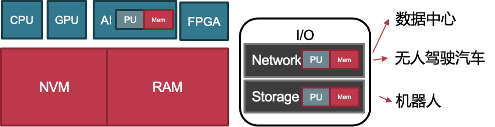
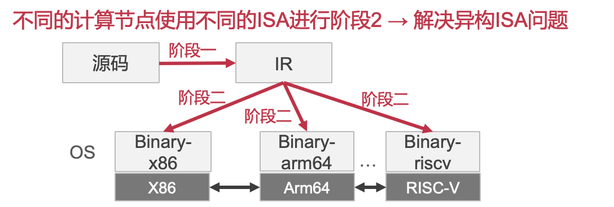
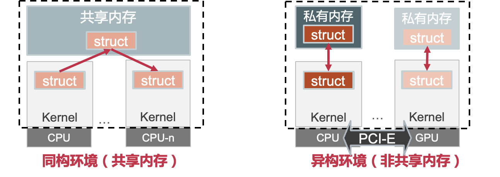
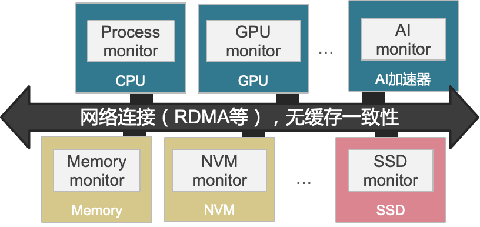
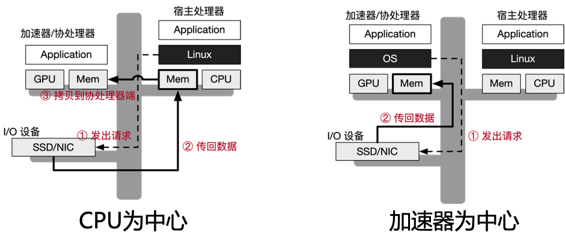

# 31. **操作系统研究前沿**

## 1、异构操作系统

#### background： 硬件发展的趋势：多样化与异构化

- 异构计算：CPU、GPU、FPGA、AI加速器等
- 异构存储：DRAM、NVRAM、PIM等
- 异构I/O：智能网卡、智能SSD等

#### 为什么需要异构硬件？

- 硬件能力很难再提升单个CPU核性能（摩尔定律的结束）
- 上层应用对架构的性能提出了更高的要求
- CPU无法满足AI计算、图形处理等场景的计算需求
  - AI加速器、GPU等异构计算和CPU并存
- DRAM容量受限 → NVM可以提供更大的内存容量
  - DRAM和NVM等多种内存并存
- 数据中心和云需要更大的IO带宽和更低的时延
  - RDMA、以太网卡、智能I/O设备等并存

> 为什么需要异构？
>
> 摩尔定律不一定再成立 → CPU核的计算能力受限
> DRAM和NVM存在性能/容量的trade-off

#### 思路：两阶段编译解决异构ISA问题

- 阶段1：从源码编译得到一个中间表示 (IR)，分发IR给使用者
- 阶段2：当决定在具体的平台上运行时，将IR生成binary
  - 根据具体部署的计算节点编译出不同指令集的二进制

#### 挑战-2：内核/应用在跨总线的环境下的同步和通信

- 异构硬件间通过多种总线连接，无共享内存和缓存一致性

  

#### 思路：多内核抽象——每个设备运行一个monitor

- OS也被拆分到不同设备上的monitor中，类似Multikernel
  - CPU上负责OS进程管理
  - Memory monitor上负责OS内存管理
  - 通过RDMA等快速网络通信

> 不同的应用需要不同的硬件资源：CPU个数、memory大小和类型、存储类型、是否要用其他加速器。
> Splitkernel通过在每个设备上增加一个monitor，支持通过网络动态拼接处一个异构分布式的OS。
> 不同的monitor负责OS中的不同功能，monitor和monitor之间通过快速网络如RDMA进行通信。

#### 挑战-3：CPU提供OS服务容易成为系统性能瓶颈

- 各种加速器等异构计算单元依赖于CPU提供OS服务
  - 以CPU为中心的OS服务：需要两次拷贝，性能开销大
  - 以加速器为中心的OS服务：加速器不适合执行如网络协议栈等OS服务

> CPU为中心的设计:CPU发起IO操作，数据拷贝到CPU上，然后CPU再DMA到加速器 → 两次拷贝，慢
> 加速器为中心： 只有一次拷贝，但是加速器适合并发代码，而不是线性处理和跳转代码，让加速器执行OS的协议栈等性能很慢

#### 思路：CPU负责控制流，加速器负责数据流

